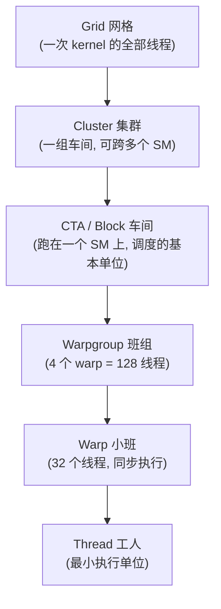
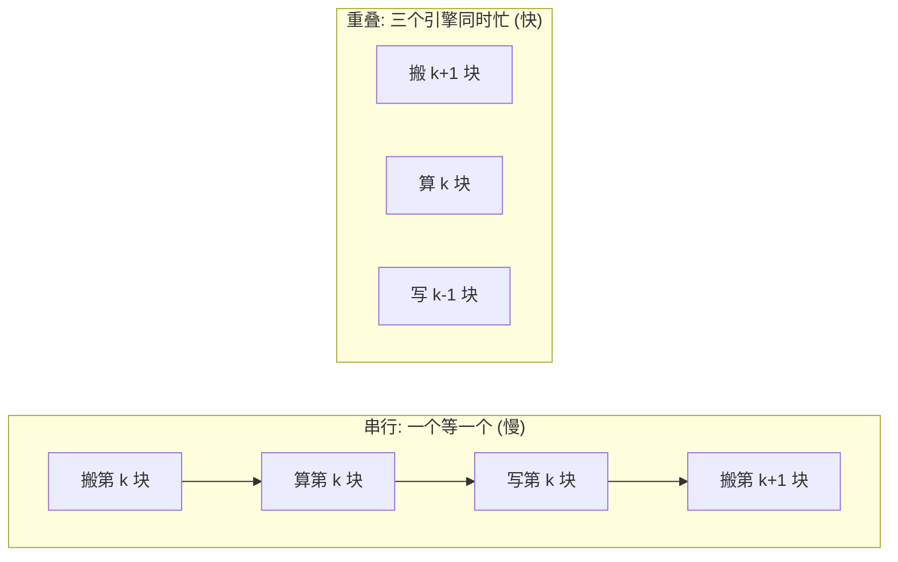

# 第 0 章 · 写给纯新手:GPU & ML Infra 极简入门

> **本章是中文笔记新增的"地基"章**,原书没有对应章节。如果你会写代码(Python / C++ / 后端 / 数据都行)但几乎没碰过 GPU——没写过显卡程序、没听过 CUDA、不知道"并行"在硬件上到底是怎么回事——**请从这一章开始**。读完它,你再翻后面任何一章,那些满天飞的 warp、SMEM、tile、MMA 才会有画面感,而不是一堆吓人的黑话。
>
> 我会假设你**完全没有 GPU 背景**:每个新词第一次出现,我都当场用大白话把"它是什么、为什么会有它"讲清楚,绝不甩个英文缩写就往下跑。你只要会编程、肯动脑,就一定能读懂。

> **本章要点(TL;DR)**
>
> 下面这几条你现在看不太懂没关系,这就是本章要逐条讲明白的东西。先扫一眼,有个轮廓:
>
> - GPU(图形处理器,就是你电脑里那张"显卡"上的芯片)不是"一颗更快的 CPU",而是一座**超大并行工厂**:几万个很弱的小工人(它们叫**线程**)被编成班组一起干活。
> - 三件事撑起整本书:**谁来干活**(线程是怎么分层组织的:thread / warp / lane / warpgroup / CTA / cluster)、**东西放哪**(数据放在哪种内存里:寄存器 / 共享内存 / 全局内存 / 张量内存)、**到底在算什么**(矩阵乘 GEMM 和注意力 Attention 这两种运算)。
> - GPU 跑得快的秘诀,归根到底就一个词:**重叠(overlap)**——让"搬数据"和"做计算"同时进行,谁也别干等着谁。
> - 这本书讲的是 NVIDIA(一家做 GPU 的公司)**最新的 Blackwell 架构**,以及一种用来写 GPU 程序的语言 **TIRx**。这两个名字现在记不住完全没关系,本章末尾会点一下。
> - 这一章只求"听个大概、建立画面"。每个概念后面都有专门的章节细讲,所以**看不懂的细节先放过,心里有个印象就行**。

---

## 0.1 先说清楚:这本书在讲什么,你为什么需要先读这一章

这本书讲的是**怎么把 GPU 榨干、写出"飞快"的计算程序**——尤其是深度学习里最吃算力的两个运算:**矩阵乘法(GEMM)** 和 **注意力(Attention)**。

先解释一个会反复出现的词:**内核(kernel)**。在 GPU 的世界里,"kernel"不是操作系统那个内核,而是指**一段专门跑在 GPU 上的函数/程序**。你在 CPU 上(比如用 Python)发起一次调用,把活儿派给 GPU,让那几万个线程一起跑这段代码——这一整段就叫一个 kernel。所以本书说的"写内核",你就理解成"写一段要在 GPU 上飞快跑的函数"。

问题在于:原书默认你已经懂 GPU 是怎么工作的,所以一上来就甩出 warp、共享内存、Tensor Core 这些词……对一个没写过 GPU 的人,这就像没学过加减乘除就被拉去听微积分,只会一脸懵。

所以这一章的任务很简单:**用大白话,把后面会反复出现的那套基础词汇,一次性给你讲明白。** 不求深,只求你心里有画面。读完这章,你不会变成 GPU 专家,但后面那些黑话你至少都"见过、知道大概是干嘛的"。

---

## 0.2 一个贯穿全书的比喻:GPU 是一座"超大工厂"

在讲任何术语之前,我先给你一个**贯穿全书的画面**。后面每出现一个新概念,你都可以把它挂回这座工厂里,马上就有了着落。

把 GPU 想象成一座工厂,你大概就抓住八成了:

- **工人 = 线程(thread)**:线程就是"一条正在执行的指令流"。数量极多(一次能有几万个),但每个都很弱、只会干很简单的活。和 CPU 那种"少数几个强壮工人"完全相反,GPU 是"海量弱工人靠人多取胜"。
- **班组 = 线程的层级**:这几万个工人不是一盘散沙,而是 32 人一个**小班(warp)**、几个小班一个**车间(CTA)**……一层一层编起来,方便分工和协作。
- **仓库 = 各级内存**:数据存放的地方分好几档。有的"仓库"就在工位手边(快但极小),有的在车间角落(中等),有的在厂区外的大仓库(巨大但很远、取一趟慢)。
- **专用机床 = Tensor Core(张量核)**:普通工人(它们叫 **CUDA 核**)啥都能干但做矩阵乘很慢;而工厂里另有几台专门做"矩阵乘"的高速机床(Tensor Core),一开起来,产量甩开普通工人一个数量级。
- **传送带 = 数据搬运引擎(TMA)**:专门负责把原料从大仓库运到工位,而且**它运货的时候不占用工人的手**——工人可以一边等货一边干别的。

这些词(warp、CTA、Tensor Core、TMA……)现在都只是先混个脸熟,下面每一节会把它们一个个拆开讲。

> **关键**:工厂效率高不高,**不在于某一个工人跑得多快,而在于那几台高速机床别停**。只要传送带能源源不断地把原料及时送到,高速机床就能一直满负荷转。让机床不停转——这就是后面整本书一直在折腾的核心目标。

---

## 0.3 谁来干活:线程的层级

> **一句话先理解**:GPU 把几万个线程像"班级—小组—个人"那样**分层管起来**,每一层都是为了让"某个规模的协作"变简单。

先说"为什么要分层"。假设你手里有几万个工人,你会怎么管?肯定不会让他们一盘散沙地乱跑,而是分班分组——这样"两个人之间传句话"和"全班一起做件事"才好安排。GPU 也一样:有时两个线程要互相交换一个数,有时一整个车间要共用一块数据。如果不分层,这些协作就没法高效进行。**所以 GPU 不把几万个线程当成一个扁平的大池子,而是一层层嵌套地组织起来,每一层都对应"某个尺度上的协作"。**

从小到大,一共六层:

逐个认识一下(**这张表是全书最该记住的一张**,建议反复回看):

| 名字 | 是什么 | 大白话 |
| --- | --- | --- |
| **线程 / thread** | 最小的执行单位。它有自己的"程序计数器"(记着自己跑到第几行)和一小撮私有寄存器(下文讲) | 一个工人 |
| **lane(通道)** | warp 里某个线程的**编号(0~31)** | 工人在小班里的**座位号**。注意:lane 不是一种新硬件,它就是"这个线程在它那个小班里排第几号" |
| **warp(线程束)** | **32 个线程**被硬件捆成一组,同一时刻发同一条指令 | 一个 32 人小班,动作整齐划一,口令一响 32 个人同时迈步 |
| **warpgroup(线程束组)** | **4 个 warp = 128 个线程** | 4 个小班拼成的班组(较新的架构才有这个概念) |
| **CTA / block(线程块)** | 一批线程,跑在**同一个 SM**(下面解释)上,能共用一块"共享内存" | 一个车间 |
| **cluster(集群)** | 一组 CTA,**可以分布在不同 SM 上**还能互相协作 | 几个车间联手 |
| **grid(网格)** | 一次 kernel 启动的**所有**线程 | 整个厂这一单活的全部人手 |

这里挑两个最容易绕晕的多说一句:

- **lane(座位号)有什么用?** 既然一个 warp 里 32 个线程动作一模一样,那怎么让它们各干各的一小份?靠的就是 lane 号。每个线程用自己的座位号(0~31)去算"我该处理哪一块数据"。打个比方:32 个人同时执行"去搬第 N 个箱子",但每个人代入的 N 不同(0 号搬第 0 箱、1 号搬第 1 箱……),整体就把 32 个箱子一次搬完了。
- **warp 为什么偏偏是 32?** 这是 NVIDIA 硬件定死的数字,你改不了,记住就行。后面所有"32"几乎都和这个有关。

> **关键**:这几层是"谁装谁"的包含关系,但**每一层具体装几个,有的硬件定死、有的你自己定**。硬性规定:一个 warp 永远是 32 个线程,一个 warpgroup 永远是 4 个 warp(= 128 线程)。可一个 **CTA(车间)里到底放几个 warp,是你写 kernel 时自己定的**——比如一个 128 线程的 CTA = 4 个 warp = 1 个 warpgroup;一个 256 线程的 CTA = 8 个 warp = 2 个 warpgroup。所以别把 warpgroup 当成 CTA 和 warp 中间一个固定的硬层级,它说白了就是"把相邻的 4 个 warp 凑成一组"的叫法,方便某些指令一次指挥 128 个线程。

还有两个一定会撞见的词,顺手认了:

- **SM(流式多处理器 / Streaming Multiprocessor)**:GPU 里真正干活的"车间厂房"。一颗 GPU 是由几十上百个 SM 拼出来的,而上面说的一个 CTA(车间),就跑在其中一个 SM 上。你可以把 SM 理解成"GPU 内部的一个独立小处理器",每个 SM 自带一批计算单元和它自己的那块共享内存。
- **SIMT(单指令多线程,读作 sim-tee)**:这是描述 GPU 工作方式的核心词。意思是 warp 里 32 个线程**发的是同一条指令,但各自处理自己那份数据**。换句话说,你只写一份代码,硬件让 32 个线程同时拿不同数据去跑它。这正是为什么 GPU 特别适合"对一大堆数据做同一种处理"(比如给一百万个数都加个 1)。

> **注意**:"32 个线程发同一条指令"并不等于"它们必须走同一个 if 分支"。硬件允许把某些 lane 临时"屏蔽"(停一下不动),所以同一个 warp 里有的线程走 `if`、有的走 `else` 是可以的——只不过这时硬件得**分两趟跑**(先跑走 if 的那批、再跑走 else 的那批),比 32 个人步调一致要慢。这个现象叫**分支发散(branch divergence)**,后面会提到,知道"分支不一致会变慢"就够了。

---

## 0.4 东西放哪:内存的层级

> **一句话先理解**:GPU 的存储分好几层,**越靠近工人的越快但越小,越远的越大但越慢**;写得快不快,很大程度上就是看你有没有把数据放对层。

为什么内存要分层?因为"又快又大"的存储造不出来(造得出也贵得离谱)。所以硬件工程师妥协:做一点点"飞快但极小"的,再做一大块"巨大但慢"的,中间再垫几层。你写程序时的本事,就在于**尽量让数据待在快的那几层**,少往慢的大仓库跑。这和 CPU 上"CPU 缓存命中率"的道理是一样的,只不过 GPU 把这几层**摊开来让你亲手管**。

| 名字 | 在哪 | 谁能用 | 特点 | 工厂比喻 |
| --- | --- | --- | --- | --- |
| **寄存器 / Register(RF)** | 紧贴计算单元 | **每个线程私有** | 最快、最小 | 工人手里攥着的几个零件 |
| **共享内存 / SMEM** | SM 片上 | **一个 CTA 内共享** | 很快、不大 | 车间中间的公用工作台 |
| **全局内存 / GMEM(也叫 HBM)** | 显存 | **所有线程都能访问** | 很大、相对慢 | 厂区外的大仓库 |
| **张量内存 / TMEM** | SM 片上(Blackwell 新增) | 给 Tensor Core 放累加结果用 | 专用 | 高速机床旁边的专属料台 |

挨个用程序员熟悉的东西打个比方:

- **寄存器**:和 CPU 寄存器是一回事——CPU 上变量临时算一算放寄存器里最快。GPU 区别只在于**每个线程都有自己的一份寄存器**,互不干扰。数量很少,所以特别金贵。
- **共享内存 SMEM**:你可以把它当成"**一块要你手动管理的高速缓存**"。CPU 缓存是硬件偷偷帮你缓存,你管不着;GPU 的 SMEM 是**你自己决定**把哪块数据搬进来、给同一个车间(CTA)里的线程共用。它比大仓库快很多,但只有几十~几百 KB,放不下太多。
- **全局内存 GMEM(也叫 HBM,显存)**:就是显卡上那几十 GB 的大内存,所有线程都能读写,容量大但路远访问慢。模型权重、输入数据一开始都躺在这里。
- **张量内存 TMEM**:最新的 Blackwell 架构才有的一块小专用内存,专门给高速机床(Tensor Core)放计算的中间结果,这个 0.5 节会细说。

数据的典型流向就是:**从大仓库(GMEM)搬到工作台(SMEM)→ 工人/机床在快内存里计算 → 结果再写回大仓库(GMEM)**。整本书的优化,几乎都绕着"怎么少搬、搬得巧、算得快"打转。

这里有两个"性能杀手",在 GPU 里极其要命、后面会反复出现,先混个脸熟。它们都源于同一个事实:**warp 里 32 个线程是一起去访存的,所以它们要的地址"摆得齐不齐"会直接决定快慢。**

- **访存合并(coalescing)**:当一个 warp 的 32 个线程同时去大仓库读数据时,如果它们要的 32 个地址**正好首尾相连(连续)**,硬件就能把这 32 次访问打包成 **1 次**搬完;可如果它们要的地址东一个西一个,就可能被拆成 32 次单独的访问。**一次 vs 三十二次,差几十倍。** 所以"让相邻线程读相邻地址"是 GPU 性能的头等大事。
- **bank 冲突(bank conflict)**:共享内存(那块工作台)在硬件上被切成 32 个并排的小格子,叫"**bank(存储体)**"。32 个线程如果各读各的格子,能同时进行,飞快;可如果好几个线程挤到**同一个格子**去读不同位置,硬件就只能让它们排队一个个来,慢。为了避开这种"挤同一个格子"的情况,后面会专门去折腾数据在共享内存里的**摆放方式**(术语叫"布局 layout"和 "swizzle 换序",别急,到时候会讲)。

> **关键**:GPU 编程里大量看起来很玄的"奇技淫巧",归根结底都在回答同一个问题——**怎么把数据摆好,让一个 warp 的 32 个线程读起来又快又不互相打架。**

---

## 0.5 到底在算什么(一):矩阵乘 GEMM

> **一句话先理解**:深度学习的算力几乎全花在"矩阵乘"上;而大矩阵算不动,就**切成小方块(tile)**一块块算。

深度学习里最核心、最吃算力的运算,就是**矩阵乘法**。专业点叫 **GEMM**(General Matrix Multiply,通用矩阵乘),但本质就是你中学学过的 `C = A × B`:两个矩阵相乘,得到第三个矩阵。

为什么说它是主角?因为神经网络里你听过的那些层——全连接层、卷积、注意力——拆到最底层,绝大部分计算都是矩阵乘。所以"GPU 跑得快不快",很大程度上就等于"GEMM 跑得快不快"。本书后面一半篇幅,都在教怎么把这一个运算榨到极致。

**关键概念:tile(分块)。** 现实里的矩阵动辄 4096×4096 这么大,一次根本算不完,更塞不进前面说的那些"又快又小"的内存。怎么办?**切块。** 把大矩阵切成一个个固定大小的小方块(比如 128×128),每次只搬进来一小块、算一小块,算完换下一块。这个小方块就叫 **tile**。整本书你会看到无数次这个词——记住它就是"**大矩阵切出来的、便于一次处理的小方块**"就行。

**还有一个公式你会反复看到:`D = A·B + C`。** 别被它唬住,它就读作"**乘了再加**":

- `A`、`B`:要相乘的两块小矩阵(tile);
- `C`:**之前已经累加到现在的中间结果**;
- `D`:把这一步的乘积加上 `C` 之后的新结果。

为什么非得"加上 C"?这是切块带来的必然结果。回想矩阵乘的算法:结果矩阵里的每个位置,都等于一行乘一列、把一串乘积加起来。当我们把矩阵切成小块、一块一块算时,**最终某个位置的值,就是好多小块的乘积一点点累加出来的**。所以每算完一块,都要把它"加进"之前的累计值里。

那个从头累到尾、一直在被加的 `C`/`D`,就叫**累加器(accumulator)**——你可以理解成"一个一直在累加的求和变量",只不过它是一整块矩阵。

累加器放哪儿,其实是门大学问。它往往不小,而且要从第一块一路累到最后一块,**全程都得占着存储空间**。要是让它一直霸占着每个线程那点**本来就稀缺的寄存器**,工人手里就腾不出地方干别的活了。所以最新的 Blackwell 架构干脆给它单开了一块专用片上内存——就是 0.4 里提到的 **TMEM**,专门用来摆累加器,把宝贵的寄存器解放出来。(这条线索,第 6 章会细讲,现在有印象即可。)

---

## 0.6 到底在算什么(二):Tensor Core 与 MMA

> **一句话先理解**:GPU 里有一种专做矩阵乘的"高速机床"叫 **Tensor Core**,它一口吞下两块 tile、直接吐出乘加结果;让它别闲着,就是性能的命门。

上一节说矩阵乘是主角。那 GPU 是用什么去算它的?这里要区分两类"算手":

- **CUDA 核(CUDA Core)**:通用的标量计算单元,什么都能算(加减乘除、判断大小、算地址),相当于工厂里的普通工人。灵活,但让它一个数一个数地去拼矩阵乘,**慢**。
- **Tensor Core(张量核)**:**专门为矩阵乘打造的固定功能硬件**——就是那台高速机床。"固定功能"意思是它只会干一件事(矩阵乘加),但干这件事快得离谱:它一次就能吞下两块 tile,直接算出 `D = A·B + C`,吞吐量比一堆 CUDA 核高一个数量级以上。

Tensor Core 干的这个"小块矩阵乘加"动作,有个专门的名字叫 **MMA**(Matrix Multiply-Accumulate,矩阵乘累加)——其实就是上一节那个 `D = A·B + C`,只不过强调"由 Tensor Core 一气呵成地做"。你后面还会撞见 `wgmma`、`tcgen05` 之类的词,它们是**不同代 GPU 上发起 MMA 的具体指令名**;现在你只需要在心里翻译成"哦,这是在让 Tensor Core 算一次矩阵乘"就够了,不必记。

> **关键**:现代 GPU 之所以能跑得动大模型,核心功臣就是 Tensor Core。后面大半本书的所有折腾,本质都是为了一个目的——**让 Tensor Core 一刻不停地有数据可算,别让这台贵机床闲着。**

---

## 0.7 怎么喂数据:异步搬运、流水线与"重叠"

> **一句话先理解**:GPU 提速的终极武器是**重叠**——让"搬数据"和"做计算"同时进行,而不是搬完了再算、算完了再搬。

Tensor Core 这台高速机床再快,**没数据可算也只能干瞪眼**。而数据躺在又远又慢的大仓库(GMEM)里,搬过来要花时间。所以"怎么及时把数据喂上去"和"怎么算"一样重要,甚至更重要。下面这几个词,就是 GPU 用来解决"喂数据"问题的工具:

- **同步 vs 异步**:这是关键的思路转变。**同步**的老办法是:让计算线程自己跑去搬数据——可它弯腰搬货的那段时间就没法算了,机床只能停着等,白白浪费。**异步**的新办法是:线程只是"下个搬运指令"(吩咐一声"把这块货运过来"),然后**立刻回头继续算**,搬货的脏活交给专门的硬件去干。"异步"在这里就是"我吩咐完不用等它做完,接着干自己的"。
- **TMA(张量内存加速器 / Tensor Memory Accelerator)**:就是上面说的那个专门搬货的硬件引擎(工厂里的传送带),负责在大仓库(GMEM)和工作台(SMEM)之间**成批、异步**地搬 tile,搬的时候完全不占用工人的手。
- **mbarrier(异步屏障)**:既然搬运是异步的、不等它做完就走了,那怎么知道"货到底搬到没、能不能用了"?总得有个通知机制。mbarrier 就是这个"**信号灯**":搬运引擎搬完了就把灯点亮,计算方看到灯亮才开始用这批数据。它负责在"搬的人"和"算的人"之间对暗号,避免有人拿到还没搬完的半成品。
- **流水线 / 重叠(pipeline / overlap)**:这是**全书的灵魂**。先想想不重叠会怎样:如果老老实实"搬完这块 → 算完这块 → 写完这块 → 再搬下一块"一步步串着来,那同一时刻永远只有一个环节在忙,其它都在干等,机床的利用率低得可怜。重叠的做法是让它们**像工厂流水线一样错开同时进行**:这会儿工人在算第 k 块的时候,传送带已经在搬第 k+1 块了,收尾环节还在写第 k-1 块的结果。三件事同时进行,谁也不等谁,整体自然快得多。

> **关键**:记住这一句,后面就不会迷路——**慢内核和快内核的差距,几乎全在"重不重叠"上。**

---

## 0.8 注意力(Attention)是什么,为什么在硬件上难

> **一句话先理解**:注意力 = **两次矩阵乘,中间夹一个 softmax**;难点是中间那个超大的"分数矩阵"既占地方又难算,得想办法别把它整个存出来。

如今的大语言模型基本都是 **Transformer** 架构(你只需知道这是当前主流大模型的"骨架"),而它的核心运算就是**注意力(Attention)**。抛开数学公式,它干的事可以这么理解:对句子里的每一个词,都去打量序列里所有其他词,算出"对当前这个词来说,该多关注谁、少关注谁",然后照这个"关注程度"把大家的信息加权汇总成一个新表示。

落到计算上,它就是**两次矩阵乘,中间夹一个 softmax**:

1. `S = Q · Kᵀ`:第一次矩阵乘,算出一个**分数矩阵(score matrix)** `S`,里面每个数代表"某个词对另一个词的关注分数"。它的形状是 `序列长 × 序列长`——所以序列一长,这个矩阵就**大得吓人**(比如 8000 个词,S 就是 8000×8000)。
2. `softmax(S)`:把 `S` 的**每一行**分数,换算成一组**权重**。具体做法是:这一行每个分数先取指数 `exp`(指数运算会把大的拉得更大),再各自除以"这一行所有 exp 值的总和"。这么一弄,效果是——分数大的被进一步突出、所有权重都变成正数、而且一行加起来正好等于 1。因为"加起来等于 1",所以叫**归一化**;你可以直接理解成"**把一行分数换算成百分比占比**"。
3. `O = softmax(S) · V`:第二次矩阵乘,用上一步那组"百分比权重"去把信息加权汇总,得到最终输出 `O`。

难点到底在哪?就在中间那个巨大的分数矩阵 `S`。如果老老实实把它整个存进显存,**又占地方又慢**(8000×8000 个数可不少)。更麻烦的是 softmax 这一步本身:它要除以"**一整行的总和**",而且为了计算稳定,还得先找出这一行的最大值。这就好像逼着你**必须先把一整行的分数全算出来、凑齐了**,才能开始做归一化——那不就等于非得把整个 S 都存下来吗?这正是矛盾所在。

著名的 **Flash Attention**(一种高效注意力算法)就是来破这个两难的。它的核心思路是:**坚决不把完整的 S 存下来**,而是把 K、V **一块一块地流式喂进来**,边算边维护两个"running(运行中)的小统计量"——目前为止见过的最大值、目前为止的累计总和;每来一块新数据,就用这两个统计量把之前算的结果**按比例修正一下**。这样既不用存整个 S,最后又能得到和"老老实实做完整 softmax"**一模一样**的答案。这套技巧怎么在硬件上高效实现,正是本书第 14 章的高潮。

现在你只需记住一句:**注意力 = 两个矩阵乘 + 中间一个 softmax,而工程上的关键是想办法别把那个超大的分数矩阵真的存出来。**

---

## 0.9 这本书的两个"新东西":Blackwell 与 TIRx

最后两个名字,扫个盲就行,记不住也不影响读前几章:

- **Blackwell**:NVIDIA **最新一代 GPU 架构**(代表显卡如 B200)。这里的"架构"指的是一代芯片的硬件设计代号。GPU 是一代代往上演进的:**Ampere(代表卡 A100)→ Hopper(H100)→ Blackwell(B200)**,每一代都会多出一些新硬件能力(比如 Hopper 那代带来了前面说的 TMA 和 warpgroup,Blackwell 这代带来了 TMEM)。本书专门讲 Blackwell,所以你会读到不少"只有最新卡才有"的特性——别拿它去套老显卡。
- **TIRx**:本书用来写 GPU 内核的**编程工具/语言**。它是一种 **DSL**——DSL(Domain-Specific Language,领域专用语言)就是"为某个特定领域量身定做的小语言",这里 TIRx 是嵌在 Python 里写的(随开源项目 Apache TVM 一起发布)。它最大的特点是:**让你直接、明确地点名硬件**(比如"这块数据放进 SMEM""这一步交给 Tensor Core 算"),而不像 PyTorch 那种高层框架把硬件细节全替你藏起来。正因为它把硬件摊开给你控制,才适合用来榨干 GPU。第 9 章开始会专门讲它。

---

## 0.10 术语速查表(读后面遇到生词就回来翻)

| English | 中文 | 一句话理解 |
| --- | --- | --- |
| thread | 线程 | 一个最小的工人 |
| lane | 通道 | 线程在 warp 里的座位号 0~31 |
| warp | 线程束 | 32 个线程的小班,同步执行 |
| warpgroup | 线程束组 | 4 个 warp = 128 线程 |
| CTA / block | 线程块 / 车间 | 跑在一个 SM 上的一批线程 |
| cluster | 集群 | 可跨 SM 协作的一组 CTA |
| grid | 网格 | 一次 kernel 的全部线程 |
| SM | 流式多处理器 | GPU 里真正干活的"车间厂房" |
| SIMT | 单指令多线程 | 一个 warp 同发一条指令、各算各的数据 |
| Register / RF | 寄存器 | 每个线程私有、最快最小的存储 |
| SMEM | 共享内存 | 一个 CTA 内共享的片上快内存 |
| GMEM / HBM | 全局内存 / 显存 | 所有线程可见、又大又慢 |
| TMEM | 张量内存 | Blackwell 给 Tensor Core 放累加器的专用内存 |
| coalescing | 访存合并 | 连续地址的访问合并成一次,极大提速 |
| bank conflict | bank 冲突 | 多线程挤同一存储体,被迫排队 |
| GEMM | 通用矩阵乘 | `C = A × B`,深度学习的算力主角 |
| tile | 分块 / 小方块 | 大矩阵切出来的固定大小小块 |
| MMA | 矩阵乘累加 | Tensor Core 干的活:`D = A·B + C` |
| accumulator | 累加器 | 一直累加中间结果的那块数据 |
| Tensor Core | 张量核 | 专做矩阵乘的高速固定功能硬件 |
| CUDA Core | CUDA 核 | 通用标量计算单元,啥都能算但慢 |
| TMA | 张量内存加速器 | 异步成批搬 tile 的专用引擎 |
| mbarrier | 异步屏障 | 协调异步搬运/计算的"信号灯" |
| overlap / pipeline | 重叠 / 流水线 | 让搬、算、写同时进行,快的关键 |
| epilogue | 收尾阶段 | 算完后把结果写回去的那一段 |
| Attention | 注意力 | 两个矩阵乘夹一个 softmax |
| swizzle | 换序摆放 | 打乱数据摆放以避开 bank 冲突 |
| Blackwell | (架构代号) | NVIDIA 最新一代 GPU 架构 |
| TIRx | (编程语言) | 本书用来写 GPU 内核的 Python 内嵌 DSL |

> **提示**:更全的术语对照见 [术语对照表](./术语对照表.md)。

---

## 0.11 该怎么读这本书

- **完全没基础**:先把这一章看完(细节不懂没关系),再从**第 1 章**顺着往下读。每读到一章卡壳,回这里的速查表瞄一眼。
- **会一点 CUDA**:可以快速扫过本章,直接进第 1 章;遇到 Blackwell 专属的 TMA / TMEM / warpgroup 再回头查。
- **只想看 GEMM / Attention 实战**:也建议先看完本章和第 1、2 章,否则第 11–14 章会很吃力。

完整的阅读路线见 [首页 README](./README.md)。

---

## 小结

这一章不指望你记住所有细节,只要在脑子里搭起三根支柱就够了:

1. **谁干活**:线程被编成 warp(32)→ warpgroup(128)→ CTA(车间)→ cluster,跑在一个个 SM 上。
2. **东西放哪**:寄存器(私有最快)→ 共享内存 SMEM(车间共用)→ 全局内存 GMEM(又大又慢),外加 Blackwell 的 TMEM。
3. **在算什么、怎么算快**:核心是矩阵乘 GEMM 和注意力 Attention;让 Tensor Core 不停转、让搬运和计算**重叠**,就是全书的主线。

带着这三根支柱,翻开第 1 章吧——你会发现那些黑话,忽然就有画面了。

## 延伸阅读

- 下一章:[第 1 章 · GPU 执行模型](./ch01_gpu_execution_model.md)(把本章的"谁干活、东西放哪"讲得更细)
- 速查:[术语对照表](./术语对照表.md)
