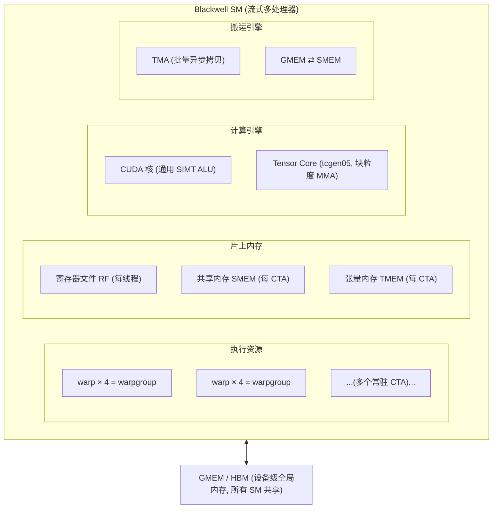
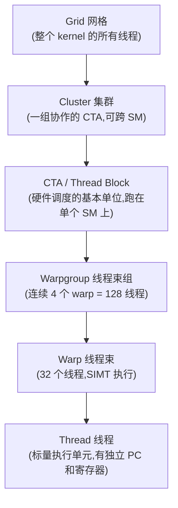
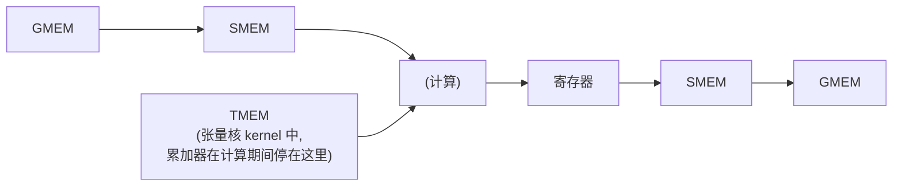
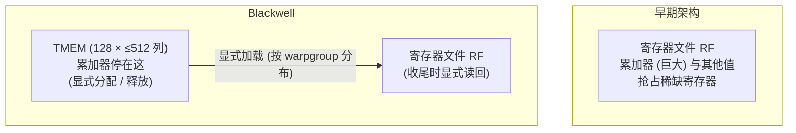
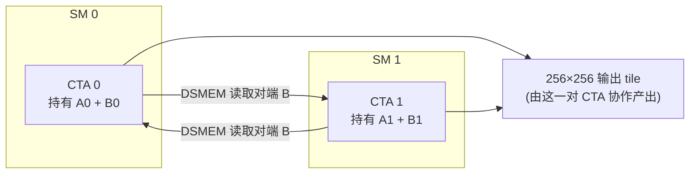

# 第 01 章 · GPU 执行模型

> 原文:[GPU Execution Model — Modern GPU Programming for MLSys](https://mlc.ai/modern-gpu-programming-for-mlsys/)

> **本章要点(TL;DR)**
>
> 别被下面这几个英文缩写吓到——它们都会在正文里一个个用大白话讲清楚。这里先放着,等你读完回头再看,会发现每条都懂了:
>
> - GPU 里有**成千上万个线程**(thread,就是"一条独立的执行流",你可以先把它想成一个最小的"干活的小工")。GPU 不是把它们一锅平铺,而是套了好几层、组成一个**嵌套层级**:线程 → 线程束(warp)→ 线程束组(warpgroup)→ CTA → 集群(cluster)→ 网格(grid)。每多一层,都是为了让"某个范围内的小工互相配合"这件事变得更便宜。
> - GPU 上跑的那段程序叫**核函数(kernel)**(可以先理解成"一段会被几千个线程同时各跑一份的函数")。一个 kernel 干的活,说穿了就是把数据在好几种**内存**之间来回搬、临时存:寄存器(RF)、共享内存(SMEM)、全局内存(GMEM),还有 Blackwell 这代新加的张量内存(TMEM)。最典型的搬运路线是 `GMEM → SMEM →(计算)→ 寄存器 → SMEM → GMEM`。
> - GPU 上算数的硬件分成两类:通用的 **CUDA 核(CUDA core)**,管的是算下标、逐个元素加减、求和、if/else 这类杂活;**张量核(Tensor Core)** 是块"专用电路",一条指令就能算完一整块矩阵的 `D = A·B + C`,算矩阵的速度比 CUDA 核快**十倍以上**。
> - 还有专门负责**搬数据**的硬件(比如 TMA),它的活儿就是把数据喂给上面那些算数的硬件。搬数据的和算数的,是**两套独立的硬件,各干各的,谁也不用等谁**(这就叫"异步")。
> - 把这些零件拼成一条矩阵乘(GEMM)的流水线之后,程序快慢的全部差距,就落在一个词上——**重叠(overlap)**:让搬数据、算数、收尾(epilogue)这三摊活儿**同时进行**,而不是排队一个等一个。

> **前置知识**:这是全书的基础章,**几乎不需要任何 GPU 背景**。你只要会写代码(Python、C++、后端、数据,哪种都行),知道"矩阵乘法"是什么(就是中学线性代数里那个 A 乘 B),就能往下读。至于 GPU 是怎么并行的、内存为什么分这么多层、矩阵乘为什么是主角——这些**本章会从零讲起**,不假设你碰过显卡、CUDA 或者任何硬件。要是连"GPU 大致在干嘛"都还没概念,可以先翻一下 [第 0 章 · 极简入门](./ch00_gpu_ml_primer.md);不翻也行,本章会兜住你。
>
> 还有一点先说在前头:这一章会冒出一堆英文缩写(SM、warp、CTA、TMEM……)。**别有压力**——每个词第一次出现时,我都会停下来用大白话把"它是啥、为什么要有它"讲明白,讲完了后面才接着用。你不需要提前背任何东西。

---

这是全书第一部分「硬件、内存与执行模型」的头一章。它就想干一件事:在你脑子里画出一张地图。

怎么画?分两步。第一步,把四块拼图——**执行层级**(线程是怎么分组的)、**内存空间**(数据存在哪)、**计算引擎**(谁来算)、**搬运引擎**(谁来搬数据)——**一块一块**讲明白。第二步,用一条 GEMM 流水线把这四块拼图**串成一条线**,让你亲眼看见数据是怎么在硬件里一站一站流动、各个零件又是怎么配合的。

> **一句话先理解**:GEMM(General Matrix Multiply,通用矩阵乘)就是"算 A × B 这样两个矩阵相乘"。为什么它这么重要、值得用一整章的流水线来讲它?因为深度学习模型里绝大部分的计算量,本质上都是一堆矩阵乘。把矩阵乘搞快了,模型就快了。所以全书都拿它当主角。

> **关键**:全书就围着一个核心观点转——后面几乎所有的优化技巧,说到底都在回答同一个问题:"怎么把活儿合理地铺到这几块拼图上?" 所以别把这一章当成可看可不看的背景。它是后面每一章都要用的一套词汇和坐标系,先打好这个底,后面才走得顺。

先看一眼 GPU 硬件长啥样。

> **一句话先理解**:你可以把一颗 GPU 想成一座工厂,工厂里有几十个一模一样的"车间"。每个车间自己就能独立干活——有自己的工人、自己的小仓库、自己的机床。GPU 里这个"车间",有个正经名字叫**流式多处理器(Streaming Multiprocessor,简称 SM)**。"多处理器"是因为一个 SM 里塞了一大把能并行干活的小单元。整章我们基本都盯着**一个 SM 内部**看,搞懂一个,就懂了全部(几十个 SM 长得都一样)。

下面这张图,就是 Blackwell 这代 GPU 里一个 SM 的"地图总览"。图里那些名字(warp、SMEM、TMEM、Tensor Core、TMA……)你现在一个都不用认识——它们后面都会一个个讲。现在你只要有个印象:**一个 SM 内部分成四摊东西**——能干活的执行资源、片上的几种内存、算数用的计算引擎、专门搬数据的搬运引擎。先扫一眼,有个轮廓就行: 

> **注意**:一颗 GPU = 一大堆这样的 SM 拼在一起(回到工厂比喻,就是一座工厂里几十个车间)。这些 SM 共用一块超大的"中央仓库",叫**全局内存(HBM)**——后面会细讲,现在只要知道它"大但是远、所有 SM 都能用"就行。这一章我们重点看两件事:**单个 SM 内部**怎么运转,以及**几个 SM 凑在一起协作**(这种组合后面叫"集群")时是怎么配合的。

---

## 一、执行层级:为什么不是"一锅线程"

### 1.1 嵌套层级的设计动机

> **一句话先理解**:GPU 不是把几千个线程"一锅平铺"地摆在一起,而是把它们**套了好几层**(就像公司分成总部 → 部门 → 小组 → 个人)。这一节就讲清楚:为什么要分层?

先说"线程"这个词。**线程(thread)** 就是一条独立的执行流——它有自己的进度(执行到第几行了)、自己的临时变量。你写后端代码时多半见过"多线程",GPU 的线程也是这个意思,只不过 GPU 一上来就是几千上万个线程一起跑。

很多人第一反应是:那这几千个线程,大概就是平铺着、谁跟谁都一样吧?**还真不是。** GPU 把它们套成了一个嵌套的层级。

干嘛这么费劲?因为**线程之间要互相配合(协作),但配合的"远近"差别很大**。打个比方,就像同事之间传话:

- 挨着坐的两个人,扭头说一句就行——这是很"近"的协作。
- 一个小组里十几个人,凑在一张小白板前对一下数据——这是中等距离。
- 两个不同楼层的人想共用同一份资料——这就"远"了,得跑一趟或者走个共享盘。

具体到 GPU 上对应这么几种:

- 挨着的两个线程,想直接交换一下各自寄存器里的值——很"近"。(寄存器后面会讲,先理解成"线程自己手边最快的小存储"。)
- 同一组里的 128 个线程,想合用一小块暂存数据——中等距离。
- 趴在两个不同 SM(车间)上的两组线程,想共享**操作数**——这就远了。(operand / 操作数 = 参与运算的输入数据,比如矩阵乘 A×B 里的 A 和 B。)

关键就在这:要是所有线程都平铺、没有层级,硬件就只能拿"最贵、最慢的那套"通信手段去应付所有情况——哪怕两个线程其实就挨在一起,也得走"跨楼层"那套流程,纯属浪费。GPU 反过来:**分层,每一层专门把"某个距离上的配合"做得又快又省**。挨着的走最快的近路,隔得远的才走慢路。下面这张图,就是 Blackwell 上从大到小整个层级的样子(每个名字下面都标了它大概是多少线程):

### 1.2 逐层拆解

我们从最小的"一个线程"起步,一层一层往上爬。下面这张表每一行就是一层。第一次读不用死记,看懂每一层"是干嘛的"就够了,后面用到哪个会再提醒你:

| 层级 | 规模 | 关键特性(大白话) |
| --- | --- | --- |
| **线程(thread)** | 1 | 最小的"干活小工"。它有自己的**程序计数器 / PC**(就是"我执行到第几行了"的书签)和自己的**寄存器**(register——线程私有、手边最快的一小块存储,类似 CPU 寄存器,但 GPU 里**每个线程各有一份**)。它在自己所属的 warp 里有个 0–31 的编号,叫 **lane ID / 通道号**(就当它是"队列里的座位号")。 |
| **线程束(warp)** | 32 个线程 | GPU 真正的"最小调度单位"——硬件不是一个一个发指令,而是 **32 个线程一起、同步执行同一条指令**。这种模式叫 **SIMT**(single instruction, multiple threads,单指令多线程)。打个比方:warp 像一个 **32 人的方阵,口令一喊,32 个人同时迈同一步**。但每个人脚下踩的数据(寄存器)是各自的,而且可以让其中某些人"这一步先别动"(这叫屏蔽 / mask)。 |
| **线程束组(warpgroup)** | 4 个 warp = 128 线程 | 把 4 个 warp 绑成一组一起干。Hopper 这代引入,专门用来发起一种"一大块矩阵乘"的指令(下文的 wgmma)。到了 Blackwell 它又多了个活儿:**128 个线程合伙搬 TMEM**(把一块累加器数据搬进/搬出寄存器)。先记住"warpgroup = 4 个 warp 合伙干大活"就行。 |
| **CTA**(Cooperative Thread Array,就是 CUDA 里常说的 thread block / 线程块) | 多个 warp | **硬件调度的基本单位**——你可以理解成"一个 CTA 是一整批被一起派到某个车间(SM)去干活的线程"。一个 CTA 整个跑在**单个 SM 上**,并独占该 SM 里的一块共享内存。一个 SM 上可以同时住好几个 CTA,这时它们就得**平分**这个 SM 的共享内存。 |
| **集群(cluster)** | 一组 CTA | 把几个 CTA 绑成一伙。特别之处:**这几个 CTA 可以分布在不同的 SM(车间)上**,还能互相同步、互相读写对方的共享内存——这个"跨车间互相读写"的能力,后面会专门讲,叫**分布式共享内存(DSMEM)**。 |
| **网格(grid)** | 全部 | 一个 kernel 启动后产生的**所有线程的总和**,就是一个 grid。它是最大的那一层。 |

> **一句话先理解**:上表里 **SIMT** 这个词最容易让人误会,下面这段专门掰扯清楚——它讲的是"warp 里 32 个线程到底能不能各走各的 if/else 分支"。

> **关键**:warp 里 32 个线程"一起发射同一条指令",听起来好像它们必须齐步走、连 `if/else` 都只能一起走同一边——**其实不用**。因为每个线程有自己的寄存器、还能被单独"屏蔽"掉,所以同一个 warp 里,不同线程完全可以走不同分支。代价是什么?**硬件没法真的同时跑两条分支**,只能**轮着串行来**:先跑 `if` 这边(把走 `else` 的那些线程暂时冻住),再跑 `else` 这边(反过来冻住走 `if` 的)。换句话说,分支一发散,这个 warp 的速度就会变慢——这在 GPU 里叫"分支发散(divergence)",是个常见的性能坑。正是"允许 warp 内部各走各路"这一点,把 SIMT 和老式的 SIMD(那个是真的全员锁死、一步都不能差)从根上区分开了。

### 1.3 "作用域(scope)":同一个操作由谁来发起

> **一句话先理解**:这一节讲一个贯穿全书的概念——**scope(作用域)**。它回答的问题特别简单:"某件事,到底是由几个线程来发起的?一个?一队 32 个?还是一组 128 个?" 听着不起眼,但它直接决定了你的代码要怎么写。

想读懂 Blackwell,这个观点得先记牢。

**早期的 GPU** 上事情很简单:一个 kernel 里的各种操作,基本都是"同一组线程"在干。可到了 **Blackwell,玩法变了——不同操作,改由不同规模的线程来发起**。为什么要这么搞?因为**每种活儿都有它最顺手的人数**:有的活儿一个线程做就够了(人多了反而添乱),有的活儿(比如搬一大块数据)得拉上整整 128 个线程一起上才划算。下面这张表举了四个例子(表里的术语后面都会细讲,现在只看最右边"由谁来干"):

| 操作 | 由谁来干(这就是它的 scope / 作用域) |
| --- | --- |
| **TMA 拷贝**(TMA = 一个专门搬数据的硬件,负责在大仓库 GMEM 和小仓库 SMEM 之间批量搬运,后面细讲) | **一个线程**喊一嗓子发起,剩下的搬运交给专门硬件去完成。 |
| **把 TMEM 里的数据加载到寄存器** | **整组 warpgroup(128 线程)一起干**:4 个 warp 各搬一片。 |
| **`tcgen05` 矩阵乘指令** | 由**一个被选中(elected)的线程**来提交。(elected = 硬件从一组线程里"选一个代表"出来干这件事,避免大家抢着干、重复发指令。) |
| **跨 2 个 CTA 的矩阵乘** | **一次动作横跨两个 CTA**(也就是跨了两个车间)。 |

"某个操作具体由哪组线程来发起",书里给这件事起了个名字,就叫这个操作的 **scope(作用域)**。后面只要碰到一个新操作,你的第一反应就该是问:"它的 scope 是谁?"

> **关键**:scope 是全书反复出现的三大设计要素之一——**作用域 / scope、布局 / layout、派发 / dispatch**。往后每碰到一个 GPU 操作,你都该先问一句:"它的 scope 是啥?单个线程?一个 warp?一个 warpgroup?还是跨 CTA?" 把这个想明白了,你才知道同步该怎么写、数据该怎么分。layout 和 dispatch 是另外两位,后面的章节会一点点补齐。

---

## 二、内存空间:容量与速度的取舍

### 2.1 为什么有这么多种内存

> **一句话先理解**:GPU 不是只有一种内存,而是搞了好几种,从"大但慢"到"小但快"排成一队。这一节讲清楚:为什么非得这么折腾?

线程算得再快,手上没数据也只能干等着。所以光有"算数的硬件"没用,还得有地方放数据、而且得让数据**离计算单元够近**(近 = 取数据快)。

这里有条躲不开的物理铁律:**没有哪种存储能又大又快**。又大又快又便宜的内存不存在——你想要大容量,它就慢;你想要快,它就只能做得很小。这跟你电脑上"硬盘大但慢、内存小但快、CPU 缓存更小更快"是一个道理。既然没有完美的内存,GPU 干脆**多备几种**,每种在"大"和"快"之间占一个不同的位置,按需取用。所以,一个 kernel 干的活,核心就是**把数据在这几种内存之间倒腾**:平时放在大而慢的里,真要算了就提前挪到小而快的里。

下面这张表,从"最大最慢"到"最小最快"列了 GPU 的四种内存。"归属"那列说的是"这块内存归谁用"(整颗 GPU 共用?一个 CTA 独占?还是每个线程各一份?):

| 内存空间 | 归谁用 | 角色 | 说明(大白话) |
| --- | --- | --- | --- |
| **全局内存(GMEM)** | 整颗 GPU 共用 | 数据的"长期仓库" | 容量最大(就是那块 HBM 大仓库),但离计算最远、取一次最慢。所有 SM 都从这里拿数据。 |
| **共享内存(SMEM)** | 每个 CTA 一块(在单个 SM 内) | 一小块数据的"工作台" | 快得多的片上小存储,像一块**自己手动管理的高速缓存**(scratchpad / 便笺本)。B200 上每个 SM 最多 228 KB——很小,得省着用。 |
| **张量内存(TMEM)** | 每个 CTA 一块 | 放矩阵乘的"累加器" | Blackwell 新增,专给张量核(`tcgen05`)用。(累加器 / accumulator:矩阵乘是一块块累加出来的,这块地方就专门存"算到一半的中间和"。下节细讲。) |
| **寄存器文件(RF)** | 每个线程各一份 | 线程手边最快的小存储 | 最快,但也最小。放线程自己的临时变量、还有收尾阶段(epilogue)要用的值。(fragment / 片段:一块大数据切给单个线程、暂存在它寄存器里的那一小片。) |

这张表别当成四个互不相干的条目看。**你从上往下顺一遍,会发现它其实悄悄画出了一条路线**——数据从最远最慢的 GMEM 出发,一步步往计算单元身边凑(GMEM → SMEM → 寄存器),算完再原路退回去存好。本书里几乎每个 kernel 的数据走向,都是这个套路: 

要是这个 kernel 用了张量核(那个算矩阵超快的专用电路),那 **TMEM 就卡在这条路的中间**——计算正在进行的时候,那个"算到一半的累加器"就停在 TMEM 里。

### 2.2 重点理解 TMEM:Blackwell 独有的设计

> **一句话先理解**:TMEM 是 Blackwell 这代全新的一种内存。它存在的全部理由,就是为了**把那个又大又占地方的"矩阵乘累加器"从寄存器里挪出来**。这一节讲它为什么值得单独造一块内存出来。

四种内存里,前三种(GMEM、SMEM、寄存器)在别的硬件上多少都有对应物,**唯独 TMEM 是 Blackwell 全新的,以前压根没有**。完整细节留到后面「Tensor Cores: tcgen05」那章,但它**当初为啥被造出来**,现在就值得搞明白——这背后是一笔很经典的取舍。

**先搞清它要解决啥问题。** 矩阵乘是"一块块累加"出来的:算一块、加进结果里,再算一块、再加进去……那个一直存着"加到一半的结果"的地方,就叫**累加器(accumulator)**。早期 GPU 把这个累加器直接塞进**寄存器**里。麻烦就出在这儿——

1. 累加器本身**很大**(矩阵乘的中间结果不小)。
2. 而寄存器是 GPU 上**极其稀缺**的资源(还记得吗?每个线程才分到那么一点点)。
3. 于是累加器占得越多,能匀给别处用的寄存器就越少。
4. 寄存器一旦不够用,一个 SM 上能**同时塞下的线程数**就被压低了。

第 4 点要多说一句:一个 SM 能同时"住"多少线程,这个数叫**占用率(occupancy)**。占用率高有什么好?线程一多,某些线程在等数据时,硬件就能立刻切去跑别的线程,把等待的时间填满,SM 就不容易闲着。所以"累加器吃光寄存器 → 占用率被压低 → SM 利用不充分"——这是个甩了好多年都甩不掉的老瓶颈。

**Blackwell 的解法**:把 `tcgen05`(第五代张量核的指令)算出来的累加器,从寄存器里搬出去,挪到一块新内存 **TMEM** 里。TMEM 是每个 CTA 一块的"二维便笺本",规格是 **128 行(lane)× 最多 512 个 32 位列**,物理上就长在 SM 上。这样寄存器就解放出来了。

当然天下没有免费的午餐,代价是:kernel 进入收尾阶段之前,**你得自己写代码把 TMEM 里的数据显式读回寄存器**——硬件不会自动帮你搬。下文会反复强调这个"得自己动手"的特点。

就这"多出来的一步",牵出了两个会贯穿全书的后果:

1. **读 TMEM 得你自己写代码来读,而且是按 warpgroup 分着读**:一个 warpgroup 的 4 个 warp 合伙完成,各搬一片。(还记得上一节的 scope 吗?这就是"这个操作的作用域是 warpgroup"的活例子。)
2. **TMEM 不像寄存器那样由硬件自动打理**:你得**亲手申请一块、用完亲手还回去**(就像 C 语言里的 `malloc`/`free`,忘了释放就会出问题)。

> **注意**:把累加器从寄存器挪到 TMEM,是笔很典型的买卖——**花一点写代码的麻烦,换硬件资源彼此解耦**。好处是寄存器再也不被那个大累加器占满了;代价是程序员得自己惦记 TMEM 的生死(分配、释放),还得记得那次显式读回。这种"拿复杂度换性能"的权衡,后面你会一遍遍碰到。

### 2.3 跨集群的分布式共享内存(DSMEM)

> **一句话先理解**:正常情况下,每个 CTA 只能用自己车间(SM)里的那块共享内存,够不着别人的。DSMEM 就是给"集群"开的一个特权——**让同一个集群里的几个 CTA,能直接读写对方的共享内存**,省得绕远路。

回想一下层级:整条链里,**就集群这一层**,成员能横跨好几个 SM。正是这个"能够得着别的 SM"的本事,给了它一项别的层级都没有的内存能力。

**它解决啥问题?** 一个 CTA 趴在单个 SM 上,平时只能用自家这个 SM 那一小块共享内存。可前面说过,SMEM 很小、很金贵。处理大块数据时,一个 CTA 经常**装不下足够多的操作数**,或者想**把已经费劲搬进来的数据让别人也用一遍**(别人重新去大仓库 GMEM 拿太亏了)。这些事,单个 CTA 自己根本兜不住。

**Hopper 给的答案**叫**线程块集群(thread block cluster)**:把一组 CTA 拴在一块,让它们配合得比平时更近一步——能一起同步,还能读写对方的共享内存。这种"互相读写对方 SMEM"的能力,就叫**分布式共享内存(DSMEM,Distributed Shared Memory)**。到了 Blackwell,集群不但保留,还更强了:加了**动态调度**(见后续「集群启动控制」)和 **2-CTA 协作式矩阵乘**。

具体怎么玩,拆成几步看(这里出现的"屏障"先简单理解,下面括号有解释):

1. 一个 CTA 可以**直接指名**去访问对端(peer)CTA 的共享内存——就是"我要写到你那块 SMEM 的某个位置"。
2. 一个线程点名对端 SMEM 里的某个地址,把一块 tile **从自己的 SMEM 整批拷过去**。
3. 等所有字节都送到了,它再**升起一面"完成屏障"**告诉对方"数据齐了,你可以用了"。

这里的**屏障(barrier / mbarrier)** 是一种同步信号,作用就是让一方告诉另一方"我这步干完了,你可以接着干"——后面「Async Coordination: mbarriers」会专门讲。

第三部分那个 2-CTA 集群 GEMM,就是靠这套机制在两个 CTA 之间共享操作数 tile,**全程不用把数据绕一圈到大仓库 GMEM 再绕回来**——省了一大圈冤枉路。

下面这张图说一遍同样的意思:两个 CTA 分别住在 SM 0 和 SM 1,各自手里攥着 A、B 矩阵的一半。它们通过 DSMEM 去读对方手里那半 B(这就是绕开 GMEM 的近道),最后两个 CTA 合力算出一个 256×256 的输出 tile: 

> **关键**:DSMEM 的价值,一句话——它开了一条**绕开全局内存的近道**。以前两个块想共享数据,只能各自跑一趟 GMEM 把它读出来(流量白白翻倍,延迟还高);现在直接 SMEM 拷给 SMEM,又快又省。后面要讲的 2-CTA 协作式 MMA 和 TMA 多播,底下踩的都是它。

---

## 三、计算引擎:CUDA 核与张量核

线程,加上它们辛辛苦苦搬来的数据,最后都得在"算数的硬件"上会合,真正开算。这里有个关键:一个 SM 给你的不是一种算数硬件,而是**两种完全不一样**的(书里管它们叫"引擎"——你可以理解成两种不同的"计算机器")。它俩各管一摊、互相搭台,而这个分工几乎把"每个 kernel 该怎么写"都给定死了。

| 引擎 | 是什么 | 干什么活 |
| --- | --- | --- |
| **CUDA 核(CUDA core)** | 通用计算单元(一个个普通的算术逻辑单元 ALU) | 啥杂活都能干:算下标、逐个元素加减乘、把一堆数求和(归约)、跑 if/else(控制流)——也就是围着矩阵重活转的那些"胶水逻辑"。 |
| **张量核(Tensor Core)** | 专用电路(fixed-function,只会干一件事但干得飞快) | 只干一件事:**一条指令算完一整块矩阵**的 `D = A·B + C`。 |

> **一句话先理解**:这两种引擎的关系,有点像"瑞士军刀 vs 专用机床"。CUDA 核是瑞士军刀,啥都能干但不算特别快;张量核是专用机床,只会冲压矩阵乘这一种零件,但冲压速度快到离谱。

### 3.1 为什么这个分工如此重要

道理很直白:**张量核算矩阵的速度,比 CUDA 核快一大截**——快多少?在"每秒能做多少次浮点运算(FLOP/s)"这个指标上,差着 **10 倍甚至更多**。

所以那些"本质就是大量矩阵乘"的运算——比如 GEMM、卷积、还有**注意力(attention)**(Transformer 模型里的核心算子,靠矩阵乘来算"每个词跟其他词有多相关")——只有搬到张量核上跑,才有可能逼近硬件的极限速度。用 CUDA 核硬算这些,等于拿瑞士军刀去干机床的活,慢得没法看。

> **关键**:顺着这个差距,能推出一条贯穿全书的"第一性原理"——**想拿性能,基本就是一件事:把张量核喂饱,别让它停。** 这话很硬:CUDA 核哪怕优化到头,也补不回那 10 倍的吞吐窟窿。这也就解释了,为啥后面那么多章节都在死磕同一个问题:怎么把数据够快地递到张量核嘴边,让它一刻都别闲着。

### 3.2 代际变化:张量核怎么被编程、结果停在哪

GPU 一代代升级,张量核这块电路一直都在。真正在变的是两件事:**你用什么指令去驱动它**,还有**它算出来的结果存到哪儿**。

- **Hopper**(上一代):引入了一种"异步、由 warpgroup 发起"的矩阵乘指令,叫 `wgmma`(见 §1.2)。"异步"的意思是发起后不用傻等它算完,可以先去干别的——这是后面"重叠"的基础。
- **Blackwell**(本书主角这代):第五代张量核 **`tcgen05`**,最大变化是把累加器放进 **TMEM** 而不是寄存器(就是 §2.2 讲的那笔买卖)。本书有专门一章「Tensor Cores: tcgen05」细讲它。

### 3.3 集群对计算引擎的两项扩展

前面说集群把内存"撑大"了(靠 DSMEM)。其实它对计算引擎也加了两招,这俩在后面的 GEMM 章节里会反复出现:

1. **2-CTA 协作式矩阵乘**:让两个 CTA **各拿出自己那份 SMEM 里的操作数**,拼成一块**更大的** tile,一起交给张量核算。一次算更大块,效率更高。
2. **TMA 多播(multicast)**:很多时候好几个 CTA 要用到**同一块**数据。与其让它们各自从 GMEM 拉一遍(白白重复占用带宽),不如让搬运引擎**只从 GMEM 读一次**,然后一股脑**分发给好几个 CTA**。一次加载,人人有份,省流量。

这两招,底层踩的都是前面那个分布式共享内存(DSMEM)。

---

## 四、GEMM 数据流水线:把拼图拼起来

到这儿,四块拼图——执行层级、内存、计算引擎、搬运引擎——我们一块块都摆出来了。现在终于能把它们拼到一起,看一条最典型的 **GEMM(矩阵乘)流水线**:数据和计算到底是怎么配合着流动的。

> **一句话先理解**:大矩阵不会一次算完,而是切成一块块小 tile,**一块一块算**。这一节就跟踪"**一块 tile**"从进来到算完出去的完整旅程,看它要过哪三关。

### 4.1 单个 GEMM tile 的三个阶段

一块 GEMM tile 从头走到尾,要过三关:**加载 → 计算 → 收尾**。下面这张表先给个全貌——每一关由谁发起(scope)、数据从哪流到哪。看不太懂没关系,表下面会一关一关用大白话讲: 

| 阶段 | scope(谁发起) | 数据通路 |
| --- | --- | --- |
| ① Load 加载 | 单个线程发起 TMA | `GMEM ──TMA──► SMEM`(记录预期字节数,字节到齐后屏障翻转) |
| ② Compute 计算 | 一个被选中的线程发起 tcgen05 MMA | `SMEM ──读──► Tensor Core ──累加──► TMEM`(算完后发信号给屏障) |
| ③ Epilogue 收尾 | 整个 warpgroup 协作 | `TMEM ──读回──► 寄存器 ──转 dtype──► SMEM ──TMA store──► GMEM` |

一关一关说:

1. **加载 / Load**:用一次 **TMA 拷贝**,把一块 A 或 B 的 tile 从大仓库 GMEM 搬进小工作台 SMEM。这趟由**一个线程**喊一嗓子发起,而且它会**先报个数:这趟一共要搬多少字节**。然后字节一点点到位,TMA 引擎边搬边记进度,直到**报的字节全到齐了**,就翻一下那面"完成屏障",等于喊一声"数据齐活,可以用了"。(为什么要先报字节数?因为搬运是异步的,得有个办法判断"到底搬完没有"——报个总数,数够了就算完。)
2. **计算 / Compute**:用一次 **`tcgen05` 矩阵乘指令**,从 SMEM 把操作数读出来,交给张量核算,结果**累加进一块 TMEM**。这一关由**一个被选中(elected)的线程**发起,算完给屏障递个信号"我算完了"。
3. **收尾 / Epilogue**:**整个 warpgroup(128 线程)** 一起上,把 TMEM 里那个累加器**读回寄存器**(还记得吗?TMEM 得自己显式读回),把结果**转成输出需要的数据类型**(比如从高精度的中间结果转成省空间的输出格式),最后写回 GMEM——一般先在 SMEM 里中转一下,再用一次 TMA 写出去。

> **注意**:回头对一下 §1.2 那张 scope 表,你会发现一件挺妙的事:这三关**刚好各用了一种不同的作用域**——加载是**单个线程**发起,计算是**单个被选中的线程**提交,收尾是**整个 warpgroup** 一起干。前面说的那句"Blackwell 的关键操作不再由同一组线程发起",这就是最实打实的例子。看,scope 这个概念真的到处都用得上。

### 4.2 真正的胜负手:重叠(overlap)

照上面这个写法,三关看着像是**规规矩矩排队、一个接一个**跑下来的。可这里藏着全章**最要紧的一句话**:慢 kernel 和快 kernel 的差距,几乎全在"**重叠 / overlap**"这三个字上。

> **一句话先理解**:你有三个独立的工人(搬数据的 TMA、算数的张量核、收尾的 warpgroup)。"重叠"就是别让他们排队干等,而是**让三个人同时开工**——一个在搬下一块,一个在算这一块,一个在收拾上一块。这就跟洗衣服一样:洗衣机、烘干机、叠衣服,聪明的做法是三台/三步同时转,而不是洗完一批、烘完一批、叠完一批再开始下一批。

- **朴素(naive)写法**:老老实实按顺序来——加载,干等;计算,干等;存储。坏就坏在,每个工人等上一个干完的那段时间里,自己都在**干瞪眼、白白闲着**。三个工人里永远只有一个在动。
- **快速写法**:把这三步**流水线(pipeline)** 起来。所谓流水线,就是错开节奏让大家同时忙:张量核正算第 `k` 块的同时,TMA 引擎已经在搬第 `k+1` 块了,收尾那头还在收拾第 `k-1` 块。这么一来,**同一时刻三个工人全都在忙**,谁都没闲着。

下面两张表对比一下。横轴是时间(t0、t1、t2……),每一行是一个工人,格子里有东西就表示"这个时刻它在干这块活"。

**朴素写法(串行,工人大把闲着)** —— 每个时刻只有一个工人在动,其余都在等(注意大片空格就是"闲着"): 

| 引擎 | t0 | t1 | t2 | t3 | t4 | t5 | t6 | t7 | t8 |
| --- | --- | --- | --- | --- | --- | --- | --- | --- | --- |
| TMA | `[load k]` | | | | | `[load k+1]` | | | |
| Tensor | | `[mma k]` | | | | | `[mma k+1]` | | |
| Epilog | | | `[ep k]` | | | | | `[ep k+1]` | |

**流水线写法(重叠,三个工人一起忙)** —— 从 t2 开始,同一个时刻三个工人都在干活,机器全程不空转: 

| 引擎 | t0 | t1 | t2 | t3 | t4 |
| --- | --- | --- | --- | --- | --- |
| TMA | `[load k]` | `[load k+1]` | `[load k+2]` | `[load k+3]` | ... |
| Tensor | | `[mma k-1]` | `[mma k]` | `[mma k+1]` | ... |
| Epilog | | | `[ep k-2]` | `[ep k-1]` | `[ep k]` |

> **关键**:三个工人各干各的(异步)想同时忙、又不能乱套,就得有人盯着交接——保证"数据真的搬完了"算数的才动手,"真的算完了"收尾的才动手。这套交接机制,就是后续「Async Coordination: mbarriers」要讲的**屏障(barrier)+ 相位(phase)模型**(屏障就是前面提过的那个"我干完了"的同步信号)。第三部分那个"GEMM 阶梯(GEMM ladder)",就是一级一级地把朴素 kernel 改造成深度流水线 kernel,而整套改造踩的地基,就是这个 mbarrier/phase 模型。这也是为什么本书要专门拨一章讲异步协调——没有它,"重叠"根本无从谈起。

---

## 小结

这一章把读懂整本书要用的"坐标系"搭好了。要是只让你记三句话,就记这三句:

1. **执行是分层的**。线程 → warp → warpgroup → CTA → 集群 → 网格,每一层都把"某个距离上的配合"变便宜。Blackwell 带来的关键转变是:**不同操作各有各的"作用域 / scope"**(也就是"由几个线程来发起")——搬数据(TMA)由单个线程发起,矩阵乘(tcgen05)由单个被选中的线程提交,读 TMEM 和收尾(epilogue)由整组 warpgroup 分着干,集群矩阵乘跨两个 CTA。scope 是本书三大核心概念(scope / layout / dispatch)里打头的那个。
2. **数据是分层暂存的**。GMEM(大而慢的总仓库)→ SMEM(快的小工作台)→ 寄存器(最快但最小);用张量核的 kernel 里,TMEM 还夹在中间替你拿着累加器。TMEM 是 Blackwell 独有的,它拿"得自己申请、自己释放、还得自己显式读回"这点麻烦,换来把那个又大又占地方的累加器从稀缺的寄存器里解放出来。再往上,集群这一层又解锁了 DSMEM,让几个 CTA 能绕开总仓库 GMEM 直接共享数据。
3. **算数的硬件被拆成几个各干各的引擎,胜负全押在"重叠"上**。CUDA 核(瑞士军刀)管杂活,张量核(专用机床)以 10 倍以上的速度扛矩阵重活,TMA 这类搬运引擎专门负责喂数据。把它们拼成 GEMM 的"加载 → 计算 → 收尾"三级流水线之后,性能的秘诀就一句话:**让搬数据、算数、收尾这三个工人同时忙起来**——而它们之间能安全交接,靠的就是 mbarrier/phase 模型。

> 一句话收尾:本书后面几乎所有的优化,翻来覆去都是同一件事的不同版本——**怎么把活儿铺到这几块拼图上,再让各个引擎重叠着一起跑**。

接下来推荐读的章节(都是本书后面的内容):

- **Tensor Cores: tcgen05** —— 详解 `tcgen05` 计算与张量内存(TMEM)。
- **Async Data Movement: TMA** —— 讲解基于 TMA 的异步数据搬运。
- **Async Coordination: mbarriers** —— 介绍协调这些引擎的 mbarrier 与相位(phase)模型。

## 延伸阅读

- 原文(英文):[GPU Execution Model — Modern GPU Programming for MLSys](https://mlc.ai/modern-gpu-programming-for-mlsys/)

> **建议**:原文里有好几个交互式演示(Blackwell SM 全貌、执行层级逐层高亮、2-CTA 集群的 DSMEM 跳转、GEMM 三级流水线的数据路径追踪)。这份笔记用静态图把同样的内容画了出来,但要说"点一下某个动作,亲眼看它在硬件单元之间怎么流"那种直观劲儿,静态图到底差点意思。想找那个感觉,建议配着原书的交互演示一起看。

## 术语对照

| 中文 | English / 缩写 | 含义速记 |
| --- | --- | --- |
| 线程 | thread | 标量执行单元,有独立 PC 与寄存器 |
| 线程束 | warp | 32 个线程,SIMT 执行 |
| 线程束组 | warpgroup | 4 个 warp = 128 线程;发射 wgmma、访问 TMEM 的协作单位 |
| 协作线程阵列 | CTA / thread block | 硬件调度基本单位,跑在单个 SM 上 |
| 集群 | cluster | 一组可跨 SM 协作的 CTA |
| 网格 | grid | 一个 kernel 的全部线程 |
| 流式多处理器 | SM | GPU 的基本计算核心模块 |
| 单指令多线程 | SIMT | warp 内同发一条指令、各 lane 可独立屏蔽 |
| 全局内存 | GMEM | 设备级大容量 HBM,所有 SM 共享 |
| 共享内存 | SMEM | 每 CTA 的低延迟片上便笺本(B200 ≤228 KB/SM) |
| 张量内存 | TMEM | Blackwell 新增,每 CTA 的 128×≤512 列累加器便笺本 |
| 寄存器文件 | RF | 每线程最快存储,放标量与块片段 |
| 分布式共享内存 | DSMEM | 集群内 CTA 互相读写对端 SMEM 的能力 |
| CUDA 核 | CUDA core | 通用 SIMT ALU,做胶水逻辑 |
| 张量核 | Tensor Core | 固定功能单元,块粒度 `D=A·B+C` |
| 张量内存加速器 | TMA | 异步批量数据搬运引擎(GMEM⇄SMEM) |
| 矩阵乘加 | MMA | matrix multiply-accumulate |
| 通用矩阵乘 | GEMM | 稠密矩阵乘法 |
| 收尾阶段 | epilogue | 把累加器转 dtype 并写回的尾部阶段 |
| 重叠 | overlap | 让多个异步引擎同时忙起来 |
| 屏障 | barrier / mbarrier | 协调异步引擎交接工作的同步原语 |
| 作用域 | scope | 执行某操作的那组线程 |
