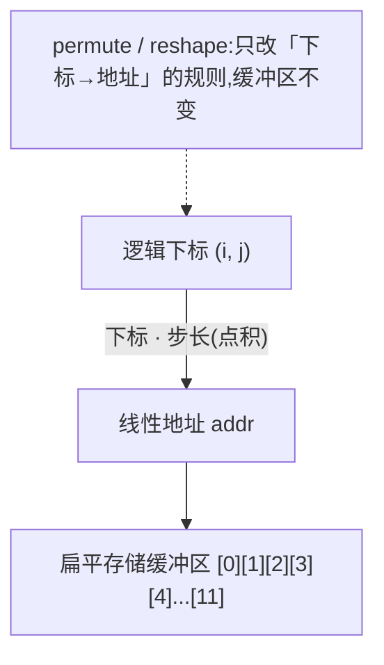
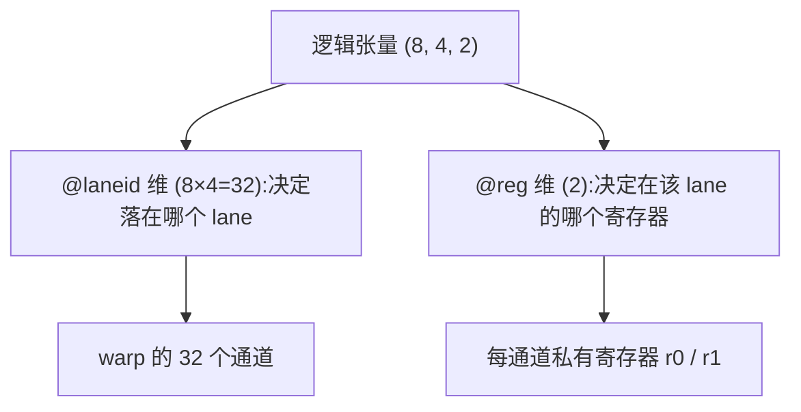

# 第 03 章 · 数据布局与其记号

> 原文:[Data Layout and Its Notation](https://mlc.ai/modern-gpu-programming-for-mlsys/chapter_data_layout/index.html)

> **本章要点(TL;DR)**
>
> - **数据布局(data layout / 数据布局)** 干的事,就是告诉你某个逻辑下标对应的数,到底躺在物理上的哪个位置。别小看它:访存能不能合并(coalescing)、会不会撞 bank、某个硬件引擎读不读得了一块 tile,全看它怎么摆。同一批数字,光是换个摆法,在同一块 GPU 上性能就能差一个数量级。
> - 全书就用一套紧凑记号描述所有布局:`S[(shape) : (strides)]`,说白了就是「形状 : 步长」做点积。这玩意儿你早就见过——PyTorch/NumPy 里的 `shape` + `stride` 就是它,这里只是把它搬到了 GPU 上。
> - 给步长贴上 **命名轴(named axes / 命名轴)**(像 `@m`、`@laneid`、`@reg`、`@gpuid_x`、`@TLane` 这些),同一套记号就能描述数据在内存、寄存器、warp 通道、TMEM、乃至整个 GPU 网格上是怎么铺开的。
> - 再加一个 **复制项(replication term / 复制项)** `R[n : stride]`,就能表达「同一份数据被广播或拷贝到好几个地方」。分布式分片里的副本是它,Blackwell block-scaled MMA 在 TMEM 里的 `warpx4` 广播也是它。
> - **Swizzle(地址异或重排 / swizzle)** 专门用来消掉共享内存的 bank 冲突,让同一块 tile 按行读、按列读都能跑得快。注意它不属于仿射布局 `S[...]`,而是单独叠在上面的一层非仿射变换。

---

> **前置知识**:读这一章前,最好先懂 warp 与 lane(通道)、寄存器 vs 共享内存、内存 bank 与 bank 冲突,以及 Tensor Core 大概是干嘛的。没把握的话,先翻一下 [第 0 章 · 极简入门](./ch00_gpu_ml_primer.md)。本章会默认你已经认识这些词。

---

平时写程序,我们脑子里基本只有张量(tensor,你可以先粗暴地理解成「多维数组」,比如一个二维数组就是矩阵)的「逻辑形状」,比如一个 `(M, N)` 的矩阵——M 行 N 列。可形状只说清了一件事:一共有多少个数。至于这些数字、这些字节,实际摆在内存的哪个角落,形状一个字都没提。

平时写后端、写业务,你确实不用关心这个——数组就是数组,取下标就完事了,内存怎么摆是底层的事。但到了 GPU 上,情况彻底反过来了:**硬件最在意的恰恰就是「字节到底摆在哪」**。摆得好和摆得坏,同一段计算能差出十倍速度。这一章就是来回答这件事的。

> **一句话先理解**:这一章讲的「数据布局」,本质就是一张「翻译表」——你给它一个逻辑下标 `(i, j)`(第 i 行第 j 列),它告诉你这个数实际存在物理上的哪个位置。

**数据布局(data layout)** 回答的问题很直接:逻辑下标 `(i, j, …)` 对应的那个元素,到底存在哪儿?答案不止「内存」一种,可能是全局内存,可能是共享内存,可能是寄存器,也可能是某种专用的硬件存储——这些名词你现在不认识没关系,本章会一个个讲到,这里只要先有个印象:**GPU 上「存数据的地方」有好几种,不是只有一块内存**。

那物理摆放为什么这么要紧?原文给了三条理由。这三条里出现了几个 GPU 专有名词,我先当场用大白话讲清楚,你别被吓住:

1. **访存能不能合并(coalescing)**。先解释 warp:GPU 干活不是一个线程单打独斗,而是把 **32 个线程绑成一个最小作战单位**,这一组 32 个线程就叫一个 **warp**。warp 里每个线程有个编号(0 到 31),这个编号就叫 **lane(通道)**。现在关键来了:这 32 个线程同时去内存里取数(load)时,如果它们要取的 32 个地址刚好 **连成一整片**,硬件就能一把把它们 **合并成 1 次** 内存读取——这叫「合并访存」,快得很;可要是这 32 个地址东一个西一个,散在内存各处,硬件没法合并,就得 **拆成多达 32 次** 单独的读取。一次和三十二次,差距大得吓人。所以数据摆得连不连续,直接决定快慢。
2. **会不会撞 bank(bank conflict)**。GPU 有一块特别快的「共享内存」,它在物理上被切成了若干个 **bank(存储体,你可以想成「32 个并排的小柜台」)**。32 个线程同时来取数,如果它们分别落在 **不同的柜台**,就能 32 个一起办、并行处理;可要是好几个线程挤到 **同一个柜台** 要不同的东西,这个柜台一次只能服务一个人,只能 **排队挨个来**,瞬间慢下来。这种「挤同一个柜台」就叫 bank 冲突。
3. **引擎读不读得了**。GPU 里有一块专门算矩阵乘法的硬件单元,叫 **Tensor Core(张量核心)**——为什么 GPU 要为「矩阵乘」专门造一块硬件?因为深度学习里绝大部分计算就是一堆矩阵乘,把它做成专用硬件就能飞快。但这块硬件很挑食:它只认 **特定摆法** 的数据。一块从大矩阵上切下来的小方块(下文叫 **tile / 分块**),它的字节怎么排,直接决定 Tensor Core 肯不肯把它当成一个合法的「操作数(operand,就是参与运算的输入数据)」吃进去。摆错了,这块昂贵的硬件根本用不上。

这一章的讲法是一层一层往上垒:先搭最朴素的「形状-步长」模型,再一点点往上加东西(tile、命名轴、复制项),最后才到 swizzle。讲到后面你会发现一个让人安心的事实:整章翻来覆去,其实就是 **同一个想法换着花样讲**——把它学透一次,后面全是变奏。

---

## 一、形状-步长模型(The Shape–Stride Model)

咱们从最简单的布局讲起。说到底,描述一个布局只要两样东西:一个 **形状(shape)**——告诉你每个维度有多大;加上一组对应的 **步长(stride)**——告诉你每个维度的下标加 1,地址要往前走多远。本书用一套很紧凑的记号把这俩写在一起,长这样:

```
S[(shape) : (strides)]
```

`S` 你就读成「一个布局」,中间的冒号把它劈成两半,左边是形状、右边是步长。

那怎么用它算出「某个下标存在哪儿」?办法简单到出乎意料:把「下标」和「步长」**对应相乘再加起来**(这个运算数学上叫「点积」,你不熟这个词也没关系,就是「逐个相乘后求和」)。拿一个行主序(row-major,意思是「一行一行地、从左到右、连续地」往内存里铺)的 4×4 矩阵来说:

```
S[(4, 4) : (4, 1)]        addr(i, j) = i·4 + j·1
```

步长 `(4, 1)` 是啥意思?其实特别好懂,你跟着想一遍就通:

- 行下标 `i` 每加 1,意味着「往下挪一整行」。一行有 4 个元素,所以地址得往前 **蹦 4 步**——这就是第一个步长 `4`。
- 列下标 `j` 每加 1,意味着「在同一行里往右挪一格」,紧挨着的下一个,所以地址只 **往前挪 1 步**——这就是第二个步长 `1`。

就这么个经典模型,没有任何玄机。(如果你听过 CuTe 这个库,这套记号就是它的行主序简化版;没听过完全不影响。)

### 你其实早就用过它

别把它当成什么新鲜玩意儿,这套东西你很可能早就用过了。只要你写过 PyTorch 或 NumPy(就算没写过,下面的代码也很好懂),你就已经在用「形状 + 步长」了。这些库里的张量,**说白了** 就是「一个 shape 加一个 stride,盖在一段扁平的(也就是一维的、拉直的)存储缓冲区上面」——底层永远是一条直线排列的数,shape 和 stride 只是教你怎么在这条直线上「按下标找位置」:

```python
import torch
t = torch.arange(12).reshape(3, 4)  # 造一个 0~11 的数,排成 3 行 4 列
t.shape        # torch.Size([3, 4])  ← 形状:3 行 4 列
t.stride()     # (4, 1)              ← 步长:正是上面那套 S[(3, 4) : (4, 1)]
```

看到没,`t.stride()` 直接就吐出了 `(4, 1)`——和我们手推的一模一样。一旦你学会用「shape + stride」这个视角看张量,很多「重排」操作为什么 **压根不碰数据、快得几乎不要钱**,一下就通了。它们干的事无非是 **改写那几个步长数字**,然后在同一段存储上给你返回一个 **视图(view,可以理解成「换一副眼镜看同一块内存」,数据本体没动)**。最典型的就是转置 / permute(把行和列对调):

```python
tt = t.permute(1, 0)               # 把第 0 维和第 1 维对调,等价于转置 t.T
tt.shape                           # torch.Size([4, 3])  ← 形状从 3×4 变成了 4×3
tt.stride()                        # (1, 4)   ← 步长只是 (4,1) 互换成了 (1,4)
tt.data_ptr() == t.data_ptr()      # True  ← 两者指向同一片内存地址!没拷贝
```

最后那行 `data_ptr()` 是「这块张量的数据从哪个内存地址开始」。两者相等,铁证如山:**转置前后是同一片字节,根本没搬家**。`t.permute(1, 0)` 不过就是同一片内存上换了组步长 `S[(4, 3) : (1, 4)]` 而已。换句话说,**所谓转置,就是把步长换了换,一个字节都没挪**。`reshape` / `view` 作用在连续张量上也是同样的套路——给老存储套上一副新 shape、新 stride 的眼镜,如此而已。

为什么要在 GPU 笔记里花这么大篇幅讲 PyTorch?因为这是你 **唯一一个已经熟的锚点**。记住「布局 = shape + stride、改布局往往不动数据」这件事,后面 GPU 上那些花里胡哨的写法,本质都没逃出这个框。

> **注意**:NumPy 的行为跟这一模一样,唯一的区别是它的 `.strides` 按「字节」算,而 PyTorch 的 `.stride()` 按「元素」算。

### 零拷贝推理的边界

下面这张图把「逻辑视图」和「物理存储」的关系串了起来:



GPU 上的布局也是这么回事。一块 tile 的映射,不管是映到内存,还是用后面要讲的「命名轴」映到通道和寄存器(这俩词后面会讲,先不急),骨子里都是同一回事:「固定缓冲区上的一条步长规则」。所以 **重排一块 tile,多数时候只是换了个 *布局*,并没有真去拷贝数据**——和 PyTorch 转置一个道理。

> **关键**:但「零拷贝」这件好事,是有边界的,别以为永远免费。它只在「同一块连续地址空间上换个看法」时才成立。到了 GPU 上,这件事只在一种情况下管用:新看法跟现有的字节排布、跟「谁拥有这块数据」的安排还对得上。一旦你动了 **「哪个线程、哪个寄存器拥有某个元素」**(注意:GPU 上一个元素可能不是躺在公共内存里,而是被某个具体线程的某个寄存器「私人持有」,后文会讲),或者改了共享内存的 swizzle(最后一节才讲),那就 **躲不掉了**,必须老老实实搬数据。搬数据靠的是 load(从内存读)、store(写回内存)、shuffle(线程之间互相交换数据)、`ldmatrix`、transpose 这些专门的操作——这些名字你现在记不住没关系,只要知道「真搬数据是要花成本的」就够了。后面好几章的优化,根子都扎在这条边界上。

---

## 二、Tile 布局(Tile Layout)

前面讲的都是「整个张量」的布局。但现实里,GPU 上跑的程序(一段在 GPU 上执行的函数,术语叫 **kernel / 核函数**,你就理解成「丢给 GPU 去并行跑的那段代码」)几乎从不会一口气啃下整块大矩阵。

为什么不能一口气啃?因为那块又快又小的存储装不下整个大矩阵——就像你不可能把整个数据库一次性塞进 CPU 缓存。所以 GPU 的标准做法是:把大矩阵 **切成一个个更小的方块**,这些小方块叫 **tile(分块)**,然后丢给硬件的不同部分,分头去加载、变换、计算。这个「切块」的动作就叫 **tiling(分块)**。

好消息是:**搞 tiling,不需要学任何新概念**。它还是一个布局,无非就是把下标拆细、多写几个维度罢了。

举个例子,把一个 8×8 矩阵切成若干 2×4 的小块(每块 2 行 4 列)。横着 2 块、竖着 4 块,一共 8 块。本来用 `(i, j)` 两个数就能定位的元素,现在我们改用 **4 个数** 来定位:`(tile_row, row_in_tile, tile_col, col_in_tile)`——意思是「第几块行、块内第几行、第几块列、块内第几列」。所以这是一个 **4 维** 布局。步长怎么挑?有个明确目标:让每个 tile 内部的元素在物理内存里连续摆放(这样硬件一次就能把一整块 tile 利索地读进来):

```
S[(4, 2, 2, 4) : (16, 4, 8, 1)]
```

映射就分两步,慢慢来:

1. **先把逻辑 `(i, j)` 拆成四个数** `(i//2, i%2, j//4, j%4)`。这里 `//` 是整除、`%` 是取余(和 Python 一样)。整除给出「第几块」(外坐标),取余给出「块内第几个」(内坐标)。
2. **再拿这四个数跟步长做点积**(对应相乘求和),就得到物理地址。

还拿 8×8 切 2×4 来说,拆法是这样:

| 逻辑下标 | 拆分(外, 内) | 含义 |
| --- | --- | --- |
| `i`(行,8 行) | `(i//2, i%2)` | 第几个 tile 行(共 4 个) / tile 内第几行(共 2 行) |
| `j`(列,8 列) | `(j//4, j%4)` | 第几个 tile 列(共 2 个) / tile 内第几列(共 4 列) |

那步长 `(16, 4, 8, 1)` 又是怎么定下来的?就盯住一条约束:让每个 tile 里头那 8 个元素(2 行 × 4 列)在物理内存上 **连着放**(也就是「一块一块地铺」,而不是整张大矩阵一行行铺到底的那种行主序)。咱们从最里层挨个往外看,每一步只动一个下标:

```
内坐标先走,保证 tile 内 8 个元素连续:
  col_in_tile (stride 1)  : 0→1→2→3,tile 内同一行的 4 列紧挨着
  row_in_tile (stride 4)  : +4 跳到 tile 内下一行(刚好跨过 4 列)
                            → 一个 2×4 tile 占满 8 个连续地址 [0..7]
外坐标后走,从一个 tile 跨到下一个:
  tile_col   (stride 8)   : +8 跳到右边相邻的 tile(整整一个 tile = 8 元素)
  tile_row   (stride 16)  : +16 跳到下一行 tile(一行有 2 个 tile = 16 元素)

最值得记住的一点:
  这套记号根本没有引入任何特殊的「tile」概念,
  它就是原来的 shape–stride 模型,只是把下标拆成了外/内两层。
```

> **注意**:原书在这儿放了个交互演示,随便点一个格子就能看到它的 tiled 下标和物理地址。静态笔记没法还原这种点来点去的效果,不过上面的步长拆解已经把「逻辑 `(i,j)` → 拆分 → 地址」整条规则讲透了。想找找手感,可以去原书那个交互演示里玩一玩。

---

## 三、命名轴(Named Axes)

到目前为止,`S[...]` 里每个步长指的都是「内存里往前走多少」,我们也一直默认「地址」就等于「内存里的位置」。但这正是 GPU 和你熟悉的 CPU 世界最不一样的地方——

> **一句话先理解**:在 GPU 上,数据不是只能躺在「内存」里。它还可能被拆碎了,**分散到几万个线程各自的私有寄存器里**,或者待在某种专用硬件存储里。所以「一个元素存在哪」这个问题,答案可能是「在第 11 号线程的第 1 号寄存器里」,而根本不是某个内存地址。

我先把会出现的几种「存数据的地方」用大白话讲清楚:

- **寄存器(register)**:每个线程私有的、容量极小但访问 **最快** 的存储。它就像 CPU 的寄存器,但 GPU 上有个关键区别——**每个线程都有自己的一套**,互不相通。一个数据如果存在「3 号线程的寄存器」里,别的线程是直接够不着的。
- **warp 通道(lane)**:前面说过,32 个线程绑成一个 warp,每个线程在 warp 里的编号(0~31)就是它的 lane。所以「数据落在哪个 lane」等于「数据归哪个线程管」。
- **TMEM(Tensor Memory)**:一种专给 Tensor Core 用的片上存储,是 NVIDIA 较新的 GPU(Blackwell 代,后面会再提)才有的。你现在只要知道「这又是一种存数据的地儿」就行,细节后面讲。

现在问题来了:数据能待的地方这么多,我们怎么用 **同一套记号** 把它们全部描述清楚,而不是每种情况发明一套写法?作者这招很巧:**给每个步长系数贴一个「轴标签」**,用这个标签说清楚——这个下标加 1 时,是「在内存里走」,还是「换一个线程」,还是「换一个寄存器」。

| 标签 | 含义 |
| --- | --- |
| `@m` | 普通内存(memory) |
| `@laneid` | warp 通道索引,即 `thread_index % warp_size` |
| `@reg` | 每通道私有的寄存器(register) |
| `@warpid` | warp 索引 |
| `@TLane` / `@TCol` | TMEM 的通道 / 列坐标 |

贴好标签,一个行主序的 8×16 内存 tile 就写成这样:

```
S[(8, 16) : (16@m, 1@m)]
```

(两个步长都带 `@m`,说明它们都指向线性内存。)

### 读法速成:手把手念一行 `S[...]`

你可能已经被后面那种 `S[(8,4,2):(4@laneid,1@laneid,1@reg)]` 的写法吓到了——一堆 `@` 符号,看着像天书。别慌,我跟你保证:它再花哨,**念法永远是固定的那么几步**。把这套套路记死,后面所有表达式你都能像查字典一样一个字一个字读出来,而不用害怕。

> **关键**:`S[(形状):(步长)]` 就念成一句话——「这块数据有这么大(形状);每个下标 +1,就在某个空间里走这么远(步长)」。

**第 1 步:看中括号。** `S[ ... ]` 就代表"一个布局"。中间的冒号 `:` 把它劈成两半:**左边是形状,右边是步长**,两边的项一一对应。

**第 2 步:读形状。** `(8, 4, 2)` 就是说这块数据是 8 × 4 × 2,三个维度,没别的。

**第 3 步:读步长里的 `N@axis`(这是命门)。** `N@axis` 念作:**「这一维的下标每 +1,就沿 `axis` 这个轴走 N 步」**。关键全在 `@` 后面那个轴——它告诉你"走在哪个空间里":

| 轴标签 | 走在哪 |
| --- | --- |
| `@m` | 内存地址上 |
| `@laneid` | warp 的 32 个通道(lane)上 |
| `@reg` | 某个通道自己的寄存器上 |
| `@TLane` / `@TCol` | TMEM 的通道 / 列上 |

**第 4 步:同一个轴出现多次,就把它们加起来。** 这一步容易漏,留心。要是有两个维度的步长都带 `@laneid`,说明这俩维度 **合伙决定** 「落在哪个 lane(哪个线程)」——把它们各自算出的「下标 × 步长」加到一起,才是最终的 lane 号。(为什么会有两维合伙?因为一个 warp 有 32 个 lane,有时候用「8×4」这样两维的形状去铺这 32 个 lane,比用一维更顺手。)

把这套套到那个吓人的例子上:`S[(8, 4, 2) : (4@laneid, 1@laneid, 1@reg)]`。假设我想知道逻辑元素 `(i=2, j=3, r=1)` 到底住哪:

- 前两维都带 `@laneid`,合起来算 lane:`lane = 2×4 + 3×1 = 11`;
- 第三维带 `@reg`:`reg 槽 = 1×1 = 1`。
- **结论:元素 (2,3,1) 住在第 11 号 lane 的 1 号寄存器里。**

(顺手验证一下:第一维 8 × 第二维 4 = 32,正好等于一个 warp 的 32 个 lane——所以这块数据刚好摊满一整个 warp,每个 lane 手里攥 2 个元素。)

**最后一块拼图:`+ R[n : stride]`。** 有时你会看到 `S[...] + R[...]`,那个 `R` 是**复制(replication)**:把前面 `S[...]` 定好位置的那份数据,再沿某个轴**抄 n 份**,相邻两份隔 `stride` 那么远。比如 `+ R[4 : 32@TLane]` 念作"沿 TMEM 通道轴复制 4 份、每份隔 32 个通道",也就是第 0、32、64、96 号通道拿的是同一个值。

记住这套念法,后面 `@TLane`、`@gpuid_x`、`R[...]` 再怎么排列组合,你都能一个字一个字拆开读懂,而不用死背结论。

### 标签真正发光的时刻:数据跨线程分布

光给一个内存 tile 贴个 `@m`,你看不出这套标签有啥了不起——不就是「内存地址」嘛。标签真正出彩的时刻,是描述那种 **CPU 世界里根本没有的** 情形:一块数据不是整整齐齐躺在一块公共内存里,而是 **被拆成几十份,分别塞进几十个线程各自的私有寄存器里**。这种「数据散在好多个线程上」的局面,用普通的 shape/stride 根本没法表达,而命名轴一招就搞定。看这个例子:

```
S[(8, 4, 2) : (4@laneid, 1@laneid, 1@reg)]
```

这个布局不再指向线性内存了,它把「行、列」映射到了 **lane ID** 和 **每个通道里的寄存器** 上:

- 前两维(形状 8 和 4)的步长都带 `@laneid`。也就是说,这俩逻辑维度合起来决定「数据落在 warp 的哪个通道」(`lane = 维0·4 + 维1·1`,一共 8×4=32 个 lane,正好把一个 warp 填满)。
- 最后一维(形状 2)的步长带 `@reg`。意思是这一维顺着「同一个通道内的寄存器」展开,说白了就是每个 lane 手里攥着 2 个元素 `r0` 和 `r1`。



> **关键**:别小看这个例子——它恰好就是 Tensor Core 实际用的「寄存器片段(register fragment)」布局。所谓寄存器片段,就是「一块矩阵被拆开、分散存放在各个线程的寄存器里的那一份份小碎片」;Tensor Core 算矩阵乘时,输入数据就是以这种碎片形式分散在一个 warp 的各个线程手里的。后面《Tensor Core Operand Layouts Across GPU Generations》那一章会反复用到。这里你只要体会到一点:同一套 `S[...]` 记号,既能描述「数据在内存里怎么摆」,又能描述「哪个线程、哪个寄存器拿着哪个元素」——这套记号的厉害之处,正在于此。

> **注意**:原书在这儿也配了交互演示,点一下格子就能看到它是由哪个 lane / register 持有的。想把「逻辑元素 ↔ 物理 lane/reg」这层对应关系摸熟,去原书玩一玩这个演示。

---

## 四、分布式布局(Distributed Layout)

命名轴最妙的一点是:**同一套记号,能在好几个完全不同的层级上描述「数据放在哪」**——小到「一个线程的寄存器」,大到「机房里的好几台 GPU」。前面我们用它讲了单张显卡内部的 lane 和 register,现在把同一个想法直接往外放大,放大到一整片 **GPU 网格(mesh,就是把多张 GPU 排成一个网格阵列,比如 2×2 四张卡一起干活)** 上。

为什么会有多张卡一起干活的场景?因为现在的大模型,一张卡的内存根本装不下,只能把模型和数据 **切开,分摊到好几张卡上**——这就是分布式训练 / 推理。那怎么用命名轴描述这种「数据摊在哪张卡上」?加两个新轴就行:

- `@gpuid_x` / `@gpuid_y` 这两个轴,说的是「数据落在网格里的哪张卡上」(x 是横坐标,y 是纵坐标);
- 有了它俩,这套记号就能精确描述「把一个大张量切开、分摊到多张卡」的 **分片(sharding)** 模式了。

### 用 `R[...]` 描述复制

命名轴几乎啥都能描述,但还缺一块拼图:**复制(replication)**。什么叫复制?就是「同一份数据,被原样拷到好几个地方,每处都存一份一模一样的」。分布式里这很常见——有些数据每张卡都要用,那就干脆每张卡都存一份副本,省得用的时候还要去别的卡上要。为描述这种情形,作者添了个新记号:

```
R[n : stride]
```

`R` 就读成「复制」。`n` 是复制几份,`stride` 是相邻两份副本之间隔多远(也照样能带轴标签,告诉你副本是沿哪个轴铺开的)。比如 `R[2 : 1@gpuid_x]`,念作「沿 `@gpuid_x` 轴(横向)复制 2 份」。

把分片和复制拼一块儿,**一个表达式就能一口气说清两件事**:既说「张量怎么切开分摊到各张卡」,又说「哪些卡之间互为副本」。比如下面这个,在 2×2 的 GPU 网格上,先纵向分片、再横向复制:

```
S[(2, 4, 8) : (1@gpuid_y, 8@m, 1@m)] + R[2 : 1@gpuid_x]
```

下面这张图,画的就是这个「分片 + 复制」模式落在 2×2 网格上是什么样:

横轴 `@gpuid_x` 是复制方向,纵轴 `@gpuid_y` 是分片方向。网格上每台 GPU 手里拿着啥,看下表:

| | `@gpuid_x = 0` | `@gpuid_x = 1`(复制方向) |
| --- | --- | --- |
| **`@gpuid_y = 0`** | GPU(0,0):分片 A | GPU(1,0):分片 A 副本 |
| **`@gpuid_y = 1`** | GPU(0,1):分片 B | GPU(1,1):分片 B 副本 |

- `S[...]` 里的 `1@gpuid_y` → 张量沿 y 轴在两台设备间「分片」(分片 A / 分片 B);
- `R[2 : 1@gpuid_x]` → 这个分片再沿 x 轴「复制」一份给配对的设备(副本)。

> **注意**:原书的交互演示能点格子看它由哪台(或哪几台)设备持有,还能在「完全分片 / 分片+副本 / 分片+偏移」三种布局之间来回切。静态图没法还原这种切换,想看个明白就去原书体验一下。

### 4.1 kernel 内的复制:TMEM 中的 Scale Factor

> **一句话先理解**:这一小节是个稍微硬核的实例,讲「复制」不光用在多张卡之间,也用在 **一张卡内部** ——硬件把一份数据「广播」给好几个线程组共用。看不太懂细节没关系,抓住「复制 = 同一份数据让多处共享」这一个点就够了。

复制维度 `R[...]` 可不光是给「多张卡」用的。同样这套写法,也能描述 **单张卡内部、一段 kernel 跑的时候** 发生的事——硬件把同一份数据 **广播给一个 warp 之外的别的 warp 共用**。这里拿一个具体例子:Blackwell(NVIDIA 较新的一代 GPU 架构代号)上的 block-scaled MMA。这里头 MMA 是 matrix-multiply-accumulate(矩阵乘加)的缩写,就是 Tensor Core 干的核心活;block-scaled 是一种节省内存的技巧,简单说就是给一批数配一个「缩放因子」,用的时候再乘回去。

这个缩放因子(scale factor)存在前面提过的 TMEM(那块专给 Tensor Core 用的存储)里。妙的地方在于:一个逻辑上有 **128 行** 的缩放向量,物理上 **只占了 32 条 TMEM 通道**(可以理解成 32 个槽位)——也就是说,128 行被压进了 32 个槽位里。

- 逻辑行 `r` → TMEM 通道 `r % 32`;
- `r // 32` 沿列方向展开。

接着是关键的「广播」一步。这压好的 32 条 TMEM 通道,会沿着 TMEM 的 `TLane` 轴 **复制成 4 份**,从 32 条铺成 128 条。为什么要复制成 4 份?因为读这份数据的是一个 **warpgroup**——4 个 warp 凑成的一组,共 4×32 = 128 个线程。让每一份副本对上一个 warp,这样这 4 个 warp **各自** 都能在自己那 32 条通道的窗口里读到一份完整的缩放因子,谁也不用跑去别的 warp 那儿要。这种「一份数据复制给 4 个 warp 共用」就叫一次 `warpx4` 广播,用复制维度写出来就是:

```
S[(32, …) : (1@TLane, …)] + R[4 : 32@TLane]
```

这就给出了 4 份副本,相邻两份隔 32 个 TMEM 通道。换句话说,TMEM 通道 `l`、`l+32`、`l+64`、`l+96` **拿的是同一个缩放值**。

**存储阶段:128 逻辑行 → 32 TMEM 通道**

- 行 `r` → TMEM lane `r % 32`,列偏移看 `r // 32`;
- 总共只动用了 32 条通道(lane 0 … lane 31)。

**广播阶段:warpx4 复制(`R[4 : 32@TLane]`)**

通道 `l`、`l+32`、`l+64`、`l+96` 拿的是同一份缩放值;每个 warp 的 32 通道窗口各自分到一份副本:

| | warp0 | warp1 | warp2 | warp3 |
| --- | --- | --- | --- | --- |
| **TMEM 通道范围** | 0..31 | 32..63 | 64..95 | 96..127 |

> **关键**:跟 GPU 网格那回事一样,**复制维度本身一个新数据都不带**。它只是声明「同一个值,同时坐在 4 个 TMEM 通道上」,就像 `@gpuid_x` 把一行广播到整个 GPU 网格那样。真正去读它的,是这些 warp 里的线程。

> **注意**:每列内部的字节怎么打包(`scale_vec` 的 1X/2X/4X 模式),还有 `cta_group::2` 的拆分,这些留到《Tensor Core Operand Layouts Across GPU Generations》再细说。原书在这儿也有交互演示,把「压紧塞进 32 个 TMEM 通道」和「warpx4 广播到 128 个读取通道」这两步连着演给你看,值得一看。

> 要是你熟悉 CuTe,本章的记号这么理解就行:它就是 CuTe 的一个 **行主序变体**,只不过多塞了「显式的硬件命名轴」和「专门的复制结构」。

---

## 五、Swizzle 布局(Swizzle Layout)

这一章的最后一个布局,是专门为治一个具体的硬件毛病而生的。先讲毛病,再讲药方——这样你才明白为什么需要它。

### 问题:bank 冲突

先把舞台搭好。GPU 有一块叫 **共享内存(shared memory,常简写 SMEM)** 的存储——它比普通内存快得多,而且一个线程块里的线程可以拿它当「公共白板」互相传数据。但它有个物理结构:被切成了好几个 **bank(存储体,前面用「并排的小柜台」打过比方)**。

规则是这样的:一个 warp 的若干线程同时来访问共享内存时——

- 如果它们恰好落在 **不同的 bank**(不同柜台),那就 **同时办完**,飞快;
- 可一旦好几个线程挤去访问 **同一个 bank 里的不同地址**(同一个柜台、要不同的东西),这个柜台一次只能服务一个,硬件只能让它们 **排队、一个接一个来**。

这种排队就是 **bank 冲突(bank conflict)**,它会把本该一步完成的访问拖成好几步,白白浪费时间。

在矩阵程序里,这个坑几乎绕不过去。为什么?因为算矩阵时,我们老是要对同一块 tile **既按行读、又按列读**(比如矩阵乘法,一个矩阵取行、另一个取列)。而一种摆法没法同时讨好行和列,于是你被逼进一个两难:

| 布局 | 行访问 | 列访问 |
| --- | --- | --- |
| 利于行的布局 | 高效 | 产生 bank 冲突 |
| 利于列的布局 | 产生 bank 冲突 | 高效 |

**Swizzle(混洗 / 异或重排)** 这招,就是冲着同时讨好行和列、打破这个两难来的。

### 思路:用 XOR 把地址打散

> **一句话先理解**:swizzle 就是「故意把数据存的位置打乱一下」,乱得恰到好处,使得无论你按行抓还是按列抓,抓到的那一组都正好分散在不同的柜台(bank)上,谁也不挤谁。

Swizzle 的核心,就是 **在算地址时再做一道手脚,把地址打散重排**。最典型的玩法,是拿列索引跟行索引做一次 **异或(XOR,就是按位「相同得 0、不同得 1」的那个位运算,很多语言里写作 `^`)**。别纠结 XOR 的数学,你只要知道它有个好性质:能把原本规规矩矩、容易撞车的一组地址,搅成一组分散开的地址。这么一搅,**无论你按行读还是按列读,落到的 bank 都被打散开了,不再扎堆**。

下面拿一个 8×8 tile,把「朴素行主序」(不做任何手脚)和「XOR swizzle」(做了手脚)摆一块儿对比。假设只有 8 个 bank,我们盯住「读某一整列那 8 个元素」时,它们分别落进哪些 bank:

读「第 c 列」那 8 个元素,各自落进哪个 bank:

| 行 | 朴素行主序(bank = c) | XOR swizzle(bank = c XOR row) |
| --- | --- | --- |
| 行 0 | bank c | bank (c XOR 0) |
| 行 1 | bank c | bank (c XOR 1) |
| … | …(全是同一个 bank) | … |
| 行 7 | bank c | bank (c XOR 7) |
| **结果** | 8 个元素全落进同一个 bank → 串行化成 8 个周期 ❌ | 同一列被打散到 8 个不同 bank → 1 个周期读完 ✅ |

> **关键**:swizzle 给的「无冲突保证」是 **带条件的**。只有当「元素宽度、swizzle 模式、访问模式」三者对得上(也就是凑成某个引擎 descriptor 期望的那一组)时,它才成立;**并不是** 随便什么元素宽度、什么对齐方式都灵。一句话:模式选错,保证作废。

### 真实硬件:分段 + atom

上面那个 8 个 bank 的 8×8 只是方便讲解的玩具。真实 GPU 的 bank 多得多,一般是 **32 个**。为了在真实规模上也好用,swizzle **不会把一整块 tile 当成铁板一块来打乱**(那样太死板),而是先把内存切成 **一小段一小段(segment)**,然后在 **每一段内部各自** 施加打乱模式。

最常见的一种叫 `SWIZZLE_128B`,它以 **128 字节为一段** 来组织。为什么偏偏挑 128 字节?因为它正好对得上 32-bank 的硬件:32 个 bank,每个 bank 一次处理 4 字节,32 × 4 = 128 字节,刚好一段铺满所有 bank。它打乱地址的规则,核心就一行:

```
physical_sector = logical_sector XOR row
```

(`sector` 你就理解成「段里的一个小块」,`row` 是行号。)在每个 128 字节段里头,光靠这一条 XOR 规则,就能把每一列都打散到不同的 bank 上,消掉冲突。

### 不同的 swizzle 模式(atom 大小)

把上面的思路再抽象一层:硬件先定一个 **又小、又会反复出现的基本图案**,叫 **atom(原子单元)**——你可以把它想成「贴瓷砖时那一块标准瓷砖」。打乱规则就施加在这一块 atom 上;然后整块大 tile 就拿这块选定的 atom **一格一格平铺(tiling)** 出来,像铺地砖一样铺满。不同的 swizzle 模式,区别就在于这块「瓷砖」多大。

| 模式 | atom 形状 | 适用条件(连续维度至少) |
| --- | --- | --- |
| `SWIZZLE_128B` | 8 × 128 B | 128 字节(fp16 下即 64 个元素) |
| `SWIZZLE_64B` | 8 × 64 B | 64 字节 |
| `SWIZZLE_32B` | 8 × 32 B | 32 字节 |
| 16 B 交错(interleaved)模式 | 原书未给出具体 atom 形状 | 用于更小的连续维度 |

### 该选哪个模式?

一条经验法则:**tile 能填满哪块最大的「瓷砖」(atom),就挑哪块**。

- 一块 N 字节的 atom,要求 tile 的 **连续维度**(就是内存里连着摆的那一维,通常是「行方向」)至少有 N 字节宽,而且得是 N 的整数倍——不然瓷砖铺不满、对不齐。
- 所以 `SWIZZLE_128B` 只有在一行至少跨 128 字节(也就是 64 个 `float16` 元素)时才用得上。
- 而一旦用得上,它就是首选。它那个 8 × 128 B 的 atom 刚好铺满一整条 128 字节的 bank line,所以能 **一把就把一列打散到全部 32 个 bank**;在 fp16 下,8 行 8 列读起来都不撞 bank。
- 要是问题形状把连续维度逼得很小,128 B atom 填不满,那就退一档,换 `SWIZZLE_64B` 或 `SWIZZLE_32B`——原则不变,就是「一行能盖得住的最大 atom」。

### Swizzle 与 `S[...]` 记号的关系

> **关键**:好消息——这些被打乱过的地址,你 **根本不用自己去手算**,工具会替你算。但有个概念得分清楚:**swizzle 不属于 `S[...]` 那套布局**。前面 `S[...]` 算地址用的都是「下标乘步长再相加」这种规规矩矩的线性运算(数学上叫 **仿射映射 / affine**,你理解成「只有乘和加、没有 XOR 这种位运算」就行);而 swizzle 里有 XOR,不是这种规矩运算,所以它是 **非仿射(non-affine)** 的、单独叠在 `S[...]` 上头的一层。

换句话说,算最终地址要分两步:`S[...]` 布局先把元素安顿到一个普通的线性内存(`@m`)地址,**然后 swizzle 再把这个地址 XOR 打乱一下**,得到真正下手的位置。在 TIRx(本书配套的一个编译工具)的 Layout API 里,这两层「叠在一起」写成一个函数调用:

```
ComposeLayout(swizzle, tile)
```

`ComposeLayout(swizzle, tile)` 字面意思就是「把 swizzle 这一层和 tile 布局这一层组合成一个整体」。组合好之后,你要操心的就只剩一件事:**凡是会碰这块 tile 的代码,都得统一用同一个 swizzle 模式**(不然有人按打乱前的地址写、有人按打乱后的地址读,数据就对不上了)。除此之外的算地址细节,全甩给这个「组合后的布局」去自动摆平。


### 与 tiling、TMA 的会合

这个「组合后的布局」,恰好也正是 **硬件搬数据时要照着填的那张图纸**。swizzle 和 tiling 这两件事,就在这儿合流了。这里要引入一个新名词 **TMA**——它是 GPU 上一个专门负责「成批搬运 tile」的硬件搬运工(全称 Tensor Memory Accelerator,细节在《Async Data Movement: TMA》那章),你现在只要知道「它能一次性把一块 tile 从大内存搬进共享内存」就够了。

- 给 TMA 下指令用的是一个 **TMA descriptor**(可以理解成一张「搬运说明书」),它本身就是多维的,所以一张说明书一次就能把两件事都交代清楚:tile 的那些 atom「瓷砖」怎么平铺,**外加** 每块瓷砖内部怎么 swizzle 打乱;
- 于是一次 TMA 搬运,就能 **一块瓷砖一块瓷砖地把整个 tile 铺进共享内存,并在写进去的同时顺手把 swizzle 也做掉**——不用先搬一遍、再单独跑一遍打乱,一步到位,省时间。

> **注意**:至于每个引擎到底「要哪种」swizzle,这是 **看代际(generation)而定** 的,正好就是下一章的内容。

---

## 小结

这一章一层一层往上垒,最后搭出了一套贯穿全书的「布局语言」。回头看,每一层都只是在前一层上加了一点点东西:

1. **形状-步长模型 `S[(shape):(strides)]`** 是地基——逻辑下标跟步长做点积,就得到物理地址。它其实就是 PyTorch/NumPy 张量背后那套 shape+stride。转置、reshape 为啥能零拷贝?就因为它们只改步长、不碰数据。
2. **Tile 布局** 没添任何新概念,无非就是把下标拆成「外坐标 / 内坐标」、再多写几个维度。
3. **命名轴(`@m`、`@laneid`、`@reg`、`@warpid`、`@TLane`/`@TCol`、`@gpuid_x/y`)** 把同一套记号推到了内存、寄存器、通道、TMEM,乃至整个 GPU 网格,让「数据在硬件资源上怎么铺」也能精确写出来。
4. **复制项 `R[n:stride]`** 描述「同一份数据被广播到好几处」,分布式分片里的副本是它,Blackwell block-scaled MMA 在 TMEM 里的 `warpx4` 广播也是它。复制维度本身不带新数据。
5. **Swizzle** 拿 XOR 把地址重排,消掉 SMEM 的 bank 冲突,让按行读、按列读都快。它是叠在 `S[...]` 上头的一层非仿射变换(`ComposeLayout(swizzle, tile)`),按 atom(8×N B)分段施加;挑法是「能填满的最大 atom 优先」,默认就用 `SWIZZLE_128B`。

最后,记牢贯穿全章那句话:**同样一批数字,换个物理摆法,在同一块 GPU 上跑出来的性能能差一个数量级**。而 `S[...]` + 命名轴 + `R[...]` + swizzle,就是用来精确说清、并攥住这种物理摆放的家伙事儿。

> **本章局限说明**:原书一共有 7 处交互演示(tile 拆分、lane/reg 分布、GPU 网格分布、TMEM warpx4 广播、8×8 bank 冲突对比、SWIZZLE_128B 分段、各 swizzle 格式 atom 浏览)。这份笔记已经用 ASCII 图和表格把它们的核心要点重搭出来了,但点击切换、逐周期步进这类交互,静态文档实在还原不了。想真正吃透,最好配着原书的交互演示一起看。

---

## 延伸阅读

- 原文章节:[Data Layout and Its Notation](https://mlc.ai/modern-gpu-programming-for-mlsys/chapter_data_layout/index.html)
- 相关后续章节(原书内部引用):
  - *Tensor Core Operand Layouts Across GPU Generations* —— 寄存器片段、block-scaled MMA、`scale_vec`、`cta_group::2`
  - *Async Data Movement: TMA* —— TMA descriptor 如何一次性完成 atom 平铺 + swizzle
  - *TIRx Layout API* —— `ComposeLayout(swizzle, tile)` 的实际接口
- 概念背景:CuTe(本章记号是其行主序变体)、PyTorch/NumPy 的 stride 模型

---

## 术语对照

| 中文 | English |
| --- | --- |
| 数据布局 | data layout |
| 形状 | shape |
| 步长 | stride / strides |
| 视图 | view |
| 分块 / 瓦片 | tile / tiling |
| 命名轴 | named axes |
| warp 通道 | lane / laneid |
| 寄存器 | register / reg |
| 复制(广播) | replication |
| 分片 | sharding |
| GPU 网格 | GPU mesh |
| 缩放因子 | scale factor |
| 访存合并 | coalescing |
| 内存 bank | memory bank |
| bank 冲突 | bank conflict |
| 共享内存 | shared memory (SMEM) |
| 混洗 / 异或重排 | swizzle / swizzling |
| 原子单元 | atom |
| 仿射(映射) | affine (map) |
| 张量核心 | Tensor Core |
| 寄存器片段 | register fragment |
