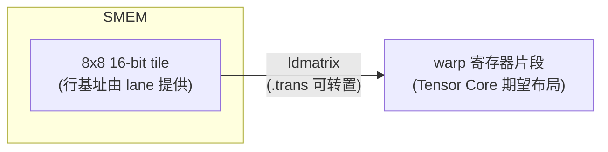
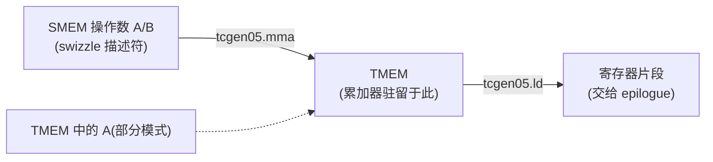
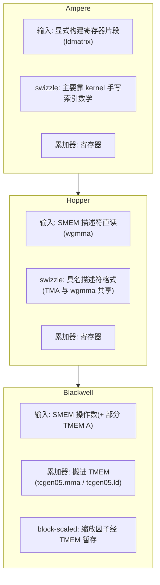

# 第 04 章 · 各代 GPU 的 Tensor Core 操作数布局

> 原文:[Tensor Core Operand Layouts Across GPU Generations](https://mlc.ai/modern-gpu-programming-for-mlsys/chapter_layout_generations/index.html)

> **本章要点(TL;DR)**
>
> 先用大白话铺一句:GPU(显卡)是一种擅长"一次干很多算术"的芯片;在做 AI 计算时,最累的活几乎都是**矩阵乘法**(两个数字表格相乘)。于是 NVIDIA 在 GPU 里塞了一块专门干这件事的硬件,叫 **Tensor Core**。Ampere、Hopper、Blackwell 是它三代芯片的代号(就像手机的"几代"),由老到新。这一章讲的就是:这块硬件三代下来,"数据要摆成什么样它才肯算"是怎么一路变化的。
>
> - 三代以来,Tensor Core 干的活始终是同一件:`D = A·B + C`(把矩阵 A、B 相乘,再加上 C,这叫**矩阵乘累加 / MMA**)。真正在变的,是**数据(操作数)怎么喂进 Tensor Core、它支持哪些尺寸和数据类型、以及算出来的结果(累加器 / accumulator)放在哪块内存里**。
> - **Ampere(最老这代)**:数据被拆碎、摊在一组线程(后面会解释 warp / lane)各自的小存储格(寄存器)里,这种摊法叫**寄存器片段(register fragment)**。流程是:用一条叫 `ldmatrix` 的特殊指令把数据从共享内存(SMEM)搬进寄存器,再用 `mma.sync` 在寄存器之间算,结果也一直留在寄存器里。
> - **Hopper(中间这代)**:新指令 `wgmma` 可以**直接从共享内存读数据**,靠一份叫**矩阵描述符(matrix descriptor)的"说明书"**告诉硬件数据是怎么摆的。但算出来的结果**仍然放在寄存器里**。
> - **Blackwell(最新这代)**:读数据的方式基本沿用 Hopper,但把**结果搬进了一块新内存 TMEM(Tensor Memory)**;某些省内存的计算模式还会多出一类"缩放因子(scale factor)"数据,也要经 TMEM 中转。
> - 还有两条最基础的内存规矩,三代从没消失过:**全局内存合并访问(coalescing)** 和**共享内存 bank 冲突(bank conflict)**——这俩名词后面第一节会从零讲清楚。一句话先记住:数据怎么摆,**不是 Tensor Core 程序的"装饰",它本身就是硬件接口的一部分**。摆错了,硬件不会报错,只会默默读错字节、或者读得很慢。

> **前置知识**:这一章会大量提到几个 GPU 基本概念,我先在这里用一句话各自交代一下,正文第一次用到时还会再展开。你**不需要**提前精通,扫一眼有个印象就行:
>
> - **线程(thread)**:GPU 上最小的"干活的人"。和 CPU 程序里的线程类似,但 GPU 会同时跑成千上万个。
> - **warp(线程束)**:GPU 把线程按 **32 个一组**捆在一起调度,这一组就叫一个 warp。可以想成"32 个人组成的一个班,必须迈同一步走"。
> - **lane(通道)**:warp 这个 32 人班里,每个人的编号,从 0 到 31。说"lane 5"就是指这个 warp 里第 5 号线程。
> - **寄存器(register)**:每个线程私有的、速度最快的一丁点存储格,类似 CPU 寄存器,但**每个线程各有一份**。
> - **寄存器片段(register fragment)**:一块数据被拆碎,分别塞进 warp 里 32 个 lane 各自的寄存器中,合起来这一摊就叫片段。
> - **共享内存(SMEM)** / **全局内存(GMEM)** / **TMEM**:GPU 上几种不同的内存,容量和速度各不相同,后面会逐一解释。
> - **MMA**:矩阵乘累加,`D = A·B + C`,就是 Tensor Core 干的那件核心算术。
> - **第 3 章的布局记号**:形如 `S[(8,4):(...)]` 的一套写法,用来精确描述"数据在内存里怎么摆"。本章会用到,但每次出现我都会翻成人话,你看不懂符号也不影响理解结论。
>
> 想打更扎实的底子,可以先翻 [第 0 章 · 极简入门](./ch00_gpu_ml_primer.md) 和第 3 章《数据布局》。

---

## 引子:为什么"逻辑公式没变"还会算错

先解释两个词,后面会反复用。**tile**:一个大矩阵太大,放不进高速内存,所以会切成一个个小方块来处理,这种小方块就叫 tile(瓦片),你就理解成"矩阵切出来的一小块"。**kernel(核函数)**:在 GPU 上跑的那段程序,相当于"GPU 版的一个函数"。本章说"一个 kernel"时,你脑子里就想"一段在显卡上执行的代码"。

好,现在来看 Tensor Core(GPU 里专门做矩阵乘法的那块硬件)。你远远地看它,会觉得它特别稳:喂进去 A、B 两块 tile,再带上累加器 C(存放"要累加进去的那部分结果"的一块数据),它就吐出来一个结果 D。这个样子打很早的型号(Volta 那一代)起就没变过。可你凑近一看就会发现,**这个运算周围的种种细节,其实一直在悄悄变**。

这一变,就给我们惹出两个很实在的麻烦。

1. **同一段 GPU 代码,在这一代芯片上飞快,换一代可能就拖泥带水了。** 为什么?因为数据进出 Tensor Core 走的"路线"换了。
2. **数据摆放(布局)要是摆错了,程序干脆给你算出个错答案。** 注意,哪怕你写的逻辑明明白白还是 `D = A·B + C`,结果照样能错。

第 2 点听着很反直觉:逻辑对的,怎么会算错?说白了,**Tensor Core 根本不认什么"抽象矩阵",它只认"按某个固定格式摆好的一堆字节"**。在它眼里,矩阵的第 0 个元素天经地义就该躺在某个 lane 的某个寄存器格里,第 1 个该在另一个位置,后面以此类推。你的数据只要没按它想要的样子摆,它就照样去乘——只不过把"压根不该相乘的两个元素"给乘到一块儿去了,结果自然是错的。打个比方:就像你给一台只认固定格式的读卡机塞了一张字段顺序错乱的卡,它不会报错,只会把"姓名"当成"金额"读走。

所以这一章,我们就顺着这根**「布局契约 / layout contract」**(也就是"硬件和你之间约定好的数据摆放规矩")的线,把三代硬件挨个走一遍。描述这套规矩要用到第 3 章的布局记号;Blackwell 的 TMEM 细节比较多,单独放在《Special Memory: TMEM》一章里讲。

---

## 一、两条从未离场的约束

> **一句话先理解**:GPU 跑得快不快,很多时候不取决于"算得快不快",而取决于"取数据快不快"。这一节讲两条最基础的取数据规矩——它们和 Tensor Core 没半点关系,但任何 GPU 代码都躲不掉,理解它们是看懂后面一切的地基。

其实早在 Tensor Core 出现之前,就有两条最朴素的内存约束在悄悄左右着 GPU 代码的数据摆放。它们不挑对象,对**任何** GPU 程序都管用,哪怕这段程序跟 Tensor Core 八竿子打不着。我们先把这两条掰扯清楚,后面 Tensor Core 那套故事才好接得上。

### 1. 全局内存合并访问 / global memory coalescing

先补一个概念:**全局内存(GMEM)**,就是显卡上那块最大、但也最慢的内存(平时说"这张卡有 24GB 显存",说的就是它)。GPU 算东西时,数据一开始都躺在这里。

再建立个直觉。前面说过,一个 warp 是 32 个线程一组、必须同步行动。当这 32 个线程同时伸手去 GMEM 取数据时,内存系统最乐意看到的,是这 32 个要取的地址**挨得近近的**,凑在少数几个连续、对齐的内存段里。为什么?因为内存一次搬运是"成段搬"的,不是"一个字节一个字节搬"的。打个比方:你让 32 个人去仓库取货,如果他们要的货都堆在同一个货架上,保管员一趟就搬回来了;要是散落在 32 个不同角落,那就得跑 32 趟。

- 地址又连续又对齐 → 一次、顶多几次搬运就全取回来了。这种理想情况就叫**合并访问(coalescing)**。
- 地址东一个西一个 → 同样这点数据,硬要拆成一大堆搬运才取得完,带宽和时间双双浪费。

### 2. 共享内存 bank 冲突 / shared memory bank conflict

再补一个概念:**共享内存(SMEM)**,是 GPU 上一块小而极快的片上内存,由"同一组线程"共用。你可以把它当成一块**需要程序员自己手动管理的高速缓存**:数据先从慢吞吞的 GMEM 搬进 SMEM,之后反复用的时候就从 SMEM 快速取,省得每次都去远处的 GMEM 跑一趟。

但 SMEM 也有自己的脾气。它在物理上被切成 **32 个 bank**(可以理解为 32 个能"同时独立服务"的小窗口)。麻烦就出在这儿:一个 warp 里好几个线程要读的地址**各不相同,却偏偏都落在同一个 bank** 上,这时这个 bank 一次只能服务一个,硬件只好让它们**排着队一个一个来**——这就叫 **bank 冲突**,本来能并行的事被迫串行,速度直接打折。

> **注意** 一个看着特别老实、人畜无害的"普通二维数组",也可能因为它在 bank 上的落点不巧而慢得离谱。慢,慢的不是数据本身,而是"地址落到哪个 bank"这套映射关系没安排好。

### 解药:swizzle / 地址混洗

那 bank 冲突怎么救?常用的招数叫 **swizzle / 地址混洗**。名字唬人,干的事其实很朴素:**故意把数据在内存里的物理摆放打乱一下,让原本会挤在同一个 bank 的那些访问,被摊开到不同 bank 上去。**

关键是,它**不动你的逻辑数据**——你代码里"第 3 行第 5 列"还是那个元素,值一个都没变;swizzle 只是在"逻辑坐标 → 物理地址"这一步偷偷加了一道重新排列,让访问横着摊到好几个 bank 上,别再一窝蜂全挤一个 bank。


*图:swizzle 只改物理摆放,不改逻辑坐标。*

### Tensor Core 额外加的第三条约束

用 Tensor Core 的代码,在上面两条之上,还要**再背一条**:数据(操作数)得摆成 **Tensor Core 指令自己点名要的那个格式**。本章接下来的主线,就是看这"第三条约束"怎么从 Ampere 一路演变到 Hopper、再到 Blackwell。

> **关键** 一句话先记住:前两条(合并访问、bank 冲突)三代都跑不掉;真正在变的是第三条,以及"摆数据这件脏活到底归谁干"——是程序员自己一行行算出来,还是直接甩给硬件去管。

---

## 二、Ampere:把数据拆碎摊在 warp 的各个 lane 上

> **一句话先理解**:在 Ampere 这代,Tensor Core 只认寄存器里的数据。所以一切麻烦都来自一件事——你得先想办法把矩阵从内存里"拆碎、摊到 32 个线程各自的寄存器里",摆成它指定的样子,它才肯算。

Ampere 这代 GPU 上,挑大梁的 Tensor Core 指令叫 `mma.sync.aligned.m16n8k*` 这一家子(`mma` 就是矩阵乘累加那条指令;后面那串字母数字是尺寸规格,先不用管)。它是 **warp 级**的——意思是一整个 warp 的 32 个线程**一起**协作执行这一条指令,不是每个线程各干各的。想搞懂这一代,你只要盯死一个问题:**这条指令到底从哪儿读数据、又往哪儿写结果?答案就俩字——寄存器。**

A、B 两个输入,连同 C/D 累加器(结果),**统统是摊在 warp 那 32 个 lane 各自寄存器里的"寄存器片段"**。在这里,共享内存说白了只是个中转站。换句话说,矩阵乘还没开跑,数据 tile 就得先从 SMEM 搬进寄存器,而且得严丝合缝地摆成指令要的那个片段格式。

### Ampere 的数据通路(数据从哪到哪)

| 步骤 | 数据走向 | 说明 |
| --- | --- | --- |
| 1 | 共享内存 ──`ldmatrix`──▶ 寄存器 | 用特殊指令 `ldmatrix` 把 tile 搬进寄存器片段 |
| 2 | 寄存器 ──`mma.sync`──▶ 寄存器 | 在寄存器之间做矩阵乘,结果还落在寄存器 |
| 3 | 寄存器 ──普通 store──▶ 共享内存 | 把结果写回去 |


*图:Ampere 的 Tensor Core 通路,输入靠 `ldmatrix`,输出靠普通 store。*

Ampere 的数据摆放这套故事,大半都能从这条通路里顺出来:**程序得先把 tile 用一种"方便高效加载"的姿势写进 SMEM,然后靠 `ldmatrix` 把它捏成 `mma.sync` 想吃的那种寄存器片段。**

---

### 2.1 Ampere Tensor Core 到底期望什么

> **一句话先理解**:Tensor Core 对"哪个 lane 拿哪几个数"有一套死规矩。这一小节就是把这套规矩摊开给你看。你**不用记公式**,只要体会到"它的规矩有多死板、多具体"就够了——正是这种死板,才让"摆错=算错"。

Ampere Tensor Core 读的那种寄存器片段,是拿 **8×8 的小方块**当最小积木一块块拼出来的(也就是把数据按 8 行 8 列一组来组织)。这些 8×8 的小单元,就是 `ldmatrix` 加载、MMA 吃进去的基本单位。

我们拿个具体例子上手:`mma.m16n8k16`(这个名字的意思是:这条指令一次算的小矩阵,M 方向 16、N 方向 8、K 方向 16)。输入数据类型是 fp16/bf16(两种 16 位的浮点格式,AI 里常用),累加用 fp32(32 位浮点,精度更高)。它算出来的累加器 tile 是 **16 行 × 8 列**,会按一个**雷打不动的固定模式**摊到 32 个 lane 上。别急,这个模式我们一步步拆。

先看 C/D 累加器,问一个具体问题:第 `l` 号 lane,手里到底攥着原矩阵的哪几个元素?它攥着的**行**编号是: 

```text
l / 4
l / 4 + 8
```

它攥着的**列**是:

```text
2 * (l % 4)
2 * (l % 4) + 1
```

公式你别背(`l / 4` 是整除取商,`l % 4` 是取余数),记住结论就够了:**每个 lane 手里都攥着 4 个 fp32 累加值。** 这 4 个值,来自两行——把 16 行劈成上下两个"8 行半区",每个半区贡献一行——每行又取相邻的两列。还有个特别好记的规律:**连着的 4 个 lane,正好把某一行的全部 8 列凑齐。**(因为列是 `2*(l%4)` 和它 +1,`l%4` 取 0/1/2/3 刚好覆盖 0~7 列。)

下面这张表,把 16×8 累加器到底怎么分给各个 lane 摆了出来(每格写的是它归哪个 lane)。就拿 **lane 0–3 这一组**说:它们的 `l/4 = 0`,所以管的是**第 0 行**(再加上第二个寄存器对应的**第 8 行**):

| 行 | 列0,列1 | 列2,列3 | 列4,列5 | 列6,列7 | 备注 |
| --- | --- | --- | --- | --- | --- |
| 行 0 | L0 | L1 | L2 | L3 | 行 = l/4,lane 0–3 占第 0 行 |
| 行 1 | L4 | L5 | L6 | L7 | lane 4–7 占第 1 行 |
| … | … | … | … | … | 每 4 个 lane 覆盖一行 |
| 行 7 | L28 | L29 | L30 | L31 | lane 28–31 占第 7 行 |
| 行 8 | L0 | L1 | L2 | L3 | 行 = l/4 + 8,同一 lane 的第二个寄存器 |
| … | … | … | … | … | |
| 行 15 | L28 | L29 | L30 | L31 | |

(每格里的那个 lane,同时握着这一格对应的两列;比如行 0 的"列0,列1"格里写着 L0,意思就是 lane 0 握着第 0 行的第 0、1 两列。)

*说明:lane 0 同时持有 (行0,列0)、(行0,列1)、(行8,列0)、(行8,列1) 四个值;lane 1 持有列 2/3;以此类推。每个 lane 拿 4 个 fp32 值,连续 4 个 lane 刚好拼出某行的 8 列;32 个 lane 覆盖上半区(行 0–7)与下半区(行 8–15)。*

补一句矩阵乘的基本记号:做 `A·B` 时,A 是 `M×K`、B 是 `K×N`、结果是 `M×N`。**K 是被"乘加掉"的那个公共维度。** 知道这个,下面就好懂了。A 和 B 的摆法跟累加器大同小异,只是各有各的侧重:

- **A 操作数**:M 这一侧(行)怎么切,跟上面累加器一模一样;K 这一维则沿着 `l % 4` 和每个 lane 手里那几个寄存器铺开。对 fp16/bf16 这种 16 位数据来说,**一个 32 位寄存器正好塞得下 2 个 K 方向的值**。
- **B 操作数**:K 的摆法必须和 A 对上(否则乘加时配不成对),然后把 N 这一侧沿着 lane 分组和寄存器铺开。

> **关键** 具体数字会随指令尺寸、数据类型变来变去,但有条原则万变不离其宗:**Tensor Core 要的就是一个特定的"每个 lane 拿哪几个值"的摆法。值只要没待在对的 lane、对的寄存器里,指令就会把不该乘的两个元素乘到一块儿——逻辑没错,答案却错。**

如果用第 3 章那套布局记号把这个 8×8 片段精确写出来,长这样(看不懂符号没关系,下面翻译):

```text
S[(8, 4, 2) : (4@laneid, 1@laneid, 1@m)]
```

这堆符号别被它唬住,你只要抓住:`@laneid` 表示"这一维是按 lane 编号铺开的",`@m` 表示"这一维是在单个 lane 内部、按寄存器槽铺开的"。于是:

- 两个 `@laneid` 项凑一块儿,讲的是**行、列的碎片是怎么撒到 32 个 lane 上的**;
- 最后那个 `@m` 项,讲的是**在某一个 lane 内部,值该塞进它的哪个寄存器格**。

---

### 2.2 `ldmatrix`:从 SMEM 到寄存器片段的桥

> **一句话先理解**:上一节我们看到,Tensor Core 要的那个"哪个 lane 拿哪几个数"的摆法非常刁钻。`ldmatrix` 就是 NVIDIA 专门造出来、一条指令就帮你把数据按那个刁钻摆法摆好的工具。

`ldmatrix` 要解决的事儿很明确:**怎么把数据从共享内存里取出来,正好变成 Tensor Core 想要的那个寄存器片段?** 它就是架在这两者中间的那座桥。它是一条 **warp 协作式加载**——一整个 warp 的 32 个 lane 一起上,一条指令就能把一个、甚至好几个 8×8 的 16 位矩阵,从 SMEM 搬进 `mma.sync` 想要的那种"散在各 lane 上"的寄存器布局。

指令写出来长这样(`//` 后面是注释)。你不用认识每个字段,看注释知道它在干嘛即可:

```ptx
ldmatrix.sync.aligned.m8n8.x1.shared.b16   // 一次加载 1 个 8x8 矩阵
ldmatrix.sync.aligned.m8n8.x2.shared.b16   // 一次加载 2 个
ldmatrix.sync.aligned.m8n8.x4.shared.b16   // 一次加载 4 个
```

(`m8n8` 说明每块是 8×8;`x1/x2/x4` 是一次搬几块;`b16` 指元素是 16 位;`.shared` 指数据源在共享内存。)

这里头有个关键约定:**每一行数据在内存里的起始地址,是由某个特定 lane 负责"报"出来的**。具体说,第 `m` 个矩阵的第 `r` 行,它的起始地址由 **lane `m*8 + r`** 提供。这么一算就是:

| 形态 | 加载矩阵数 | 用到的 lane(提供行地址) |
| --- | --- | --- |
| `.x1` | 1 | lane 0–7 |
| `.x2` | 2 | lane 0–15 |
| `.x4` | 4 | lane 0–31 |

加载完,结果**直接就摆成了 MMA 想要的片段**。在最基础的 8×8 情形下,lane `l` 拿到手的,正好就是 Tensor Core 指望它持有的那一对行/列——一步到位,不用你再手工挪。

> **为什么非它不可** 反过来想一下:你要是不用 `ldmatrix`,改用一堆普通的、每个线程各读各的内存读取指令(`ld.shared`)去凑,那就得**自己一字不差地把上一节那套刁钻的散射摆法手工算出来、拼出来**——又烦又极容易出错。`ldmatrix` 的价值,就是把"从共享内存搬到片段"这套重排,压缩成**一条 warp 协作指令**一把搞定。

那 `.trans` 是干啥用的?它会在加载的同时**顺手把每个 8×8 矩阵转置一下**(行列对调)。什么时候用得上?就是当数据在 SMEM 里存的方向,跟 MMA 指令想要的方向正好拧着的时候,靠它来掰正,省得你单独再做一次转置。



*图(等价于原书 ldstmatrix.svg):`ldmatrix` 把 8×8 SMEM tile 装进 warp 寄存器片段;Ampere 上反方向只能用普通 store,专用的 `stmatrix` 要到 Hopper 才出现。*

---

### 2.3 把 Ampere 片段写回去

`mma.sync` 算完之后,结果(累加器)**还是一个寄存器片段**——也就是说,它依然是"散在 32 个 lane 上的一堆碎值",并不是一块整整齐齐的矩阵。收尾阶段(英文 epilogue,指矩阵乘算完后做缩放、写回等扫尾工作的那一段代码)要干的,就是把这堆碎值收拢起来、写回内存。

> **注意** 这儿有个坑:Ampere 上**压根没有一条"和 `ldmatrix` 反着来"的专用指令**(也就是没有专门把片段一把写回 SMEM 的指令)。所以程序只能拿普通的、每个线程各写各的存储指令凑合;有时还得动用 warp shuffle(让同一 warp 的线程之间直接交换寄存器值的一种操作)或局部重排,先把散乱的片段理顺,再写进 SMEM/GMEM,凑成一个有用的布局。

这套模型,好处是够简单,代价是把**一大摊子摆数据的脏活全甩给了程序员**:输入侧用 `ldmatrix` 造片段,中间计算读写寄存器片段,输出侧又得靠普通 store 把片段一点点收拾出去。**记住这个"脏活归谁干"的问题——后面 Hopper、Blackwell 改的主要就是它。**

---

### 2.4 Ampere 上的 swizzle

> **一句话先理解**:同一块数据,你"写进去时"和"读出来时"走的访问花样不一样,这两种花样会在 bank 上打架,导致冲突。swizzle 就是用来化解这场打架的。

Ampere 代码**天生就甩不掉**共享内存 swizzle。为什么?一句话:**同一块 SMEM tile,往里写时是一种访问花样,往外读时又是另一种花样。** 这两种花样一打架,bank 冲突(前面讲过:访问挤进同一个 bank、被迫排队)就找上门了。

来看个典型场景。先补一个词:**行主序(row-major)**,指矩阵在内存里"一行接一行地连续存放"(C/Python 数组默认就是这样)。我们从全局内存按行把数据灌进 tile,行主序让这个**写**操作既能合并、又对 bank 友好,看着挺美。可坏就坏在读这一步:`ldmatrix` 读这块 tile 时,走的往往是**沿着列**方向,或者**横跨好几个 8×8 小块**。在朴素行主序下,这些读会一股脑全撞进同一个 bank。

**给你算笔账就懂了** —— 一块 8 行 64 列的 float16(16 位 = 2 字节)tile,它一行有多大:

```text
64 * 2 字节 = 128 字节
```

128 字节,恰好就是**共享内存全部 32 个 bank 绕一圈的宽度**(32 个 bank × 每个 4 字节 = 128 字节)。坏就坏在这儿:沿着某个固定列往下走,每跨一行地址就往前蹦 128 字节,而 128 字节正好是"绕一整圈",于是**落到的 bank 编号转一圈又回到原点**。结果呢,这 8 行全塌进同一个 bank,8 个访问被迫排队,变成 **8 路冲突**(速度大约慢 8 倍)。

> **关键** 你大概会想:"那我把数据改成列主序(一列一列连续存)不就完了?"——没那么便宜。改列主序通常只是把冲突挪了个地方:列式读是好了,可行式写又变差了。说白了就是按下葫芦浮起瓢。

真正管用的解法是 **XOR swizzle**(用异或运算来打乱位置)。先说一句异或:`XOR` 是位运算,记号常写成 `^`,特点是"用它打乱再用同一个数打乱一次就能还原",所以特别适合做这种可逆的地址重排。它的思路是:让物理列的位置,跟着行号一起变动。最简单的一版长这样:

```text
physical_col = logical_col XOR row
```

怎么理解这一行?对第 `row` 行的第 `logical_col` 列,我们不把它放在物理的第 `logical_col` 列,而是放到 `logical_col XOR row` 这一列。于是不同行里"同一逻辑列"的元素,被推到了不同的物理列、也就是不同的 bank 上,排队问题就化解了。妙就妙在:逻辑 tile 半个字节没动(你代码看到的还是原来那个矩阵),光把物理摆放重排了一下,就让**行式写**和 **Tensor Core 的列式读**俩一块儿躲开了 bank 冲突。下面这张表,把三种方案摆一块儿对比一下:

| 方案 | 行式写(从 GMEM 填充) | 列式读(给 ldmatrix) |
| --- | --- | --- |
| 朴素行主序 | 合并、bank 友好 ✅ | 塌到同一 bank,8 路冲突 ❌ |
| 朴素列主序 | 写变差 ❌ | 读变好 ✅ |
| **XOR swizzle** | 仍合并、bank 友好 ✅ | 散到多个 bank ✅ |

沿同一列 `col_c` 往下读时,两种方案落到的 bank 对比如下:

| 访问 | 朴素行主序(每行 +128B,bank 索引循环重复) | XOR swizzle(`physical_col = logical_col XOR row`) |
| --- | --- | --- |
| `row0 col_c` | `bank k` | `bank (k XOR 0)` |
| `row1 col_c` | `bank k`(冲突!) | `bank (k XOR 1)` |
| … | … | … |
| `row7 col_c` | `bank k`(8 路冲突) | 散开,无冲突 |

*图(等价于原书 swizzle_conflict.svg):朴素行主序下行写横铺、列读撞 bank;XOR swizzle 在保住合并行写的同时,把列读打散到各 bank。*

> **承上启下** 这里记住一点:在 Ampere 上,这套 swizzle 基本上全靠你**自己手写共享内存的地址计算**(像上面那行 `XOR` 一样,一处一处算清楚)来实现。到了往后的世代,它会摇身一变,变成硬件直接能读懂的**"说明书"(描述符)格式**里的一个选项,不用你再手算。这正是接下来 Hopper 最值得看的地方。

---

## 三、Hopper:让硬件照"说明书"自己去读数据

> **一句话先理解**:Ampere 要你先吭哧吭哧把数据搬进寄存器,Tensor Core 才肯算。Hopper 进步了一档:你只要写一份"说明书"告诉硬件"数据在共享内存里是怎么摆的",硬件就能自己照着去读,省掉了那一大步手工搬运。

Hopper 这代,动刀子动的是 Tensor Core 通路的**输入侧**(读数据那一头)。它不再死磕"每个数据都得先用 `ldmatrix` 塞进寄存器",而是让新指令 `wgmma` **直接从共享内存里读数据**。

- **B 操作数**:从一份 **SMEM 矩阵描述符**读(描述符就是下面要讲的那份"说明书")。
- **A 操作数**:既能从 SMEM 描述符读,也能从寄存器读——这对应指令的 `.ss` 和 `.rs` 两种写法(`s` = 来自共享内存 shared,`r` = 来自寄存器 register;`.ss` 是 A、B 都从共享内存读,`.rs` 是 A 从寄存器、B 从共享内存)。

> **注意** 可别误会,这只是把"从共享内存来的数据还要先 `ldmatrix` 一道"那个显式步骤给省了,**对数据怎么摆的要求一条没少**。Tensor Core 照旧要求数据按精确的格式摆在共享内存里。真正变了的只是"怎么告诉硬件这个格式":**以前埋在你手写的一堆地址计算里,现在改成写一份矩阵描述符,直接说给硬件听。**

---

### 3.1 Hopper Tensor Core 期望什么

先讲讲这个描述符到底是个啥。Hopper 的 **SMEM 矩阵描述符**,你就把它当成一块共享内存里矩阵 tile 的一份小巧"说明书"——本质上是一个打包好的小数据结构,里面填着几个字段。它的活儿,就是告诉 `wgmma`:**逻辑上的"第几行第几列",对应到共享内存里实际的哪个字节地址。** 说明书里写着这么几个字段:

| 字段 | 作用 |
| --- | --- |
| start address(起始地址) | tile 在 SMEM 的基址 |
| leading dimension offset(主维偏移) | 沿主维前进的步长 |
| stride dimension offset(步维偏移) | 沿另一维前进的步长 |
| swizzle mode(swizzle 模式) | 选定 atom 形状 + atom 内的 XOR 排列 |
| base offset(基偏移) | 附加偏移 |

> **关键** 同样这几个字段,具体怎么解读,得看数据的 **major mode / 主序**——也就是"它在内存里是按哪个维度连续存放的"。对 **K 主序**的 tile(沿 K 方向连续),一个步长是沿 K 走、另一个沿 M 走;换成 **MN 主序**的 tile,这俩角色正好对调。你只要记住:同一份描述符字段,在不同主序下"指向哪个方向"会变,所以填描述符时必须和数据实际的存放方式对上。

上面那个 **swizzle 模式**字段,取值就是从下面这几种预设格式里挑一个(`NONE` 是不打乱,`32B/64B/128B` 是不同力度的打乱,数字越大、一次打乱涉及的字节范围越大):

```text
SWIZZLE_NONE
SWIZZLE_32B
SWIZZLE_64B
SWIZZLE_128B
```

swizzle 模式一选,就**两件事**当场拍板:

1. 描述符用多大的 **atom 形状(atom shape)**——atom 就是"做 swizzle 的最小单元方块",你可以理解成"以多大一格为单位来打乱";
2. 在每个 atom 内部,到底施加哪一种 **XOR 排列**(还是上一节那个异或打乱的思路,只是这里由硬件按预设格式来做)。

举个例子:**128 字节 swizzle 模式**会把数据看成一张网格,每格是一个"8 行 × 128 字节"的 atom,打乱就在每个 atom 内部各管各的进行。


*图(等价于原书 smem_descriptor.svg):描述符的 stride 选 atom,swizzle 选 atom 内的字节位置。*

### 3.2 数据是谁写进去的?TMA 与 wgmma 必须"对暗号"

描述符这份说明书再聪明,共享内存里的字节也总得先有人按规矩码进去。这活儿一般交给 **TMA / Tensor Memory Accelerator**(Hopper 新增的一个硬件搬运引擎,专门成块地、高效地把数据从全局内存 GMEM 搬进共享内存 SMEM——你可以把它想成一台"批量搬货的传送带")。由它来把这块 SMEM tile 填上。

这里有条要命的规矩:**TMA 往里写时用的 swizzle 格式,必须跟后面 `wgmma` 描述符读时用的一模一样。** 这就跟对暗号一个道理——写的人和读的人得用同一套打乱规则,数据才对得上:

- TMA 写进去的要是 128 字节的 swizzled tile,那 `wgmma` 描述符也得按 128 字节的 swizzled tile 来读。
- 一旦**描述符和数据对不上**,Tensor Core 读到的就是一堆被打乱的操作数。


*图:TMA 写入与 `wgmma` 读取必须命名同一种 swizzle 格式,否则读到乱码。*

> **这正是 Hopper 比 Ampere 最关键的那一步转变。** swizzle 不再窝在某段手写的 SMEM 索引计算里了。Hopper 把它提拔成了**一等公民——一种有名有姓的描述符格式**:写 tile 的 TMA load 和读 tile 的 `wgmma`,**引用的是同一份格式**,自然也就对得上暗号。

---

### 3.3 Hopper 的输出仍用寄存器

Hopper 虽然把"读数据"这一头翻新了,可有一样东西没动:**算出来的结果(累加器)还是住在寄存器里。**

`wgmma` 把累加器写进每个线程的寄存器片段。片段多大、占几个寄存器,看指令尺寸——比如 `m64nNk16` 里那个 N(结果矩阵的列数),**N 越大,累加器吃掉的寄存器就越多**。但骨子里跟 Ampere 没两样:**收尾阶段拿到手的,还是一个散在各 lane 上的寄存器片段。**

所以 Hopper 是个**混血儿**——读数据是新办法,写结果是老办法:

| 阶段 | Ampere | **Hopper** | 变化 |
| --- | --- | --- | --- |
| 输入操作数 | 寄存器片段(经 ldmatrix) | **SMEM 描述符直读**(swizzle 由硬件描述) | ✅ 改了 |
| 累加器/输出 | 寄存器片段 | 寄存器片段 | ❌ 没变 |

换句话说,到了 Hopper 这代,**处理输出累加器仍然是一桩"摆寄存器"的活儿**。这个输出侧的故事,得等到 Blackwell 才会被改写。

---

## 四、Blackwell:把结果搬进新内存 TMEM

> **一句话先理解**:前两代,算出来的结果一直堆在寄存器里,可寄存器又少又金贵,结果一大就吃紧。Blackwell 新挖了一块专门的内存 TMEM 来放结果,把寄存器解放出来——但也因此多了几道"管理 TMEM"的手续。

读数据这一边,Blackwell **基本照搬了 Hopper 那套 SMEM 描述符的路子**:A、B 还是在共享内存里按 Tensor Core 想要的格式摆好(指令家族换了个名字,叫 `tcgen05`);某些模式下,A 甚至能直接从 **TMEM** 读。这里先把 TMEM 交代清楚:**TMEM(Tensor Memory)是 Blackwell 新增的一块片上内存,专门给 Tensor Core 暂存计算结果(累加器)用**——你就理解成"一块新开辟的、离 Tensor Core 很近的小内存"。

**真正翻天覆地的变化,落在结果(累加器)身上。** 搁以前,累加器是个"成天泡在寄存器里"的片段;Blackwell 的 `tcgen05.mma` 指令干脆把它改成写进 TMEM:

- **计算阶段**:累加器**一直待在 TMEM 里**,不占寄存器。
- **收尾阶段**:再用 `tcgen05.ld` 指令把它从 TMEM 装回寄存器,好让收尾代码处理。



*图:Blackwell 把累加器的"家"从寄存器搬到了 TMEM。*

这么一搬,等于把**"结果怎么摆"这个难题,从寄存器挪到了 TMEM**。于是程序现在多了几桩手续要办:

1. **申请一块 TMEM**(像申请内存一样,先要到地方);
2. 挑对 **TMEM 里的摆法**;
3. **等 MMA 算完**(因为结果是异步写进 TMEM 的,得确认写完了才能取);
4. 走对应的 `tcgen05.ld` 路径,把结果片段取回寄存器,交给收尾阶段。

> **注意** 至于 `cta_group::1` 和 `cta_group::2` 这两种模式怎么把累加器拆到一个或两个 CTA 上(CTA = cooperative thread array,其实就是"一个线程 block",一批一起协作的线程),那是《Tensor Cores: tcgen05》那章的事,这里不展开。本章里**跟前几代差得最远**的,其实是下面要讲的 block-scaled 缩放因子布局——接着看。

---

### 4.1 TMEM 里的缩放因子布局(scale factor layout)

先说说这个缩放因子是干嘛、从哪冒出来的。为了省内存、跑得更快,新硬件支持用**特别低精度**的格式存数据,比如 **mxfp8**(一种 8 位)、**nvfp4**(一种 4 位)。位数这么少,直接存数值会严重不准,所以业界的做法是:把数据分成一小块一小块,**每一小块配一个"缩放因子"**(相当于给这一块单独定一个倍率),用的时候乘回去还原。这种模式叫 **block-scaled MMA**(分块缩放的矩阵乘)。

代价就是:除了原来的 A、B,MMA 现在还得**多读两块缩放因子数据**:

```text
SFA(M, SFK)   // A 的缩放因子,SF = Scale Factor
SFB(N, SFK)   // B 的缩放因子
```

这里的 `SFK`,说的是沿 K 方向**一共切了多少个缩放块**(每块一个因子,所以有多少块就有多少个因子)。

> **关键** 一句话先记住:数据 A、B 住在 **SMEM**,而缩放因子要住在 **TMEM**。住的地方不一样,搬进来的路线自然也不一样。

那为什么缩放因子搬运得分两步?因为前面说过的那台"传送带" **TMA 只会从 GMEM 搬到 SMEM,不会直接往 TMEM 里写**。所以缩放因子只能绕个弯,分两步走:

| 步骤 | 数据通路 | 说明 |
| --- | --- | --- |
| 第一步 | GMEM ──`TMA`──▶ SMEM | 传送带 TMA 先从 GMEM 搬到 SMEM |
| 第二步 | SMEM ──`tcgen05.cp`──▶ TMEM | 再用拷贝指令 `tcgen05.cp` 从 SMEM 搬进 TMEM(`cp` = copy) |

只有等这第二步拷贝干完,缩放因子才算真正到位——也就是落进了 `tcgen05.mma` 指望去读它们的那块内存。


*图:缩放因子的两步搬运路径(数据 A/B 是 GMEM→SMEM 一步直达,缩放因子要多绕一步进 TMEM)。*

---

### 4.2 缩放因子的 TMEM 坐标:warpx4 广播

> **一句话先理解**:同一份缩放因子,后面会有"分布在不同 lane 上的很多线程"都要用到。与其让它们大老远去同一处抢着读,不如**预先复制几份**摆开,让大家就近取。这就是这一节"复制四份"的动机。

缩放因子在 TMEM 里怎么摆,用的是 TMEM 自己那套硬件坐标 **Lane** 和 **Col**(在布局记号里写成 `TLane` 和 `TCol`,你就理解成 TMEM 里的"行号"和"列号")。

它的核心套路一句话就能说清:**先把一份缩放数据压实成一小份,再复制四份铺满整个空间。** 说细点:一个 **128 行的缩放向量**先被**压实进一个 32 行的组**(从 128 压到 32),然后这一组**原封不动复制到 TMEM 的四个"32 行窗口"**里。写成布局记号是这样(看不懂照旧不影响,下面翻译):

```text
S[(32, sf_per_mma) : (1@TLane, 1@TCol)] + R[4 : 32@TLane]
```

你只需对着这两部分看:

- **分片项(shard,前半截)**:负责摆好那一份基础的 32 行组——第 `r` 行就放在 `TLane = r`;
- **复制项(replica,后半截)**:负责把这份组**复制 4 份**,分别放到 lane 偏移 0、32、64、96 这四个起点上——也就是 `TLane = r + 32*q`,`q` 取 0、1、2、3 各一份;列(`TCol`)不动。

这套就叫 **warpx4 广播模式**(warp×4,即复制成 4 份覆盖):同一份压实的缩放组被复制到四处,这样整个 128 行的 TMEM 空间里,不管哪个线程在哪个 lane,都能就近看到它要的缩放因子。

同一个 32 行缩放组被广播 4 份,铺满 128-lane 的 TMEM 空间:

| TMEM TLane 窗口 | 0 … 31 | 32 … 63 | 64 … 95 | 96 … 127 |
| --- | --- | --- | --- | --- |
| 内容 | 基组 | 副本 | 副本 | 副本 |
| 副本编号 | q=0 | q=1 | q=2 | q=3 |

*图:warpx4 把压实的 32-lane 缩放组,复制到四个 32-lane 窗口,覆盖 128-lane TMEM 空间。*

---

### 4.3 `TCol` 单元内部的字节打包(scale_vec 模式)

> **一句话先理解**:上一节决定了"缩放因子放在哪些 lane",这一节再放大一级,看**最小的一个 4 字节格子里到底塞了几个缩放值**。这是布局的最后一层细节。

广播管的是"放到哪些 lane",可每个 32 位(= 4 字节)的 `TCol` 格子**里头**,还有一层更细的讲究——**这 4 个字节里到底装了几个缩放值**。这就看 `scale_vec` 模式(scale vector,缩放向量打包方式)怎么定了:

| 模式 | 4 字节单元内的打包方式 |
| --- | --- |
| **1X** | 一个缩放值,广播填满整个 32-bit 单元 |
| **2X** | 打包两个缩放值,每个各复制一份 |
| **4X** | 打包四个 K-block 缩放值 |

4 字节(32-bit)`TCol` 单元内部,三种模式的字节摆放:

| 模式 | 字节 0 | 字节 1 | 字节 2 | 字节 3 | 含义 |
| --- | --- | --- | --- | --- | --- |
| 1X | S0 | S0 | S0 | S0 | 一个值,广播 |
| 2X | S0 | S0 | S1 | S1 | 两个值,各复制 |
| 4X | S0 | S1 | S2 | S3 | 四个 K-block 值 |

*图(等价于原书 sf_scale_vec.svg):scale_vec 字节打包的三种模式。*

> **注意** 这种字节打包,在 Ampere 和 Hopper 上**根本找不到对应物**。道理也简单:那两代压根就没有给 `tcgen05` block-scaled MMA 用的那种 TMEM 缩放因子操作数,既然东西都没有,自然也谈不上怎么打包。

---

### 4.4 `cta_group::2` 下缩放因子跟着数据走

前面提过,`cta_group::2` 是"两个 CTA(两批线程)合伙算一道 MMA"的模式。在这种模式下,你记住一条原则就够了:**缩放因子永远跟着它要缩放的那块数据走。** 拆开看就是:

- **SFA** 缩放的是 A。A 既然按 M 维(行方向)被切成两半、分给两个 CTA,那 SFA 也**跟着按 M 切两半**,好对上各个 CTA 手里的那些 A 行。
- **SFB** 缩放的是 B。B 既然被这两个 CTA **共用**(两边都要用到同一份 B),那 SFB 就**多播给这两个 CTA**(multicast,即一份数据同时发给多个目标,省得各搬一遍)。

(想看更细的,翻《Tensor Cores: tcgen05》。)

---

## 五、一个反复出现的片段:m8n8

三代一路讲下来,周围的内存路线换了一茬又一茬,可有个老面孔始终赖着没走:**m8n8 风格的寄存器片段**(就是第 2.1 节那种"以 8×8 为单位、散在各 lane 上"的摆法)。只不过它每一代登场的位置不太一样。

| 世代 | m8n8 片段扮演的角色 |
| --- | --- |
| **Ampere** | `ldmatrix` 构建它,好让 `mma.sync` 读取(输入侧) |
| **Hopper** | `wgmma` 把累加器**写成**寄存器片段,交给 epilogue(输出侧) |
| **Blackwell** | 计算阶段累加器在 TMEM;但 `tcgen05.ld` 在 epilogue 处理与存储之前,把它**装回寄存器片段** |

> **关键** 片段从来没消失过,**变的只是它露脸的地方**。早些的世代里,累加器**整个计算阶段**都泡在片段里;到了 Blackwell,它基本只在 **TMEM 和收尾阶段交接的那个当口**才冒一下头。

---

## 六、贯穿三代的主线(The Throughline)



把三代横向对比成一张表:

| 维度 | Ampere | Hopper | Blackwell |
| --- | --- | --- | --- |
| 主力 MMA 指令 | `mma.sync.aligned.m16n8k*` | `wgmma`(`.ss`/`.rs`) | `tcgen05.mma` |
| 输入操作数来源 | 寄存器片段(经 `ldmatrix`) | SMEM 描述符直读 | SMEM 描述符(+ 部分 TMEM A) |
| swizzle 谁负责 | kernel 手写索引数学 | 硬件描述符格式(TMA + wgmma 共享) | 硬件描述符格式 |
| 累加器位置 | 寄存器 | 寄存器 | **TMEM** |
| 输出取回 | 普通 store | epilogue 读寄存器片段 | `tcgen05.ld` 从 TMEM 取回 |
| 缩放因子(block-scaled) | 无 | 无 | 经 `tcgen05.cp` 暂存到 TMEM |

> **核心论断** 千万别以为有了描述符就高枕无忧了。描述符**根本没替你把"摆数据"这活儿免掉,它只是把那份契约写清楚了而已**。该你兜的底还得自己兜:数据搬运路线、内存里的摆法、Tensor Core 指令,这三样必须**严丝合缝地对齐**。写 swizzle 数据的那个 TMA 描述符、读这块数据的那个 MMA 描述符、还有你声明的那个布局——**它们说的得是同一种物理摆放,一个字都不能差**。
>
> 而且最要命的一点是:就算有一环没对上,硬件也**照跑不误**,一声不吭,不报错。它就默默地给你读错字节(算出错答案),或者慢吞吞地读(性能崩掉)。正因为这样,**数据怎么摆,压根不是 Tensor Core 程序上面可有可无的装饰,它本身就是硬件指令接口的一部分。**

---

## 小结

- Tensor Core 干的事三代都没动(还是 `D = A·B + C`),可**数据进出走哪条道、结果最后落在哪块内存**,每代都在变。而这恰恰决定了你的代码算得对不对、跑得快不快。
- **Ampere(最老)**:一切围着**寄存器片段**打转(数据拆碎摊在各 lane 的寄存器里)。`ldmatrix` 造片段、`mma.sync` 算、普通 store 写回;swizzle 靠你手写地址计算(典型就是 `物理列 = 逻辑列 XOR 行号`)来躲 bank 冲突。
- **Hopper(中间)**:`wgmma` 改成靠 **SMEM 矩阵描述符(一份说明书)** 直接读数据,swizzle 也升级成**有名有姓的预设格式**(写数据的 TMA 和读数据的 wgmma 必须对上暗号);不过结果**还窝在寄存器里**。
- **Blackwell(最新)**:读数据接着用 SMEM 描述符,但**结果搬进了新内存 TMEM**(`tcgen05.mma` 写、`tcgen05.ld` 取回);分块缩放(block-scaled)那类低精度模式多出来的缩放因子,得经 `tcgen05.cp` 分两步挪进 TMEM,还用上了 warpx4 广播 + scale_vec 字节打包这套独门摆法。
- 两条老规矩——**全局内存合并**和**共享内存 bank 冲突**——从头到尾都在。三代怎么演变,说到底就是**把"第三条规矩(Tensor Core 要的数据摆法)"从程序员的手工活,一点点交给硬件描述符契约去管**。描述符让契约更清楚了,可一分钱没替你出:**数据怎么摆,自始至终都是硬件指令接口的一部分。**

---

## 延伸阅读

- 原文(英文):[Tensor Core Operand Layouts Across GPU Generations](https://mlc.ai/modern-gpu-programming-for-mlsys/chapter_layout_generations/index.html)
- 相关章节(本书):《数据布局(Data Layout)》——本章布局记号的来源;《Special Memory: TMEM》——Blackwell TMEM 细节;《Tensor Cores: tcgen05》——`cta_group::1/2` 累加器拆分与缩放因子多播细节。

---

## 术语对照

| 中文 | English |
| --- | --- |
| 矩阵乘累加 | MMA / matrix-multiply-accumulate |
| 寄存器片段 | register fragment |
| 线程束 / 通道 | warp / lane |
| 共享内存 | SMEM(shared memory) |
| 全局内存合并访问 | global memory coalescing |
| 共享内存 bank 冲突 | shared memory bank conflict |
| 地址混洗 | swizzle |
| 矩阵描述符 | matrix descriptor |
| 主序(K 主序 / MN 主序) | major mode(K-major / MN-major) |
| 张量内存 | TMEM(Tensor Memory) |
| 缩放因子(块缩放) | scale factor(block-scaled) |
| 收尾阶段 | epilogue |
| 协作线程阵列 | CTA(cooperative thread array) |
| 张量内存加速器 | TMA(Tensor Memory Accelerator) |
| 多播 | multicast |
