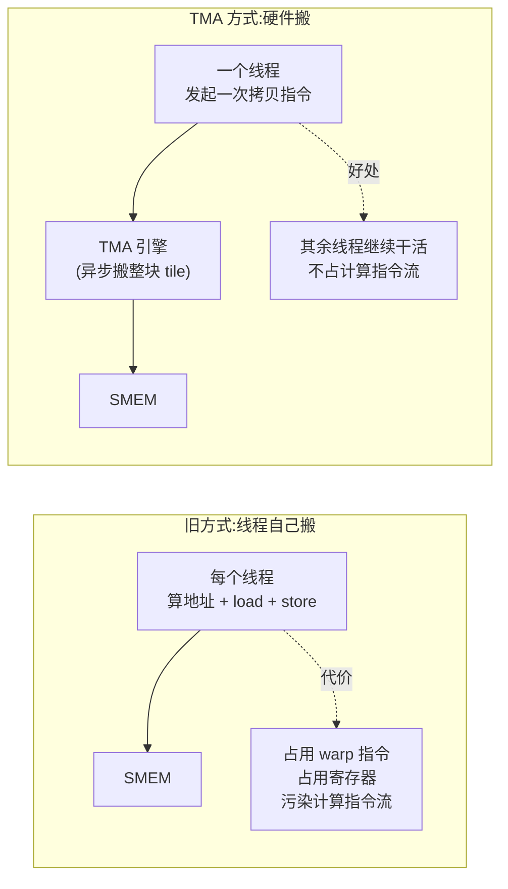
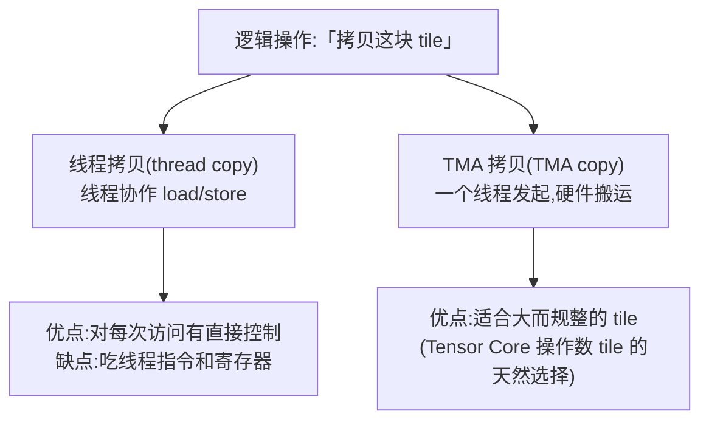
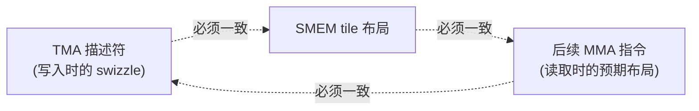
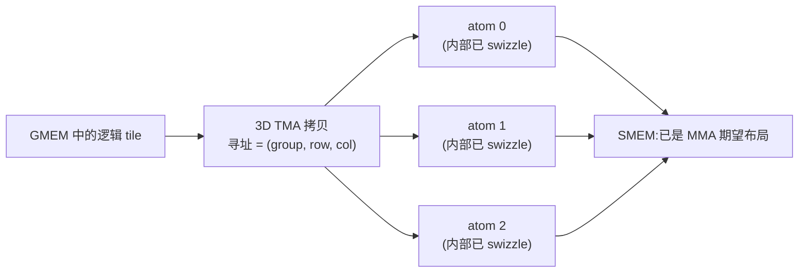
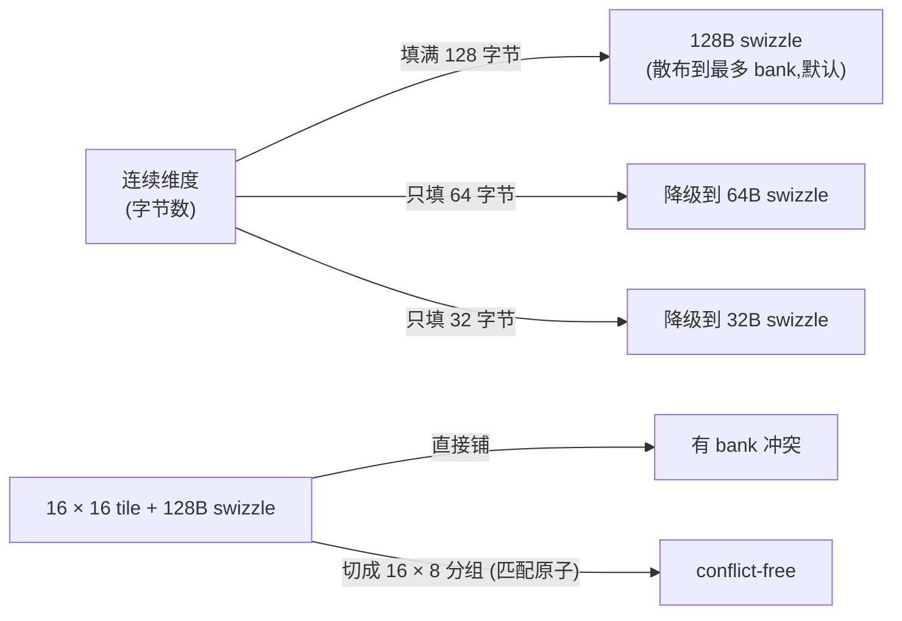
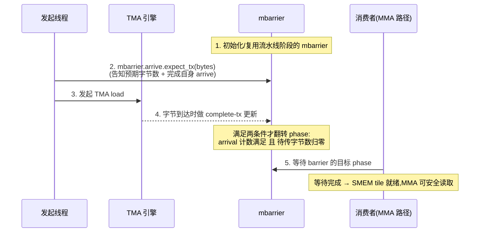
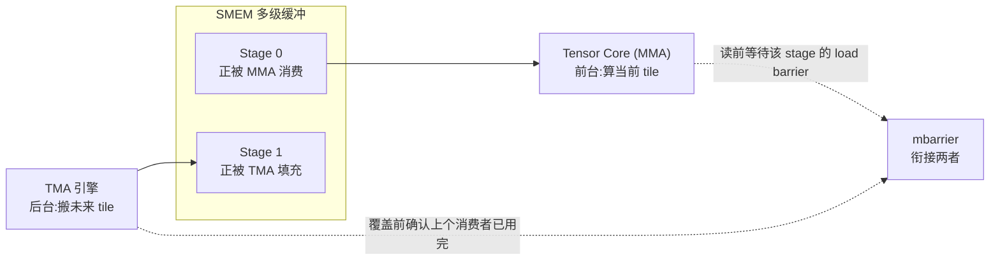

# 第 05 章 · 异步数据搬运:TMA

> 原文:[Async Data Movement: TMA](https://mlc.ai/modern-gpu-programming-for-mlsys/chapter_tma/index.html)

> **本章要点(TL;DR)**
> - 这一章只讲一件事:**GPU 怎么把数据从"大仓库"搬到"工作台"上,搬得又快又不耽误干活**。
> - **TMA(Tensor Memory Accelerator / 张量内存加速器)就是 GPU 里一个专门搬数据的硬件引擎**。你可以把它想成办公室里的"搬运工外包公司":你只要派「一个工人(一个线程)」喊一嗓子下个单,这家公司就在后台默默把一整箱货(一块矩形数据 tile)从大仓库(全局内存 GMEM)搬到你手边的工作台(共享内存 SMEM)。搬的过程中不挡你的道,你这一屋子人(整个线程块 CTA)该算的继续算。
> - **整件事靠一张「搬运清单」说了算**,这张清单的正式名字叫 **张量映射描述符(tensor-map descriptor)**:货架长什么样(形状)、一排排怎么隔开(步长)、每件货多重(每个元素几个字节)、一次搬多大一箱(tile 多大),还有最关键的 **swizzle(交织)摆放方式**,全写在这张清单里。
> - **搬进来(加载 / load)的时候,TMA 顺手就帮你把货摆好了**:箱子一落到工作台,里面的货就已经按照下游机器(Tensor Core,后面会讲,是 GPU 里专算矩阵乘的硬件)最顺手的方式排好了,省得你再单独花时间重新码一遍。前提是:搬运清单、工作台上的摆法、下游机器读取的预期,这三家得事先约定好同一套摆放规矩。
> - **怎么知道货到了 / 搬走了?** 搬进来(加载)靠一个叫 `mbarrier` 的"到货通知器"(它还会数够不够字节数);搬出去(存储 / store)靠另一套叫 commit group 加 wait group 的机制。这俩盯的是**两个不同的交接时刻**,后面会分开讲。
> - **TMA 真正的看家本领,是配合"流水线(pipelining)"**:让搬运工在后台先把「下一箱货」搬进来,同时让计算单元在前台算「眼下这一箱」,中间用通知器把两边对齐。这样机器永远不闲着。

> **前置知识**:这一章会反复用到几个词,你只要先有个大概印象就行,正文每个第一次出现的地方我都会当场再讲一遍:
> - **GMEM / SMEM**:GPU 上两层存数据的地方。GMEM(全局内存)是"大仓库",容量大但离计算单元远、取数据慢;SMEM(共享内存)是"工作台",容量小但贴着计算单元、取数据飞快。
> - **tile**:把一个大矩阵切成的小方块。矩阵太大一次装不进工作台,只能切成小块一块块搬、一块块算。
> - **GEMM**:通用矩阵乘(就是 A 矩阵乘 B 矩阵)。它是深度学习里最核心、最费算力的运算,所以是本章的"主角"。
> - **mbarrier**:一个"异步到货通知器",专门用来回答"后台那批数据到底搬完没有"。
>
> 没把握的话,先翻一下 [第 0 章 · 极简入门](./ch00_gpu_ml_primer.md);mbarrier 的细节可以看第 7 章。本章不会假设你有任何 GPU 背景,放心读。

---

## 0. 为什么需要 TMA:从「线程自己搬」说起

想搞懂 TMA,咱们先看看**没有它的时候,搬数据这活儿是怎么干的、又有多别扭**。先理解"痛"在哪,你才会明白 TMA 为什么是个好东西。

> **一句话先理解**:GPU 算得飞快,但前提是数据得喂得上。要是计算单元天天等数据,那再快的算力也是浪费。TMA 解决的就是"喂数据"这件事。

先问一句:一个矩阵乘(GEMM)、或者一个注意力(attention,Transformer 模型里那个核心运算)的 **核函数(kernel,就是"一段跑在 GPU 上的程序")**,跑得快不快,到底卡在哪儿?

答案是:卡在 **Tensor Core 有没有数据吃**。这里先解释一下什么是 Tensor Core——它是 GPU 里专门用来算矩阵乘的一块硬件,**唯一的本事就是疯狂算矩阵乘,而且算得极快**。深度学习里矩阵乘占了绝大部分算力,所以 GPU 专门造了这么个"矩阵乘专用机床"。

明白了这个,卡点就好理解了:只要数据源源不断喂上,Tensor Core 这台机床就能一刻不停地算,这种状态我们叫 **计算受限(compute-bound)**——意思是"算力已经榨干了,瓶颈是算不是别的",这是我们追求的好状态。可这有个前提:**下一批要算的输入数据(参与矩阵乘的 A、B 矩阵切出来的小方块,术语叫操作数 operand 的 tile)得及时端到机床边上**。端晚了,机床就只能停在那儿干瞪眼空转——这就浪费了。

那 **过去没有 TMA 的时候,数据是怎么搬的?** 答案是:让干活的线程自己抽空去搬。具体说,GPU 上成千上万个线程在并行干活;搬数据时,每个线程自己算好"我负责的那块数据在大仓库 GMEM 的哪个地址",发一条 load 指令把它读出来,再发一条 store 指令把它写到工作台 SMEM 上。

这么干能用是能用,但暗里要付两笔账:

1. **干活的"指令配额"被白白占用了**。GPU 里线程是按 **warp** 为单位调度的——一个 warp 就是 **32 个绑在一起、必须齐步走的线程**(可以想成 32 个人组成的一个小方阵,喊一个口令大家一起迈同一步)。这个小方阵每发一条指令都是有成本的。本该把这些宝贵的指令名额拿去喂 Tensor Core 算数,结果全耗在"算地址、读、写"这些纯搬运的杂活上了。
2. **计算线程的"思路"被搬运打断了**。这批 warp 本来应该一门心思盯着喂 Tensor Core,现在却被迫在计算指令里掺进一大堆搬运指令,节奏全乱了。

> **关键**:这两点合起来,问题就清楚了——**"搬数据"和"做计算"在抢同一拨人手、同一份硬件资源**(具体说是抢"发指令"的名额,以及抢 **寄存器**——寄存器是每个线程私有的一小块超高速存储,相当于线程手边的草稿纸,见第 0 章)。TMA 的招数很干脆:**把搬运这件事整个外包给一个专职的硬件搬运引擎**,这样计算线程就彻底腾出手来,专心算数就行,再也不用兼职当搬运工。

下面这张图把"自己搬"和"外包搬"两条路摆一块比一比(图里 SMEM 就是前面说的工作台):



> **注意**:原文这儿有个交互演示(*TMA copying a tile from global memory to shared memory*,即"TMA 把一块 tile 从全局内存搬到共享内存"),你能切换 swizzle 模式,把鼠标停在源数据某个格子上,看它最后落到工作台 SMEM 的哪个位置。静态笔记没法还原这种交互,想直观感受就去翻原书;后面我会用文字和 Mermaid 图把要点画给你看。

---

## 1. 一个线程发起,硬件搬运整块 tile

### 1.1 发起线程做什么、不做什么

一次 TMA 拷贝,是从一个**发起线程(issuing thread,就是"负责下单的那一个线程")**开头的。这里要特别强调一个反直觉的点:这个线程**不会**自己一个一个地去遍历、搬运 tile 里的每个元素。它干的活更像是去前台「下单」——递给硬件一份「搬运清单」,然后转身就走;真正一箱箱搬货的力气活,全甩给 TMA 引擎在后台干。

> **换句话说**:发起线程的工作量,跟 tile 是大是小**几乎没关系**。不管要搬 100 个元素还是 10000 个,它都只是"喊一嗓子下个单",一条指令的事。这正是 TMA 省事的根源。

这份「搬运清单」的主体,就是 **张量映射描述符(tensor-map descriptor)**——名字听着唬人,其实就是一张描述"这批数据长什么样、怎么搬"的表。它写清了这么几件事:

| 描述内容(英文术语) | 大白话含义 |
| --- | --- |
| tensor shape(张量形状) | 大仓库里那个完整大矩阵有多大,比如 4096 × 4096 |
| strides(步长) | 矩阵在内存里一行隔一行该跳多远——内存其实是一长条,矩阵是被"压扁"塞进去的,步长就是告诉硬件"换行时地址该加多少",这样才能正确寻址 |
| element size(元素大小) | 每个数占几个字节(比如 float16 占 2 字节) |
| tile shape(tile 形状) | 每次搬一小块,这一小块多大,比如 64 × 64 |
| swizzle mode(交织模式) | 货搬到工作台后按哪种方式摆放(这是本章重点,第 2 节细讲) |

> **一句话先理解**:描述符里这些信息,大部分在核函数一开始就定好、**整个过程都不变**——因为大矩阵的形状、每个数多大,这些是固定的。

光有这张清单还不够。真要发起某一次具体的拷贝,还得临时补上两个「这一次专属的坐标」:

- 这回到底从大矩阵的**哪个位置**抠出一块 tile(术语叫 tile 坐标 / tile coordinates,相当于"我要第 3 行第 5 列那一小块")。
- 抠来的这块 tile,**放到工作台 SMEM 的哪个具体地址**上。

这么对比就清楚了:**描述符回答的是"这个大矩阵长啥样、怎么排的"(固定不变),坐标回答的是"这一次具体搬哪一块、搬到哪儿"(每次都可能不一样)**。一个是常量,一个是这次调用的参数。

指令一发出去,拷贝就**异步(asynchronous)**地跑起来了。"异步"这个词后面会反复出现,这里先讲清楚:它的意思是"我下了单就不管了,接着干别的,搬运在后台自己进行"——跟你点了外卖不会站在门口干等、而是继续做事是一个道理。所以发起线程下完单接着往下走它的,**CTA**(一个线程块,即一组互相协作、能共用同一块工作台 SMEM 的线程,见第 0 章)里其他线程也照样干活,没人停下来等。这会儿搬运的事全归 TMA 引擎管,不再是一串普普通通的 load/store 指令在那儿循环。

### 1.2 同一个逻辑操作,两条实现路径

注意,有了 TMA 之后,"自己搬"那条老路并没有消失——它俩是**并存的两个选项**。同样是「把这块 tile 拷过去」这件事,核函数现在有两种写法:



这两条路,**"怎么确认搬完了"的规矩不一样,跑出来的性能也不一样**。到底走哪条,这个选择本身有个名字,叫**分发(dispatch)决策**——你可以理解成"派活儿":这趟活儿是派给普通线程,还是派给 TMA。原文把"一次拷贝"这件事拆成三个互不打架的概念,这么一拆就清楚多了:

- **布局(layout)**:核函数想要数据在内存里排成啥样(形状、摆放方式)。
- **作用域(scope)**:哪些线程、哪些 CTA 来掺和这次拷贝(谁负责)。
- **分发(dispatch)**:这次拷贝用普通线程代码来做,还是丢给 TMA 来做(派给谁)。

这三个概念彼此独立,组合起来才描述清楚"一次拷贝到底怎么发生"。

---

## 2. Swizzle 布局:不只是「搬到」,还要「摆对」

> **一句话先理解**:swizzle(交织)就是"换一种方式摆货",目的是让计算单元后面去取数据时不会"挤在一起排队"。它只改"东西摆哪",不改"东西是什么"。

### 2.1 为什么搬到位还不够

把 tile 搬进工作台 SMEM,其实只算干完一半。为啥?因为 Tensor Core 这台机床不光要求工作台上装的是**对的货**,还要求这些货**摆成对的样子**。摆得不对,它去取的时候就慢。

慢在哪儿?这里得讲一个重要的硬件细节:**SMEM bank 冲突**。工作台 SMEM 在硬件上被切成了好多个并排的小格子,每个叫一个 **bank(存储体)**。它的妙处是:**只要不同线程取的数据落在不同的 bank 上,大家就能同时取,飞快**;可一旦多个线程同时想取的数据挤在了**同一个 bank** 上,硬件就只能让它们排队、一个一个来——这就叫 **bank 冲突**,是 SMEM 变慢的头号原因(见第 0 章)。打个比方:超市有 32 个收银台(bank),顾客分散到不同台子结账就很快;要是所有人都挤一个台子,后面就得排长队。

那怎么避免大家挤一个 bank?这时候 **TMA swizzle(交织)** 就上场了。TMA 往工作台写这块 tile 的同时,能顺手**把它在 SMEM 里的摆放位置打乱重排一下**(术语叫 permute,就是"做一次位置置换")。注意:**逻辑上**看,这块 tile 还是规规矩矩一个矩形,该是第几行第几列的元素还是第几行第几列;只是它们**物理上**落在 SMEM 的哪些格子,被交织故意错开了,好让后面取数据时正好散落在不同 bank 上,避开排队。

> **关键**:用哪种 swizzle 方式,前面那张"搬运清单"(描述符)里就写好了。所以发起线程**根本不用自己动手做交织**——字节落进工作台那一刻,TMA 引擎已经顺手替你摆好了。这是 TMA 又一个省事的地方:搬运和"摆对"一步到位。

### 2.2 「一致约定」是硬性前提

swizzle 是省事,但带来一条**绝对不能破的铁律**:**有三方必须对"货怎么摆"达成完全一致的口径**。哪三方?看下图。



这条铁律有多硬、不守会多惨?你想想这个场景:TMA 拿"A 方式"把数据交织着写进去,可后面真正去算矩阵乘的指令(叫 **MMA**,全称矩阵乘累加 matrix multiply-accumulate,就是 Tensor Core 执行的那条核心指令,"一边乘一边把结果累加起来")却以为数据是按"B 方式"摆的,于是按"B 方式"去读。这时候硬件会怎样?**它不会报错,它就老老实实照你说的"B 方式"去读**——因为硬件没法知道你写的时候用的是"A 方式"。结果呢?读出来的字节全错位,算出来的数字跟着错,而且**一声不吭、半点提示都没有**。这种 bug 极难查,因为程序照跑不误,只是结果是错的。

举个例子。假设核函数声明某个操作数 tile 按 **128 字节 swizzle 布局** 来存,那么:TMA 描述符里就必须写对应的 128 字节 swizzle 模式,后面 MMA 指令也必须按这同一套排布去读。三方说好同一套规矩,数据才对得上。这也正是"布局记号(layout notation)"存在的意义——它不是给人看着玩的注释,而是一份"白纸黑字的合同":你在编程框架(DSL)里写下的布局,必须跟 TMA 描述符、跟 Tensor Core 指令实际用的硬件布局,严丝合缝、字字对上。

> **换个角度想**:swizzle **从不改变逻辑上的 tile**。后面 MMA 要算的,还是同一个逻辑上的 A、B 矩阵小块,数值一个没变。swizzle 只管这块 tile **在物理上怎么跨着那些 bank 摆**。一句话:它改的是"某个元素被放进了哪个物理格子",而不是"这个元素本身是几"。理解这一点,你就不会被 swizzle 吓到——它本质只是个"换地方摆"的小动作。

---

## 3. 3D TMA:在一次拷贝里同时完成「分块」和「swizzle」

> **一句话先理解**:前面讲的搬运是把一块平平整整的方块搬过去;但 Tensor Core 想要的摆法更讲究,得把方块切成一小颗一小颗"标准包装盒"码好。3D TMA 就是让搬运的同时,顺手把货码进这些标准盒子里。

### 3.1 问题:Tensor Core 想要的是「分块进 swizzle 原子」的布局

最普通的 TMA 拷贝是 **2D** 的——搬的是一块**扁平的二维 tile**,就是个规规矩矩的矩形,想象成一张表格直接搬过去。

可 Tensor Core 想要的工作台布局往往没这么省心:它要这块 tile 被**切成一颗一颗的"标准小盒子"码放**。这个"标准小盒子"有个术语,叫 **swizzle 原子(atom)**——"原子"在这里就是"不可再分的最小标准单元"的意思(借用了化学里"原子是最小单位"的说法,跟物理无关)。具体到 GPU,这个原子的尺寸是 **8 × 128 字节**(《数据布局及其记号》那章详细讲过),你可以理解成"硬件规定的、最顺手的一个标准搬运/摆放单位"。

现在矛盾来了:一块扁平的大方块,和"切成一颗颗标准盒子码好"这两种摆法对不上,怎么办?TMA 的解法挺妙:**给搬运清单再加一个维度**——从二维升到三维。

### 3.2 3D TMA 的寻址方式:(group, row, col)

**3D TMA** 把工作台 SMEM 当成一个三维的货架来寻址,用三个坐标 `(group, row, col)` 来精确点到任意一个位置:

- **group(第几个盒子)**:在一颗颗"标准盒子"(原子)之间跨步,相当于"走到第几个盒子"。
- **row / col(盒子内的行、列)**:定位**某一个盒子内部**的具体位置。

打个比方:这就像图书馆找书,要先说"第几个书架(group)",再说"这个书架上的第几行第几列(row, col)"。

有了这三维坐标,**一次 3D 拷贝**就能一口气把原本两件分开的事都办了:

1. **分块(tile)**:把这块大 tile 一个盒子一个盒子地铺开摆好。
2. **swizzle(交织)**:在每个盒子内部顺手做好交织。

最妙的是落地结果:数据刚搬进工作台的那一刻,**就已经是 MMA 直接想要的样子了**,不用再额外花一趟功夫去分块或者交织。一步到位。



> **注意**:原文配了个交互演示 *a 3D TMA copy, addressed as (group, row, col), tiling into swizzled shared memory*(即"一次按 (group, row, col) 寻址、把数据分块码进已交织共享内存的 3D TMA 拷贝")。想直观体会这个寻址过程,去原书点点看。

### 3.3 swizzle 格式的选择:取决于 tile 能不能「填满」原子

那到底该选哪种 swizzle **格式**(128 字节 / 64 字节 / 32 字节)呢?这事跟分块绑得死死的。背后就两条道理,慢慢说:

- **道理一:swizzle 越宽越好(只要用得上)。** swizzle 越宽,就越能把同一列数据**摊薄到更多 bank** 上,后面读的时候就越不容易撞车排队。所以只要塞得下,**128 字节 swizzle 永远是默认首选**。回想前面超市的比方:把顾客摊到 32 个收银台,当然比摊到 8 个更不容易排队。
- **道理二:但宽 swizzle 有"门槛",tile 太瘦就用不了。** 一个 N 字节的原子(标准盒子),要求 tile 那条"连续摆放的方向"(术语叫**连续维度**,就是内存里地址连着排的那一维)**正好能把这个盒子填满**。要是某块 tile 因为形状限制太"瘦",连续维度凑不够 128 字节、填不满这个大盒子,那 **128 字节 swizzle 就用不成**,只能退而求其次,降到 64 字节;还不够就再降到 32 字节。

> **经验法则**:在"能把盒子填满"的前提下,挑**最大**的那个 swizzle 格式。又想散得开、又不能有填不满的空当,取这两者的平衡。

原文举了个特别直观的例子:拿一个 **16 × 16 的 tile** 直接套 128 字节 swizzle,会撞车(bank 冲突);非得把它切成正好对得上原子的 **16 × 8 分组**,才能做到**无冲突(conflict-free,即完全没有 bank 冲突、取数据全程不用排队)**。

下面这张图帮你建立「填满 vs 填不满」的直觉:



| swizzle 格式 | 什么时候用 | 数据散到 bank 的程度 |
| --- | --- | --- |
| 128 字节 | 连续维度能填满 128B 时(默认首选) | 最广(最不容易排队) |
| 64 字节 | tile 偏小、填不满 128B 时降一档 | 中等 |
| 32 字节 | tile 更小、连 64B 都填不满时再降一档 | 较窄 |

---

## 4. 完成机制(一):加载用 `mbarrier`

> **一句话先理解**:既然搬运是"下了单就不管、后台慢慢搬",那总得有个办法知道"货到底到没到",才能安全地去用。这一节讲的就是"到货通知"怎么做。

### 4.1 为什么「发出指令」不等于「可以读」

别忘了前面反复强调的:TMA 拷贝是**异步**的。这就带来一个必须小心的陷阱:**指令发出去那一刻,数据根本还没到位**(后台正搬着呢)。

所以,后面要用这块数据的代码(我们叫它**消费者 / consumer**,就是"等着用货的人")**绝对不能**一看见 TMA 指令发出去了,就急吼吼跑去读工作台上的 tile——这时候去读,读到的多半是上一批的残留数据或者半成品。必须等 TMA 引擎真把字节**全写完了**,这块 tile 才安全、才能读。这就像外卖,你不能听见"已下单"就去开门拿,得等"已送达"。

那怎么知道引擎到底写完没?对 TMA **加载(load,即"从大仓库往工作台搬进来")**来说,负责报"搬完了"这个信儿的,就是 `mbarrier`(细节看《异步协调:mbarriers》那章)。你可以把 `mbarrier` 理解成一个**专门的到货通知器**:生产数据的一方搬完了就来这儿"打个卡",等货的一方就守在这儿等"打卡齐了"的信号。

### 4.2 标准时序

下面这张时序图把"下单 → 后台搬 → 通知到货 → 安全读取"整个过程的五步走画了出来。先扫一眼,后面 4.3 会把最关键的那一步掰开揉碎讲:



### 4.3 关键 API:`mbarrier.arrive.expect_tx`

这一节出现一条 GPU 专用指令,你不需要会写,只要看懂它"在干嘛"就行。它长这样:

```ptx
mbarrier.arrive.expect_tx(bytes)
```

逐段拆给你看这行在说什么:
- `mbarrier` —— 操作的是前面那个"到货通知器"。
- `arrive` —— "到达/打卡"的意思。
- `expect_tx` —— `tx` 是 transfer(传输)的缩写,`expect_tx` 就是"预告这次要传多少字节"。
- `(bytes)` —— 括号里填的就是这次预计要搬进来的字节总数。

所以这一条指令,**一口气干了两件事**:

1. **登记"这次预计要搬进来多少字节"**(比如要搬 8192 字节,就把这个数告诉通知器);
2. **顺手替发起线程在通知器上"打个到达的卡"**。

为什么要"预告字节数"?因为通知器要靠它来判断货齐没齐——它会一边收 TMA 引擎"我又写进去了多少字节"的汇报,一边对照这个预告的总数,直到对上,才算"真的搬完了"。这是一种很可靠的"按量验收"。

> **关键**:可别误会——调了这条指令**绝不等于通知器就亮绿灯了**。它只是"预告 + 打卡"。真正放行,还得等 TMA 引擎把字节一点点写够、回话说"该到的字节全齐了"。
>
> 用术语说:通知器有个状态叫 **phase(相位)**,你可以理解成一个"轮次开关",**非得下面两个条件同时满足,它才会翻转(从"还没好"翻到"好了")**:
> 1. 该打卡的线程都打卡了(arrival 计数到位);
> 2. 预告的字节一个不差地全搬到了(待传字节数 pending byte count 清零)。

接下来,等货的消费者就守在这个通知器上等。一旦等到它翻转(到达目标 phase),就说明工作台上的 tile 已经备齐,这时候算矩阵乘的 MMA 那条路才能放心去读。两个条件缺一不可,正是这个机制可靠的原因——既保证"人到齐",又保证"货到齐"。

原文这儿还配了张同步流程图(`tma_sync_flow.png`),意思跟上面那张时序图一模一样:**生产者(producer,生产数据的一方)是 TMA 引擎,消费者(consumer,等着用数据的一方)是 MMA 那条路(或者随便哪段要读工作台 tile 的代码),通知器 mbarrier 就是横在它俩中间那个说一不二的交接关卡**。这套"一方生产、一方消费、中间靠 barrier 交接"的模型在 GPU 异步编程里到处都是,不只 TMA 用——你这里学会了,后面看别的异步场景也是同一套路。

---

## 5. 完成机制(二):存储用 commit group + wait group

> **一句话先理解**:搬进来要"到货通知"(因为有人等着用);搬出去关心的是另一码事——"我这块工作台啥时候能空出来再用",所以用的是另一套更简单的"批量验收"机制。

### 5.1 为什么 store 的完成机制不一样

TMA **存储(store)** 是上一节的反方向:把算好的结果从工作台 SMEM 搬回大仓库 GMEM(比如算完一块结果,得写回去存着)。它一样是异步的,但**确认"搬完没"的机制换了一套**。为啥要换?根子上是因为这两件事**关心的"交接时刻"不一样**——看下面这张对照表就一目了然:

| | TMA 加载(load) | TMA 存储(store) |
| --- | --- | --- |
| 数据方向 | GMEM → SMEM | SMEM → GMEM |
| 典型场景 | 喂给同核函数内的消费者(MMA) | 把最终结果写出到 GMEM |
| 核函数关心什么 | SMEM tile 何时**就绪可读** | 何时可以**安全复用 SMEM 缓冲区** / 确认搬运排空 |
| 完成机制 | `mbarrier`(带字节计数) | commit group + wait group |

说白了,两边操心的东西根本不是一回事:
- **加载**是要把一块刚搬进来的工作台 tile **亮给后面等着算的消费者看**,所以必须靠 `mbarrier` 精确地点对点通知一声"你的货好了"。
- **存储**是把最终结果往大仓库写出去,**一般压根没有哪段核内代码在等这个结果**(它写出去就完事了)。核函数真正惦记的是另一码事:**"我刚才用来放结果的那块工作台 SMEM,啥时候能安全地腾出来、装下一批东西?"**——所以它要的不是"通知谁",而是"确认那批写出去的动作都排空了、SMEM 可以回收了"。

### 5.2 用法

用起来是这么个直白的流程,三步:

1. 核函数发出一个或者好几个 store(往外写的动作)。
2. 把这些动作**提交(commit)成一组**——`commit group` 就是"把刚才发出的这一批打个包、记成一组"。可以理解成"把这一摞快递交给快递站统一发"。
3. 过一会儿再来**等(wait)这一组排空(drain)**——`wait group` 就是"守着这一组,等它全部送达"。"排空"是个形象说法:把还在管道里没传完的数据全部传完、管道清空。

等待一返回,在核函数看来这组 store 就算全干完了,它们之前占着的那块工作台 SMEM 也就能放心收回来、装下一批数据了。

原文用一段很精炼的对照,把"搬进来"和"搬出去"这两套机制并排总结:

```text
TMA load(搬进来): 用 mbarrier 等待(还会按字节数核对到底齐没齐)
TMA store(搬出去): 用 commit group + wait group 等待(把一批打包、再等它排空)
```

> **理解**:这两套机制说到底是在干**同一类事——"确认异步操作真的完成了"——只不过盯的"交接时刻"不一样**。加载盯的是"一块工作台 tile 啥时候能给下游用";存储盯的是"往外写的动作啥时候真的排空了",这样核函数才敢回收那块工作台、或者放心往下走。别被两个名字绕晕:核心都是"异步发出去之后,怎么知道好了"。

---

## 6. 为什么 TMA 对流水线(pipelining)至关重要

> **一句话先理解**:前面所有铺垫,都是为了这一节。TMA 最大的价值,是让"搬下一批"和"算这一批"同时发生、互不耽误——这就是流水线。

前面铺垫了这么多,TMA 真正大显身手的时刻,就是它当上**流水线(pipelining)**里一环的时候。先解释流水线是啥:它就是工厂流水线那个意思——**别等一道工序干完再开始下一道,而是让多道工序同时进行、首尾搭接**,这样整体吞吐量最高。

放到 GPU 上,核心思路一句话就够:**Tensor Core 正埋头算着「当前这块 tile」的时候,核函数就抢先把「下一块 tile」的搬运给发出去了**。搬运在后台闷头跑,计算在前台连轴转,两件事重叠进行;等「下一块 tile」终于轮到要被算了,它其实早就搬好躺在工作台上了——这时候那个到货通知器(barrier)负责把"搬好了"和"该算了"这两条线对接上。这么一来,Tensor Core 几乎永远不用停下来等数据,算力就被榨得满满当当。

> **为什么这招管用**:回想第 0 节的痛点——计算单元最怕的就是"等数据干瞪眼"。流水线的整个目的,就是用"提前搬"把这段等待时间藏起来(术语叫"隐藏延迟")。搬运再慢,只要它是在你算上一块的同时偷偷进行的,你就感觉不到它的耗时。

一个典型的矩阵乘(GEMM)循环就翻来覆去地用这套结构,它有个专门的名字,叫**多级缓冲(multi-stage buffering)**——"多级"指的是工作台上同时备好几块格子轮流用,下面这张图画的就是最简单的两块格子(两级)的情形:



这里出现一个新词 **stage(阶段 / 一级缓冲)**:你就把它理解成"工作台上的一块格子"。图里有两块格子,一块正被 Tensor Core 拿去算(Stage 0),另一块正被 TMA 在后台填新数据(Stage 1)。循环每往前走一步,这几块格子的角色就**轮一次班(rotate)**——刚算完的那块腾出来让 TMA 填,刚填好的那块交给 Tensor Core 算,如此循环。就像两个传菜口轮流上菜,厨房和餐桌都不用停。

要让这套轮班不出乱子,规矩就两条(都靠通知器 barrier 把关):

- **Tensor Core 想读某块格子之前**,先等这块格子的"到货通知"(确认 TMA 真把数据搬齐了,别读到半成品);
- **TMA 想往某块格子写新数据(覆盖旧的)之前**,先确认上一轮用这块格子的消费者已经读完了(别把人家还没看完的数据给盖掉了)。

> **关键**:讲到这儿,你就能明白为啥在 Blackwell、Hopper(NVIDIA 较新的两代 GPU 架构;Hopper 就是大名鼎鼎的 H100 那一代,Blackwell 比它更新)风格的核函数里,**TMA 和 `mbarrier` 几乎总是成对出现、形影不离**。道理很简单:TMA 提供的是"异步搬运引擎",只管把货搬过来;`mbarrier` 提供的是"精确判断货啥时候就绪"的本事,只管通知。**一个负责搬、一个负责通知,缺了任何一个,这套流水线都转不起来**——搬了不通知,没人敢用;通知了没东西搬,通知个寂寞。所以它俩是天生的搭档。

---

## 小结

回头把这一章串成一句人话:**GPU 算得飞快,但前提是数据喂得上;TMA 就是那个专门负责"又快又不耽误干活地喂数据"的硬件搬运工。** 下面是要点回顾:

- **TMA 就是个硬件搬运引擎**:派一个线程喊一声下个单,硬件就在后台异步把整块矩形 tile 搬好,把"搬运"这件杂活彻底从计算线程的活儿里拎出去——计算单元(Tensor Core)就不会被搬运拖后腿了。
- **张量映射描述符(那张"搬运清单")是核心抽象**:形状、步长、元素大小、tile 形状、swizzle 摆法全装在里头;它把"一次拷贝"从"一长串自己算地址、自己 load/store 的循环"简化成"一份清单 + 喊一声发起"。
- **swizzle 在搬进来的路上顺手就把货摆对了**:数据落进工作台那一刻,已经摆成 Tensor Core 最顺手的样子,省去单独重排。但有铁律:搬运清单、工作台布局、读数据的 MMA 这三方必须说好同一套摆法,否则硬件会"忠实地"给你算出错误结果,还不报错。
- **3D TMA 用 `(group, row, col)` 三维坐标寻址**,一次拷贝就把"按标准盒子(原子)分块"和"盒子内交织"两件事一块办了;swizzle 格式(128/64/32 字节)选哪个,看 tile 那条连续维度能不能填满对应的盒子——经验法则是:能填满的前提下挑最大的。
- **"确认搬完了"分两套机制**:搬进来(加载)用带字节核对的 `mbarrier`(人到齐 + 字节到齐,通知器才翻转放行);搬出去(存储)用 commit group + wait group(打包一批、等它排空)。两套盯的是不同的交接时刻。
- **TMA 的终极价值落在流水线上**:前台算这一块、后台搬下一块、通知器把两边对齐——这正是现代矩阵乘(GEMM)和注意力(attention)核函数能把 Tensor Core 喂得满满当当、不留空闲的关键。

## 延伸阅读

- 原文:[Async Data Movement: TMA — Modern GPU Programming for MLSys](https://mlc.ai/modern-gpu-programming-for-mlsys/chapter_tma/index.html)
- 相关章节(原文中引用):《What Makes a Kernel Fast》(核函数性能受限因素)、《Data Layout and Its Notation》(数据布局与 swizzle 原子)、《Async Coordination: mbarriers》(mbarrier 的异步协调模型)。

## 术语对照

| 中文 | English |
| --- | --- |
| 张量内存加速器 | Tensor Memory Accelerator (TMA) |
| 张量映射描述符 | tensor-map descriptor |
| tile 坐标 | tile coordinates |
| 交织(模式) | swizzle (mode) |
| swizzle 原子 | swizzle atom |
| 共享内存 | shared memory (SMEM) |
| 全局内存 | global memory (GMEM) |
| 异步屏障 | mbarrier |
| 相位 | phase |
| 字节计数追踪 | byte-count tracking |
| 提交组 / 等待组 | commit group / wait group |
| 矩阵乘累加 | MMA (matrix multiply-accumulate) |
| 协作线程阵列 | CTA (Cooperative Thread Array) |
| 通用矩阵乘 | GEMM |
| 计算受限 | compute-bound |
| 流水线 | pipelining |
| 多级缓冲 | multi-stage buffering |
| bank 冲突 | bank conflict |
| 分发(决策) | dispatch |
| 作用域 | scope |
