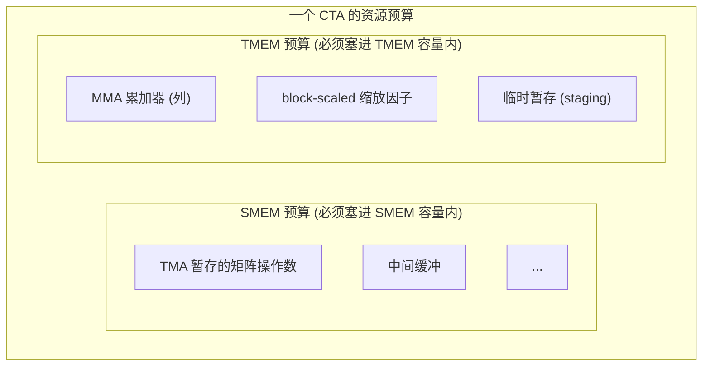
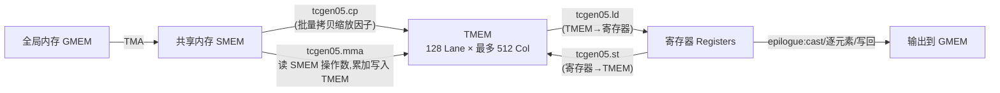

# 第 06 章 · 特殊内存:TMEM(Tensor Memory)

> 原文:[Special Memory: TMEM](https://mlc.ai/modern-gpu-programming-for-mlsys/chapter_tmem/index.html)

> **本章要点(TL;DR)**
>
> 别急,下面几条要点里有不少生词(TMEM、Tensor Core、累加器、SMEM……),现在看不懂完全正常——这一章后面每个词都会用大白话从头讲一遍。这里先囫囵扫一眼,留个印象就好:
>
> - **TMEM(Tensor Memory,张量内存)是 Blackwell 这一代显卡才有的一块"片上小内存"**(片上 = 直接长在 GPU 芯片里、离计算单元很近、所以特别快)。它专门伺候新一代的矩阵乘硬件指令族 `tcgen05`。它的形状是一张二维表格:**128 行(叫 Lane)× 最多 512 列(叫 Col)**,每个格子宽 32 位(也就是 4 个字节,正好装一个常见的 float)。这块"便笺纸"(scratchpad,意思是临时打草稿的地方)在每个 SM(GPU 内部的一个独立计算核心,后面会细讲)上各有一块。
> - **它来到世上的头号任务,就是给"寄存器"减负**。寄存器是每个线程私有的、最快但极少的存储(类比:CPU 里的寄存器)。以前的显卡(Hopper 及更早)做矩阵乘时,算出来的中间结果(叫累加器 accumulator)得全程占着寄存器;Blackwell 改成把累加器直接写进 TMEM,这样寄存器不被挤爆,也能让矩阵乘硬件一次处理更大的数据块、跑得更快。
> - **TMEM 靠「二维坐标 (Lane, Col)」找位置**——给一个"第几行、第几列",而不是像普通内存那样给一个"第几个字节"。在本书的布局记号(TIRx)里,这两根坐标轴写作 `TLane` 和 `TCol`。
> - **TMEM 得你自己写代码去申请、用完自己还**(以线程块为单位、每次按 32 列起批)。它不像寄存器那样编译器替你安排好——你得把它当成一种"数量有限、要精打细算做预算"的资源,和共享内存(SMEM)一个性质。
> - **平时读写共享内存的那套指令根本碰不到 TMEM**。数据想进想出,只能走专用、而且是**异步**(asynchronous,指令发出去后不等做完就先返回,你得另外等它)的 `tcgen05` 指令:`tcgen05.ld`(从 TMEM 搬回寄存器)、`tcgen05.st`(从寄存器写进 TMEM)、`tcgen05.cp`(从共享内存批量拷进 TMEM),每条还得配上各自专门的"等它做完"的机制。

---

> **前置知识**:这一章会反复用到几个 GPU 基本概念——寄存器、共享内存、线程束(warp)、Tensor Core、矩阵乘。本章每个词第一次出现时都会用大白话当场解释一遍,所以就算你完全没碰过 GPU 也能往下读。但如果你想先打个底、读起来更顺,可以花十分钟翻一下 [第 0 章 · 极简入门](./ch00_gpu_ml_primer.md);任何时候卡在某个术语上,也可以随手查 [术语对照表](./术语对照表.md)。

---

## 引子:寄存器不够用,Blackwell 才另开了一条路

> **一句话先理解**:GPU 上做矩阵乘,算到一半的中间结果总得有地方暂存。以前一直塞在"寄存器"里,但寄存器太少不够用;Blackwell 就专门加了 TMEM 这块新内存来接这个活儿。这一节就讲清楚"为什么寄存器不够用"。

要搞懂 TMEM 为什么会出现,咱们先问一个最朴素的问题:**矩阵乘一边算,算到一半的中间结果,到底该放哪儿?**

先解释两个词。GPU 做深度学习,核心工作量就是**矩阵乘法**(两个大矩阵相乘),所以厂商专门造了一块硬件来加速它,叫 **Tensor Core**(张量核心)——你可以把它想成"专门飞快地算矩阵乘的小电路"。它干活的方式叫 **MMA(Matrix-Multiply-Accumulate,矩阵乘累加)**:不是一口气把整个矩阵乘完,而是一小块一小块地乘,然后把每一小块的结果**累加**到一个running total上。这个一直被累加、存放当前总和的东西,就叫**累加器(accumulator)**。

那这个累加器存哪儿?在 Hopper 和更早的 GPU 上,答案很简单——放**寄存器**里。寄存器是 GPU 上最快但也最少的一种存储,**每个线程私有一份**(类比 CPU 寄存器,但 GPU 上成千上万个线程,每个都自带一小撮)。整个流程也好理解:

1. MMA 指令一算完,就吐出一个**寄存器片段(register fragment)**——所谓"片段",是因为一整个累加器矩阵被切成很多小份,**每个线程的寄存器里只放其中一小份**,拼起来才是完整的累加器;
2. 接下来整个**计算阶段(compute phase)**,内核(kernel,就是跑在 GPU 上的那段程序)就让这个片段**一直赖在寄存器里**,反复往上累加;
3. 等到收尾的 **epilogue(尾声阶段)**——专门负责给最终结果做类型转换、逐元素加工、再写回去——内核才把片段从寄存器读出来,做类型转换(cast,比如把高精度的 float32 转成省空间的 float16)、做逐元素操作,最后写回内存。

这一套听着挺顺。可问题来了:**寄存器又少又金贵,而且是一个线程一个线程死死分好的**——总量就那么点,分给这个变量多了,分给那个就少了。这就埋下了一个绕不过去的矛盾。

> **关键**:Tensor Core 就好「大 tile」这一口。这里的 **tile(瓦片)** 指的是从大矩阵里切出来的一个小方块——因为矩阵太大,没法一次性塞进 GPU,只能切成小块一块一块算。tile 切得越大,Tensor Core 每次能干的活越多、利用率越高、整体越快(这叫吞吐高)。可 tile 一大,要暂存的累加器片段也跟着变大;片段一变大,它在每个线程的寄存器里就占得越多,把线程本来要用的其他变量全挤出去了。说白了,「想用大 tile 跑得更快」和「累加器全塞寄存器」这两件事,直接顶上了——鱼和熊掌不可兼得。

这个矛盾,画张表就一目了然。每个线程能用的寄存器数量是固定死的("寄存器文件"就是一个线程那一整撮寄存器的统称)。同一块寄存器文件,在小 tile 和大 tile 两种情况下被占成什么样,对比一下:

| 场景 | 累加器片段占用 | 留给其他工作变量的空间 | 结果 |
| --- | --- | --- | --- |
| 小 tile | 较小 | 充足 | 舒服 |
| 大 tile | 几乎占满整个寄存器文件 | 被严重挤压 | 溢出 / 降低占用率 |

表里两个词解释一下:**"溢出(spill)"**——寄存器实在装不下,编译器只好把一部分变量临时挪到慢得多的内存里,跑起来就拖后腿;**"占用率(occupancy)"**——简单说就是 GPU 上同时能跑多少个线程,每个线程吃的寄存器越多,能同时挤上去的线程就越少,GPU 就越闲。两样都是越差越糟。

**Blackwell(NVIDIA 2024 年这一代 GPU 架构的代号)就是冲着这个矛盾下的刀。** 思路很直接:既然寄存器装不下大累加器,那干脆**别让累加器一直占着寄存器**。所以新指令 `tcgen05.mma` 不再把累加器留在寄存器里,而是直接写进一块**全新加的片上内存——也就是 TMEM**。这块内存,早期的 NVIDIA GPU 压根儿没有,是这一代才新长出来的。

这么一改,好处立竿见影:**Blackwell 能开更大的 Tensor Core tile 了,还不用拿每个线程的寄存器去硬扛整个累加器。** 那代价呢?天下没有免费的午餐——TMEM 不像寄存器那样白送给你、编译器替你打理好。下面这些活儿,都得你在内核代码里**亲自动手**:

- 自己去**分配(allocate)** 一块 TMEM(就像写代码时手动 `malloc` 一块内存);
- 用**对的布局(layout)** 去寻址(布局 = 数据在内存里怎么摆放的规则,后面会细讲);
- 用**对的指令**把数据搬进搬出(普通的内存读写指令在这儿不好使);
- 一个线程块用完了,记得把这块 TMEM **释放(free)** 还回去(就像手动 `free`,不然别人没得用)。

这里出现了一个新词 **CTA**,后面会反复用到,先记一下:CTA(Cooperative Thread Array,协作线程阵列)其实就是**一个线程块(thread block)**——一组会被一起调度、能互相协作、共享同一块快内存的线程。你暂时把"CTA"和"线程块"当成同义词就行。

下面我们就一条一条来看:TMEM 长什么样、怎么分配、怎么读写。

---

## TMEM 是一个二维地址空间

> **一句话先理解**:你平时用的内存都是"一维"的——给一个地址(第几个字节)就能定位,像一条长长的纸带。TMEM 偏不,它是"二维"的,像一张 Excel 表格,你得给"第几行、第几列"才能定位到一个格子。

先记一句话:**TMEM 不是一条扁平的字节数组,它是一张二维网格(像棋盘 / Excel 表)。** 普通内存那套「给个线性字节偏移(第几个字节)就能定位」的玩法,在这儿行不通——你必须给一对坐标。硬件给 TMEM 的两根坐标轴起了名字,一根叫 **Lane**(可以理解成"行"),一根叫 **Col**(Column 的缩写,就是"列"):

| 维度 | 含义 | 规模 | 备注 |
| --- | --- | --- | --- |
| **Lane** | 行(纵向) | 128 个 Lane 行 | 对应 TIRx 记号里的 `TLane` 轴 |
| **Col** | 列(横向) | 最多 512 个 Col 列 | 每个 Col 是一个 **32 位的列**,对应 TIRx 记号里的 `TCol` 轴 |

这个形状可不是拍脑袋定的:**矩阵乘指令 `tcgen05.mma` 往里写累加器时,用的就是这套二维结构**,因为矩阵本身就是二维的,用二维内存来装它最顺手。所以你想定位 TMEM 里的某个位置,得给一对坐标——一个 Lane、一个 Col,而不是一个字节偏移。

下面这张表就把这张二维网格画了出来(对应原书的 `tmem_grid` 图):纵着看是 Lane(128 行),横着看是 Col(最多 512 列,每个 Col 宽 32 位)。每个格子,就是一个 (Lane, Col) 坐标对应的一个存储位置。

|         | Col 0 | Col 1 | Col 2 | ... | Col N-1 |
| --- | --- | --- | --- | --- | --- |
| **Lane 0**   |  |  |  | ... |  |
| **Lane 1**   |  |  |  | ... |  |
| **Lane 2**   |  |  |  | ... |  |
| **...**      |  |  |  | ... |  |
| **Lane 127** |  |  |  | ... |  |

- 竖着的行:128 个 Lane,也就是 `TLane` 轴。
- 横着的列:最多 512 个 Col,也就是 `TCol` 轴,每个 Col 宽 32 位。

### 在 TIRx 布局记号里怎么写

在动手前先说清楚 **TIRx** 是个啥:它是本书用来描述 GPU 程序的一套**领域专用语言(DSL)**,你可以粗略地把它理解成"一种专门用来写 GPU 张量计算的小语言"(IR 即 Intermediate Representation,中间表示,是编译器内部表示程序的一种形式)。它最讲究的事情之一,就是**精确描述一块数据在内存里是怎么摆的**——这套描述规则就叫**布局(layout)**。

为什么布局这么重要?因为内存就是一堆格子,同一份数据,你可以横着摆、竖着摆、隔几个摆一个……摆法不同,读写时算地址的方式也不同。布局就是把"这份数据具体怎么摆"白纸黑字写下来,免得读写双方理解不一致、把数据读错位。

所以在 TIRx 里声明一块 TMEM 缓冲区时,你得给它配一个**能把 Lane、Col 这两根硬件坐标说清楚的布局**。在布局记号里(完整定义在原书「Data Layout and Its Notation」那一章),我们把 TMEM 的 Lane 轴起名叫 `TLane`,Col 轴起名叫 `TCol`。

> **注意**:`TLane` / `TCol` 不过是布局轴的名字,**并不是要替换官方硬件术语** Lane / Col。起这两个名,纯粹是想在 DSL 里把 TMEM 的两个维度**写明白**,顺便跟其他张量布局用上同一套写法。

举个例子,一个累加器 tile 可以这么写:

```text
S[(128, N) : (1@TLane, 1@TCol)]
```

这串记号别被它吓到,拆开看其实很简单——它在说"有一块叫 S 的数据,形状是这样、摆法是那样":

- 前半截 `(128, N)`——讲的是**形状**:这个 tile 有 **128 行**(沿 Lane 这一维)、**N 列**(沿 Col 这一维)。
- 后半截 `(1@TLane, 1@TCol)`——讲的是**步长(stride)**。步长这个词解释一下:它表示"逻辑上挪一格,物理上要在某根轴上走几步"。`1@TLane` 的意思是,逻辑上往下走一行,物理上就在 `TLane` 轴上前进 1;`1@TCol` 的意思是,逻辑上往右走一列,物理上就在 `TCol` 轴上前进 1。
- 合起来看:**这就是最直来直去、最没花样的一种布局**——一行挨一行沿 `TLane` 排,一列挨一列沿 `TCol` 排,中间不搞任何重排、不搞交错。可以理解成"二维数组怎么想就怎么放,所见即所得"。

> **关键**:千万别把 TMEM 当成「Tensor Core 背后那个看不见的仓库」。它是**整个 tile 布局里堂堂正正的一员**:内核得给它起名、从里头分配列,还得用一个**跟 `tcgen05` 指令读写方式严丝合缝的布局**。布局一旦对不上,数据就错位了。

---

## 分配:把 TMEM 当成像 SMEM 一样要做预算的资源

> **一句话先理解**:用 TMEM 之前得先"申请"一块,用完得"归还",全靠你写代码手动管——很像 C 里的 `malloc`/`free`,而不像普通局部变量那样系统自动帮你搞定。

内核要想用 TMEM,得先在里头**占块地方**。这点跟寄存器完全两码事:**寄存器是编译器替你分好的,TMEM 你得自己张口去要。**

分配的规矩不多,记住这几条就行:

- **以 CTA(也就是线程块)为单位申请**:由这个 CTA 里**某一个 warp** 出面去要一段 TMEM 列区间。这里的 **warp(线程束)** 是 GPU 的一个核心概念,先讲明白:GPU 调度线程不是一个一个调度的,而是**32 个线程绑成一捆**一起调度、一起执行同一条指令——这一捆 32 个线程就叫一个 warp。打个比方,warp 就像"32 个人组成的方阵,必须迈同一步、做同一个动作"。所以"由某一个 warp 出面申请",意思就是由这 32 个线程作为一个整体去申请。
- **32 列起步**:你想要多少列,硬件都会**向上取整**到 32 的倍数(比如你要 5 列,实际给你 32 列;要 40 列,给你 64 列)。
- **要完会给你一个基址(base TMEM address)**:基址就是"你占下那块地的起始坐标"。往后所有 `tcgen05` 指令,都靠这个基址去定位你占下的那块区域(类比 `malloc` 返回给你的那个指针)。
- **用完务必释放(free)**:CTA 干完活、要结束的时候,把这块地还回去,好让后面的 CTA 能用。忘了还,就相当于内存泄漏。

想真正理解它,最好的办法就是**把 TMEM 当成和共享内存一个性质的、CTA 级别、得精打细算做预算的资源**——也就是说,一个 CTA 能用的 TMEM 是有限的一块,你得想清楚这块地怎么分着用:



上图里出现了一个新词 **SMEM(Shared Memory,共享内存)**,顺手讲清楚:它是**一个 CTA 内部所有线程共享的一块片上快内存**(片上,所以比主存快很多)。你可以把它类比成"一块由程序员手动管理的高速缓存"——CPU 的缓存是硬件自动帮你填的,而 SMEM 里放什么、什么时候放,全得你自己写代码安排。图想表达的意思是:一个 CTA 同时背着两本"预算账"——SMEM 一本、TMEM 一本,各自都有容量上限,里头要塞的东西都得精打细算。

这么一来,TMEM 就成了**内核做资源规划(resource planning)** 时绕不开的一项。具体怎么取舍,都是很实在的账:

| 决策 | 收益 | 代价 |
| --- | --- | --- |
| 用更大的累加器 tile | 提升 Tensor Core 吞吐 | 消耗更多 TMEM 列 |
| 启用 block-scaled MMA(分块缩放) | 支持更细粒度的量化缩放 | 需要额外 TMEM 空间放缩放因子 |

表里的 **block-scaled MMA(分块缩放矩阵乘)** 这里先简单点一下、后面还会再提:为了省内存、跑得更快,常常会用低精度的数(比如 8 位)来做矩阵乘,这叫量化;但低精度容易掉精度,于是给每一小块数据各配一个"缩放因子"来补偿——这就是"分块缩放"。问题是这些缩放因子也得找地方放,而它们就放在 TMEM 里,自然要多吃一份预算。

这些用途加到一块,**全都得挤进那点有限的 TMEM 预算里**——道理跟你必须把所有数据塞进 SMEM 那本预算里,一模一样。

> **注意**:TMEM 的总量是有天花板的——每个 **SM** 就一块(128 × 512 个 32 位列),不能再多。这里又冒出个 **SM(Streaming Multiprocessor,流式多处理器)**,它是 GPU 内部的一个相对独立的计算核心;一块 GPU 由几十上百个 SM 拼成,每个 SM 自带自己的寄存器、SMEM、TMEM,并发地各干各的。正因为每个 SM 的 TMEM 就这么一小块,它和占用率、SMEM 用量这几样凑在一起,共同决定了一个内核能开多大 tile、能在一个 SM 上同时跑几个 CTA。

---

## 读写 TMEM:三条专用的异步通路

> **一句话先理解**:TMEM 是个"自成一国"的特殊内存,平时读写内存的指令进不去。数据想进出 TMEM,只有三条专门修的"路",而且这三条路都是异步的——发车了不等到站,你得自己盯着它什么时候到。

前面那句话再敲一遍黑板:**平时读写共享内存的那套指令(`ld.shared` / `st.shared`,字面意思就是 load / store shared,从/往共享内存读写)根本够不着 TMEM。** TMEM 是一块独立的地址空间(可以理解成"另一个国家、另一套门牌号"),数据想进想出,只能走专门的 `tcgen05` 指令。这样的专用通路总共**三条**。

下图把 Blackwell Tensor Core 的整条数据通路都画出来了,你一眼就能看到 TMEM 正好卡在最中间这个枢纽位置:



图里又出现两个新词,先解释:**GMEM(Global Memory,全局内存)** 就是 GPU 的"主存"——容量最大、但离计算单元最远、也最慢的那块内存,你的输入数据、输出结果最终都待在这儿(类比 CPU 世界的内存条)。**TMA(Tensor Memory Accelerator,张量内存加速器)** 是一块专门负责在 GMEM 和 SMEM 之间**异步搬运大块数据**的硬件——你只要吩咐它"把这一大块从那儿搬到这儿",它自己后台搬,不占用线程去一格一格地拷。

整条链路一句话串下来:**TMA 把矩阵操作数(operand,就是参与矩阵乘的那两个输入矩阵)从 GMEM 搬进 SMEM 暂存 → `tcgen05.mma` 读这些操作数,把乘累加的结果写进 TMEM(要是用了分块缩放,缩放因子也搁在 TMEM 里)→ 计算阶段一结束,`tcgen05.ld` 把累加器从 TMEM 搬回寄存器 → epilogue 在寄存器里做类型转换等收尾,把最终结果写回 GMEM。**

### 通路一:`tcgen05.ld`(TMEM → 寄存器)

这条用得最勤,**epilogue 一定会走这条**(.ld 就是 load 的缩写,读取的意思)。回想一下:MMA 阶段把累加器算在了 TMEM 里,可 epilogue 要做的类型转换、逐元素操作、写回,都得在寄存器里干——所以必须先把累加器从 TMEM 搬回**寄存器片段**,才好接着收尾。

这条通路有个挺要紧的脾气:它是「一群人分着干」的,不是一个线程包圆。

> **关键**:在 DSL 这一层,你写"加载一次 TMEM"看着是一条指令,但它其实是**整个 warpgroup 凑一块儿分头干**的。这里又来个新词 **warpgroup(线程束组)**:它是 **4 个 warp 合成的更大协作单位,一共 128 个线程**(4 × 32)。这条加载在编译时会被**拆(lower,即降级展开成更底层的指令)** 成**四条 warp 级的 `tcgen05.ld`,一个 warp 摊一条**。每个 warp 负责 128 个 Lane 行里的 **32 行**,四个 warp 一拼,正好把整个 Lane 维度(也就是布局记号里的 `TLane` 轴,共 128 行)铺满——典型的"分工合作,各管一段"。

整个 `TLane` 维度一共 128 行,一个 warpgroup(4 个 warp)分着扛,每个 warp 发一条 `tcgen05.ld`,各管 32 行:

| warp | 负责的 Lane 行 | 发出的指令 |
| --- | --- | --- |
| warp 0 | Lane 0 .. 31 | `tcgen05.ld` |
| warp 1 | Lane 32 .. 63 | `tcgen05.ld` |
| warp 2 | Lane 64 .. 95 | `tcgen05.ld` |
| warp 3 | Lane 96 .. 127 | `tcgen05.ld` |

这条指令本身还带着一大家子**加载形状(load shape)** 可选,什么 `.16x64b`、`.16x128b`、`.16x256b`、`.32x32b`、`.16x32bx2` 等等(这些后缀就是在说"这一趟读多大一块、长宽各多少"),外加一个**重复因子(repeat factor)**,从 `.x1` 一路到 `.x128`(表示"这个动作连做几遍")。你不用记这些具体值,只要抓住一点:**你挑哪个形状,就决定了这一趟读几列 TMEM、每个线程能分到几个寄存器。**

不过最该上心的,不是这些形状,而是**读回来的寄存器片段到底长啥样**——也就是"哪个线程拿到了 TMEM 里哪个位置的数"。在常见的 epilogue 路径里,规律是这样:

> **关键**:lane `l`(这里的 lane 指"线程在 warp 里的编号",0 到 31)拿到的值,来自 **TMEM 第 `l / 4` 行**(整数除法)的**那两列**。换句话说,每 4 个相邻的线程共享同一个 TMEM 行。

这有啥讲究?讲究就在于:它给出的形态,**跟早期 GPU 上 MMA 直接暴露的那种「一个 lane 一份累加器片段」长得一模一样**(细节见原书「Tensor Core Operand Layouts Across GPU Generations」)。也就是说,虽然底层换了块内存,但摆到寄存器里的样子和老款一致。这份**前后一致**,可太值钱了——下面这条注意就讲它值在哪。

> **注意**:正因为片段的样子没变,**Blackwell 的 epilogue 能直接捡起 Ampere(2020 年那代)`mma`、或 Hopper(2022 年那代)`wgmma` 时代那套「在寄存器里做类型转换 + 写回」的老代码接着用**——哪怕这一代累加器其实是住在 TMEM 里的。说白了:TMEM 不过是给累加器换了个住处,可一旦搬回寄存器,上层软件几乎一行都不用改。对工程师来说,这意味着迁移成本极低。

把 `l / 4` 这个对应关系画出来,大概是下面这个样子(对应原书 `tcgen05_ldst` 那张图,m8n8 片段):每 4 个 lane 共用同一个 TMEM 行,每个 lane 从这一行里取 2 列(也就是 2 个值)放进自己的寄存器。

| TMEM 行 (row = l / 4) | 由哪些 lane 读取 | 每个 lane 拿到 |
| --- | --- | --- |
| row 0 | lane 0, 1, 2, 3 | 该行的 2 列(2 个值) |
| row 1 | lane 4, 5, 6, 7 | 该行的 2 列(2 个值) |
| row 2 | lane 8 .. 11 | 该行的 2 列(2 个值) |
| ... | ... | ... |

### 通路二:`tcgen05.st`(寄存器 → TMEM)

`tcgen05.st` 就是 `tcgen05.ld` 反过来跑(.st 即 store,写入):线程手里已经攥着一个寄存器片段,想把它**塞回 TMEM**。

啥时候用得上?比方说某些操作数或者中间值,得**先在寄存器里过一道手(staging,中转 / 暂存的意思)** 加工一下,再写进 TMEM,留给后面某条 `tcgen05` 指令接着用。

### 通路三:`tcgen05.cp`(共享内存 → TMEM)

`tcgen05.cp` 走的是**批量拷贝(bulk copy,一次搬一大块)** 这条路(.cp 即 copy),它最常干的活儿就是搬前面提过的**分块缩放矩阵乘的那些缩放因子**。流程分两步:

1. 先用 **TMA**(那块异步搬运硬件)或者普通线程代码,把缩放数据(scale data)先备到**共享内存(SMEM)** 里;
2. 再让 `tcgen05.cp` 把它从 SMEM 搬进 TMEM,并且**摆成 Tensor Core 指望的那种 TMEM 布局**(摆错了 Tensor Core 就读不对)。

### 三条通路有个共同点:全是异步的

先说为什么要异步,你才知道这套麻烦事是图个啥。搬数据慢,如果指令必须"原地干等到搬完才返回",线程就被白白卡住、啥也干不了。异步的好处是:指令一发就立刻返回,线程可以**趁数据在后台搬的工夫去干别的活**,等真要用结果时再回头确认它到了——这样硬件利用率高得多。代价就是:你得自己负责"确认它到了"。

> **关键**:`tcgen05.ld`、`tcgen05.st`、`tcgen05.cp` **这三条全是异步(asynchronous)的**。也就是说,指令很可能在**数据还没真正搬完**的时候就先返回了。所以在你**真正去用这份结果**、或者**回头再动那块内存**之前,一定得用**对的"等它完成"的机制**把它等住,否则就会用到还没搬好的半截数据(细节见原书「Async Coordination: mbarriers」)。

这里特别容易踩坑:**到底用哪种方式等,得看你发的是哪条指令**——三条指令各有各的等法,不能混用。单拉个表对照:

| 指令 | 完成 / 等待机制 |
| --- | --- |
| `tcgen05.ld` | 通过 `tcgen05.wait::ld` 等待完成 |
| `tcgen05.st` | 通过 `tcgen05.wait::st` 等待完成 |
| `tcgen05.cp` | 像 `tcgen05.mma` 一样,通过 **commit group(提交组)+ mbarrier** 完成 |

表里两个词解释一下:**commit group(提交组)** 是把若干条异步操作"打包成一组"提交,然后整组一起等;**mbarrier(memory barrier 的一种,异步屏障)** 是一个专门用来"等异步操作做完"的同步对象——你可以把它想象成一个计数器闹钟:操作做完会去敲它一下,等它被敲够了次数,线程就知道"可以放行了"。

还有一点很容易漏:

> **注意**:要是数据得从**一组线程**(生产者 producer,负责写数据的)交到**另一组线程**(消费者 consumer,负责读数据的)手上,那光「等数据搬完」还不够,内核多半还得补一道**栅栏(fence)**。栅栏是一种同步原语,作用是**强制规定内存读写的先后可见顺序**——它保证"我写好的东西,你那边一定能按正确顺序看到"。少了这道栅栏,接收方就可能读到旧数据,或者读得乱七八糟、半新半旧。

---

## 把整条数据通路串起来:TMEM 就在 Tensor Core 数据流的正中间

> **一句话先理解**:这一节不引入新东西,就是把前面所有零件按"数据从进到出"的顺序排成一条流水线,让你看清 TMEM 在整条链路里的位置。

最后退一步,咱们从头到尾捋一遍:**TMEM 就坐在 Blackwell Tensor Core 数据通路的正中间这个枢纽位置。** 数据从最慢最大的 GMEM 出发,一站站往里走,最后从 GMEM 出去:

| 阶段 | 谁在动 | 数据从哪到哪 |
| --- | --- | --- |
| 1. 预取操作数 | TMA | GMEM → SMEM |
| 2. (block-scaled)准备缩放因子 | TMA/线程 + `tcgen05.cp` | GMEM/SMEM → TMEM |
| 3. 矩阵乘累加 | `tcgen05.mma` | 读 SMEM 操作数,累加写入 TMEM |
| 4. 取回累加器 | `tcgen05.ld` | TMEM → 寄存器 |
| 5. 尾声处理与写回 | epilogue(寄存器级 cast/逐元素) | 寄存器 → GMEM |

这套设计的来龙去脉,一句话就能讲透:**寄存器想做大,物理上难、成本上也贵,与其硬磕,Blackwell 干脆另加一块专给 Tensor Core 用的二维便笺内存(TMEM),把「装大累加器」这副担子从寄存器肩上卸下来,扔给了 TMEM。** 代价就是:本来编译器替你打理的累加器存储,现在得内核自己动手去分配、寻址、搬运、释放。可回报也实打实——不用牺牲寄存器,就能把 tile 开得更大、Tensor Core 跑得更满。一句话:多干一点手工活,换来更高的性能。

---

## 小结

读到这儿,把全章浓缩成五句话带走:

- **TMEM 是 Blackwell 这代 GPU 才有、专给 `tcgen05` 矩阵乘指令用的片上二维内存**(每个 SM 一块,128 行 Lane × 最多 512 列 Col,每列 32 位)。它来到世上就一个目的:**把"大 tile 撑爆寄存器"这份压力卸掉**——让累加器不必一直霸占着寄存器。
- 它靠**二维坐标 (Lane, Col)** 找位置(在 TIRx 布局记号里写作 `TLane` / `TCol`),不是普通内存那种"第几个字节"。它是 **tile 布局里堂堂正正的一员**,不是躲在背后的后备仓库;它的布局必须跟 `tcgen05` 指令读写它的方式严丝合缝地对上。
- 它得跟共享内存一样**你自己写代码显式分配、显式释放**(以 CTA / 线程块为单位、容量按 32 列向上取整、申请后返回一个基址),还得把它算进内核那本有限的资源预算里。
- 数据进出 TMEM 只有三条**异步专用通路**:`tcgen05.ld`(从 TMEM 搬回寄存器,是 epilogue 的主路径,一个 warpgroup 拆成四个 warp 分头干,lane `l` 对应 TMEM 第 `l/4` 行)、`tcgen05.st`(从寄存器写回 TMEM)、`tcgen05.cp`(从共享内存批量拷贝,常用来搬缩放因子)。三条各等各的(分别用 `wait::ld`、`wait::st`、commit group + mbarrier),跨线程交接数据时还得补一道栅栏保证顺序。
- 还有一条特别值钱的「前后一致」:**累加器虽然搬进了 TMEM,但 `tcgen05.ld` 把它取回寄存器之后,片段的样子和 Ampere / Hopper 那两代一模一样,所以 epilogue 那套"类型转换 + 写回"的老代码,几乎能原封不动接着用,迁移成本极低。**

## 延伸阅读

- 原文:[Special Memory: TMEM — Modern GPU Programming for MLSys](https://mlc.ai/modern-gpu-programming-for-mlsys/chapter_tmem/index.html)
- 相关章节(原书内部引用):
  - Data Layout and Its Notation(布局记号 `TLane`/`TCol` 的定义)
  - Tensor Core Operand Layouts Across GPU Generations(各代 Tensor Core 操作数/片段布局的连续性)
  - Async Coordination: mbarriers(异步完成与 mbarrier 协调机制)

## 术语对照

| 中文 | English | 说明 |
| --- | --- | --- |
| 张量内存 | TMEM(Tensor Memory) | Blackwell 专属、`tcgen05` 专用的片上二维内存 |
| 张量核心 | Tensor Core | 执行矩阵乘累加的专用硬件单元 |
| 累加器 | accumulator | MMA 矩阵乘累加的结果存储 |
| 寄存器片段 | register fragment | 累加器/操作数在每个线程寄存器里的那一份 |
| 线程束 | warp | 32 个线程组成的调度单位 |
| warp 组 | warpgroup | 4 个 warp 组成的更大调度/协作单位 |
| 线程块 | CTA(Cooperative Thread Array) | 协作线程阵列,即一个 thread block |
| 共享内存 | SMEM(Shared Memory) | CTA 内共享的片上内存 |
| 全局内存 | GMEM(Global Memory) | 设备主存 |
| 矩阵乘累加 | MMA / GEMM | Matrix-Multiply-Accumulate / 通用矩阵乘 |
| 张量内存加速器 | TMA(Tensor Memory Accelerator) | 负责 GMEM↔SMEM 异步大块搬运的硬件 |
| 分块缩放 MMA | block-scaled MMA | 带分块缩放因子的低精度 MMA |
| 尾声阶段 | epilogue | MMA 后做 cast/逐元素/写回的阶段 |
| 占用率 | occupancy | SM 上并发活跃 warp/CTA 的比例 |
| 内存栅栏 | fence | 保证跨线程写入可见顺序的同步原语 |
| 异步屏障 | mbarrier | 用于异步操作完成协调的屏障对象 |
