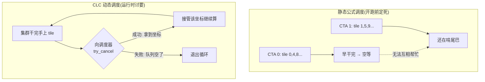
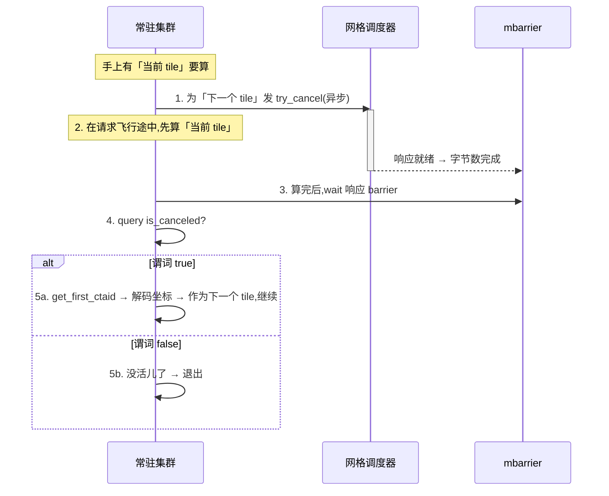

# 第 08 章 · 进阶:集群启动控制(CLC)

> 原文:[Advanced: Cluster Launch Control](https://mlc.ai/modern-gpu-programming-for-mlsys/chapter_clc/index.html)

> **本章要点(TL;DR)**
>
> 别急,这一章里有一堆 GPU 专有名词,下面这几条先囫囵看一眼有个印象就行,正文里我会把每个词都掰开揉碎讲明白。
>
> - 先认识几个最基础的词。**GPU 干活的最小调度单位叫 CTA(也叫"线程块" / thread block)**——你可以把它想成"一小队一起被派去干活的线程"。GPU 上真正执行计算的硬件核心叫 **SM(流式多处理器)**,一颗 GPU 上有几十上百个 SM,CTA 就是被丢到这些 SM 上去跑的。我们要算的大矩阵会被切成一个个小方块,每个小方块叫一个 **tile(分块)**。
> - **常驻核 / persistent kernel**:传统做法是"有多少个 tile 就开多少个 CTA,一个 CTA 算一块 tile,算完就退出"。常驻核换了个思路——只开一小批"活得久、不退出"的 CTA(或集群),让它们像工人一样循环不停地一块接一块地吞 tile。于是核心问题就只剩一句:**手上这块算完了,下一块从哪来?**(这里的"集群 / cluster"是指一起启动、还能互相同步配合的一组 CTA,后面会细讲。)
> - **集群启动控制 / Cluster Launch Control(CLC)**:这是 Blackwell(NVIDIA 比较新的一代 GPU 架构代号,排在上一代 Hopper 之后)新加的一个硬件功能。它能让一个已经在跑的集群,在运行过程中向 GPU 内部一个叫**网格调度器 / grid scheduler**(负责派活儿的硬件模块)去"讨"一份还没开始干的活儿。说白了,它就是一条**硬件级的"抢活儿"通道**——抢活儿这个套路在计算机里有个专门叫法,叫**工作窃取(work-stealing)**:谁先干完手头的,谁就去把别人还没来得及干的活儿抢过来自己干。
> - CLC 用起来很简单,对外就给**两条机器指令**(这种贴近硬件的底层指令在 NVIDIA 这里叫 PTX 指令):一条用来异步地发出请求,一条用来把结果读回来。"请求完成了没有"这个信号,靠一个叫 **mbarrier**(内存屏障)的东西来通知——它是一种"异步操作干完后用来打信号、喊一嗓子'我好了'"的同步小工具。这套报信机制是直接借用 **TMA**(GPU 里专门负责异步搬数据的硬件引擎)早就在用的那一套,**没有另外发明任何新的等待方式**,你学一套就够用。
> - 它最大的好处是**改善"尾部行为"(tail behavior)**——"尾部"指的是一批活儿快干完、收尾的那一小段时间。当各块 tile 算得有快有慢、或者 tile 的总数没法被 SM 数整除分得不匀时,先干完的集群马上就能再去拉一份新活儿,而不用在旁边干瞪眼空等别人。
> - 最后提醒一句别搞混:"集群"这个概念从 Hopper 那一代起就已经是 GPU 的一种**启动单位**了(不是 CLC 发明的);CLC 是 Blackwell 才补上的新本事,它让**这些集群被派到哪去算,从"开跑前就钉死"变成了"跑起来再动态决定"**。

> **前置知识**:这一章会反复用到 CTA(线程块)、cluster(集群)、tile(分块)、SM(干活的硬件核心)、关键路径与尾部、常驻核(persistent kernel)这几个概念。上面 TL;DR 里都已经初步解释过,正文里还会再展开,所以你**不需要**提前精通它们;但如果你想先有个更系统的底子,可以翻一下 [第 0 章 · 极简入门](./ch00_gpu_ml_primer.md)。读不懂某个词时,回到本章前面找一下它第一次出现的地方,那里一定有大白话解释。

---

## 8.1 从静态调度到动态调度:为什么需要 CLC

> **一句话先理解**:GPU 算一个大矩阵,得把它切成很多小块(tile)分头算。问题在于"谁来算下一块"。传统做法是开跑前就排死;CLC 让 GPU 跑起来再现场动态分配,从而避免有人累死、有人闲死。

想搞懂 CLC,得先把**常驻核**这个执行模式弄明白。这套玩法,前面《用 warp 特化与集群扩展 GEMM》那一章是一步步搭起来的(GEMM = 通用矩阵乘法,是深度学习里出现最频繁、最吃算力的运算,所以它是 GPU 编程里当之无愧的主角)。

先看传统 GPU kernel(kernel 就是"一段在 GPU 上跑的程序",类比你写的一个函数)是怎么干活的。GPU 一次启动的全部 CTA,合起来叫一个**网格 / grid**(你就理解成"这一次任务派出去的所有工人的总集合")。传统 kernel 把这事当成一锤子买卖:有多少个 tile 要算,就一口气启动同样多的 CTA,一个 CTA 负责包一块 tile,算完就退出走人。

常驻核(persistent = "常驻、不退出")不这么玩,它换了个思路:

- 它**不**按 tile 数量去开 CTA,而是只开一小批**活得久、算完一块也不退出**的 CTA(或集群)。这批工人的数量,大致调到"每个 SM 上差不多蹲一个干活的"这个量级就好——但说清楚:它**并不要求** SM 和工人严格一对一,不需要这种死板的保证,大概齐够用即可。
- 每个集群算完一块 tile,不退出,而是接着去算下一块,算完再下一块,就这么循环转圈,一直转到整个矩阵的所有 tile 都算完为止。

为什么要费这个劲搞"常驻"?因为反复启动、退出 CTA 本身是有开销的;让一小批工人常驻下来不停干,就省掉了这部分反复开关的成本。但这么一改,核一旦变成常驻的,整个调度问题就被压成了一句话:

> **关键**:一个集群算完当前 tile 之后,**下一个 tile 从哪里来?**

### 静态公式调度:简单但尾部会拉胯

最省事的答案是**静态公式 / static formula**。"静态"的意思是:每个工人该算哪几块 tile,在程序还没开跑之前就用一个固定公式算死了,跑的时候不再变。怎么算?每个 CTA 都有一个自己的编号(`cta_id`,就像工号),拿这个编号直接定出它要算的第一块 tile;算完一块往后跳,每次都按一个固定的步子往后挪——这个固定步子叫 **网格步长 / grid stride**,它的大小正好等于工人的总数。

为什么步子要等于工人总数?这样能保证每个工人都不重不漏地分到"间隔着的"那些 tile。下面这段伪代码就是这个意思,我逐行讲:

```text
tile_id = cta_id              # 我这个工人,从"和我工号相同的那块 tile"开始算
while tile_id < num_tiles:    # 只要还没超出总块数,就一直干
    compute_tile(tile_id)     # 把当前这块 tile 算了
    tile_id += grid_size      # 往后跳"工人总数"那么多,落到下一块归我的 tile
```

举个具体例子:假设有 4 个工人、12 块 tile。0 号工人就算第 0、4、8 块,1 号工人算第 1、5、9 块……每人各算 3 块,正好分完。

这招好不好用,得看情况:

- ✅ 写起来简单。哪个 CTA 该算哪几块 tile,在 kernel 真正开跑之前就**全排明白了**,不需要任何运行时协调。
- ✅ 要是每块 tile 算起来都差不多累(耗时相近),而且 tile 总数又恰好能被 SM 数整除(刚好分得匀),那它跑得挺香。
- ❌ 可问题就出在「活儿在开干之前就钉死了」这件事上。万一有几块 tile 算得特别慢,或者最后剩下的几块怎么也分不匀,就会撞上一个很尴尬的场面:**一些 SM 早早把自己那份干完了,却因为活儿早就钉死、不能去帮别人,只能在旁边干瞪眼;另一些还在那儿吭哧吭哧啃尾巴。** 整批任务的总耗时,就被这几个最慢的拖到了最后——这就是前面说的"尾部"被拖长了。

### CLC:把分配推迟到运行时再决定

CLC 就是来收拾这个烂摊子的。它只改了一件事:不再开跑前就把整张排班表钉死,而是让一个正在跑的常驻集群,跑着跑着、在运行时(也就是程序已经在 GPU 上跑起来的过程中)向**硬件里的网格调度器**现要一份活儿——要的是"本来还排着队、但还没真正启动的另一个集群"该干的那份。

换个角度想:静态公式是"上班第一天就把全年排班表贴墙上,谁也别改";CLC 是"谁手头干完了,就到调度台前现场领下一单"。后者显然更能让大家都不闲着。



这一要,结果无非两种:

- 要**到了** → 当前集群就"接管"那个集群坐标,掉头去算它对应的 tile。(后面会讲到,图里那个 `try_cancel` 就是"我来要活儿"这条请求指令的名字,别被它字面吓到,下一节细说。)
- 要**不到** → 说明排队的活儿已经被领光了,没活儿可抢了,循环到这儿就收工退出。

> **注意**:CLC 和"线程块集群"**根本是两码事**,千万别混。线程块集群(thread block cluster)说的是"一起启动、能做集群级同步、还能互相访问对方共享内存的那么一组 CTA"这个**概念本身**,它是 **Hopper** 那一代带来的(见《GPU 执行模型》)。而 CLC 则是 **Blackwell** 才加上的本事,它管的不是"集群是什么",而是"这些集群该被派去算哪块、怎么调度"——让这件事从死的变成活的。换句话说,**集群一直就是 GPU 的启动单位;CLC 干的只是让一个正在跑的集群,去把另一次"还没真正发生的启动"取消掉,然后把那份坐标接过来自己干。**

这里有个心智模型特别关键,先记牢,它能帮你看懂后面所有协议细节:CLC **不是**那种"从一个软件维护的任务队列里取出一个抽象任务给你"的机制。它干的事更贴近硬件、也更实在——**它是把一次本来排着队、还没发生的集群启动给取消掉(英文叫 cancel a pending cluster launch)**,然后把那个被取消的集群本来该用的坐标,转手交给现在来要活儿的这个集群。记住这一句,后面那一堆看着绕的协议规则,追到根上全是从它长出来的。

---

## 8.2 两条指令:请求与查询

> **一句话先理解**:CLC 用起来一共就两件事——"发一个请求去要活儿"和"过一会儿来查结果",对应两类底层指令。下面会逐条解释每个怪名字到底在干嘛。

前面提过,CLC 这套机器指令(PTX 指令)很底层,名字也长得吓人,但别怕,逻辑极简单。它对外就给你**两条指令**:一条用来异步地发出请求(指令名里带 `try_cancel`,意思是"尝试取消一次待启动来抢活儿"),一条用来把响应结果读回来(指令名里带 `query_cancel`,意思是"查询那次取消的结果")。

这里有个小地方得提一句:读响应的 `query_cancel` 实际又拆成两个变体,一个用来查"这次到底抢没抢到",另一个用来把坐标取出来。所以下面你会看到 3 个具体的指令名。别被"3"这个数字吓着——往大了说,要干的还是"发请求"和"查结果"这两件事而已。

### 请求指令:`clusterlaunchcontrol.try_cancel.async`

先看这条"发请求"的指令。下面表格里有几个 GPU 专有词,我在表格后面统一给你讲透,你先扫一眼有个轮廓:

| 维度 | 说明 |
|------|------|
| **语义** | 请求调度器**取消**一个待定集群的启动,并把那个集群的坐标返回给调用方 |
| **响应位置** | 结果会被写进**共享内存**,是一条 **16 字节** 的小记录 |
| **同步性** | **异步**——指令一发出就立刻返回,**不会卡在原地等**响应到达 |
| **完成信号** | 通过 **mbarrier** 来通知,沿用和 TMA 一模一样的 **barrier + phase**(屏障 + 相位)模型;"响应到了"这件事,靠 barrier 的**字节数完成(byte-count completion)**机制来宣布 |

把上面几个词逐个讲明白:

- **共享内存(shared memory)**:GPU 上有一小块速度极快、由同一个 CTA 里的线程**共用**的内存。你可以把它理解成"程序员能手动掌控的一块超高速便签纸"——比起 GPU 的大主存(显存)快得多,但容量很小。CLC 把要回的坐标就写在这块便签纸上,方便本地工人立刻读到。
- **异步(asynchronous)**:意思是"发出去就不管了,不在那干等"。和它相对的是"同步"——同步要原地等结果回来才能往下走。CLC 故意做成异步,就是为了让你"先把请求扔出去,转头去干别的,等真要用结果时再回来取",这是后面整章性能优化的关键。
- **mbarrier(内存屏障)**:一种放在共享内存里的同步小工具。异步操作干完后,会去这个屏障上"打个卡 / 喊一嗓子",于是等在屏障这边的线程就知道"它好了,我可以继续了"。它解决的核心问题是:既然异步操作是甩手不管的,那我怎么知道它到底干完没有?答案就是靠 mbarrier 报信。
- **byte-count completion(字节数完成)**:mbarrier 报信的一种具体方式。它不是数"完成了几个操作",而是数"一共收到了多少字节的数据"。这次 CLC 的响应正好是 16 字节,所以屏障一数够 16 字节,就知道"响应完整收到了",于是放行。

> **关键**:CLC 一个特别省心的设计是——**它压根没另外发明一套等待机制**,而是直接复用了你(在学 TMA 那章时)早就熟悉的那一套。完整流程是这样:kernel 发出请求,把这次请求挂到一个 mbarrier 上;之后在真正要读响应之前,先对这个 barrier 做一次 wait(等待)。响应到没到?就看 barrier 的"字节数完成"凑没凑够。这跟 TMA 这类异步硬件搬数据的玩法,完全是同一个路数(见《异步协调:mbarriers》),你不用再额外学新东西。

### 查询指令:`clusterlaunchcontrol.query_cancel.*`

等前面那个 mbarrier 被"触发"(fired,就是凑够字节、放行了)之后,响应就已经躺在共享内存里了,kernel 这时才拿查询指令去把它读出来。这一步得分两小步走:

**第一小步:`query_cancel.is_canceled`** —— 它返回一个**谓词 / predicate**。"谓词"这个词听着唬人,其实就是一个**真/假(true/false)的判断结果**,就像你代码里 `if` 后面那个布尔条件。它告诉 kernel:这次抢活儿到底成没成。

- 谓词是 **true** → 调度器真找着了一个还没启动的待定集群,把它取消了,坐标也一并给你了。恭喜,抢到活儿了。
- 谓词是 **false** → 排队的活儿已经被领光了,这次空手而归。

**第二小步(只有上一步是 true 时才做):`query_cancel.get_first_ctaid`** —— 把被取消那个集群的**第一个 CTA 的编号(CTA id)**取出来。这个编号其实不是一个数,而是一个三维坐标(因为 GPU 的网格可以是三维排布的),一般按 `(x, y, z)` 三个分量读出来。拿到这个坐标后,kernel 再把它**解码 / decode**(就是按事先约好的规则换算)成"接下来该算的是哪一块输出 tile"。

下面这段伪代码把读响应的两步串起来了,我逐行讲:

```text
// 伪代码:读响应的两步查询
mbarrier_wait(clc_barrier, phase)            // 1) 先在屏障上等,直到响应确实到位
if query_cancel.is_canceled(response):       // 2) 问一句:这次真抢到活儿了吗?
    (x, y, z) = query_cancel.get_first_ctaid(response)  // 3) 抢到了,把坐标取出来
    next_tile = decode_tile_coord(x, y, z)   //    再把坐标换算成"下一块要算的 tile"
else:
    break                                    // 4) 没抢到 → 队列空了,跳出循环、收工
```

逐行说人话:第 1 行先在屏障上等响应真的到了(否则读到的是空的);第 2 行用 `is_canceled` 问"抢到没";第 3 行只有抢到时才执行,把三维坐标取出来;紧接着换算成具体 tile;`else` 分支则表示没活儿了,直接结束循环。

> **注意**:这个协议里**没有用"哨兵值 / sentinel"这种约定俗成的魔法数字**来表示"没活儿了"。(解释一下:很多程序里习惯用某个特殊值,比如 `-1`,来表示"到头了 / 没有了",这种特殊值就叫"哨兵值"。)CLC 没走这条路,它纯粹是**靠那个真/假谓词来分支**:谓词为 true,坐标就有效;谓词为 false,工作窃取循环就到头。
>
> 为什么不用哨兵值、偏要用谓词?还得绕回 CLC 的本质:硬件不是从一个软件队列里给你发个抽象任务,而是在**取消一次还没发生的集群启动**。既然是这样,"成功的响应"天然就捎带着一个**货真价实的集群坐标**;而"失败的响应"无非就是在说"启动队列已经被掏空了"。一个真/假就把这两种情况说清楚了,根本用不着再额外约定什么魔法数字。这么一想,全都顺了。

---

## 8.3 工作窃取循环

> **一句话先理解**:把"发请求"和"算当前块"在时间上重叠起来,这样等你算完手头这块,下一块的归属早就查清楚了,几乎不用等。这就是 CLC 性能好的全部秘密。

有了前面那两条指令,整个常驻调度器(就是那段决定"下一块算谁"的逻辑)就缩成了**一个很短的循环**。而这个循环里最妙的一笔,不在于用了什么高深指令,而在于**那条"发请求"的指令到底摆在循环的哪个位置**。先卖个关子,往下慢慢看,你会发现位置摆对了,性能就白捡了。

### 循环的结构



用大白话列出来,就这五步:

1. 先为"可能还有的下一块 tile"发一发 `try_cancel`(把要活儿的请求扔出去)。
2. **趁这个请求还在路上飞着(in flight,意思是"已经发出、但还没回来"的那段时间)**,别干等,赶紧把**当前**这块 tile 算了。
3. 当前这块算完了,再回到屏障上 wait 一下那个响应。
4. 查一下刚才那次抢活儿到底成没成。
5. 成了,就拿返回的坐标接着算下一块;没成,就退出循环。

### 为什么要"先请求,再计算"?

> **关键**:集群**绝不会**傻等着当前 tile 算完了、才去要下一份活儿。它的套路反过来——**先把请求发出去,再去算当前这块**。这么一安排,"向调度器发请求并等它回话"和"埋头算当前这块 tile"这两件事就**重叠(overlap)**到一块儿同时进行了。(overlap 是 GPU 编程里一个核心思路:让"等待"和"计算"在时间上叠在一起、互相遮掩,从而把等待的时间"藏"进计算里。)结果就是:等你把当前 tile 吭哧吭哧算完,下一块的归属答案**多半早就回来、在那儿候着了**,你几乎不用专门干等。

这个道理,跟常驻核在别的地方用异步拷贝(TMA)、用 Tensor Core(GPU 里专门做矩阵乘法的加速单元,深度学习的算力主力)的 barrier 时**完全是同一个意思**,核心就一句话:**别让又慢又长的"高延迟操作"直愣愣地堵在关键路径上**。(高延迟操作 = 发出后要等很久才有结果的操作,比如跨芯片搬数据、向调度器要活儿;关键路径 / critical path = 决定整体快慢、怎么也省不掉的那条最长的依赖链路。东西堵在关键路径上,整体就会被它拖慢。)CLC 无非是把这套早就验证过的老办法,挪到了"tile 调度"这件事上——早早地把下一份活儿要上,手头先把当前这份算了,真到要用结果的时候再回头去取。

下面拿一张时间轴表来帮你看清这个重叠(表格做了简化):每一行是一个并行进行的角色,每一列是时间往前走,从 t0 到 t3。

| 角色 \ 时间 | t0 | t1 | t2 | t3 |
|------------|----|----|----|----|
| 集群(关键路径) | 发 try_cancel(异步,不阻塞) | 算当前 tile | 算当前 tile | wait barrier(此时多半已就绪,几乎不阻塞) |
| 调度器(后台) | 收到请求 | 在后台找下一块 | 响应就绪 → 字节数完成 | — |

看明白了吧:发请求和算当前 tile 在 t1–t2 完全叠在一起,所以等集群算完、走到 t3 去 wait 的时候,响应早就备好了,基本不卡。

---

## 8.4 与常驻 GEMM 的关系

《用 warp 特化与集群扩展 GEMM》那一章(GEMM = 通用矩阵乘法,前面说过,是深度学习里最核心、最吃算力的运算),主线讲解时用的是**静态调度器**。为啥用它?理由很实在:静态调度器**好讲、好懂**——下一块 tile 是哪块,拿循环里的当前状态套个公式就算出来了,不涉及任何运行时的协调。比如那章里有个叫 `ClusterPersistentScheduler2D` 的调度器(名字直译就是"二维集群常驻调度器"),就是按前面讲的网格步长那套路子,在输出 tile 的二维空间上一块一块往下分的。

而**CLC,就是这套静态分配机制的"动态版替身"**——功能定位完全一样(都是回答"下一块算谁"),只是把决策时机从开跑前挪到了运行时。这儿要重点强调一句,这也是工程上最值钱的一点:**外层那个循环一个字都不用改**——每个常驻集群干的还是那套老活儿"算一块输出 tile,再往下挪一块"。**真正变的,就只有'下一块 tile 从哪来'这一件事**:

| 维度 | 静态调度器 | CLC 动态调度 |
|------|-----------|-------------|
| 下一个 tile 来源 | 公式算出(grid-stride) | 硬件工作窃取返回 |
| 决策时机 | 启动时一次性定死 | 运行时按需分配 |
| tile 计算体(tile body) | 相同的常驻 GEMM 主体 | **完全相同** |
| 尾部不均时 | 早干完的 SM 空等 | 早干完的集群继续拉活 |
| tile 成本不均时 | 假设开跑前的分配「足够好」 | 不需要这个假设 |

### 在两种场景下 CLC 优势最明显

**1)启动的尾巴(tail of the launch)**
"尾巴"指的就是整批活儿快收尾的那一小段时间。在静态排班下,这一段剩的活儿往往七零八落、分布不均:有些 SM 早把分给自己的 tile 全啃光了,有些却还压着好几块没动。换成 CLC,先干完的那个集群不会闲着,它直接掉头去要"另一个还没启动的待定集群"的坐标——**只要启动队列里还剩着活儿,先收工的人就能不停地拉新 tile 接着干**,把原本该闲着的时间也利用起来了。整批任务的尾巴因此被显著缩短。

**2)tile 一块比一块累(各块耗时不均)**
为什么会出现 tile 算起来有快有慢?因为有些 GEMM tile 走的代码路径跟别人不一样:可能是碰上了矩阵的边界(boundaries,边角上那些不满一整块的部分要特殊处理)、用了掩码(masking,跳过某些不需要算的位置)、用了稀疏(sparsity,矩阵里大量是 0、可以省着算)、用了分组调度(grouped scheduling,把若干小矩阵乘打包在一起),也可能是围着主矩阵乘顺手做了点融合(fused,把别的运算合并进来一起算)。这些情况都会让某些 tile 明显比别的慢。静态排班的麻烦就在这:它必须**假设**——在程序还没真跑、压根看不出这些耗时差异的时候,它分的活儿就已经分得"足够均匀"了。这显然是个很冒险的假设。而 CLC **压根不需要**这个假设——它根本不预先猜谁快谁慢,而是等某个集群真的闲下来了,才现场再给它派一块新的,谁有空谁多干,天然就把负载均衡了。

### 在 TIRx 里怎么暴露

(TIRx 是这本书所用编译框架里的一层中间表示 / 编程接口,你可以先粗略理解成"上层写 GPU 程序时面对的那套抽象",不必深究细节。)

就冲上面这些好处,在 TIRx 里可以把 CLC 包装成一个**动态 tile 调度器**给上层用。对写程序的人来讲,最爽的是:**算 tile 的那部分代码根本不用动**——tile 主体还是静态调度器用的那套常驻 GEMM 主体,一行不改。变的只有调度器内部,它从原来的

> "按公式算出我的下一块 tile 坐标"

悄悄换成了

> "向硬件去要下一个可用的集群坐标"。

到头来的效果是:**外面看还是那个常驻循环**,只不过"分活儿"的法子,从"启动时就钉死的死排班",换成了"硬件实时说了算的活调度"。一处小改动,白捡一个硬件级的动态负载均衡。

---

## 小结

- **常驻核 + CLC** 这一套组合,把 GPU 上"下一块 tile 算谁"的调度决策,从"编译/启动期就钉死"往后挪到了"运行时由硬件现场派"。它要治的病很清楚:**活儿分得不均,导致收尾时一帮工人干瞪眼空转、白白拖慢整体**。
- CLC 的实现相当克制:对外就**两条底层指令**,外加**白嫖现成的 mbarrier 完成报信机制**。它没有另起炉灶发明什么新的等待原语,而是把"异步发请求 + 在 barrier 上等响应"这套早在 TMA、Tensor Core 上验证过的老范式,原封不动搬到了调度上——你学一套,处处通用。
- 它的协议是**靠真/假谓词驱动**的,而不是靠哨兵魔法值。为啥?还是那句根本逻辑——CLC 的本质是"取消一次还没发生的集群启动",不是"从软件队列里取一个任务"。所以抢到了就直接给你一个真坐标,没抢到就说明队列已空,一个真/假足矣。
- **它设计上最漂亮的一手**,是"先请求、后计算"这个循环顺序:把"等调度器回话"的那点延迟,悄悄塞进了"算当前 tile"的时间里一起消化掉,不让它单独堵在关键路径上。这跟整套异步 GPU 编程的核心思路一脉相承——能藏起来的等待,就别让它露在外面拖后腿。
- 从工程角度看,CLC 对上层(比如 TIRx)**几乎是零打扰**:算 tile 的代码一个字不动,只要把调度器从"套公式算下一块"换成"问硬件要下一块",就白捡一个硬件级的动态负载均衡。

> **一句话**:CLC = 给常驻核接上一条**硬件级的"抢活儿"(工作窃取)通道**,让先干完的集群在运行时把"还没启动的集群"那份坐标抢过来自己算。这样一来,当各块 tile 算得有快有慢、或数量分不匀时,收尾阶段的性能就能明显好上一截——因为再也没有人闲着干瞪眼了。

---

## 延伸阅读

- 本章原文:[Advanced: Cluster Launch Control — Modern GPU Programming for MLSys](https://mlc.ai/modern-gpu-programming-for-mlsys/chapter_clc/index.html)
- 相关章节(同书):
  - 《GPU 执行模型》—— 线程块集群、分布式共享内存的来历(Hopper)
  - 《异步协调:mbarriers》—— barrier + phase + 字节数完成模型,CLC 的完成信号复用了它
  - 《异步内存:TMA》—— 同样的「异步请求 + barrier 等待」范式
  - 《用 warp 特化与集群扩展 GEMM》—— 常驻 GEMM 与静态 `ClusterPersistentScheduler2D` 的来龙去脉

---

## 术语对照

| 中文 | English / 缩写 |
|------|----------------|
| 集群启动控制 | Cluster Launch Control(CLC) |
| 常驻核 | persistent kernel |
| 线程块集群 | thread block cluster |
| 工作窃取 | work-stealing |
| 网格调度器 | grid scheduler |
| 网格步长 | grid stride |
| 静态调度器 | static scheduler |
| 动态 tile 调度器 | dynamic tile scheduler |
| 尾部行为 | tail behavior |
| 关键路径 | critical path |
| 谓词 | predicate |
| 哨兵值 | sentinel |
| 内存屏障 | mbarrier |
| 相位(位) | phase (bit) |
| 字节数完成 | byte-count completion |
| 输出分块 | output tile |
| 线程块 | CTA |
| 矩阵乘 | GEMM / MMA |
| 张量内存访问 | TMA |
