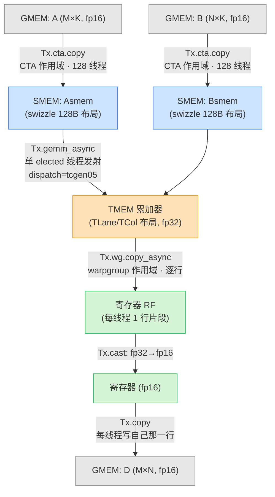
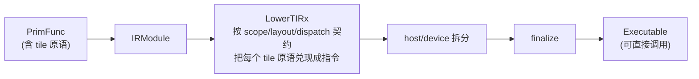

# 第 09 章 · TIRx 入门

> 原文:[Introduction to TIRx](https://mlc.ai/modern-gpu-programming-for-mlsys/chapter_intro_tirx/index.html)

> **本章要点(TL;DR)**
>
> 别急,下面这几句里有不少新词,你现在看不懂没关系——正文里每一个都会当场用大白话讲清楚。这里先让你对「这章要干嘛」有个轮廓:
>
> - **先说「kernel」是啥**:在 GPU 编程里,我们把「跑在 GPU 上的那段函数」叫一个 **kernel(核函数)**。你可以把它理解成「一段会被成千上万个线程同时执行的代码」。本章从头到尾就在研究怎么写一个 kernel。
> - **TIRx(张量 IR neXt / Tensor IR neXt)** 是一种「嵌在 Python 里的小语言」(术语叫 DSL,领域专用语言),专门用来写 GPU kernel。它特别在哪?一方面,它让你能**直接指挥硬件的每一个细节**(具体哪些细节,正文会一个个讲);另一方面,你写下的这些指挥命令,不是散落在一堆难懂的代码里,而是被整理成一种编译器**看得懂、能加工**的结构化形式(这种形式就叫 **IR,中间表示**,后面会解释)。
> - 一个 kernel 到底怎么跑,关键就那么几件事。TIRx 把它们**全摆到台面上**,归成三大设计要素,你把这三个词记住,这章就抓住一半了:**作用域(scope)**——这活儿归**谁**干;**布局(layout)**——数据块**放在哪、怎么摆**;**派发(dispatch)**——具体**走哪条硬件路**去执行。
> - 整章就盯着一个**能真跑起来的、最小的矩阵乘程序**(术语叫 GEMM,通用矩阵乘):算一个 `128×128` 大小的结果方块,公式是 `D = A·Bᵀ`(A 乘以 B 的转置),而且整个矩阵乘核心就用**一句** `Tx.gemm_async` 写完。
> - 别看这程序小,上面那三大要素它一个不落全演示到了。说白了,全书后面的章节,做的就是「把这三个要素放大到更大规模」这一件事——所以这一章打好底,后面就顺了。
> - 编译(把你写的代码变成 GPU 能跑的机器指令)就一句 `tvm.compile(mod, target="cuda", tir_pipeline="tirx")`。整个过程**对你不藏一点东西**:你既能看到中间的结构化表示(IR),也能看到最后生成的底层 CUDA 代码。

> **前置知识**:这一章会用到一些 GPU 的基础概念。我会在正文里第一次出现时当场解释,但如果你想先有个整体印象,可以先翻一下 [第 0 章 · 极简入门](./ch00_gpu_ml_primer.md)。涉及的概念主要是:GPU 上线程是怎么分层组织的、内存为什么要分成好几层、还有「Tensor Core」这种专做矩阵乘的硬件大概是干嘛的。完全没接触过也别怕,跟着读就行。

---

## 一、为什么需要 TIRx:把「隐藏的决策」翻到台面上

> **一句话先理解**:GPU 这东西算得快,但你得用一种「它听得懂」的方式去指挥它;现有的指挥方式(裸写 CUDA)能干活,但有个毛病——「这个程序到底打算怎么跑」这件事,看代码根本看不出来。TIRx 就是来治这个毛病的。

前面第一部分(Part I),我们把硬件**是什么**讲透了。可光认识硬件还不行——你想让它真干活,总得有个**写代码的法子**才行。

先把两个绕不开的名词说清楚。**CUDA** 是 NVIDIA 给自家 GPU 配的那套编程语言/工具(你可以粗略理解成「写 GPU 程序的 C++ 方言」);**PTX** 则更底层一点,是 GPU 的一种「类汇编」中间指令(比 CUDA 更贴近硬件,更难读)。这两样,就是当下指挥 GPU 最直接的两种手段。

最直接的法子,就是裸写 CUDA 或者 PTX。事实上,不少追求极致性能的 kernel 就是这么一行行手搓出来的。那它差在哪?**差在:决定这个 kernel 怎么跑的那几件关键事,在裸代码里你几乎看不出来。** 不信你看下面这三个问题,它们正是写 GPU 程序时最要命的几个决定,可裸代码里偏偏最看不清:

- **谁在干活**:GPU 上同时有成千上万个线程(线程 = 一条独立的执行流,后面会细讲),某个操作到底是哪些线程在执行?
- **数据放哪**:GPU 的内存不是一整块,而是分了好几层(快但小、慢但大,后面会讲为什么)。你的每一块数据,究竟放在哪一层?
- **走哪条路**:同一件事(比如「搬一块数据」),GPU 上常常有好几种硬件实现方式可选。这条计算实际走的是哪条硬件路径?是让普通线程一个个搬?还是用 **TMA**(一个专门负责「异步、批量搬数据」的硬件引擎,你可以理解成 GPU 里的搬运专用机器人)?还是交给 **Tensor Core**(一块专门负责矩阵乘法的硬件电路,算矩阵乘特别快)?

裸写 CUDA/PTX 的时候,上面这几个选择都藏到哪去了呢?埋在某个函数一长串看不懂的参数里,埋在程序员手算出来的内存地址里,还有一堆「圈内人都这么写、但代码里没明说」的约定俗成里。于是就成了这样:别人(甚至几个月后的你自己)来读这段代码,基本得靠「考古」,才能猜出当初到底想干嘛。

那 TIRx 是怎么破这个局的?注意,它**没有**走「把硬件细节全藏起来、让你写得轻松」那条路——那是 PyTorch 这类高层框架的玩法(省心,但你也别想精细控制硬件)。TIRx 偏要反着来:**它照样让你直接指挥硬件的每个细节,但同时把上面那三类关键决策,从「埋在代码里靠猜」改成了「明明白白写在 IR 上」**。换句话说,既要底层的控制力,又要看得清。

> **关键**:一句话说清 TIRx 的思路——底层控制力一点不丢,同时还让编译器看得懂。这里多解释一个词:**编译器**就是那个「把你写的代码翻译成 GPU 能执行的机器指令」的程序。道理很简单:你做的那些决策只要明着写出来,编译器就能拿它去做三件事——**检查(check)**你写得对不对、**下降(lower)**(把你写的高层意图一步步翻译成底层真指令,这个翻译过程在编译界就叫「lowering / 下降」)、还有**调度(schedule)**(安排指令以什么顺序、怎么并行地跑)。

这三类决策,TIRx 给起了三个名字,后面整本书都会反复用到。现在记不住没关系,正文里每个都会配着代码讲透:

| 设计要素 | 它回答的问题 | 在代码里体现为 |
| --- | --- | --- |
| **作用域(scope)** | *谁(哪些线程)* 来执行这个操作? | CTA(一个线程块)/ warpgroup(4 个 warp = 128 线程)/ 单个选出来的线程 等(这些层级正文会逐个讲) |
| **布局(layout)** | 操作数 tile(就是「大矩阵切出来的小方块」)*放在哪里*、按什么方式排布? | SMEM(一种片上共享内存)的特殊排布、TMEM 的 `TLane/TCol` 排布、寄存器视图等 |
| **派发(dispatch)** | 走*哪条硬件路径* 来执行? | `dispatch="tcgen05"`、拷贝走普通线程还是走 TMA |

这三件事,本章不想干巴巴地讲概念。咱换个法子:**直接搬一个完整、能跑的 kernel 出来看**。先让它跑起来,再回头一行一行读,看看 scope、layout、dispatch 分别是怎么把这段代码捏成现在这样的,以及它最后又是怎么编出来的。

> **注意**:本章就盯着「一个 kernel + 三个要素」,故意把焦距收得很窄。这个 kernel 用到的张量布局模型,留到后面《TIRx 布局 API》专门讲;完整的语言特性,放在《TIRx 语言参考》里。

---

## 二、运行环境与依赖

想真把本章的例子跑起来,你得有一块 **Blackwell 架构的 GPU**(目标是 `sm_100a`,比如 B200)。TIRx 编译器是跟着 Apache TVM 一起发的,就在 wheel 包里的 `tvm.tirx` 模块,安装的时候记得配上 CUDA 版的 PyTorch:

```bash
pip install apache-tvm
```

装完跑一行命令,确认能正常 import 就行:

```bash
python -c "import tvm, tvm.tirx; print(tvm.__version__)"
```

> **注意**:这套环境配好,全书的例子都能跑。手头没有 Blackwell GPU 也别慌——代码是跑不了,但你完全可以当「阅读理解」来读。本章真正值钱的地方,本来就在于搞懂这一个 kernel 是怎么对应到 scope、layout、dispatch 上的。

---

## 三、第一个 kernel:单次 MMA 的 GEMM

> **一句话先理解**:我们要写的这个程序,就是算一次矩阵乘法 `D = A·Bᵀ`。它被砍到了不能再小,但「麻雀虽小五脏俱全」——前面说的三大要素它全用上了。

先说说为什么矩阵乘(GEMM)是主角。你可能会问:讲 GPU 怎么老拿矩阵乘举例?因为深度学习里绝大部分的计算量(神经网络的每一层、Transformer 的注意力)归根到底都是在做大矩阵相乘,GPU 的硬件也是专门为它优化的。所以学会写好一个矩阵乘 kernel,基本就摸到 GPU 编程的命门了。

咱要看的这个 kernel,是把 GEMM(通用矩阵乘,这里算的是 `D = A·Bᵀ`,也就是 A 乘 B 的转置)砍到不能再砍的最小版——可即便这么小,它还是刚好能驱动起一块 Tensor Core(前面说过,就是那块专做矩阵乘的硬件)。规格很清楚:

- 计算**单个** `128 × 128` 大小的输出方块(我们把这种「从大矩阵里切出来的小方块」叫一个 **tile**);
- 公式为 `D = A · Bᵀ`,其中 `K = 64`(K 是参与相乘的那个「中间维度」的长度,稍后用到);
- 整段矩阵乘计算从头到尾,核心就用**一个** `Tx.gemm_async` 这样的 tile 操作来表达。

### 3.1 「一个 tile 操作 ≠ 一条硬件指令」

这一点想明白了,你就抓住 TIRx 一半的价值了。`Tx.gemm_async` 看着就是「一句话」,可它**并不会**变成一条硬件指令——它背后会被翻译成好几条。为啥会这样?咱算笔账(先解释两个词):

- 硬件做矩阵乘时,有个最核心的操作叫 **MMA(Matrix Multiply-Accumulate,矩阵乘累加)**,就是 Tensor Core 干的那件事:把两小块矩阵相乘,结果直接累加到一个地方。
- 但 Tensor Core 这块硬件一次只能「咬」固定大小的一小口。具体来说,它在 K 方向上一次只能处理 16 那么长——这个「一次最多处理 16」就是硬件的最小粒度,术语叫 **K-atom(K 方向的原子粒度)= 16**。「原子」在这里就是「不可再分的最小单位」的意思。
- 而我们这个 tile 的 `K = 64`,比硬件一口能吃的 16 大。所以编译器会自动把它**拆成一小串、沿着 K 方向一步步走的 `tcgen05.mma` 指令**(`tcgen05` 就是 Blackwell 这代 GPU 上 Tensor Core 指令的名字;64 ÷ 16 = 4,所以拆成 4 步)。

> **关键**:DSL 值钱的地方就在这儿——**你写的是「一块数据(tile)要做什么」,而不是「一条条硬件指令」**。具体怎么沿着 K 方向把它拆成 4 步、怎么生成正确的 `tcgen05.mma` 指令序列,那全是编译器的活,你这个写代码的人根本不用操心。这就像写 Python 时你不用管循环到底编译成哪几条机器指令一样。

光发一个 MMA 还不够,一个完整的 kernel 周边还得干一圈杂活。先把几层内存的名字认一下(GPU 内存为什么分这么多层,3.3 里会细讲,这里先混个脸熟):**GMEM(Global Memory,全局内存)** 是 GPU 上最大、但也最慢的那块主显存;**SMEM(Shared Memory,共享内存)** 是一小块在芯片上、速度快很多的内存;**TMEM(Tensor Memory,张量内存)** 是 Blackwell 这代 GPU 新增的、专门给 Tensor Core 做累加用的存储;**寄存器(RF,Register File)** 则是每个线程私有的、最快的那一丁点存储。

顺着数据流走一遍这圈杂活就清楚了:先把 SMEM 和 TMEM 分配好(占好地方),把 A、B 两个输入矩阵从 GMEM 搬进更快的 SMEM,接着发起那个 tile MMA、让结果在 **TMEM 累加器**(accumulator,就是「边算边把结果累加进去」的那块存储)里算出来,算完再经过寄存器把结果读回来,最后写回 GMEM 输出。

这 kernel 虽小,它可是后面《构建分块 GEMM》那条优化升级路上的**第 1 步(Step 1)**。到那一章,我们会带着完整讲解再回来找它。

### 3.2 起手式:统一的 import

每个 TIRx kernel 开头那几行 import 都大同小异,先扫一眼混个脸熟:

```python
import tvm
from tvm.script import tirx as T                  # T:TIRx 的核心命名空间(device_entry、Buffer、ptx 等)
from tvm.script.tirx import tile as Tx            # Tx:tile 级原语(cta.copy、gemm_async、wg.copy_async …)
from tvm.tirx.cuda.operator.tile_primitive.tma_utils import tma_shared_layout, SwizzleMode  # TMA/swizzle 布局工具
from tvm.tirx.layout import TileLayout, S, TLane, TCol, tid_in_wg  # 布局 DSL:命名轴 TLane/TCol、线程内索引 tid_in_wg
```

这几行你不用记,扫一眼知道有这么回事就行。记住它们各管一摊:**`T` 管「最底层的语言/硬件」**——比如声明 kernel 入口、声明数据缓冲区(buffer)、直接发底层 PTX 指令这些;**`Tx` 管「tile 操作」**——比如拷贝一块数据、做一次矩阵乘;**`tvm.tirx.layout` 则是一套专门用来「描述数据怎么摆放」的小工具**。后面代码里看到 `T.xxx` 和 `Tx.xxx`,就知道它俩分别来自哪、管什么层级了。

> **提示**:上面那行 `from tvm.script.tirx import tile as Tx` 里的 `as Tx`,就是 Python 的「起别名」语法,把一个很长的名字简写成 `Tx`。所以后文满屏的 `Tx.xxx`,本质就是在调用这套 tile 操作库里的函数。

### 3.3 kernel 的整体骨架

整个 kernel 被装进一个小函数 `hgemm_v1(M, N, K)` 里。它的作用类似一个「生成器」:你喂它三个数字(矩阵的规模 M、N、K),它就吐给你一个写好的 kernel(在 TVM 里这个 kernel 对象叫 `PrimFunc`,你理解成「一个编译器能处理的函数」即可)。本章挑的规模是 `M=N=128, K=64`,这个尺寸刚好只产生**一个**输出 tile。第一版之所以能让你「一口气读完」,靠的就是这个小尺寸——没有循环、没有多块拼接,就一块。

下面把它拆成几块(从 a 到 j),每块只摘最要紧的那几行,逐行用大白话讲它在干嘛(完整源码看原文)。

**(a) 数据类型与分块常量**

```python
a_type = b_type = d_type = tvm.DataType("float16")  # A/B/D 均为 fp16
acc_type = tvm.DataType("float32")                   # 累加器用 fp32(精度更高)

BLK_M, BLK_N, BLK_K = 128, 128, 64   # 一个 CTA 负责的输出分块大小
MMA_M, MMA_N, MMA_K = 128, 128, 16   # 仅作文档:硬件 MMA tile 形状,尤其 K-atom=16
```

先解释两个新词。**fp16 / fp32** 是浮点数的精度:`fp16` 是 16 位的「半精度」浮点数(省空间、算得快,但精度低一点),`fp32` 是 32 位的「单精度」(更准,但更占地方)。这里 A、B、D 都用 `fp16`,但**累加器**(就是边算边攒结果的那块地方)特意用了更准的 `fp32`——为什么?因为矩阵乘要把很多个乘积加起来,加的次数多了,误差会越攒越大,所以攒结果的地方用高精度,能少丢精度。

再看 `BLK_M, BLK_N, BLK_K = 128, 128, 64` 这行:它定义的是「一个线程块负责算多大的一块」(BLK 是 block 的缩写)。

> **注意**:`MMA_M/N/K = 128, 128, 16` 这行在这儿纯粹是「写给人看的注释」,就为了告诉你底层硬件那个 MMA 一口能吃多大(尤其注意 K 方向是 16,正好对应前面说的 K-atom=16)。它们**压根不会**真的传进 `gemm_async` 这个函数——`gemm_async` 自己会**根据你给的输入方块和累加器方块的大小,把该用的 MMA 形状反推出来**。既然根本用不上,后面几步索性就把这几个常量删了。这也透着 TIRx 的一点小脾气:**形状只要编译器自己能推出来,你就别手动喂。**

**(b) 为 A、B 准备 swizzled SMEM 布局**

```python
A_layout = tma_shared_layout(a_type, SwizzleMode.SWIZZLE_128B_ATOM, (BLK_M, BLK_K))
B_layout = tma_shared_layout(b_type, SwizzleMode.SWIZZLE_128B_ATOM, (BLK_N, BLK_K))
```

**布局(layout)** 这个要素,头一回露面就在这儿:这两行的意思是「给 A、B 在 SMEM 里规定一种特殊的摆放方式」,这种方式叫 **128B swizzle** 布局。

`swizzle`(混排)是干嘛使的?顾名思义,就是把数据存进 SMEM 时**故意打乱一下摆放的地址**,不老老实实按顺序放。为什么要自找麻烦打乱它?两个原因:

1. **躲开 bank 冲突**。这里得先讲讲 SMEM 的结构:SMEM 在硬件上被切成了若干个并列的「存储体」(术语叫 **bank**),好处是多个线程可以同时各访问各的 bank、互不耽误。但如果一群线程偏偏都去挤**同一个 bank**,硬件就只能让它们排队一个个来,速度直接掉下去——这种「撞车排队」就叫 **bank 冲突**。把数据地址 swizzle 打乱后,线程们的访问就能均匀散到不同 bank 上,不撞车。
2. **满足 Tensor Core 的摆放要求**。`tcgen05.mma` 这条硬件指令对「操作数数据该怎么摆」是有硬性规定的,swizzle 后的布局正好对它的胃口。

具体它怎么个打乱法,《TIRx 布局 API》那一章会细说;眼下你只要记住一句话就够了:**这就是 `tcgen05.mma` 想要的那种布局。**

**(c) 进入 device 入口、计算线程坐标**

```python
@T.prim_func
def kernel(A: T.Buffer((M, K), a_type),
           B: T.Buffer((N, K), b_type),
           D: T.Buffer((M, N), d_type)):
    T.device_entry()                         # 声明这是 device 端 kernel 入口
    bx, by = T.cta_id([M // BLK_M, N // BLK_N])  # CTA 在网格中的二维坐标(本例 grid 为 1×1)
    wg_id   = T.warpgroup_id([1])            # 单 warpgroup → wg_id 恒为 0(下文未用)
    warp_id = T.warp_id_in_wg([4])           # warpgroup 内的 warp 编号(0~3)
    lane_id = T.lane_id([32])                # warp 内的 lane 编号(0~31)
```

这段是第一次出现 GPU 的「线程分层」概念,值得停下来好好讲。

> **一句话先理解**:GPU 上同时有几万个线程在跑,为了管得过来,硬件把它们分成了一层套一层的小组。下面这几行代码,就是在问「我这个线程,在这套分层结构里坐在哪个位置?」

GPU 的线程是这样分层组织的(从大到小):

- **grid(网格)**:一次启动 kernel 涉及的**所有**线程的总集合,最外面那一层。
- **CTA(也叫 block,线程块)**:grid 被切成若干个 CTA。一个 CTA 是「一组能互相协作、能共享那块 SMEM」的线程。它是协作的基本单位。
- **warpgroup(warp 组)**:一个 CTA 里又分成若干个 warpgroup,每个 warpgroup 是 4 个 warp = 128 个线程。
- **warp(线程束)**:一个 warpgroup 里有 4 个 warp,每个 warp 固定是 32 个线程。**warp 是 GPU 调度的最小单位**——这 32 个线程在硬件上必须**齐步走、同一时刻执行同一条指令**。打个比方:一个 warp 就像 32 个人排成的方阵,口令一响所有人必须同时迈同一只脚,谁也不能掉队、不能自己走自己的。
- **lane(线程 / 通道)**:warp 里的单个线程,编号 0~31。lane 就是「方阵里的某一个人」。

所以这几行代码做的,就是让当前正在执行的线程**报出自己的坐标**:

- `T.cta_id(...)` —— 我所在的 CTA 在整个 grid 里排第几(本例 grid 就 1×1 一个 CTA,所以 `bx, by` 都是 0)。
- `T.warpgroup_id(...)` —— 我在 CTA 里属于第几个 warpgroup(本例只有 1 个,恒为 0)。
- `T.warp_id_in_wg(...)` —— 我在 warpgroup 里是第几个 warp(0~3)。
- `T.lane_id(...)` —— 我在自己这个 warp 里是第几号线程(0~31)。

> **关键**:这几行,合起来就是**作用域(scope)** 的那套「坐标系」。`cta_id / warpgroup_id / warp_id_in_wg / lane_id` 一层套一层,从「整个 grid」一路定位到「某一个具体线程」。后面凡是要判断「这活儿到底归谁干」(比如写 `if warp_id == 0`,意思是「只让 0 号 warp 干这件事」),全靠这套坐标来说话。这就是 scope 在代码里的真身。
>
> 还有个安排是故意的:第一步让 `M` 正好等于 `BLK_M`、`N` 正好等于 `BLK_N`,这样整个 **grid 就只有 1×1 一个 CTA**,每个 CTA 在大矩阵里的起始偏移 `(m_st, n_st)` 自然全是 0(因为就一块,起点就是 0)。要等到后面的 Step 3,才会把矩阵放大、grid 里塞进多个 CTA。

**(d) SMEM 分配:用 pool 显式排布**

```python
pool = T.SMEMPool()                              # 共享内存「池」,手动管理偏移
tmem_addr = pool.alloc((1,), "uint32")           # 存放 TMEM 基址的一个槽
mma_bar   = pool.alloc((1,), "uint64", align=8)  # MMA 完成屏障(mbarrier),需 8B 对齐
pool.move_base_to(1024)                           # 把后续分配的基址移到 1024,给上面的元数据留位
Asmem = pool.alloc((BLK_M, BLK_K), a_type, layout=A_layout)  # A 的 SMEM,带 swizzle 布局
Bsmem = pool.alloc((BLK_N, BLK_K), b_type, layout=B_layout)  # B 的 SMEM,带 swizzle 布局
pool.commit()                                     # 提交,完成布局
```

这段在干嘛?**手动安排 SMEM 里的每一块地方**。你可以把 SMEM 想象成一长条空货架,`SMEMPool`(共享内存池)就是你手里管理这条货架的工具。这段一行行做的事是:

- `pool.alloc(...)` —— 在货架上「划出一格」放某样东西。这里先划了两个小格:一格存 TMEM 的基址(`tmem_addr`),一格存一个「屏障」(`mma_bar`,马上下一段讲它是什么);`align=8` 是要求这一格的起始地址按 8 字节对齐(某些硬件结构对地址对齐有要求)。
- `pool.move_base_to(1024)` —— 把「接下来分配的起点」挪到第 1024 字节处,等于给前面那些小元数据留出 1024 字节的空间,免得后面的大块数据跟它们挤在一起。
- 再 `alloc` 出 `Asmem`、`Bsmem` 两大块,分别放 A、B 矩阵——注意它俩在划格的同时就带上了 `layout=A_layout/B_layout`,也就是上一步定义的那套 swizzle 布局。
- `pool.commit()` —— 「拍板提交」,整个货架的布局到此定下来。

这一段最能让你尝到 TIRx「**直接指挥硬件**」是个什么味儿:SMEM 不是系统背着你偷偷分好的(高层框架就是那么干的),而是你拿着 `SMEMPool` 一格一格亲手摆出来的。还有个点要留意——`Asmem/Bsmem` 在分配的那一刻,就**绑上了上一步定义的那套 swizzle 布局**。布局这个要素,到这儿又落地了一回。

**(e) 屏障 + TMEM 初始化(只让 warp 0 干)**

```python
if warp_id == 0:                                  # 作用域收窄:只有 warp 0
    if lane_id == 0:                              # 再收窄:只有 lane 0
        T.ptx.mbarrier.init(mma_bar.ptr_to([0]), 1)         # 初始化 mbarrier,期望计数 1
    T.ptx.tcgen05.alloc(T.address_of(tmem_addr), n_cols=512, cta_group=1)  # 分配 TMEM(512 列)

T.ptx.fence.proxy_async("shared::cta")   # 异步代理 fence:保证后续异步操作看到 SMEM 写入
T.ptx.fence.mbarrier_init()              # mbarrier 初始化 fence
T.cuda.cta_sync()                        # CTA 内全员同步,确保初始化对所有线程可见
```

这段先讲一个贯穿全章的写法:**用 `if` 把活儿派给特定线程**。`if warp_id == 0:` 意思是「下面这段,只有 0 号 warp 的线程才执行」;再套一层 `if lane_id == 0:`,就进一步收窄到「只有 0 号 warp 里的 0 号线程」一个人。为什么有些事只让一个线程干?因为像「初始化一个屏障」「申请一块 TMEM」这种事,本质上是「设置一次就够」的全局动作,要是让 128 个线程都抢着各做一遍,既浪费又会出错。这正是 scope(作用域)在起作用——明确划定「谁来干」。

逐行看:

- `T.ptx.mbarrier.init(...)` —— 初始化一个 **mbarrier(内存屏障)**。屏障是什么?后面我们要发起的 MMA 是**异步**的(发出去之后,硬件在后台慢慢算,代码不会原地干等)。可问题来了:后面要读结果的时候,怎么知道「它算完了没」?mbarrier 就是干这个的——它像一个「完成信号灯」,异步操作做完会去「敲」一下它,等结果的线程则盯着它,灯一亮就知道可以往下走了。`init(..., 1)` 里的 1 是说「我等 1 个完成信号」。
- `T.ptx.tcgen05.alloc(...)` —— 申请一块 TMEM(那块给 Tensor Core 累加用的特殊存储),这里要了 512 列。
- `T.ptx.fence.* / T.cuda.cta_sync()` —— 这几行是「同步栅栏」。`cta_sync()` 的意思是「CTA 里所有线程在这里集合、都到齐了再一起往下走」。为什么需要它?因为前面只有个别线程做了初始化,得有这么一道「集合点」,确保这些初始化对**全体**线程都已生效、可见,大家才好接着干。`fence` 系列则是更细的内存可见性保证,确保某些写入对后续的异步操作可见。

> **注意**:一看到 `T.ptx.*` 这个前缀,你就该立刻反应过来:这是在**直接发 PTX 指令**(PTX 前面讲过,是 GPU 最贴近硬件的那层指令)。这正是 TIRx 跟高层框架彻底分家的地方——`mbarrier`、`tcgen05.alloc`、`fence` 这些最底层的硬件概念,它一个都不替你藏,你想用就直接写;它只不过把这些指令包装成了「结构化、编译器看得懂」的形式罢了。

**(f) 声明 TMEM 累加器视图**

```python
tmem = T.decl_buffer(
    (128, 512), "float32", scope="tmem", allocated_addr=tmem_addr[0],
    layout=TileLayout(S[(128, 512) : (1@TLane, 1@TCol)])   # 行→TLane,列→TCol
)
```

这段在声明「累加器在 TMEM 里长什么样」。`T.decl_buffer(...)` 就是「声明一块数据缓冲区」,这里声明的是 128×512 的 fp32 数据,`scope="tmem"` 说明它住在 TMEM 里,`allocated_addr=tmem_addr[0]` 把它指向上一步申请到的那块 TMEM 地址。

重点在最后那行 `layout=TileLayout(...)`,这一行大概是**布局**要素最有代表性的一处了。它说:这块累加器的 128 行对应到一个叫 **`TLane`** 的轴,512 列对应到一个叫 **`TCol`** 的轴。

这里的 `TLane`/`TCol` 到底是啥?它们是 TIRx 专门给 TMEM 这种特殊存储起的名字,叫**命名轴(named axes)**。为什么要起新名字、不直接叫「行」「列」?因为 TMEM 的物理结构跟普通内存不一样——它是为 Tensor Core 量身定做的,数据在里面的排布方式跟硬件电路一一咬合。所以这里的 `TLane`(可以联想成「对应到哪条 lane / 哪个线程通道」)和 `TCol`(对应到哪一列)是**跟硬件布局对齐的逻辑轴**,而不是你平时直觉里的那种行列。你暂时只要知道「这是 TMEM 累加器该有的标准摆法」就够了。

**(g) 加载:全员协作把 GMEM 拷到 SMEM**

```python
m_st = T.meta_var(bx * BLK_M)   # 本 CTA 的行偏移(本例为 0)
n_st = T.meta_var(by * BLK_N)   # 本 CTA 的列偏移(本例为 0)
phase_mma: T.int32 = 0          # mbarrier 的相位(phase)

Tx.cta.copy(Asmem[:, :], A[m_st:m_st + BLK_M, :])   # CTA 作用域拷贝:128 线程齐上
Tx.cta.copy(Bsmem[:, :], B[n_st:n_st + BLK_N, :])
T.cuda.cta_sync()                                    # 等所有拷贝完成
```

这段把 A、B 从慢的 GMEM 搬进快的 SMEM。逐行看:

- `m_st / n_st` —— 本 CTA 负责的那块在大矩阵里的起始行/列偏移。`T.meta_var(...)` 你理解成「定义一个编译期就能算出来的常量」即可;本例就一块,所以都是 0。
- `Tx.cta.copy(Asmem[:, :], A[...])` —— 把 A 的一块拷进 `Asmem`。这里的 `[:, :]` 是 Python 切片,表示「整块」。
- `T.cuda.cta_sync()` —— 又一道「集合点」:等 CTA 里所有线程都把自己负责的那部分搬完,大家到齐了再往下走。不然有的线程数据还没到位,后面就该算错了。

> **关键**:注意 `Tx.cta.copy` 里那个 `cta`——它表示这是 **CTA 作用域**的拷贝,意思是 CTA 里 128 个线程**全员一起上**,分头把这块数据搬完(人多力量大,大批量搬运就该全员上)。这是 scope 要素的一个典型样本:同样是「拷贝」这件事,作用域前缀一换(比如换成 `wg.` 就是 warpgroup 来搬),干活的到底是哪一群线程也就跟着换了。

**(h) 计算:单个 elected 线程发射 MMA**

```python
if warp_id == 0:
    if T.ptx.elect_sync():                 # 在 warp 内「选举」出唯一一个线程
        Tx.gemm_async(
            tmem[:, :BLK_N], Asmem[:, :], Bsmem[:, :],
            accum=False,                   # 首次写入,不累加(覆盖)
            dispatch="tcgen05",            # 派发:走 Blackwell Tensor Core 路径
            cta_group=1
        )
        T.ptx.tcgen05.commit(mma_bar.ptr_to([0]), cta_group=1)  # 提交,完成后触发屏障

T.ptx.mbarrier.try_wait(mma_bar.ptr_to([0]), phase_mma)         # 等待 MMA 完成
```

这是**整段 kernel 的核心**——真正的矩阵乘就发生在这里。它也是三要素难得同框的一幕。

先解释 `T.ptx.elect_sync()`:它的意思是「在当前 warp 的 32 个线程里**选举出唯一一个**当代表」,被选中的那个线程进入 `if`,其余 31 个跳过。配合外层的 `if warp_id == 0`,最终就是「全 kernel 里只有一个线程」来执行里面这段。再看里面那句 `Tx.gemm_async(...)`,这就是那句「一句话写完矩阵乘」的核心调用:把 `Asmem`、`Bsmem` 相乘,结果写进 `tmem` 累加器;`accum=False` 表示「这是第一次写,直接覆盖、不在原有基础上累加」;`dispatch="tcgen05"` 指定走 Tensor Core 这条路。最后 `T.ptx.tcgen05.commit(...)` 是「提交」,告诉硬件「算完了记得去敲一下那个屏障 `mma_bar`」。kernel 外面那行 `try_wait(...)` 则是真正在「盯着信号灯等结果算完」。

现在把三要素在这段里一个个拎出来看:

- **scope(谁来干)**:`if warp_id == 0` 再加上 `elect_sync()`,意思就是由**选举出来的那一个线程**来发射这次 MMA。你可能纳闷:矩阵乘这么大的活,一个线程哪忙得过来?关键在于——它发出去的每条 `tcgen05.mma` 都是一次**协作式(cooperative)** 的启动:真正的计算是 Tensor Core 那块硬件一整组协同完成的,软件这边根本不用 128 个线程一起喊,只要派一个线程过去「点个火」把硬件启动起来就够了。所以这里反而是「一个线程」最合适。
- **layout(数据怎么摆)**:输入 `Asmem/Bsmem` 走前面铺好的 swizzle SMEM 布局,累加器 `tmem` 走 `TLane/TCol` 布局——这些前面都早早安排好了,到这里直接用。
- **dispatch(走哪条路)**:`dispatch="tcgen05"`,白纸黑字选定了 Blackwell Tensor Core 这条硬件路径。

**(i) 写回:TMEM → 寄存器 → GMEM**

```python
Dreg     = T.alloc_local((BLK_N,), acc_type)   # 寄存器中的 fp32 缓冲(每线程一行片段)
Dreg_f16 = T.alloc_local((BLK_N,), d_type)     # 转成 fp16 后的寄存器缓冲
Dreg_wg  = Dreg.view(128, BLK_N,
                     layout=TileLayout(S[(128, BLK_N) : (1@tid_in_wg, 1)]))  # 把 128 行映射到 warpgroup 内线程
Tx.wg.copy_async(Dreg_wg[:, :], tmem[:, :BLK_N])   # warpgroup 作用域:128 线程逐行从累加器读回到寄存器
T.ptx.tcgen05.wait.ld()                            # 等 TMEM load 完成
Tx.cast(Dreg_f16[:], Dreg[:])                      # fp32 → fp16
m_thr = T.meta_var(m_st + warp_id * 32 + lane_id)  # 每个线程负责的输出行号
Tx.copy(D[m_thr, n_st : n_st + BLK_N], Dreg_f16[:])  # 写回 GMEM
```

结果现在还在 TMEM 累加器里,得把它「请出来」写回 GMEM。但 TMEM 不能直接写到 GMEM,中间得过一道寄存器。这段就是走「TMEM → 寄存器 → GMEM」这条回家路。逐行看:

- `Dreg = T.alloc_local(...)` —— 申请一块寄存器(`alloc_local` 就是「在每个线程私有的寄存器里开一小块」),用来暂存这个线程负责的那一行 fp32 结果。`Dreg_f16` 是转成 fp16 后的版本。
- `Dreg_wg = Dreg.view(..., layout=...)` —— 给寄存器套一个「视图」,关键是用 `tid_in_wg` 把「第几行」对应到「warpgroup 里第几号线程」。`tid_in_wg` 就是「线程在 warpgroup 内的编号(0~127)」。
- `Tx.wg.copy_async(...)` —— warpgroup 的 128 个线程一起,把 TMEM 累加器读回寄存器(注意前缀 `wg` = warpgroup 作用域)。
- `T.ptx.tcgen05.wait.ld()` —— 等这次读取真正完成(又是一次「等异步操作做完」)。
- `Tx.cast(...)` —— 把 fp32 结果转成 fp16(`cast` 就是类型转换)。
- 最后 `Tx.copy(D[m_thr, ...], ...)` —— 每个线程把自己那一行写回 GMEM 的输出 `D`;`m_thr` 是这个线程负责的输出行号,由它的 warp 号和 lane 号算出来。

> **关键**:`Tx.wg.copy_async` 是 **warpgroup 作用域**——warpgroup 的 128 个线程把 TMEM 累加器**一行一行(row by row)** 读回来。门道在 `Dreg_wg` 这个视图:它靠 `tid_in_wg` 把「某一行」对应到「warpgroup 里的某个具体线程」,于是 128 个线程**每人刚好分到一行**(术语叫一行 row fragment,行片段)。这是 layout 和 scope 配合得最漂亮的一幕——**布局**回答「哪个线程负责哪一行」,**作用域**回答「这 128 个线程一块儿上」,两者一搭,活儿就均匀分下去了。

**(j) 释放 TMEM**

```python
T.cuda.cta_sync()
if warp_id == 0:
    T.ptx.tcgen05.relinquish_alloc_permit(cta_group=1)         # 交还分配许可
    T.ptx.tcgen05.dealloc(tmem_addr[0], n_cols=512, cta_group=1)  # 释放 TMEM
```

这段是收尾打扫。先 `cta_sync()` 让大家集合一下(确保结果都写完了),再由 0 号 warp 把之前申请的那块 TMEM 释放掉(`relinquish_alloc_permit` 交还许可、`dealloc` 真正释放)。

为什么要专门写这几行?因为 TMEM 这东西又小又金贵,它是你前面在 (e) 步**手动申请**来的,系统不会替你自动回收。所以用完必须自己手动还回去,不然就「占着茅坑」、别人没法用了——这又是 TIRx「直接指挥硬件、连内存回收都得你自己管」这股风格的一处体现。

### 3.4 整体数据流示意

读到这儿,各块代码都过了一遍,咱用一张图把它们串成一条完整的数据流(顺手标上每一段是谁在干活):



> **图说**:顺着这条数据流走,一共冒出来三种不一样的**作用域**——CTA 级拷贝(128 线程全员搬,GMEM→SMEM)、单个 elected 线程发射 MMA(协作式硬件 MMA,SMEM→TMEM)、warpgroup 级读回(128 线程逐行取累加器,TMEM→RF)。同一个 kernel 里,**不同的操作各挑各的作用域**,这就是 scope 要素活生生的样子。图里颜色是按存储层级分的:灰=GMEM、蓝=SMEM、橙=TMEM、绿=寄存器。

### 3.5 先跑起来:用 torch 对拍验证

在逐行细抠 kernel 之前,先干件让人踏实的事——确认它真能跑,而且算得对。怎么确认「算得对」?办法很朴素:同一道矩阵乘,我们另用一个**绝对可信**的工具(PyTorch,深度学习里最常用的库)再算一遍当标准答案,然后比对两边结果一不一样。这种「拿可信实现当参照、比对结果」的做法,行话叫**对拍**。流程很短:

```python
import torch

target = tvm.target.Target("cuda")     # 不必写死 sm_100a,arch 会从设备自动检测
device = torch.device('cuda')

M, N, K = 128, 128, 64
kernel = hgemm_v1(M, N, K)
with target:
    # tir_pipeline="tirx" 选定 TIRx 下降流水线;返回一个可直接调用的 Executable
    ex = tvm.compile(tvm.IRModule({"main": kernel}), target=target, tir_pipeline="tirx")

A_tensor = torch.randn(M, K, dtype=torch.float16, device=device)
B_tensor = torch.randn(N, K, dtype=torch.float16, device=device)
D_tensor = torch.zeros(M, N, dtype=torch.float16, device=device)

ex.mod(A_tensor, B_tensor, D_tensor)   # 直接吃 torch 张量,无需手工转换

D_ref = (A_tensor.float() @ B_tensor.float().T).half()      # torch 参考实现
torch.testing.assert_close(D_tensor, D_ref, rtol=2e-2, atol=1e-2)
print("PASS")
```

> **注意**:这段里有两个对开发者特别贴心的小设计。一是 **arch 自动探测**:你只写 `target="cuda"` 就够了,编译器会自己上设备上摸出 `sm_100a` 这类具体架构。二是 **`ex.mod(...)` 直接吃 torch 张量**,中间你不用手动转一道。还有一点,容差为啥给到 `rtol=2e-2, atol=1e-2` 这么松?因为 fp16 算起来本身就带数值误差,卡得太死反倒容易误判。

---

## 四、三要素回读:scope / layout / dispatch

kernel 跑通了,现在咱换个角度回头再读一遍,边读边问自己一个问题:**它每一行,到底「拍了什么板」?** 说白了,整个 kernel 不过就是沿着三个设计要素做的一连串选择。每个操作都在回答同样三个问题——*谁* 来跑、数据 *住哪*、*怎么* 执行——这三个答案,恰好就是 scope、layout、dispatch。

> **关键**:原文这块有个**交互演示**——你点一下 Scope / Layout / Dispatch 按钮,kernel 里归这个要素管的代码行就会高亮起来。静态笔记没法复现这个交互,不过下面三张表已经把「每个要素管哪几行」列清楚了,效果是一样的。

### 4.1 Scope:谁来执行?

| 操作 | 作用域 | 参与线程 | 为什么是这个作用域 |
| --- | --- | --- | --- |
| `Tx.cta.copy(...)` | **CTA** | 全部 128 线程 | GMEM→SMEM 是大批量搬运,全员一起上最快 |
| `Tx.gemm_async(...)` | **单个 elected 线程** | 1 个线程发起 | 下降出的每条 `tcgen05.mma` 本身就是**协作式 MMA 启动**,真正算的是 Tensor Core 硬件,软件派一个线程点火就够 |
| `Tx.wg.copy_async(...)` | **warpgroup** | warpgroup 的 128 线程 | TMEM 读回是按**行**切的,每个线程拿一行片段最顺 |

### 4.2 Layout:每块 tile 住在哪、怎么排?

| tile | 存储层级 | 布局 | 说明 |
| --- | --- | --- | --- |
| A、B 操作数 | SMEM | 128B **swizzle** 布局 | `tcgen05.mma` 想要的就是这个摆法,顺带躲开 bank 冲突 |
| 累加器 | TMEM | **`TLane` / `TCol`** 命名轴布局 | 跟 Tensor Core 硬件的累加布局一一对应 |
| 寄存器读回视图 `Dreg_wg` | RF | 行映射到 **`tid_in_wg`** | 让 warpgroup 里每个线程刚好「占一行」 |

### 4.3 Dispatch:走哪条硬件路径?

| 操作 | dispatch 选择 | 含义 |
| --- | --- | --- |
| `Tx.gemm_async(..., dispatch="tcgen05", ...)` | **`tcgen05`** | 走 Blackwell Tensor Core 这条路 |
| 拷贝操作(本章) | 普通线程拷贝 | 第一版就用最朴素的线程拷贝 |
| 拷贝操作(后续章节) | **TMA** | 后面的 GEMM 步骤会把拷贝换成 TMA,**可周围的 scope 和 layout 一点不动** |

> **关键**:dispatch 想换就换,这是 TIRx 的一大长处。想「换条硬件路」(比如线程拷贝 → TMA)?这是个**局部、正交**的小改动:只动 dispatch,作用域不碰,布局也不碰。正因为「三要素互不打架」这个设计,kernel 从第一版一路升级到生产级,才能拆成一小步一小步稳稳地走,而不是每次都推倒重来。

> **动手练(让你的 agent 搭把手)**:从第一个 kernel 里挑三行——一行拷贝、一行 MMA、一行 TMEM 读回。让 agent 给每行贴上 scope / layout / dispatch 三个标签,然后你对着代码里的 guard(像 `if warp_id == 0`)、buffer 布局、还有 `dispatch=` 参数,核一核它贴得对不对。

---

## 五、编译是怎么发生的

其实前面跑测试那会儿,`tvm.compile(...)` 已经悄悄帮我们编译过一次了。编译,就是「把你写的这段高层代码翻译成 GPU 真能执行的机器指令」。这里咱凑近瞧瞧那一步背后到底干了啥。做法很短:把写好的 kernel(`PrimFunc`)装进一个 `IRModule`(你理解成「一个装着若干函数的编译单元」),扔给 `tvm.compile(...)` 就完事:

```python
target = tvm.target.Target("cuda")
ex = tvm.compile(tvm.IRModule({"main": kernel}), target=target, tir_pipeline="tirx")
```

`tir_pipeline="tirx"` 这个参数,启动的就是 **TIRx 下降流水线**。它的核心 pass 是 **`LowerTIRx`**:



先解释 **pass** 这个词:编译器干活不是一蹴而就的,而是分成一道道工序、每道工序对程序做一种特定的加工,每一道这样的工序就叫一个 **pass**。`tir_pipeline="tirx"` 就是选用「TIRx 这条由若干 pass 串起来的流水线」。

- **`LowerTIRx`** 是这条流水线里真正的主角(名字里的 Lower 就是前面讲过的「下降/翻译成底层」)。它一个一个地啃你写的那些 tile 操作,读懂每个操作背后的 **scope / layout / dispatch 三套约定**,然后照着把它「兑现」成一条条真正的硬件指令。换句话说,**前面咱反复聊的那三个设计要素,就是在这一步被翻译成真指令的**——比如那句 `Tx.gemm_async`,正是在这儿被展开成前面算过的、沿 K 方向走 4 步的 `tcgen05.mma` 序列。
- 再往后是两步常规活儿:**host/device 拆分** 加一个 **finalize**,最后产出一个能直接启动的模块。
- 顺带提一句,你也可以把 `tvm.compile` 写在 `with target:` 块里头,这样 kernel 会自动继承外层的 target 上下文,target 就不用再传一遍了。

### 5.1 一切都可检视

这套流程有个特别招人喜欢的脾气:**它对你不藏一点东西**。编译结果你能从**两个层级**上看:

```python
kernel.show()                              # 漂亮打印 TIRx(TVMScript 形式)
print(kernel.script())                     # 同上,但返回字符串

# 看编译器最终吐出的 CUDA C 源码:
print(ex.mod.imports[0].inspect_source())
```

> **注意**:这种「**往上能读 IR,往下能读生成的 CUDA C**」的透明度,不管是调 bug 还是学东西,都太管用了——高层的意图(IR)你看得到,它最后落成啥样的底层代码,你照样看得到。本节只是个「速写」;完整的下降故事(所有 pass、tile 原语的 dispatch 怎么解析、host/device 怎么拆)留到《编译器内部》那一章再讲。

---

## 六、接下来去哪

就这么一个 kernel,已经够咱认全 scope、layout、dispatch 了,还顺手看着它编译、跑起来。那接下来去哪?这三个设计要素,加上 kernel 本身,各自都拽出了一个后续章节:

| 后续章节 | 内容 | 什么时候去看 |
| --- | --- | --- |
| **TIRx 布局 API** | `TileLayout`、命名轴、swizzle 这套张量布局模型——本章 A/B/累加器怎么摆,全建在它上面 | 要是你觉得 layout 是三要素里最摸不透的一个,就从这儿入手 |
| **TIRx 语言参考** | 完整的语言特性:解析器工具、数据类型、buffer 与内存、控制流、线程同步 | 当你想要一本完整的「词典」,而不只是「导览」时 |
| **构建分块 GEMM** | 把本章 kernel 当 Step 1,一路加上 K 循环累加、空间分块、TMA、warp 专门化(warp specialization),最后建成真正能用的 kernel | 想看同样这三个要素怎么扩到生产级 kernel?这是最顺的下一站 |

---

## 小结

- **TIRx 是一种「IR 层级」的 GPU 编程 DSL**:它特别在哪?一边**照样让你直接点名硬件**(线程、SMEM、TMEM、屏障、`tcgen05` MMA),一边又把决定 kernel 怎么跑的那几个关键决策抬到**结构化 IR** 上,这样编译器才有得检查、有得下降、有得调度。
- 全章的认知抓手,就是 **scope / layout / dispatch 三大设计要素**:分别回答「谁来干」「数据住哪」「走哪条硬件路」。这三个问题抓住了,你就有了一把通读任意 TIRx kernel 的万能钥匙。
- 一个**只做一次 MMA 的最小 GEMM**,就把三要素一次性演全了:`Tx.cta.copy`(CTA 作用域加载)→ `Tx.gemm_async(dispatch="tcgen05")`(单线程发射、走 tcgen05 路径)→ `Tx.wg.copy_async`(warpgroup 逐行读回)。
- **核心思路是「写 tile,不写指令」**:`Tx.gemm_async` 就一句,`LowerTIRx` 会沿 K-atom=16 把它展成好几条 `tcgen05.mma`——这些你一条都不用手写。
- **三要素互不打架**,正是 TIRx 好演进的根子:后面想把线程拷贝换成 TMA,只动 dispatch 就行,scope 和 layout 一个都不用动。
- 编译流程 `tvm.compile(..., tir_pipeline="tirx")` **全程透明**:IR 能看(`.show()` / `.script()`),生成的 CUDA C 也能看(`inspect_source()`)。
- 说到底,本书后面那些章节,干的就是一件事——把这一个 kernel 里的三个要素「放大到真实规模」。

## 延伸阅读

- 原文章节:[Introduction to TIRx](https://mlc.ai/modern-gpu-programming-for-mlsys/chapter_intro_tirx/index.html)
- 全书主页:[Modern GPU Programming for MLSys](https://mlc.ai/modern-gpu-programming-for-mlsys/)
- 相关后续章节(原书内):TIRx 布局 API、TIRx 语言参考、构建分块 GEMM、编译器内部
- 原书的交互演示(Scope/Layout/Dispatch 行高亮)无法在本笔记中复现,**建议直接到原文页面体验**。

## 术语对照

| 中文 | English | 说明 |
| --- | --- | --- |
| 张量 IR neXt | TIRx (Tensor IR neXt) | 本章主角:IR 层级的 GPU 编程 Python DSL |
| 作用域 | scope | 三要素之一:哪些线程执行某操作 |
| 布局 | layout | 三要素之一:tile 数据住在哪、怎么排 |
| 派发 | dispatch | 三要素之一:走哪条硬件路径 |
| 中间表示 | IR (Intermediate Representation) | 编译器可处理的结构化程序表示 |
| 下降 | lower / lowering | 把高层 IR 翻译为更低层指令的过程 |
| 共享内存 | SMEM (Shared Memory) | CTA 内共享的片上内存 |
| 张量内存 | TMEM (Tensor Memory) | Blackwell 上专供 Tensor Core 累加的内存 |
| 全局内存 | GMEM (Global Memory) | 设备全局显存 |
| 寄存器文件 | RF (Register File) | 每线程私有寄存器 |
| 线程块 | CTA (Cooperative Thread Array) | 一组协作线程,对应 CUDA block |
| warp 组 | warpgroup | 4 个 warp(128 线程)组成的协作单元 |
| 线程束 | warp | 32 个 lane 组成的执行单元 |
| 通用矩阵乘 | GEMM | General Matrix Multiply |
| 矩阵乘累加 | MMA (Matrix Multiply-Accumulate) | Tensor Core 的核心操作 |
| Blackwell Tensor Core 路径 | tcgen05 | 第 5 代 Tensor Core 指令族(`tcgen05.mma` 等) |
| 混排 / 搅动 | swizzle | SMEM 地址重排,避免 bank 冲突 |
| 命名轴 | named axes (TLane / TCol) | 布局 DSL 中与硬件对应的逻辑轴 |
| 协作式 | cooperative | 一条指令由整组线程协同完成 |
| 屏障 | mbarrier | 异步操作完成同步的内存屏障 |
| 张量内存访问 | TMA (Tensor Memory Accelerator) | 硬件异步批量拷贝引擎 |
| warp 专门化 | warp specialization | 让不同 warp 承担不同角色的优化手法 |
