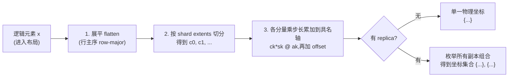
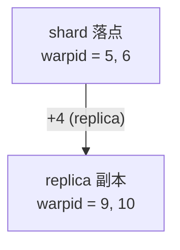
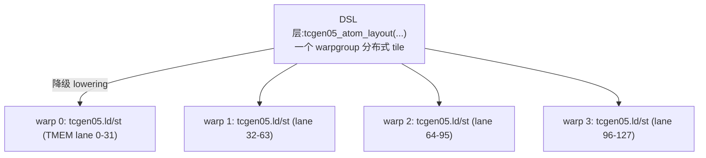

# 第 10 章 · TIRx Layout API

> 原文:[TIRx Layout API](https://mlc.ai/modern-gpu-programming-for-mlsys/chapter_tirx_layout_api/index.html)

> **本章要点(TL;DR)**
>
> - 上一章我们在纸上发明了一套记号来描述布局。这一章干的事说白了就一句话:把那套纸面记号原样搬进编译器,变成你能 new 出来的对象。这样一来,你在纸上画的布局,跟内核里敲的代码,几乎就是同一行字。
> - 要记的东西不多,就三个:`TileLayout`(仿射布局)、`SwizzleLayout`(拿 XOR 给共享内存换序)、`ComposeLayout`(把 swizzle 叠到 tile 上面)。
> - 整套设计的魂就一句话:**一个布局,把一个逻辑坐标,映射到一个甚至好几个物理坐标**。方向记牢——是「逻辑 → 物理」,而且物理那头是一个集合。为什么非得是集合?因为数据要广播(broadcast)的时候,只有"一对多"才说得通。
> - `TileLayout` 分三步走,有点像填快递单:**shard / 分片**(写作 `S[...]`,公式里记成 `D`)先把基础位置定下来;**replica / 复制**(写作 `R[...]`,记成 `R`)再把它抄送到别的地方;**offset / 偏移**(记成 `O`)最后整体挪个位置。一句话公式:`L(x) = { D(x) + r + O | r ∈ R }`。
> - 布局里的轴(axis)可不是匿名的维度编号,每一条都是有名有姓的真实硬件坐标,比如 `laneid`、`warpid`、`TLane`、`TCol`、`m`、`Bank`。另外配了几个现成的构造器(`tmem_datapath_layout`、`tcgen05_atom_layout`、`wg_local_layout`),把高频的硬件布局打包好让你直接拿来用——但别紧张,它们吐出来的还是普通 `TileLayout`,没藏什么黑魔法。

> **前置知识**:读这一章前,最好先懂第 3 章的布局记号(shape/stride 那一套)、第 9 章的 TIRx 基础,以及 warp / lane、TMEM、swizzle 这几个词。没把握的话,先翻一下 [第 0 章 · 极简入门](./ch00_gpu_ml_primer.md),以及第 3、9 章。本章会默认你已经认识这些词。
>
> 不过你放心,这一章里凡是出现 GPU 专有名词,我都会在它第一次露面的时候,当场用大白话给你讲清楚"它是什么、为什么要有它"。你只要会写代码就行,不需要任何 GPU 背景。

> **一句话先理解**:这一章讲的"布局(layout)",你可以先粗暴地理解成一张**座位表**——它规定"我这块数据里的第几个元素,该坐到硬件的哪个座位上去"。座位可能是某个线程的私有存储,也可能是片上内存的某个格子。这一章就是教你怎么用代码把这张座位表写出来。

> **先扫盲:几个本章反复出现的硬件词**
>
> 你完全没碰过 GPU 也没关系,下面这几个词先有个模糊印象就够,后文用到时我还会再细讲:
>
> - **线程(thread)**:GPU 干活的最小单位,跟你熟悉的 CPU 线程类似,但 GPU 会成千上万个线程一起跑。
> - **lane / 通道**:32 个线程被硬件捆成一小班,班里每个线程有个 0–31 的编号,这个编号就叫 lane。
> - **warp / 线程束**:上面说的那"一小班 32 个线程",整体就叫一个 warp。记住数字:**1 个 warp = 32 个 lane**。
> - **寄存器(register)**:每个线程私有的、速度最快的一丁点存储,类似 CPU 寄存器,但这里是"每个线程各有一份"。
> - **共享内存(SMEM)**:一个线程组内部大家共用的一块片上小内存,可以理解成一块"程序员手动管理的高速缓存"。
> - **TMEM(张量内存)**:新一代 GPU(Blackwell)上专门伺候矩阵乘硬件的一种特种内存。
> - **矩阵乘**:为什么矩阵乘总当主角?因为深度学习模型说到底,绝大部分计算量都是一堆大矩阵相乘,GPU 专门造了硬件来加速它。

---

## 10.1 为什么需要 Layout API:让记号变成对象

> **一句话先理解**:上一章我们在纸上发明了一套"座位表"的写法,但那只是写在纸上的文字。这一节讲的是:怎么让这套纸面写法直接变成代码里能 `new` 出来的真对象,这样纸上画的和代码里敲的就是同一行字。

先把上一章那套记号在脑子里过一遍。它就三块拼起来:一个 **tile**(把一个大矩阵切成小方块,每一小块就叫一个 tile;因为整块矩阵太大放不下,GPU 总是切成小块一块一块处理)的形状,一组挂在**具名轴(named axis)**上的**步长(stride)**,外加一个可选的复制项。

这里有两个词要先解释清楚:

- **步长(stride)**:就是"逻辑上往前挪一格,物理上要跨多远"。比如一个数组按行存,行内挪一格地址 +1,换到下一行地址要 +(一行的宽度),这个"+多远"就是步长。会写代码的你对一维数组下标换算肯定不陌生,这就是同一回事。
- **具名轴(named axis)**:普通数组的步长是挂在一个扁平的内存地址上的;而这里的步长是挂在一条**有名字的硬件坐标**上,比如挂在 `laneid`(线程编号)上、或者挂在 `warpid`(第几个 warp)上。换句话说,步长不再是"地址 +几",而是"线程编号 +几"或者"warp 编号 +几"。后面 10.5 会专门讲这个,这里先有个印象。

那个可选的复制项是专门留给"被拷贝、而不是被切开"的数据用的(后面 10.4.2 细讲)。这一章要干的,就是把这套记号坐实成编译器真能跑的 API。

好处一句话就能说明白:**纸上写的,跟代码里写的,一模一样**。比方说你在文档里写下这么一行:

```python
S[(128, 256) : (1@TLane, 1@TCol)]
```

这一行可不是写给人看的说明,它真的会**构造出一个 `TileLayout` 对象**。这个对象能"挂(attach)"到 **buffer**(缓冲区,就是一块装数据的内存,你可以理解成一个带类型和形状的数组)身上。一旦挂上去,凡是碰这个 buffer 的 tile 操作,都能直接从布局里读出"这块数据该摆在硬件的哪个角落"。

好处在哪?**摆放规则只写一次、只检查一次,后面编译器反反复复地用。**你不用在每个算子里都把"每个元素住哪儿"重抄一遍。这就跟你在代码里把一段逻辑抽成一个函数、到处复用是一个道理——只是这里复用的是"数据该怎么摆"这条规则。

那布局是啥时候挂上去的?两个时机:要么从**内存池(memory pool,一块预先划好、由你自己管理的内存,从里头一块一块抠出来用)**里分配的时候,要么声明 buffer 的时候。

```python
pool.alloc(shape, dtype, layout=layout)            # 从内存池分配时附带布局
T.decl_buffer(shape, dtype, scope=scope, layout=layout)  # 声明 buffer 时附带布局
```

从这一刻起,buffer 就自己"背着"物理摆放信息到处走了。tile 操作再也不用一遍遍啰嗦每个元素在哪。

所有布局对象都住在同一个模块里:

```python
from tvm.tirx.layout import (
    TileLayout, SwizzleLayout, ComposeLayout,   # 三个核心布局类
    S, R,                                        # shard / replica 记号构造器
    laneid, warpid, tid_in_wg,                   # 常用具名硬件轴
    TLane, TCol, m,                              # TMEM 轴 与 默认内存轴
    tcgen05_atom_layout, tmem_datapath_layout,   # 现成布局构造器
)
```

> **关键**:整套 API 就围着一个念头转——**一个逻辑下标,对应的未必是单个物理地址,而是一组挂在具名轴上的物理坐标,也就是一个集合**。
>
> 为什么强调"集合"而不是"一个地址"?因为有些数据需要**广播(broadcast)**——也就是同一份数据要同时出现在好几个线程、好几块内存区域里给大家共用。如果一个逻辑元素只能对应一个物理地址,那"同一份数据同时出现在多处"就没法表达了。所以这里特意设计成"一对多"。
>
> 话说回来,**大多数时候这集合里就一个元素**(就是普通的一对一摆放)。只有用上复制时,同一个逻辑元素才会在好几个物理位置同时露面。布局之所以拆成 shard / replica / offset 三块,正是为了把这件事支撑起来:shard 把元素摆好,replica 把它拷到别处,offset 再整体平移一下。

---

## 10.2 先看几个例子(Layouts by Example)

别急着抠机制,先看几个典型例子,把手感找到再说。下面每个例子你都先不用看懂代码细节,只要跟着我用大白话读一遍,体会"哦,原来一行布局就是一张座位表"这个感觉就行。

**例 1:TMEM(Blackwell 这一代 GPU 上专给张量核用的特种内存,见第 0 章)里的累加器(accumulator,矩阵乘里不断把一小批一小批的乘积加进去、攒成最终结果的那块存储)——只摆放,不复制。**

```python
acc = TileLayout(S[(128, 256) : (1@TLane, 1@TCol)])
```

这行怎么读?`S[...]` 就是"摆放规格"的意思(后面会细讲)。`(128, 256)` 是逻辑形状,128 行 256 列;`1@TLane` 你读成"挂到 `TLane` 这条轴上,步长为 1"。所以整行很直白:**逻辑的行扔到 `TLane` 这条硬件坐标上,逻辑的列扔到 `TCol` 上**。`TLane`、`TCol` 是 TMEM 这块特种内存的两个坐标方向,你暂时把它当成"TMEM 的行号和列号"就行。顺嘴提一句命名:TMEM 那一章里硬件坐标叫 Lane 和 Col,到了 TIRx 记号里就改写成 `TLane`、`TCol`,其实是同一个东西。

**例 2:块缩放(block-scaled)MMA(matrix-multiply-accumulate,张量核上"乘一批 + 加进去"一气呵成的矩阵乘累加指令)的缩放因子布局——这回用上了复制。**

```python
scale_factor_layout = TileLayout(
    S[(32, sf_per_mma) : (1@TLane, 1@TCol)] + R[4 : 32@TLane]
)
```

怎么读?`S[...]` 那段是 shard(摆放),`R[...]` 那段是 replica(复制)。shard 先在 TMEM 里放下一个 32 行的组。replica 接着以 32 个 lane(通道,即 warp 内 0–31 的线程编号,见第 0 章)为间隔,把这个组**整体抄送** 4 份。这么一来,一个 32 行的组就把 128 个 lane(= 4 × 32)的整片 TMEM 铺满了。注意:抄送出来的 4 份是**同一份数据**,不是 4 份不同的数据,这正是"复制/广播"的意思。

**例 3:张量核(Tensor Core,GPU 上专门做矩阵乘的硬件单元;深度学习的算力主要就靠它)的寄存器片段(fragment——一个 tile 不是整块放在一处,而是被拆碎、每个线程的私有寄存器里揣一小片,这一小片就叫 fragment)——散落在 lane 和 warp(线程束,一个 warp = 32 个线程的小班,见第 0 章)上。**

```python
frag = TileLayout(
    S[(8, 2, 4, 2) : (4@laneid, 1@warpid, 1@laneid, 1)]
)
```

这里有两点得留个心。第一,**同一条物理轴可以出现不止一次**——你看,这里就有两个不同的项(后面会管它叫 iter)都往 `laneid` 上塞数据。这没问题,它俩在 `laneid` 上的贡献最后会加到一起。第二,**要是你没写明往哪条轴放**(例子里最后那个光秃秃的 `1`,只有步长没写 `@某条轴`),那它默认就落到内存轴 `m` 上(`m` 就是"普通线性内存地址"那条轴,寄存器槽常用它,后面 10.5 表格里有)。

**例 4:真实内核里,常见的硬件布局一般直接调构造器拿。**

```python
acc = tmem_datapath_layout("D", 128, 256)
ld  = tcgen05_atom_layout("32x32b", (128, 64), "float32")
```

这些构造器返回的依然是**普通的 `TileLayout` 对象**。它们不过是替你把常用布局打了个包,不是另起炉灶搞出来的新东西。所以你想干啥都行:检视(inspect)它返回的布局、把它跟别的布局拼起来,或者碰上特别古怪的形状,索性退回去手写底层的 `S[...]` / `R[...]`。

---

## 10.3 交互演示(Interactive Demo)要点

原文在这儿放了个交互式演示。你可以挑一个预置布局,改改逻辑形状,改改 `S` / `R` 项,再选个 dtype 和 swizzle 模式,然后**点中一个元素,看它到底落到了哪个、或者哪几个物理坐标上**。

可惜这是个交互组件,静态笔记里搬不过来。不过没关系,下面这张"数据流"图就把它在背后干的活儿概括清楚了——而且这张图基本就是后面整套 API 的精确版,值得你记住。图里几个词先简单说一下:**展平(flatten)**就是把多维下标压成一个一维数字(跟你把二维数组按行拍扁成一维数组算下标是一回事);**行主序(row-major)**就是"先走完一行再换下一行"的那种排法(C 语言数组、NumPy 默认都是这个);**replica** 就是前面说的复制。



> **注意**:这个演示最值钱的地方,就是它把一件事**画给你看了**:同一列访问,不加 swizzle 的时候全挤在一个 bank(共享内存被切成的小块存储体,后面 10.12 细讲)里;一旦配上对路的 swizzle(一种把数据打散摆放的换序手法,后面 10.11 起细讲),立马就散到不同 bank 上去了。这两个词你现在不懂没关系,先记着"挤在一起 = 慢、散开 = 快"就行,后面会从头讲。有条件的话,强烈建议去原书亲手玩一玩。

---

## 10.4 `TileLayout`:主力仿射布局

> **一句话先理解**:`TileLayout` 是这一章最主要、你最常用的那个布局类。它只会做一种很"乖"的运算——拿坐标乘个数、再加起来。下面把它内部的三个零件(shard / replica / offset)拆开慢慢看。

`TileLayout` 是你最常打交道的布局对象,它属于**仿射(affine)**那一类。"仿射"是个数学词,但别被吓到,说白了就是"乘个步长再加起来"这种规规矩矩的线性变换,没有取模、没有位运算这些花活儿(那些花活儿要等到后面 swizzle 才出场)。它的写法跟正文记号完全是一套:

```python
TileLayout(S[shape : strides])                                   # 仅 shard
TileLayout(S[shape : strides] + R[replica_shape : replica_stride])  # shard + replica
TileLayout(S[shape : strides] + R[...] + offset)                 # shard + replica + offset
```

- `S` 项就是 **shard spec**(分片规格),你可以一句话读出来:"拿一个这种形状的逻辑 tile,按这些步长,把它摊到具名轴上去"。
- 要是某个值得同时出现在好几个地方,就拿 `R` 项把 shard 扩一扩。
- 最后还能再叠一个可选的 offset。

再往下挖一层:这几个部件底层都靠一种叫 **iter**(迭代器,你把它当成"一条走法说明书"就行)的东西来表示。一个 iter 就是一个三元组:

```
(extent, stride, axis)
```

你可以把一个 iter 想象成"在某条具名轴上,从 0 开始,按固定步长走一趟"。这三个数的意思是:

- `extent`——**走几步**(也就是这一维有多少个位置)。
- `stride`——**每步迈多远**(就是前面说的步长)。
- `axis`——**在哪条硬件坐标上走**(比如 `laneid`、`warpid`)。

打个比方,iter `(8, 4, laneid)` 的意思就是:"在 `laneid` 这条轴上走 8 步,每步跨 4,于是依次落在 laneid = 0, 4, 8, 12, ..., 28。"下面咱们把 shard / replica / offset 三块挨个拆开看。

### 10.4.1 Shard(分片,记作 `D`)

shard 就是 `S[...]` 写出来的那一块。它干的活儿是:把逻辑下标摊到一个或几个 iter 上**切开**,再算出**基础物理坐标**。看个例子:

```python
S[(8, 2, 4, 2) : (4@laneid, 1@warpid, 1@laneid, 1)]
```

这里有 4 个 shard iter,extent 依次是 `8, 2, 4, 2`。它们的步长把数据分别送到 `laneid`、`warpid`、又一次 `laneid`、还有默认内存轴 `m`(最后那个没写 `@轴`,默认就是 `m`)上。

别觉得陌生,这其实就是你平时写多维数组时那套**"形状-步长"换算规则的加强版**。你算二维数组 `a[i][j]` 的地址是 `i*列数 + j`,对吧?这里干的是同一类事,**唯一不一样的地方是:步长现在挂到了"具名硬件轴"上**(比如算出来的不是一个内存地址,而是"该去 laneid=几、warpid=几"),而不再是挂在一个扁平的内存地址上。

### 10.4.2 Replica(复制,记作 `R`)

replica 说的是同一个逻辑元素的**额外物理副本**(就是同一份数据多复制几份摆到别处)。它有个要命的特点:**replica iter 跟你访问的是哪个逻辑元素一点关系都没有**。

这话什么意思?shard 是"你问第几个元素,我告诉你它在哪"——结果**随你问的下标变**。而 replica 是"不管你问哪个元素,我都额外在固定的几个地方各放一份"——结果**跟下标无关、永远是那套固定偏移**。比如:

```python
R[2 : 4@warpid]   # 在 warpid 轴上,生成两个相隔 4 个 warp 的副本
```

读法:`R[2 : 4@warpid]` 表示在 `warpid` 这条轴上复制出 2 份,相邻两份隔 4 个 warp。也就是说,原本在 warpid = w 的那份数据,会同时再在 warpid = w+4 处出现一份。

> **关键**:别把复制看成图省事的小聪明,它是在**老老实实地照搬硬件本来的样子**。有些数据天生就得在 warp、lane 或者内存区域之间广播(broadcast)出去。而"逻辑→物理"这个方向,恰好天生就能把这事说清楚——因为它本来就允许一个逻辑元素对应一组物理坐标。

### 10.4.3 Offset(偏移,记作 `O`)

offset(偏移)就是一个固定坐标,它会加到**每一个**结果上,效果是把整张座位表整体挪个位置。比如:

```python
5@warpid   # 把整个摆放在 warpid 轴上整体平移 5(本来从 warpid=0 起,现在从 warpid=5 起)
```

offset 通常拿来干这么几件事:把 tile 挪到指定的起点;给某个独占用途圈一块地方;或者描述一个"紧贴在另一个 tile 后头"的 tile(俩人共用同一块资源)。

### 10.4.4 三部分如何协同

一个布局会**按固定的顺序**走这三步,次序乱不得:

1. **shard** 先把基础坐标算出来;
2. **replica** 再把这个坐标抄成零个或多个额外副本;
3. **offset** 最后把每个坐标都挪一挪。

对逻辑坐标 `x`,最终结果就是:

```
L(x) = { D(x) + r + O | r ∈ R }
```

这公式看着唬人,其实就是把上面三步用集合写法表达了一遍,逐项翻译一下:`D(x)` 是 shard 给元素 `x` 算出的基础坐标(D = "定位");`O` 是固定 offset(平移);`r` 遍历 replica 给出的每一个副本偏移(抄送);整个 `{ ... | r ∈ R }` 是"集合推导式",意思是"对每一个副本偏移 `r`,都算一个坐标 `D(x)+r+O`,把它们凑成一个集合"——如果你用过 Python 的列表推导式 `[f(r) for r in R]`,这就是同一个写法的数学版。这公式不用背,记住"定位 → 抄送 → 平移"这三步就够了。要是没有 replica,`R` 里就只剩一个零偏移,结果是个**只装一个元素的集合**;要是有 replica,那每个副本位置都会摊上一个坐标。一个写全乎的布局长这样:

```python
layout = TileLayout(
    S[(8, 2, 4, 2) : (4@laneid, 1@warpid, 1@laneid, 1)]  # shard:摆放逻辑 tile
    + R[2 : 4@warpid]                                     # replica:在 4 个 warp 外建第二份副本
    + 5@warpid                                            # offset:整体平移到 warpid=5 起步
)
```

从左往右读就行:shard 把逻辑 tile 摆好,replica 在隔着 4 个 warp ID 的地方又放一份副本,offset 把整体挪到从 `warpid = 5` 起步。要是你手头已经有现成的 iter 对象,也可以直接拼:

```python
TileLayout.from_iters(shard, replica, offset)
```

不过大多数代码还是爱用 `S[...]` / `R[...]` 记号,因为它读起来更像数学公式,一眼就懂。

---

## 10.5 具名轴(Named Axes):名字本身就是语义

前面一直在念叨"具名轴",这里专门掰开讲讲。

先说为什么要有"名字"。普通数组里,维度就是个匿名编号:第 0 维、第 1 维……你得靠脑子记"第 0 维是行还是列"。但 GPU 的硬件坐标种类多、含义还容易混(线程编号?warp 编号?内存地址?),如果只用编号,过两天自己都看不懂。所以这里给每条轴都起了**实名**,名字本身就告诉你它指的是哪个硬件坐标。

布局里的轴**不是匿名的维度编号**,每一条都对应一个真实的硬件坐标,或者编译器层面的某个摆放坐标。常见的轴有这么几类(下面表格里的词,你不用全记住,扫一眼知道"哦,轴是分这么几大类的"就够,用到哪个回来查):

| 类别 | 轴名 | 含义 |
| --- | --- | --- |
| 网格轴(grid) | `bx`, `by`, `bz` | 把工作分布到不同 CTA(cooperative thread array,即一个 block,见第 0 章)上 |
| 集群轴(cluster) | `cbx`, `cby`, `cbz` | 在一个 CTA cluster(一组能协同的 block 集群)内部摆放工作 |
| 线程轴(thread) | `tx`, `warpid`, `laneid`, `wgid`, `tid_in_wg`, `wid_in_wg` | 描述在 CTA 或 warpgroup(几个 warp 凑成的协作组)内部的归属 |
| 内存轴 | `m` | 默认的线性内存轴(寄存器槽常用它) |
| 二维便签 | `P`, `F` | 用于二维 scratchpad 式摆放 |
| 共享内存 | `Bank` | 命名共享内存的 bank |
| TMEM 轴 | `TLane`, `TCol` | TIRx 对 TMEM 的 Lane / Col 坐标的命名 |

这里顺带解释表里几个生词:**CTA**(也叫 block)是一组线程的集合,GPU 把活儿先切成一个个 CTA 发下去;**warpgroup** 是几个 warp 凑成的更大协作单位;**bank** 是共享内存切成的小块存储体(10.12 细讲)。看不懂没关系,知道"它们都是 GPU 里某一级的'分组单位'"即可。

> **关键**:**轴的名字本身就是布局的一部分**。为啥这么强调?因为**两个数值一样的坐标,硬件含义可能差着十万八千里**:`1@tx` 不等于 `1@tid_in_wg`,`1@laneid` 也不等于 `1@TLane`——前者是"线程往前挪 1 个",后者是"在 warpgroup 内挪 1 个"或"在 TMEM 上挪 1 个",落点完全是两码事。打个你熟的比方:就像 `time += 1` 里这个 1 到底是 1 秒还是 1 毫秒,数字一样含义天差地别——这里干脆把单位(轴名)直接写进式子里,你就不用再靠上下文去猜"这一维到底指啥"了。

---

## 10.6 前向映射(Forward Mapping):`layout.apply()`

> **一句话先理解**:这一节就是把前面"座位表怎么算出来"这件事,落成一个你真能调用的函数。给它一个逻辑坐标,它返回这个元素该坐到硬件的哪个/哪些座位上。

所谓"求值一个布局",意思就是:你扔给它一个逻辑坐标,它给你算出对应的物理落点。要用的 API(函数)是:

```python
layout.apply(*coord)   # coord 就是你要查的逻辑坐标,比如 apply(3, 5) 查第 3 行第 5 列那个元素
```

(`*coord` 是 Python 的可变参数写法,你按维度依次传下标就行。)返回什么呢:

- 没复制的时候,你拿到**一个坐标字典**;
- 有复制的时候(同一份数据被广播到多处),你拿到**一组坐标字典**(一个列表,里头每项是一个落点)。

坐标字典说白了就是把"轴名"映到"在那条轴上的整数位置",长这样:

```python
{"laneid": 7, "warpid": 2, "m": 1}
```

(读法:这个元素归 7 号 lane、第 2 个 warp,落在内存轴 `m` 的第 1 个槽。)

整个求值就四步,跟前面那张数据流图一一对得上。你跟着走一遍就会发现,这就是"多维下标换算"的加强版,没什么神秘的: 

1. **展平(flatten)**:先把逻辑坐标按**行主序**压成一个一维下标(就是把多维下标拍扁成一个数字,跟你算多维数组的线性下标完全一样)。对形状 `(S0, S1, ..., Sr-1)` 里的坐标 `(x0, ..., xr-1)`,公式是:

   ```
   flat = x0*S1*S2*...*Sr-1 + x1*S2*...*Sr-1 + ... + xr-2*Sr-1 + xr-1
   ```

2. **切分(split)**:把上一步那个一维下标,按 shard 的 extents `(e0, ..., en-1)` 重新切成几段,得到分量 `c0, ..., cn-1`(依然是行主序)。

3. **累加(accumulate)**:每个分量乘上自己的步长,加到对应的轴上去。具体讲,要是第 `k` 个 shard iter 是三元组 `(ek, sk, ak)`,那分量 `ck` 就往轴 `ak` 上贡献 `ck*sk`。同一条轴上的贡献全加起来,最后再补上 offset。

4. **复制(replica)**:把 replica iter 施加上去。每个 replica iter 都贡献一个跟逻辑坐标无关的额外偏移;要是有好几个 replica iter,布局就把它们所有的组合都枚举出来。

> **注意**:这里藏着一个特别好用的推论——**布局压根不用把输入形状写死**。它只认一件事:逻辑 tile 的元素总数,得等于 shard extents 的乘积(也就是 `e0 × e1 × ... × en-1`)。为什么?因为"展平"把多维拍成了一个一维数字,而"切分"只看这个总数怎么切——只要总数对得上,中间的形状随便怎么摆都行。这个数一对上,光靠"展平 + 切分"就能把整个映射定义得清清楚楚。正是这一点,让一个布局能套用到形状不完全一样、但元素总数相同的多种 tile 上,相当通用。

---

## 10.7 案例 A:张量核寄存器 tile

> **一句话先理解**:这一节没有新概念,纯粹是带你拿前面那四步,对一个具体布局算一遍,把流程跑通。看着步骤多,其实每一步都是小学算术(乘、除、取余)。

光说不练假把式,咱们拿前面的公式跑一个完整的例子。假设有个逻辑 `(8, 16)` 的 tile,要分到 2 个 warp(每个 warp 32 个 lane)上,每个 lane 自己拿一小段寄存器(register,每个线程私有、最快的那点存储,见第 0 章)片段。寄存器槽就用默认内存轴 `m` 来表示。布局长这样:

```python
layout = TileLayout(
    S[(8, 2, 4, 2) : (4@laneid, 1@warpid, 1@laneid, 1)]
    + R[2 : 4@warpid]
    + 5@warpid
)
```

随便挑个逻辑元素 `(i, j)`,咱们按四步走一遍。(下面 `floor(a/b)` 是整除取下,`a mod b` 是取余,跟你代码里的 `a // b` 和 `a % b` 一模一样。)

**第 1 步 行主序展平**:`flat = 16*i + j`

**第 2 步 按 shard extents `(8, 2, 4, 2)` 切分**:

```
c0 = i
c1 = floor(j / 8)
c2 = floor(j / 2) mod 4
c3 = j mod 2
```

**第 3 步 累加到各轴**(`4@laneid, 1@warpid, 1@laneid, 1` 对应 `m`):

```
laneid = 4*c0 + c2
warpid = c1
m      = c3
```

**加上 offset `5@warpid`**:

```
laneid = 4*i + floor(j/2) mod 4
warpid = floor(j/8) + 5
m      = j mod 2
```

**第 4 步 施加 replica `R[2 : 4@warpid]`**(在 `warpid` 上加 0 或 4):

```
laneid = 4*i + floor(j/2) mod 4
warpid = floor(j/8) + 5 + 4*r,   r ∈ {0, 1}
m      = j mod 2
```

捋一捋结果:shard 把 tile 放到了 warp 5 和 6 上,replica 又把它拷到 warp 9 和 10。所以同一个逻辑元素,最后落在了**两组 warp 位置**上:



> **关键**:这个例子正好讲明白了**为啥这套模型非得选"逻辑 → 物理、而且物理那头是一个集合"这个方向**。
>
> 倒过来想一下:假如你把方向反过来,做成"物理坐标 → 逻辑坐标"的函数,会怎样?复制就写不出来了。因为复制意味着"warp 5、6、9、10 这好几个物理位置,装的都是同一个逻辑元素"——也就是好几个物理点都要映回同一个逻辑点。可你想想数学上"函数"的定义:一个输入只能有一个输出。多个物理点映到同一个逻辑点没问题,但要是反过来从这个逻辑点出发,它该往回指哪个物理点?指不清,这就**不是一个合法的函数**了。
>
> 而用"一个逻辑坐标 → 一组物理坐标"这个方向,一点障碍都没有:一个输入(逻辑坐标),对应一个输出(物理坐标的集合),完全合法。这就是 API 死活要选"逻辑→物理"、还让结果是个集合的根本原因。

---

## 10.8 案例 B:Blackwell 张量内存(TMEM)

> **一句话先理解**:上个例子在描述"数据分给哪些线程",这个例子在描述"数据摆在内存的哪个格子"。重点是:**同一套 `TileLayout`,这两件事都能干**,只是把轴从线程轴换成内存轴而已。

上个例子用的是线程轴(`laneid`、`warpid` 这种,讲的是"谁负责这块数据")。但同一套布局模型,其实拿来描述**内存摆放**(讲的是"这块数据搁内存哪儿")也照样行——轴不一定非得是线程轴,换成内存轴一样玩得转。TMEM 这块特种内存靠硬件 Lane 和 Col 两个坐标来寻址(你就当它是"行坐标"和"列坐标"),在 TIRx 记号里就写成 `TLane`、`TCol`。看这个布局:

```python
layout = TileLayout(
    S[(2, 128, 112) : (112@TCol, 1@TLane, 1@TCol)]
)
```

要是逻辑形状正好就是 `(2, 128, 112)`,那就省事了:切出来的分量恰好就是逻辑坐标本身,不用再折腾换算。对元素 `(a, l, c)`:

```
TLane = l
TCol  = 112*a + c
```

- extent 是 128、步长 `1@TLane` 的那个 iter,负责把 128 行 TMEM Lane 填满;
- extent 是 2(步长 `112@TCol`)和 extent 是 112(步长 `1@TCol`)这两个 iter 凑一块儿,一共盖住 224 列,也就是 `TCol ∈ [0, 224)`。

| TLane \ TCol | `[0, 111]` | `[112, 223]` |
| --- | --- | --- |
| `TLane=0` | a=0 段(112 列) | a=1 段(112 列) |
| `TLane=1` | a=0 段(112 列) | a=1 段(112 列) |
| ... | ... | ... |
| `TLane=127` | a=0 段(112 列) | a=1 段(112 列) |

图注:128 行 TMEM Lane 全部填满;`TCol` 共 224 列,左半 `[0, 111]` 是 `a=0` 段,右半 `[112, 223]` 是 `a=1` 段。

> **注意**:这 224 列可不是手滑写错了,是**故意的**——**TMEM 布局不一定非得凑成 2 的幂**(2 的幂就是 2、4、8、…、256 这种数;很多底层代码图省事爱用 2 的幂,但这里不强求)。举个例子,一个块缩放 FP8 GEMM(general matrix multiply,通用矩阵乘法;FP8 是一种只占 8 位的超省空间浮点数)就可能专门挑 224 列的累加器:因为要是塞满 256 列,TMEM 这块内存就装不下了,没法把两个累加器阶段再加上缩放因子全放进去。这种"不规整"(非 2 的幂)的形状,Layout API **张口就能写**——这正是它"支持通用形状"这个设计目标在发挥作用。

---

## 10.9 缩放因子布局(Scale Factor Layouts):复制的真正用武之地

> **一句话先理解**:这一节是 replica(复制)的"主场秀"。前面累加器是一对一摆放,用不上复制;而缩放因子需要被好几组线程同时看到,这正是复制天生要解决的问题。

先说说缩放因子是干嘛的:块缩放(block-scaled)矩阵乘里,为了用 FP8 这种超低精度还不丢太多精度,会给每一小块数据配一个"缩放系数",算的时候乘回去。这个系数就叫**缩放因子(scale factor)**。

前面那个累加器是**纯摆放**:一个逻辑累加器元素,只对一个 TMEM 坐标,一对一。可块缩放 MMA 里的缩放因子就两码事了——**同一份缩放因子,经常得让好几个 warp 窗口同时都能读到**(因为它们要拿同一个系数去缩放各自手里的数据)。这下复制可就大显身手了:

```python
scale = TileLayout(
    S[(32, sf_per_mma) : (1@TLane, 1@TCol)]   # shard:在 TMEM 放一个 32 行的缩放因子组
    + R[4 : 32@TLane]                          # replica:相隔 32 lane,复制 4 份
)
```

对逻辑缩放坐标 `(r, s)`:

```
shard:           TLane = r ,            TCol = s
replica 之后:     TLane = r + 32*q ,     TCol = s ,   q ∈ {0,1,2,3}
```

这么一来,这个 32 行组就在 TMEM lane 的 0–31、32–63、64–95、96–127 这四个窗口里同时现身了:

| lane 窗口 | `TLane [0, 31]` | `TLane [32, 63]` | `TLane [64, 95]` | `TLane [96, 127]` |
| --- | --- | --- | --- | --- |
| 内容 | SF | SF | SF | SF |
| replica 偏移 | 原本 (+0) | +32 | +64 | +96 |

图注:四个 warp 大小的 lane 窗口看到的是同一份缩放因子组(SF),通过 replica 在 `TLane` 上分别偏移 0 / 32 / 64 / 96。

这其实就是「跨 GPU 世代的张量核操作数布局」那一章讲的 **`warpx4` 广播模式**:四个 warp 大小的 TMEM lane 窗口,看到的都是同一份缩放因子组。

当然,真实场景里这个布局还要再复杂一些(下面这段你扫一眼有个印象即可,不影响主线)。这个"原子"(atom,指最小的可复用布局单元)会跟外层 iter 拼到一起,把它沿着矩阵的 M 行方向、以及 K 方向的多个缩放因子组铺开。另外,看缩放因子是什么 **dtype**(data type,数据类型,比如 fp8 / fp16),**好几个缩放因子还可能挤进同一个 32 位 `TCol` 单元**——比方说 fp8 缩放因子只占 8 位,4 个正好打包塞进一个 32 位列单元。除此之外还有两个可选的 iter:一个"步长为 0 的复用"iter(步长为 0 意味着"原地不动地重复用同一份"),一个"流水深度"iter,分别用来描述跨多次 MMA 复用同一缩放因子,以及**双缓冲**(double buffering,准备两块缓冲区轮流用,一块在算、另一块同时在搬数据,省得互相等)。

> **关键**:这里最该记住的一点是——**同一个 `TileLayout` 模型,把两种压根不一样的情况一锅端了**。累加器是 TMEM 里的"单点摆放";缩放因子是同一片 TMEM 地址空间里的"复制摆放"。就一套模型,两类需求全搞定。

---

## 10.10 现成布局(Ready-Made Layouts)

写**内核(kernel,就是真正跑在 GPU 上的那段函数)**的时候,谁也不乐意每个硬件布局都从头一个 `S[...]` 一个 `R[...]` 地手敲。所以 TIRx 替那些天天用到的布局备好了现成的**构造器(constructor,就是替你 new 出对象的工厂函数)**,直接调就完事——跟你用标准库里的现成函数、不自己造轮子是一个意思:

| 构造器 | 返回内容 | 关键参数说明 |
| --- | --- | --- |
| `tmem_datapath_layout(datapath, rows, cols)` | `tcgen05.mma` 写出的 TMEM 累加器布局 | `datapath` 选择行摆放模式:`"D"` 对应 `M=128` 的恒等式摆放,`"F"` 对应 `M=64` 的散布式摆放 |
| `tcgen05_atom_layout(instr_shape, tensor_shape, dtype)` | 由一个 `tcgen05.ld` / `tcgen05.st` 原子搬运的寄存器 tile 布局 | `instr_shape` 如 `.32x32b`、`.16x64b`、`.16x128b` 等 |
| `wg_local_layout(cols, rows=128)` | warpgroup 本地寄存器 tile | 通常每个线程一行,落在 `tid_in_wg` 上 |

这里有个关于 `tcgen05_atom_layout` 的小门道值得留意:它在两个不同层次上长得不一样。先解释两个词:**DSL** 是 domain-specific language(领域专用语言),这里就指你写内核的那层高级写法;**降级(lowering)**是编译器把高级写法一步步翻译成底层真指令的过程(就像高级语言被编译成汇编)。

在 DSL 这层,`tcgen05_atom_layout` 看上去就是一整块 **warpgroup 分布式 tile**(一整个 warpgroup 共同持有的一块数据);可一旦经过降级,它就被拆成**四条由各 warp 协同执行(warp-collective)的 `tcgen05.ld` / `tcgen05.st` 指令**(`ld` = load 读,`st` = store 写),**一个 warp 摊一条**,每条管自己那 32 个 TMEM lane。一句话:上层看是一整块,下层其实是 4 个 warp 分头干活。



> **注意**:这些 helper 不过是替你省掉手写常见硬件映射的功夫,它们**并没有把模型藏起来**——每个 helper 吐出来的,都是拿前面那套 `S` / `R` 部件拼成的普通 `TileLayout`。

---

## 10.11 `SwizzleLayout` 与 `ComposeLayout`:仿射之外的换序

> **一句话先理解**:到目前为止那套"乘步长再相加"的乖运算(仿射)有个天花板,搞不定一种叫 swizzle 的打乱摆放。所以 TIRx 把 swizzle 单独做成一个对象,再用 `ComposeLayout` 把它"叠"在 `TileLayout` 上面。这一节先讲清这个分工,具体为什么要 swizzle、怎么算,留给后面 10.12 起。

`TileLayout` 是**仿射**的:它能描述具名轴上的步长、复制和偏移。线程片段、TMEM tile、紧凑缩放因子布局这一大类摆放,它都拿得下。

可有一样它就是搞不定,那就是**共享内存(SMEM,一个 block 内线程共享的片上内存,见第 0 章)的 swizzle**。swizzle(换序)就是**故意把数据在存储体之间打乱摆放**,目的是躲开一种叫 **bank 冲突(bank conflict)** 的性能坑——多个线程同时去挤同一块存储体里的不同地址,硬件没法并行,只能排队一个个来,慢一大截(后面 10.12 会从头讲)。问题是,这种打乱**根本不是"乘步长再相加"那种乖模式**,而是对内存地址来一次**基于 XOR 的置换(permutation,就是把地址重新洗牌排序)**。XOR 是按位异或,典型的位运算,硬塞进仿射这种纯加乘的模型里,别扭得很。

所以 TIRx 索性把 swizzle 单拎出来做成一个布局对象,再让它跟 tile 布局组合着用:

```python
swizzle = SwizzleLayout(...)              # 单独的换序对象
layout  = ComposeLayout(swizzle, tile)    # 把 swizzle 叠在 tile 之上
```

执行顺序一目了然:**先让 tile 布局把线性内存地址算出来,再让 swizzle 把这个地址重排一遍**。把这两层拆开,比硬把 XOR 置换往仿射模型里塞,要干净利落得多。


---

## 10.12 为什么要 swizzle:bank 冲突的来由

> **一句话先理解**:这一节讲"病因"——为什么不做 swizzle 就会慢。把病因搞懂了,下一节那个看着吓人的 XOR 公式你就知道它在治什么了。

得先把 bank 冲突是怎么来的讲清楚,你才明白 swizzle 到底在治啥病。

共享内存被硬件切成 **32 个 bank**(你就理解成 32 个并排的小抽屉),每个 bank 里一个"字(word)"是 4 字节。**为什么要切成 32 个?** 因为一个 warp 正好 32 个线程,理想情况下这 32 个线程各取各的抽屉,32 个抽屉同时开,一拍就全拿到,这是最快的。

规矩是这样:一次访问里,要是好几个 lane(线程)同时去碰**同一个抽屉(bank)里的不同地址**,这一个抽屉一次只能拿一个东西,硬件就只能排着队一个一个来——这就叫这次访问被**串行化(serialized)**了,本来一拍能干完的活儿,现在要好几拍,慢一大截。(注意:大家碰同一个抽屉的**同一个**地址不算冲突,那叫广播,硬件支持;冲突特指同抽屉、不同地址。)

麻烦就麻烦在:一个老老实实、按常理排的行主序 tile,**从结构上**天生就会撞上这种冲突。咱们拿一个 `(8, 64)` 的 **float16**(16 位、2 字节的半精度浮点数)tile、行主序布局来瞧瞧:

```python
TileLayout(S[(8, 64) : (64@m, 1@m)])
```

逻辑元素 `(i, j)` 的线性地址是 `m = 64*i + j`(就是 `行号 × 每行 64 + 列号`,标准的行主序换算)。一行有 64 个 float16,也就是 64 × 2 = 128 字节——而 32 个 bank × 每 bank 4 字节 = 128 字节,所以**一行正好铺满 32 个 bank 一整圈**(术语叫一条 "bank line")。

问题就卡在这儿:bank 索引是按地址每 4 字节绕一圈(0,1,...,31,然后又回 0)。假设一个 warp 沿着**某一列**往下读(也就是 `j` 固定、`i` 从 0 到 7 变),每往下挪一行,地址就整整跨过 128 字节。可 128 字节正好是 bank 绕一整圈的长度,跨完一圈又精准回到出发的那个 bank。于是这一列 8 行读下来,**8 个元素全挤在同一个 bank(同一个抽屉)上**——这就是结构性的冲突,躲都躲不掉。

那 swizzle 怎么治?思路就一句:**让地址的低位(决定落哪个 bank 的那几位)去掺进更高的行号信息**。这么一搅,原本不同行算出来落到同一个 bank 的那一列,就被推到不同 bank 上去了——抽屉散开,大家就能并行拿了。

---

## 10.13 swizzle 变换的数学形式

> **一句话先理解**:swizzle 本质上就是对地址做一次"按位异或洗牌"。这一节把它写成公式。你只要记住一件事:它**只改地址里决定 bank 的那几位**,数据本身一个没动、也没丢。

思路讲明白了,咱们把 swizzle 的数学形式摆出来。别一看位运算就发怵——这里用到的就一个 **XOR(按位异或,记作 `^`)**:两个二进制位相同得 0、不同得 1,C / Python 里就是 `^`。先弄清每个参数是干啥的。一个 `SwizzleLayout` 由三个整数管着:

```
per_element = M   # 保持连续的低位个数
swizzle_len = B   # 参与 XOR 的位组宽度
atom_len    = S   # 被取出去 XOR 的高位组起点
```

输入是线性元素地址 `m`,变换分几步走。先拿大白话过一遍(`>>` 是右移、`<<` 是左移、`&` 是按位与,都是你熟悉的位运算):**`m` 最低的 `M` 位原封不动**(这是为了让一小撮连续的元素继续挨在一起,方便硬件一次成批读);剩下的高位拽下来当临时值 `x = m >> M`;接着把 `x` 里 `[S, S+B)` 那段位组**异或**到 `[0, B)` 这段上(这一步就是"把高位行信息掺进低位"的实现);最后再把刚才没动的低 `M` 位拼回去。写成伪代码就是:

```python
mask = (1 << B) - 1
low  = m & ((1 << M) - 1)     # 取低 M 位,保持连续
x    = m >> M                  # 高位部分
x2   = x ^ ((x >> S) & mask)   # 把 [S, S+B) 位组 XOR 到 [0, B)
addr = (x2 << M) | low         # 把低 M 位拼回去
```

> **注意**:这套变换要成立,前提是 `S ≥ B`。还有一点务必记牢:**swizzle 不会动 tile 里到底有哪些逻辑元素**,它只动这些元素**落到共享内存的哪个位置**。MMA 读到的照样是同一个逻辑 tile,swizzle 不过是把背后那套物理 bank 排布优化了一下罢了。

---

## 10.14 如何选择 swizzle 参数

好消息是:平时你基本不用亲自去定这三个参数——它们会**根据 dtype(数据类型)和共享内存 swizzle 模式自动推出来**。常见的 swizzle 模式就 32 字节、64 字节、128 字节这三种(这个字节数大致对应"打乱的力度")。

不过道理还是值得搞明白。`per_element`(也就是 `M`,前面说过它管"最低多少位保持不动")怎么选?原则是:**让一个"向量"大小的小组保持连续**。这里的"向量"指硬件一次能成批搬运的一小撮连续数据(GPU 喜欢一次读一整块,而不是一个一个抠,这样最快)。拿 float16 说,一个 16 字节的向量能装 8 个元素(16 ÷ 2 = 8),要让这 8 个连号元素不被打散,就得保住最低 3 位不动,所以 `M = log2(8) = 3`。再配上 128 字节 swizzle,布局就这么写:

```python
SwizzleLayout(per_element=3, swizzle_len=3, atom_len=3)
```

这套参数一箭双雕:既保住了 16 字节向量组不被拆散,又足够把更大范围的共享内存地址模式搅乱,从而把列方向的 bank 冲突消掉。于是,一个带 swizzle 的共享内存分配就长这样:

```python
tile    = TileLayout(S[(8, 64) : (64@m, 1@m)])
swizzle = SwizzleLayout(per_element=3, swizzle_len=3, atom_len=3)
layout  = ComposeLayout(swizzle, tile)   # 组合后的布局才是挂到 SMEM buffer 上的那个
```

> **关键**:绝大多数代码**根本不该**自己去手算这些参数——dtype 和 descriptor 模式一般早就把它们定死了。这里的 **descriptor(描述符)**你就理解成"一张告诉硬件该怎么读写这块数据的配置表"。**TMA**(Tensor Memory Accelerator)是新一代 GPU 上专门负责高效搬运大块数据的硬件部件,它搬数据时也按一张 descriptor 来认地址布局。你真正得操心的就一件事:**TIRx 布局里的 swizzle、TMA 搬数据时认的 descriptor、还有 MMA 指令期望的数据排布,这三家必须对得上、保持一致**——它们仨各自按各自的理解去读同一块内存,只要有一家对不上,读出来就是乱的。

---

## 10.15 元素的 bank 与 line

怎么验证一个 swizzle 是不是真管用?办法挺简单:把 swizzle 之后的元素地址换算回"它落在 32 个抽屉里的哪一个",看看一整列读下来是不是散到了不同抽屉。下面给出从"元素地址"到"bank 编号"的换算。设 `addr` 是 swizzle 后的元素地址(以"第几个元素"计),`b` 是每个元素的字节数:

```
byte = addr * b               # 字节地址
bank = floor(byte / 4) mod 32 # 32 个 bank,每 bank 字 4 字节
line = floor(byte / 128)      # 128 字节的 bank line
```

对 float16,`b = 2`,bank 公式就简化成 `bank = floor(addr / 2) mod 32`。下面那段演算用的就是这个。

---

## 10.16 完整演算:对 `(8, 64)` float16 tile 施加 128B swizzle

> **一句话先理解**:这一节把前面所有零件串起来跑一遍真账。结论会非常直观:加了 swizzle,原来全挤在一个抽屉的一列,变成散在 8 个抽屉;不加,8 行死死压在同一个抽屉。看完这节你会对 swizzle"到底有没有用"彻底踏实。

理论讲完了,咱们把整件事从头到尾算一遍,看看冲突是不是真没了。还是那个行主序 float16 tile:`m = 64*i + j`,套上 `SwizzleLayout(per_element=3, swizzle_len=3, atom_len=3)`。把它代进上一节那个变换公式:

```
x    = m >> 3
addr = ((x ^ ((x >> 3) & 7)) << 3) | (m & 7)
```

令 `q = floor(j/8)`、`r = j mod 8`(就是把列号 `j` 拆成"第几组 8 个"和"组内第几个"),可化简为:

```
addr = 64*i + 8*(q XOR i) + r
```

关键就在 `q XOR i` 这一项:行号 `i` 被 XOR 掺进了地址里。**盯住列 `j = 0` 看**(这时 `q = 0`、`r = 0`),得到 `addr = 64*i + 8*(0 XOR i) = 64*i + 8*i = 72*i`。咱们一行一行地算它落哪个 bank(用前面那条 `bank = floor(addr/2) mod 32`):

| 行 `i` | `addr = 72*i` | `bank = floor(addr/2) mod 32` |
| :---: | :---: | :---: |
| 0 | 0   | **0**  |
| 1 | 72  | **4**  |
| 2 | 144 | **8**  |
| 3 | 216 | **12** |
| 4 | 288 | **16** |
| 5 | 360 | **20** |
| 6 | 432 | **24** |
| 7 | 504 | **28** |

看结果:这一列现在散在 **8 个互不相同的 bank** 上,冲突没了。

**再对比一下不加 swizzle 的情形**:同一列的地址是 `m = 64*i`,于是 `bank = floor(64*i / 2) mod 32 = 0`——**每一行全挤在 bank 0**,整次访问被彻底串行化。差距一眼就看出来了。

| 情况(列 `j=0`) | 8 行 `i` 落到的 bank | 结果 |
| --- | --- | --- |
| 无 swizzle | 全部塞进 bank 0 | 串行化,约 8x 慢 |
| 有 128B swizzle | 散到 bank 0, 4, 8, 12, 16, 20, 24, 28 | 无冲突 |

> **注意**:可别把这个"无冲突"当成包治百病的护身符,它**是有前提的**:你得照着 swizzle 当初的设计意图来用。dtype、swizzle 宽度、访问形状,统统得跟 TMA、MMA 的 descriptor 模式对上。一个 128 字节 float16 swizzle,是**专门冲着特定的 16 字节行块和张量核访问模式**设计的——它**可不保证**你随便来个什么共享内存访问都能无冲突。

---

## 10.17 设计原理(Design Rationale)

学到这儿,咱们回头看看整套 Layout API 背后那三条设计取舍。你会发现,前面每个例子其实都在替它们做注脚:

1. **支持通用形状**。硬件 tile 可不总是 2 的幂。全局张量、共享内存阶段、TMEM 累加器、缩放因子缓冲,常常因为容量见顶或者算法上的取舍,长成"不规整"的形状。布局模型把这种形状当**家常便饭**来对待(还记得 10.8 那个 224 列的累加器吧)。

2. **映射方向是「逻辑坐标 → 物理坐标」**。这个方向为啥要紧?因为复制太常见了:一个逻辑元素可能同时住在好几个物理位置。"逻辑→物理"这个方向,正好能把这点直接写成一个坐标集合(回想一下 10.7 那个 warp 复制)。

3. **硬件轴明着写出来**。布局**不玩**匿名维度,也不靠"回头看上下文"去猜每一维是啥意思。`tx`、`tid_in_wg`、`laneid`、`warpid`、`TLane`、`TCol` 彼此的区别,统统**白纸黑字写进布局本身**。

最后还有一条很要紧的分工:**布局不管合法性、也不管可行性,那不是它一个人扛的活儿**。布局就管一件事——"数据搁哪儿";至于"某个操作能不能合法、又高效地用上这种摆放",那是上层 **tile 原语(primitive,指那些封装好的基础 tile 操作)**拍板的事。这就像编程里的"单一职责"原则:布局只负责描述摆放,别的事交给别的模块。这么一分工,Layout API 既保持了小巧,又把足够的信息喂给编译器,让编译器据此去**派发(dispatch,挑选并发出)**真正该用的那条硬件指令。

---

## 小结

- TIRx Layout API 把上一章那套纸面布局记号**坐实成了对象**,核心就三个类:`TileLayout`、`SwizzleLayout`、`ComposeLayout`。
- `TileLayout` 是仿射布局,分三步走——**shard(`S`,定位)+ replica(`R`,抄送)+ offset(`O`,平移)**,底层全靠 `(extent, stride, axis)` 这种 **iter** 三元组来表示。一句话公式 `L(x) = { D(x) + r + O | r ∈ R }` 抓住了魂:一个逻辑坐标 → 一组物理坐标。
- `layout.apply()` 的求值就四步:**展平 → 按 shard extents 切分 → 乘步长累加到具名轴再加 offset → 枚举 replica 组合**。它不把输入形状写死,只要"逻辑元素数 = shard extents 的乘积"就行。
- 轴是**具名硬件坐标**,名字本身就带着意思(记牢 `1@laneid ≠ 1@TLane`)。两个案例(张量核寄存器 tile、Blackwell TMEM)说明同一个模型既能描述线程摆放、也能描述内存摆放;缩放因子布局则演示了 replica 怎么自然地把 `warpx4` 广播表达出来。
- swizzle 是 **XOR 置换、不属于仿射**,所以单拎出来做成 `SwizzleLayout`,再用 `ComposeLayout` 叠到 tile 上。它只动物理落点、不动逻辑内容,靠"低位依赖高位"把 bank 打散,从而消掉列访问的 bank 冲突——但前提是得跟 TMA / MMA 的 descriptor 模式严丝合缝地对上,否则白搭。
- 三条设计哲学串起来:**支持通用(非 2 的幂)形状、逻辑→物理的集合映射、把具名硬件轴明着写出来**。布局只管"搁哪儿",合法性交给上层 tile 原语去判断。

## 延伸阅读

- 原文:[TIRx Layout API — Modern GPU Programming for MLSys](https://mlc.ai/modern-gpu-programming-for-mlsys/chapter_tirx_layout_api/index.html)
- 前置章节:《数据布局及其记号(Data Layout and Its Notation)》——本章记号的来源
- 相关章节:《特种内存:TMEM(Special Memory: TMEM)》《跨 GPU 世代的张量核操作数布局(Tensor Core Operand Layouts Across GPU Generations)》

## 术语对照

| 中文 | English | 说明 |
| --- | --- | --- |
| 仿射布局 | affine layout | `TileLayout` 表达的步长/复制/偏移类布局 |
| 分片(规格) | shard / shard spec | 由 `S[...]` 构建,产出基础物理坐标 |
| 复制(规格) | replica / replica spec | 由 `R[...]` 构建,生成与逻辑无关的额外副本 |
| 偏移 | offset | 加到每个结果上的固定坐标 |
| 迭代器(三元组) | iter | `(extent, stride, axis)`,描述一条具名轴上的带步长行走 |
| 具名轴 | named axis | 真实硬件坐标或编译器摆放坐标,名字即语义 |
| 前向映射 | forward mapping | 逻辑坐标 → 物理坐标(集合)的求值 |
| 换序 / 拌序 | swizzle | 基于 XOR 的共享内存地址置换,用于避开 bank 冲突 |
| bank 冲突 | bank conflict | 多 lane 访问同一 bank 不同地址导致的串行化 |
| 块缩放(MMA) | block-scaled (MMA) | 带缩放因子的矩阵乘累加 |
| 缩放因子 | scale factor | 块缩放 MMA 中的缩放系数 |
| 广播 | broadcast | 同一数据在 warp/lane/内存区域间被复制 |
| 降级 | lowering | DSL 层布局编译为具体硬件指令的过程 |
| 张量内存 | TMEM (Tensor Memory) | Blackwell 上由 Lane/Col 寻址的特种内存 |
| 线程束 / warp | warp | 32 个 lane 的执行单元 |
| warp 组 | warpgroup | 多个 warp 组成的协作单元 |
