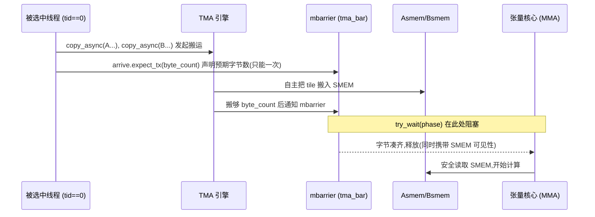
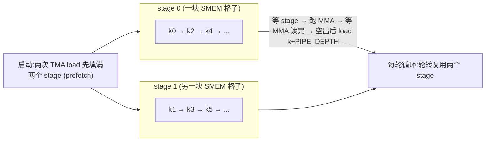

# 第 12 章 · 用 TMA 为 GEMM 做流水线(Step 4–6)

> 原文:[Pipelining GEMM with TMA](https://mlc.ai/modern-gpu-programming-for-mlsys/chapter_gemm_async/index.html)

> **本章要点(TL;DR)**
>
> 别急,先把几个会反复出现的词用大白话过一遍,后面就不卡壳了:
> - **GEMM**:就是矩阵乘法(通用矩阵乘法的简称)。深度学习里绝大部分算力都花在矩阵乘上,所以它是当之无愧的主角。
> - **张量核心(Tensor Core)**:GPU 芯片上一块**专门做矩阵乘**的电路。它是整块芯片上最贵、最强的计算单元,理应一刻不停地转;让它空闲就是最大的浪费。
> - **线程(thread)**:GPU 干活的最小单位。和 CPU 不同,GPU 里有成千上万个线程同时跑,这正是它快的原因。
> - 把大矩阵切成小方块来算,每个小方块就叫一个 **tile(瓦片)**。这是上一章的核心招数。
>
> 好,正题:
> - 上一章写出的那个"算得对"的分块 GEMM,有个大毛病:最贵的张量核心**大部分时间在空等**。流程是——线程搬一块数据进来、张量核心算这块、线程再搬下一块、张量核心继续等……搬数据和算数据本来是两套不同的硬件、可以同时干,却被排成了一前一后的串行,白白浪费。
> - 本章不动数据本身怎么摆、算什么(tile、内存布局、数学全都不变),只改**什么时候做、由谁来指挥**。核心思想就一句话:**让一个硬件引擎跑在另一个引擎前面**(术语叫"异步交接"——一边还在算,另一边已经把下一批料备好了)。
> - **Step 4**:把"从大显存(GMEM,显卡上那块大内存)搬到片上小快内存(SMEM)"这件苦力活,从线程手里接过来,交给一个叫 **TMA** 的专用搬运硬件。线程只要喊一嗓子(发一条命令),剩下的 TMA 自己干。搬完没搬完,用一个叫 **mbarrier** 的"门闩"按搬了多少字节来判断。不过这一步**每次搬完还是傻等**,所以还没真正重叠起来。
> - **Step 5**:给 SMEM 准备**两块格子轮着用**(叫双缓冲 / 环形缓冲),这样"算当前块"的同时,"下一块"有地方提前搬进来(预取)。流水线的骨架就此搭好——但要注意,这一步主循环**还是先等算完、再发下一笔搬运**,真正两条线同时跑满,要等下一章 Step 7。
> - **Step 6**:把整个程序改成**持久化(persistent)**形态:不再"算一块就开一批新线程",而是固定养一池线程组,让每个线程组**连着啃好几个 tile**。好处是省掉反复开张的开销,还能挑一个聪明的处理顺序,让数据赖在缓存里被反复利用。

> **前置知识**:读这一章前,最好先懂第 11 章那个分块 GEMM(把大矩阵切成小方块来算)。本章会反复用到这几个词:TMA(搬数据的专用硬件)、mbarrier(判断异步搬运完没完的"门闩")、双缓冲/流水线(让"搬数据"和"算数据"两条线错开、同时跑)。这些词第一次出现时我都会现场用大白话讲清楚,所以零基础也不用慌。如果连"线程""共享内存""warp"这些最基础的概念都还没概念,建议先翻一下 [第 0 章 · 极简入门](./ch00_gpu_ml_primer.md),再回头看第 11 章。

---

这一章属于「第三部分 · GEMM 实战(Step 1→9)」。上一章我们盯着一个问题:"算得对不对?"——结果对了就行。这一章换个问题:"算得满不满?"——也就是,那块最贵的计算硬件,有没有被喂饱、有没有一直在干活。说白了,就是别让最贵的那块硬件闲着。

读之前,先把终点记在心里。这三步,一步干一件事:

- Step 4:让一块**专门搬数据的硬件**(TMA)替线程去搬数据,把线程解放出来;
- Step 5:给数据准备**两块轮流用的格子**(双缓冲),这样下一块能提前搬进来;
- Step 6:把整个程序的启动方式重塑成**持久化**形态(下面会细讲什么叫持久化)。

这里有个点要先说清楚,免得你越读越晕:这三步从头到尾,数据**摆在哪、怎么摆**(也就是各种片上内存里的布局)**一行都没改过**。这里出现两个新名字:**TMEM**(张量内存,GPU 上一块专门存放矩阵乘"中间累加结果"的片上小内存),**寄存器**(register,每个线程私有的、速度最快的一点点存储——和 CPU 的寄存器是一个意思,只不过 GPU 里每个线程各有一份)。真正算新东西的,从头到尾就一个:**让不同硬件单元之间异步交接活儿**(一个干着,另一个提前把下一步备好)。剩下的全是老零件,只是换个用法。

## 为什么基础版 GEMM 在浪费时间

> **一句话先理解**:最贵的那块计算硬件(张量核心)本该一直转,可现在它一半时间在干等——因为"搬数据"和"算数据"被排成了一前一后,而它俩明明可以同时干。

先把问题摊开讲。前面说过,张量核心是整块芯片上**最贵的家伙**,理应一刻不停地转。可上一章那个写法本身没错的分块 GEMM,偏偏让它大半时间都在干等。

为什么?因为这个程序(GPU 上跑的这种程序习惯叫 **kernel(核函数)**,你就理解成"一段在 GPU 上跑的函数")是"一个一个轮着来"的:

1. 线程把一块 tile 从大显存搬进共享内存(SMEM,片上那块又小又快的内存,下面马上细讲);
2. 张量核心把这块嚼完;
3. 线程拷下一块;
4. 张量核心又在那儿等着。

每一步都得死等上一步收工才能动。可你仔细想想:**搬下一块 tile** 和 **算手里这块**,根本是两套不同的硬件在干(一个是搬运通路,一个是计算单元),它俩完全可以同时进行啊!现在却傻乎乎地排队,这就是浪费的根源。

要把这条缝补上,不用动任何数据通路——tile 怎么切、数据怎么摆、算什么,现成的全够用。要改的就两样:**什么时候做**,和**谁来调度**。

下面拿两张表对一对,看看"串着跑"和"我们想要的重叠跑"差在哪。表的读法:每一行是一个**硬件引擎**(搬运的 / 计算的),每一列是一个**时间步**(t0、t1……像秒表一格一格地走),格子里写的是那一刻这个引擎在干什么(`—` 表示它在空等):

**基础版(串行,轮流上场)**:

| 引擎 | t0 | t1 | t2 | t3 | t4 |
|------|----|----|----|----|----|
| 搬运(拷贝硬件) | load k0 | — | load k1 | — | load k2 |
| 计算(张量核心) | — | mma k0 | — | mma k1 | — |

看出来了吗?拷贝硬件干活的时候(t0、t2、t4),张量核心在歇;张量核心干活的时候(t1、t3),拷贝硬件又在歇。俩人从不一起上,各自都有一半时间空等。`load k0` 意思是"搬第 0 块",`mma k0` 意思是"算第 0 块"(mma 就是矩阵乘加,后面会讲)。

**理想版(重叠,各司其职)**:

| 引擎 | t0 | t1 | t2 | t3 | t4 |
|------|----|----|----|----|----|
| 搬运(拷贝硬件) | load k0 | load k1 | load k2 | load k3 | ... |
| 计算(张量核心) | — | mma k0 | mma k1 | mma k2 | ... |

看出区别了吗?搬运那一行**一刻不停**,在算 k0 的同一个时间步里,k1 已经在搬了。等张量核心算完 k0,k1 早就备好,马上接着算。张量核心几乎一直在转——这就是我们要的。

> **关键**:本章三步是**渐进**的,别指望一步到位。Step 4 把搬运交给硬件(但还是等);Step 5 搭出流水线骨架并预取(但还是等);真正"两条线同时跑满"的重叠,要到下一章 Step 7。那时会用一个叫 **warp 专门化(warp specialization)** 的手法——简单说就是"分工":让一拨线程专门搬数据(生产者),另一拨专门算(消费者),俩角色同时跑。本章先把地基打好。

> **注意**:从 Step 4 开始,所有例子都跑在完整规模 M=N=K=4096 的矩阵上(不再是前几步的小尺寸玩具例子)。端到端的计时数据统一放在下一章末尾的 *End-to-End Result* 表里。

---

## Step 4:TMA 异步 Load

### 这一步只改了"派发方式"

这一步就动一个地方:原来是线程一块一块**亲自**地搬(术语叫"同步拷贝",意思是线程得守着搬完才能干别的),现在换成 **TMA load**——让 TMA 硬件去搬。别的全不动。

原书用三个维度来描述每一步改了什么,这里先把这三个词解释清楚,后面每步都会用这张表:
- **Scope(范围)**:这活儿由多大一拨线程协同完成。这里会出现 **warpgroup** 这个词——它是 4 个 warp、共 128 个线程组成的一个班组(warp 是 32 个线程的小队,见第 0 章;先记住 warpgroup = 128 个线程一组就行)。
- **Layout(布局)**:数据在各级片上内存里怎么摆。
- **Dispatch(派发)**:活儿具体怎么发出去、由谁执行。

拿这张表对一下 Step 4 改了哪一维,一目了然:

| 维度 | Step 4 的状态 |
|------|---------------|
| **Scope(范围)** | 不变,仍是一个 warpgroup(128 线程) |
| **Layout(布局)** | 不变,同样的 SMEM / TMEM / 寄存器 tile |
| **Dispatch(派发)** | **变了**:从大显存搬到共享内存这件事,从"线程亲自同步搬"改为"交给 TMA 引擎搬" |

### 同步拷贝 vs. TMA 命令:执行模型的本质差别

> **一句话先理解**:同步拷贝是线程自己撸起袖子一趟趟搬,搬的全程被占着脱不开身;TMA 拷贝是线程喊一嗓子"搬这块!"就走人,真正搬运交给专用硬件后台去跑。

代码就改那么几行,可背后干活的方式**根本是两码事**。

- 同步的 `Tx.copy`(改之前用的):这活儿是 **CTA 里的线程亲自干的**(CTA 就是一组协同干活的线程,等同于"线程块 block";你可以理解成"一个工作小组")。算每个数据在内存里的地址、发出读写指令,全得线程一条条来,而且搬的整个过程线程都被占着,啥别的也干不了。
- TMA 拷贝(改之后):**只要一个线程发一条命令**,就完事走人。后面的搬运全归 TMA 这块专用硬件,它自己独立去跑。那些琐碎又费劲的事——算地址、把相邻线程的访问拼成一笔大传输(术语叫"合并访存 / coalescing")、为避开内存读写冲突而打乱数据摆放(术语叫 swizzle)——早就一次性写进了一份 **TMA 描述符(descriptor)**(你可以理解成一张"搬运说明书")里,TMA 引擎照着这张说明书做就行,不用线程操心。

两段代码摆一块儿,差别看得清清楚楚。

**改前(Step 3)**:128 个线程一起上手搬,搬完再用一句 `cta_sync`(意思是"全组线程在这里集合一下,确保大家都搬完了")让写进 SMEM 的数据对所有线程都可见:

```python
Tx.cta.copy(Asmem[:, :], A[m_st:m_st+BLK_M, i*BLK_K:(i+1)*BLK_K])   # 全部 128 线程一起搬 A 的一块
Tx.cta.copy(Bsmem[:, :], B[n_st:n_st+BLK_N, i*BLK_K:(i+1)*BLK_K])   # 再一起搬 B 的一块
T.cuda.cta_sync()                                                   # 全组集合:确认都搬完、数据都可见
```

**改后(Step 4)**:只挑一个线程发起 TMA load,至于硬件搬完没搬完,交给一个叫 mbarrier 的"门闩"去盯着:

```python
tid = warp_id * 32 + lane_id                 # 算出"我是这 128 个线程里的第几个"(0..127)
if tid == 0:  # 只让第 0 号那一个线程来启动 TMA
    Tx.copy_async(Asmem, A[...], dispatch="tma")          # 喊一嗓子:把 A 的这块搬进来(交给 TMA)
    Tx.copy_async(Bsmem, B[...], dispatch="tma")          # 同样,把 B 的这块搬进来
    T.ptx.mbarrier.arrive.expect_tx(tma_bar, byte_count)  # 告诉门闩:这次预计要搬进来这么多字节
T.ptx.mbarrier.try_wait(tma_bar, phase)                  # 算之前先在门闩这儿等:字节没凑齐就不放行
```

这里出现了几个 GPU 专用的"咒语",逐个说一下:`copy_async` 是"发起一笔异步搬运"(异步 = 发出去就不管了,后台自己跑);`dispatch="tma"` 是指定"这笔搬运走 TMA 硬件";`mbarrier` 这套(`arrive.expect_tx` / `try_wait`)就是那个门闩的用法,下面专门讲。

### 为什么是 `tid == 0`,而不是 `elect_sync()`?

这是这一步最容易栽跟头的地方。GPU 里"从一群线程中挑出一个代表来干某件事"是很常见的操作,通常有个现成的 intrinsic(intrinsic 就是编译器内置的特殊小函数)叫 `elect_sync()`。乍一看,挑线程嘛,用哪种写法不都一样?真不一样。

问题出在"它到底挑出了几个"。`elect.sync` 是**每个 warp 各挑一个**活跃 lane(lane 就是 warp 内线程的编号,0–31;你把它理解成"warp 里的第几号位"就行)。可一个 warpgroup 里有 4 个 warp,于是 `elect_sync()` 一下子挑出了**4 个线程**,这 4 个全冲进了 load 协议。

坏就坏在这。TMA 协议要往 mbarrier 门闩里**报一个"预计搬多少字节"的数**,而这个数必须**不多不少、正正好好报一次**。现在 4 个线程各报一遍,门闩里的计数立马乱套——它以为要等 4 倍的字节,于是 `wait` 永远等不到那个正确的"放行点"。更阴的是,这是个**不声不响的正确性 bug**:程序照跑、不崩溃,就是悄悄给你算出错误结果。这种 bug 最难查。

所以对的做法是:用 warpgroup 内的全局编号,精准点中**唯一一个**线程——也就是 `tid == 0`(第 0 号线程)。

> **关键**:示意图里写的"Elected Thread(被选中的线程)"指的是启动 TMA 的那**一个**线程,在我们代码里就是 `tid == 0`,**不是** `elect_sync()` 选出来的那批 lane。这俩名字像,可别混了。

### Load 完成怎么知道:mbarrier + 字节数握手

> **一句话先理解**:既然 TMA 是"发出去就走人、后台慢慢搬",那线程怎么知道数据到底搬完没有?靠一个叫 mbarrier 的门闩,它按"搬够了多少字节"来判断,够了才放行。

换成 TMA,其实一口气改了两件事:**谁来发起搬运**(这个看代码就懂),以及**怎么判断搬完了**(这件事最容易被忽略,可一错就是前面说的那种静默算错)。下面重点讲后一件。

- 还是用 `Tx.cta.copy`(线程亲自搬)的时候:大家一起搬,后面补一句 `cta_sync()`(全组集合)就够了——因为搬运是线程自己干的,集合了就说明都搬完了。
- 换成 TMA 之后,`cta_sync()` 就**不顶用了**。为什么?因为 `cta_sync()` 只会等"线程自己"干的活,只管线程写进 SMEM 的那些数据。可现在数据是 **TMA 后台**在搬的,`cta_sync()` 对这笔后台传输**压根不知情**——tile 还在半道上呢,它一看线程都没在搬东西,就乐呵呵地"集合完毕、放行"了。结果就是 MMA 拿着半截数据去算。

正确的修法,是把"搬完了"这件事用门闩**明明白白地盯住**:

1. 被选中的那个线程,先用 `arrive.expect_tx(total_bytes)` 告诉门闩:这回要等够这么多字节才算搬完。
2. TMA 引擎把这些字节实打实搬齐之后,会去"敲"一下门闩;门闩一看字节凑够了,对应的 `mbarrier.try_wait(phase)` 才放行。
3. **非得到放行这一步**,SMEM 里的 tile 才能交给 **MMA** 去算。MMA 是 matrix multiply-accumulate(矩阵乘加)的缩写——就是"两块小矩阵相乘、再累加到结果上"这个动作,正是张量核心专门干的那摊活。

下面这张图,把这套"发起搬运 → 报字节数 → TMA 后台搬 → 门闩放行 → 才开算"的握手流程画了出来。竖着的每一条线代表一个角色,横箭头代表"谁通知谁",从上往下就是时间顺序:



> **注意**:门闩放行这个动作本身就**自带了"数据已可见"的保证**,所以放行之后**不需要再额外补一道内存屏障(fence)**(fence 是一种"强制让所有线程看到最新数据"的同步指令)。这点在完整 kernel 的注释里也强调了。

### Store 侧:走同样硬件,但用另一套等待协议

前面讲的是把数据**搬进来**(load)。算完之后,还得把结果**搬回去**(store,即写回大显存)。store 也走 TMA 硬件,但它判断"搬完没"用的是**另一套**机制,脑子里千万别和 load 那套混了:

| | **Load 侧(搬进来)** | **Store 侧(搬回去)** |
|---|------------|--------------|
| 怎么判断搬完 | mbarrier 门闩 + 数字节 | commit group + wait group(提交一批、等一批) |
| 谁发起 | 一个线程 `copy_async(..., dispatch="tma")` | 一个线程 `copy_async(D[...], Dsmem, dispatch="tma")` |
| 怎么等 | `arrive.expect_tx` → `try_wait(phase)` | `commit_group()` → `wait_group(0)` |
| 在保护什么 | MMA 开算前,数据确实到齐了 | 上一笔回写没排空前,别急着复用那块暂存区 |

为什么 store 用另一套?因为 load 那套是"等够多少字节",而 store 更关心的是"我提交出去的这一批回写,排空了没"。它的写法是"先 `commit_group()` 提交这一批,再 `wait_group(0)` 等到没有未完成的批次为止"。

store 这边的流程是这样:线程先把 fp16(一种 16 位的半精度浮点数,占 2 字节,深度学习里常用它来省内存、提速)格式的结果写进一块叫 `Dsmem` 的共享内存暂存区,集合一下;然后挑一个线程启动 `Tx.copy_async(D[...], Dsmem, dispatch="tma")` 把它搬回大显存;最后用 `commit_group()` + `wait_group(0)` 卡在那儿,等这趟回写彻底走完。

**最后这一等,可不能省**。道理很简单:上一笔回写还没走完,`Dsmem` 这块暂存区就还占着呢,你要是急着拿它去装下一块结果,就会把还没搬走的数据给覆盖了。

> **Try with your agent(原书练习)**:为一个 K tile 追踪 Step 4 的 load/store 同步——哪个线程启动每条 TMA 命令、哪个 mbarrier 或 commit group 跟踪完成、哪个等待保护 MMA 读 `Asmem`/`Bsmem`、哪个等待保护 `Dsmem` 的复用?为什么这里 `elect_sync()` 是错误的线程选择?

### 完整 kernel 的结构与关键点

完整的 kernel,无非是把上面这套 TMA load/store 塞进 Step 3 的骨架里,别的地方一概不碰。下面不照抄那一长串源码(对零基础读者没意义),只挑出**真正扛着 TMA 语义的那几行**,逐行讲。

先看最外层的 K 循环。这里插一句背景:矩阵乘是沿着 K 这个维度一块一块累加的,所以要循环 `K_TILES` 次,每次算一块、累加到结果上。请特别留意这个循环里**每一轮都要等两次**(等搬完、等算完),所以这一步**还谈不上真正的重叠**:

```python
for k in range(K_TILES):                                     # 沿 K 方向一块一块地累加
    k_st = T.meta_var(k * BLK_K)                             # 算出当前这块在 K 方向的起始位置
    if tid == 0:
        tma_load(k_st)                                       # 第 0 号线程发起这块的 TMA 搬运
    T.ptx.mbarrier.try_wait(tma_bar.ptr_to([0]), phase_tma)  # 卡住等:数据搬完了吗?(放行即说明 SMEM 可读)
    if tid == 0:
        mma(accum=k != 0)                                    # 第 0 号线程发起矩阵乘加(第一块 k==0 时不累加,直接写)
    T.ptx.mbarrier.try_wait(mma_bar.ptr_to([0]), phase_mma)  # 卡住等:算完了吗?
    phase_tma ^= 1                                           # 翻转门闩的"相位"(下一段细讲它是干嘛的)
    phase_mma ^= 1
```

这里出现一个新东西:`phase`(相位)和 `^= 1`(异或翻转,效果就是在 0 和 1 之间来回切)。先简单理解:同一个门闩会被反复使用,它需要一个 0/1 的标记来区分"这是第几轮的放行",不然分不清等的是这一轮还是上一轮。Step 5 会把相位讲透,这里先放着。

接着看那两个 `@T.inline` 辅助函数(`@T.inline` 是个装饰器,意思是"编译时把这个小函数的代码直接展开、塞进调用处",所以它能直接用周围 kernel 里的变量,不用传参)。先看 `tma_load`,它发两条搬运命令,再顺手把"预计搬多少字节"报给门闩:

```python
@T.inline
def tma_load(k_st):
    tma_config = T.meta_var({"dispatch": "tma", "cta_group": 1,    # 一份"搬运配置":走 TMA、用哪个门闩
                             "mbar": tma_bar.ptr_to([0])})
    Tx.copy_async(Asmem[:, :], A[m_st:m_st+BLK_M, k_st:k_st+BLK_K], **tma_config)  # 搬 A 的这块
    Tx.copy_async(Bsmem[:, :], B[n_st:n_st+BLK_N, k_st:k_st+BLK_K], **tma_config)  # 搬 B 的这块
    T.ptx.mbarrier.arrive.expect_tx(
        tma_bar.ptr_to([0]),
        (BLK_M * BLK_K + BLK_N * BLK_K) * F16_SIZE)  # 告诉门闩:这次 A、B 两块加起来要搬这么多字节
```

逐行说:`tma_config` 是把"走 TMA、用 `tma_bar` 这个门闩"打包成一份配置;两条 `copy_async` 分别搬 A、B 的当前块;最后一行算出 A、B 两块加起来的总字节数(块的行×列×每个数的字节数),报给门闩——门闩就靠这个数判断"搬够了没"。

整段 kernel 里,真正扛着 TMA 语义的就**五个点**。把这五个记住,这一步也就拿下了:

1. **TMA 配置**:`{"dispatch": "tma", ...}`——告诉 `copy_async`"走 TMA 硬件",并指定用哪个门闩汇报完成。
2. **字节数**:`(BLK_M * BLK_K + BLK_N * BLK_K) * 2`——A、B 两块输入(operand,即"操作数",参与运算的输入数据)加起来的字节数(乘 2 是因为 fp16 每个数占 2 字节),喂给门闩当作"要等够的量"。
3. **门闩初始化**:`init(tma_bar.ptr_to([0]), 1)`——用之前先把门闩立起来(参数 1 表示"等 1 个到达信号"就放行)。
4. **`@T.inline`**:`tma_load(...)` 和 `mma(...)` 是辅助小函数,编译时展开进主体,所以能直接用周围的变量。
5. **store 同步**:epilogue(收尾阶段,指 K 循环算完后把结果写回的那段代码)先把 fp16 结果写进 `Dsmem`,用 `fence.proxy_async` 和 `warpgroup_sync` 这两道同步把线程的写入和 TMA 回写通路对齐(确保 TMA 读到的是写好的数据),再用 `commit_group()` / `wait_group(0)` 等回写跑完。

> **关键**:Step 4 的提速**不是靠重叠**(它每搬完一块还在傻等)。提速纯粹来自**换了搬运方式**:TMA 接管了大块数据的批量传输,把线程从"一条条指令吭哧吭哧搬数据"里彻底解放出来。光这一项,性能就往前挪了一截。一句话——把搬运这件苦差事从"必经之路"上拿掉,就是 Step 4 的全部价值。

所以眼下的局面是:**零件配好了,节奏还没踩上**。搬运和计算还是一个接一个轮着来。下一步,TMA 这套搬运通路一个字都不动,我们只去重新排时间表。

---

## Step 5:软件流水线(PIPE_DEPTH=2)

### 为什么 Step 4 没法重叠?瓶颈在"存储"

> **一句话先理解**:两个引擎想同时干,可手头只有一块格子放数据——正算着的那块占着,新数据没地方搬进来。解法就是多备一块格子。

两个引擎明明各干各的、互不相干,Step 4 怎么就是重叠不起来?卡点不在硬件,在**没地方放数据**。

你想象一下:手头只有一对 SMEM 格子(一块放 A、一块放 B)。下一块数据想提前搬进来,可它**没地方落脚**——当前的 MMA 还在读这对格子呢,你这会儿往里搬,就把人家正用着的数据给覆盖了。说白了,就是缺第二块空地。

Step 5 的招就是**双缓冲(double buffering)**:多准备一块格子。这个名字你大概率熟——和图形界面里"一块屏幕在显示、另一块在后台画"是一个道理。这边也一样:一块格子在被 MMA 读(算着),另一块格子同时被 TMA 写(搬下一块),互不打架。

不过有句话得先说在前头,免得你期望过高:这一步单 warpgroup 的主循环**还是先等当前这块算完、再发下一笔搬运**,并没有真正同时跑。区别只在于:现在有了"两块分开的格子",可以**预取**(提前把下一块先搬着)、可以轮着复用了。真正的同时跑,留给 Step 7。

| 维度 | Step 5 的状态 |
|------|---------------|
| **Scope** | 不变,仍是一个 warpgroup |
| **Layout** | **变了**:原来一对 SMEM 格子,现在变成 `PIPE_DEPTH` 块格子组成的**环形缓冲(ring buffer)**——就是几块格子排成一圈、用完一块转到下一块、转完一圈再回到开头,像跑道一样循环利用 |
| **Dispatch** | 不变,仍是 TMA load + `tcgen05` MMA(`tcgen05` 是 Blackwell——NVIDIA 较新一代 GPU 架构——这一代张量核心专用的矩阵乘加指令族;它算出的累加器,即"逐块往上累加的中间结果",存在前面提到的 TMEM 里);本步只加了预取和格子轮换,真正的完整重叠仍留给 Step 7 |

### 流水线骨架长什么样

`PIPE_DEPTH=2` 说白了就是:开 2 个 SMEM **stage(阶段 / 格子位)**,让"搬数据"和"算数据"各有各的格子用,不再抢同一块。(stage 在这里你就理解成"环形缓冲里的一个槽位、一块格子"。)

下面这张图,画的是**双缓冲想撑起的那套理想流水线结构**(PIPE_DEPTH=2),注意它**不是**这个单 warpgroup kernel 真实跑起来的样子。别会错意——这一步只是先把"两块格子轮换 + 预取"的架子搭出来,真要两条线跑满重叠,得等 Step 7。图里每个 stage 就是一块 SMEM 格子,各个 K tile 轮着用它:



> **注意**:这还**不是**并发的 TMA/MMA 时间表;它只是建立了环形缓冲结构,Step 7 会把这个结构**拆成生产者/消费者两个角色**,届时 TMA 和 MMA 才真正同时跑。

### 相对 Step 4 的四处改动

Step 5 的代码跟 Step 4 比,就差这四处(都是为了"多一块格子轮着用"服务的):

1. 存放 A、B 的 `Asmem` / `Bsmem` 前头多加了一个 **`PIPE_DEPTH` 维度**——相当于从"一块格子"变成"一排 `PIPE_DEPTH` 块格子",每个 stage 各占一块。
2. 门闩 `tma_bar` 从一个变成**一个数组**:一个 stage 配一个门闩(因为现在有好几块格子同时在被搬,得分别盯着)。
3. 主 K 循环开跑**之前**,先把头两个 stage 提前**预取**好,这样循环一开始就有现成数据可算。
4. K 循环里用 `stage = k % PIPE_DEPTH` 来轮转选格子(`%` 是取余,2 块格子时结果就是 0、1、0、1……循环):等当前 stage 备好 → 在它上面算 MMA → 再把这块刚算完的格子拿去搬 `k + PIPE_DEPTH`(也就是"再往后 PIPE_DEPTH 块"的那块)。

### 流水线机制三件套

> 下面三段都是**示意伪代码**,只为把机制讲清楚(为了读着清爽,`if tid == 0` 守卫和 `try_wait` 的完整写法都略掉了);带守卫的真实版本,看后面"完整 kernel"那一节。

**(1)预取(Prefetch)**:主循环还没开跑,先把头 `PIPE_DEPTH` 块格子都搬满,这样循环第一轮一上来,就有现成数据可算,不用干等:

```python
for s in range(min(PIPE_DEPTH, K_TILES)):   # 头 PIPE_DEPTH 块(若总块数更少,就按总块数)
    tma_load(s, s * BLK_K)                   # 把第 s 块搬进第 s 个 stage
```

**(2)主循环**:每个 K tile,先等它所在的格子备好、在上面把 MMA 算了;然后趁这块格子刚腾空,**马上**拿去搬"再往后 `PIPE_DEPTH` 块"的那块——这一手就是让搬运提前跑、为重叠埋伏笔:

```python
stage = k % PIPE_DEPTH            # 这一轮用哪块格子(0、1 轮流)
wait(tma_bar[stage], phase_tma)   # 等这块格子的数据搬完
mma(stage, accum)                 # 在这块格子上做矩阵乘加
wait(mma_bar[0], phase_mma)       # 等这块算完(MMA 读完了,格子可以腾出来了)
phase_mma ^= 1
tma_load(stage, next_k * BLK_K)   # 把刚腾空的格子,拿去搬更后面的那块(预取)
```

**(3)相位管理(Phase management)**:这块最容易把人绊倒,先把"相位"是啥说清楚。

> **一句话先理解**:同一个门闩会被反复使用,它靠一个 0/1 的标记(相位)来区分"这是第几轮的放行"。轮到它再次被用之前,就得把这个标记翻一下(0→1 或 1→0),否则它分不清你等的是新这一轮还是上一轮,可能直接误放行。

为什么需要它?因为门闩是循环复用的。同一个门闩,第一轮、第二轮……都在用它。如果不做个区分,`try_wait` 就没法判断"现在该等的,到底是这一轮搬的数据,还是上一轮残留的状态"。相位就是那个区分标记。

规则其实就一句话——**一个门闩多久翻一次相位,全看它隔多久才被再次用到**。我们这两个门闩正好一对照:

- **`mma_bar`(就一个门闩)**:MMA 的累加器只占一个 TMEM 槽位,所以算完这件事只需要一个门闩,**每一轮都会用到它**。每轮都用到 → 当然**每轮都得翻一次相位**:

  ```python
  phase_mma ^= 1   # 每轮都翻
  ```

- **`tma_bar`(是个数组,PIPE_DEPTH 个)**:每块格子配一个门闩。某一块格子的那个门闩,得等环形缓冲**转完一整圈**、重新轮回到这块格子时,才会被再次用到。所以 `phase_tma` **只在格子下标绕回起点(转完一圈)的那一下**翻一次:

  ```python
  if stage == PIPE_DEPTH - 1:   # 走到最后一块格子 = 一圈快转完了
      phase_tma ^= 1            # 这时才翻一次
  ```

> **关键**:记住这条规律——**门闩多久被再次用到,相位就多久翻一次**。`mma_bar` 每轮都用 → 每轮翻;`tma_bar[stage]` 每 `PIPE_DEPTH` 轮才轮回到同一个 → 转完一圈才翻。这是 mbarrier 相位机制最直接的推论。

> **Try with your agent(原书练习)**:取 `PIPE_DEPTH=2`、`K_TILES=5`,逐 `k` 追踪主循环——列出每轮的 `stage`、传给 `try_wait` 的 `phase_tma`/`phase_mma`、以及是否发出新的预取。`phase_tma` 究竟在哪里翻?为什么最后两轮没有预取?(提示:`next_k = k + PIPE_DEPTH < K_TILES` 不成立时就不再预取。)

### 完整 kernel:关键差异

完整 kernel 把 Step 4 那条 TMA load/store 通路**原封不动地留着**,外面只是又裹了一层"多块格子 + 相位"的逻辑。结构上的不同就集中在三处,下面各挑几行最能说明问题的。

第一处,双缓冲的内存布局——给 A、B 各加一个 stage 维度(就是"从一块格子变一排格子"):

```python
PIPE_DEPTH = 2
A_layout = tma_shared_layout(a_type, SwizzleMode.SWIZZLE_128B_ATOM,
                             (PIPE_DEPTH, BLK_M, BLK_K))   # 形状最前面多了个 PIPE_DEPTH:一排格子
B_layout = tma_shared_layout(b_type, SwizzleMode.SWIZZLE_128B_ATOM,
                             (PIPE_DEPTH, BLK_N, BLK_K))
```

(`SwizzleMode.SWIZZLE_128B_ATOM` 是前面提过的 swizzle——为避开内存读写冲突而定的数据摆放方式,这里照搬即可,不用深究。)

第二处,门闩初始化——算的那个门闩只要 1 个,搬的那个每块格子配 1 个:

```python
if warp_id == 0 and lane_id == 0:                          # 只让一个线程来做初始化
    T.ptx.mbarrier.init(mma_bar.ptr_to([0]), 1)            # 算完用的门闩:就 1 个
    for s in range(PIPE_DEPTH):
        T.ptx.mbarrier.init(tma_bar.ptr_to([s]), 1)        # 搬完用的门闩:每块格子 1 个
```

第三处,主循环里比 Step 4 多了"顺手发下一笔预取"和"转完一圈才翻 phase_tma"两步:

```python
for k in range(K_TILES):
    stage = k % PIPE_DEPTH                                       # 这轮用哪块格子
    T.ptx.mbarrier.try_wait(tma_bar.ptr_to([stage]), phase_tma)  # 等这块格子搬完
    if tid == 0:
        mma(stage, accum=(k != 0))                              # 在这块格子上算(第一块不累加)
    T.ptx.mbarrier.try_wait(mma_bar.ptr_to([0]), phase_mma)     # 等算完
    phase_mma ^= 1                                              # 算的门闩每轮都翻
    next_k = k + PIPE_DEPTH                                      # 想预取的那块
    if next_k < K_TILES:                                        # 没越界才预取(最后两轮没得预取了)
        if tid == 0:
            tma_load(stage, next_k * BLK_K)                     # 把刚腾空的格子拿去搬后面那块
    if stage == PIPE_DEPTH - 1:                                 # 转完一圈
        phase_tma ^= 1                                          # 搬的门闩绕圈才翻
```

epilogue(算完后:TMEM 里的结果 → 寄存器 → `Dsmem` 暂存 → TMA 搬 → 大显存)跟 Step 4 一模一样,这里就不再展开了。

---

## Step 6:持久化 kernel + tile 调度器

### 从"优化单 tile 内"到"优化跨 tile"

> **一句话先理解**:前面都在抠"算一块 tile"内部怎么快;Step 6 拉远镜头,管的是"一个个 tile 之间"——少开张几次、挑个好顺序,把整体开销摊薄。

前面那些功夫,都花在优化**单个 tile 内部**的活儿上。Step 6 把镜头往后一拉,换了个尺度看——**跨 tile 优化**。

先回顾 Step 5 怎么干的:每算一个 128×128 的输出 tile,就开一个 CTA(还记得吗,CTA 就是一组协同干活的线程,等同 block)。对 4096×4096 的输出,要算 **1024 个 tile**,那就是开 **1024 个互不相干的 CTA**,一个接一个开张、干完一块就**直接解散、消失**。问题是:每个 CTA 一开张都得做一堆准备工作(分配内存、立门闩等),开 1024 次就把这套准备重复了 1024 遍,纯属浪费。

Step 6 换个活法:不再"算一块开一批",而是**一开始就固定养一池 CTA**,让每个 CTA 留着不走、轮着去啃**好几个** tile。这么一来,能换两样好处:

1. **摊薄开张开销**:分配 TMEM、初始化门闩、准备调度器状态这些准备工作,原来在 1024 个一次性 CTA 上要重复 1024 遍,现在每个常驻 CTA 只做一次,这一次的成本摊到它经手的大约 7 个 tile 上,平均下来就便宜多了。
2. **更聪明的处理顺序**:既然"哪个 CTA 算哪个 tile"现在由程序内部决定了(而不是一股脑全交给硬件随机分),就能特意挑一个**让数据能被反复利用**的顺序来跑(下面细讲)。

| 维度 | Step 6 的状态 |
|------|---------------|
| **Scope** | **变了**:固定养一池常驻 CTA,每个 CTA 靠一个调度器循环处理多个输出 tile |
| **Layout** | 不变,每个 tile 内部的 SMEM/TMEM/寄存器通路照旧 |
| **Dispatch** | 不变 |

### 持久化调度:grid 大小贴合硬件,而非问题

先解释两个词。**grid(网格)**:启动一个 kernel 时,你要告诉 GPU"总共开多少个 CTA",这一大坨 CTA 整体就叫 grid。**SM(流多处理器)**:GPU 内部的计算核心,一块 GPU 上有很多个 SM,每个 SM 同时只能容纳有限的 CTA(详见第 0 章)。

> **一句话先理解**:以前"有多少个 tile 就开多少个 CTA"(grid 大小跟着问题走);持久化反过来——"GPU 有多少个 SM 就开多少个 CTA"(grid 大小跟着硬件走),开出来的 CTA 不解散,循环去领新 tile。

持久化 kernel 的核心想法,一句话:**grid 开多大,看硬件有多少 SM,而不看问题有多少 tile**。

换句话说,它就开 `SM_COUNT` 个 CTA(大致一个 SM 配一个),不管你输出 tile 总共多少个。图的就是一件事:让每个 SM 手里始终有活干,别让它空着。

> **注意**:这里说"大致"是有讲究的——精确的"一个 SM 正好驻一个 CTA"**没人保证**,具体还得看占用率(occupancy,即一个 SM 实际能同时塞下多少 CTA),以及硬件怎么调度。

这一章的目标硬件是 NVIDIA B200,它有 `SM_COUNT=148` 个 SM。于是就开 148 个 CTA,各自循环去处理一个叫 `ClusterPersistentScheduler2D` 的调度器派给它的那些 tile。

第二个好处,来自调度器挑的那个**处理顺序**。这里把 `l2_group_size` 设成 8,意思是"把相邻的 8 个 tile 凑成一组、一个挨一个地处理"。为什么这样能省?看下面这张输出 tile 的网格图(行 = M 方向,列 = N 方向),每格是一个 128×128 的输出 tile:

| M 方向 ＼ N 方向 | N=0 | N=1 | N=2 | N=3 |
|---|---|---|---|---|
| **M=0** | T0 | T1 | T2 | T3 |
| **M=1** | T4 | T5 | T6 | T7 |

表里的复用关系很清楚:**同一行**(同一个 M)上的那几个 tile,算的时候用的都是 A 矩阵的同一份行块;**同一列**(同一个 N)上的,用的都是 B 矩阵的同一份块。换句话说,挨着的 tile 之间,输入数据是大量重叠的。

道理就在这儿。这里要引入 **L2** 和 **HBM** 两个词:HBM 是显卡上那块大显存(就是前面说的 GMEM,容量大但相对慢),L2 是一块容量小、但快得多的**缓存**(数据从 HBM 拉一次后会暂存在 L2,下次再用就能就近拿、不必再跑去 HBM)。既然挨着的 tile 共用大量输入,那把这些"沾亲带故"的 tile 一个挨一个地处理,它们共用的那份输入就能**一直赖在 L2 缓存里**,后面的 tile 直接从 L2 拿,不用一趟趟跑回慢吞吞的 HBM 重新拉。这就是 `l2_group_size=8` 想榨取的红利——它在 Step 3 时其实就摆在桌面上了,只是当时没顺手吃掉。

接进调度器,几行就够:

```python
bx = T.cta_id([SM_COUNT])   # 开一维 grid:一个 CTA 配一个 SM(不再像以前按 tile 数开二维 grid)

tile_scheduler = ClusterPersistentScheduler2D(   # 创建调度器:由它来分派 tile
    "ts",
    num_m_tiles=M // BLK_M,   # M 方向有多少个 tile
    num_n_tiles=N // BLK_N,   # N 方向有多少个 tile
    l2_group_size=8,          # 把相邻 8 个 tile 凑成一组、连着处理(为了 L2 复用)
    num_clusters=SM_COUNT)
tile_scheduler.init(bx)       # 用本 CTA 的编号 bx 初始化调度器(告诉它"我是谁")
```

### 一个容易漏掉的正确性后果:相位初始化要进循环

一个 CTA 现在要循环啃好几个 tile,这就牵出一个**特别容易漏的坑**,还是个静默 bug。每个 tile 都要重新跑一遍自己**全新的 K 循环**,而前面讲过,门闩的相位必须**从一个干净、已知的状态(0)起步**,否则 `try_wait` 会判断错。

- Step 5 里,一个 CTA 只管一个 tile,所以 `phase_tma`、`phase_mma` 在最开头初始化一次就完事,没毛病。
- 到了 Step 6 就不行了:如果还放在最外面只初始化一次,那么第 2 个 tile 一开始,接手的就是**上一个 tile 留下的相位残值**,节奏立马错位。所以这俩初始化必须**挪进 `while tile_scheduler.valid()` 这个 tile 循环里头**,让每个 tile 都从 0 重新起步。

```python
while tile_scheduler.valid():       # 只要调度器还有 tile 派给我,就继续
    phase_tma: T.int32 = 0          # 每个 tile 都把相位清零重来
    phase_mma: T.int32 = 0
    ...                             # 这里是和 Step 5 一样的那套 K 循环
    tile_scheduler.next_tile()      # 这个 tile 处理完,跟调度器要下一个
```

(`tile_scheduler.valid()` 是问调度器"还有没有派给我的 tile";`next_tile()` 是"我这块干完了,给我下一块"。)

### 完整 kernel:结构上就是 Step 5 套了个外层 tile 循环

从结构上讲,Step 6 不过是把 Step 5 那整条流水线**整个套进一个 tile 级的外层循环**罢了。新加的依赖就一个——调度器本身:

```python
from tvm.tirx.lang.tile_scheduler import ClusterPersistentScheduler2D
```

骨架长这样(内层那个 K 循环跟 Step 5 一字不差,不再展开):

```python
SM_COUNT = 148   # NVIDIA B200 的 SM 数量

# ... 这里是和 Step 5 一样的 SMEM/门闩/TMEM 初始化,但注意:每个 CTA 只做这一次 ...

while tile_scheduler.valid():                            # 外层:只要还有 tile 派给我就接着干
    m_st = T.meta_var(tile_scheduler.m_idx * BLK_M)      # 当前要算哪个 tile,由调度器告诉我(行位置)
    n_st = T.meta_var(tile_scheduler.n_idx * BLK_N)      # (列位置)
    phase_tma: T.int32 = 0                               # 每个 tile 把相位清零(上面讲过的坑)
    phase_mma: T.int32 = 0
    # === 内层:和 Step 5 完全一样的那套流水线 ===
    #   预取头 PIPE_DEPTH 块 → K 循环(等→算→等→预取→绕圈翻相位)→ epilogue 写回
    T.cuda.cta_sync()                                    # 这个 tile 收尾,全组集合一下
    tile_scheduler.next_tile()                           # 跟调度器要下一个 tile

# 注意:TMEM 的释放放在整个 while 循环结束之后(每个 CTA 只释放这一次)
```

> **关键**:注意 TMEM 的分配 / 释放(`alloc`/`dealloc`)都在**整个 while 循环之外**——它们跟着 CTA 的整段生命周期走,只在最开头分配一次、最末尾释放一次,绝不在每个 tile 上重做。这正是前面说的"摊薄开张开销"落到代码上的样子。

---

## 练习(原书 Exercises)

1. **Step 4**:`arrive.expect_tx` 用的字节数是 `(BLK_M * BLK_K + BLK_N * BLK_K) * 2`。如果这个字节数**偏小或偏大**,mbarrier 会等什么?(思路:偏小则字节没凑齐它就提前释放,MMA 读到不完整数据;偏大则永远凑不齐,`wait` 死等不放。)
2. **Step 5**:为什么每个 SMEM stage 需要**自己的** TMA barrier,而不能两个 stage 共用一个 `tma_bar`?(思路:两个 stage 的 load 在途时间不同,共用会让"哪个 stage 好了"分不清,相位语义也会乱。)
3. **Step 6**:4096×4096 输出、`BLK_M=BLK_N=128`,有多少个输出 tile?`SM_COUNT=148` 时每个持久化 CTA 平均处理几个?(算一下:每边 4096/128 = 32 个,共 32×32 = **1024** 个 tile;1024/148 ≈ **6.9**,即平均约 7 个。)

---

## 小结

这一章的主线就一句话:**让一个硬件引擎跑在另一个前头**。下面三步,就是把这句话一点点落到地上的过程:

| 步骤 | 改的维度 | 核心动作 | 是否真重叠 |
|------|---------|---------|-----------|
| **Step 4** | Dispatch | 同步拷贝 → TMA 命令;mbarrier+字节数跟踪 load,commit/wait group 跟踪 store | 否(每 load 后仍等);提速来自把搬运移出关键路径 |
| **Step 5** | Layout | SMEM 双缓冲(PIPE_DEPTH=2 环形缓冲)+ 预取;相位翻转节奏 ∝ barrier 槽位数 | 否(单 warpgroup 仍等);搭好流水线骨架 |
| **Step 6** | Scope | 持久化 kernel(一 SM 一 CTA)+ tile 调度器;`l2_group_size` 控操作数 L2 复用;相位初始化进循环 | 否;摊薄启动开销 + 跨 tile 操作数复用 |

几条最该揣走的认知(都是上面讲过的,这里给你拎成一句话好记):

- **TMA 的价值有两层**:Step 4 先吃到的是"把搬数据这件苦力活从线程手里摘出去";至于真正的"搬和算同时跑"(重叠),那是后话(Step 7 的 warp 专门化)。
- **两套同步机制别串了**:搬进来(load)用门闩 mbarrier + `expect_tx` 报字节数;搬回去(store)用 commit group + wait group。拿 `cta_sync()`(全组集合)去等 TMA load,是个不声不响的错——因为它根本不知道后台还有 TMA 在搬。
- **挑线程发命令用 `tid == 0`,别用 `elect_sync()`**:后者每个 warp 各挑一个、一共挑出 4 个,4 个线程会把字节数重复报 4 遍,直接把门闩计数搞坏,静默算错。
- **相位翻转记个口诀**:门闩每轮都被用到,就每轮翻(`mma_bar`);每转完一圈才被用到一次,就绕圈翻(`tma_bar[stage]`)。
- **持久化换来两份红利**:摊薄每个 tile 的开张成本,外加用聪明的 tile 顺序换来 L2 缓存复用;代价是相位初始化和预取都得搬进 tile 外层循环里头。

下一章(从 Step 7 起)会上 warp 专门化,把 TMA 和 MMA 拆成生产者、消费者两个角色。到那会儿,这一章搭好的这套环形缓冲,才真正两条线一起跑满。

---

## 延伸阅读

- 原文:[Pipelining GEMM with TMA — Modern GPU Programming for MLSys](https://mlc.ai/modern-gpu-programming-for-mlsys/chapter_gemm_async/index.html)
- 本章末尾提到的端到端计时,见下一章 *Scaling GEMM with Warp Specialization and Clusters* 的 *End-to-End Result* 表。

---

## 术语对照

| 中文 | English | 说明 |
|------|---------|------|
| 张量核心 | Tensor Core | 芯片上最贵、最该跑满的计算单元 |
| 共享内存 | SMEM (shared memory) | tile 在片上的落脚点 |
| 线程束 | warp | 32 个 lane 一组 |
| warpgroup | warpgroup | 4 个 warp 一组,共 128 线程 |
| 张量内存加速器 | TMA (Tensor Memory Accelerator) | 专门搬 GMEM↔SMEM tile 的硬件引擎 |
| 内存屏障 | mbarrier (memory barrier) | 用字节数/到达数跟踪异步完成 |
| 相位 | phase | mbarrier 的翻转位,区分轮次 |
| 双缓冲 | double buffering | PIPE_DEPTH=2 的两阶段环形缓冲 |
| 环形缓冲 | ring buffer | 多 stage 轮转复用的 SMEM 结构 |
| 预取 | prefetch | 主循环前先填满头几个 stage |
| 持久化 kernel | persistent kernel | grid 按硬件(SM 数)定,CTA 循环处理多 tile |
| tile 调度器 | tile scheduler | 在 kernel 内分配 tile 并挑复用友好的顺序 |
| warp 专门化 | warp specialization | 把 TMA/MMA 拆成生产者/消费者(Step 7,下一章) |
| 提交组 / 等待组 | commit group / wait group | TMA store 的完成跟踪机制 |
| 张量内存 | TMEM (tensor memory) | tcgen05 MMA 累加器所在的片上内存 |
