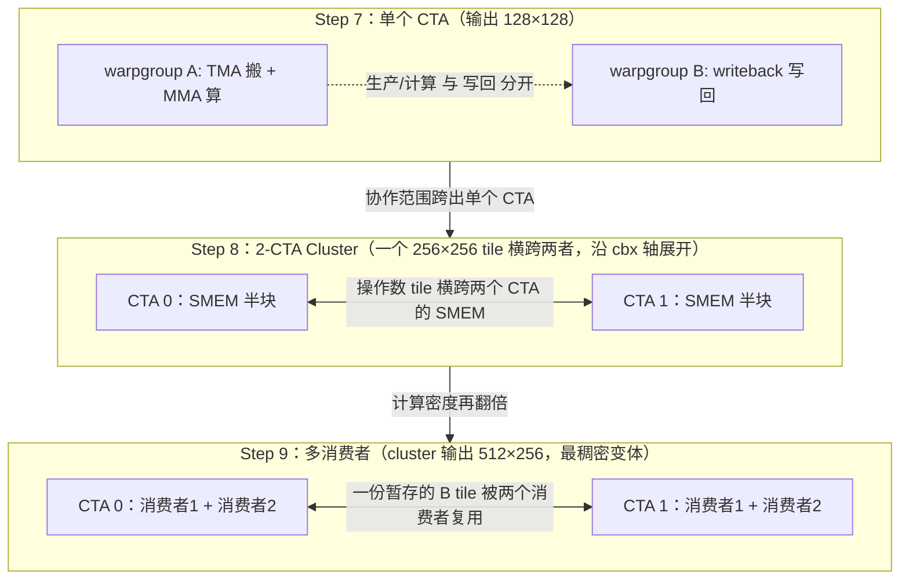
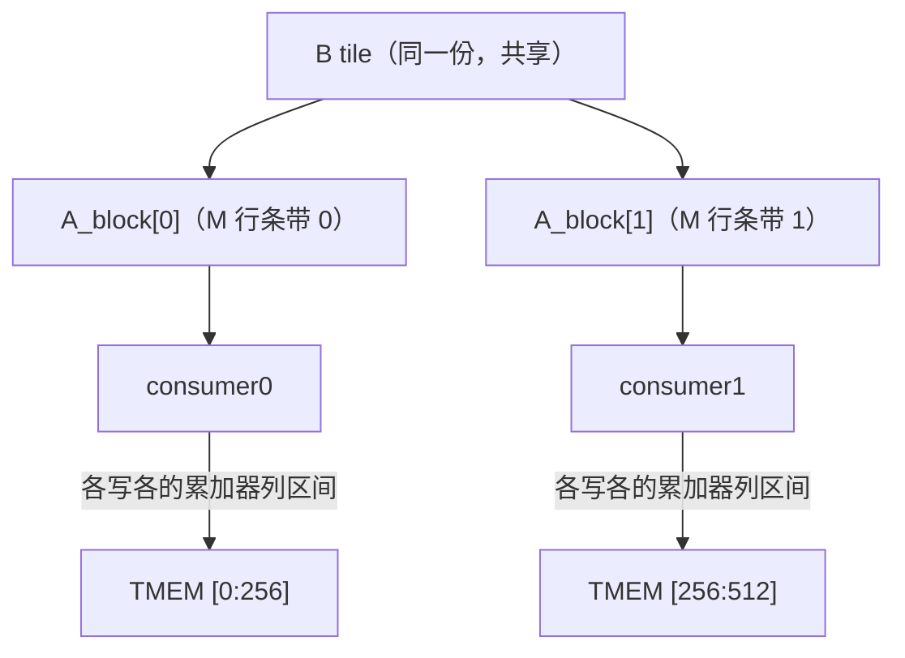
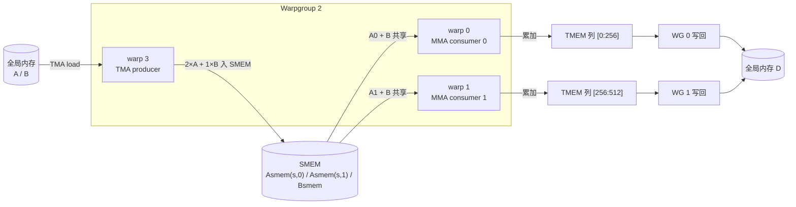
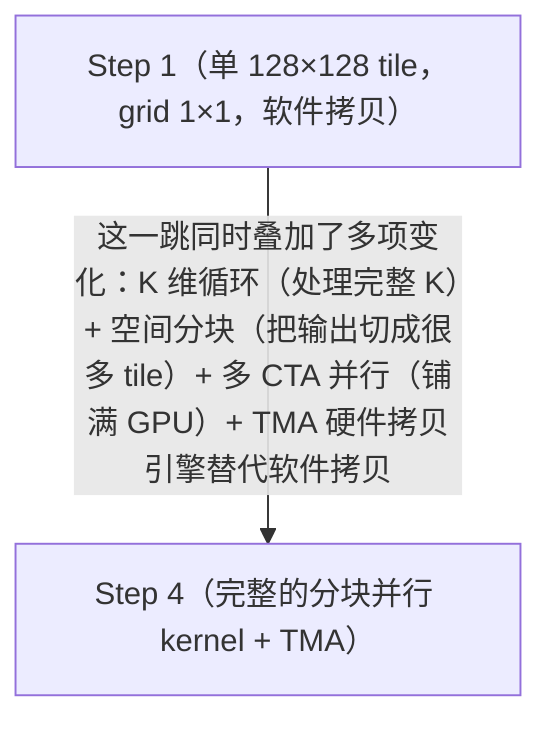
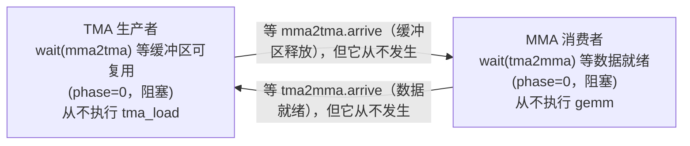
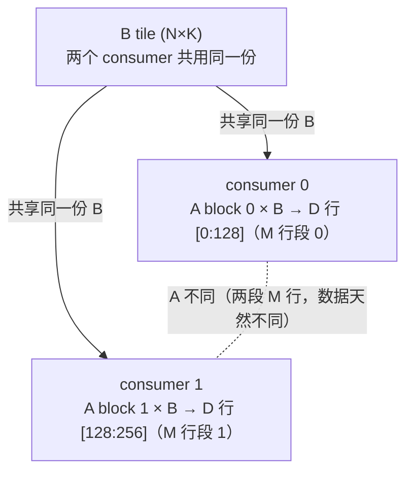

# 第 13 章 · 用 Warp 专门化与 Cluster 扩展 GEMM(Step 7–9)

> 原文:[用 Warp 专门化与 Cluster 扩展 GEMM(Step 7–9)](https://mlc.ai/modern-gpu-programming-for-mlsys/chapter_gemm_advanced/index.html)

> **本章要点(TL;DR)**
>
> - 上一章那个流水线 GEMM(矩阵乘法),还是把「加载 / 计算 / 写回」三件事全压在同一队线程(一个 warpgroup)身上,结果三个干活的硬件引擎(负责搬数据的 TMA、负责算矩阵乘的 Tensor Core、负责把结果写出去的写回路径)只能你忙我闲、轮流空转。本章用 Step 7–9 三步,一级一级把「谁跟谁协作」的范围撑大,一路逼近业界最高的吞吐。下面这些名词(warpgroup、TMA、Tensor Core……)正文里都会从零讲清楚,这里先囫囵看个大概就行。
> - **Step 7(Warp 专门化 + 流水线)**:把 warp 拆成 TMA 生产者 / MMA 消费者 / 写回三个并发角色,靠 4 个方向相反的 barrier(`tma2mma`、`mma2tma`、`mma2ld`、`ld2mma`)和 `PipelineState` 串起来;生产者和消费者的初始 phase 必须反着,否则不是死锁就是静默的数据损坏。
> - **Step 8(2-CTA Cluster)**:把两个 CTA 凑成 cluster,靠 DSMEM 跨 CTA 共享操作数,用一条 `cta_group=2` 的协同 MMA 算出 256×256 的 tile,把**算术强度大约翻一倍**——这是真收益,不是把活儿重分了一遍。
> - **Step 9(多消费者 Warp 专门化)**:再添一个 MMA 消费者,拿「不同的 A × 同一块 B」把每个 CTA 的计算密度翻倍,cluster 输出长到 512×256,是本教程里最稠密、最优的那个 GEMM 变体。
> - 三步**只改「谁协作」,不动「数据怎么摆」**:SMEM / TMEM / 寄存器布局都沿用前两章的契约。端到端从朴素的 70 ms 一路压到 0.094 ms(约 744×),跟 cuBLAS 打平;收益越往后越小,是逼近计算受限之后的边际递减。

> **前置知识**:这一章会用到一串 GPU 专有名词——warp(线程束)、warp 专门化、cluster(集群)、TMEM(Tensor Core 专用的累加器内存)、mbarrier/phase(屏障与相位)。别担心,**每个词第一次出现时,我都会当场用大白话给你讲明白「它是什么、为什么要有它」**,你不需要事先就懂。不过如果你想先建立一点点 GPU 的整体直觉(线程怎么并行、内存为什么分好几层、矩阵乘为什么是主角),花十分钟翻一下 [第 0 章 · 极简入门](./ch00_gpu_ml_primer.md) 会让这一章读起来更顺。本章直接接着第 11–12 章往下走(TMA 流水线、`tcgen05` MMA、TMEM 累加器这几样东西的「规矩」都是那两章定下的),但即使你没读过那两章,跟着本章的解释也能读懂。

## 引言:用 Warp 专门化与 Cluster 把 GEMM 推到极致(Scaling GEMM with Warp Specialization and Clusters)

### 上一章遗留的瓶颈:一个 warpgroup 包揽所有事

上一章我们用 TMA 把 GEMM 做成了流水线,跑得已经挺快了。可它骨子里有个毛病。

> **一句话先理解**:GPU 上干活的最小集体不是「一个线程」,而是一小撮线程绑在一起一起动;而真正负责干重活的「硬件引擎」就那么几种,关键是别让它们排队空等。

在动手之前,先把这几个词捋清楚——后面整章都靠它们:

- **线程(thread)**:跟你写后端代码时理解的线程一样,就是一条独立的执行流。GPU 的特别之处是它一次能跑成千上万条。
- **warp(线程束)**:GPU 不是一条线程一条线程地调度,而是**把 32 条线程捆成一束、让它们齐步走**——这一束就叫一个 warp。打个比方,就像 32 个人排成一个方阵,喊一个口令大家一起迈同一步。为什么要这么设计?因为这样硬件只需要为 32 条线程发一次指令,省下大量调度开销。
- **warpgroup**:再把 **4 个 warp(也就是 128 条线程)凑成一支更大的队伍**,叫一个 warpgroup。本章里它是「分配任务」的基本单位——我们会把不同的活派给不同的 warpgroup。

> **注意**:本章里 GPU 的硬件细节(比如 32、128 这些数字,还有下面要说的几种引擎)都按 NVIDIA 较新的架构来讲。你不用记数字,记住「线程 → 32 条凑成 warp → 4 个 warp 凑成 warpgroup」这个层级关系就够用了。

毛病出在哪?上一章那条流水线**从头到尾就只用了一个 warpgroup**(一支 128 线程的队伍),却要它一个人按顺序干完三件压根不是一回事的活——

1. **发起搬运(load,加载)**:把下一块要算的输入数据,从又大又慢的「全局内存」搬进又小又快的「共享内存」。这里有几个新词:
   - **tile(分块)**:整个大矩阵太大,塞不进快速内存,所以我们把它切成一个个小方块,一块一块地算。每个小方块就叫一个 tile。
   - **全局内存(GMEM,Global Memory)**:GPU 上容量最大、但访问最慢的那层内存,整个 GPU 共用,相当于「主存」。
   - **共享内存(SMEM,Shared Memory)**:容量小得多、但快得多的一层片上内存,**由程序员手动安排往里放什么**——你可以把它当成「一块需要你亲手管理的高速缓存」。为什么要先把数据搬进 SMEM 再算?因为直接从龟速的 GMEM 取数,算力会被活活饿死;先搬进近在咫尺的 SMEM,后面反复读才划算。
   - **TMA(张量内存加速器 / Tensor Memory Accelerator)**:一个**专门负责搬数据的硬件引擎**。它能在后台异步把一整块 tile 从 GMEM 搬到 SMEM,搬运期间线程不用守着、可以去干别的——这正是它存在的意义。
2. **跑矩阵乘(MMA,Matrix-Multiply-Accumulate,矩阵乘累加)**:在搬进来的这块数据上做矩阵乘法。
   - **Tensor Core**:一个**专做矩阵乘累加的硬件引擎**,一条指令就能算一小块矩阵乘,比用普通运算单元一格一格乘快几个数量级。GEMM 之所以能在 GPU 上飞起来,全靠它。
   - `tcgen05` 则是用来「指挥」Tensor Core 的那条指令的名字,后面会反复见到,你把它当成「发起一次矩阵乘」的命令就行。
3. **写回(writeback)**:把算好的结果搬出去,写回内存。
   - **TMEM(张量内存 / Tensor Memory)**:Tensor Core 专用的一小块「累加器内存」,矩阵乘的中间累加结果就攒在这里。算完一整块 tile 之后,得把 TMEM 里的结果「排空」——读出来、转成最终格式、再写回 GMEM。

就算用软件流水线把这三步在时间上稍微叠了一点,根子上的问题还在:**三种硬件引擎(TMA、Tensor Core、写回路径)全堵在同一队线程身上**。这队线程就成了三个引擎共用的独木桥,谁想干活都得排队过这队线程,自然谁也快不起来。

### 症状:引擎轮流空转

这瓶颈长啥样?把三个引擎的忙闲按时间步摆开,一眼就看明白了(行是引擎,列是时间步,`忙` 表示在干活,空白表示闲着):

| 引擎 | t0 | t1 | t2 | t3 | t4 | t5 |
| --- | --- | --- | --- | --- | --- | --- |
| TMA 单元 | 忙 |  |  | 忙 |  |  |
| Tensor Core |  | 忙 |  |  | 忙 |  |
| 写回路径 |  |  | 忙 |  |  | 忙 |

一队线程串着驱动三个引擎,任何时刻总有引擎在干等别人——三个永远凑不到同一拍上一起忙。

- Tensor Core 在算的时候,TMA 单元闲着;
- 结果往内存里排空的时候,轮到 Tensor Core 闲着;
- 每个引擎想动一下,都得隔着**同一组线程**去等别的引擎腾位置。

那怎么破?思路就一句话:**别再让一队线程包圆了所有活**。让不同的 warp 各管一摊,引擎之间才能真正同时转起来。

### 三步走:把「协作范围」一步步做大

这一章用三步,一点一点把「谁跟谁协作」的范围撑大。每一步都拆掉一个串行瓶颈,一路逼近业界最高的吞吐。

| 步骤 | 名称 | 做了什么 | 协作范围 | 输出 tile |
| --- | --- | --- | --- | --- |
| Step 7 | Warp 专门化 + 流水线 | 把 warp 划分成生产者 / 消费者 / 写回三种角色 | 单个 CTA 内部 | 128×128 |
| Step 8 | 2-CTA Cluster | 把两个 CTA 组成一个 cluster,跨彼此的 SMEM 共享操作数 | 跨 2 个 CTA | 256×256 |
| Step 9 | 多消费者 Warp 专门化 | 再加一个 MMA 消费者,让一份暂存 tile 喂两倍的算力 | 跨 2 个 CTA,双消费者 | 512×256 |

> **注意**:这里冒出两个新词,顺手讲明白:
> - **CTA(Cooperative Thread Array,协作线程数组)**:就是**一个线程块(thread block)**——一批线程的集合(本章里通常含 2~3 个 warpgroup),它们跑在同一个物理核心上、能共用同一块 SMEM。你可以把一个 CTA 理解成「被分配到一起、能共享高速内存的一支小分队」。
> - **cluster(集群)**:更上一层的结构,**把好几个 CTA 绑成一组**。它的特别本事是:让组里的 CTA 能**互相读对方的 SMEM**——本来每个 CTA 的 SMEM 是私有的,谁也碰不到别人的;cluster 打通了这堵墙。为什么需要它?后面 Step 8 你就会看到,两个 CTA 一旦能共享 SMEM,就能合伙算一块更大的 tile、把同一份数据复用给更多计算。

### 把三步看成同一个套路的不同尺度

要看懂这三步,最好的角度是:它们其实是**同一个套路,被一次次放大**而已。



- **Step 7**:整条流水线还窝在一个 CTA 里。TMA 和 MMA 合用一个 warpgroup,写回甩给另一个 warpgroup。这是角色分工里最小、最朴素的样子。
- **Step 8**:协作范围头一回**跨出单个 CTA**。两个 CTA 搭伙产出一个 256×256 的 tile,这块 tile 横跨它俩的 SMEM。
- **Step 9**:再往死里榨一把算力密度。cluster 的输出长到 512×256,每一块暂存的 B tile 都被**两个消费者**轮着用,于是我们就拿到了全教程里计算最稠密的那个版本。

### 贯穿全章的不变量:变的是谁协作,不是数据怎么摆

整章有一样东西**自始至终没动**:SMEM、TMEM 和寄存器的布局,还是老老实实守着前两章定下的那些契约。说白了,这一章改的是**谁跟谁协作**,而不是**数据怎么摆**。

> **注意**:Step 8 是协作范围头一次伸到单个 CTA 之外。也正因为这样,它的**操作数(operand)**——「操作数」就是喂给矩阵乘的两个输入矩阵 A 和 B——tile 被**劈成两半,分别放进两个 CTA 的共享内存**,布局沿着 cluster 的 `cbx` 轴(`cbx` 就是 cluster 在 x 方向上给每个 CTA 的编号,取 0 或 1)**横跨两个 CTA**。读 Step 8 的代码时,脑子里一定得绷着这根弦:同一个逻辑上完整的 tile,物理上其实是拆散了、分头存在两个 CTA 各自的 SMEM 里的。
## 第 7 步:Warp 专门化 + 流水线(Step 7: Warp Specialization + Pipeline)

> **一句话先理解**:与其让一支队伍轮流把所有活都干完(干这件时另一件就停着),不如**一件活配一支专职队伍,让它们各管一摊、同时开工**。这就是这一步要做的全部。

到目前为止,我们的 GEMM 内核都是「单 warpgroup」结构:同一批线程顺着「加载 → 计算 → 写回」走一遍。这写法有处要命的浪费——线程在用 TMA 搬数据的时候,Tensor Core 只能干瞪眼;线程在跑矩阵乘(MMA)的时候,TMA 引擎又闲着。两个金贵的硬件引擎,愣是凑不到一块儿同时忙。

这一步的核心就一个词:**warp 专门化(warp specialization)**。它要治的病前面说了——与其让一支队伍轮着把所有活都干了,不如**一件活配一支专门的 warp**(让某些 warp 只负责搬数据、另一些只负责算、再一些只负责写回),让这些 warp **同时跑起来**,再拿一套软件流水线把它们的节奏串起来。这是整条 GEMM 优化路上动静最大的一次架构改造,后面第 8、9 步全是踩着它的肩膀往上走的。本节的测试矩阵规模统一用 `M=N=K=4096`(也就是三个 4096×4096 的矩阵相乘)。

### 本步改了什么、没改什么

| 维度 | 第 6 步(及之前) | 第 7 步(本步) |
| --- | --- | --- |
| 作用范围(Scope) | 一个 warpgroup 顺序走 load → MMA → writeback | 拆成 **3 个并发角色**:TMA 生产者 / MMA 消费者 / 写回,用 full/empty barrier 衔接 |
| 布局(Layout) | 多级 SMEM stage + TMEM 累加器 | **不变**(沿用第 6 步) |
| 指令派发(Dispatch) | TMA 加载、`tcgen05` MMA | **不变** |

说白了,多级 SMEM 流水线和持久化调度器 `ClusterPersistentScheduler2D` 都是从第 5–6 步原样搬过来的,**真正新增的只有一件事:把活按角色拆开**。这一节会一项一项讲清楚:

- warp 专门化:把不同的活分给不同的 warp / warpgroup
- 高层 barrier 抽象:`TMABar`、`TCGen05Bar`、`MBarrier`
- `PipelineState`:自动管 stage(槽位)和 phase(相位)
- `warpgroup_sync` 的 barrier ID:让同步能精确到「一个 warpgroup」这个粒度

### 从顺序到并发:为什么要拆

讲角色和 barrier 之前,先把 warp 专门化到底要干掉哪个瓶颈看明白。下面拿时间步表格,把「专门化前」(第 4–6 步那一路)和「专门化后」(第 7 步)的引擎利用率摆一块儿比(行是引擎,列是时间步,格子是那一刻在干啥)。

**专门化前(单 warpgroup 轮着干)**——搬数据时 Tensor Core 闲,算的时候 TMA 闲,两个引擎永远错着峰:

| 引擎 | t0 | t1 | t2 | t3 | t4 |
| --- | --- | --- | --- | --- | --- |
| TMA 引擎 | load k=0 |  | load k=1 |  | load k=2 |
| Tensor Core |  | MMA k=0 |  | MMA k=1 |  |

**专门化后(生产者/消费者并发)**——TMA 一边预取下一片,MMA 一边在算当前片,两个引擎同时满载:

| 引擎 | t0 | t1 | t2 | t3 | t4 |
| --- | --- | --- | --- | --- | --- |
| TMA 生产者(warp 3) | load k=0 | load k=1 | load k=2 | load k=3 | ... |
| MMA 消费者(warp 0) |  | MMA k=0 | MMA k=1 | MMA k=2 | ... |
| 写回(WG 0) |  |  |  | writeback | ... |

第 5、6 步靠双缓冲和持久化调度把基线往上抬了抬,但它们**始终没把「加载」和「计算」拆成生产者、消费者两个独立角色**。第 7 步的专门化打破了「轮流」这个魔咒:TMA 生产者(warp 3)趁着 MMA 消费者(warp 0)还在算当前片,就抢先把下一片的加载发出去了,于是两个引擎谁也不用干等谁。

这里要引入一个贯穿全章的关键概念:**barrier(屏障)**。

> **一句话先理解**:barrier 就是不同 warp 之间互相喊话的「信号灯」——一方喊「我这边好了」,另一方在那儿等着这声喊,听到才往下走。

为什么需要它?既然现在搬数据和算数据是两支队伍**同时**在跑,那就必须有个机制让它们对上拍子:算的那支不能在数据还没搬到时就抢跑(会读到垃圾),搬的那支也不能在数据还没被用完时就覆盖掉(会毁掉别人正用的数据)。barrier 就是这个「对拍子」的工具——它本质是一个内存里的小计数器,一方在上面「打卡(arrive)」表示「我干完了」,另一方「等待(wait)」直到对方打了卡才放行。后面你会反复看到 `arrive` 和 `wait` 这对操作。

那 load 和 MMA 之间怎么交接班?靠两个 barrier:

- **`tma2mma`**(TMA → MMA):跟 MMA 说「你等的那片 SMEM 数据搬到位了,开算吧」。
- **`mma2tma`**(MMA → TMA):跟 TMA 说「这块缓冲我读完了,你拿去装下一片吧」。

> **注意**:这里先解释两个词。**stage(槽位)**:我们不止准备一块 SMEM 缓冲,而是准备好几块轮着用,每一块就叫一个 stage;`PIPE_DEPTH` 就是「准备几块」。**环形缓冲(ring buffer)**:这几块缓冲首尾相接转圈用——用完最后一块就绕回第一块,像跑道一样,所以叫「环形」。为什么要好几块?因为这样 TMA 才能趁 MMA 在用第 0 块的时候,提前往第 1 块里装下一片数据,两支队伍才不用互相干等。
>
> 知道这俩词,下面这个细节就好懂了。时间线里有处乍一看像 bug——`mma2tma` 的释放箭头会「跨一个 stage」。别慌,这正是环形缓冲的正常现象。`PIPE_DEPTH=2` 的时候只有两块 SMEM 缓冲(stage 0、stage 1):TMA 把 k=0 装满 buffer 0,k=1 装满 buffer 1。等 MMA 算完 k=0、读完 buffer 0,它就发个 `mma2tma`,意思是「buffer 0 空了」。可这会儿真正惦记着 buffer 0 的是谁?是 **k=2**——因为 buffer 1 这会儿还被 k=1 占着呢。所以这个释放箭头会一路指到 k=2。说白了,跨一个 stage 纯粹是因为环上就两个槽,转一圈正好回到自己。

### 谁来干每件活:warp 角色分工

时间线讲清了**为什么**要拆;接下来说**谁**来干。当 `WG_NUMBER=2`(内核用两个 warpgroup,下表简写 WG)时,三件活这么分:

| 角色 | 位置 | 职责 |
| --- | --- | --- |
| **TMA 生产者** | WG 1,warp 3 | 持续用 TMA 加载 A、B 的 tile |
| **MMA 消费者** | WG 1,warp 0 | 数据一就绪立刻跑 MMA |
| **写回(Writeback)** | WG 0(全部 4 个 warp) | 读 TMEM 结果,写回 GMEM |

### 4 个 barrier:前向报「就绪」,后向报「释放」

三个并发角色,要配 4 个 barrier。这 4 个怎么记?它们正好分成方向相反的两组:

- **前向**(TMA → MMA → 写回)传的是「数据**就绪**」:意思是「你等的那片到了」。
- **后向**(写回 → MMA → TMA)传的是「缓冲**释放**」:意思是「你惦记的那个槽又腾空了」。

命名规则是 `源2目标`(`source2destination`),记住这条,名字自己就能读懂——`tma2mma` 就是「TMA 给 MMA 发信号」那个 barrier。

| Barrier | 类型 | 方向 | 含义 |
| --- | --- | --- | --- |
| **tma2mma** | `TMABar` | TMA → MMA | 「SMEM 数据已就绪」 |
| **mma2tma** | `TCGen05Bar` | MMA → TMA | 「SMEM 缓冲可复用」 |
| **mma2ld** | `TCGen05Bar` | MMA → 写回 | 「TMEM 结果已就绪」 |
| **ld2mma** | `MBarrier` | 写回 → MMA | 「TMEM 已空,可写下一片」 |

**为什么每个 barrier 的类型不一样?**(`TMABar`、`TCGen05Bar`、`MBarrier` 是代码里给这三类 barrier 起的封装名字,你不用记,知道它们都是 barrier 的不同变体即可。)类型取决于「生产者拿什么方式告诉别人自己干完了」:

- **TMA 加载**用 `TMABar`,它本质是一个带**字节计数(byte counting)**的 barrier:意思是它不数「来了几个人打卡」,而是数「搬到了多少字节」。TMA 硬件每搬完一笔数据,就把对应字节数累加上去;字节攒够了,barrier 就自动放行。妙处在于这一切是 **TMA 硬件自己干的**——消费者连一行「数据到了没」的轮询代码都不用写,坐等放行就行。
- **TMA 存储(store,把数据往外写回内存)**使不了这招——往外写根本没有「该通知谁」这个对象。所以它只能退回到老办法:`cp_async.bulk.commit_group()` + `wait_group(0)`,这两条指令合起来的意思就是「谁发起的写出,谁自己原地等到自己那笔写出彻底排空(写完)」。
- **MMA**用 `TCGen05Bar`,MMA 一算完,由 `tcgen05.commit()` 这条指令替它在 barrier 上打卡。

> **注意**:这里埋了个第 8 步的伏笔——现在所有 `arrive` 都传 `cta_mask=0`,因为单 CTA 内核里没有别的 CTA 要通知。等第 8 步拼成 cluster,正是这个参数会变成非零,摇身一变成了「叫醒协作 CTA」的开关。

### PipelineState:自动管理 stage 与 phase

4 个 barrier 负责告诉各角色**什么时候**某块缓冲就绪了。但还差一样:得有人记着**眼下轮到哪块缓冲**。这份记账活就交给 `PipelineState`(直译「流水线状态」,就是一个帮你记账的小对象)。环形缓冲要同时盯两件事:

1. **stage(槽位)**:现在在用第几块缓冲;
2. **phase(相位)**:现在在等这个槽位 barrier 的哪一「轮」(用 0 / 1 两个值循环标记)。

> **一句话先理解 phase**:同一块缓冲会被反复使用——这一轮装 k=0、下一轮装 k=2……barrier 怎么区分「我等的是这一轮还是上一轮的信号」?靠 phase。它就是个在 0 和 1 之间来回翻的开关:每用完一轮就翻一次。你可以把它想成厕所门上的「有人/无人」牌子,翻一下就换个状态,等的人看牌子决定能不能进。下面那个「初始 phase 必须设反」的坑,根子就在这个开关的初始朝向上。

这两个量你要是手动一块儿维护,那正是流水循环里最容易出 off-by-one(差一)的地方——偏偏这里只要差一个,整个内核就**死锁**。`PipelineState` 的活,就是把这俩量绑一块儿自动往前推,省得你操这份心:

```python
tma_ps = PipelineState(PIPE_DEPTH, phase=1)  # 生产者:初始 phase=1,表示「一开始就准备好了」
# tma_ps.stage = 当前 stage 索引
# tma_ps.phase = 当前 phase(0 或 1)
tma_ps.advance()                             # 推进到下一个 stage(并在绕回时翻转 phase)
```

**初始 `phase` 设成几**,决定了某个角色「第一次 `wait`」时是直接放行还是当场卡住。而流水线两头的正确答案**正好相反**——这就是最容易翻车的地方:

- **`phase=1`(生产者)**:第一次 `wait(phase=1)`,barrier 这会儿还停在 phase 0,`0 != 1`,所以**立即放行**。这正合我们的意——缓冲一开始就是空的,生产者本来就该马上去填。
- **`phase=0`(消费者)**:第一次 `wait(phase=0)`,barrier 也是 phase 0,`0 == 0`,所以**卡住**。这也正合意——还没数据呢,消费者没东西可读,就该老老实实等生产者先 arrive。

> **注意**:两端要是设了同样的起始 phase,等着你的就是死锁,或者更糟——**静默的数据损坏**(算出错的结果你还看不出来)。这一个选择,必须做对。

### `warpgroup_sync` 的 barrier ID:按 warpgroup 同步

先说个背景:`cta_sync()` 是一条「让整个 CTA 的所有线程在此集合、到齐了一起走」的同步指令——在 warp 专门化之前,所有线程走的是同一条代码路径,用它再合适不过。

可专门化一来就带了个特别容易踩的坑:一旦各个 warpgroup 走的代码路径不一样了(这个 warpgroup 在搬数据、那个在算、那个在写回),`cta_sync()` 就会**死锁**(所有人卡死、谁也走不动)。为啥?因为 `cta_sync()` 死死要求 **CTA 里所有线程**都到齐才放行;可现在某个 warpgroup 的分支里只有一部分线程会走到这一句,剩下的线程在别的分支里忙别的,人永远凑不齐,于是已经到的那批就永远干等。

我们要的是一个「只管一个 warpgroup、不牵扯别人」的同步。好在 GPU 硬件提供了 16 个可以分别使用的「命名 barrier」(编号 0–15),就像 16 盏可以各自独立点亮的信号灯。所以内核改用 `warpgroup_sync(10)`——它借用 10 号这盏灯,只同步**一个 warpgroup 内部**的线程,不去惊动别的队伍。要是有多个 warpgroup 都得各自独立同步(比如第 9 步的多消费者),它们就用 `warpgroup_sync(wg_id + 10)` 各占一盏不同编号的灯(10、11、12……),省得几支队伍撞到同一盏灯上去互相干扰。

### 完整内核实现

这一步用 `PIPE_DEPTH=2`——这是「还能让 load 和 compute 叠起来」的最小深度(更深能多藏点内存延迟,代价是更吃 SMEM;这个取舍后面「当第 7 步出问题」一节细聊)。把前面这些零件——角色、4 个 barrier、`PipelineState`、warpgroup 级同步——拼到一块儿,核心结构长这样。

> **提示**:下面的代码读不懂每一行也没关系。这些函数名(`T.ptx.xxx`、`Tx.xxx`、`tcgen05.xxx`)都是 GPU 专用的底层操作,你只需顺着每行后面的中文注释,抓住「这一段在干哪件事、谁在等谁」的大意。我已经把又长又硬的实现摘掉,只留**关键骨架 + 中文讲解**。

**1)分配与初始化**——4 个 barrier、SMEM 缓冲、TMEM 累加器都在这儿建好:

```python
BLK_M, BLK_N, BLK_K = 128, 128, 64
PIPE_DEPTH = 2
WG_NUMBER  = 2

# 4 个 barrier:类型对应各自生产者的「完成宣告」方式
tma2mma = TMABar(pool, PIPE_DEPTH)      # TMA→MMA,字节计数 mbarrier
mma2tma = TCGen05Bar(pool, PIPE_DEPTH)  # MMA→TMA,tcgen05.commit 信号
mma2ld  = TCGen05Bar(pool, 1)           # MMA→写回
ld2mma  = MBarrier(pool, 1)             # 写回→MMA,普通 mbarrier
# ...
ld2mma.init(128)   # WG 0 的全部 128 个线程都要 arrive,所以计数初始化为 128
```

**2)TMEM 分配 + fence + cta_sync**——这一段所有线程还走在同一条路上,所以可以放心用 `cta_sync()`;角色的分叉是在它之后才发生的:

```python
if wg_id == 0 and warp_id == 0:
    T.ptx.tcgen05.alloc(T.address_of(tmem_addr), n_cols=512, cta_group=1)
T.ptx.fence.proxy_async("shared::cta")
T.ptx.fence.mbarrier_init()
T.cuda.cta_sync()   # 角色分叉之前的最后一次全 CTA 同步
```

**3)WG 1 = TMA 生产者(warp 3)+ MMA 消费者(warp 0)**——这是整条流水线的心脏。盯一眼:生产者和消费者的 `PipelineState` 起始 phase 是反着的:

```python
if wg_id == 1:
    if warp_id == 3:          # === TMA 生产者 ===
        tma_ps = PipelineState(PIPE_DEPTH, phase=1)  # 起始 phase=1:首次 wait 直接放行
        if T.filter(lane_id, T.ptx.elect_sync()):    # 选出一个线程发起 TMA 即可
            while tile_scheduler.valid():
                for k in range(K_TILES):
                    mma2tma.wait(tma_ps.stage, tma_ps.phase)  # 等这个槽被 MMA 释放
                    tma_load(k * BLK_K)                       # 发起 A、B 两个 TMA copy_async
                    tma2mma.arrive(tma_ps.stage,              # 用字节数 arrive(到字节即就绪)
                                   (BLK_M*BLK_K + BLK_N*BLK_K) * F16_SIZE)
                    tma_ps.advance()
                tile_scheduler.next_tile()

    elif warp_id == 0:        # === MMA 消费者 ===
        mma_ps = PipelineState(PIPE_DEPTH, phase=0)  # 起始 phase=0:首次 wait 阻塞,等数据
        ld_ps  = PipelineState(1, phase=1)
        if T.filter(lane_id, T.ptx.elect_sync()):
            while tile_scheduler.valid():
                ld2mma.wait(ld_ps.stage, ld_ps.phase)  # 等上一片写回腾空 TMEM
                ld_ps.advance()
                for k in range(K_TILES):
                    tma2mma.wait(mma_ps.stage, mma_ps.phase)   # 等数据就绪
                    Tx.gemm_async(tmem[:, :BLK_N],
                                  Asmem[mma_ps.stage], Bsmem[mma_ps.stage],
                                  accum=(k != 0), dispatch="tcgen05", cta_group=1)
                    mma2tma.arrive(mma_ps.stage, cta_group=1, cta_mask=0)  # 释放槽给 TMA
                    mma_ps.advance()
                mma2ld.arrive(0, cta_group=1, cta_mask=0)  # 告诉写回:结果就绪
                tile_scheduler.next_tile()
```

**4)WG 0 = 写回**——读 TMEM、转 fp16、再用 TMA 存回 GMEM(细节下一节展开):

```python
elif wg_id == 0:
    wb_ps = PipelineState(1, phase=0)
    while tile_scheduler.valid():
        mma2ld.wait(wb_ps.stage, wb_ps.phase)  # 等 MMA 结果
        wb_ps.advance()
        Tx.wg.copy_async(reg_wg[:], tmem[:, :BLK_N])  # TMEM → 寄存器(warpgroup 范围)
        T.ptx.tcgen05.wait.ld()
        ld2mma.arrive(0, cta_id=0, pred=True)  # 全 128 线程 arrive:TMEM 已空
        Tx.cast(reg_f16[:], reg[:])            # fp32 → fp16
        Tx.copy(Dsmem[warp_id*32 + lane_id, :], reg_f16[:])
        T.ptx.fence.proxy_async("shared::cta")
        T.cuda.warpgroup_sync(10)              # warpgroup 级同步(注意不是 cta_sync!)
        if warp_id == 0 and lane_id == 0:
            Tx.copy_async(D[...], Dsmem[:, :], dispatch="tma")  # TMA store
            T.ptx.cp_async.bulk.commit_group()
            T.ptx.cp_async.bulk.wait_group(0)  # store 没法用 mbarrier 通知,只能自己等排空
        T.cuda.warpgroup_sync(10)
        tile_scheduler.next_tile()
```

> **注意**:想跑某一步的内核,直接复用第 1 步那套 compile / run / check 脚手架,把 `hgemm_v1` 换成 `hgemm_v7/v8/v9` 就行。clustered 的那几步要求 `M`、`N` 是它 cluster tile 的整数倍(第 8 步是 `256×256`,第 9 步是 `512×256`),所以 `128×128` 这种小尺寸**一个 tile 都凑不出来**。还有一点:每个全新的 Python session 只编译一个步骤,切换之前得重启内核——这些内核复用了内部命名,编译器又攥着 per-session 的状态。

### 收尾阶段(写回)细节

第 7 步的 **epilogue(收尾)**——就是矩阵乘算完之后,把累加结果转成最终格式、再写回内存的那最后一小段——能写得相当省事。这里要补一个新词:**寄存器(register)**。寄存器是 GPU 上**最快**的一层存储,但有个特点是**每个线程各有自己的一份**、而且数量很有限(类比 CPU 寄存器,只是 GPU 上每条线程都独立拥有一套)。结果要先从 TMEM 读进寄存器、在寄存器里转格式,才能写出去。第 7 步省事在哪?因为输出只有 `BLK_N=128` 列,写回 warpgroup 一趟就能把整块 TMEM tile 读进寄存器(寄存器装得下),然后发**一条** TMA store 就收工。第 8、9 步就没这福气了(这也正是它俩后面非得搞「分块写回」的原因)。第 7 步的写回顺序是这样:

1. **等 MMA**:`mma2ld.wait(phase)`。(第 8、9 步会在这儿加一个 `fence.after_thread_sync()` 当保守的双保险;不过 MMA 完成的那个 mbarrier 本身已经把顺序兜住了,大多数内核——包括 CUTLASS——都把它省了,所以第 7 步也省。)
2. **读 TMEM → 寄存器**:每线程 128 个 fp32,warpgroup 范围,用 `Tx.copy_async` + `T.ptx.tcgen05.wait.ld()`。
3. **通知 MMA**:`ld2mma.arrive(0, cta_id=0, pred=True)`(全 128 线程都 arrive),意思是 TMEM 空出来了,可以装下一片。这里两个 kwarg 在 clustered 步骤里会反复出现:`cta_id` 指明「给**哪个 CTA** 那份 barrier 副本发信号」(`0` 就是本 CTA 的本地 barrier;第 8 步的协作 arrive 改用 `cta_mask` 去指 CTA-0);`pred` 是逐线程的谓词,管这个线程到底算不算 arrive(这里是 `True`,所以每个写回线程都计进 arrival 总数)。
4. **fp32 → fp16**(在寄存器里转好)。
5. **寄存器 → Dsmem**,再用 `fence.proxy_async("shared::cta")` + `warpgroup_sync(10)` 把写入刷出去。
6. **TMA store**:Dsmem → GMEM,用 `cp_async.bulk.commit_group()` + `wait_group(0)`。

> **注意**:第 8、9 步为啥不能也「一趟读完」?卡在**寄存器压力(register pressure)**上——「寄存器压力大」就是说同时要占用的寄存器太多、快不够分了。第 8 步 `BLK_N=256`、第 9 步每个消费者 `MMA_N=256`,意味着每个线程得让 256 个 fp32 数(`256×4=1024` 字节)同时占着寄存器。寄存器一旦不够用,编译器只能把放不下的值临时甩到慢得多的「本地内存」里(这叫**溢出 / spill**,一旦发生性能就垮),还会逼出更大的 Dsmem 缓冲。所以那两步把写回切成一小块一小块来,每块 `EPI_N` 列(`EPI_N=64`):每轮只让 `EPI_N` 个 fp32 活在寄存器里,配一条对应的小 TMA store——本质是拿「多发几条 store 指令」换「寄存器预算一直宽裕、不溢出」。

另外还有两个实现要点值得记一下:

- **持久化内核(persistent kernel)**:`bx = T.cta_id([SM_COUNT])`——一个 SM(流多处理器,GPU 上真正执行线程的核心,见第 0 章)一个 CTA,在一个个 tile 之间循环。
- **L2 友好调度**:`ClusterPersistentScheduler2D` 按缓存局部性把 tile 的顺序重排了一遍。
- 「warp 专门化 + 软件流水线」这一对组合,是高性能 GEMM 内核的通用套路,CUTLASS 那一派的设计也是这么来的。

### 当第 7 步出问题:常见坑与流水线深度调优

第 7 步是头一个让 TMA 加载、`tcgen05` MMA、写回**三个同时在飞**的 GEMM 内核。下面这些故障到第 8、9 步会原样再演一遍:

- barrier 计数对不上(比如 `ld2mma.init` 没设成 128);
- 角色守卫(role guard,也就是 `if wg_id == ...` / `if warp_id == ...`)放错了位置;
- 漏了 fence;
- staging 缓冲在 TMA store 还没排空的时候就被人拿去复用了。

**流水线深度调优。** 第 7 步用的是最小值 `PIPE_DEPTH=2`。把它调到 4 或 6,能让 TMA 生产者跑得离 MMA 消费者更远、多藏点内存延迟,代价是更吃 SMEM——而 SMEM 拢共就那么多,B200 每个 SM 只有 228 KB。按 `BLK_M=BLK_N=128, BLK_K=64, fp16` 算笔账:

| 项目 | 占用 |
| --- | --- |
| 每个流水线 stage(A + B) | `(128×64 + 128×64) × 2 = 32 KB` |
| `Dsmem` 写回 staging 缓冲(固定) | `32 KB` |
| `PIPE_DEPTH=2` 合计 | 约 `2×32 + 32 = 96 KB` |
| `PIPE_DEPTH=4` 合计 | 约 `160 KB` |
| `PIPE_DEPTH=6` 合计 | 约 `224 KB`(紧贴 228 KB 上限) |

> **注意**:想比 `PIPE_DEPTH=6` 再深,就只能重新设计写回的 staging 策略,否则 SMEM 直接爆掉。

到这儿,warp 专门化让**一个 CTA 里头**的线程协作了起来。下一步(第 8 步)要把这种协作**捅过 CTA 的边界**——让两个 CTA 一块儿啃一个更大的 tile。
## 第 8 步:用 2-CTA Cluster 协同算一个大 Tile(Step 8: 2-CTA Cluster)

第 7 步让 TMA、MMA、写回这几个引擎在流水线里叠了起来,可每个 CTA 还是各干各的:每个 CTA 独立算自己那块 128×128 的输出 tile,谁也蹭不到邻居已经搬进来的操作数,B 矩阵被一遍又一遍地重复加载。第 8 步就是要打破这种老死不相往来的局面。

思路是:把两个 CTA 凑成一个 **cluster / 集群**,让它俩能互相读对方的共享内存(SMEM)。这么一来,一条**协同的** `tcgen05` MMA 指令就能算出横跨两个 CTA 的一整块 256×256 输出 tile,而**同一份 B 搬进来,现在能喂两倍的 MMA 计算**。本步矩阵规模还是 M=N=K=4096。

> **注意**:这一步真正赚到的不是「把活儿重新分一遍」,而是实打实地把**算术强度(arithmetic intensity)**给提上来了。「算术强度」是个很关键的概念:它衡量**你每从内存搬一字节数据,能拿这字节做多少次计算**。这个比值越高越好——因为搬数据慢、算数据快,同一份数据若能喂给更多计算,就等于把慢动作摊薄了。下文会专门讲它在这一步为什么大约翻了一倍。

### 这一步改了什么:作用域 + 布局 + 派发

这次改动,从三个维度就能概括:

| 维度 | 第 7 步(单 CTA) | 第 8 步(2-CTA Cluster) |
|------|------------------|--------------------------|
| 协作作用域(Scope) | 单个 CTA 内部协作 | 一个 cluster 内的两个 CTA 协作 |
| 数据布局(Layout) | 操作数全在本 CTA 的 SMEM | 操作数分散在两个 CTA 的 SMEM;由 CTA-0 持有共享的完成 barrier(通过 `remote_view`) |
| 指令派发(Dispatch) | MMA 用 `cta_group=1` | MMA 带上 `cta_group=2` / `cta_mask`,让 `tcgen05` 作为一条跨 2-CTA 的协同指令运行 |

这一步会用到的关键技术点(每一个下面都会展开讲):

- **CTA cluster**:把多个 CTA 绑成一组,合伙算一个更大的 tile。
- **跨 CTA 读 SMEM**:用 `map_shared_rank` 这个操作去读**邻居 CTA** 的共享内存。这种「能跨 CTA 互访的共享内存」有个专门名字叫 **DSMEM(分布式共享内存 / distributed shared memory)**——「分布式」就是说同一份逻辑数据散落在好几个 CTA 的 SMEM 里、但彼此都看得见。
- **`cta_group=2` 的协同 MMA**:让一条矩阵乘指令横跨两个 CTA 一起算,产出 256×256 的 cluster tile。
- **跨 CTA 发 barrier 信号**:用 `cta_mask`(一个二进制掩码,标记「要通知哪几个 CTA」)一次把信号同时发给 cluster 里两个 CTA 的 barrier。

### cluster tile 的形状与拆分

整套优化全靠一个硬件能力撑着:`cta_group=2` 的时候,MMA 不再只能读自己这个 CTA 暂存(stage)的操作数 tile,而是被允许把**两个** CTA 的一块儿读了。每个 CTA 加载存储版 B 的一个 128 行切片,转置之后这 128 行就摇身变成 128 个**逻辑输出列**;协同 MMA 再把两个切片「缝」成一个完整的操作数。

提醒一句:本教程把 GEMM 存成 `D = A @ B.T`,其中**存储版的 B 形状是 `N×K`**(注意是 N×K,不是 K×N,所以才要 `B.T`)。两个 CTA 凑成 cluster 后,这块 256×256 的 tile 拆得特别干净:

- **A 沿行方向(竖着)切**:CTA-0 拿 A0(第 0~127 行),CTA-1 拿 A1(第 128~255 行)。竖着摞起来就是 `[A0; A1]`,一共 256 行。
- **存储版的 B 按行切**:CTA-0 加载 B 第 0~127 行,CTA-1 加载 B 第 128~255 行。因为算式里用的是 `B.T`,这两段「存储行切片」一转置,就成了逻辑右操作数的两段「128 列切片」。
- 有了 `cta_group=2`,MMA 硬件会靠跨 CTA 的共享内存访问,从**两个** CTA 的 SMEM 里同时读 B,这样它眼里就是一整条完整的逻辑输出列跨度。
- 结果就是:两个 CTA 合力算出**一块** 256×256 的输出 tile,每个 CTA 负责写回其中一条 128×256 的横向条带(row stripe)。

下面这张表画的是这俩 CTA 的 A、B 切片怎么拼成 256×256 的 cluster tile(每一行对应一个 CTA 负责的那条输出行条带):

| 持有方 | A 按行切 | 存储版 B(N×K)按行切 | `B.T` 后的逻辑列 | 输出 tile 256×256(列 0-255) |
| --- | --- | --- | --- | --- |
| CTA-0 | A0 行 0-127 | B0 行 0-127 | 逻辑列 0-127 | 写出第 0-127 行 × 整 256 列 |
| CTA-1 | A1 行 128-255 | B1 行 128-255 | 逻辑列 128-255 | 写出第 128-255 行 × 整 256 列 |

注意:MMA(`cta_group=2`)会把两个 CTA 的 B 一块儿读,把两段 128 列的逻辑切片缝成完整的 256 列;两个 CTA 各写各的那条 128 行条带,但每条都横跨整整 256 输出列。

再说明一下:每个 CTA 手里只有自己那段 A 行切片、和一段存储版 B 行切片,可靠着 DSMEM,它还能跨 cluster 把**对方**那段 B 切片也读到。两段切片转置后合起来,正好把整条输出列范围盖满,于是两个 CTA 合力憋出一块完整的 256×256 输出 tile。

#### 为什么这是真收益,而不是把活儿挪了挪

这里值得停下来算笔账。每个 CTA 还是只加载 128×K 的 A 和 128×K 的 B,所以**整个 cluster 暂存的操作数大概是单 CTA 的 2 倍**;可它产出的是 256×256 的 tile,对应的输出 FLOPs 大约是 128×128 tile 的 **4 倍**(面积涨了 4 倍)。

搬运量翻 2 倍,计算量翻 4 倍——一除就明白了:每搬一字节操作数,MMA 干的计算量大约翻了倍。凭啥能这样?因为每个 CTA 的 B 切片,通过协同 MMA 被「借」到了对方 CTA 的 A 切片上又复用了一遍。换句话说,**算术强度大约翻倍**。

这里要补一个判断瓶颈的概念:一个程序如果大部分时间耗在「等数据从内存搬过来」上,就叫**内存受限(memory-bound)**;如果大部分时间耗在「真正做计算」上,就叫**计算受限(compute-bound)**。我们这个 kernel 现在还偏内存受限——也就是算力其实在干等数据。对这种情况,「提高算术强度」正是最对症的那根杠杆:同样的搬运量喂更多计算,被饿着的算力就利用起来了。后面 End-to-End 性能表里那个约 2.2× 的加速,根子就在这儿:同样多的字节,喂了更多的计算。

### tile 地址计算

工作单元现在变成了 cluster,tile 调度器(scheduler)也就得按 **cluster tile** 来数了。它吐出来的每个 `(m_idx, n_idx)` 都指着一整块 256×256 的区域,再由 cluster 里两个 CTA 把这块分着干。那怎么把一个 cluster 坐标翻译成每个 CTA 实际该加载的切片?代码长这样: 

```python
m_st = (m_idx * CTA_GROUP + cbx) * BLK_M   # 本 CTA 负责的输出行起点
n_st = (n_idx * CTA_GROUP + cbx) * BLK_N   # 本 CTA 喂入 MMA 的 B 行切片起点
```

两个 CTA 啃的是**同一块** 256×256 cluster tile,而 `cbx`(CTA 在 cluster 里的位置,0 或 1)这一个坐标,同时在两个轴上挑出本 CTA 该管的那份。注意 `num_m_tiles = M // 256`、`num_n_tiles = N // 256` 数的是 cluster tile,不是单个 CTA 的 tile。

> **注意**:乍一看 `cbx` 在 `m_st` 和 `n_st` 里都冒出来了,像是「行偏移漏到列里去了」。其实两处都没错,只是意思不一样,得分开看:
>
> - **写回路径**上,`cbx` 只管 M 轴:每个 CTA 攥着一条自己的 128 行条带(CTA-0 写 `m_idx*256` 往后的 128 行,CTA-1 写紧挨着的下一段 128 行),但两个 CTA 都写**整整 256 输出列**。这就是为什么写回的列坐标取自 cluster 的 `n_idx`(`n_st_epi = n_idx*256 + no*128`,里头**没有** `cbx`),而不是取自各 CTA 的 `n_st`。
> - `n_st` 里之所以带上 `cbx`,是因为每个 CTA 往 MMA 里喂的是**不一样的存储版 B 行切片**:这里的 `cbx` 是个**加载偏移**,不是这个 CTA 的输出列偏移。

### 相比第 7 步的代码改动

跟第 7 步比,改动集中在六处,每一处都对得上前面「cluster 契约」里的某个要点:

```python
# 1. Cluster 启动:取得本 CTA 在 cluster 内的编号
cbx, cby = T.cta_id_in_cluster([CTA_GROUP, 1])   # cbx = CTA 在 cluster 内的下标(0 或 1)

# 2. 协同 MMA(原来是 cta_group=1)
Tx.gemm_async(..., cta_group=2)

# 3. 跨 CTA 的共享内存访问:拿到邻居(rank=1)的 Bsmem 指针
B_remote = T.ptx.map_shared_rank(Bsmem, cta_id=1)

# 4. 跨 CTA barrier:把 CTA-0 的 barrier 映射成全 cluster 可见
tma2mma_cta0 = T.decl_buffer(
    [CTA_GROUP], "uint64",
    data=T.ptx.map_shared_rank(tma2mma.ptr_to([0]), 0),
    scope="shared")

# 5. mma2tma / mma2ld 的 arrive:从 cta_mask=0(单 CTA,第 7 步)
#    改为 cta_mask=3(同时通知 cluster 内两个 CTA)
mma2tma.arrive(mma_ps.stage, cta_group=CTA_GROUP, cta_mask=3)
mma2ld.arrive(0, cta_group=CTA_GROUP, cta_mask=3)

# 6. 结尾用 cluster_sync 取代 cta_sync
T.cuda.cluster_sync()
```

### 作用域变成 cluster 后的几个关键变化

这六处改动,说到底都出自同一个转变:**协作范围从单个 CTA 撑大到了整个 cluster**。下面就把这个「撑大」落到实处,一条条说清楚——每个 CTA 怎么知道自己在哪、cluster 拿谁的 barrier 来协调、协同 MMA 究竟由哪个 CTA 发。

- **cluster 内的 CTA 编号**:`cbx` 告诉每个 CTA 它在 cluster 里的位置(0 或 1)。CTA-0 管 A 的第 0~127 行,CTA-1 管第 128~255 行。

- **远程 barrier 视图(remote view)**:cluster 里每个 CTA 都有自己的 SMEM、自己的 barrier。那就冒出一个很自然的问题:CTA-1 要等 CTA-0 产出的东西,它该去碰**谁的** barrier?答案是——挑 CTA-0 的 barrier 当唯一的协调点,让 cluster 里随便哪个 CTA 都能访问它。`map_shared_rank(tma2mma.ptr_to([0]), 0)` 返回一个指向 CTA-0 barrier、全 cluster 都看得见的指针,在 TIRx 封装层里就是 `tma2mma.remote_view(0)`。打这以后,每一次 arrive 和 wait,指的都是 CTA-0 那一份 barrier。

- **MMA 只由 CTA-0 发**:好多人会把 `cta_group=2` 脑补成「两个引擎同时点火、各跑各的」,其实不是。**只有 CTA-0 发一条 `tcgen05.mma`**,然后硬件驱动**一条**协同 MMA 横跨两个 CTA:从两个 SM 的 SMEM 读操作数,把累加结果写进两个 SM 的 TMEM。CTA-1 一条 MMA 都不发。(每个 SM 只有一个 `tcgen05` 引擎,所以 `cta_group=2` 是一条跨 SM 的 MMA,不是两个引擎并排各忙各的。)这就是代码里为啥要拿 `if cbx == 0:` 把 MMA 守起来。

- **多播 arrive(multicast arrive)**:`tcgen05.commit(..., cta_group=2, cta_mask=3)` 同样只由 CTA-0 发,但它一发就同时给两个 CTA 的 barrier 都发了信号。`cta_mask=3`(二进制 `11`)的意思就是 CTA-0 和 CTA-1 都是目标。

- **`ld2mma` 的初始化计数**:`init(128 * CTA_GROUP)`——因为两个 CTA 的写回 warpgroup(各 128 个线程)都会来 arrive,所以等待计数得 ×2。

### 实现要点

下面是 `hgemm_v8` 的关键骨架。完整源码很长,这里精简成几段有代表性的代码,加上中文讲解(长的实现部分用注释带过,不逐行抄):

```python
def hgemm_v8(M, N, K):
    CTA_GROUP = 2
    BLK_M, BLK_N, BLK_K = 128, 128, 64
    MMA_M, MMA_N = 256, 256          # MMA 输出是 256×256 的 cluster tile
    F16_SIZE = 2                     # fp16 每元素 2 字节

    @T.prim_func
    def kernel(A, B, D):
        bx = T.cta_id([SM_COUNT])
        cbx, cby = T.cta_id_in_cluster([CTA_GROUP, 1])   # 本 CTA 在 cluster 内的下标

        # ---- barrier 初始化 ----
        ld2mma.init(128 * CTA_GROUP)   # 两个 CTA 的写回线程都要 arrive,计数 ×2

        # ---- TMEM 协同分配,必须带 cta_group ----
        if wg_id == 0 and warp_id == 0:
            T.ptx.tcgen05.alloc(..., n_cols=512, cta_group=CTA_GROUP)

        # ---- tile 调度器按 cluster tile 计数 ----
        tile_scheduler = ClusterPersistentScheduler2D(
            "ts", num_m_tiles=M // 256, num_n_tiles=N // 256,  # 注意是 //256
            l2_group_size=8, num_clusters=SM_COUNT // CTA_GROUP)
        tile_scheduler.init(bx // CTA_GROUP)
        m_st = (m_idx * CTA_GROUP + cbx) * BLK_M
        n_st = (n_idx * CTA_GROUP + cbx) * BLK_N

        # ---- 跨 CTA barrier 视图:统一指向 CTA-0 ----
        tma2mma_cta0 = tma2mma.remote_view(0)
```

生产者(TMA)和消费者(MMA)的核心逻辑,能拎出三条要点:

```python
        # ---- TMA 生产者(warp 3):每个 CTA 各自加载自己的 A、B 切片 ----
        # arrive 的字节数要把两个 CTA 都算进去:
        tma2mma_cta0.arrive(
            tma_ps.stage,
            CTA_GROUP * (BLK_M * BLK_K + BLK_N * BLK_K) * F16_SIZE)  # ×CTA_GROUP

        # ---- MMA 消费者(warp 0):只有 CTA-0 发 MMA ----
        if cbx == 0:                 # 关键守卫:协同 MMA 只由 CTA-0 发出一次
            Tx.gemm_async(
                tmem[:, :MMA_N], Asmem[...], Bsmem[...],
                accum=(k != 0), dispatch="tcgen05", cta_group=CTA_GROUP)
            mma2tma.arrive(mma_ps.stage, cta_group=CTA_GROUP, cta_mask=3)  # 通知两个 CTA
```

写回阶段得把 256 列掰成两块 128 列分头处理:

```python
        # ---- 写回 warpgroup:256 列拆成 2 块 ×128 列 ----
        for no in T.unroll(2):       # 一次读 256 列会超出寄存器容量,必须分块
            Tx.wg.copy_async(reg_wg[:], tmem[:, no*128:(no+1)*128])  # 从 TMEM 取一块
            Tx.cast(reg_f16[:], reg[:])                              # fp32 → fp16
            # 写回列坐标用 cluster 的 n_idx,不带 cbx:
            n_st_epi = n_idx * 256 + no * 128
            Tx.copy_async(D[m_st:m_st+BLK_M, n_st_epi:n_st_epi+128],
                          Dsmem[:, :], dispatch="tma")              # 每块单独一次 TMA store
        ld2mma.arrive(0, cta_id=0, pred=True)  # 两块写回都完成,通知 MMA:TMEM 已腾空

        # ---- 收尾:cluster_sync 取代 cta_sync,确保所有 CTA 完成后再回收 TMEM ----
        T.cuda.cluster_sync()
        if warp_id == 0:
            T.ptx.tcgen05.relinquish_alloc_permit(cta_group=CTA_GROUP)
            T.ptx.tcgen05.dealloc(tmem_addr[0], n_cols=512, cta_group=CTA_GROUP)
```

### 为支持 2-CTA 而做的调整汇总

| 调整项 | 具体改动 | 原因 |
|--------|----------|------|
| 输出宽度 | `CTA_GROUP=2`,`MMA_N = BLK_N * CTA_GROUP = 256` | cluster tile 列宽翻倍 |
| 等待计数 | `ld2mma.init(128 * CTA_GROUP)` | 两个 CTA 的写回 warpgroup 都要 arrive |
| TMA arrive 字节数 | `CTA_GROUP * (BLK_M*BLK_K + BLK_N*BLK_K) * F16_SIZE` | 完成信号要把两个 CTA 加载的字节都算进去 |
| TMEM 申请/释放 | `tcgen05.alloc` 与 `tcgen05.dealloc` 都用 `cta_group=2` | 协同分配/回收跨两个 SM 的 TMEM |
| 写回分块 | 256 输出列拆成两块各 128 列 | 一次读全部 256 列 TMEM 会超出寄存器容量(第 9 步进一步缩到 `EPI_N=64`) |
| 结尾同步 | 用 `cluster_sync()` 取代 `cta_sync()` | 确保所有 CTA 都干完后,才回收 TMEM |

### 性能与排错

多出来的这点算术强度,直接反映在墙钟时间上:第 8 步在 4096³ 规模下跑到 **0.104 ms**,比第 1 步那个 70 ms 的朴素算法(同规模)快了约 **676×**(见 End-to-End 表)。这会儿 kernel 已经开始往计算受限(compute-bound)那头靠了,这正好给第 9 步埋下伏笔——下一步要再添一个 MMA 消费者,让更多 Tensor Core 计算同时在飞(in-flight)。

> **注意**:要是你发现第 8 步**反倒比第 7 步还慢**,那基本可以断定是某条新加的 cluster 契约填岔了一点点。优先查这三处:
> 1. TMA arrive 的字节数是不是 `CTA_GROUP * (BLK_M*BLK_K + BLK_N*BLK_K) * F16_SIZE`;
> 2. 调度器的维度是不是 `num_m_tiles=M//256, num_n_tiles=N//256`(对应 256×256 的 cluster tile);
> 3. 写回是不是发了**两次** TMA store(每块 128 列一次),而且每次都在 Dsmem 被重新占用前排空(drain)了。

cluster 把复用拉到了**跨 CTA** 这个层面;而压轴的第 9 步掉头往里走,给生产者再配一个 MMA 消费者,在**每个 CTA 内部**接着榨计算密度。
## 第 9 步:多消费者 Warp 专门化(Step 9: Multi-Consumer Warp Specialization)

到第 8 步,MMA 单元已经喂得挺饱:TMA 在后台流水搬数据,MMA 几乎一刻不闲地算。可还藏着一处浪费——**一个 consumer warp 消化一块暂存好(staged)的 B tile,速度终归是有上限的**;而这块 B tile 其实就静静躺在 SMEM 里,谁想读都能读。第 9 步抓的就是这个空子:再添一个 MMA consumer,让它拿**另一块 A**去乘**同一块 B**。这么一来,每个 CTA 的计算密度直接翻倍,cluster 的输出 tile 也从 256×256 长成了 512×256。规模还是 M=N=K=4096。

这一步的核心,三句话就说完了:

| 维度 | 第 8 步 → 第 9 步的变化 |
| --- | --- |
| 角色范围(Scope) | 一个 MMA consumer 变成两个,靠 `warp_id` 区分 |
| 数据布局(Layout) | 一块暂存的 B tile 被两个 consumer 复用;A 多出一个「consumer 轴」 |
| 调度(Dispatch) | 不变 |

本节盯三件事:

- 多个 MMA warp(consumer)怎么把吞吐顶上去;
- 多个写回(writeback)warpgroup 怎么各用各的独立 barrier slot;
- 这套结构正是本教程里**最优那个 GEMM 变体**用的骨架。

### 为什么只共享 B,不共享 A

要看懂这一步,关键得抓住整个设计赖以立住的那点**不对称(asymmetry)**——这里「不对称」指的是 A 和 B 的待遇不一样:两个 consumer(消费者,这里就是两个负责算 MMA 的 warp)各用**自己的一块 A**,但去乘**同一块** staged(已经暂存进 SMEM 的)B tile。一边各用各的、一边共用一份,这就是「不对称」。

凭啥共享 B、不共享 A?因为两个 consumer 管的是**不同的 M 行条带(row stripe)**——它们的 A block 是货真价实两份不同的数据;可对这两条 M 条带来说,要乘的 B 却**一模一样**。于是:

- 一次 B 的 TMA load,现在喂了 2× 的 MMA 工作量;
- 折算下来,**每个有用 FLOP 摊到的 B 加载成本砍了一半**。



> **注意**:之所以能共享 B,根子上是因为两个 consumer 在 N 方向落在同一个 tile,只在 M 方向错开。换句话说,这是**唯一**说得通的共享法——原文的 Exercise 3 就是让你自己把这事想透(反过来要是共享 A、各算各的 B,那两份 B 是不同数据,压根没法共享)。

### 多消费者的角色布局

添了第二个 consumer,kernel 里要安排的角色也跟着多了:MMA warp 从一个变俩,还得再配一个写回 warpgroup,去把多出来那份累加器排空(drain)。配置上设 `NUM_CONSUMER=2`、`WG_NUMBER=3`,于是整个 kernel 摊到**三个 warpgroup**(下表简称 WG):

| Warpgroup | Warp | 角色 |
| --- | --- | --- |
| **WG 2** | warp 0 | MMA consumer 0:`Asmem[..., 0] × B` → TMEM 列 `[0:256]` |
| **WG 2** | warp 1 | MMA consumer 1:`Asmem[..., 1] × B` → TMEM 列 `[256:512]` |
| **WG 2** | warp 3 | TMA producer:每个 stage 加载 2 块 A + 1 块 B |
| **WG 0** | 全部 | consumer 0 的写回:读 TMEM `[0:256]` |
| **WG 1** | 全部 | consumer 1 的写回:读 TMEM `[256:512]` |

看得出来,WG 2 内部还是「生产者和消费者住一块儿」的格局(producer 在 warp 3,两个 consumer 在 warp 0/1),而 WG 0、WG 1 各包一个 consumer 的写回。这种**一对一绑定**(consumer i ↔ 写回 WG i ↔ TMEM 列区间 i),是后面所有 barrier 设计的地基。

下面这张图把数据流串起来看: 



### 相比第 8 步具体改了什么

要支持第二个 consumer,kernel 只动了几处地方,而且**每一处改动都能追溯到同一个事实**:现在每个 stage 要喂饱、再排空两块 A、两段 TMEM,而 B 还是共享一份。改动归得起三类:多暂存一块 A、给每个 consumer 配一个独立的 barrier slot、为长高到 512×256 的 cluster tile 调整 tile 寻址。

| 改动点 | 第 8 步 | 第 9 步 |
| --- | --- | --- |
| A 的暂存形状 | `(PIPE_DEPTH, BLK_M, BLK_K)` | `(PIPE_DEPTH, NUM_CONSUMER, BLK_M, BLK_K)`,每 stage 2 块 A |
| TMA arrive 字节数 | 1×A + 1×B | `CTA_GROUP * (NUM_CONSUMER*BLK_M*BLK_K + BLK_N*BLK_K) * F16_SIZE`(多算一块 A) |
| MMA 选数据 | 固定 | 用 `warp_id` 选 A block 和 TMEM 列区间 |
| `mma2tma` 初始化 | `init(1)` | `init(NUM_CONSUMER)`,每 stage 等两个 consumer 都 arrive |
| `mma2ld` / `ld2mma` 深度 | 1 | `depth=NUM_CONSUMER`,每个 consumer 一个独立 slot |
| M 方向 tile 地址 | `(m_idx*CTA_GROUP + cbx)*BLK_M` | `(m_idx*NUM_CONSUMER*CTA_GROUP + cbx)*BLK_M`(多一个 `NUM_CONSUMER` 因子) |
| tile 调度器 | `num_m_tiles = M//256` | `num_m_tiles = M//256//NUM_CONSUMER`(cluster tile 变 512×256) |
| 写回 | 一次性读全部列 | 按 `EPI_N` 分块读,减少同时存活在寄存器里的回读值 |

> **注意**:`mma2tma.init(NUM_CONSUMER)` 这处改动很要命——B tile 是两个 consumer 共用的,所以 TMA **必须等两个 consumer 都用完**(各 arrive 一次,合起来两次)才能放心覆写这个 stage 的 SMEM。少等一个,就撞数据竞争。

### 关键代码片段精读

下面只挑跟「多 consumer」直接相关的几行核心,完整实现请看原文。

**(1) A 多出一根 consumer 轴,B 仍是单份**

```python
# A 暂存:[流水深度, consumer 轴, M, K] —— 每 stage 两块 A
Asmem = pool.alloc((PIPE_DEPTH, NUM_CONSUMER, BLK_M, BLK_K), a_type, layout=A_layout)
# B 暂存:仍然只有一份,被两个 consumer 共享
Bsmem = pool.alloc((PIPE_DEPTH, BLK_N, BLK_K), b_type, layout=B_layout)

mma2ld = TCGen05Bar(pool, NUM_CONSUMER)   # depth=2:每个 consumer 一个 slot
ld2mma = MBarrier(pool, NUM_CONSUMER)     # depth=2:每个 consumer 一个 slot
```

**(2) TMA producer:每个 stage 搬两块 A、一块 B**

```python
@T.inline
def tma_load(k_offset):
    m_st_c1 = T.meta_var(m_st + CTA_GROUP * BLK_M)   # 第二块 A 的 M 起点:在 consumer 0 之下错开 CTA_GROUP×BLK_M=256 行
    Tx.copy_async(Asmem[tma_ps.stage, 0, :, :], A[m_st:m_st+BLK_M, ...], ...)      # A block 0
    Tx.copy_async(Asmem[tma_ps.stage, 1, :, :], A[m_st_c1:m_st_c1+BLK_M, ...], ...)  # A block 1
    Tx.copy_async(Bsmem[tma_ps.stage, :, :],   B[n_st:n_st+BLK_N, ...], ...)        # 唯一一块 B
# arrive 的字节数现在要把两块 A 都算进去
tma2mma_cta0.arrive(tma_ps.stage,
    CTA_GROUP * (NUM_CONSUMER * BLK_M * BLK_K + BLK_N * BLK_K) * F16_SIZE)
```

**(3) MMA consumer:用 `warp_id` 路由 A block 与 TMEM 列**

```python
elif warp_id < NUM_CONSUMER:        # warp 0/1 各是一个 consumer
    ...
    Tx.gemm_async(
        tmem[:, warp_id * MMA_N : warp_id * MMA_N + MMA_N],  # warp_id 决定写 TMEM 哪段列
        Asmem[mma_ps.stage, warp_id, :, :],                  # warp_id 决定用哪块 A
        Bsmem[mma_ps.stage, :, :],                           # B 共享,无需选择
        accum=(k != 0), dispatch="tcgen05", cta_group=CTA_GROUP)
    mma2tma.arrive(mma_ps.stage, cta_group=CTA_GROUP, cta_mask=3)  # 用完本 stage,通知 TMA
    ...
    mma2ld.arrive(warp_id, cta_group=CTA_GROUP, cta_mask=3)   # 累加完成,按 warp_id 通知对应写回 WG
```

**(4) 写回:按 `wg_id` 认领自己那段 TMEM,并分块回读**

```python
elif wg_id < NUM_CONSUMER:          # WG 0/1 各负责一个 consumer 的写回
    while tile_scheduler.valid():
        mma2ld.wait(wg_id, wb_ps.phase)        # 只等「自己这个 consumer」的 slot
        ...
        for i in T.unroll(MMA_N // EPI_N):     # 256 列拆成 4 个 EPI_N=64 的块逐块读
            col_st = T.meta_var(wg_id * MMA_N + i * EPI_N)   # wg_id 决定读 TMEM 哪段列
            Tx.wg.copy_async(reg_wg[:], tmem[:, col_st:col_st+EPI_N])
            ...                                  # cast 到 fp16 → 写 SMEM → TMA 写回 GMEM
        ld2mma.arrive(wg_id, cta_id=0, pred=True)  # 通知对应 MMA consumer:TMEM 已腾空
```

> **注意**:写回为啥要把 256 列拆成 4 个 `EPI_N=64` 的小块一块块来?因为从 TMEM 回读(read-back)出来的值,得先落到寄存器、再做 cast。一口气把 256 列全读进来,会让一大堆回读值同时挤在寄存器里,把预算撑爆;切成小块以后,**每轮迭代只让少量回读值活在寄存器里**,寄存器压力就好拿捏多了。

### 两对 barrier 怎么「按消费者」对接

第 9 步有个容易看走眼的细节:`mma2ld` 和 `ld2mma` 并**不是**给每个 consumer 各建一个独立对象,而是各自**就一个对象**,只不过内部 `depth=NUM_CONSUMER`(也就是 2 个 slot)。两条「MMA ↔ 写回」的通路,靠 **slot 下标**来分: 

| Barrier | 方向 | slot 0 | slot 1 | MMA 侧按…索引 | 写回侧按…索引 |
| --- | --- | --- | --- | --- | --- |
| `mma2ld` | MMA → 写回 | 接 warp 0 ↔ WG 0 | 接 warp 1 ↔ WG 1 | `warp_id` | `wg_id` |
| `ld2mma` | 写回 → MMA | 接 WG 0 ↔ warp 0 | 接 WG 1 ↔ warp 1 | `warp_id` | `wg_id` |

一句话:MMA 侧用 `warp_id` 选 slot,写回侧用 `wg_id` 选 slot。又因为角色布局上 consumer i 正好绑死写回 WG i,两边的下标自然对得上——slot 0 永远连着「consumer 0 ↔ WG 0」,slot 1 永远连着「consumer 1 ↔ WG 1」。这套「一个对象 + 多个 slot」的写法,比「一个 consumer 配一个对象」更省 SMEM;往后想扩到更多 consumer,把 `depth` 调大就完事。
## 端到端的优化成果(End-to-End Result)

从 Step 1 一路打磨到 Step 9,我们终于能把所有招数串成一条完整的链子,回头看看:从最朴素的实现走到「跟 cuBLAS 打平」,中间到底跨过了多大一道坎。这一节不讲新东西,就是回过头拿一组能横向比的基准数据,把整章的脉络捋顺——每一步到底快了多少、为什么越往后收益越薄、还有哪几项技术才是真正的大头。

### 基准条件:让数字能比的前提

性能数字只有拿「同一把尺子」量出来,才谈得上比较。本节所有数据都来自同一组受控条件:

- 硬件:NVIDIA B200
- 问题规模:M = N = K = 4096,fp16
- 时钟锁频(locked clocks),避免动态频率波动干扰
- 计时方式:1000 次迭代的计时基准(timed benchmark)

> **注意**:这组数字请当成「特定条件下的一次 B200 参考跑分」来看,别拿它当排行榜成绩。每一步里嵌的那个 `{.python .input}` 基准单元格算「冒烟基准(smoke benchmark)」——看趋势、判断方向对不对挺好使,但不足以拿它去宣称摸到了峰值性能。

### 完整的加速链路

下表把从朴素基线到 warp 专门化 cluster kernel 的每个里程碑都摆出来,拿 cuBLAS 当参照:

| 步骤 | 技术 | 耗时 | 相对加速 |
| --- | --- | --- | --- |
| 1 | 同步加载 + MMA(Sync load + MMA) | 70 ms | 1× |
| 2 | K 维循环累加(K-loop accumulation) | — | 处理大于单个 tile 的 K |
| 3 | 空间分块(Spatial tiling) | 53.6 ms | 约 1.3× |
| 4 | TMA 异步加载(TMA async load) | 0.49 ms | 约 142× |
| 5 | 软件流水线(Software pipeline) | — | 加载与计算重叠 |
| 6 | 持久化 kernel(Persistent kernel) | — | L2 缓存局部性 |
| 7 | warp 专门化(Warp specialization) | 0.23 ms | 约 309× |
| 8 | 双 CTA cluster(2-CTA cluster) | 0.104 ms | 约 676× |
| 9 | 多消费者(Multi-consumer) | 0.094 ms | 约 744× |
| — | cuBLAS(参照) | 0.094 ms | 约 744× |

表里带破折号那几行(Step 2、5、6),是为了把结构讲明白才列上去、但没单独计时的步骤。它们的价值在于「让后面的步骤变得可能」,而不在于自己能拉出一个独立的耗时数。

### 关键澄清:那个 70 ms 到底是啥

这一行最容易被读岔,值得单拎出来说说。

70 ms **不是**《构建分块 GEMM》那一节里「单 tile 的 Step 1 kernel」跑在 4096³ 上的成绩——那个 kernel 一辈子只算一个 128×128 的 tile,而且只在小规模下跑。

70 ms 其实是一个**朴素的全尺寸基线**:它沿用同样「顺序、单 tile」那套思路,但把问题放大到完整的 4096³。换句话说,Step 1–3 在《构建分块 GEMM》里是拿小规模(128×128、256³)讲的,图的是一开始讲解尽量简单;而本表里的 Step 1、Step 3 那两行,是它们对应的**全尺寸基准版**。

这点理清很要紧,因为整条加速链之所以能「端到端横着比」,靠的正是包括 70 ms 在内的每一个数,都测自同一个 M = N = K = 4096 的规模。

### 别把 142× 这个数读歪了

从 Step 1 到 Step 4 那约 142×,是表里最唬人的一跳。但它究竟是谁的功劳,得看清楚:



也就是说,142× 是「从一个 grid(网格,一次内核启动里全部 CTA 的总集合,见第 0 章)1×1 的单 tile kernel,一路做到带 K 循环、空间分块、众多 CTA 并行、还用上 TMA 的完整 kernel」的**综合效果**,**不是** TMA 一个人的功劳。真想把 TMA 的贡献单独拎出来,得拿两个只在拷贝机制上有区别、其余全一样的全尺寸 kernel 去对比。

### 四项技术撑起了几乎全部收益

整条链子上,真正起决定作用的就这四项技术:

1. **TMA 异步数据搬运(TMA Async Data Movement)**:拿硬件拷贝引擎换掉软件拷贝(Step 1 → Step 4,约 142×,前面说了这是综合效果)。

2. **软件流水线 + warp 专门化(Software Pipelining + Warp Specialization)**:给加载和计算各分一个专职角色,让两者叠起来(Step 4 → Step 7,约 2.2×)。

3. **CTA Cluster**:靠双 SM 协作的 MMA,让 B-tile 在多个 CTA 之间复用得更多(本基准下 Step 7 → Step 8,约 2.2×)。

4. **多消费者(Multi-Consumer)**:用两个 MMA warp 把计算密度顶上去(Step 8 → Step 9,约 10%)。

把这四项贡献分别标在各自实测的里程碑点上,就能看到一条曲线:从「同步分块 kernel」一级一级往下掉,最后贴近 cuBLAS 的参照线。

```text
time (ms, log-ish axis, top = slow)
70.000  *  Step 1
        |
53.600  *  Step 3
        |        <-- big drop: TMA + parallelization
 0.490  *  Step 4
        |
 0.230  *  Step 7
        |
 0.104  *  Step 8
 0.094  *  Step 9  ...... cuBLAS reference line (0.094)
```

图注:纵轴是耗时(ms,可当作对数刻度,越往上越慢),自上而下每个点对应一个实测里程碑——Step 1 同步加载 + MMA(70 ms)、Step 3 空间分块(53.6 ms)、Step 4 TMA 异步加载(0.49 ms)、Step 7 warp 专门化(0.23 ms)、Step 8 双 CTA cluster(0.104 ms)、Step 9 多消费者(0.094 ms);Step 3 到 Step 4 那段「断崖式落差」来自 TMA + 并行化;最底下那条虚线是 cuBLAS 参照线(0.094 ms),Step 9 已经跟它打平。

> **注意**:这条曲线只标了「实测的里程碑点」,中间没计时的几步(2、5、6)没画上去,但它们是后面每一步的结构性铺垫。

### 为什么收益越往后越小

看上面那张表会发现:加速越往下越小。这背后是**结构性的原因**,不是后期优化「不够卖力」。

道理是这样:

- **前期那几步打的是「内存瓶颈」**:TMA 换掉软件拷贝、cluster 拉高算术强度。而 70 ms 里绝大部分时间偏偏就耗在内存搬运上,所以打这些靶子回报最高。
- **到 Step 8,kernel 已经贴近 cuBLAS 了**(0.104 vs 0.094 ms,差约 10%),也快摸到**计算受限(compute-bound)**。这意味着几乎没剩多少内存停顿(memory stall)还能拿来遮掩了。
- **Step 9 的多消费者重叠**,无非是把那点所剩无几的缝隙再捡一捡。

所以,最后那约 10% 的收益,正是「快撞上计算天花板」时该有的样子:它是一个差不多已经解决的问题的**边际递减(diminishing return)**,而不是优化使不上劲的信号。

可以拿一张对比表概括这种「瓶颈搬家」:

| 阶段 | 主要瓶颈 | 优化手段 | 收益量级 |
| --- | --- | --- | --- |
| Step 1 → 4 | 内存搬运(软件拷贝、低并行) | TMA + 分块并行 | 极大(约 142×) |
| Step 4 → 7 | 加载与计算无法重叠 | 软件流水线 + warp 专门化 | 中等(约 2.2×) |
| Step 7 → 8 | B-tile 复用不足 | CTA cluster(双 SM 协作) | 中等(约 2.2×) |
| Step 8 → 9 | 残余内存停顿(已接近计算受限) | 多消费者重叠 | 小(约 10%) |

### 这些技术会原样带到下一章

本章搭起来的这整套家当——TMA 加载、`tcgen05` MMA、TMEM 回读,还有 warp 专门化的 barrier——会**原封不动**地搬到下一章。

Flash Attention(注意力机制,大模型里算"每个词该关注哪些词"的核心算子)会把这些全部复用,然后再加一道难度:它不再是干巴巴地重复单个 MMA,而是在两个 MMA 阶段之间**塞进一步在线 softmax(online-softmax;softmax 是把一行分数归一化成概率的操作)**。换句话说,我们这一章磨出来的「warp 专门化 + 异步流水线」骨架,正好是下一章应付更复杂数据流的起跑线。
## 习题与自测(Exercises)

这一小节是对 Step 7–9 的回扣练习。三道题都不是"背公式"那种,而是逼你回到设计动机上:**初始 phase 为啥不能瞎设、TMA 字节数为啥要乘 CTA_GROUP、为啥共享 B 而不是共享 A 才是唯一对的选法**。这三件事想通了,就等于把整章的流水线契约(pipeline contract)在脑子里跑了一遍。下面一题一题给原创讲解和参考答案,最后再附上"拉着你的 agent 一起做"的追踪练习法。

> **注意**:做题时会反复用到一个心智模型——**每个 mbarrier 都有"阶段(phase)"和"计数(count / byte count)"这两层状态**。`wait` 比的是 phase,`arrive` 推的是 count;count 攒满了 phase 就翻转(0↔1),正等着这个 phase 的那一方才被放行。下面所有推理都搭在这个模型上。

### 第 1 题:把两端 phase 都设成 0,会怎么死锁?

**题目**:在 Step 7 里,要是把 TMA 和 MMA 两个 `PipelineState` 的初始 `phase` 都设成 `0`,会发生什么?把死锁场景画出来。

**先回顾正确设定**。原本 Step 7 里两端是**反着的**:

```python
tma_ps = PipelineState(PIPE_DEPTH, phase=1)   # 生产者:初始 phase=1
mma_ps = PipelineState(PIPE_DEPTH, phase=0)   # 消费者:初始 phase=0
```

mbarrier 刚 init 完,物理相位都是 0。`wait(phase)` 的规矩是:**当前相位 == 期望 phase 就卡住,!= 就放行**。于是:

| 角色 | 初始 phase | 首次 `wait` 看到的相位 | 比较结果 | 行为 | 是否正确 |
| --- | --- | --- | --- | --- | --- |
| 生产者 TMA | 1 | 0 | 0 != 1 | **立即放行** | 对:缓冲区是空的,应立刻开始装填 |
| 消费者 MMA | 0 | 0 | 0 == 0 | **阻塞** | 对:还没数据,应该等生产者到达 |

也就是说,这个**一边放行、一边卡住的相位差**,正是流水线能启动的前提:生产者先开跑,消费者后头等。

**那两端都改成 phase=0 会咋样?** 生产者这边也会在第一次 `wait` 时撞上 `0 == 0` 而**卡住**。看生产者循环里这一句就明白:

```python
mma2tma.wait(tma_ps.stage, tma_ps.phase)   # 等"缓冲区可复用"的信号
tma_load(k * BLK_K)                          # 才能发起这一拍的 TMA load
```

如果 `tma_ps.phase=0`,生产者头一拍就卡在 `mma2tma.wait` 上,死等"缓冲区被 MMA 释放"的信号。可缓冲区压根没填过,MMA 自然也没读过、更谈不上释放——于是 `mma2tma.arrive` 永远不会被叫起来。

把这个**死锁闭环**画成流程图,一目了然(俩人互相等对方先动手,形成循环等待):



俩人互相等对方先动手 → 永久死锁。

- TMA 等 MMA 发 `mma2tma`(缓冲区释放),才肯装数据;
- MMA 等 TMA 发 `tma2mma`(数据就绪),才肯计算;
- 这俩 `arrive` 谁都不会先发生,因为它们各自都卡在 `wait` 上动不了。

这就是个典型的**循环等待(circular wait)**,死锁的四个必要条件全凑齐了。根子上的毛病是:把生产者的初始 phase 设错,等于**不认"缓冲区一开始是空的、可以直接写"这个事实**——你硬逼着生产者也去等一个"释放"信号,可头一拍根本没东西需要释放。

> **注意**:反过来,要是两端都设成 `phase=1`,事情更糟——它可能不是干脆利落地死锁,而是**静默的数据损坏**:消费者第一次 `wait(phase=1)` 看到相位是 0,`0 != 1`,直接放行,于是它跑去读一块**还没填过的垃圾缓冲区**。死锁至少会卡住,你能察觉;静默错误却会算出错的结果还不露馅。所以原文才反复念叨,这一个选择"值得做对"。

### 第 2 题:`cta_group=2` 时,TMA arrive 字节数为啥要乘 `CTA_GROUP`?

**题目**:Step 8 里 `cta_group=2`,TMA arrive 的字节数是
`CTA_GROUP * (BLK_M*BLK_K + BLK_N*BLK_K) * F16_SIZE`。
既然每个 CTA 只装自己那份数据,为啥还要乘 `CTA_GROUP`?

**关键先讲清:这个字节数不是"我装了多少",而是"barrier 要攒够多少字节才算满"**。`TMABar` 是一个带字节计数(byte-count)的 mbarrier:TMA 硬件每搬完一笔数据,就把对应的字节数 arrive 到 barrier 上;累计字节数一够到设定的门槛,barrier 相位翻转,等待方(MMA)就被放行。所以这个数字是 barrier 的"满载线",它必须等于**所有把它当就绪信号的那批 load 的字节总和**。

**那这个总和为啥要跨两个 CTA 来算?** 因为 Step 8 用的是**一枚集群级的共享 barrier**——CTA-0 的 barrier 被选成唯一的协调点,两个 CTA 的 TMA load 全都 arrive 到它身上:

```python
tma2mma_cta0 = tma2mma.remote_view(0)   # 集群里所有 CTA 都指向 CTA-0 的这枚 barrier

# 两个 CTA 各自的 TMA load 都用 tma2mma_cta0 作为完成 barrier
Tx.copy_async(Asmem[...], A[...], cta_group=CTA_GROUP, mbar=tma2mma_cta0.ptr_to([stage]))
Tx.copy_async(Bsmem[...], B[...], cta_group=CTA_GROUP, mbar=tma2mma_cta0.ptr_to([stage]))
```

而协作式 MMA(`cta_group=2`)得**等两个 CTA 的 A、B 全到齐**才能开算——它要跨两个 SM 的 SMEM 读操作数,拼成一块 256×256 的 tile。所以这枚 barrier 的"满",就必须定义成:CTA-0 的 (A+B) **加上** CTA-1 的 (A+B) 全都落了地。

拿一张表,把"每个 CTA 装多少"和"barrier 要等多少"分清楚:

| 量 | 数值 | 含义 |
| --- | --- | --- |
| 单 CTA 装的字节 | `(BLK_M*BLK_K + BLK_N*BLK_K) * F16_SIZE` | 这个 CTA 自己的 A 片 + B 片 |
| barrier 满载门槛 | `CTA_GROUP * (上式)` | 集群里**两个** CTA 的数据都到齐 |

**忘了乘 `CTA_GROUP` 会咋样?** 那 barrier 的门槛就只设成了单 CTA 的字节数。于是随便哪个 CTA 的 load 先干完,字节数就提前攒满、相位提前翻转,MMA 被**叫早了**——这时另一个 CTA 的操作数八成还没搬到,MMA 读到半成品,结果就是竞态加错误输出(还时对时错,极难复现)。这正是原文末尾"Step 8 反倒比 Step 7 慢 / 错"排查清单里头一条要查的点。

> **注意**:别被"每个 CTA 装自己的数据"带偏成"每个 CTA 各等各的"。这里是**一枚共享 barrier 等两份数据**,不是"两枚 barrier 各等一份"。乘 `CTA_GROUP` 编码的就是"协作"这件事本身——把两个 CTA 的就绪条件捏成一个原子的放行信号。Step 9 又添了第二块 A,门槛跟着变成 `CTA_GROUP * (NUM_CONSUMER * BLK_M*BLK_K + BLK_N*BLK_K) * F16_SIZE`,逻辑一模一样:**barrier 门槛 = 所有挂在它上头的 load 的字节总和**。

### 第 3 题:为什么共享 B 而不是 A 才对?

**题目**:Step 9 里每个 consumer 处理**不同的 M 行**,却用**同一块 B tile**。为什么共享 B(而不是 A)才是对的选法?

**先看数学——共享什么,是 GEMM 的结构定死的**。本教程把 GEMM 写成 `D = A @ B.T`。输出 tile 上某个位置 `D[m, n]`,是拿 A 的第 `m` 行去点乘 B 的第 `n` 行(转置后就是第 `n` 列)得来的。Step 9 让两个 consumer 各算一条**不同的 M 行条带**,但它们落在**同一段 N 列范围**里:



- 两个 consumer 覆盖**不同的 M 行**,所以它们的 **A block 是两份不同的真数据**(行 0–127 对 行 128–255),没法共享——硬要共享就会用错行、算错结果。
- 两个 consumer 覆盖**同一段 N 列**,而 B 只跟 N、K 有关、跟 M 没关系,所以**两个 consumer 看到的 B 完全一样**,天生就能共用同一份 SMEM 拷贝。

**为什么这是"唯一可行"的共享方向?** 把四种可能全摆出来,就一种立得住:

| 共享方案 | 两个 consumer 算的是 | A 是否相同 | B 是否相同 | 能否共享 |
| --- | --- | --- | --- | --- |
| 共享 B,A 各异(Step 9 的选择) | 不同 M 行、同 N 列 | 否 | **是** | ✅ 正确 |
| 共享 A,B 各异 | 同 M 行、不同 N 列 | 是 | 否 | 这是"沿 N 切",得另设计;A 相同才可共享 |
| 都共享 | 完全相同的 tile | 是 | 是 | 没意义(两个 consumer 算同一块,白干) |
| 都不共享 | 完全不同的 tile | 否 | 否 | 退化回两个独立 GEMM,没有复用收益 |

Step 9 的目标,就是**在已经装进 SMEM 的那份 B 上榨出更多 MMA**:B tile 一装好,本来就静静躺在 SMEM 里,谁都能读。让第二个 consumer 拿一块**不同的 A** 去乘**同一块 B**,一次 B load 就喂了 2× 的 MMA 工作,**B 的"每个有效 FLOP 摊到的加载成本"直接砍半**。这正是把 kernel 从访存受限推向计算受限的那根杠杆。

> **注意**:你大概会想"那反过来共享 A、让两个 consumer 各算不同 N 列,行不行"。数学上确实能切(沿 N 方向切),可那是另一套布局——而且在本教程的设定里,**B 早就因为集群被劈成两半、跨 CTA 共享掉了**,N 方向的复用空间在 Step 8 的 cluster 那一步就吃干净了。Step 9 之所以挑在 **M 方向**叠 consumer、共享 B,一来跟现成的 cluster 布局不打架,二来正好白捡了"B 跟 M 无关"这个数学便宜。所以"共享 B"压根不是随手一挑,而是被 `D = A @ B.T` 的结构加上前面几步的布局一块儿锁死的、唯一顺理成章的选择。

### 拉着你的 agent 一起做:追一个 K-tile 穿过四道 barrier

原文给了个特别好的动手练习,这里说说怎么做、要盯住哪些点。

**做法**:把 Step 7 的 kernel 整段甩给你的 agent,让它**追某一个 K-tile**(比如 k=0 这一拍)挨个穿过四道 barrier——`tma2mma`、`mma2tma`、`mma2ld`、`ld2mma`。每到一道 barrier,就逼它回答四个问题:

1. **谁在等(who waits)**:哪个角色卡在这道 barrier 的 `wait` 上?
2. **谁来到(who arrives)**:哪个角色、用啥指令在它上面 `arrive`?
3. **哪块 tile 变得能安全读了(what becomes safe to read)**:`arrive` 之后,等待方现在能读哪块数据 / 哪段 TMEM?
4. **哪个缓冲区跟着能复用了(which buffer is reusable)**:这次握手放掉了哪个 SMEM/TMEM slot,下一拍能重新占用?

**自检答案**(拿来核对 agent 答得对不对):

| Barrier | 谁等 | 谁到达 | 之后可安全读 | 随之可复用 |
| --- | --- | --- | --- | --- |
| `tma2mma`(前向,数据就绪) | MMA 消费者 | TMA 硬件按字节计数到达 | 该 stage 的 Asmem/Bsmem | —(刚被填满,还不能复用) |
| `mma2tma`(后向,缓冲释放) | TMA 生产者 | MMA 用 `tcgen05.commit` 到达 | —(这是释放信号,不产生新数据) | 该 stage 的 Asmem/Bsmem,供 k+2 拍的 load 复用 |
| `mma2ld`(前向,结果就绪) | Writeback warpgroup | MMA 用 `tcgen05.commit` 到达 | TMEM 累加结果 | —(结果刚算完,等读出) |
| `ld2mma`(后向,TMEM 释放) | MMA 消费者 | 128 个 writeback 线程全部到达 | —(释放信号) | TMEM,供下一个输出 tile 复用 |

> **注意**:盯住"前向 = 数据就绪、后向 = 缓冲释放"这条主线,就不会乱。有个细节 agent 特别容易答岔——`mma2tma` 的**跨一级释放**:因为 `PIPE_DEPTH=2` 的环形缓冲就两个槽,MMA 算完 k=0(用的是 buffer 0)后发出的 `mma2tma`,放行的不是想用 buffer 1 的 k=1,而是想再用一次 buffer 0 的 **k=2**。让 agent 把环形缓冲那两个 slot 老老实实画出来,它自己就能看出这个"跳一拍"。另一个考点是 `cta_mask`:Step 7 里是 `arrive(..., cta_mask=0)`(没别的 CTA 要通知),到 Step 8 就变成 `cta_mask=3`(二进制 `11`,一下叫醒集群里两个 CTA)——这正是单 CTA 流水线怎么平滑长成集群协作的那个关键参数。
## 小结

- **一条主线:一步步把「协作范围」做大。** 本章从「单个 warpgroup 串着驱动三个引擎」这个瓶颈起步,用 Step 7→8→9 三步,把协作的边界从「单 CTA 内的角色分工」撑到「跨 2 个 CTA 的 cluster」,再撑到「同一 CTA 内多消费者复用同一份 B」。每一步都拆掉一个串行瓶颈。
- **Step 7 拿到的关键**:warp 专门化让 TMA、MMA、写回三个引擎真正并起来跑;搞懂 4 个 barrier「前向报就绪、后向报释放」的意思,以及 `PipelineState` 里生产者(`phase=1`)和消费者(`phase=0`)起始相位必须反着,这是整套流水线契约的核心。
- **Step 8 拿到的关键**:cluster 真正赚的是**算术强度翻倍**——同样的字节喂更多计算。协同 MMA 只由 CTA-0 发一条 `cta_group=2` 指令、横跨两个 SM;barrier 用 `cta_mask=3` 多播、用 `remote_view` 指向 CTA-0 的共享 barrier;TMA arrive 字节数要乘 `CTA_GROUP`。
- **Step 9 拿到的关键**:共享 B 而不是共享 A,是 `D = A @ B.T` 的数学结构加上前面 cluster 布局一块儿锁死的、唯一顺理成章的选择;`mma2ld` / `ld2mma` 用「一个对象 + 多个 slot(`depth=NUM_CONSUMER`)」按消费者对接,既省 SMEM 又好扩。
- **端到端来看**:四项技术(TMA、软件流水线 + warp 专门化、CTA cluster、多消费者)撑起了几乎全部加速;收益越往后越小,是「瓶颈从访存受限搬到计算受限」之后正常的边际递减,不是优化没劲了。这套「warp 专门化 + 异步流水线」骨架会原样带到下一章的 Flash Attention。

## 延伸阅读

- 本章原文:[用 Warp 专门化与 Cluster 扩展 GEMM(Step 7–9)](https://mlc.ai/modern-gpu-programming-for-mlsys/chapter_gemm_advanced/index.html)
- **上一章**:用 TMA 与 `tcgen05` MMA 构建流水线化 GEMM(Step 4–6)——本章直接复用了那一章的多级 SMEM 流水线、TMEM 累加器布局和持久化调度器 `ClusterPersistentScheduler2D`,建议先把那一章的 SMEM/TMEM 契约读透,再回头看本章的角色拆分。
- **下一章**:Flash Attention——会原封不动地复用本章的 TMA 加载、`tcgen05` MMA、TMEM 回读和 warp 专门化 barrier,再在两个 MMA 阶段之间塞进在线 softmax(online-softmax)。
- 对照参考:CUTLASS 中的 warp-specialized GEMM 设计与 Hopper/Blackwell 的 cluster(CGA)、TMA、`tcgen05` 编程模型文档。

## 术语对照

| 英文 | 中文 | 简要说明 |
| --- | --- | --- |
| Warp Specialization | Warp 专门化 | 把不同任务(加载/计算/写回)各自指派给专属 warp 并发执行,而非让一队线程轮流干所有事 |
| Warpgroup | Warpgroup | 由 4 个 warp、共 128 个线程组成的协作单元 |
| CTA (Cooperative Thread Array) | CTA / 线程块 | 一个 thread block,本章中常作为持久化内核里每个 SM 上的工作单元 |
| Cluster | Cluster / 集群 | Hopper/Blackwell 引入的结构,把多个 CTA 绑成一组、允许互相访问对方 SMEM |
| DSMEM (Distributed Shared Memory) | 分布式共享内存 | cluster 内跨 CTA 可访问的共享内存,通过 `map_shared_rank` 读取邻居 CTA 的 SMEM |
| TMA (Tensor Memory Accelerator) | 张量内存加速器 | 硬件拷贝引擎,异步搬运 tile 并能按字节计数自动在 barrier 上 arrive |
| Tensor Core / MMA | Tensor Core / 矩阵乘累加 | 执行矩阵乘累加的硬件单元;本章用 `tcgen05` 指令派发 |
| TMEM (Tensor Memory) | 张量内存 | Tensor Core 专用的累加器内存,MMA 写入、写回阶段回读 |
| Producer / Consumer | 生产者 / 消费者 | TMA 加载数据为生产者,MMA 计算为消费者 |
| Barrier (mbarrier) | 屏障 | 同步原语;具有 phase(相位)与 count/byte-count(计数)两层状态 |
| Phase | 相位 | mbarrier 的 0/1 状态;计数攒满后翻转,等待该 phase 的一方被放行 |
| Stage | 槽位 / 阶段 | 环形(多缓冲)流水线中的缓冲槽,由 `PIPE_DEPTH` 决定数量 |
| PipelineState | 流水线状态 | 把 stage 与 phase 绑在一起自动推进,避免手动维护导致的差一(off-by-one)死锁 |
| `cta_group=2` | 协同组大小为 2 | 让 `tcgen05` MMA 作为一条跨 2-CTA 的协同指令运行,读两个 CTA 的 SMEM |
| `cta_mask` | CTA 掩码 | 指定 arrive 信号要多播给哪些 CTA 的 barrier(如 `3` = 二进制 `11`,通知两个 CTA) |
| `remote_view` / `map_shared_rank` | 远程视图 | 把某个 CTA 的 barrier/SMEM 指针映射成全 cluster 可见 |
| Arithmetic Intensity | 算术强度 | 每搬运一字节操作数所能做的计算量;cluster 把它约翻倍 |
| Memory-bound / Compute-bound | 访存受限 / 计算受限 | 性能瓶颈在数据搬运还是在计算;本章把内核从前者推向后者 |
| Persistent Kernel | 持久化内核 | 每个 SM 一个常驻 CTA,在多个 tile 之间循环,改善 L2 局部性 |
| Epilogue / Writeback | 收尾 / 写回 | 读 TMEM、转 fp16、用 TMA store 写回 GMEM 的阶段;高列宽时按 `EPI_N` 分块以控寄存器压力 |
| Multi-Consumer | 多消费者 | 多个 MMA 消费者复用同一块 staged B tile,提升计算密度 |
| Ring Buffer | 环形缓冲 | 多 stage 复用的缓冲结构;`mma2tma` 释放会「跳一拍」正源于此 |
