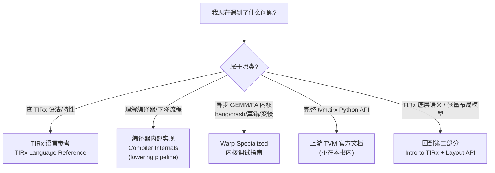

# 第 15 章 · 参考资料(附录)

> 原文:[Reference](https://mlc.ai/modern-gpu-programming-for-mlsys/appendix/index.html)

> **本章要点(TL;DR)**
> - 这一章是「第五部分 · 参考与附录」的**导读页**——你可以把它想成一本工具书最前面那张「目录 / 索引」。它不教新东西,只回答一个问题:你遇到具体问题时,该去翻后面哪一页。
> - 全书真正讲知识的主线是第一到第四部分(Parts I–IV)。附录**不是拿来从头读到尾的**,而是你写代码、调程序时**遇到问题随手翻**的工具箱。
> - 附录主要有三块内容:**TIRx 语言参考**(查语法)、**编译器内部实现**(讲编译器怎么一步步把代码翻译成 GPU 能跑的指令,这个过程叫「下降流水线」)、**Warp-Specialized 内核调试指南**(教你修那种特别难调的 GPU 程序)。
> - 完整的 `tvm.tirx` Python API(就是那种把每个函数、每个参数都列全的字典式文档)不在这本书里,而是放在**上游 TVM 官方文档**中。
> - 至于 TIRx 的底层语义和张量布局模型(Layout API),其实**第二部分**已经讲过了,这里只是立个路牌指给你看。

> **前置知识**:这一章里会冒出几个 GPU 专有名词,别被吓到——它们在本章只是「预告」,正文各章会细讲。这里我会把每个第一次出现的词都用大白话当场解释一遍,所以你**零 GPU 基础也能读懂这一章**。如果想先有个整体印象,可以翻一下 [第 0 章 · 极简入门](./ch00_gpu_ml_primer.md)。先记住三个最常出现的词就好:
> - **GPU 内核(kernel)**:就是「一段跑在 GPU 上的小程序」。你平时写的代码跑在 CPU 上;要让显卡帮你算,就得把那段计算写成一个 kernel 丢给 GPU 跑。
> - **GEMM**:就是「矩阵乘法」(General Matrix Multiply 的缩写)。为什么它这么重要?因为深度学习里绝大部分计算——神经网络的每一层、注意力机制——本质上都是在做矩阵乘,所以它是 GPU 上当之无愧的「主角」。
> - **warp specialization(warp 专精)**:一种写 GPU 程序的技巧,意思是「让不同的线程小组各干各的活」——比如一组专门负责搬数据、另一组专门负责算。后面 15.2 会展开讲为什么要这么干。

---

## 15.1 这一部分是什么

先把整本书的脉络捋一遍。《Modern GPU Programming for MLSys》真正讲东西的,是 **Parts I–IV** 这四个部分。它的讲法大概是这样,我们顺着读者第一次学的角度走一遍:

1. **先带你认识 GPU 硬件长什么样**——显卡里有什么、为什么内存要分好几层、几千个线程怎么一起干活,这些先有个直观印象。
2. **再引出 TIRx**。TIRx 是这本书自创的一门「中间语言」。什么叫中间语言?打个比方:你写的是高层意图(比如「把这两个矩阵乘起来」),而 GPU 最终执行的是又细又底层的机器指令;中间需要一种语言把高层意图描述清楚、又方便编译器往底层翻译,TIRx 就是夹在中间的这一层。它特别之处在于是「张量级」的——直接拿整块矩阵、整块张量当操作对象,而不是一个数一个数地处理。
3. **接着讲编译器是怎么把你写的高层算子,一步一步"降"成高效 GPU 代码的**。这里的「算子」你就理解成「一个计算操作」(比如一次矩阵乘、一次加法);「降」(lowering)是个编译器术语,指把高层、抽象的描述一层层翻译成越来越底层、越来越贴近硬件的代码,就像把「我要喝水」逐步细化成「抬手、握杯、送到嘴边」那一连串具体动作。
4. **最后教你怎么写出 warp-specialized 的高性能内核**,也就是前面提到的「让不同线程小组分工」的那种高性能 GPU 程序。

这条线才是主菜。

那这一章所在的「参考与附录」呢?定位完全不一样。原文说得很白:这里放的,是"你读着读着随手要查的东西"。说白了,它不是让你从头啃到尾的,而是搁在手边的一本工具书。你读正文卡住了,或者真动手写内核、调内核的时候撞上某个具体问题,翻到对应那一页查一下就行。

> **关键**:附录是用来"哪里不会查哪里"的,不是用来通读的。第一次学的话,先把 Parts I–IV 顺顺当当读一遍,附录就当成踩坑时翻一翻的入口,够用了。

---

## 15.2 三类需求 → 三个去处

附录是按"你想干嘛"来分的——你有什么需求,就告诉你该往哪儿翻。下面这张表把需求和去处一一对上:

| 你的需求 | 该翻哪一页 |
| --- | --- |
| 想查某个 **TIRx 语言特性**(语法、内建函数、语义) | **TIRx 语言参考(TIRx Language Reference)** |
| 想搞懂**编译器内部实现**,尤其是**下降流水线(lowering pipeline)** | **编译器内部实现(Compiler Internals)** |
| 要调试**异步 GEMM / FlashAttention 内核**的 hang(挂死)、crash(崩溃)、结果算错或性能变慢 | **Warp-Specialized 内核调试(Debugging Warp-Specialized Kernels)** |

> **一句话先理解**:这张表就是「我遇到 X 类问题,该去翻哪一页」。下面把三种最常见的场景挨个说清楚,顺带把里头的 GPU 名词讲明白。

说白了,这三块对着三种最常见的场景:

- **查语言**:写 TIRx 的时候,忘了某个语法、某个内建函数怎么用 → 翻语言参考。这跟你查一门编程语言的语法手册是一回事。
- **看原理**:想弄明白"我写的高层算子,最后到底怎么变成 GPU 指令的" → 翻编译器内部实现,重点看 lowering pipeline(下降流水线,就是上面说的那条「一层层往底层翻译」的流水线)。
- **修 bug**:异步内核出毛病了 → 翻调试指南。

这里先解释一下什么叫 **FlashAttention**(简称 FA):它是一个专门用来高效计算「注意力」(Transformer 大模型里最核心的那个操作)的 GPU 内核,出了名地快、也出了名地难写。

那这一节标题里的「**异步内核**」又是什么意思?「异步」在这里指的是:**搬数据**和**做计算**这两件事不再排队一个接一个干,而是**重叠着同时进行**——一边算着这一块,一边后台偷偷把下一块数据搬进来。为什么要这么干?因为 GPU 算得飞快,但从远处的大内存搬数据进来却很慢;要是「先搬完再算、算完再搬」,GPU 大半时间都在干等数据,白白浪费算力。让搬运和计算重叠起来,就能把这段等待时间「藏」掉。

具体来说,这里说的异步内核,是指那些用到下面这几样东西的 GEMM / FA 内核:

- **TMA**:一个专门负责「异步搬数据」的硬件单元(详见第 0 章)。有了它,搬数据这活儿可以丢给硬件后台去办,计算线程不用守着。
- **warp specialization**:让不同的 warp 各司其职——有的 warp 专门搬数据、有的专门算。(warp 是 GPU 里 32 个线程绑在一起、必须步调一致行动的一个小组,可以想象成「32 个人必须迈同一步的方阵」;后面正文会细讲。)
- **`tcgen05` MMA**:一条专门做矩阵乘加的硬件指令。MMA 是 Matrix-Multiply-Accumulate(矩阵乘加,即「乘完顺手累加」)的缩写,是 GPU 里那块专门加速矩阵乘的硬件——**Tensor Core**——的核心指令。
- **TMEM**(Tensor Memory):Blackwell 这代 GPU 上专门留给 Tensor Core 用的一块「片上内存」(就是直接长在芯片上、离计算单元极近、所以存取极快的一小块内存)。

为什么要把这种内核单拎出来、专门给它一整节调试指南?因为正是上面这种「异步 + 流水线化 + 多组分工」的内核,是所有 GPU 程序里**最难调**的一类——好几件事同时在跑,出了问题很难看清是哪一步错了。

> **澄清一个容易混的点**:这本书的 warp-specialized 调试指南,讲的是**跑在 Blackwell 上的内核**。Blackwell 是 NVIDIA 较新的一代 GPU 架构,代号写作 `sm_100a`(这种 `sm_xxx` 的写法是 NVIDIA 给每代架构起的编号)。它的矩阵乘用的是 Blackwell 那套 `tcgen05` MMA 指令,再配上刚说的 TMEM。注意,这**不是** Hopper(上一代架构)那一代的 warpgroup MMA(写作 `wgmma`,是把 4 个 warp 凑成一组协同做矩阵乘的指令)。一句话:两者是不同代显卡上的不同指令,千万别搞混。

下面用一张 Mermaid 图,把这个"对症下药"的过程画出来:

> **注意**:图里的 R1/R2/R3,是附录自己实打实包含的三个子页面。而 R4(完整 Python API)和 R5(底层语义与布局)**并不在附录里**——作者只是顺手给你指个路,告诉你"这俩该上哪儿找",免得你在附录里翻半天还找不着。

---

## 15.3 两个"不在这里,但你可能要找"的指针

有两样东西,你读着读着八成会去找,可它们偏偏不在这儿。附录特意提了一句,免得你白翻半天。

### 1. 完整的 `tvm.tirx` Python API

书里讲 TIRx,只讲关键概念和怎么用。**那种完整、一条一条列全的 `tvm.tirx` Python API 文档,书里没有**,它放在**上游 TVM(upstream TVM)的官方文档**里。(这里多说一句:TVM 是一个开源的深度学习编译器项目,TIRx 是建在它之上的;「上游」就是指 TVM 这个原始项目本身,跟你平时说的「上游仓库」是一个意思。)

> **关键**:你要是想查"某个函数的精确签名、有哪些参数、每个参数能填什么"这种字典式的细节,该去翻 TVM 官方 API 文档,别在这本书里找。说白了就是分工:书负责把思想和用法讲透,API 文档负责把每个接口的细节列全。

### 2. TIRx 原生层 / native level 与张量布局模型 / Layout API

先把这两个名词点一下:**TIRx 原生层(native level)**指的是 TIRx 更贴近底层硬件的那一层语义,也就是它最「原始、底层」的样子;**张量布局模型(tensor layout model)**则是描述「一块张量在内存里到底怎么摆放」的一套规则——同样一个矩阵,数据在内存里横着排还是竖着排、怎么切块,直接影响 GPU 读取快不快,所以专门有一套模型(配套的 API 叫 Layout API)来管这件事。

这两块,**第二部分(Part II)早就讲过了**。附录在这儿只是给你指条路,告诉你"回去看哪儿",省得你在附录里瞎翻:

| 内容 | 在哪讲过 |
| --- | --- |
| TIRx 的原生/底层语义 | 第二部分 · TIRx 入门(Introduction to TIRx) |
| 张量布局模型(tensor layout model) | 第二部分 · TIRx 布局 API(TIRx Layout API) |

---

## 15.4 建议的使用方式(阅读顺序)

这是张导航页,它自己没什么"先读这段、再读那段"的讲究。真正值得说道的,是**怎么把附录揉进你整个学习过程里**。给你一套实在的用法:

1. **第一遍学**:顺着主线把 Parts I–IV 读完。这阶段附录就当"卡住了再去查"的入口,不用提前看,更不用从头啃。
2. **写代码的时候**:TIRx 的某个语法或特性吃不准 → 先翻 **TIRx 语言参考**;想要某个函数的精确用法 → 直接奔 **TVM 官方文档**。
3. **想往深里钻原理**:等正文读明白了,再去看 **编译器内部实现**,顺着 lowering pipeline 把"我写的高层算子,到底怎么一步步变成 GPU 代码"这一路走一遍。
4. **真上手调内核**:等你开始写或调异步 GEMM、FlashAttention 这类 warp-specialized 内核,撞上挂死、算错、变慢的时候 → 重点啃 **Warp-Specialized 内核调试指南**。
5. **底层语义或布局忘了**:回 **第二部分** 复习 TIRx 入门(Intro to TIRx)和布局 API(Layout API)。

---

## 小结

这一章是「参考与附录」的导航页,记住三点就够了:

- 全书的主线在 **Parts I–IV**。附录是**手边随查的工具箱**,哪里不会查哪里,别从头通读。
- 附录按"你想干嘛"分成三个子页面:**TIRx 语言参考**(查语法特性)、**编译器内部实现**(看 lowering pipeline,也就是「代码怎么一步步翻译成 GPU 指令」)、**Warp-Specialized 内核调试**(修那种异步 GEMM / FA 内核的挂死、崩溃、算错、变慢)。
- 两样最容易"找不着"的:完整 `tvm.tirx` Python API 在**上游 TVM 文档**里;TIRx 底层语义和张量布局模型在**第二部分**。

把这张"对症下药"的导航表记牢,真动起手来,你就能很快翻到对的那一页。

## 延伸阅读

- 原文页面:[Reference — Modern GPU Programming for MLSys](https://mlc.ai/modern-gpu-programming-for-mlsys/appendix/index.html)
- 完整 `tvm.tirx` Python API:见上游 TVM 官方文档(Apache TVM 项目文档)。
- 相关前置章节:第二部分「TIRx 入门(Introduction to TIRx)」与「TIRx 布局 API(TIRx Layout API)」。

## 术语对照

| 中文 | English |
| --- | --- |
| 下降流水线 | lowering pipeline |
| 编译器内部实现 | Compiler Internals |
| TIRx 语言参考 | TIRx Language Reference |
| Warp-Specialized 内核调试 | Debugging Warp-Specialized Kernels |
| 张量布局模型 | tensor layout model |
| TIRx 布局 API | TIRx Layout API |
| TIRx 原生层 | TIRx native level |
| 上游 TVM | upstream TVM |
| 挂死 | hang |
| 崩溃 | crash |
