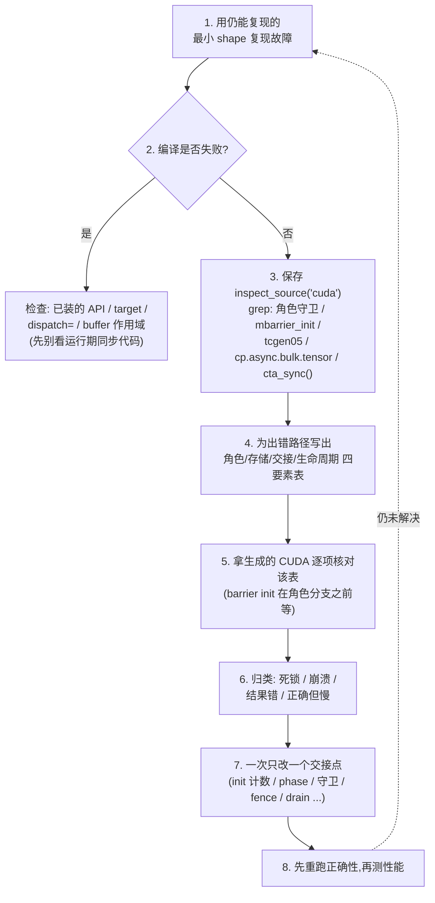
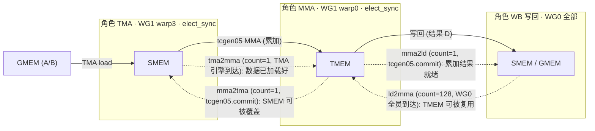

# 第 16 章 · 调试 Warp 专门化 Kernel

> 原文:[Debugging Warp-Specialized Kernels](https://mlc.ai/modern-gpu-programming-for-mlsys/appendix/debugging_warp_specialized.html)

> **本章要点(TL;DR)**
>
> 先别被下面这些陌生词吓到——正文里每一个都会从头讲清楚。这里你只要先记住一句话:**这种 GPU 程序(kernel)出错,绝大多数不是你的算法写错了,而是「几个工序之间交接班的时候掉了链子」。**
>
> - **先别急着重写 kernel。**(kernel 就是「跑在 GPU 上的那段程序」,你可以先这么理解。)这类程序出运行期故障,十有八九不是算法写错了,而是某一次「**交接 / handoff**」掉了链子——就像流水线上前一道工序还没把零件放好,后一道工序就抢着去拿,自然出事。具体怎么坏的?无非这么几种:屏障(barrier)没初始化、到达计数对不上、集体操作被「角色守卫」挡掉了一半、屏障的相位(phase)过期了,或者一块存储还没用完就被人抢去复用了。(这些词现在不懂没关系,正文都会讲。)
> - **动手之前,先填一张「角色 → 存储 → 交接 → 生命周期」四要素表。** 把这四样东西白纸黑字写下来,再拿生成的 CUDA(GPU 真正执行的底层代码)一项一项去对。千万别凭感觉乱改同步代码——那样越改越乱。
> - **真正算数的是生成的 CUDA,它才是「事实来源 / source of truth」。** 你在 Python 里写的那些高层判断(比如「只让 0 号小组干这件事」),编译之后会变成一堆跟线程编号有关的算术运算。所以先用一个叫 `inspect_source("cuda")` 的工具把生成代码存下来,用 grep 搜一下关键字,再回头去读你的 Python。
> - **CUDA 一旦出错,会把整个运行环境(context)「毒化 / poison」掉。** 意思是:出过一次严重错误之后,GPU 这一摊就脏了,后面你再跑别的代码也会跟着报错。撞上「非法内存访问」(程序访问了不该碰的显存地址)怎么办?别犹豫,直接**重启 Python 进程**。不然你接着调的根本不是当前代码,而是上一次崩溃留下的残局。
> - **症状只是线索,不是结论。** 先把现象按「死锁 / 崩溃 / 结果错 / 正确但慢」分个类,再对着对应的检查清单一条一条排。还有一句话要刻在脑子里:**一次只改一个交接点**——一次改一处,出问题才知道是哪儿的锅。

> **前置知识**:这一章会用到一些 GPU 的基本概念。如果下面这几个词你完全没概念,强烈建议先翻一下 [第 0 章 · 极简入门](./ch00_gpu_ml_primer.md)垫一垫底:
> - **GPU**:显卡里那块芯片,擅长「同一件事让成千上万个小工同时干」,所以特别适合深度学习里那种海量重复的计算。
> - **线程 / thread**:GPU 上最小的「干活单位」,你可以理解成一个小工。GPU 会同时跑成千上万个线程。
> - **warp(线程束)**:GPU 把线程 **32 个绑成一捆** 一起调度,这一捆就叫一个 warp。打个比方,warp 就像「32 个人组成的方阵,必须迈同一步」——它们同一时刻执行同一条指令。
> - **warp 专门化 / warp specialization**:让不同的 warp 去干不同的活(有的搬数据、有的算乘法、有的写结果),分工协作,而不是人人都干一样的事。
> - **屏障 / barrier**:一个「集合点」。线程跑到这儿会停下来等,直到约定数量的人都到齐,才一起放行——就是用来协调「谁先谁后」的工具。
>
> 本章后面还会反复出现 mbarrier(异步版的屏障)、phase(屏障的「相位」计数)、以及「生成的 CUDA」这些词,正文第一次出现时都会现场解释。配套背景在第 13 章「用 Warp 专门化和 Cluster 扩展 GEMM」。

这一章是《Modern GPU Programming for MLSys》参考与附录里的一篇「工程实战手册」。它不教新算法,只干一件事:把前面那些复杂的、好几个工序同时跑的 GPU 程序,提炼成一套**能反复用、能直接上手的调试套路**(配套代码就是「用 Warp 专门化和 Cluster 扩展 GEMM」那一章里 GEMM 的步骤 7–9。GEMM = 通用矩阵乘法,就是「两个矩阵相乘」,它是深度学习里最核心、跑得最频繁的计算)。

> **一句话先理解**:这些 GPU 程序之所以难调,是因为它们让**三件事同时进行、谁也不等谁**——一边在搬数据,一边在算乘法,一边在往外写结果。

具体来说,这三件事是:
- **搬数据进来**:用 TMA 把数据从「大而慢的显存」整块搬到「小而快的片上内存」。(TMA 是 GPU 里一个专门负责「整块整块搬运数据」的硬件引擎,你可以把它想成一台自动传送带;后面会再细说这些内存的区别。)
- **算乘法**:用 GPU 里的专用矩阵乘法硬件(Tensor Core)把搬进来的数据相乘并累加。
- **写结果出去**:把算好的结果再写回内存。

这三件事**叠在一起 / overlap** 跑(overlap 就是「时间上重叠、并行进行」),好处是快,坏处是——一旦出 bug,因为同时在跑的东西太多,排查起来格外恼火。不过有个好消息:这套调试方法不光对矩阵乘法好使,Flash Attention(一种让 Transformer 注意力机制跑得又快又省内存的实现)里那几段交接,照样能套上去。

---

## 16.1 心法:把异步 kernel 看成一组「交接」

传统的 GPU 程序你是怎么调的?基本上就是从头到尾把代码读一遍,逮逻辑 bug。可 warp 专门化的程序不能这么干,因为它的结构根本不一样。

它的玩法是这样:把不同的 warp(前面讲过,32 个线程绑成的一捆)派去干不同的活,也就是给它们分**角色 / role**——一组专门负责「搬数据进来」(发 TMA 加载),一组专门负责「算乘法」(发 MMA,即矩阵乘加指令),一组专门负责「写结果出去」(写回)。你就把它们想成流水线上的几个工位,各管一摊,谁也别抢谁的活。

这里还会冒出一个词 **warpgroup(线程束组)**:就是把 **4 个 warp 捆在一起**,合起来 4 × 32 = **128 个线程**,作为一个更大的协作单位。后面会经常用「WG0」「WG1」指代第 0、第 1 个 warpgroup。

那工位和工位之间靠什么协调?靠**异步屏障 / mbarrier**。前面说过屏障是个「集合点」;mbarrier 就是它的「异步增强版」,专门用来跨工位喊话:「我这道工序干完啦,该你接手了。」(「异步」的意思是:发出信号的人不用站在原地干等,可以接着忙别的,这正是它能让三件事同时跑的关键。)

> **关键**:在这种结构里,代码本身经常「怎么看都没毛病」,真正爱出事的地方是**角色之间的交接**。哪怕某个屏障的到达计数(就是「要等几个人到齐」那个数字)只写错了一个,整条流水线都能给你永久卡死——因为它会一直傻等那个永远凑不齐的人数。

所以这一章开篇就先立一条规矩:

> **注意**:**别一上来就重写 kernel。** 顺序应该是这样:(1)先把运行环境查清楚,(2)再去看生成的 CUDA,(3)最后才回头动 Python。环境和编译这两关一过,剩下的运行期故障基本就跑不出下面这几种「坏掉的交接」了(每一种正文都会细讲,现在扫一眼有印象就行):
> - 屏障压根没初始化(没设好「集合点」)
> - 到达计数写错了(等的人数对不上)
> - 集体操作被「角色守卫」挡掉了一部分(本该所有人一起做的事,被「只让某些角色做」的判断给拦掉了一半人)
> - 屏障的相位(phase)过期了(后面讲)
> - **生产者 / producer**(干活产出数据的一方)刚写好的数据,**消费者 / consumer**(要用这份数据的一方)还没来得及看见呢,这块存储就被人抢去存别的东西了

这条心法记牢了——后面那一堆检查清单,说白了都只是它的展开版。

---

## 16.2 调试前:先排除运行环境

很多事看着像「kernel 的 bug」,其实根本不在 kernel 里——是环境出了岔子。所以这一章的要求很明确:**第一步先把环境查干净**。两条命令就够了:

```bash
# 确认 TVM 是哪个安装、哪个版本(防止导入了过期的 checkout)
python -c "import tvm, tvm.tirx; print(tvm.__file__, tvm.__version__)"

# 确认 GPU 型号和计算能力(这些 kernel 需要 Blackwell)
python -c "import torch; print(torch.cuda.get_device_name(), torch.cuda.get_device_capability())"
```

为什么偏偏查这两样?

- **这些 kernel 只认 Blackwell 这一代显卡(代号 `sm_100a`)。** Blackwell 是 NVIDIA 显卡的一代「架构」(可以理解成「第几代芯片设计」),比它老的还有 Hopper、再老的 Ampere。本章用到的 `tcgen05`(Blackwell 上那套新的矩阵乘法指令)只有 Blackwell 这一档的硬件才支持。所以你的 GPU 要不是 Blackwell,代码怎么改都白搭——第二条命令就是用来确认显卡型号和它的「计算能力」(compute capability,衡量这块显卡支持哪些功能的版本号)。
- **Python 很可能偷偷导入了一个过期的 TVM。**(TVM 是本章用来生成 GPU 代码的那套编译框架。)万一 `tvm.__file__`(它会打印出「实际加载的 TVM 装在哪个文件夹」)指过去的是个旧目录,你还以为早更新过了——那你跑的压根不是刚改的代码。这个坑最阴,经常一搭进去就是好几个钟头打水漂。

> **关键**:环境确认没问题之后,先跑一遍 kernel 的**最小正确性检查**(比如 `run_correctness()`),**之后再去管性能**。先看「对不对」,再操心「快不快」,顺序别反了。

---

## 16.3 标准调试流程(Workflow)

原文给了一条 8 步的工作流,我把它画成了下面这张流程图。它的精神用一句话就能说清:**一步步收窄范围、拿生成代码对照、一次只动一个地方**。



这几步里,有几个细节得拎出来反复念叨:

- **第 1 步**:要是故障是**非法内存访问 / illegal memory access**,下次跑之前务必先**重启 Python**(为啥?16.7 节专门讲)。
- **第 2 步**:编译挂了,先去看 API / target / dispatch / 作用域,**别急着去抠运行期的同步代码**。编译问题和同步问题压根是两码事。
- **第 3 步**:生成的 CUDA 存盘之后,**先 grep 关键字符串,再去读 Python**。这是本章翻来覆去强调的招:把生成代码当成你的「地图」来用。
- **第 7 步**:**一次只改一个交接点**(init 计数、arrive/wait 的 phase、角色守卫、fence、TMA store 的 drain、TMEM 的 alloc/dealloc、tile scheduler 的推进,挑一个改)。你要是一口气改好几处,真出了问题,根本分不清到底是哪一处起的作用。

---

## 16.4 「四要素表」:可迁移的调试工作表

这是整套方法的心脏,也是最该背下来的一段。它的思路很朴素:别急着读那一大坨代码,**先把这个 kernel「谁干什么、东西放哪、怎么交接、什么时候能扔」这四件事写在纸上**,心里有谱了,再去对代码。不管你面前是**哪个**这种「多工序同时跑」的 kernel,动手改代码之前,先老老实实把下面这张表填出来:

| 要素 | 要写下来的内容 |
| --- | --- |
| **角色 / Roles** | 每一个异步操作,到底是谁发出来的——哪些线程 / warp / warpgroup / CTA。(CTA = 线程块,一批被分到一起、能共享同一块高速内存的线程,见第 0 章;后面会经常出现。) |
| **存储 / Storage** | 每个 tile(把大矩阵切成的一个个小方块,GPU 一次处理一块)走到每一步时「住」在哪一层内存里。GPU 的内存是**分层**的,越快的越小,这里从慢到快依次是:**GMEM**(全局内存,就是显存,容量大但慢)、**SMEM**(共享内存,一个 CTA 内的线程共用的一小块片上高速内存,你可以把它当成「一块要自己手动管理的高速缓存」)、**TMEM**(矩阵乘法硬件 Tensor Core 专用的累加器内存)、**寄存器 / register**(每个线程私有、最快的一点点存储,作用类似 CPU 的寄存器,但 GPU 里每个线程都有自己的一份)。 |
| **交接 / Handoff** | 谁生产、谁消费、用哪个屏障对象传信号、到达计数多少、相位(phase)多少,还有那个「让刚写的数据真正对别人可见」的 fence 或 drain。(fence / drain 现在不懂没关系,后面 16.12 会细讲——一句话:它们是确保「我写的东西别人真能看到 / 真写完了」的保险措施。) |
| **生命周期 / Lifetime** | 每一块存储,最早什么时候能拿去存别的东西(复用)、什么时候能被读回、什么时候能释放掉。 |

在往下之前,先把一个会反复出现的词讲清楚：**角色守卫 / role guard**。它其实就是代码里的一句 `if` 判断,用来「把活分给特定角色」。比如 `if (这是 0 号小组) { ... }`,意思是「只有 0 号小组的线程才进来干这件事,别人绕道」。守卫写对了,分工就清清楚楚;守卫写错了——比如本该「所有人都做」的事被一句 `if` 拦掉了一半人——就出大事。这正是本章一半 bug 的来源。

表填完了,接下来**拿生成的 CUDA 去逐项验**这五件事(每一条对应一类常见 bug,后面都会展开):

1. **角色守卫**跟你表里的角色对得上(谁该干的活,守卫确实只放谁进去)。
2. **屏障初始化**(设置「集合点」那一步)是在被守卫的角色分支**外面**(在它前面),不是塞在某个 `if 角色` 分支里头。为啥重要?16.9 会讲——塞错地方会导致初始化根本没人执行,直接死锁。
3. **集体操作没被守卫不小心收窄**。「集体操作 / collective」指的是「本该一整组线程一起做」的事;一旦被 lane / warp / warpgroup 守卫拦掉一部分人,人数就凑不齐了。(**lane / 通道**就是线程在一个 warp 里的编号,0~31,一共 32 个。)这一类 bug 最隐蔽,后果也最狠。
4. **arrive / wait 的相位(phase)** 跟你的交接表对得上。(arrive = 「我到集合点了」,wait = 「我在集合点等」;phase 是它们对暗号用的一个计数,后面 16.9 ⑥ 会细讲。)
5. **TMA store 的 drain、TMEM 的释放(dealloc)、SMEM 的复用**,统统等到生命周期表点头说「现在可以了」之后才发生——也就是别在数据还有用的时候,就把它的地盘抢去干别的。

> **关键**:同一张表,套在矩阵乘法的「搬数据 → 算乘法 → 写回」流水线上行(也就是 `TMA → MMA → 写回`),套在 Flash Attention 的 `score → softmax → value → correction` 那几段交接上也行(score = 分数矩阵,Q·K 两个矩阵相乘的结果;softmax = 把这些分数归一化成「概率」的那一步)。这就是「可迁移」的意思——方法本身一个字不用变,你只要把表里的内容换成对应 kernel 的角色和存储就完事了。

下面这张图,把矩阵乘法流水线的三个角色、以及它们之间的交接都画了出来。先看主线那三个实线箭头:数据从 GMEM 被搬进 SMEM、在 SMEM 里被乘进 TMEM 当累加器、最后从 TMEM 写回去。再看那几条虚线——它们就是「交接信号」:每条虚线上标的 `count=几` 就是那个屏障的到达计数(要等几个人到齐)。看一眼,你就能摸到「四要素」在真实 kernel 里到底长啥样:



> **注意**:重点盯紧那几个到达计数。`tma2mma`/`mma2tma`/`mma2ld` 都是 **1**(一个引擎或一条 commit 触发一下就够了),而 `ld2mma` 是 **128**(得等 WG0 全部 128 个线程都到齐)。**这些数对不对,几乎就决定了 kernel 会不会死锁**(细节见 16.9 节)。

---

## 16.5 当编译失败时

编译期的问题,要**抢在**运行期同步问题前头解决,因为这俩根本不是一类 bug。原文给了一张对照表,我重新理了一下:

| 症状 | 大概率出问题的地方 | 第一步该查什么 |
| --- | --- | --- |
| 报「未知 TIRx API」或属性错误 | 装的 wheel 跟教程代码对不上 | 打印 `tvm.__file__` / `tvm.__version__`,拿 API 名字去和「TIRx 语言参考」核一遍。 |
| 报「不支持的 `dispatch=`」 | 你选的 target 或原语撑不起这条路径 | 看 `dispatch` 参数和 target 能力;本教程的 `tcgen05` 路径要 Blackwell。 |
| buffer 作用域(scope)对不上 | 有个 buffer 走错了硬件路径 | 翻工作表的「存储」那行:**TMEM 只能走 `tcgen05` 访问**,TMA 的操作数(operand,指令的输入数据)得用兼容的 GMEM/SMEM 布局(layout)。 |
| 编译过了,可生成的 CUDA 里**根本没有**你要的那条路径 | dispatch 没按你以为的方式降级 | 改算法之前,先去生成的 CUDA 里 grep 一下 `tcgen05` 和 `cp.async.bulk.tensor`。 |

> **关键**:最后一行是个超级容易栽的坑。一句话记牢:**编译过了,不等于生成了你想要的指令**。dispatch 完全可能悄没声地拐去一条慢路(没用 TMA、没用 Tensor Core),却照样编译成功。所以「去生成的 CUDA 里亲眼确认那条路径在不在」,这一步是躲不掉的。

---

## 16.6 检查生成的代码:让 CUDA 当地图

这是本章最实用的一个工程招数。先说清楚一个关键事实:你在 Python 里写的是「高层意图」,但 GPU 真正执行的是另一份**由编译器自动生成的底层代码**,它用的语言叫 **CUDA**(可以理解成「GPU 上的 C 语言方言」)。很多 bug 在 Python 里看不出来,但在这份生成的 CUDA 里一眼就能逮到。所以我们要做的,就是把这份生成的 CUDA **存成一个文件**,这样就能对它 grep(搜关键字)、对它 diff(和「正确版本」逐行比对)——调试效率立马上一个台阶。下面这段 Python 就是干这事的,逐行看:

```python
from pathlib import Path

# inspect_source("cuda") 的意思是:把编译器生成的那份 CUDA 源码,当成字符串取出来
cuda_source = ex.mod.imports[0].inspect_source("cuda")
Path("artifacts").mkdir(exist_ok=True)            # 建一个文件夹放产物(已存在也不报错)
Path("artifacts/my_kernel.cu").write_text(cuda_source, encoding="utf-8")  # 把这份代码写成 .cu 文件存盘
print(cuda_source)                                # 顺手在屏幕上也打一份
```

存盘之后,后面所有「grep 一下 xxx」的动作,搜的都是这个 `my_kernel.cu` 文件。

### 16.6.1 TIRx 守卫 → CUDA 表达式的对照

关键就在这儿:你在 Python 里写的那些高层守卫(比如「只让 0 号小组进来」),过了编译会**变成**一堆看起来很陌生的、跟线程编号有关的算术运算(`threadIdx` 就是「当前线程的编号」)。如果你不认识这套对应关系,在生成的 CUDA 里就会一脸懵。所以你得先把下面这张映射表吃透,才能一眼认出「哦,这段位运算其实就是我那个角色守卫」:

| TIRx 写法 | 生成的 CUDA |
| --- | --- |
| `wg_id == 0` | `(warp_id_in_cta >> 2) == 0` |
| `wg_id == 1` | `(warp_id_in_cta >> 2) == 1` |
| `warp_id == 0` | `(warp_id_in_cta & 3) == 0` |
| `warp_id == 3` | `(warp_id_in_cta & 3) == 3` |
| `lane_id == 0` | `(((int)threadIdx.x) % 32) == 0` |
| `.init()` 的内部守卫 | `((int)threadIdx.x) < 1`(仅 CTA 的 0 号线程) |
| `elect_sync()` | `tvm_builtin_elect_one_sync_op()` |

这张表里有几处是位运算,程序员一看就懂,但要对上「为什么是这个数」得想一下:

- **`wg_id`(是哪个 warpgroup)凭啥用 `>> 2`?** 因为一个 warpgroup 刚好 4 个 warp。把 warp 号「右移 2 位」在二进制里就等于「除以 4」,商就是它归哪个 warpgroup。
- **`warp_id`(在组内排第几)凭啥用 `& 3`?** `& 3` 是「取最低两位」,而两位二进制能表示 0~3,正好对应它在 warpgroup 里的 4 个位置之一。
- **`.init()`(初始化屏障)凭啥变成 `threadIdx.x < 1`?** `threadIdx.x < 1` 就是「只有 0 号那一个线程」。换句话说,这句的意思是「**整个 CTA 里只有 0 号线程**去做屏障初始化」——设集合点这种事,一个人去设就够了,人人都设反而乱套。这条太关键了:它正好解释了后面 16.9 节那个「屏障初始化被 `wg_id` 守卫坑死」的经典死锁。

### 16.6.2 读 Python 前,先 grep 这些字符串

| 在生成 CUDA 里搜 | 它意味着什么 / 要检查什么 |
| --- | --- |
| `if (threadIdx.x < 1)` | 单 CTA 线程守卫,通常是 barrier 初始化所在处 |
| `mbarrier_init` | barrier 初始化存在,且应当**出现在角色分支之前** |
| `tcgen05` | Tensor Core 路径确实生成了 |
| `cp.async.bulk.tensor` | 拷贝确实降级成了 TMA |
| `cta_sync();` | CTA 范围的 barrier;它**绝不能**待在 `wg_id` 分支里面 |

> **注意**:这套「先 grep 后读」的路子,等于把一个又大又长的生成 kernel,变成了一张能导航的地图。你根本不用从头啃到尾,顺着这几个锚点(barrier init、角色守卫、tcgen05、TMA、cta_sync)一路摸过去,就能落到出问题的那个交接上。

---

## 16.7 何时必须重启 Python

这是一条单独的、但要命的纪律,所以我专门拎出来说:

> **关键**:CUDA 出了错,**不会自己收拾干净**。只要撞上一次非法内存访问、XID 错误,或者「CUDA context 被毒化 / poisoned」,那么**后面那些跟它八竿子打不着的调用**——哪怕你只是来一句 `torch.randn`——都可能跟着一路报错。

这后果很坑:你要是不重启进程就接着调,那你**调的其实是上回崩溃留下的烂摊子,根本不是你眼下这份代码**。结果就是你对着一个早修好的 bug 来回折腾,死活想不通。所以——

**一碰到非法内存访问 / XID / context 毒化,马上重启 Python 进程,再去试下一个 fix。**

---

## 16.8 症状地图(Symptom Map)

拿到一个跑挂的 run,先别忙着下结论,按「现象」快速归个类再说。不过有句话得先打个预防针:

> **注意**:**症状只是线索,不是最终诊断。** 它顶多帮你圈出「大概率是这一片出事了」,真正的根因还得回头靠四要素表,一项一项去对。

| 线索(现象) | 大概率区域 | 第一步该查什么 |
| --- | --- | --- |
| kernel 挂住,随后运行时报「unspecified launch failure」 | **死锁** | barrier init 的位置、到达计数、`cta_sync()` 的位置、`next_tile()` 的参与情况 |
| 非法内存访问、XID,或之后无关的 CUDA 调用也跟着失败 | **崩溃 / context 被毒化** | 重启 Python,再查指针范围、存储生命周期、集体操作参与情况 |
| 错误的行以「128 行」或「tile 大小」的条带(stripe)出现 | **同步竞争或 tile 索引错位** | 生产者/消费者 phase、scheduler 推进、以及哪个 warpgroup 拥有哪个行条带 |
| 出现 `NaN` 或明显非法的值 | **描述符 / 操作数设置 / 累加未初始化** | SMEM/TMEM 描述符设置、swizzle(把数据按特定规律打散摆放以避开 bank 冲突)/layout、累加器初始化 |
| 有限但呈规律性的错误值 | **数据过期或仅部分可见** | 缺 fence、缺 TMA store drain,或存储在生命周期允许之前被复用 |
| 输出正确,但没达到预期加速 | **dispatch 或资源问题** | 生成的 CUDA 路径、流水线深度、占用率(occupancy)、寄存器溢出(spill) |

接下来这几节,就把「死锁 / 崩溃 / 结果错 / 正确但慢」这四类挨个掰开了细讲。

---

## 16.9 死锁(Deadlocks)

先说说什么叫**死锁 / deadlock**:就是大家都在「等」,但谁都等不到——A 等 B、B 等 A,或者一群人在集合点傻等一个永远不会来的人,于是整个程序卡死在那里、再也动不了。死锁是 warp 专门化 kernel 最家常便饭的故障。建议你照下面的顺序,一条一条往下排:

### ① 到达计数 ≠ 初始化计数(最常见)

这是头号嫌疑犯。先回忆一下:屏障初始化时会定下「要等几个人到齐」(这个数叫到达计数);后面线程用 `arrive` 表示「我到了」,用 `wait` 表示「我在这儿等齐」。**麻烦就出在「定的人数」和「实际来的人数」对不上。**

举个典型例子:`MBarrier.init(128)` 这句话等于放出话来——「我得等满 128 个线程到了才放行」。可实际负责报到的 `arrive` 却被 `if warp_id == 0: if lane_id == 0:`(意思是「只有 0 号 warp 的 0 号线程才执行」)这两层守卫给框住了,**到头来真正来报到的只有 1 个线程**。这下好了,这个屏障永远凑不够 128 个人,在它那儿 `wait` 的所有线程也就永远等不到放行——卡死。

下面这张表,把 GEMM 里几个 barrier 的「正确计数」列了出来。拿它跟你的 kernel 比一比,看对不对得上:

| Barrier | init(计数) | 谁来到达 | 实际到达数 |
| --- | --- | --- | --- |
| `TMABar`(tma→mma) | 1 | TMA 引擎,经 `arrive(stage, bytes)` | 1 |
| `TCGen05Bar`(mma→tma, mma→ld) | 1 | MMA warp,经 `tcgen05.commit` | 1 |
| `MBarrier`(ld→mma) | 128 | WG0 全部线程,经 `arrive` | 128 |

> **关键**:`128` 这个数从哪来的?它正好是一个 warpgroup 的线程数(4 warp × 32 lane)。所以 init 计数是 128 的时候,arrive **必须**让 WG0 的全体线程都来执行一遍,绝不能被 lane 或 warp 守卫拦掉一部分。

### ② 屏障初始化被塞进了「角色守卫」里

回想一下 16.6 节:初始化屏障的 `.init()` 会被翻译成 `if threadIdx.x < 1:`,意思就是**只有 CTA 的 0 号线程**才去做初始化。而这个 0 号线程,偏偏归在 **WG0**(第 0 个 warpgroup)名下。问题就出在这儿——如果你把初始化代码放进了「只有 WG1 才进得来」的分支:

```c
// 反例:把初始化放进了 WG1 的守卫里
if (wg_id == 1) {          // 只有第 1 个 warpgroup 的线程才进这个大括号
  mbarrier_init(...);      // 这行永远不会被执行!因为真正该做初始化的 0 号线程在 WG0,根本进不来 WG1 这个分支
}
```

结果:集合点压根没被设置好,后面所有人在它那儿等,全都白等 → 死锁。所以记牢一句:**所有屏障初始化都得放在最外层(顶层 / top level)**,别往任何角色守卫的 `if` 里塞。怎么验?简单——在存好的生成 CUDA 里 `grep mbarrier_init`,看看这些初始化语句都蹲在什么位置,有没有不小心被某个 `if (wg_id == ...)` 包住。

### ③ `cta_sync()` 蹲进了 warpgroup 分支里

`cta_sync()` 是一个「全员集合」指令——它要求**整个 CTA 的所有线程**都到齐了才放行(熟悉 CUDA 的话,它就等价于经典的 `__syncthreads()`)。既然要求全员到齐,你就**绝不能**把它放进某个角色分支里。你要是把它放进 `if wg_id == 0:` 里头,那 WG1 的线程压根走不到这个集合点,而 WG0 的线程又在傻等 WG1 → 又死锁了。

> **关键**:如果你只是想在**单个 warpgroup 内部**(那 128 个线程之间)做同步,用专门的 `T.cuda.warpgroup_sync(10)`(只要求一个 warpgroup 内部到齐),**别**拿要求全员到齐的 `cta_sync()` 来凑。

### ④ 有些消费者 warpgroup 的线程漏掉了 `next_tile()`

这里先解释一个角色:**tile scheduler(分块调度器)**。前面说过大矩阵会被切成一个个 tile;调度器就是那个「派活的工头」,负责告诉每个线程「下一块该处理哪个 tile」,靠的就是 `next_tile()`(领下一块活)这个调用。关键在于,它给**每个线程各自记一份状态(per-thread)**。所以一旦有线程跳过了 `next_tile()`,它手里的「进度」就跟别的线程对不上号了,后果往往是某些线程在那儿一直空转、出不来。

### ⑤ 搬数据(TMA)和算乘法(MMA)对「要处理多少块」没数到一块去

矩阵乘法会在一个方向上把数据切成 `K_TILES` 块,搬数据的循环和算乘法的循环都得各跑这么多次、节奏对齐。要是算乘法那边的循环次数手滑写成了 `K_TILES - 1`(少跑一次),两边的进度对暗号(也就是下面要讲的 phase)就会**一点点跑偏 / drift**,跑到第二个外层 tile 时一下就死锁。

> **注意**:搬数据循环和算乘法循环,都得老老实实迭代 `K_TILES` 次。哪怕少跑一次,整条流水线的节奏就全乱套了。

### ⑥ 初始「相位(phase)」设反了

先把 **phase(相位)** 讲清楚,这是这种流水线里很巧妙的一个机制。

> **一句话先理解**:phase 就是生产者和消费者之间的「对暗号开关」,在 0 和 1 之间来回翻;靠它,消费者才能分清「这是上一轮的旧数据,还是这一轮的新数据」。

具体来说,屏障的 `wait` 不是「等人到齐」那么简单,它还会问一句「现在是不是我等的那个 phase?」。利用这一点,可以巧妙地安排谁先动:

- **生产者从 `phase=1` 起步**。这样它**第一次 wait 直接就过**,马上就能动手生产(因为还没人生产,它当然要先干活)。
- **消费者从 `phase=0` 起步**。这样它**第一次 wait 会被卡住**,老老实实等生产者先产出东西来(东西还没产出,它当然得等)。

一个先干、一个先等,流水线才转得起来。你要是让这俩从**同一个 phase** 起步,那「谁先谁后」就乱了,第一次交接当场就可能死给你看。

---

## 16.10 崩溃与 context 毒化

先分清「崩溃」和上一节的「死锁」:死锁是大家在傻等、程序卡住但没报错;**崩溃**则是程序直接出错挂掉,典型表现是「非法内存访问」(碰了不该碰的显存地址)或「XID 错误」(NVIDIA 驱动报出来的硬件级错误码)。常见的几个根子:

- **「申请内存」的步骤搞错了顺序。** 这里要管理一块可分配的内存池(pool):`pool.alloc` 是「申请一块」,`pool.commit()` 是「我申请完了,定下来」。规矩是**所有申请都得在 `commit()` 之前做完**。坑在于:屏障的包装器内部也会偷偷帮你 `alloc` 一次,容易让人忽略。所以分配顺序得严格按下面这个来:

  ```text
  tmem_addr → barrier 包装器 → move_base_to(1024)
            → Asmem / Bsmem / Dsmem → commit()
  ```

  只要在 `commit()`(定稿)之后还想再 `alloc`(追加申请),事情就坏了。

- **`tcgen05.alloc` / `tcgen05.dealloc`(申请 / 释放 Tensor Core 那块累加器内存 TMEM)上挂了 lane 守卫。** 这两条指令有个硬性要求:发它的那个 warp,**32 个 lane(线程)必须一个不少地一起执行**。你要是写成 `if lane_id == 0:`(只放 0 号线程进去),那就是 **未定义行为 / undefined behavior**——意思是「规范没说这种情况会怎样,实际表现完全没准,可能这次没事下次就崩」,是最难查的一类坑。

  > **关键**:对一下 16.11 节那个 Step 7 骨架——`tcgen05_alloc` / `tcgen05_dealloc` 该有 **warp 守卫(限定哪个 warp 来发),但绝不能有 lane 守卫(不能再往里挑某几个线程)**。

- **释放 TMEM(`tcgen05.dealloc`)之前漏了 `cta_sync()`。** 后果是:写结果那边还没把 TMEM 里的数据读完,这边就抢先把 TMEM 释放了——于是读到的全是垃圾。加一句 `cta_sync()`(全员到齐再往下走)就能保证「大家都读完了,才允许释放」。

- **GMEM 或 SMEM 访问越界**(读写了超出数组范围的地址)。把问题缩到单个 tile,查一查调度器算出来的 `m_idx` / `n_idx`(也就是「当前在处理第几行块、第几列块」的索引),再确认当前矩阵的尺寸(shape)是 tile 大小的整数倍——尺寸要是除不尽,边角那块就容易算出越界的地址。

---

## 16.11 Step 7 参考骨架

原文给了一份「能正常编译运行的 Step 7 kernel」的顶层结构。这东西特别值钱,你完全可以拿它当「标准答案样板」——把出毛病的 kernel 跟它一段一段地对,常常一眼就能看出哪儿少了一个守卫、或者哪儿多了一个守卫。下面我把它的骨架摘出来(只留每一段的核心一两行,省略了具体实现细节),一段一段配上中文讲解。你不用看懂每个函数,重点是体会**「哪段代码该被哪种守卫包住」**这个结构:

```c
// (1) Barrier 初始化:顶层,且仅 CTA 0 号线程
if (threadIdx.x < 1) {
  mbarrier_init(tma2mma[0..1], 1);   // TMA→MMA,计数 1(TMA 引擎到达)
  mbarrier_init(mma2tma[0..1], 1);   // MMA→TMA,计数 1
  mbarrier_init(mma2ld, 1);          // MMA→写回,计数 1
  mbarrier_init(ld2mma, 128);        // 写回→MMA,计数 128(WG0 全员到达)
}

// (2) TMEM 分配:WG0 的 warp0,发出指令的 warp 的全部 lane 参与(无 lane 守卫)
if (wg_id == 0 && warp_id == 0) tcgen05_alloc(..., 512);

// (3) fence + cta_sync,然后 phase 初始化:producer=1, consumer=0

// (4) Warp 专门化主循环
if (wg_id == 1 && warp_id == 3 && elect_sync) { /* TMA */ while(valid){ ... next_tile(); } }
if (wg_id == 1 && warp_id == 0 && elect_sync) { /* MMA */ while(valid){ ... next_tile(); } }
if (wg_id == 0)                                { /* WB  */ while(valid){ ... next_tile(); } }

// (5) 清理:发出指令的 warp,无 lane 守卫
cta_sync();
if (warp_id == 0) { tcgen05_relinquish_alloc_permit(); tcgen05_dealloc(..., 512); }
```

动手改算法之前,这四点务必先核一遍:

1. **barrier init 在顶层**,没躲在任何 `wg_id` 守卫里头。
2. **`tcgen05_alloc` / `tcgen05_dealloc` 有 warp 守卫、但没有 lane 守卫**——发指令那个 warp 的所有 lane 都得到场。
3. **TMA 循环和 MMA 循环都跑 `K_TILES` 次**(对应 16.9 节 ⑤)。
4. **phase 初始值是 producer=`1`、consumer=`0`**(对应 16.9 节 ⑥)。

> **关键**:这个骨架,几乎就是前面所有死锁 / 崩溃检查项的「正确答案合集」。你就把它当成一份看得见摸得着的 checklist 来用——你的 kernel 每偏离骨架一处,那一处就先打个问号。

---

## 16.12 结果错误(Wrong Results)

结果算错了,别瞎猜。**先看错误长成什么「样子 / pattern」,按样子分类,再倒推原因**:

| 错误形态 | 大概率指向 |
| --- | --- |
| 整行条带(whole row stripes)错 | 生产者/消费者 phase、tile 索引、或角色归属(role-ownership)不匹配 |
| 输出 `NaN` | 描述符设置、操作数设置、或累加未初始化 |
| 有限但有规律的错值 | 消费者读到了旧 tile、部分写入的 tile,或 store 尚未 drain 的数据 |

下面这几个是经典坑。先垫一个会反复出现的词:**`elect_sync()`**——它的作用是「从一个 warp 的 32 个线程里**只选出一个**来干某件事」。有些操作「只该一个人去做」,如果 32 个人都去做就会出乱子。这正是下面第一个坑:

- **`tcgen05.commit` 写到了 `elect_sync` 外面**(也就是没限定只让一个线程做)。这里 `commit` 是「提交一次,告诉别人:这一组活我干完了,你可以接手了」。后果很微妙:32 个线程**人人**都提交了一次,其中 31 个提交的是**空的**(因为活其实只有一份),而这些空提交会**立马**给屏障发出「干完了」的信号。结果就是:算乘法(MMA)那边还没顾得上把 SMEM 里的数据读走,搬数据(TMA)那边就以为「可以覆盖了」,真把 SMEM 给覆盖掉了 → 算出来的数就错了。

  > **注意**:`commit` 这种「本该由一个线程发」的操作,一定要圈在 `elect_sync()` 里头,保证真正去提交的就那么一个线程。

- **写出数据(TMA store)之前漏了 `fence.proxy_async("shared::cta")`。** 这里要引入 **fence(内存栅栏)** 这个概念:GPU 里不同的硬件部件走的是不同的「访问通道 / proxy」,一个部件刚写好的数据,另一个部件不一定马上就能看到;fence 就是一道「**等一下,把我刚才写的东西落实到位、让对方也能看见,再往下走**」的命令。漏了这道 fence,线程刚写进 SMEM 的数据,TMA 引擎可能压根看不见,于是搬出去的是旧数据。

- **写出数据之后漏了 `cp_async.bulk.commit_group()` + `wait_group(0)`。** 这里要引入 **drain(排空 / 等写完)**:数据「写出去」这个动作是异步的,发出去之后不会立刻完成。`commit_group()` + `wait_group(0)` 合起来的意思就是「**等这批写操作真正全部写完**」。漏了它,写还没写完,下一个 tile 就过来把这块内存(`Dsmem`)抢去存别的东西了 → 数据被中途冲掉。

- **持久化 kernel / persistent kernel 在小尺寸(比如 1024×1024)上偶尔挂掉。**(persistent kernel 是一种「一次启动就一直驻留、自己不断领新活来干」的写法。)这种现象特别能唬人——**尺寸一大,中间要算的轮数跟着变长,反倒把那个时间窗很窄的竞争给盖住了**,看着一切正常。这时候重点去查 tile 之间的 phase 复位(reset),还有数据写出的 commit / wait。

  > **关键**:「小尺寸偶尔挂、大尺寸看着没事」,这是一个明明白白的**竞争条件 / race condition** 信号——所谓竞争条件,就是「结果取决于两件事谁先谁后,而它俩的先后又没被保证」,所以有时对、有时错。**绝不能**拿「大尺寸看着没事」当成「大尺寸代码就没问题」的证据。

- **`fence.after_thread_sync()` 一般不是你要找的那剂解药。** 算乘法(MMA)完成时用的那个屏障,本身就已经带了「确保前面写的数据后面读得到」的保证(术语叫 release-acquire 语义),所以大多数地方不用再额外加 fence。步骤 8 和 9 里加它,纯粹是为了在**写回这一段**上再稳一点——而且位置卡得很死:在 `mma2ld.wait` 之后、第一次从 TMEM 读数据(`tcgen05.ld`)之前。**千万别**手一顺,就把它也加到「搬数据 → 算乘法」那条边上去,那里不需要。

---

## 16.13 正确但慢(Correct but Slow)

输出对是对了,可性能离预期差一大截——这通常意味着「该用的高速硬件没用上,或者三件事没真正并行起来」。这时候就掏出**前面那套「查生成 CUDA」的老办法**,一模一样的招数往下排:

| 线索 | 大概率区域 | 第一步该查什么 |
| --- | --- | --- |
| 生成的 CUDA 里搜不到 `cp.async.bulk.tensor` | 搬数据没用上 TMA(走了普通的慢搬法) | 检查 `dispatch="tma"`、显卡能力、操作数布局(layout) |
| 生成的 CUDA 里搜不到 `tcgen05` | 矩阵乘法没用上 Blackwell 的 Tensor Core 指令(走了慢算法) | 检查 `dispatch="tcgen05"`、显卡能力、操作数布局 |
| 搬数据和算乘法没有重叠(没并行) | 流水线开得太浅,或 phase 把生产者/消费者排成了一前一后串着跑 | 在生成的 CUDA 里检查 wait / arrive / advance 的先后顺序 |
| 小尺寸正确性好,但大尺寸特别慢 | 寄存器溢出、占用率太低,或暂存空间压力大 | 查编译器的资源报告;减小 tile、分块写回、或减少流水线层数 |

> **注意**:几个性能术语顺手解释一下。**寄存器溢出 / register spill**:每个线程能用的寄存器(最快的那点存储)有限,放不下就只能把多出来的临时变量挪到慢的内存里,一来一回就拖慢了。**占用率 / occupancy**:衡量「一块 GPU 上同时塞了多少线程在跑」的指标——塞得太少,GPU 算力就闲着没吃饱。
>
> 再强调一遍:性能问题和正确性问题,其实用的是**同一套家伙**——存下生成的 CUDA,grep 关键路径,核对 wait / arrive / advance 的先后。区别只有一处:这回你盯的是「该并行的有没有并行」「硬件资源够不够」,而不再是「交接对不对」。

---

## 16.14 提交一个好的 Issue

上面这些都查过了,故障还赖着不走,那就**先把问题缩到最小,再去 Apache TVM 的 GitHub 仓库提 issue**。一个像样的 issue,得带上这些东西:

- `tvm.__file__` / `tvm.__version__` 的输出,加上 GPU 的计算能力;
- 能复现故障的**最小 shape**;
- 故障是哪一类:编译期 / 死锁 / 崩溃 / 结果错 / 正确但慢;
- **最小**的那段 kernel 或 notebook cell,外带它的正确性检查;
- 你存下来的 `inspect_source("cuda")` 输出,或者一段能把**可疑守卫 / barrier / dispatch 路径**亮出来的最小代码片段。

> **关键**:这一节其实就是整章方法的「收尾」。你前面填的四要素表、存的 CUDA、做的归类——这些刚好就是一个好 issue 要的全部料。换句话说,把调试纪律做扎实和把 issue 材料备齐,本来就是同一件事。

---

## 小结

这一章不是算法教程,而是一份**专门伺候 warp 专门化异步 kernel 的调试操作手册**。它的核心,一句话拎清:**把 kernel 当成一组「交接」,用「角色 / 存储 / 交接 / 生命周期」四要素表把它写出来,再拿生成的 CUDA 一项一项去对。**

整章的逻辑兜成了一个圈:

1. **先把环境排掉**(TVM 版本、GPU 是不是 Blackwell),再跑最小正确性检查。
2. **生成的 CUDA 才算数**:存盘、grep 关键字符串、对着 TIRx→CUDA 映射表看,然后才回头读 Python。
3. **绝大多数运行期故障,都是交接坏了**:到达计数对不上、init 被角色守卫坑了、集体操作被收窄、phase 跑偏或初值写反、存储提前被复用。
4. **先按四类症状归类**(死锁 / 崩溃 / 结果错 / 正确但慢),对着各自的清单查,**一次只改一个交接点**,改完先重跑正确性。
5. **CUDA 出错会毒化 context**:一碰上非法内存访问,马上重启 Python。
6. **小尺寸偶尔挂,八成就是竞争条件**,别让大尺寸那副「看着没事」的样子把你骗了。

最后再唠叨一句:把 16.11 节那个 Step 7 参考骨架记牢。它差不多就是所有检查项的「正确答案合集」,你的 kernel 每偏离它一处,都值得停下来,好好怀疑一下。

## 延伸阅读

- 原文章节:[Debugging Warp-Specialized Kernels](https://mlc.ai/modern-gpu-programming-for-mlsys/appendix/debugging_warp_specialized.html)
- 前置章节:本书「用 Warp 专门化和 Cluster 扩展 GEMM(Scaling GEMM with Warp Specialization and Clusters)」中的 GEMM 步骤 7–9,是本章调试方法的直接应用对象。
- 工具参考:TIRx 语言参考(TIRx Language Reference),用于核对 API 名称与 dispatch 路径。
- 提交 issue:Apache TVM GitHub 仓库。

## 术语对照

| 中文 | English |
| --- | --- |
| 线程束 | warp |
| 线程束组 | warpgroup |
| Warp 专门化 | warp specialization |
| 角色守卫 | role guard |
| 交接 | handoff |
| 生产者 / 消费者 | producer / consumer |
| 异步屏障 | mbarrier (async barrier) |
| 到达计数 | arrival count |
| 相位 | phase |
| 集体操作 | collective operation |
| 共享内存 | SMEM (shared memory) |
| 全局内存 | GMEM (global memory) |
| 张量内存 | TMEM (tensor memory) |
| 线程块 | CTA (cooperative thread array) |
| 非法内存访问 | illegal memory access |
| 上下文毒化 | context poisoning |
| 竞争条件 | race condition |
| 寄存器溢出 | register spill |
| 占用率 | occupancy |
| 持久化 kernel | persistent kernel |
| 流水线深度 | pipeline depth |
