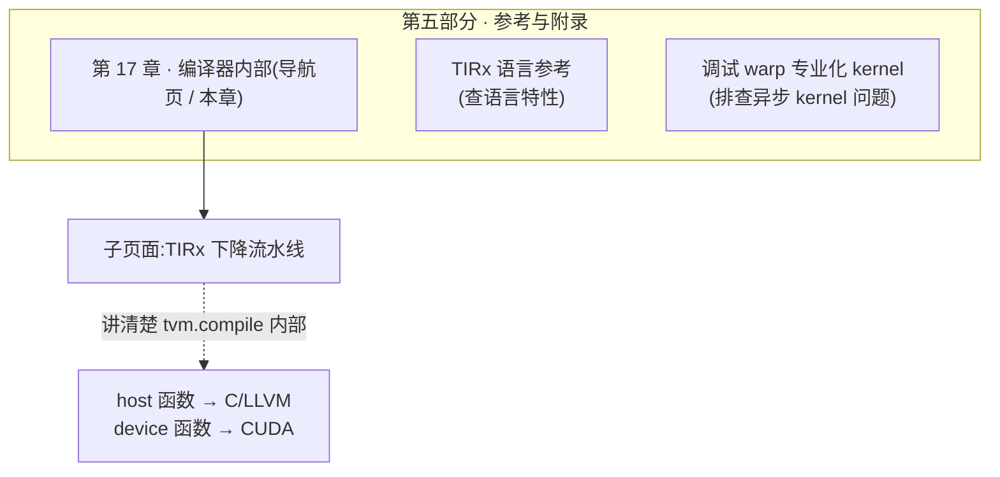
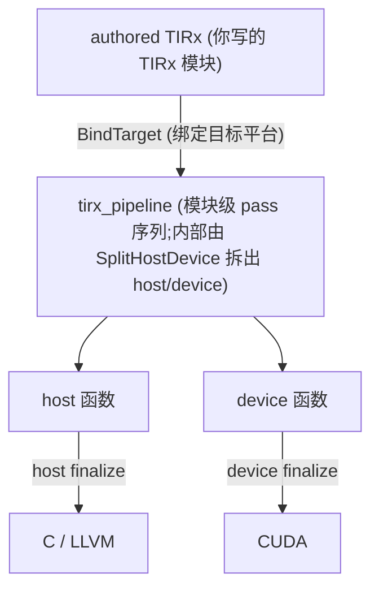

# 第 17 章 · 编译器内部(概览)

> 原文:[Compiler Internals](https://mlc.ai/modern-gpu-programming-for-mlsys/tirx_guide/arch/index.html)

> **本章要点(TL;DR)**
> - 先说清楚:这一章是个**导航页**(就像一本书的目录页,本身没多少干货,只负责把你领到该去的地方)。它放在「参考与附录」里,不是写给写 kernel 的人看的,是写给**想动手改 TIRx 编译器的人**看的。
>   - 这里先解释一个词:**kernel(核函数)**。它就是一段**专门跑在 GPU(显卡)上的计算程序**。你平时写的代码跑在 CPU 上;但有些活儿(比如海量数字一起算)CPU 干太慢,就把这段算法搬到 GPU 上跑,这段搬过去的程序就叫 kernel。本书的主线就是教你写 kernel。
> - 这章现在就指向一个有内容的子页面——**TIRx 下降流水线 / TIRx lowering pipeline**。它只回答一个问题:你敲下 `tvm.compile(..., tir_pipeline="tirx")` 那一刻,编译器内部到底干了些什么。(`tvm.compile` 你就理解成"把我写的高层代码编译成能在 GPU 上跑的东西"的那个按钮。)
> - 「下降 / lowering」是啥?说白了,就是把你写的那些**高层、好读**的东西,一层一层翻译成底层、贴近硬件的东西。打个比方,就像把一句中文先翻成英文、再翻成机器码——每翻一层就更接近机器、离人更远一点。
>   - 这里要"下降"的高层东西有三样,先混个脸熟(下文都会再细讲):**瓦片原语**(tile = 一个大矩阵切出来的小方块;瓦片原语就是"一口气搬运 / 计算一整块小方块"的高层指令,省得你一个数一个数地写)、**带 `TileLayout` 类型的缓冲区**(缓冲区 = 一块存数据的内存;`TileLayout` 是给这块内存标注的"摆放方式")、**执行作用域 id**(GPU 上成千上万个干活的小工同时跑,这个 id 用来回答"我是第几个工")。
>   - 它们最终被翻译成**两份函数**:**主机函数(host)**——跑在 CPU 上,负责"发号施令、把活儿丢给 GPU";**设备函数(device)**——真正跑在 GPU 上的那段计算。最后由 CUDA 后端吐出源码(CUDA 是 NVIDIA 显卡的官方编程语言,你可以把它想成"GPU 版的 C++")。
> - 这套翻译的总入口叫 `LowerTIRx`,它就干三件事:把瓦片原语派发成具体的后端实现;把布局算成真正的地址计算;把作用域 id 落到 `blockIdx` / `threadIdx` 上(这两个是 GPU 内置的变量,后面会讲,现在只要知道它们回答"我是第几个工")。
> - 这部分最值钱的地方在哪?它会教你**只跑流水线的前几步,然后一阶段一阶段地把 IR 打出来看**(IR = 编译器内部用的"中间代码",介于你写的高层代码和最终机器码之间的半成品)。这样编译器每一步干了啥,你是亲眼看见的,而不是靠脑补。

> **前置知识**:读这一章前,最好先懂 TIRx 的基础用法(瓦片原语、缓冲区,以及 `T.copy`/`T.gemm` 这种"拷一块数据 / 算一次矩阵乘"的高层写法,见第 9 章),还有 host/device(主机/设备,即"CPU 端发令"与"GPU 端干活"这两边)和 kernel 启动(launch,就是 CPU 喊一嗓子"GPU 开工",把一段计算正式发到 GPU 上跑起来)这些概念。没把握的话,先翻一下 [第 0 章 · 极简入门](./ch00_gpu_ml_primer.md)。本章会默认你已经认识这些词,所以会反复用到它们而不再从头解释。

---

## 17.1 这一页是什么:写给贡献者的入口

原文这一页的正文很短,其实就是一个**目录(index)**。它在书里归在「**第五部分 · 参考与附录**」,任务很单纯:把你领到「编译器内部」相关的那几个子页面去。

它跟前面 1–14 章不是一路货。前面那些章教你**怎么用**(怎么写 kernel),这一章讲的是**编译器自己怎么转的**(你写的代码进了编译器之后被怎么处理)。换句话说,前面是"用户手册",这一章是"发动机拆解图"。两边一对比就清楚了:

| 维度 | 主线章节(Part I–IV) | 本章「编译器内部」(Part V) |
| --- | --- | --- |
| 读者 | 想**写**高性能 GPU kernel 的人 | 想**改 / 扩展 TIRx 编译器本身**的贡献者 |
| 关注点 | 怎么用 API、怎么排布数据、怎么调性能 | kernel 源码在编译器里**如何被一步步翻译** |
| 阅读时机 | 从头顺着读 | 用到了再翻 |

> **关键**:你就把「编译器内部」当成一份**实现笔记 / 贡献者文档**来看,别当教程。不读它,你照样能写出能跑的 TIRx kernel。可一旦你心里冒出一个念头——"我写的这行 `T.copy`,最后到底被翻译成啥了?"——或者你想往编译器里塞一个新原语,那这里就是你该来的地方。

「参考」部分一共三个页面,分工很清楚。你想干啥,就翻对应那一页:

| 你的需求 | 去哪一页 |
| --- | --- |
| 查某个 TIRx 语言特性 | **TIRx 语言参考(TIRx Language Reference)** |
| 了解编译器内部(下降流水线) | **编译器内部(Compiler Internals)** ← 本章 |
| 调试异步 GEMM(矩阵乘法;深度学习里最核心、占用算力最多的运算就是它,所以是 GPU 的"头号主角")/ FlashAttention(一种把注意力算得又快又省内存的算子)的挂起、崩溃、结果错误或变慢 | **调试 warp(读作"沃普";一个 warp = 32 个线程绑在一起的"最小作业班",这 32 个线程必须步调一致地一起干活,见第 0 章)专业化 kernel(Debugging Warp-Specialized Kernels)** |

---

## 17.2 子页面一览:目前只有「TIRx 下降流水线」

这一页眼下就列了一个条目:

- **TIRx lowering pipeline / TIRx 下降流水线**

下面给你画张图,让你一眼看清它在整本书里待在哪儿,跟旁边那两个参考页又是什么关系。图里最右边那个框你先扫一眼就行:它说的是经过翻译后,host 函数最终变成 C/LLVM(给 CPU 跑的代码),device 函数最终变成 CUDA(给 GPU 跑的代码)——下文会反复讲到这条主线。



<p align="center"><em>图 17-1:本章在「参考」部分的位置,以及它指向的实质内容。</em></p>

> **注意**:导航页本身一点技术细节都没有,真东西全在子页面「TIRx 下降流水线」里。别急着翻过去——下面 17.3 先给你来一份速览,看完你心里就有数:要不要点进去深读。

---

## 17.3 速览:TIRx 下降流水线在做什么

> 这一节是子页面内容的**浓缩版导读**,先帮你抓住主干,再决定要不要点进去。想看每个 pass 一个一个怎么讲的,翻本仓库的第 18 章笔记。

### 一句话定位

> **一句话先理解**:你写的高层代码进了编译器后,会像在流水线上一样,经过一道又一道工序(每道工序改一点点),最后变成能在 GPU 上跑的源码。

先解释两个词,后面会一直用:

- **模块(module)**:你写好的那一整坨 TIRx 代码,打包成的一个对象,可以整体丢给编译器处理。把它想成"一个待编译的源文件"就行。
- **pass(译作"遍 / 处理趟")**:编译器里一个**只干一件事**的小处理步骤。它读进当前代码、改一处、再吐出来。一条流水线就是把几十个这样的小步骤**排好顺序**串起来,前一步的输出喂给后一步。这跟很多编译器的设计是一样的——把"大改写"拆成许多"小改写",每步可单独测试、单独看效果。

搞清这两个词,这段就好懂了:你一调用 `tvm.compile(mod, target, tir_pipeline="tirx")`,后面就连着发生一串事:你写好的 TIRx 模块(`mod`),被丢进一条**排好顺序的 pass 流水线**(也就是 `python/tvm/tirx/compilation_pipeline.py` 里那个 `tirx_pipeline`)。这条流水线把你那些高层写法翻成 host + device 两份函数,再扔给 CUDA 后端生成源码。`target` 是"编译目标",意思是"我要给哪种硬件编"(这里就是 `"cuda"`,即 NVIDIA 显卡)。

### 整体数据流



<p align="center"><em>图 17-2:编译先 <code>BindTarget</code> 绑定目标,再跑模块级 <code>tirx_pipeline</code>(host/device 的拆分发生在流水线内部),最后按函数种类分别做收尾(finalization)并渲染:host 出 C/LLVM,device 出 CUDA。</em></p>

### 三个值得记住的关键阶段

整条流水线有十几个 pass。它们的名字你现在完全不用记,但我顺手用大白话点一下,免得你看到这些词发慌:**narrow dtype**(把数据用更省空间的小类型存,省内存)、**向量化 vectorization**(把"一个一个数地算"改成"一次算一小批",更快)、**循环展开 loop unrolling**(把循环体复制几份铺开,减少循环本身的开销)、**CSE**(公共子表达式消除,算过一次的东西不重复算)、还有一堆 **fp8 / bf16 合法化**(fp8、bf16 都是比常规 32 位浮点更小的数字格式;"合法化"就是把它们改写成目标硬件真正支持的形式)。

这些你不用全记。想搞懂 lowering 到底是怎么回事,盯死下面这三步就够了:

| 关键阶段 | 它把什么变成了什么 |
| --- | --- |
| **`LowerTIRx`** | 整个下降的核心。它里头分两半:`TilePrimitiveDispatch` 和 `LowerTIRxCleanup`。**前一半**把每个瓦片原语(`copy` 拷贝 / `gemm` 矩阵乘 / `reduction` 归约——归约就是"把一堆数合成一个",比如求和、求最大值)换成你选定的那个后端的具体代码(同一句 `T.gemm`,在不同硬件上要翻成不同的底层实现,这一步就是按你的硬件挑对实现)。**后一半**跑 `LayoutApplier`,干三件事:① 把 `TileLayout` 类型的缓冲区访问算成真正的内存地址——也就是把"我要第 (i, j) 个元素"这种坐标,换算成"它在内存第几个字节"的真实地址(公式 `addr = data + elem_offset + layout.apply(coord)`:起始地址 + 偏移 + 按布局把坐标折算成位置);② 把缓冲区展平(把多维数组拉成一条直线的一维内存,因为底层内存本来就是一条直线);③ 把执行作用域 id(`T.cta_id` / `T.thread_id`,即代码里"我是第几个工"的高层写法)经过 `launch_thread` 落到 `blockIdx` / `threadIdx` 上。**`blockIdx` / `threadIdx` 是 GPU 内置的两个变量**:GPU 干活时会同时拉起海量线程,这些线程先分成一个个"线程块(block)",每块里再装一堆线程;`blockIdx` 告诉每个线程"你属于第几块",`threadIdx` 告诉它"你是块里第几个"。靠这两个编号,每个线程才知道自己该处理数据的哪一小块。 |
| **`SplitHostDevice`** | 它在 `launch_thread` 这个边界上"下刀",把一个 kernel 劈成两半。为什么要劈?因为一段 GPU 程序天然就有两部分职责:一部分在 CPU 上"指挥",一部分在 GPU 上"干活",编译到最后必须分成两份。劈出来的是:**host 函数**(跑在 CPU 上,负责算 grid / block——也就是"这次启动要开多少个线程块、每块多少线程",算好后正式发起启动)和 **device 函数**(真正跑在 GPU 上的那段计算,在 CUDA 里就是带 `__global__` 标记的那个函数体;`__global__` 是 CUDA 用来标记"这个函数是给 GPU 跑的"的关键字)。 |
| **`MakePackedAPI`** | 它把 host 函数改写成 TVM 规定的那套统一调用格式(packed-func ABI)。这里的 **ABI** 是"二进制层面的调用约定"——简单说就是"参数怎么传、按什么格式打包"的硬性规矩;TVM 要求所有函数都按同一套规矩对外暴露,这样上层才能用统一的方式调起它们。改完之后,这个 host 函数就是最终被调起来的那个"启动器"(你在 Python 里一调用,实际跑的就是它)。 |

> **关键**:`LowerTIRx` 一跑完,模块就"掉回"普通 TIR 了。啥意思?就是说瓦片原语没了,`TileLayout` 那层间接也没了,作用域 id 也变成真正的线程轴了。换句话说,高层那些花活儿到这一步全翻译完了。再往后的 pass,无非是在普通 TIR 上做些常规优化和合法化,没别的了。

### 你能自己把每一步复现出来

子页面里最实用的一招,就是教你**只手动跑流水线最前面那几步**,然后一阶段一阶段把 IR(编译器的中间代码,前面解释过)打出来看。为什么这么干?因为整条流水线一口气跑完,中间发生了啥你根本看不见,等于黑盒;而你手动一步一步跑,每跑一步打印一次,就能**亲眼盯着代码被怎么改**。书里那些 IR 片段,就是这么一步步生出来的。

下面这段代码我逐行讲给你听(你会编程,但这些函数是 GPU 编译器专有的,先不认识很正常):

```python
from tvm.tirx import transform as TT

target = tvm.target.Target("cuda")
# 绑定目标(host 用 llvm),得到待编译模块
mod = TT.BindTarget(target.with_host("llvm"))(tvm.IRModule({"main": scale}))
mod = TT.LowerTIRx()(mod)   # 只跑核心下降:派发瓦片原语、应用布局
print(mod.script())         # 打印下降后的 TIRx IR,直观看到变化
```

逐行翻译:

1. `from tvm.tirx import transform as TT`——把那些 pass(每个 pass 都是一个能改写代码的工具)所在的模块导进来,起个短名 `TT`,方便后面写。
2. `target = tvm.target.Target("cuda")`——声明"我要编给 NVIDIA 显卡(cuda)"。
3. `TT.BindTarget(target.with_host("llvm"))(...)`——`BindTarget` 是流水线的第一道 pass:把"目标硬件"信息绑到模块上,顺便指定 host 那一半用 `llvm` 编(LLVM 是个通用的编译器框架,这里用它来生成 CPU 端代码)。注意写法 `Pass(参数)(mod)`:`TT.BindTarget(...)` 先造出一个 pass,后面那个 `(tvm.IRModule({"main": scale}))` 才是把模块喂进去真正跑;`tvm.IRModule({"main": scale})` 就是把名叫 `scale` 的那个 kernel 包成一个模块。
4. `mod = TT.LowerTIRx()(mod)`——只跑核心那一步 `LowerTIRx`(就是上面表里讲的"派发瓦片原语 + 应用布局 + 落地线程轴"),把结果存回 `mod`。
5. `print(mod.script())`——把当前模块以人类可读的形式打印出来。跟上一步打印的结果一对比,你就能看见 `LowerTIRx` 到底改了啥。

要是你不关心中间过程,只想直接看**最后生成的 CUDA 源码**长啥样,那就别手动一步步跑了,一把梭把整条流水线跑完:

```python
# 完整编译,指定走 tirx 流水线
exe = tvm.compile(tvm.IRModule({"main": scale}), target=target, tir_pipeline="tirx")
print(exe.mod.imports[0].inspect_source())   # 打印生成的 CUDA 源码
```

逐行翻译:

1. `tvm.compile(..., tir_pipeline="tirx")`——这就是开头说的那个"编译按钮",`tir_pipeline="tirx"` 指定走 TIRx 这条流水线。它会把上面所有 pass 一口气全跑完,产出一个可执行对象 `exe`。
2. `exe.mod.imports[0].inspect_source()`——从产物里把 device 那一份(也就是真正跑在 GPU 上的部分)的源码掏出来打印。你会看到一段实打实的 CUDA(GPU 版 C++)代码,这就是你那段高层 TIRx 被翻译到最底层的最终样子。

> **注意**:`LowerTIRx()(mod)` 这种"单跑一段"的玩法,是你排查问题、摸清编译器脾气的利器。想看哪一步的结果,就在那一步前后各 `print(mod.script())` 一次,前后一对比,变了什么一目了然。

---

## 17.4 建议的阅读顺序

1. **先看看你是不是这章的目标读者**。要是你只想写写 kernel、调调性能,这部分先跳过没关系。等哪天你心里冒出"怎么编译出来是这副样子"的疑问,再回头看也来得及。
2. **从这一页(本章)进**,先把一件事搞清楚:「编译器内部」眼下就讲了下降流水线这一个主题,别的还没有。
3. **认真读子页面「TIRx 下降流水线」(也就是本仓库第 18 章笔记)**。把 pass 表按顺序过一遍,重点啃这三个关键阶段:`LowerTIRx`(尤其是里头的 `TilePrimitiveDispatch` 和 `LayoutApplier`)、`SplitHostDevice`、`MakePackedAPI`。
4. **自己动手跑一遍**。拿原文那个就一行的 `scale` kernel(scale = 把每个数乘上一个倍数,够简单,适合拿来观察),自己走一遍 `BindTarget → LowerTIRx`,每跑一步就 `print(mod.script())`,把脑子里的"概念"跟屏幕上的"真实 IR"一一对上。看一遍,胜过读十遍。
5. **要用了再横跳**。要排查异步 kernel 的问题,就转去「调试 warp 专业化 kernel」;只是查个语言特性,就转去「TIRx 语言参考」。

---

## 小结

- 第 17 章自己就是「参考与附录」里的一个**导航页**,写给**编译器贡献者**,不是给写 kernel 的人看的。
- 它眼下就指向一个有内容的子页面:**TIRx 下降流水线**,把 `tvm.compile(..., tir_pipeline="tirx")` 内部那一整套翻译过程讲清楚。
- 下降是怎么回事,一句话:把**瓦片原语 + `TileLayout` 缓冲区 + 执行作用域 id**,过一串排好顺序的 TIR pass,翻成 **host(启动器)和 device(`__global__` 体)** 两份函数,最后渲染成 CUDA。
- 最关键的三个阶段:`LowerTIRx`(派发原语 + 应用布局 + 落地线程轴)、`SplitHostDevice`(主机/设备拆分)、`MakePackedAPI`(打包 ABI)。
- 最实用的一招:**只跑流水线前几步,再 `print(mod.script())`**,这样你就能一阶段一阶段"看见"编译器到底在干什么。

## 延伸阅读

- 原文(本导航页):<https://mlc.ai/modern-gpu-programming-for-mlsys/tirx_guide/arch/index.html>
- 子页面「TIRx 下降流水线」:对应本仓库第 18 章笔记;原书路径在同一 `tirx_guide/arch/` 目录下。
- 完整的 `tvm.tirx` Python API,请参阅上游 TVM 官方文档。
- 相关参考页:「TIRx 语言参考」「调试 warp 专业化 kernel」(均在本书「参考与附录」部分)。

## 术语对照

| 中文 | English |
| --- | --- |
| 下降流水线 | lowering pipeline |
| 瓦片原语 | tile primitive |
| 主机函数 / 设备函数 | host function / device function |
| 执行作用域 id | execution-scope id |
| 收尾(阶段) | finalization |
| 打包函数 ABI | packed-func ABI |
| 布局应用器 | LayoutApplier |
| 编译目标 | target |
