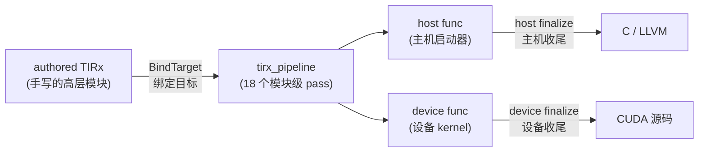
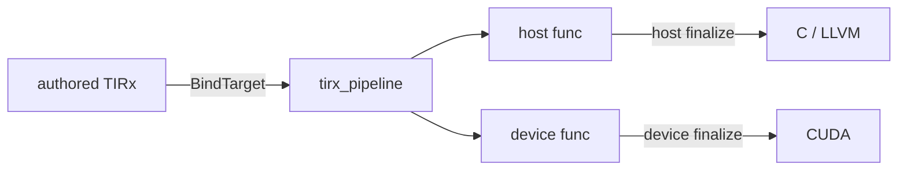
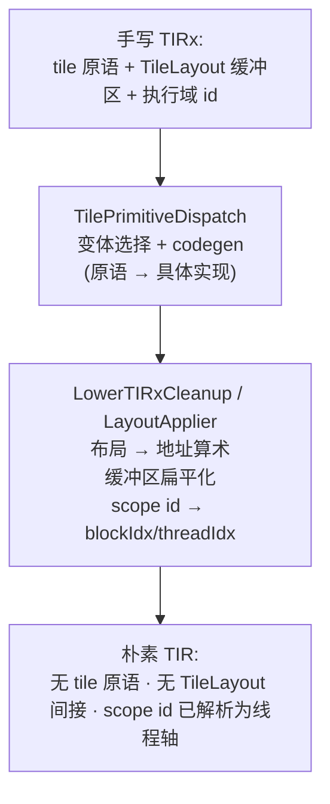
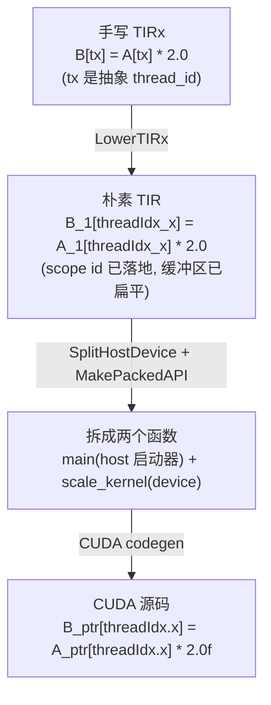

# 第 18 章 · TIRx Lowering 流水线

> 原文:[TIRx lowering pipeline](https://mlc.ai/modern-gpu-programming-for-mlsys/tirx_guide/arch/lowering_pipeline.html)

> **本章要点(TL;DR)**
> - 你写的 TIRx 代码很"高层"(只说大概要干啥,不抠硬件细节),但 GPU 这块芯片看不懂这种高层写法。**TIRx 流水线 / tirx pipeline** 就是一条"翻译流水线",负责把你写的高层代码一步步翻译成 GPU 真能执行的样子。
> - 整条路径其实很顺:手写的 TIRx →(告诉它目标芯片是谁)→ 跑一长串翻译步骤 → 把代码拆成 host(在 CPU 上跑的部分)和 device(在 GPU 上跑的部分)→ 两部分各自做收尾 → 最终吐出 C/LLVM 代码和 CUDA 代码。
> - 这里先解释两个词:**host(主机)= CPU 那边**,负责"指挥"——准备数据、下命令让 GPU 开工;**device(设备)= GPU 那边**,负责"干苦力"——真正的大规模计算。一段任务往往是 CPU 先做准备、再把重活甩给 GPU,所以代码天然分成这两半。
> - 流水线一共 **18 个 pass(pass = 编译器里的"一道处理工序",每个 pass 读入代码、改一改、再交给下一个)**,从最核心的 `LowerTIRx` 开始,后面依次做:合并线程绑定、化简、缓冲区扁平化、数据类型合法化、向量化、循环展开、消除重复表达式、拆分 host/device、生成调用接口等。这些名词现在看不懂没关系,后面会一个个用大白话讲。
> - 其中 `LowerTIRx` 自己又拆成两小步:第一步把高层算子(tile 原语)展开成具体实现,第二步把"数据该摆在内存哪个位置"的抽象描述算成真实的内存地址,并把"谁来执行这段活"翻译成 GPU 听得懂的 `blockIdx` / `threadIdx`(后面会讲这俩是啥)。
> - 一个很实用的点:你可以**只跑流水线的前半段**(比如只跑到 `LowerTIRx`),然后用 `mod.script()` 把中间结果打印出来看一眼。本书里那些中间代码片段,都是这么生出来的。

> **前置知识**:这一章会用到几个词,这里先一句话说清,你心里有个底就行——
> - **TIR**:TVM 这个编译框架里的一种"中间表示",可以理解为介于"你写的高层代码"和"最终机器码"之间的一种代码形态。
> - **pass**:编译器里的一道处理工序(上面解释过了)。
> - **host / device**:CPU 端 / GPU 端(上面解释过了)。
> - **grid / block / thread(网格 / 块 / 线程)**:GPU 干活时不是一个人埋头算,而是召集成千上万个 **thread(线程)** 同时算;这些线程会被分组成一个个 **block(块)**;所有块合起来叫一个 **grid(网格)**。把它想成"军队":一个士兵是 thread,一个班是 block,整支队伍是 grid。
>
> 没把握的话,先翻一下 [第 0 章 · 极简入门](./ch00_gpu_ml_primer.md),以及第 17 章。本章会默认你已经认识这几个词,后面用到时不再从头解释。

---

## 18.1 这条流水线解决什么问题

先看看我们手上拿着什么。在 TIRx 里,你写的代码站得很"高"——只说大意,不抠细节。

> **一句话先理解**:你要写的是一个 **kernel**。kernel 就是"一段要在 GPU 上跑的函数",但它的特别之处是:它不是被调用一次执行一次,而是被成千上万个线程**同时各跑一遍**(每个线程算其中一小块数据)。这是 GPU 干活的基本方式——人海战术。

描述一个 kernel,你拿三样东西就够了:

- 用 **tile 原语 / tile primitive** 说清楚"要算什么"。tile 原语就是一组现成的"积木操作",比如 `copy`(搬数据)、`gemm`(矩阵乘——也就是两个矩阵相乘;它是深度学习里出现最频繁、最吃算力的运算,所以 GPU 里它是绝对主角)、`reduction`(把一堆数归并成一个,比如求和、求最大值)。你直接拿这些积木拼,不用自己从头写循环。
- 用带 `TileLayout` 类型的缓冲区说清楚"数据怎么摆"。**缓冲区**你就理解成"一块数组/内存";`TileLayout` 则是给这块数据贴的一张"摆放说明",描述数据在内存里按什么规律排列(后面会讲为什么 GPU 很在乎这个)。
- 用 **执行域 id / execution-scope id**(像 `T.cta_id`、`T.thread_id`)说清楚"谁来干"。说白了就是给每个线程发个工号,让它知道"我是第几号,该负责哪一小块"。

这么写当然省事,可问题来了:GPU 根本看不懂这套高层积木。GPU 后端(就是最后把代码变成 GPU 能跑的东西的那个部件)只认**最朴素的 TIR**——也就是:具体到每根线程轴、把多维数组压成一维的内存访问、以及它原生就支持的那几种数据类型。换句话说,它只吃"嚼碎了的、贴着硬件的"代码,不吃你那套高层抽象。

那怎么办?这就得靠 **lowering(下降)流水线**了。先说"lowering"这个词:它字面是"降低/下降",在编译里专指"把高层、抽象的代码,一级一级往低层、贴硬件的方向翻译"。为什么叫"下降"?因为你可以把代码想象成有"楼层":越高层越抽象、越接近人的思维,越低层越具体、越接近机器。lowering 就是带着代码一层层往下走楼梯,直到走到硬件那一层。

所以这条流水线干的活,就是把上面那套高层写法一步步"压"下去,压成 GPU 跑得动的朴素形式。入口特别简单,就一行:

```python
tvm.compile(mod, target, tir_pipeline="tirx")  # 指定使用 tirx 流水线
```

这一行背后发生了什么?它把你手写的 TIRx 模块塞进 **tirx 流水线**,过一遍那一长串处理步骤,把它劈成 **host(主机,CPU 端)** 和 **device(设备,GPU 端)** 两类函数,最后丢给 CUDA 后端去吐源码。(CUDA 是 NVIDIA 给自家 GPU 编程用的那套语言/工具,你可以把"生成 CUDA 源码"理解成"生成 GPU 真正能编译执行的代码"。)

> **关键**:流水线的定义在 `python/tvm/tirx/compilation_pipeline.py` 里,函数名叫 `tirx_pipeline`。说白了,看懂这条流水线,就等于看懂了"高层的 tile 写法是怎么一步步变成 CUDA kernel 的"。它是整个 TIRx 编译栈的主干。

---

## 18.2 它处在编译流程的哪个位置

`tvm.compile` 干的活,拆开看就是四步:

1. **绑定目标 / BindTarget**:先跟模块交代清楚"咱们要往哪种硬件上编"——比如计算部分的目标是 `cuda`(NVIDIA GPU),指挥部分(host)用 `llvm`(一套通用的编译器后端,这里就当它是"把代码编成 CPU 能跑的东西"的工具)。为什么要先说清楚目标?因为后面每一步翻译,都得先知道"最终是给谁跑的",才知道该往哪个方向翻——给 GPU 翻和给 CPU 翻,做法完全不同。
2. **跑 tirx 流水线**:就是 18.3 节要一个个列出来的那一长串步骤。
3. **给 host / device 函数各做各的收尾(finalization)**:finalization 就是"末段收尾工序"。注意,host 和 device 用的是**两套不一样**的收尾步骤——因为 CPU 端和 GPU 端要处理的事情根本不一样。
4. **把每个 device 函数交给 CUDA 代码生成器**,生成最终给 GPU 跑的源码。

那为什么 host 和 device 要分开收尾?别急,下面这张图先把整条主干画出来,看完你就明白了。



> **注意**:这里有个容易误会的点——host 和 device 不是一上来就分成两家的。流水线跑到 `SplitHostDevice` 这一步(也就是 18.3 节的第 15 个 pass)之前,整个 kernel 一直是**一个**函数,CPU 部分和 GPU 部分还混在一起;到了这一步,它才被"劈"成 host 和 device 两半,然后各回各家、各做各的收尾。收尾为什么要"按函数种类分着跑",原因就在这——分家之后,两边要做的事不一样了。

下面这张图讲的是同一件事,只是画得更紧凑、横着排:



---

## 18.3 流水线的 18 个 pass(逐个看)

`tirx_pipeline` 会**严格照下面这个顺序**,一个接一个地把这些步骤施加上去——就像一条工厂流水线,工件从第一个工位传到最后一个工位,每个工位干一道活。其中有几个步骤能用 `PassContext` 的开关关掉(`PassContext` 你就理解成"编译时的一个配置开关箱",用到了会说)。先拿一张表整体扫一眼,**不用记,有个印象就够了**,关键的几个后面会单独展开讲。

| # | Pass 名称 | 它做什么 | 备注 |
| --- | --- | --- | --- |
| 1 | `LowerTIRx` | **核心下降**——把 tile 原语和布局抽象解析掉(详见 18.4 节) | 流水线的"重头戏" |
| 2 | `UnifyThreadBinding` | 合并等价的线程轴绑定,保证每个 `threadIdx` / `blockIdx` 轴只声明一次 | 去重 |
| 3 | `StmtSimplify` | 语句级算术化简(由 arith 分析器 / arith analyzer 完成) | 第一次化简 |
| 4 | `LowerTIRxOpaque` | 把剩余的不透明(opaque)TIRx 结构下降为朴素 TIR | 收尾性下降 |
| 5 | `FlattenBuffer` | 把多维的 `BufferLoad` / `BufferStore` 扁平化为一维 | 多维 → 1D |
| 6 | `BF16ComputeLegalize` | 把 `bfloat16` 计算改写成合法形式(上转为 f32 再算) | 计算合法化 |
| 7 | `NarrowDataType(32)` | 在能证明安全的地方,把算下标、循环计数用的数字从 64 位缩成 32 位 | 省资源、更快 |
| 8 | `VectorizeLoop` | 把标了 `T.vectorized` 的循环变成"一次处理一批数据"的向量操作 | 配 `tir.disable_vectorize` 时跳过 |
| 9 | `UnrollLoop` | 展开标了 `T.unroll` 的循环(以及次数很小的循环)——把循环体直接复制几份铺开 | 循环展开 |
| 10 | `StmtSimplify` | 再次化简——此时向量化/展开已暴露出新的常量 | 第二次化简 |
| 11 | `CommonSubexprElim` | 公共子表达式消除(CSE),把重复子表达式提到临时变量 | 配 `tir.disable_cse_tir` 时跳过 |
| 12 | `FP8ComputeLegalize` | 把 `float8` 计算改写成合法形式 | 计算合法化 |
| 13 | `VerifyMemory` | **安全闸门**:检查 host 端代码没有直接解引用 device 内存 | 校验,不改写 |
| 14 | `AnnotateEntryFunc` | 把那个唯一的 PrimFunc 标记为模块入口 | 标注 |
| 15 | `SplitHostDevice` | 在 `launch_thread` 边界把每个 kernel 拆成 **host** 函数 + **device** 函数 | **关键分水岭** |
| 16 | `MakePackedAPI` | 把 host 函数改写成打包函数(packed-func)ABI,即 TVM 调用的启动器 | 生成调用接口 |
| 17 | `FP8StorageLegalize` | 合法化 `float8` 的**存储**(打包进受支持的容器类型) | 存储合法化 |
| 18 | `BF16StorageLegalize` | 合法化 `bfloat16` 的**存储** | 存储合法化 |

### 几个"为什么这么排"的小细节

这串步骤的排法可不是随手摆的。挑几个最值得琢磨的点说说:

先解释这里会反复出现的两个优化词,后面看着就不懵了:

- **向量化(vectorize)**:GPU(和现代 CPU)支持"一条指令同时处理一批数据"——比如本来要分 4 次给 4 个数各加 1,向量化之后一次就把这 4 个数一起加完。把它想成"打包批处理",能少发好几条指令,自然更快。
- **循环展开(unroll)**:把一个循环体直接复制几份铺平,省掉"判断要不要再转一圈"的开销。比如一个跑 4 次的循环,展开后就变成把循环体原地写了 4 遍、没有循环了。代价是代码变长,所以一般只对次数小的循环这么干。

好,接着看排序里的讲究:

- **化简(`StmtSimplify`)为什么来两遍?**(第 3、第 10)不是手抖写重了。第一遍,是把 `LowerTIRx` 翻完之后留下的一堆零碎算术清理干净;第二遍,是专门收拾向量化(第 8)和循环展开(第 9)之后又冒出来的那些常量和能化简的结构(展开循环时,原来的循环变量会被换成一个个具体数字,于是又出现了一批可以提前算好的式子)。说白了就是:**先把东西摊开,再统一打扫一遍**——编译器排步骤,常用这个套路。

- **数据类型合法化为什么拆成"计算"和"存储"两拨,中间还隔得老远?** 先说"数据类型合法化"是干嘛的:`bfloat16`、`float8` 是两种"位数很少"的小号浮点数(分别是 16 位、8 位;用得少的位数换更省内存、更快,深度学习里很流行)。但很多 GPU 并不直接支持拿它们做加减乘除,所以编译器得把这些运算"改写"成芯片真支持的形式——这就叫合法化(legalize,即"改成合法、能跑的样子")。它又分两种:**计算合法化**(第 6、第 12,改的是"怎么算",通常是先转成普通的 32 位浮点算完再说)放在前头,因为改写计算会带出新的算术,得留给后面的化简、向量化接着收拾;**存储合法化**(第 17、第 18,改的是"怎么在内存里存放这些小数")则压到**最后**,等 host/device 拆完才动手——存储这事更贴近"数据在内存里到底怎么摆"的物理细节,属于收尾性质的活,搁最后最合适。

- **`NarrowDataType(32)`(第 7)是个性能优化。** 先补一句背景:程序里算数组下标、数循环次数,用的都是整数;整数有 64 位和 32 位之分,位数越大越占地方、越慢。GPU 上这类算下标的活极多,只要 32 位装得下,就能省下宝贵的**寄存器**(register——线程私有的、速度最快的一小块存储,相当于 CPU 的寄存器,但 GPU 上每个线程各有一份、数量很有限,所以特别金贵)、跑得更快。但它守着一条底线:**只有在能证明绝对安全的时候才缩**。不然万一数字超出 32 位能表示的范围(溢出),下标就算错了,直接读写到不该碰的内存(越界),程序就崩了。这就是典型的"能优化就大胆优化,但兜底必须有、还得证得出来"。

- **`VerifyMemory`(第 13)只检查、不改代码。** 它是一道**安全闸门**(safety gate)。这里要先理解一件 GPU 的硬规矩:CPU 和 GPU 各有各的内存,CPU 的代码不能直接去读写 GPU 的内存(反之亦然),想交换数据得走专门的通道。`VerifyMemory` 就趁 host/device 还没拆开,盯着一件事:host(CPU)代码有没有违规地直接去碰 device(GPU)的内存。为什么非得放在 `SplitHostDevice`(分家那一步)前面?就为了**早点把问题拦下来**——在还能看清全貌的时候就把违规揪出来,别等分完家、出了事才追悔。

- **有两个步骤能用开关关掉**:`VectorizeLoop`(对应开关 `tir.disable_vectorize`)和 `CommonSubexprElim`(对应 `tir.disable_cse_tir`),都能靠 `PassContext` 跳过。调试的时候,或者你想亲眼对比一下"开和关到底差在哪",这俩开关特别趁手。

### Finalization(收尾)pass——按函数种类分别跑

前面提过,`SplitHostDevice` 把函数劈成 host 和 device 两类。劈完之后,收尾阶段会给它俩各上**一套不一样**的步骤(下表里 `→` 表示"先做这个再做那个"): 

| 函数种类 | 收尾 pass 序列 | 说明 |
| --- | --- | --- |
| **host(主机)** | `LowerTVMBuiltin` → `LowerIntrin` | 先把 `tvm_*` 这类 TVM 自己的内建函数(builtin)翻成实际实现,再把"针对具体硬件的特殊指令"(intrinsic)落到目标平台上 |
| **device(设备)** | `LowerWarpMemory` → `StmtSimplify` → `LowerIntrin` | 先把"warp 范围内共用的缓冲区"翻成 shuffle 指令(下面解释),再化简一遍,最后同样把硬件特殊指令落地 |

这里出现了两个词:**builtin(内建函数)** 指 TVM 框架提供的一些标准辅助函数;**intrinsic(内建指令)** 指某款硬件特有的、能一条指令干一件特殊事的指令。把它们"下降"就是把这些占位的高层调用,换成目标平台上真正能跑的东西。

> **关键**:`LowerWarpMemory` 这一步是 device 端独有的,这里得先把 **warp** 讲清楚。GPU 里那一大堆线程,执行时并不是各自完全独立,而是 **32 个一组捆在一起、迈同一步同时执行**,这一组 32 个线程就叫一个 **warp(线程束)**。打个比方:warp 就像一个 32 人的方阵,口令一响,32 个人必须同时迈同一只脚——这是 GPU 硬件层面的执行单位。
>
> 既然一个 warp 里 32 个线程总在一起行动,它们之间常常需要互相交换数据。`LowerWarpMemory` 干的,就是把"这 32 个线程共用的一块小缓冲区"翻成 **shuffle 指令**。shuffle 是个啥?说白了,就是同一个 warp 里的线程,在**寄存器**(register——前面讲过,线程私有、最快的那层存储)这一层**直接把数据递给隔壁线程**,不用先写进 **共享内存(SMEM)**、再读出来绕一大圈。
>
> 顺便把内存的"快慢分层"也点一下(这是 GPU 的一个核心常识):GPU 的存储是分层的,越靠近线程越快但越小——**寄存器**最快(线程私有)、**共享内存 SMEM** 次之(同一个 block 里的线程共用的一小块片上内存,可以理解成一块"由你手动管理的高速缓存")、**全局内存**最慢但最大(所有线程都能访问的大仓库)。所以"能在寄存器层面直接互递,就别绕道 SMEM"——这就是 shuffle 快的原因,也是 GPU 上很常见的高效数据交换招数。host 端没有这一步,因为 CPU 上压根就没有 warp 这回事。

---

## 18.4 深入 `LowerTIRx`:核心下降是怎么发生的

第 1 个步骤 `LowerTIRx` 是整条流水线的"重头戏",绝大部分翻译活儿都堆在这里。它自己其实又是两个小步骤接在一起跑,代码在 `src/tirx/transform/lower_tirx.cc`: 

```python
# LowerTIRx 内部其实是两个子 pass 的顺序组合
LowerTIRx = Sequential([ TilePrimitiveDispatch, LowerTIRxCleanup ])
```

逐行说一下这段在干嘛:`Sequential([...])` 的意思是"把方括号里这几个 pass 串成一条小流水线,从左到右依次执行"。所以这一行就是说:`LowerTIRx` = 先跑 `TilePrimitiveDispatch`,再跑 `LowerTIRxCleanup`。这两步分工很清楚:

### (1) `TilePrimitiveDispatch`——把高层算子换成具体实现

> **一句话先理解**:你写 `gemm` 的时候,只是写了"这里要做个矩阵乘",就像写下一个函数名;但这个函数还没有"身体",它具体怎么算、用哪条 GPU 指令,得这一步来填。

你写的每个 `copy`、`gemm`、`reduction`(它们在底层都是一种叫 `TilePrimitiveCall` 的东西,就是"调用一个 tile 原语"),其实只是个"调用",并没有真身。这一步干的,就是把每一个这样的调用,**换成它在当前这块 GPU 上的真实函数体**。具体两件事:

- **变体选择 / variant selection**:同一个算子,换块 GPU 可能有好几种写法(不同型号的 GPU,擅长的指令不一样)。这一步挑出最合适当前硬件的那一种。比方说 `gemm`,GPU 架构不同,跑得最快的指令路径就可能不同——新卡上可能有专门加速矩阵乘的指令,老卡上就只能用普通做法。
- **代码生成 / codegen**:把上一步选中的那个实现,展开成真正的、一条条的 TIR 语句。

打个程序员熟悉的比方:这就像把一个函数调用做 **inline 内联展开**——不再"调用某函数",而是把那个函数的代码体直接原地铺开,而且铺的是"这台机器上跑得最快的那一版"。

### (2) `LowerTIRxCleanup`——用 `LayoutApplier` 把抽象落地

这一步会跑 **`LayoutApplier`(布局施加器)**。前面那些虚的、抽象的东西,到这儿就得全变成实打实的细节。它做三件事:

1. **把布局访问换成真实的地址计算**:回想一下,前面你访问一个带 `TileLayout` 的缓冲区时,只写了个坐标(比如"我要第 (3, 5) 个元素"),并没有说"这个元素在内存的第几个字节"。但内存其实是一条**一维的**长带子,只认"从头数第几个"这种线性地址。所以这一步要做的,就是把你写的坐标,按那张"摆放说明"(TileLayout)算成具体的内存地址。核心公式是: 

   ```text
   addr = data + elem_offset + layout.apply(coord)
   ```

   公式不用背,记住是三样东西相加就行:基址 `data`(这块数据从内存哪儿开头)+ 元素偏移 `elem_offset`(这块缓冲区在更大那块内存里的起点)+ `layout.apply(coord)`(把你给的坐标喂给那张摆放说明,算出"再往后挪多少个")。三样加起来,就是这个元素在内存里的确切落点。一句话:**`TileLayout` 那层"绕来绕去"的抽象,在这一步被彻底拆光,变成干干净净的地址加法。**

2. **缓冲区扁平化**:把多维缓冲区(比如二维的"矩阵")压成一维(一条长带子),这样就能直接按上面算出来的地址去取数。

3. **把执行域 id 变成真实线程轴**:还记得前面给每个线程发的"工号"(`T.cta_id`、`T.thread_id`)吗?它们现在靠 `launch_thread` 翻成 GPU 真正认识的内置变量 `blockIdx`、`threadIdx`。这俩是 GPU 里每个线程都能读到的"我是谁"——`blockIdx` 告诉线程"我属于第几个 block",`threadIdx` 告诉它"我在 block 里是第几号"。线程就是靠这两个号,算出自己该处理哪一块数据的。

下面这张图,把 `LowerTIRx` 这两步"吃进去什么、吐出来什么"画清楚了: 



> **关键**:`LowerTIRx` 一跑完,模块就成了**朴素 TIR**——tile 原语没了,`TileLayout` 那层抽象没了,执行域 id 也全落成了真实线程轴。后面那 17 个步骤对着的,都是这种"已经落了地"的 TIR。也正因为前面把 TIRx 特有的那些东西都消化干净了,后面才能直接拿 TVM 现成的通用步骤(化简、向量化、CSE 这些)来用,不用再单独为 TIRx 另写一套。

---

## 18.5 一个完整的小例子:scale kernel 的下降全程

前面概念铺得有点多,这里拿一个最简单的例子,把它们都串起来——一个只有一行计算的缩放(scale)kernel,功能简单到一句话:**把数组里每个数乘以 2**。我们就看它怎么一路从高层 TIRx 变成 CUDA。

### 起点:手写的 TIRx

```python
@T.prim_func
def scale(A_ptr: T.handle, B_ptr: T.handle):
    A = T.match_buffer(A_ptr, (256,), "float32")        # 把传进来的句柄绑成"256 个 float32 的数组" A
    B = T.match_buffer(B_ptr, (256,), "float32")        # 同样,绑出输出数组 B
    T.device_entry()                                     # 声明:从这里开始是 GPU 上跑的入口
    bx = T.cta_id([1])                                   # 安排 1 个 block(块);bx 是块的工号
    tx = T.thread_id([256])                              # 安排 256 个线程;tx 是线程的工号
    B[tx] = A[tx] * T.float32(2.0)                       # 真正的计算:第 tx 号线程负责算 B 的第 tx 个数
```

逐行说一下这些没见过的写法:`@T.prim_func` 是个装饰器,标明"下面这个函数是一段 TIR 代码"(装饰器你写 Python 应该熟,就是给函数加个标签/包装)。`T.match_buffer` 把一个裸句柄(`T.handle`,可以理解成一个指向内存的指针)绑成一个有形状、有类型的数组——这里是 256 个 `float32`(32 位浮点数)。`T.cta_id([1])` / `T.thread_id([256])` 就是前面说的"发工号":一共 1 个块、256 个线程。

最关键的是最后一行:`B[tx] = A[tx] * 2.0`。注意这里**没有循环**!因为有 256 个线程,每个线程的 `tx` 不一样(0 到 255),它们**同时各算一个**——0 号线程算 `B[0]`,1 号算 `B[1]`……256 个数一瞬间全算完。这就是 GPU"人海战术"的写法:你只写一个线程该干的活,硬件帮你复制 256 份并行跑。

看一眼此刻的状态:`bx`、`tx` 还是**抽象的工号(执行域 id)**,还没变成 GPU 真认识的线程轴;`A`、`B` 也还是带类型、带形状的数组视图。接下来,咱们就盯着这几样东西,看它们怎么一步步落地。

### 经过 `LowerTIRx` 之后:scope id 变成真实线程轴,布局已施加

```python
with T.launch_thread("blockIdx.x", 1) as blockIdx_x:     # 抽象的 cta_id 变成真实的 blockIdx.x
    threadIdx_x = T.launch_thread("threadIdx.x", 256)    # 抽象的 thread_id 变成真实的 threadIdx.x
    bx: T.let = blockIdx_x                                # 把抽象工号 bx 绑到真实轴上
    tx: T.let = threadIdx_x                               # 同上,tx 绑到 threadIdx_x
    B_1[threadIdx_x] = A_1[threadIdx_x] * T.float32(2.0) # A_1/B_1 是扁平化(压成一维)后的视图
```

`T.launch_thread("threadIdx.x", 256)` 这行的意思是:"启动 256 个线程,每个线程有个内置编号 `threadIdx.x`,从 0 到 255"。这正是前面讲的 `blockIdx` / `threadIdx`——线程读自己的编号、对号入座算自己那份。

对比起点,变了三处:(1) 抽象工号被 `launch_thread` 裹成了 GPU 真认识的线程轴;(2) `A`、`B` 这两个数组被压成了一维视图 `A_1`、`B_1`(就是前面说的"缓冲区扁平化");(3) 而那行核心计算逻辑**一动没动**,还是"乘以 2"。前面念叨的那个"落地",这会儿全都兑现了——抽象的东西变实了,要算的事没变。

### 经过 `SplitHostDevice` + `MakePackedAPI` 之后:一个函数裂成两个

```python
@I.ir_module
class Module:
    def main(...):          # host:打包 API 启动器(算好 grid/block,发起 launch)
        ...
    def scale_kernel(...):  # device:真正在 GPU 上跑的 __global__ 函数体
```

原来那个 `scale` 函数,现在劈成了两个:

- **`main`(host)**:在 CPU 上跑的"指挥官"。它负责把 grid(网格,所有块的总集合)和 block(块,一组线程)的规模配置算好——也就是"开几个块、每块几个线程"——然后下命令让 GPU 启动这个 kernel。它对外用的是 TVM 的打包函数调用接口(一种标准的"怎么调这个 kernel"的约定)。
- **`scale_kernel`(device)**:真正在 GPU 上跑的那部分,马上就要被生成成 `__global__` 函数。(`__global__` 是 CUDA 里的一个关键字,标记"这个函数是从 CPU 那边发起、在 GPU 上执行的入口函数"——你之后在 CUDA 代码里看到它,就知道"这是一个 GPU kernel 的入口"。)

### 终点:CUDA 后端生成源码

最后一步,CUDA 后端把 `scale_kernel` 生成成 `__global__` 函数,那行核心计算就成了地道的 CUDA: 

```cuda
B_ptr[threadIdx.x] = A_ptr[threadIdx.x] * 2.0f;
```

看,绕了这么一大圈,落地后其实朴素得出奇——就是普通的数组下标 + 乘法。`threadIdx.x` 是 GPU 自动塞给每个线程的编号,`2.0f` 里的 `f` 表示"这是个单精度(32 位)浮点常量"。这一个语句会被 256 个线程同时执行,每个线程用自己的 `threadIdx.x` 取一个数、乘 2、写回去——256 个数就这么并行算完了。

下面这张竖着排的时间线,把"这一行代码从头走到尾"完整串了一遍: 



---

## 18.6 自己动手复现每个阶段

这条流水线有个特别好用的地方:**你用不着一口气跑完,完全可以只跑前面一段**,然后用 `mod.script()` 把中间结果打印出来瞧瞧。本书里所有 IR 片段,都是这么来的。学 lowering 也好,调 lowering 也好,这都是最趁手的家伙。

### 只跑到 `LowerTIRx`,看看下降后的 TIRx IR 长啥样

```python
from tvm.tirx import transform as TT

target = tvm.target.Target("cuda")                       # 目标硬件:CUDA(NVIDIA GPU)
# 先绑定目标(host 用 llvm),把那个 scale 函数包成一个模块
mod = TT.BindTarget(target.with_host("llvm"))(tvm.IRModule({"main": scale}))
mod = TT.LowerTIRx()(mod)          # 只跑核心那一步:派发 tile 原语 + 施加布局
print(mod.script())                # 把当前的中间代码打印出来看
```

逐行讲:每个 pass 用起来都是"`Pass()(mod)`"这种形式——把它当成一个函数,喂进去一个模块、吐出来一个改过的模块。所以 `TT.LowerTIRx()(mod)` 就是"拿 `LowerTIRx` 这一步处理 `mod`"。最后的 `mod.script()` 是个特别好用的方法:它把当前模块以"可读的伪代码"打印出来,你就能亲眼看到这一步之后代码长啥样。

> **注意**:`target.with_host("llvm")` 的意思,是给 CUDA 目标再额外配一个 host 目标(这里选 LLVM)。为啥非配不可?因为后面 `SplitHostDevice` 会拆出一个 host 函数,那个函数是要在 CPU 上跑的,得有个东西负责把它编成 CPU 能执行的代码——这就是 host 目标(LLVM)的活。

### 一口气编译整个模块,直接看生成的 CUDA

```python
exe = tvm.compile(
    tvm.IRModule({"main": scale}),
    target=target,
    tir_pipeline="tirx",            # 指定走 tirx 流水线,一口气编到底
)
print(exe.mod.imports[0].inspect_source())   # 把最终生成的 CUDA 源码打印出来
```

这里 `tvm.compile(...)` 就是本章开头那行入口,会把整条 18 个 pass 的流水线全跑完;最后 `inspect_source()` 帮你把 CUDA 后端真正吐出来的那段 GPU 源码亮出来看。

这两段对照着用:前一段看"逻辑落地后的中间态",后一段看"最终的 CUDA 长啥样"。两头一对照,一个 kernel 从高层 DSL 到 CUDA 源码,中间每一跳你就全看明白了。

> **提示**:想搞清楚某一个步骤到底干了啥?有个简单招——把流水线分别截到这个步骤的"前"和"后",各打印一次,然后一 diff,哪儿改了一目了然。再配上 18.3 节那几个开关(比如把向量化或者 CSE 关掉),你就能精准抓出某个变换到底起了什么作用。

---

## 小结

本章把 **TIRx Lowering 流水线**从入口 `tvm.compile(..., tir_pipeline="tirx")` 一路讲到了 CUDA 源码。回头捋一遍:

- **整体位置**:`BindTarget → tirx_pipeline → 拆 host/device → 各自收尾 → C/LLVM 与 CUDA`。记住一个关键:host 和 device 是在 `SplitHostDevice` 这一步分的家,分完之后各走各的收尾。
- **18 个步骤的排法是有讲究的**:核心下降 `LowerTIRx` 打头阵;中间穿插着两轮化简、分两拨做的数据类型合法化(计算 / 存储)、偏性能的类型收窄和向量化/展开,还有那道只看不改的安全闸门 `VerifyMemory`;`SplitHostDevice` 则是把单函数劈成 host/device 的分水岭。
- **`LowerTIRx` 是整章的核心**:`TilePrimitiveDispatch` 把高层算子换成硬件上的具体实现,`LayoutApplier` 把 `TileLayout` 抽象算成 `addr = data + elem_offset + layout.apply(coord)` 这样的真实地址,顺带把执行域 id 落成 `blockIdx` / `threadIdx`。它一跑完,模块就成了朴素 TIR。
- **可复现**:整条流水线都支持"只跑前面一段 + `mod.script()` 看中间结果"。这既是书里那些 IR 片段的来源,也是你以后调 lowering 的标准做法。

说到底,这条流水线最值钱的地方在于:它把"你写的声明式 tile DSL"和"GPU 真正跑的 CUDA kernel"之间那道看着挺玄乎的鸿沟,拆成了一串**看得懂、能单跑、能逐段检查**的机械步骤。玄乎劲儿一散,剩下的全是你能动手验证的细节。

## 延伸阅读

- 原文:[TIRx lowering pipeline — Modern GPU Programming for MLSys](https://mlc.ai/modern-gpu-programming-for-mlsys/tirx_guide/arch/lowering_pipeline.html)
- 流水线定义源码:`python/tvm/tirx/compilation_pipeline.py`(`tirx_pipeline`)
- `LowerTIRx` 实现源码:`src/tirx/transform/lower_tirx.cc`

## 术语对照

| 中文 | English | 说明 |
| --- | --- | --- |
| 下降 / 降级 | lowering | 把高层结构逐步翻译为低层、贴近硬件形式的过程 |
| 流水线 | pipeline | 一条有序的编译 pass 序列 |
| tile 原语 | tile primitive | 高层算子调用,如 `copy` / `gemm` / `reduction` |
| 执行域 id | execution-scope id | 如 `T.cta_id` / `T.thread_id`,描述"谁执行" |
| 主机 / 设备 | host / device | CPU 端启动器 与 GPU 端内核 |
| 收尾 | finalization | 拆分后对 host/device 分别施加的末段 pass |
| 打包函数 ABI | packed-func ABI | TVM 调用 kernel 所用的标准调用接口 |
| 公共子表达式消除 | CSE (Common Subexpression Elimination) | 把重复子表达式提取为临时变量 |
| 数据类型合法化 | data type legalize | 把 bf16/fp8 等改写为硬件可执行的合法形式 |
| 类型收窄 | narrow data type | 在安全前提下把索引/循环类型降到 32 位 |
| 布局施加器 | LayoutApplier | 把 `TileLayout` 解析为物理地址算术的组件 |
| 线程束作用域内存 | warp-scoped memory | 由 `LowerWarpMemory` 下降为 shuffle 的缓冲区 |
| 线程束 | warp | GPU 中一组(通常 32 个)被捆在一起、迈同一步同时执行的线程 |
| 寄存器 | register | 线程私有、速度最快的一小块存储,数量有限很金贵 |
| 共享内存 | SMEM (shared memory) | 同一个块内线程共用的片上内存,可当成"手动管理的高速缓存",比寄存器慢、比全局内存快 |
| 块 / 线程块 | CTA (Cooperative Thread Array) | 一组线程,即 CUDA 里的 block |
| 安全闸门 | safety gate | 只校验不改写的 pass,如 `VerifyMemory` |
