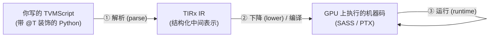
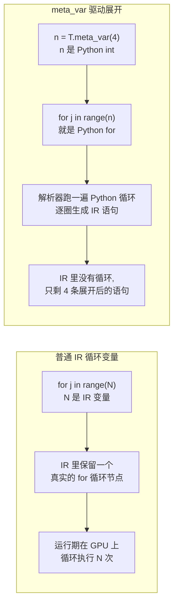
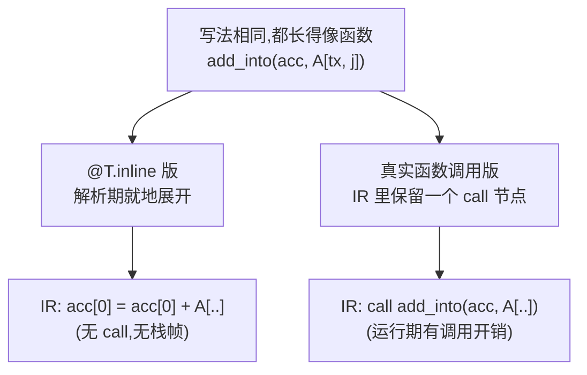
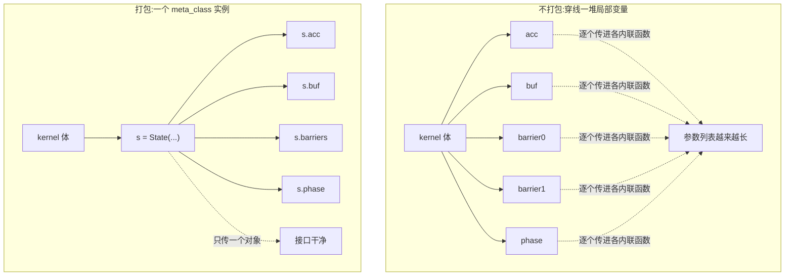

# 第 20 章 · 解析器工具(Parser utilities)

> 原文:[Parser utilities](https://mlc.ai/modern-gpu-programming-for-mlsys/tirx_guide/language_reference/cuda/parser_utils.html)

> **本章要点(TL;DR)**
>
> 先别管那几个工具名,我们把这一章要解决的大问题用一句话说清楚:**你怎么用 Python 这门你熟的语言,去"批量生成"一段要在显卡(GPU)上跑的程序?** 这件事就叫**元编程 / metaprogramming**——简单说就是"写程序去写程序"。本章四个工具,都是 TIRx 提供给你的元编程小开关。
>
> - 本章讲四个工具:`T.meta_var`、`@T.inline`、`@T.meta_class`、`T.constexpr`。它们有个共同点:都在**解析时 / parse time** 干活。这里先解释一个贯穿全章的词——**「解析 / parse」就是"把你写的代码读进来、翻译成另一种内部表示"的过程**(就像编译器读你的源码、转成它内部的语法树)。在 TIRx 里,这一步是把你写的 Python(叫 TVMScript)翻译成一种叫 TIRx IR 的内部结构。所以"解析时干活",意思是这些工具出力的那一刻,是**翻译代码的瞬间**,而不是 GPU 真正跑代码的时候。说白了,它们就是 TIRx 的元编程入口。
> - **`T.meta_var(x)`**:把一个**你用 Python 当场算好的值**直接塞进 IR,当编译期常量使。最典型的玩法,是让一个普通的 Python `for` 循环在解析阶段就被**展开 / unroll**。
> - **`@T.inline`**:定义一个特殊的函数,它会在**每个调用点就地展开**。换句话说,生成的 IR 里压根看不到函数调用,只剩替换进去的函数体。它遵循 Python 的 LEGB 作用域和延迟绑定 / late binding 规则。
> - **`@T.meta_class`**:给一个普通 Python 类贴个「解析期元对象」的标记。它的实例字段能装下 buffer、标量这些 IR 对象,于是你就能把一组相关的分配和状态**打包成一个对象**,不用再拎着一堆零散的局部变量到处传。
> - **`T.constexpr`**:标记一个**编译期的 kernel 参数**,由 `@T.jit` 的 `.specialize(...)` 在编译时把它「烤」进 kernel。本章只点个名,细节看《TIRx 入门》。

> **前置知识**:这一章对 GPU 硬件的要求其实很低——只要你会写代码、懂"编译器把源码翻译成中间表示"这种事,就能读懂大半。出现的几个 GPU 名词(buffer、共享内存等)我都会在第一次用到时当场讲明白,所以你**不用提前补 GPU 课**。不过如果你想看得更顺,可以先翻一下 [第 0 章 · 极简入门](./ch00_gpu_ml_primer.md) 建立点直觉,以及第 9 章 TIRx 基础了解 TVMScript 的写法。
>
> 这里先把三个会反复出现的词钉一下:
> - **TVMScript**:你实际写出来的那段 Python 代码(带一堆 `@T` 开头的装饰器)。它长得像 Python,但其实是用来描述 GPU 程序的。
> - **TIRx IR**:解析器把你的 TVMScript 翻译之后得到的内部结构。IR = Intermediate Representation(中间表示),你可以理解成"编译器内部用的、规规矩矩的程序树"。
> - **kernel**:在 GPU 上跑的那个函数/程序的统称。后面说"kernel"就是指"要在显卡上执行的这段代码"。

---

## 一、先搞清楚:什么叫「解析期工具」

> **一句话先理解**:你的代码从"写出来"到"在 GPU 上真跑起来",中间要过好几道关;本章这四个工具,全都在**最前面那道关(翻译关)**里干活,根本到不了 GPU。先把这条时间线在脑子里摆清楚,后面就全顺了。

你写好一段 TIRx kernel,到它真正在 GPU 上跑起来,中间得过三道关:



- **① 解析阶段 / parse time**:解析器读你写的那段 Python(也就是 TVMScript),把它**翻译成 TIRx IR**。这里有个特别要紧、也特别反直觉的点:这一步是在**普通的 Python 进程里**跑的——换句话说,**此刻你的代码是被当成"数据"在处理的,而不是被当成程序在执行**。打个比方:你写的 TVMScript 就像一张设计图纸,解析阶段是有人在"读图纸、抄成正式蓝图",还远没到"照着蓝图盖房子"那一步。正因为这时候还在 Python 里,所以你能用普通 Python 的能力(算数、循环、对象)去影响翻译结果——这就是后面所有把戏的根基。
- **② 下降 / 编译阶段**:`LowerTIRx` 这类 **pass(可以理解成"对 IR 做一轮变换处理的步骤",编译器里一道道工序)** 上场,把 IR 一步步落实成具体的 GPU 指令。
- **③ 运行阶段**:代码真正在 GPU 上跑。

> **关键**:本章这四个工具,**全都活在阶段 ①**。它们不会变成 GPU 上的任何一条指令。它们只在「Python 翻译成 IR」这一瞬间动手——要么把一个 Python 值塞进 IR,要么趁翻译的时候提前把循环或函数展开掉,要么把一堆状态打成一个包。

说白了,这就是开头讲的「元编程」:**拿 Python 这门你写得顺手的语言(术语叫"宿主语言 / host language",意思是"用来生成别的代码的那门语言"),去操控、去生成另一门语言(TIRx IR)的代码**。你只要记住一句话——「这些事全发生在解析器里、还没到 GPU」,后面四节就都顺了。

那它们各自治什么病?主要是下面这三类:

| 工具 | 解决的痛点 |
| --- | --- |
| `T.meta_var` | 想把 Python 算出来的常量直接用进 IR,又不想多写一个没用的临时变量;想让循环在解析期展开 |
| `@T.inline` | 想把一段重复逻辑抽成函数复用,又不希望 IR 里真出现一次函数调用 |
| `@T.meta_class` | kernel 里状态太多(屏障、累加器、scratch view……),不想把十几个局部变量一路穿下去 |
| `T.constexpr` | 想要一个编译期就固定下来的 kernel 参数(如 tile 尺寸),让编译器据此特化 |

---

## 二、`T.meta_var` — 把 Python 值 inline 进 IR

### 2.1 它在做什么

> **一句话先理解**:`T.meta_var(x)` 就是告诉解析器"`x` 是我在 Python 里早就算好的一个**普通数**,你直接把这个数填进生成的代码里,别把它当成 GPU 程序里的一个变量"。

`T.meta_var(x)` 其实就是在跟解析器交代一句:**「`x` 是个编译期的 meta 值,你直接把它 inline 进 IR 就行,别当成普通的『脚本变量』去解析。」** 这里有两个词先解释一下:**"inline 进 IR"** 就是"把这个值的字面数字直接嵌进生成的代码里"(类似你把常量 `4` 直接写死在代码里,而不是先 `n = 4` 再用 `n`);**"meta 值"** 就是"只在翻译阶段存在、翻译完就没了的值"。

这里的 `x`,是你在 **Python 这一层**就已经算好的值,比如一个 Python `int`(整数)。那加不加 `T.meta_var`,到底差在哪?对比一下你就懂了:

- **不加**:解析器可能把 `n = 4` 看成 IR 里的一次变量赋值,于是真给你生成一个 IR 变量节点。
- **加了** `T.meta_var(4)`:这下 `n` 就只是个 Python 整数 `4`。后面哪儿用到 `n`,解析器就把 `4` 这个字面值直接填进去——IR 里根本没有 `n` 这么个变量。

```python
n = T.meta_var(4)              # n 就是 Python int 4,会被直接 inline
for j in range(n):             # 上界是 meta 值 -> 在解析期被「展开」
    acc[0] = acc[0] + A[tx, j]
```

逐行说一下这段在干嘛(里面有几个 GPU 味儿的名字,我先点一下):

1. `n = T.meta_var(4)`:把整数 `4` 标记成 meta 值,`n` 从此就是个普通 Python 整数。
2. `for j in range(n)`:一个普通的 Python `for` 循环,转 4 圈。
3. `acc[0] = acc[0] + A[tx, j]`:这是循环体。`A` 和 `acc` 是 **buffer——你可以先理解成"GPU 上的一块带类型、带形状的数组/内存"**(细节见第 0 章,这里不用深究)。`tx` 是当前线程的编号(GPU 上同时有成千上万个线程在跑,`tx` 就是"我是第几个")。整句的意思是:把 `A` 里这一行的若干元素,一个个累加到 `acc[0]` 上。

### 2.2 最重要的副作用:驱动循环展开

先解释"展开 / unroll"这个词:**把一个循环拆掉,改写成它每一圈的语句一条条排开**。比如 `for i in range(3): f(i)` 展开后就是 `f(0); f(1); f(2);`,循环没了,只剩三条平铺的语句。(为什么要这么干?GPU 上循环每转一圈都有点额外开销——判断要不要继续、跳转回去——展开掉就省了这些,而且展平后编译器还更容易做进一步优化。这是 GPU 编程里很常见的提速手段,你先有个印象即可。)

`T.meta_var` 最值钱的本事,就是能让循环在**解析期直接被展开**。

为什么?关键全在 `range(n)` 里那个 `n` 身上。`n` 是个**实打实的 Python 值**(不是 GPU 程序里的变量),所以 `for j in range(n)` 不过是一个最普通的 **Python `for` 循环**。解析器翻译的时候,会老老实实把这个 Python 循环**跑一遍**:转一圈,就吐一条对应的 IR 语句。这么一圈一条,循环就被摊平了。换句话说,**循环是在"翻译你代码的那个 Python 进程里"跑掉的,GPU 那边压根没看见循环**。

还拿上面那段代码举例,它等价于解析器生成了这么一段 IR(意思上是这样):

```python
acc[0] = acc[0] + A[tx, 0]
acc[0] = acc[0] + A[tx, 1]
acc[0] = acc[0] + A[tx, 2]
acc[0] = acc[0] + A[tx, 3]
```

下面这张图,把「普通的运行期循环」和「meta 值驱动的解析期展开」并排一放,差别一眼就出来了:



> **关键**:一个 `for` 会不会在解析期展开?判断起来特别简单——就看它的**循环上界(还有循环里用到的那些值)是不是 meta 值**。而 `T.meta_var` 干的,正是把一个 Python 值「升格」成 meta 值的那个开关。上界一旦是 meta 值,这个 `for` 就退回成一次普通的 Python 迭代,解析器照着它一条一条把语句铺出来就完事了。

### 2.3 为什么这么设计

- **省掉那种「用一次就扔」的局部变量**:很多时候你不过是想用一个 Python 算出来的常量(比如 `tile_k = 64`。这里的 **tile** 是 GPU 编程里的高频词——因为一个大矩阵往往太大、放不进 GPU 的快速内存,人们就把它**切成一个个小方块**分批处理,每个小方块就叫一个 tile,见第 0 章),犯不着在 IR 里专门给它立一个变量节点。`T.meta_var` 能让这个值不留痕迹地融进 IR。
- **把 Python 和 IR 的元编程打通**:它把 Python 算出来的结果,干干净净地注入到 IR 的生成过程里。循环展开只是最常见的一种用法而已。说到底,只要你想让「解析器把某个值当成已知常量来处理」,都能用它。

---

## 三、`@T.inline` — 内联函数

### 3.1 它在做什么

> **一句话先理解**:`@T.inline` 是个**装饰器**(Python 里那种写在函数上面、用来给函数加特殊行为的 `@xxx`)。被它贴上的函数,在翻译时会被"拆开抄到调用它的地方",最后生成的代码里**根本没有这个函数,只剩它的函数体**。

先给个直觉:`@T.inline` 让一个函数「写的时候像函数,出来的时候像手写」。它修饰的函数,**函数体会在每个调用点就地铺开(这个动作就叫 inline,内联)**。换句话说,**生成的 IR 里一个函数调用都看不到**,看到的只是把函数体「抄」过去、再把形参(函数定义里的参数名)换成实参(调用时真正传进来的东西)之后的那几行语句。

```python
@T.inline
def add_into(acc, x):
    acc[0] = acc[0] + x

add_into(acc, A[tx, j])        # 内联后 -> acc[0] = acc[0] + A[tx, j]
```

调一次 `add_into(acc, A[tx, j])`,效果跟你亲手写 `acc[0] = acc[0] + A[tx, j]` 一模一样:形参 `acc` 换成实参 `acc`,形参 `x` 换成实参 `A[tx, j]`,然后整个函数体铺到调用点上,就这么回事。

### 3.2 作用域规则:LEGB + 延迟绑定

原文专门强调:`@T.inline` **遵循 Python 的 LEGB 词法作用域,而且采用延迟绑定 / late binding**。这俩词听着唬人,其实都是 Python 里现成的规矩,一个个拆开看就明白了:

- **LEGB**:就是 Python 找名字的标准顺序——Local(局部)→ Enclosing(闭包外层)→ Global(模块全局)→ Built-in(内建)。内联函数体里用到的名字,就照这个顺序一层层往外找。
- **延迟绑定**:名字是**真正用到它的那一刻**才去解析,不是定义的时候就钉死。
- **形参会盖住外层的同名变量(shadowing)**:正因为走 LEGB,内联函数的**形参名**要是碰巧跟外层某个变量撞名了,那在函数体里,这个名字指的就是**形参**(Local 这一层级优先级最高),外层那个同名的就被挡在外面了。

> **注意**:这条规矩在实战里很要紧。举个例子:外层有个变量叫 `x`,你的内联函数形参也叫 `x`,那函数体里的 `x` 用的是**传进来的实参**,不是外层那个 `x`。这正是它和朴素宏(macro)的区别——宏只是把函数体原封不动粘到调用点,一不留神就会误碰外层的同名变量。`@T.inline` 有作用域规则兜底,行为更像一个真函数,只是省掉了运行期的调用开销而已。

下面这张图,把「`@T.inline`」和「真实的函数调用」摆一块儿看:



### 3.3 为什么这么设计

- **既能复用,又零开销**:你想把重复的逻辑抽成函数,让代码好读、好复用;可又不想在底层 kernel 里背上函数调用的开销。这里要说一下:在普通 CPU 程序里一次函数调用很便宜,你平时根本不会在意;但**在 GPU kernel 里,函数调用往往是要尽量避免的**——它会带来额外开销,还常常挡住编译器的优化(很多 GPU 编译器干脆默认就把函数全 inline 掉)。`@T.inline` 正好两头都顾上——写着像函数,出来像手写。
- **比宏靠谱**:它不是死板的文本替换,而是带着 Python 作用域语义的展开。所以同名遮蔽它能处理对,宏式展开里那些经典的坑也就绕过去了。

---

## 四、`@T.meta_class` — 解析期状态对象

### 4.1 它在做什么

> **一句话先理解**:`@T.meta_class` 让你能用一个**普通的 Python 类**,把 kernel 里一堆零散的内存块和状态"打包成一个对象",之后只传这一个对象就行,不用拎着十几个变量到处跑。

先说它治什么病:kernel 里东西一多,你就得拎着一大把零散的局部变量满世界跑。`@T.meta_class` 就是来帮你「装箱」的。

具体来说,它给一个**普通 Python 类**贴个标记:这个类的**实例是解析期的 meta 值**。它最关键的能耐是——**实例的字段(field)能装下 buffer(一块带类型和形状的连续内存区,见第 0 章)、标量这些 IR 对象**。这么一来,你就能把一组相关的分配(allocation)和状态**打包进一个对象**,然后在 kernel 体里像用普通 buffer 那样,直接用它的字段。

```python
@T.meta_class
class State:
    def __init__(self, smem):
        self.acc = T.alloc_local([1], "float32")                      # 字段持有一块 local buffer
        self.buf = T.decl_buffer([64], "float16", smem, scope="shared.dyn")  # 字段持有一个 SMEM 视图

s = State(smem.data)
s.acc[0] = T.float32(0.0)      # 像普通 buffer 一样直接用它的字段
# ... s.buf[i] ...             # 同理
```

先逐行看懂这段(里面两个分配函数是 GPU 特有的,我解释一下):

1. `@T.meta_class`:贴在类上的标记,告诉解析器"`State` 的实例是解析期的状态容器"。
2. `self.acc = T.alloc_local([1], "float32")`:`T.alloc_local` 是"申请一小块**线程私有内存**"。GPU 内存是分等级的:`local` 这种是**每个线程自己独占、速度最快**的一小块(类比 CPU 的寄存器);这里申请了能装 1 个 `float32` 的格子,存进字段 `self.acc`。
3. `self.buf = T.decl_buffer([64], "float16", smem, scope="shared.dyn")`:`T.decl_buffer` 是"在一块已有内存上声明一个 buffer 视图"。`scope="shared.dyn"` 里的 **shared 指的是共享内存(SMEM)——同一组线程能一起读写的一块高速内存**,你可以把它想成程序员手动管理的高速缓存(详见第 0 章)。这行的意思是:在传进来的那块共享内存 `smem` 上,声明一个能放 64 个 `float16` 的视图,存进字段 `self.buf`。
4. 后面 `s.acc[0] = ...`、`s.buf[i]`:拿到对象 `s` 之后,直接用它的字段,跟用普通数组一模一样。

重点在于:`State` 本身就是个再普通不过的 Python 类——`__init__` 里调用 TIRx 的分配 API,把结果存进字段。`@T.meta_class` 这个装饰器干的,是让解析器把 `State` 的实例当成「解析期的状态容器」,于是字段才装得下这些 GPU 内存对象、在 kernel 体里也能被正确引用。

### 4.2 为什么这么设计:别再「穿线」一堆局部变量

这里的"穿线"是个比喻:就像把一颗颗珠子串到一根线上,你得把同一批变量从外层函数一路当参数传进内层函数、再传进更内层……传得到处都是。

一个真正快的 kernel,流水线上的状态多得吓人。**流水线 / pipeline 也先解释一下**:GPU 上"从内存搬数据"很慢、"算数据"很快,如果先搬完再算,算的时候就在干等。聪明的做法是让两件事**错开、重叠着跑**——这一批数据在算的同时,下一批数据已经在搬了,就像工厂流水线一样不停工(详见第 0 章)。但这么搞,要维护的中间状态就多得吓人:

- 好几个 **mbarrier(屏障,让线程互相等齐、对上步调的同步原语)**;
- 一堆**累加器(accumulator,边算边把结果累加进去的那块寄存器/buffer)**;
- 各种 **scratch 视图 / 中间 buffer(临时用来暂存中间结果的草稿空间)**;
- 还有阶段计数、phase 标志这类标量。

不打包的话,你就得把这十几样东西全当局部变量,一路从外层「穿」到内层,再从一个内联函数传给下一个内联函数。结果呢?参数列表越拖越长,又容易出错,又难读。`@T.meta_class` 的思路是:这些**逻辑上本来就是一伙的**状态,干脆全收进一个对象里。



> **关键**:`@T.meta_class` 给你的是**条理**,不是性能。它本身不会冒出任何运行期对象——实例只活在解析期。它治的是「kernel 代码怎么组织」这个病:把散落一地的流水线状态拢成一个有名字的整体,让 kernel 体读起来像在操作一台清清楚楚的状态机,而不是在一堆裸 buffer 里转晕。

### 4.3 和 `@T.inline` 的搭配

`@T.meta_class` 和 `@T.inline` 是天生一对。你可以写一组 `@T.inline` 的「方法式」辅助函数,让它们都接收同一个 `State` 实例(比如 `add_into(s, ...)`、`advance(s)`)。内联展开之后,这些函数既复用了逻辑,又共享了同一份状态,接口还特别干净。

---

## 五、`T.constexpr` — 编译期 kernel 参数

> **一句话先理解**:`T.constexpr` 让 kernel 的某个参数在**编译时就被定死成一个常量**(而不是每次调用才传),好让编译器照着这个固定值把代码优化得更狠。

`T.constexpr` 用来标记一个**编译期的 kernel 参数**。这个参数会被 `@T.jit` 的 `.specialize(...)` 在编译时「烤」进(bake in)kernel。这里有两个词解释一下:`@T.jit` 是把 kernel 即时编译(JIT = Just-In-Time)的装饰器;**`.specialize(...)` 叫"特化",意思是"给某个/某些参数填上具体值,生成一个专门针对这些值的 kernel 版本"**。"烤进 / bake in"就是个形象说法——把这个值当成常量焊死进生成的代码里,拿不出来了。

原文在本章只点了个名,扔下一句话:**完整细节看《TIRx 入门(Introduction to TIRx)》**。不过照着本书一贯的路子,我们先把它的定位讲清楚:

- 普通的 kernel 参数,是**运行期**才定的——每次调用都能传不同的值。
- 而打了 `T.constexpr` 标记的参数,在 **`.specialize(...)` 那一刻就定死了**。这相当于跟编译器说:「在这个特化(specialize)出来的 kernel 版本里,这个值就是个常量。」
- 既然成了编译期常量,编译器就敢放手做更狠的优化:**常量折叠**(提前把含常量的算式算出结果)、**循环展开**(就是 2.2 讲的那个)、**砍掉永远走不到的分支**,样样都行;还能拿它去驱动数据布局和调度上的决策。这也正是它跟本章前几个工具气味相投的地方——都是「把某个值在更早的阶段就钉死,好让后面生成的代码更优」。

> **注意**:`T.constexpr` 起作用的时机,跟前三个工具不太一样。`T.meta_var`、`@T.inline`、`@T.meta_class` 都在**解析期**动手;而 `T.constexpr` 挂在 `@T.jit` 的 **`.specialize(...)`** 这套编译期特化机制上。但骨子里的精神是一回事——「决策能提前就提前」,只是落地的位置不同罢了。具体语义以《TIRx 入门》为准,本章只是把它收进「解析器 / 编译期工具」这一家子里点个名。

---

## 六、四个工具的横向对比

把这四件工具塞进同一张表,谁负责干啥就一目了然了:

| 工具 | 作用对象 | 生效时机 | 核心效果 | 典型场景 |
| --- | --- | --- | --- | --- |
| `T.meta_var(x)` | 一个 Python 值 | 解析期 | 把值 inline 进 IR;让 `for` 在解析期展开 | 用 Python 常量驱动循环展开 |
| `@T.inline` | 一个函数 | 解析期 | 函数体在每个调用点就地展开,IR 里无 call | 抽取可复用逻辑且零调用开销 |
| `@T.meta_class` | 一个 Python 类 | 解析期 | 实例字段可装 buffer/标量,打包状态 | 聚合屏障/累加器/scratch 等流水线状态 |
| `T.constexpr` | 一个 kernel 参数 | 编译期(`.specialize`) | 把参数烤成编译期常量 | tile 尺寸等编译期固定的配置 |

这四个工具其实共用一条思路,一句话就能串起来:

> **能提前确定的东西,就趁早定下来**——不管是值(`meta_var` / `constexpr`)、函数展开(`inline`),还是状态怎么组织(`meta_class`)。这样既让 IR 更干净、生成的 GPU 代码更快,又不用丢掉 Python 这门宿主语言的元编程表达力。

---

## 小结

- 本章这四个工具,都是 TIRx 的**解析期 / 编译期元编程入口**。它们干的都是「在 TVMScript → TIRx IR 这条翻译链上做文章」,本身不对应 GPU 上的任何一条运行期指令。
- **`T.meta_var(x)`**:把 Python 算出来的值升格成编译期 meta 值,再 inline 进 IR。最常见的效果,是让 `for j in range(n)` 这类循环在解析期就被**展开**成一条条铺平的语句。
- **`@T.inline`**:函数体在每个调用点就地展开,IR 里看不到函数调用。它遵循 Python 的 **LEGB 词法作用域和延迟绑定**,形参能正确盖住外层的同名变量,所以比朴素的宏更靠谱。
- **`@T.meta_class`**:把普通 Python 类的实例变成「解析期状态容器」,字段能装下 buffer / 标量。你可以拿它**打包**屏障、累加器、scratch 视图这些流水线状态,省得在 kernel 体里拎着一堆零散局部变量到处穿。它和 `@T.inline` 一搭,就能写出特别干净的「带状态辅助函数」。
- **`T.constexpr`**:标记编译期的 kernel 参数,由 `@T.jit` 的 `.specialize(...)` 烤进 kernel,细节看《TIRx 入门》。
- 全章就一条主心骨:**能提前定的值、展开、状态组织,就趁早定下来**。这样既留住了 Python 的元编程能力,又让生成的 IR 和 GPU 代码更精简、更快。

## 延伸阅读

- 原文页面:[Parser utilities — Modern GPU Programming for MLSys](https://mlc.ai/modern-gpu-programming-for-mlsys/tirx_guide/language_reference/cuda/parser_utils.html)
- `T.constexpr` 与 `@T.jit` 的 `.specialize(...)` 细节:见本书第二部分「TIRx 入门(Introduction to TIRx)」。
- 元编程与循环展开的更广背景:可结合本书 TIRx 语言参考的其余章节一起看。

## 术语对照

| 中文 | English |
| --- | --- |
| 解析期 / 解析时 | parse time |
| 元编程 | metaprogramming |
| 元值 / meta 值 | meta value |
| 内联(就地展开) | inline |
| 循环展开 | unroll |
| 词法作用域 | lexical (LEGB) scoping |
| 延迟绑定 | late binding |
| 遮蔽(同名覆盖) | shadowing |
| 编译期常量 | compile-time constant |
| 特化 | specialize |
| 累加器 | accumulator |
| 屏障 | mbarrier / barrier |
| 中间暂存(视图) | scratch (view) |
