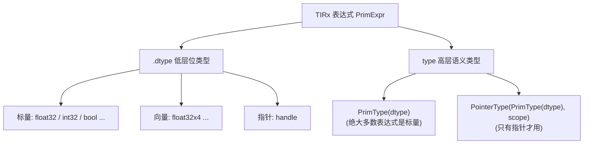
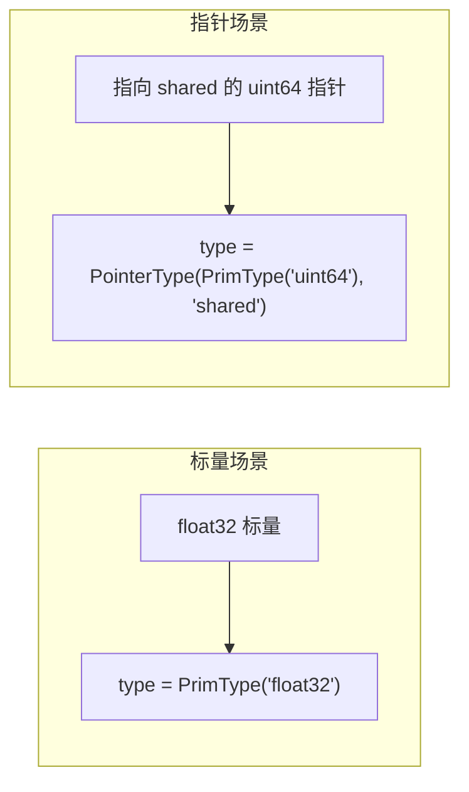
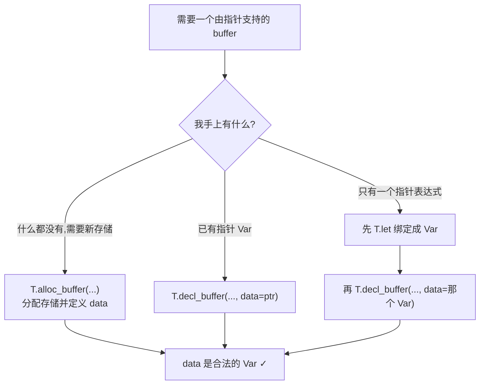
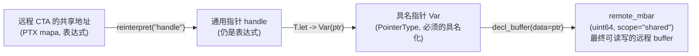

# 第 21 章 · 数据类型与表达式

> 原文:[Data types and expressions](https://mlc.ai/modern-gpu-programming-for-mlsys/tirx_guide/language_reference/cuda/data_types.html)

> **本章要点(TL;DR)**
>
> 别急,下面这几条现在看不懂很正常,它们是这一章的"地图"。读完全章你再回来扫一眼,就全串起来了。先混个脸熟:
>
> - 我们这一章聊的是 **TIRx** 这套东西怎么给"数据"贴类型标签。(TIRx 是个工具,你先把它理解成"一个帮你把程序翻译成显卡能跑的代码的翻译器",细节后面讲。)
> - 在 TIRx 里,**每个表达式身上都挂着两层类型标签**:下面一层叫 `dtype`,管的是"这堆数据是什么二进制位"(几个字节、是浮点还是整数);上面一层叫 `type`,管的是"这是个普通的值,还是一个指针"。
> - `dtype` 跟显卡 C++ 代码里的类型一一对得上,比如 `float32 → float`、`float16 → half`、`bfloat16 → nv_bfloat16`、`float32x4 → float4`。最后翻译出来的代码用哪个 C++ 类型,就由它说了算。
> - **向量 dtype**(像 `float32x4`,意思是"4 个浮点数捆成一包")是头等公民。后面会讲到,用它能做"一次搬一大块数据"的加速。但记住一句:一个数据是不是"向量",是 dtype 自己决定的,跟用什么指令搬它没关系。
> - 上面那层 `type`,大多数时候平平无奇(就是个标量值),你基本不用管。它真正有戏,是碰到**指针**的时候。
> - 想让一个数据结构指向一个**临时算出来的地址**?不能直接塞,得先用一个叫 `T.let` 的办法给这个地址"起个名字",绕一道。

> **前置知识**:这一章会反复提到几个 GPU(也就是显卡)世界的基本概念——寄存器、共享内存、线程块、TIRx 等等。**别担心,这一章每个词第一次出现时,我都会当场用大白话讲清楚"它是什么、为什么需要它"**,你不需要提前懂。如果你想先建立一个整体印象,可以翻一下 [第 0 章 · 极简入门](./ch00_gpu_ml_primer.md);但即使不翻,直接往下读也完全没问题。

---

## 21.0 为什么要把"类型"拆成两层?

> **一句话先理解**:同样是"类型",TIRx 比你平时写的 C++ 多记了一层信息,因为它的目标不是直接运行,而是要被翻译成显卡代码,翻译就得记得更细。

先把背景交代清楚,不然后面全是云里雾里。

**先说几个名词,都是大白话:**

- **GPU**:就是显卡。它和 CPU 最大的不同是:CPU 擅长一件一件事飞快地干,GPU 擅长成千上万件小事同时干。做 AI(尤其是矩阵乘法)就特别吃这种"同时干一大堆"的能力,所以现在跑模型都靠它。
- **CUDA**:英伟达(NVIDIA)显卡上写程序用的那套语言/工具,长得很像 C++。你写一段 CUDA 代码,显卡就能跑。可以把它理解成"显卡专用的 C++"。
- **kernel(核函数)**:一段会被丢到显卡上、由成千上万个线程同时跑的函数。后面我们说"一个 kernel",你就想成"一段跑在显卡上的程序"。

好,背景有了。现在说为什么类型要两层。咱们从平时写代码聊起。

你写 `float x;` 的时候,类型就一个维度,够用了。编译器一看到 `float`,啥都知道了:占 4 个字节、是浮点、能拿来做浮点运算——一句话就交代清楚了。

可我们这一章的主角 **TIRx** 不太一样。它不是给人直接运行的代码,而是一种**中间表示(IR,intermediate representation)**。

> **一句话先理解**:IR 就是程序"翻译过程中的半成品"——还没变成最终代码,但已经不是你写的原始代码了,夹在中间,专门给翻译器(编译器)看的。

打个比方:你要把一篇中文翻译成英文,但你不是一步到位,而是先把它整理成一份结构清清楚楚的"提纲"(谁是主语、谁是动词、修饰关系),再照着提纲译成英文。这份提纲就相当于 IR。它比原文啰嗦,但正因为信息更齐全,翻译器照着它干活才不容易出错。

那 TIRx 具体是什么?它是 TVM(一个把 AI 模型编译成高效代码的开源框架)里的一个组件,专门用来**描述一个要跑在显卡上的 kernel**,最后把它翻译(术语叫 lower,见 21.1.2)成 CUDA 源码。它要把两件事都顾好:

1. 底层每个数据到底占多少位、怎么摆,得控制得死死的(因为最后要生成精确的显卡代码,差一个字节都不行);
2. 在这份"提纲"里,一眼就能看出"这是个普通的值,还是一个指针"(指针就是 C/C++ 里那个"存的不是数据本身,而是数据所在地址"的东西)。

光靠一层 `float` 这种类型,这两件事顾不全。于是 TIRx 干脆把类型劈成了两层:

| 层级 | 名称 | 回答的问题 | 典型取值 |
| --- | --- | --- | --- |
| 低层 | `dtype` | "这是什么位?"(标量/向量元素类型) | `float32`、`float16`、`int32`、`float32x4`、`handle` |
| 高层 | `type` | "这是标量还是指针?" | `PrimType(dtype)`、`PointerType(PrimType(dtype), scope)` |

> **关键**:先记住一句话——`dtype` 管"数据长啥样"(多少位、带不带符号、是不是向量),`type` 管"这数据是拿来干嘛的"(是个能直接参与运算的值,还是个指向某块存储的指针)。这两件事一分开,编译器既能精确地生成底层代码,又能顺手对指针做点语义检查。

下面这张图就是这个两层结构的概貌:



---

## 21.1 表达式的 dtype

咱们先讲下面那层——`dtype`,它最好懂,基本就是你熟悉的"数据类型"。

在 TIRx 里,你写下的每一个表达式(就是任何能算出一个值的东西,比如 `a + b`、`x[3]`,术语叫 `PrimExpr`,原始表达式)身上,都挂着一个 `.dtype` 属性,告诉你这个表达式里**每个元素是什么类型**。常见的就这么几类,大部分你写代码都见过:

- **普通浮点**:`float32`(单精度,4 字节)、`float16`(半精度,2 字节)、`bfloat16`(也是 2 字节,但精度分配不一样)。位数越少占内存越少、算得越快,但精度也越低——AI 计算里经常为了快而用低位数的浮点。
- **整数**:`int32`(32 位有符号整数)、`uint8`(8 位无符号整数)。
- **布尔**:`bool`。
- **低精度浮点**:`float8_e4m3fn`、`float4_e2m1fn` 这一类。这些是专门为 AI 计算造出来的"超窄"浮点格式(8 位甚至 4 位),主要图一个省内存、算得快,代价是精度更低。名字里其实就把位数怎么分写明了:`e4m3` 就是"4 位拿来表示指数 + 3 位拿来表示尾数"。现在不懂这些细节没关系,知道"它们是更省位的浮点"就够。
- **指针**:`handle`,说白了就是个 C/C++ 里的指针——存的不是数据本身,而是"数据待在哪个地址"。这个后面 21.3 节会专门讲。
- **向量形式**:像 `float32x4`,意思是"把 4 个 `float32` 打成一包,当成一个整体用"。这一包对应到显卡代码里是个叫 `float4` 的类型。为什么要打包?后面 21.1.1 会讲,简单说就是"一次搬一大包比一个一个搬快"。

> **注意**:每个 dtype 到了"翻译成显卡代码"那一步(术语叫 codegen,代码生成),都会变成一个"对得上号的 CUDA 类型"。换句话说,dtype 不是个虚头巴脑的标签,而是和最终生成的 C++ 类型一一咬合的、实打实的物理类型——它说是 4 字节,生成出来就真是 4 字节。

### 21.1.1 一个例子:用各种 dtype 分配 buffer

光看列表不解渴,上个例子。原文有个示范 kernel,拿好几种 dtype 各分配了一块 **buffer**(缓冲区,你就理解成"一块存数据的内存区域,类似一个数组")——有的放在寄存器里,有的放在共享内存里,顺手还演了一次"向量化访存"(就是上面说的"一次搬一大包")。

> **一句话先理解**:GPU 上的存储不是只有一种内存,而是分好几层,越靠近计算单元的越快但越小。下面代码里会出现两种,你先记住这个对比表,看代码就不懵了:

| 存储 | 大白话 | 谁能看到 | 用什么开 |
| --- | --- | --- | --- |
| **寄存器(register)** | 最快的一小块私有存储,类似 CPU 寄存器,但显卡上**每个线程各有自己的一份**,别人看不见 | 单个线程私有 | `T.alloc_local(...)` |
| **共享内存(shared memory,简称 SMEM)** | 一块速度很快、需要你手动管理的存储,有点像"程序员能手动控制的高速缓存" | 同一组线程共用 | `T.alloc_shared(...)` |

(这里又冒出"线程"和"一组线程"——线程就是"一条独立执行的指令流",显卡靠成千上万条线程同时跑来加速;那"一组线程"是什么、为什么要分组,看完代码下面第 2 点就懂了。)

核心片段在下面,中文注释我都加好了:

```python
@T.prim_func
def dtypes(A_ptr: T.handle, O_ptr: T.handle):
    A = T.match_buffer(A_ptr, (256,), "float32")   # 把入参指针匹配成 256 元素的 float32 buffer
    O = T.match_buffer(O_ptr, (256,), "float32")
    T.device_entry(); bx = T.cta_id([1]); tx = T.thread_id([64])  # 设备入口 + 取 CTA 索引 bx、线程索引 tx

    f16  = T.alloc_local((1,), "float16")    # 寄存器标量:float16
    bf16 = T.alloc_local((1,), "bfloat16")   # 寄存器标量:bfloat16
    i32  = T.alloc_local((1,), "int32")      # 寄存器标量:int32
    u8   = T.alloc_local((1,), "uint8")      # 寄存器标量:uint8
    b1   = T.alloc_local((1,), "bool")       # 寄存器标量:bool
    sm   = T.alloc_shared((64,), "float16")  # 共享内存(SMEM)tile:64 个 float16

    v    = T.alloc_local((1,), "float32x4")  # 关键:一个向量 dtype 寄存器(float4)
    v[0] = A.vload([tx * 4], dtype="float32x4")  # 一次性向量化加载 4 个 float32
    O.vstore([tx * 4], v[0])                      # 一次性向量化写回 4 个 float32
    # ... (后续使用 f16/bf16/i32/u8/b1/sm) ...
```

这段代码里有几个 GPU 专有的写法,你大概率没见过,我一条条喂到嘴边:

1. **`T.alloc_local((1,), dtype)`**:`alloc_local` 就是"开一块寄存器存储"。前面说了,寄存器是每个线程自己的一小块私有超快存储,别人看不到。`(1,)` 是它的形状,意思是"我只要 1 个元素"(就像声明一个长度为 1 的数组)。所以 `f16 = T.alloc_local((1,), "float16")` 读作:"给我开一个 `float16` 的寄存器变量"。
2. **`T.alloc_shared((64,), "float16")`**:`alloc_shared` 开的是一块**共享内存**。`(64,)` 表示"64 个元素"。这块地方,是同一个 **CTA** 里所有线程一块儿用的。
   - 这里得讲清楚 **CTA(线程块)** 是什么、为什么有它:显卡有成千上万条线程,不可能让它们全互相通信(太乱、太慢),于是把线程分成一个个"小组",每组就叫一个 CTA。**同一个 CTA 里的线程才能共用共享内存、才能方便地配合干活**。所以共享内存是"按 CTA 分配、给一个 CTA 内的线程共享"的。打个比方:整个工厂(显卡)几万个工人(线程),太多了管不过来,就编成一个个班组(CTA),每个班组有一张共用的工作台(共享内存),组内的人可以在这张台子上交换东西。
   - 顺带提一句代码开头的 `bx = T.cta_id(...)` 和 `tx = T.thread_id(...)`:`cta_id` 是"我是第几个 CTA(班组)",`thread_id` 是"我在组里是第几个线程(工人)"。每条线程靠这俩编号知道自己该处理哪份数据。
3. **`v = T.alloc_local((1,), "float32x4")`**:这是本节最要紧的一行。注意 dtype 是 `float32x4`(向量),所以它开出来的是**一个** `float4` 寄存器。写 `v[0]` 就能把这个向量整体取出来。这里有个特别容易绊倒人的点:形状是 `(1,)`,看着只有"一个元素",但这"一个元素"本身就是个 4 宽的向量(里面装着 4 个 float)。所以它实际占的是 4 个 float 的位置。
4. **`A.vload([...], dtype="float32x4")` 和 `O.vstore([...], ...)`**:`vload` 是"向量加载"、`vstore` 是"向量写回"。这两行把内存里**挨着的** 4 个 `float32` 当成**一次 16 字节的搬运**整体读/写(4 个 float × 4 字节 = 16 字节)。
   - 为啥要这么干?这是 GPU 上的一个经典提速套路。显卡每发一条"读内存"的指令是有固定开销的;如果一次只搬 4 字节,要搬完一大堆数据就得发巨多条指令,开销摊下来很亏。改成一次搬 16 字节,指令数直接降到四分之一,内存带宽就用得更满。这就叫**向量化访存**——用更宽的单次搬运,换更少的指令次数。

### 21.1.2 它生成什么样的 CUDA?

TIRx 这份"提纲"写完了,咱们肯定想看看它最后被翻译成的真实显卡代码长啥样。这一步术语叫 **lower(降级 / 下降)**——就是把高层的 IR 一步步降到低层的真实代码。上面那段 TIRx 会被 lower 成下面这堆 CUDA(C++ 风格)。为了让重点更扎眼,原文把没关系的部分都删了:

```c++
half          f16_ptr[1];                // float16  -> half
nv_bfloat16   bf16_ptr[1];               // bfloat16 -> nv_bfloat16
int           i32_ptr[1];                // int32    -> int
uchar         u8_ptr[1];                 // uint8    -> uchar
signed char   b1_ptr[1];                 // bool     -> signed char
__shared__ alignas(64) half sm_ptr[64];  // 共享 float16,带 64 字节对齐
float4        v_ptr[1];                   // float32x4 -> float4 (向量)

v_ptr[0]                   = *(float4*)(A_ptr + tx * 4);  // 向量化加载:reinterpret 成 float4* 再解引用
*(float4*)(O_ptr + tx * 4) = v_ptr[0];                   // 向量化写回:同样 reinterpret 成 float4*
```

先解释一下生成代码里几个可能眼生的写法:

- `half`、`nv_bfloat16`、`uchar` 这些是 CUDA 自带的类型名,分别对应半精度浮点、bfloat16、无符号字节,跟上面 TIRx 的 dtype 一一对上。
- `__shared__` 是 CUDA 的关键字,意思是"这块数组放在共享内存里"。`alignas(64)` 是要求它按 64 字节对齐(对齐有助于访存更快,细节不重要)。
- 最后两行里的 `*(float4*)(...)` 是 C/C++ 里的"指针类型强转":把一个本来指向 `float` 的地址,硬当成"指向 `float4`(一包 4 个 float)的地址"来看,再 `*` 解引用,就一次性读/写了一整包 16 字节。

> **关键**:盯着最后两行看。所谓向量化访存,在 CUDA 里翻来覆去就一句话:**把"指向单个 float 的指针"硬转成"指向一包 4 个 float 的指针",然后一口气读写整包**。一个 `float4` 正好 16 字节,对应一条"宽访存"指令。`float32x4` 这个 dtype 在底层兑现出来的,就是这么回事,没别的玄机。

下面这张表把"TIRx dtype → 生成的 CUDA 声明"一行行摆出来,对照着看一目了然:

| TIRx 声明(`alloc_local` / `alloc_shared`) | 生成的 CUDA |
| --- | --- |
| `alloc_local((1,), "float16")` | `half f16_ptr[1];` |
| `alloc_local((1,), "bfloat16")` | `nv_bfloat16 bf16_ptr[1];` |
| `alloc_local((1,), "int32")` | `int i32_ptr[1];` |
| `alloc_local((1,), "uint8")` | `uchar u8_ptr[1];` |
| `alloc_local((1,), "bool")` | `signed char b1_ptr[1];` |
| `alloc_shared((64,), "float16")` | `__shared__ alignas(64) half sm_ptr[64];` |
| `alloc_local((1,), "float32x4")` | `float4 v_ptr[1];` |

### 21.1.3 向量 dtype 是"自带的",不靠 vload

这儿有个特别容易搞混的点,作者也专门拎出来敲了一下:很多人以为"向量"是 `vload` 给变出来的,其实根本不是。

> **注意**:一个数据是不是向量,纯粹是 dtype **自己**的事,跟 `vload`/`vstore` 一点关系都没有。你写下 `T.alloc_local((1,), "float32x4")` 的那一秒,一个 `float4` 寄存器就已经躺那儿了,你完全可以拿它当普通寄存器使。`vload`/`vstore` 不过是"碰巧"也用了同一个向量 dtype,去做一次宽访存而已。换句话说,**任何 buffer、任何标量,都能挂上向量 dtype**,根本不是非得过 `vload` 这道手才能凑出向量。

这种设计背后的讲究叫**正交性(orthogonality)**。这个词听着玄,其实意思很朴素:把两件本来不相干的事彻底拆开,谁也不绑死谁。这里拆开的是"数据是不是向量"和"用哪条指令搬它"。拆开的好处是搭配自由——你可以声明一个向量寄存器,然后单纯拿它去参与运算(根本不用 `vload`);反过来,你也可以冲着一个普普通通的 buffer 发起一次向量化访存。两边随意组合,互不牵连。

### 21.1.4 dtype → CUDA 类型映射表

最后把这些对应关系归到一张表里,以后想查随手翻:

| TIRx dtype | 对应 CUDA 类型 | 说明 |
| --- | --- | --- |
| `float32` | `float` | 单精度浮点 |
| `float16` | `half` | 半精度浮点 |
| `bfloat16` | `nv_bfloat16` | brain float,8 位指数、7 位尾数 |
| `int32` | `int` | 32 位有符号整数 |
| `uint8` | `uchar` | 8 位无符号整数 |
| `bool` | `signed char` | 布尔用 `signed char` 承载 |
| `float32x4` | `float4` | 向量类型(4×float32) |
| `handle` | `T*`(指针) | 指针,`T` 为被指向的元素类型 |
| 其他向量 dtype | 对应的 CUDA 向量类型 | 形如 `<标量>x<N>` → CUDA `<类型><N>` |

> **注意**:你大概会纳闷,`bool` 干嘛映射成 `signed char`,不直接用 C++ 的 `bool`?图的是两件事:一是在 GPU 上有个板上钉钉的 1 字节布局,二是能被寻址。至于那些低精度浮点(`float8_e4m3fn`、`float4_e2m1fn` 之类),它们一样各有各对应的 CUDA 类型,只不过原文没把具体拼写一个个列出来罢了。

---

## 21.2 dtype 和 type 有什么区别?

下面那层 `dtype` 讲完了,抬头看看上面那层 `type`。它俩啥关系?一句话:

- **`dtype` 在下面**——只回答一件事:"是什么位(几个字节、浮点还是整数)"。
- **`type` 在上面**——回答的是另一件事:"这玩意儿是个普通的值,还是个指针"。

(再强调下"标量"和"指针"这俩词:**标量**就是一个普通的、能直接拿来算的值,比如 `3.14`;**指针**存的不是值本身,而是值所在的地址。)

那 `type` 具体长什么样呢?看是哪种东西:

- 是个**标量**,那它的 `type` 就写成 `PrimType(dtype)`(`PrimType` 你读作"普通值类型")。比如一个 `float32` 标量,`type` 就是 `PrimType("float32")`,翻译过来就是"一个 float32 的普通值"。
- 是个**指针**,那它的 `type` 写成 `PointerType(PrimType(dtype), scope)`(`PointerType` 读作"指针类型")。里头的 `dtype` 说的是"它指向的东西是什么类型",`scope` 说的是"它指向的存储待在哪一层"(像 `"shared"` 指共享内存、`"global"` 指显卡的主内存)。

> **关键**:绝大多数表达式都是标量,它们的 `type` 没啥花头,就是 `PrimType(dtype)`,你压根不用单独惦记。**`type` 真正大显身手的地方,是指针**。为啥?因为指针得多记两件 dtype 装不下的事——"它指向什么类型"和"它指向的存储在哪一层",所以才需要上面这层 `type` 来兜着。



---

## 21.3 指针(`handle`)

接着上节说——指针就是 `type` 系统真正能耍开的地方,这节好好讲。

在 TIRx 里,一个指针露面时,它的 dtype 是 `handle`(通用指针)。但光看 dtype 你只知道"这是个指针",并不知道它指向什么、住在哪——这些"身份证信息"是上层的 `PointerType` 替它保管的。这节聊的是个挺实在的事:**一个指针,你怎么正经地拿到手、再用起来**。

### 21.3.1 一条核心规矩:buffer 的 `data` 是不可变的 `Var`

> **一句话先理解**:每个 buffer(那块存数据的内存区)底下都垫着一根指针,告诉它"我管的数据从哪个地址开始"。这根指针有个硬规矩——一旦定了就不能改。这条规矩是后面所有麻烦的根源,先记住它。

每个 buffer 都有个 `data` 字段,它就是这个 buffer 底下垫着的那根指针(指向这块数据的起始地址)。关于 `data`,记住两点就够:

1. 它是个**指针类型的 `Var`**。这里的 `Var` 就是"变量"(variable)——在 IR 里,一个有名字、能被引用的东西就叫一个 `Var`。你可以把它理解成一个"具名的盒子"。
2. 它**改不了(immutable,不可变)**——这根指针第一次定下来之后,就不许再指向别处了。

> **关键**:干嘛先把这条规矩摆出来?因为下面那几种"取指针"的写法,全是被这条规矩逼出来的。规矩特别简单:`data` 只认 `Var`(具名的变量),不收表达式(临时算出来、还没名字的东西)。所以,你别想着把一个"现场算出来的地址表达式"随手塞给 buffer 当 `data`——必须先把它"安顿"成一个有名字的 `Var`,才行。这就好比某个登记表只接受"已经登记在册的住户",你不能填一个"正在路上还没落户的人"。

### 21.3.2 拿到指针的三种方式

把上面那条规矩(`data` 必须是 `Var`)揣兜里,取指针就有三条路可走,各管各的场景。先看表,下面再逐一讲:

| 方式 | API(怎么写) | 它做了什么 | 什么时候用 |
| --- | --- | --- | --- |
| 分配新存储 | `T.alloc_buffer(...)` | **开一块新存储,顺手就把 `data` 指针定义好了** | 你需要一块全新的内存 |
| 复用已有指针 | `T.decl_buffer(..., data=ptr)` | 不开新存储,而是在一个**已有的指针 `Var`**(就叫 `ptr`)上面声明一个 buffer | 指针你已经有了,只是想换一个 buffer "视角"去访问它 |
| 绑定指针表达式 | 先 `T.let` 成 `Var`,再 `decl_buffer` | 先把一个**临时算出来的指针表达式**绑定成一个有名字的 `Var`,再拿它去声明 buffer | 指针不是现成的,而是现场算出来的(比如跨 CTA 的远程地址) |

简单解读一下这三条:第一条最常见,要新内存就用它,它一步到位;第二条是"我已经有指针了,只想换个数组视图来读写同一块内存";第三条最绕,专门对付"指针是算出来的"这种刁钻情况——也正是它逼出了 `T.let` 这个写法,下一节细讲。

不管你走哪条,终点都一样:`data` 最后必须是个合法的 `Var`。下面这张流程图,就是把三条路怎么殊途同归到这个终点画了出来:



### 21.3.3 绑定指针表达式:访问远程 CTA 的共享内存

三条路里头,第三条最有意思,也最值得掰开讲。它对付的是这么一种情况:你手上的指针不是现成的、有名字的 `Var`,而是**当场算出来的一个表达式**(还没名字)。这时你绕不开——得先用 `T.let` 给它"起个名字"、变成一个 `Var`,然后才好递给 `decl_buffer`。

那什么时候会碰上"算出来的指针"呢?原文举的典型场景是**集群(cluster)里的分布式共享内存**。这一句信息量有点大,我拆开讲清楚:

- 前面说过,共享内存只在**一个 CTA(线程块)内部**共享。可有时候我们希望"几个 CTA 之间也能互相读写彼此的共享内存",光靠基本机制做不到。
- 于是新一代显卡引入了 **cluster(集群)** 这个概念:把几个 CTA 再打成一个更大的"团",团里的 CTA 可以互相够到对方的共享内存。这种"跨 CTA 互相访问的共享内存"就叫**分布式共享内存(distributed shared memory)**。打个比方:原来每个班组(CTA)只能用自己的工作台(共享内存);现在几个班组组成一个车间(cluster),车间里的班组之间也能伸手去够隔壁那张工作台了。
- 但要够到"隔壁班组那张工作台上的某个位置",你得先**算出它的地址**。这个换算就靠一个叫 `T.ptx.map_shared_rank` 的操作(它底层对应显卡的一条低级指令 `mapa`,你不用记)。它干的活是:把"我自己 CTA 里某个共享内存位置的地址",换算成"集群里另一个 CTA 上同一个位置的地址"。
- 关键点来了:这个换算出来的结果,**天生就是个临时算出来的地址表达式**,还没名字。所以它正好撞上 21.3.1 那条规矩,只能走"先 `T.let` 起名字,再 `decl_buffer`"这第三条路。

下面就是这段代码。它一上来扯进来好几个底层名词,别慌——你只需要抓住一条主线:**把一个算出来的地址,一步步变成一个能正常读写的 buffer**。

```python
from tvm.ir.type import PointerType, PrimType

# 1) 用 map_shared_rank(PTX mapa)算出远程 CTA 的共享地址(这是一个表达式)
#    再 reinterpret 成 handle,然后用 T.let 绑定到一个 PointerType 的 Var "ptr"
ptr: T.let[T.Var(name="ptr", dtype=PointerType(PrimType("uint64")))] = \
    T.reinterpret("handle", T.ptx.map_shared_rank(mbar.ptr_to([0]), 0))

# 2) 现在 ptr 是合法的指针 Var,可以用它声明一个 buffer
#    指向另一个 CTA 的 mbarrier(uint64),作用域为 shared
remote_mbar = T.decl_buffer([1], "uint64", data=ptr, scope="shared")
```

这段代码从里到外是四步,咱们一行一行拆(从最内层往外读):

1. **`T.ptx.map_shared_rank(mbar.ptr_to([0]), 0)`**:这是最里面的一步,就是上面讲的"换算地址"。它把当前 CTA 里某个 **mbarrier** 的地址,换算成集群里目标 CTA(`0` 是目标 CTA 的编号)上同一个位置的地址。
   - 这里又冒出个新词 **mbarrier**:它是放在共享内存里的一个"同步计数器",作用是让一群线程互相等——典型用法是"等数据全部搬到齐了,大家再一起往下走"。它内部就是用一个 `uint64` 存的,所以后面你会看到处处是 `uint64`。这个机制本章不展开,你知道"它是个共享内存里的同步用的小变量"就够。
   - 这一步吐回来的,是一个**地址表达式**(临时算出来的,没名字)。
2. **`T.reinterpret("handle", ...)`**:`reinterpret` 是"按另一种类型重新解释这串二进制位"(类似 C++ 的 `reinterpret_cast`)。这里把上一步的结果重新解释成 `handle`,也就是"通用指针"这个 dtype。到这儿它还是个没名字的表达式。
3. **`ptr: T.let[T.Var(..., dtype=PointerType(PrimType("uint64")))] = ...`**:这步就是关键的"起名字"。前面反复念叨 `data` 必须是 `Var`(有名字的变量),所以这儿用 `T.let` 把那个表达式绑定到一个叫 `ptr` 的指针 `Var` 上。`T.let` 你就理解成"把右边算出来的东西,起个名字叫 `ptr`,以后就能用 `ptr` 引用它"。
   - 这个 `ptr` 的上层 `type` 写成 `PointerType(PrimType("uint64"))`,意思是"一个指向 `uint64` 的指针"(因为 mbarrier 就是 `uint64` 存的)。
   - 留意一个小细节:这里的 `PointerType` 只填了"指向什么类型",没填 `scope`(它在哪层存储)。作用域 `"shared"` 故意留给了下一步的 `decl_buffer`——两边各管一摊,分工清楚。
4. **`remote_mbar = T.decl_buffer([1], "uint64", data=ptr, scope="shared")`**:最后一步,在那个合法的指针 `Var`(`ptr`)上面声明出一个 buffer:1 个元素、类型 `uint64`、作用域 `shared`。打这儿起,你每读写一次 `remote_mbar`,实际碰到的就是**远端那个 CTA 的共享内存**了。

> **注意**:这段代码别被它唬住。它一口气塞进来好几个底层概念——地址换算、集群里的分布式共享内存、mbarrier、`reinterpret`。但本章真正要你记住的不是这些机制本身,而是**一条规则**:指针表达式不能直接拿来当 `data`,必须先用 `T.let` 绑成有名字的 `Var`。这条想通了,你就明白这段代码为啥非得绕这么一圈、套个 `T.let` 了——不是作者故意复杂,是规矩逼的。

最后拿一张图收个尾,看看一个"远程共享地址表达式"是怎么一步步熬成一个能用的远程 buffer 的:



---

## 小结

这章没多长,但 TIRx 类型系统的三根顶梁柱算是立住了。如果开头的 TL;DR 你当时没看懂,现在再回头扫一眼,应该顺了:

1. **类型分两层**:下面那层 `dtype` 管"是什么位"(几个字节、什么格式),它跟显卡代码里的标量 / 向量类型一一对得上;上面那层 `type` 管"是值还是指针"(要么是普通值 `PrimType`,要么是指针 `PointerType`)。是普通值时上层没啥可说的;只有碰到指针,上层才扛起两件要紧事——指向谁、在哪层存储。
2. **向量 dtype 是"正交"的**:像 `float32x4` 这种"打包"类型是头等公民,声明个寄存器就直接到手一个 4 宽向量;"向量化访存"(一次搬一大包来提速)只是它众多用法里的一种。一句话:向量这个属性是 dtype 自己带的,跟用什么指令搬它(`vload`/`vstore`)不捆在一起。
3. **拿指针得守规矩**:buffer 底下的 `data` 指针是个改不了的、有名字的 `Var`。三条取指针的路——直接开新存储(`alloc_buffer`)、复用现成指针(`decl_buffer(data=ptr)`)、给算出来的地址先起名字再用(先 `T.let` 再 `decl_buffer`)——说到底都是为了守住同一条底线:**`data` 必须是有名字的 `Var`,不能是临时算出来的表达式**。指针要是现场算出来的(比如跨 CTA 去够别的块的共享内存地址),那就先用 `T.let` 给它起个名字。

把这三条串一块儿你就咂摸出味儿了:TIRx 的类型设计自始至终就奔着一个目标——**既要把底层 CUDA 代码精确地生成出来,又要在 IR 这层就把"值 vs 指针"这种语义差别拎得明明白白,还能拿来做校验**。

## 延伸阅读

- 原文(英文):[Data types and expressions — Modern GPU Programming for MLSys](https://mlc.ai/modern-gpu-programming-for-mlsys/tirx_guide/language_reference/cuda/data_types.html)

## 术语对照

| 中文 | English | 备注 |
| --- | --- | --- |
| 数据类型 | dtype | 低层位级类型 |
| 高层类型 | type | `PrimType` / `PointerType` |
| 原始表达式 | PrimExpr | TIRx 表达式基类 |
| 原始类型 | PrimType | 标量的高层类型 |
| 指针类型 | PointerType | 指针的高层类型,含元素 dtype 与作用域 |
| 句柄 / 指针 | handle | 通用指针 dtype |
| 向量 dtype | vector dtype | 如 `float32x4` → `float4` |
| 向量化访存 | vectorized memory access | `vload` / `vstore` |
| 共享内存 | SMEM (shared memory) | CTA 内共享 |
| 寄存器 | register | `alloc_local` |
| 作用域 | scope | 如 `"shared"`、`"global"` |
| 不可变 | immutable | buffer 的 `data` 指针 |
| 降级 / 下降 | lower | IR → CUDA 代码生成 |
| 集群 | cluster | 多 CTA 组成的协作单元 |
| 分布式共享内存 | distributed shared memory | 跨 CTA 访问彼此 SMEM |
| 低精度浮点 | low-precision float | `float8_e4m3fn`、`float4_e2m1fn` 等 |
