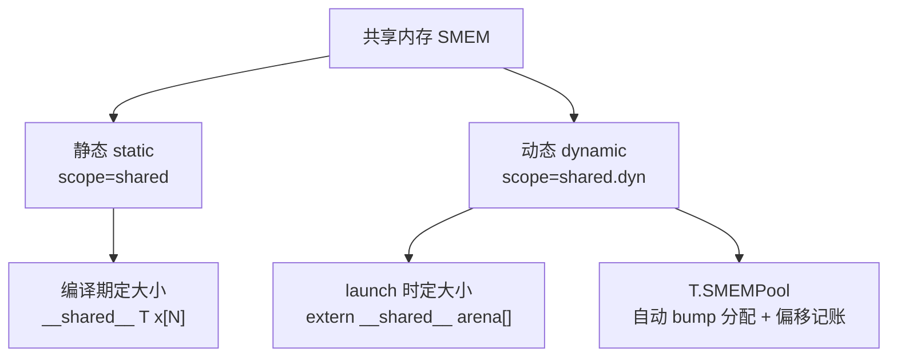
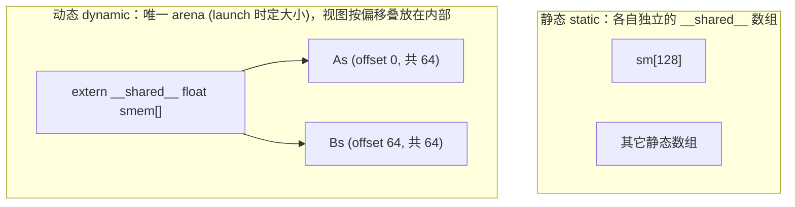
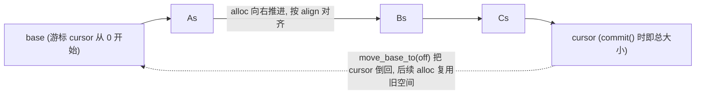
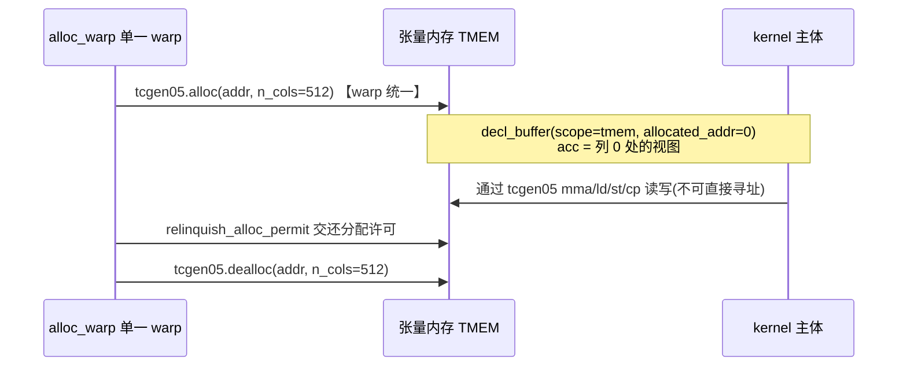

# 第 22 章 · 缓冲区与内存

> 原文:[Buffers and memory](https://mlc.ai/modern-gpu-programming-for-mlsys/tirx_guide/language_reference/cuda/buffers.html)

> **本章要点(TL;DR)**
>
> 别被下面这些词吓到,每一个本章后面都会从零讲明白,这里只是先让你扫一眼全貌。
>
> - **缓冲区(buffer)的本质就是「指针 + 元数据」**:你可以先把缓冲区理解成「一块数据 + 一张说明书」。同样一句 `B[i, j]` 的下标访问,因为说明书(我们叫它元数据:布局 layout、偏移 elem_offset)不一样,最终算出来的内存地址就完全不同。
> - 创建缓冲区只有两个根本 API:`T.alloc_buffer`(**真的去申请一块新存储**)和 `T.decl_buffer`(**在已有的一块存储上,再贴一张新说明书**,这叫一个视图 view)。`alloc_shared` / `alloc_local` 都只是 `alloc_buffer` 的简写。
> - `scope`(作用域 / 内存空间)决定了这块数据放在 GPU 的哪种内存里:`global`(所有线程都能访问的大内存)/ `shared`(一小组线程共用的高速内存,静态版)/ `shared.dyn`(高速内存的动态版)/ `local`(单个线程私有的寄存器,最快)/ `tmem`(新一代显卡上专门给矩阵乘用的张量内存)。
> - **共享内存有静态与动态两种**:静态的大小在写代码、编译时就定死了;动态的是一整块在「启动 kernel(运行 GPU 程序)那一刻」才定大小的区域,我们叫它 arena(竞技场),整个 GPU 程序只能有这么一块,你想用的其它缓冲区都是从它里面切出来的视图。`T.SMEMPool` 这个工具能自动帮你算「谁放在这块大区域的第几个字节」这种繁琐账。
> - **标量(scalar,就是单个数,比如一个计数器)其实是「只有一个元素的寄存器数组」的语法糖**;而 `T.let` 是**不可变绑定**(起个名字绑定一个算好就不再变的值),会变成普通的 C 局部变量,编译器能放开手脚优化它。**张量内存(TMEM)** 脾气特殊:必须你亲手申请和释放,还不能直接用地址访问,只能通过专门的 `tcgen05` 指令来读写。

---

> **前置知识**:这一章会用到几个 GPU 的基本概念,我先用一两句话给你交个底,后文每个都会展开讲,所以读不懂也别慌。
>
> - **GPU 为什么有「内存层级」?** 因为 GPU 上同时跑着成千上万个小工(线程)在算数。给每个线程都配一份「跑得最快但极小」的内存(寄存器),给一小组线程配一块「快、稍大、能互相传东西」的内存(共享内存),再给所有线程配一块「慢但巨大」的内存(全局内存)。越快越小、越慢越大,这就是「层级」。本章主角就是教你怎么在 TIRx 里申请和使用这几层内存。
> - **寄存器 / 共享内存 / 全局内存** 就是上面这三层,从快到慢、从小到大。
> - **静态 vs 动态共享内存、TMEM** 是本章后面会专门讲的词,现在不认识完全没关系。
> - 至于 TIRx 的基本写法(`T.prim_func`、`T.match_buffer` 这类装饰器和函数),有个印象就行,看到时我会顺带解释。
>
> 没把握的话,先翻一下 [第 0 章 · 极简入门](./ch00_gpu_ml_primer.md),以及第 9 章 TIRx。

> **一句话先理解**:在 TIRx 里,一个缓冲区(buffer)不是装数据的盒子,而是「一根指针 + 一张说明书」。说明书改一改,同一句下标就指向不同的地方。

这一章讲的是 TIRx 的**内存模型**,在整个「语言参考」里算是骨干。这里先解释两个词:**TIRx** 你就理解成「一种用 Python 写、专门用来生成 GPU 代码的语言」;**内存模型**就是「这门语言怎么描述数据放在哪、怎么访问」。

想读懂这一章,你只要先抓住一句话:在 TIRx 里,一个缓冲区 / buffer **并不是一个真的装着数据的「盒子」**。

打个比方。在普通编程里你可能习惯把数组想象成「一排带格子的柜子,数据就躺在格子里」。但在 TIRx 里,缓冲区更像是贴在一根**指针**(指针就是「某块内存从哪个地址开始」的记号,跟 C 语言里的指针是一回事)上的一张**标签**——标签上写着「这块数据有多大、是几维的、每个元素多大、按什么顺序摆放、该怎么从下标算出地址」。真正的数据躺在指针指向的那块内存里,而缓冲区本身只是这张标签。这些写在标签上的描述信息,我们统称**元数据**(metadata,就是「描述数据的数据」)。

为什么要这么设计?说白了,就是图个省事和高效:这样一来,绝大多数缓冲区方法干的活儿,无非是在**编译期**(也就是「把你的代码翻译成 GPU 能跑的机器码」那个阶段,程序还没真正运行)改改这张标签——换个形状、换种读法而已。它们影响的只是「下标最后怎么翻译成内存地址」,等程序真跑起来时,一条多余的指令都不会多出来。这个道理一旦想透,后面所有 API 为什么长成那个样子,你立马就全懂了。

## 一、缓冲区的统一心智模型

先混个脸熟:在 TIRx 里,缓冲区来来回回就这么几种玩法。这几行代码里有些函数你不认识没关系,先看右边的中文,知道「能拿缓冲区干哪几类事」就够了。

- **包装参数指针**:`T.match_buffer(ptr, shape, dtype, ...)`,把外面(比如 GPU 程序的调用方)传进来的一根裸指针,包装成一个有形状、有类型的缓冲区,这样你才能用 `A[i, j]` 这种舒服的下标去访问它。
- **下标访问**:`A[i, j]`,读写某个元素,跟你平时用二维数组一模一样。
- **切片**:`A[m0:m0+BM, 0:BK]`,取出一块子区域(一个矩形小块),得到一个 `BufferRegion`(缓冲区区域 / buffer region,就是「缓冲区里的一块范围」)。
- **取指针**:`A.ptr_to([i, j])` 拿某个元素的内存地址,或者 `A.data` 拿这块存储最开头的那根原始指针。

这里有一句最要紧的话:**只要不是 tmem(那个脾气特殊的张量内存,本章最后才讲),所谓「声明一个缓冲区」,说到底就是「给一根指针配上一个布局 layout」**。

这里插一句解释 **布局 / layout** 是啥:它就是「数据在内存里按什么顺序摆」的规则。同样一个二维数组,你可以一行一行地铺(行主序),也可以一列一列地铺(列主序),摆法不同,`A[i, j]` 这个元素实际落在内存第几个位置就不同——布局管的就是这件事。

「指针 + 布局」这两样凑齐了,随便你写哪个下标,最后都能算出一个内存地址来。这个地址怎么算,原文给了个公式,值得记一记:

```text
addr(buffer[coord]) = buffer.data + elem_offset + layout.apply(coord, shape=shape)["m"]
```

公式看着挺唬人,但拆开其实就三块加起来:「起点 + 挪一段 + 按坐标算偏移」。打个比方,这就像在停车场找车位:先有停车场大门口(起点),再走到你那一排的入口(挪一段),最后数到第几个车位(按坐标算)。一个个说:

| 组成部分 | 大白话 |
| --- | --- |
| `buffer.data` | 起点指针,也叫基址 / base pointer,就是这块存储从哪个内存地址开始 |
| `elem_offset` | 在起点的基础上再往后挪几个元素;它的用处是,让一个「视图」从 `data` 的某个位置开始,而不是非得从最开头开始 |
| `layout.apply(coord, ...)["m"]` | 把多维坐标 `coord`(比如 `[i, j]`)换算成一维的「第几个元素」;`"m"` 就是这个换算结果里的「元素偏移」那一项(layout 还会算别的项,这里我们只关心偏移) |

符号你不用死记,记住这条思路就够了:**从哪儿开始 + 往后挪多少 + 坐标算出多少**,三者一加就是地址。

> **关键**:同样一句 `B[i, j]`,**就因为缓冲区的元数据不一样**,编译出来的地址算术能差出十万八千里。元数据是编译期就钉死的,到了运行时,剩下的不过是对裸指针做加减乘罢了。

下面我用一组对照例子,把这套心智模型给你坐实。先说明一下:**行主序(row-major)** 就是「一行一行地铺」,第 0 行铺完接着铺第 1 行,这是最常见的摆法(C 语言、NumPy 默认都是它)。在一个有 8 列的数组里,`A[i, j]` 这个元素就落在第 `i*8 + j` 个位置——你想啊,前面 `i` 整行各占 8 个,再加上这一行里的第 `j` 个,正好。

我们对一块 `4×8`(4 行 8 列)的区域干同一件事 `B[i, j] = A[i, j] + 1`(把 A 的每个元素加 1 存到 B),但**只动 `B` 的声明方式**,看看地址会跟着怎么变。`A` 我们让它一直是行主序,所以 `A[i,j]` 的下标永远是 `i*8 + j`,雷打不动——这样你就能专心盯着 `B` 一个看了:

```python
from tvm.tirx.layout import TileLayout, S

# 1) 行主序(row-major):默认布局
B = T.match_buffer(p, (4, 8), "float32")
# 2) 列主序(column-major):用 TileLayout 指定 stride 为 (1, 4)
B = T.match_buffer(p, (4, 8), "float32", layout=TileLayout(S[(4, 8):(1, 4)]))
# 3) 平移视图(shifted view):整体偏移 64 个元素
B = T.match_buffer(p, (4, 8), "float32", elem_offset=64)
# 4) 行 stride 改成 16:每行跨 16 个元素而非紧密的 8 个
B = T.match_buffer(p, (4, 8), "float32", layout=TileLayout(S[(4, 8):(16, 1)]))
```

还是那句 `B[i, j]`,这四种声明生成的 CUDA 下标,各是各的样:

```c++
B_ptr[((i * 8) + j)]        = ...;   // 行主序:        i*8 + j
B_ptr[((j * 4) + i)]        = ...;   // 列主序:        j*4 + i
B_ptr[(((i * 8) + j) + 64)] = ...;   // elem_offset=64: i*8 + j + 64(整体平移 64)
B_ptr[((i * 16) + j)]       = ...;   // 行 stride 16:   i*16 + j(每行间隔 16)
```

读这四行对照,你会发现一个规律:**布局只改了「怎么算地址」,没改你写的下标 `B[i, j]`。** 列主序里 `B[i,j]` 算成 `j*4 + i`(一列一列铺,4 行,所以列号 `j` 乘 4);`elem_offset=64` 就是整体往后挪 64;行 stride 改成 16,就是每行之间留出 16 个元素的间隔(哪怕实际只用了 8 个)。同一句下标,四种地址,这就是「元数据说了算」的最好证据。

> **注意**:`TileLayout(S[(shape):(strides)])` 你就读成「形状 : 每个轴的步长 / stride」。步长(stride)是啥?就是「这个轴的下标每加 1,地址要往后跳几个元素」。拿行主序的 8 列数组举例,列号 `j` 每加 1 就往后挪 1 个,所以列这个轴步长是 1;行号 `i` 每加 1 要跳过一整行(8 个),所以行这个轴步长是 8。再拿 `S[(4,8):(1,4)]` 来说:第 0 轴(行)步长是 1、第 1 轴(列)步长是 4——也就是说列号每加 1 跳 4 个、行号每加 1 跳 1 个,这不正好就是「一列一列铺」的列主序嘛。把步长这个概念吃透,等于拿到了理解一切「视图变换」的钥匙。

## 二、声明缓冲区:两个根本 API

能造缓冲区的 API,统共就两个。它俩的区别只在一处:**到底要不要去申请一块新存储**。

> **一句话先理解**:`alloc_buffer` 是「我要一块新地方」;`decl_buffer` 是「这块地方已经有了,我只想换张说明书重新看它」。

### 2.1 `T.alloc_buffer` —— 分配新存储

```python
T.alloc_buffer(shape, dtype, scope=..., ...)
```

它会**实打实地去申请一块新存储**(用术语说,是在 IR 里吐出一个 `AllocBuffer` 节点;IR 就是「程序的中间表示」,你可以理解成编译过程中代码的内部样子),然后把一个 `Buffer` 对象还给你。它有两个常用的简写:

- `T.alloc_shared(...)` 就是 `scope="shared"`(放进共享内存)的 `alloc_buffer`。
- `T.alloc_local(...)` 就是 `scope="local"`(放进寄存器)的 `alloc_buffer`。

(`scope` 这个词指「这块内存放在哪一层」,马上 2.3 会列全。)

### 2.2 `T.decl_buffer` —— 在已有指针上声明视图

```python
T.decl_buffer(shape, dtype, data=..., ...)
```

它**一块新存储都不申请**,只是在一根现成的指针 `data` 上「再开一个视图」。说白了,就是给同一块存储起个别名(alias,同一块内存的另一个名字),或者换种眼光重新解读(reinterpret)它——比方说「我想把某块大内存里中间那一段单独当成一个数组来用」。这在后面讲的内存池、张量内存里会反复用到。

> **关键**:`decl_buffer` 有个小例外——要是你传了 `data=None`(意思是「我没有现成指针给你」),它手头就没存储可用了,这时它会退一步,像 `alloc_buffer` 那样**自己掏腰包申请**一块。所以你可以把 `alloc_buffer` 看成 `decl_buffer(data=None)` 的特例。

归根结底,这两者的差别就一处:那根 `data` 指针(它在 TIRx 里是个不可变的 `Var`,`Var` 你就理解成「一个一旦绑定就不能再改的变量名」)究竟从哪儿来:

| API | `data` 指针从哪来 |
| --- | --- |
| `alloc_buffer` | 它**自己造**出这个 `data`(这次分配的产物) |
| `decl_buffer` | 它**接收**一个已经存在的 `data`(从外面传进来) |

> **注意**:要是你手里是个**指针表达式**(而不是现成的 `Var`),想拿它来撑起缓冲区,那得先把它绑定成一个 `Var` 才行(具体怎么绑,见原书「数据类型与表达式」那章)。

### 2.3 共享的描述符参数

这两个 API 共用同一套描述参数。挑几个最常打交道的看看:

| 参数 | 含义 |
| --- | --- |
| `dtype` | 元素类型,如 `"float32"`、`"float16"`、`"float4_e2m1fn"` 等 |
| `shape` | 逻辑形状(各维 extent 组成的元组) |
| `layout` | 物理映射(`TileLayout`);`"default"` 即稠密行主序 |
| `elem_offset` / `byte_offset` | 把一个**视图**放到 `data` 的某个偏移处 |
| `allocated_addr` | 携带一个**预先指定的地址**(用于张量内存) |
| `align` | 数据指针的对齐字节数 |

还有个 `scope` 参数,它说了算的是:这块缓冲区到底落在 GPU 的**哪一层内存**里。前面前置知识里说过 GPU 内存分快慢层级,这张表就是把每一层对应到一个 `scope` 名字。这条线索本章后面几节会反反复复出现,你先认个脸:

| Scope | 快捷方式 | 对应内存(大白话) |
| --- | --- | --- |
| `"global"` | (默认) | 全局内存(global memory):最大但最慢,所有线程都能访问,数据从外面进来一般先落这里 |
| `"shared"` | `T.alloc_shared` | 静态共享内存:一小组线程共用的高速便签纸,大小编译时定死(对应 C++ 里的 `__shared__`) |
| `"shared.dyn"` | (走内存池) | 动态共享内存:同样是高速便签纸,但大小启动时才定(下文细讲) |
| `"local"` | `T.alloc_local` | 寄存器(registers):每个线程私有、最快,放它自己的临时小数据 |
| `"tmem"` | (走 TMEM 池) | 张量内存(tensor memory):新一代 Blackwell 显卡上专给矩阵乘用的特殊内存 |

下面这段把四种典型用法摆在一块儿,你对照着看:

```python
A   = T.match_buffer(A_ptr, (M, K), "float16", align=16)    # 把外面传进来的指针包成全局内存缓冲区
As  = T.alloc_shared((BM, BK), "float16")                   # 申请一块新的共享内存小方块(tile)
acc = T.alloc_local((4,), "float32")                        # 申请 4 个寄存器,当累加器用
view = T.decl_buffer((BM, BK), "float16", data=As.data)     # 不申请新内存,在 As 那块存储上再开一个视图
```

逐行说一下(这里 `M K BM BK` 都是表示尺寸的数字):第一行把调用方传进来的裸指针 `A_ptr` 包成一个 `M×K` 的 `float16`(16 位浮点数)缓冲区;第二行真的去共享内存里要了一块 `BM×BK` 的新地方;第三行在寄存器里要了 4 个 `float32`(32 位浮点数)的格子;第四行没要新内存,只是把第二行那块 `As` 的指针(`As.data`)拿来,贴一张新说明书重新看它。`tile`(小方块)这个词在 GPU 编程里很常见,指「从一个大矩阵里切出来的一小块」,后面会多次出现。

## 三、共享内存(shared memory)

> **一句话先理解**:共享内存是「一小组线程能共用的一块高速便签纸」,比全局内存快得多,但容量很小。线程之间想互相传数据,把它当中转站最划算。

先说说**为什么需要共享内存**,不然你不知道它解决什么问题。全局内存又大又慢,如果每个线程算东西都反复去全局内存读同一份数据,会慢得要命。于是 GPU 给「一组协作的线程」配了一小块又快又近的内存,叫共享内存:大家先把要反复用的数据从全局内存搬一份到这里,之后就在这块快内存上来回读写,省下大量慢访问。它有点像你给一组同事配了一块共用白板——比每人都跑去档案室翻文件快多了。

共享内存 / shared memory(往下简称 SMEM)有两种「口味」:**静态**和**动态**。怎么分?就看一点——它的大小是**编译时**(写代码翻译阶段)就定死了,还是**每次启动 kernel 的时候**(运行时)才现定。这里的 **kernel** 就是「一段在 GPU 上跑的程序」,你每次让 GPU 干活就叫「启动(launch)一个 kernel」。除此之外 TIRx 还配了个内存池(pool)帮手,专门收拾动态这种麻烦事,后面会讲。



### 3.1 静态共享内存

最省事的共享缓冲区就是**静态**这种——用 `T.alloc_shared`(也就是 `scope="shared"`),大小在编译时就钉死。

它最经典的套路是三步走:**先把数据从全局内存搬进共享内存 → 拿 `cta_sync` 让整组线程都「看见」这次写入 → 再读回来用**。

中间这步 `cta_sync` 很关键,先解释一下**为什么需要它**。GPU 上一组线程是同时在跑的,但它们的快慢并不完全一致。假设线程 A 往共享内存写了个数,线程 B 想读这个数——可万一 B 跑得快,在 A 还没写完就来读了呢?那读到的就是垃圾。`cta_sync` 就是一道「集合栅栏」:所有线程跑到这一行都得停下等齐,等大家都到了再一起往下走。这样就保证「等到栅栏之后,前面所有人写的东西,大家都能看到了」。

这里再解释两个词:**block / CTA** 指「一组会协作、并且共享同一块共享内存的线程」(block 是俗称,CTA 是它的正式名 Cooperative Thread Array);`cta_sync` 里的 cta 就是指它。

```python
@T.prim_func
def smem_demo(A_ptr: T.handle, B_ptr: T.handle):
    A = T.match_buffer(A_ptr, (128,), "float32")
    B = T.match_buffer(B_ptr, (128,), "float32")
    T.device_entry()
    bx = T.cta_id([1])
    tx = T.thread_id([128])
    sm = T.alloc_shared((128,), "float32")   # 申请一块 128 个 float 的共享内存
    sm[tx] = A[tx]                           # 每个线程把自己那一格从全局搬进共享
    T.cuda.cta_sync()                        # 集合栅栏:等所有线程都搬完
    B[tx] = sm[tx] * T.float32(2.0)          # 再从共享内存读回来,乘 2,写回全局
```

逐行讲一下,因为这里有几个 GPU 专有的写法你没见过:

- `@T.prim_func` 是个装饰器,意思是「下面这个函数是一段要在 GPU 上跑的 kernel」。
- `T.handle` 是参数类型,你就理解成「一根从外面传进来的裸指针」。
- `T.device_entry()` 标记「从这里开始就是设备(GPU)上执行的代码了」。
- `tx = T.thread_id([128])` 拿到**当前线程的编号**。这是 GPU 编程的精髓:同一段代码会被 128 个线程同时跑,每个线程的 `tx` 不一样(0 到 127)。所以 `sm[tx] = A[tx]` 这一句,128 个线程一起执行,效果就是 128 个格子被各自的线程并行搬好了——这就是 GPU「一条代码,千军万马同时跑」的并行方式。
- `bx = T.cta_id([1])` 类似地拿到「当前这一组(block)的编号」,这个例子里只有一组,用不太上。

它会老老实实变成一段普普通通的 C++/CUDA 代码,核心是一个 `__shared__` 数组(`__shared__` 就是 CUDA 里声明共享内存的关键字):

```c++
__shared__ alignas(64) float sm_ptr[128];      // 对应 T.alloc_shared
sm_ptr[tx] = A_ptr[tx];
__syncthreads();                               // 对应 T.cuda.cta_sync()
B_ptr[tx] = sm_ptr[tx] * 2.0f;
```

### 3.2 动态共享内存

**为什么会有「动态」这种?** 静态共享内存的大小写死在代码里,可有时候你要用多少共享内存,得等程序跑起来、知道了实际数据规模才能定。这种「编译时还不知道、运行时才定」的需求,就得靠动态共享内存。

**动态**共享内存(`scope="shared.dyn"`,dyn 是 dynamic 动态的缩写)的大小不在编译时定,而是**每回启动 kernel 时**,靠一个叫 `sharedMemBytes`(共享内存字节数)的启动参数当场指定。它有条铁律,你先记牢:

> **关键**:一个 kernel **只准有一块**动态共享内存——就那一大整块,我们管它叫「arena / 竞技场」(arena 就是「一大片公共场地」的意思)。所以你只分配它这一次,然后用 `T.decl_buffer`(把 arena 的指针 `data` 传进去,再配一个 `elem_offset` 偏移),把你要用的每个逻辑缓冲区,都声明成「这块大竞技场内部某个位置上的一小块视图」。换句话说:动态版只有一块大地皮,你想要几个数组,就在这块大地皮上划几块地,各占一段。

```python
arena = T.alloc_buffer((128,), "float32", scope="shared.dyn")   # 申请唯一的那块大竞技场(128 个 float)
# 在 arena 上 decl 两个视图,一个从第 0 个元素开始,一个从第 64 个元素开始
As = T.decl_buffer((64,), "float32", data=arena.data, scope="shared.dyn")                 # 占前 64 个
Bs = T.decl_buffer((64,), "float32", data=arena.data, elem_offset=64, scope="shared.dyn") # 占后 64 个
As[tx] = A[tx]
Bs[tx] = B[tx]
T.cuda.cta_sync()
C[tx] = As[tx] + Bs[tx]
```

读这段的关键:`arena` 是唯一真正申请的那一块(128 个 float)。`As` 和 `Bs` 都没有申请新内存,它们都拿 `arena.data`(竞技场的起始指针)当 `data`,区别只在 `elem_offset`:`As` 不偏移(从第 0 个开始),`Bs` 偏移 64(从第 64 个开始)。于是 `As` 占了前半截 0~63,`Bs` 占了后半截 64~127,正好把竞技场分两半用。

这两个视图,共用的是同一块用 `extern __shared__` 声明的竞技场(`extern __shared__` 是 CUDA 里声明「动态共享内存」的固定写法,中括号里不写大小,正是因为大小要等启动时才填;下面为了看得清楚,我把这块竞技场起名叫 `smem`)。你会看到 `As` 直接用 `smem[tx]`,`Bs` 则是 `smem[tx + 64]`——那个 `+64` 就是 `Bs` 的 `elem_offset` 变出来的: 

```c++
extern __shared__ __align__(64) float smem[];   // 唯一的动态共享 arena
smem[tx]      = A_ptr[tx];                       // As —— 偏移 0 处的视图
smem[tx + 64] = B_ptr[tx];                       // Bs —— 偏移 64 处的视图
__syncthreads();
C_ptr[tx] = smem[tx] + smem[tx + 64];
```

下面这张图把两者的区别画清楚了:静态是「彼此独立的几块小数组」,动态是「一整块 arena,视图都叠在它里头」:



图注:静态共享内存是几块各自独立的小数组;动态共享内存只有一整块 `arena`（`smem[]`，大小在 launch 时确定),`As` 落在偏移 0、`Bs` 落在偏移 64,两个加起来正好填满 0~128。

> **注意**:千万别手一抖写了两次 `alloc_buffer(scope="shared.dyn")`,那是**错的**——动态共享内存只许分配一块。一句话把两者拎清:静态共享内存编译时就定好大小(`__shared__ T x[N];`);动态共享内存呢,是独此一块、启动时才定大小的 arena,你想要的各个视图,都靠 `decl` 在它内部不同偏移上声明出来。

#### 动态共享大小是怎么被传进去的?

这里有个特别容易绕晕的点:既然大小是启动时才定的,那 `sharedMemBytes` 到底是谁填进去的?答案是——**根本轮不到你手动填**,TVM(就是 TIRx 背后那套编译器框架)会照着你 `shared.dyn` 分配的大小,自动把它算出来。

(顺带说两个词:**host 端**指「CPU 这边的代码」,负责发号施令、启动 GPU 程序;**device 端 / 设备端**指「GPU 那边真正干活的代码」。一次 GPU 计算,总是 host 端把 GPU 程序连同参数一起递过去启动。**lowering / 下降**则是编译里的一步,指「把高层写法一层层翻译成更底层、更接近机器的形式」。)

整个流程是这样:

1. 其实呢,竞技场多大,编译时就已经心里有数了(上面例子里是 `128` 个 float,每个 float 4 字节,合计 `512` 字节)。
2. 到了 lowering 这一步,TVM 会往设备 kernel 的启动参数清单(`tirx.kernel_launch_params`)里塞一个 `"tirx.use_dyn_shared_memory"` 标记,意思是「这个 kernel 要用动态共享内存,记得把大小补上」。
3. host 端的启动器一看到这个标记,就把总字节数算好(512),当成**最后一个**启动参数递进去。

```python
# 设备 kernel 属性:最后多了一个 use_dyn_shared_memory 标记
"tirx.kernel_launch_params": ["blockIdx.x", "threadIdx.x", "tirx.use_dyn_shared_memory"]

# host 端启动调用(..., gridDim.x, blockDim.x, dyn_shared_bytes):
T.call_packed("dyn_kernel", A.data, B.data, C.data, 1, 64, 512)
```

等跑起来,这个 `512` 就被填进真正启动 GPU 程序的那个调用(`cuLaunchKernelEx`,CUDA 的内核启动函数)的 `sharedMemBytes` 参数里。从头到尾一条龙,全自动,你啥都不用管——你只管写 `shared.dyn` 分配,字节数 TVM 替你数。

### 3.3 内存池语法糖:`T.SMEMPool`

前面那种做法——手动 `decl` 一堆视图、自己掰手指头算「这块从第几个开始、那块从第几个开始」——又烦人又容易出错(算错一个偏移,两块视图就会打架、互相覆盖)。`T.SMEMPool`(SMEM 内存池)就是来替你包这个脏活的:竞技场里「谁占哪一段」的记账,它给你**全自动**搞定。

它的工作原理叫**碰撞分配器 / bump allocator**。这个名字听着玄,其实特别简单:想象一把尺子,有个游标(cursor)从 0 开始。你每问它要一块内存,它就把游标往后推相应的长度,然后告诉你「你那块就从刚才游标停的地方开始」。一块接一块地往后顶,所以叫「碰撞 / bump」。视图怎么放、偏移多少,全是它在背后帮你记,你一行都不用自己写。

除了最基本的 `alloc`(要一块)/ `commit`(收工,定下总大小),它还附送几个贴心的小帮手:

- **逐块指定 `align=`**:某一块缓冲区想单独设个对齐(对齐 = 要求这块地址是某个数的整数倍,某些硬件指令有这种要求)?可以。
- **`alloc_mma` 帮手**:自动给你配好一个 MMA 专用的特殊布局。这里两个词解释下:**MMA**(matrix-multiply-accumulate,矩阵乘累加)是 GPU 里专门飞快算矩阵乘法的硬件单元(叫 Tensor Core)干的活,矩阵乘是深度学习里最核心、最频繁的运算;**swizzle**(可以理解成「故意把数据错位摆放」)是为了避开一种叫 bank 冲突(多个线程同时挤到共享内存的同一个小口子上,导致排队变慢)的性能问题。这些细节你现在不用懂,知道「`alloc_mma` 替你把矩阵乘需要的特殊摆法都安排好了」即可。
- **`move_base_to`**:把游标往回倒一倒,这样后面再要的内存就会**盖在前面那块上、复用同一片空间**(适合「前一块用完了、不要了,把地方让给后一块」的场景,省内存)。

```python
pool = T.SMEMPool()                                # 建一个内存池(背后就是那块动态共享竞技场)
As = pool.alloc((BM, BK), "float16", align=128)    # 要一块小方块,游标往后推
Bs = pool.alloc((BK, BN), "float16", align=128)    # 再要一块,接着往后推
Cs = pool.alloc_mma((BM, BN), "float16")           # 要一块矩阵乘专用的,特殊摆法自动配好
pool.commit()                                       # 收工:游标停哪,内存池就多大
# pool.move_base_to(offset) 把游标倒回去,后面再 alloc 就复用前面的空间
```

对比一下:用了内存池,你只管一句句 `pool.alloc(...)`,完全不用关心「这块该放第几个字节」——而前面手写 `decl_buffer` 时,那个 `elem_offset=64` 是你自己算出来的。内存池把这种容易算错的账全接管了。

> **注意**:后面要讲的 **TMEM 池(`T.TMEMPool`),其实就是叠在一个 `SMEMPool` 上面的**。所以你现在把 `SMEMPool` 这套 bump 分配的路数搞明白,待会儿看 TMEM 会顺畅很多。

`SMEMPool` 怎么做 bump 分配,看一眼图就明白了:



图注:`SMEMPool` 是个碰撞分配器,游标从 0 起步,每 `alloc` 一次就往右推进一段(顺带按 `align` 对齐);到 `commit()` 那一刻,游标停在哪儿,内存池就有多大;`move_base_to(off)` 能把游标倒回去,让后面的分配覆盖、复用前面那块空间。

## 四、寄存器(registers)

> **一句话先理解**:寄存器是每个线程**私有**的、GPU 上**最快**的存储,放线程自己算东西时的临时小数据。它跟 CPU 寄存器是同一个概念,只不过在 GPU 上是**每个线程各有一份**。

如果你写过底层代码,大概知道 CPU 有寄存器——CPU 算数时,操作数得先在寄存器里才能算,寄存器是离运算器最近、最快的那一小撮存储。GPU 也一样,而且因为同时跑着成千上万个线程,**每个线程都独立拥有自己的一份寄存器**,互不干扰。线程做循环计数、累加中间结果这类「只给自己用、马上要算」的小数据,放寄存器最划算。

想要这种存储,就用 `T.alloc_local(shape, dtype)`(也就是 `scope="local"`)来分配。它**每个线程一份、谁也不碍着谁**,最后会变成一个**蹲在寄存器里的本地数组**:

```python
r = T.alloc_local((4,), "float32")   # 给当前线程要 4 个 float 的寄存器
for k in T.unroll(4):                 # T.unroll 表示「把这个循环展开成 4 行直写」
    r[k] = A[tx, k]                   # 把 A 里属于本线程的 4 个数读进寄存器
# ... 接着在 r[0]~r[3] 上做计算 ...
```

这里 `T.unroll(4)` 解释一下:**展开(unroll)** 就是把 `for k in range(4)` 这种循环,直接摊成 `r[0]=...; r[1]=...; r[2]=...; r[3]=...` 四行写死的代码。为什么要展开?因为这样一来,下标 `k` 在编译时就是确定的常数(0/1/2/3),编译器一看「啊这就是固定的几个格子」,才好把它们干脆塞进寄存器,而不是放进慢一些的内存。

```c++
alignas(64) float r_ptr[4];          // 每线程私有,驻留寄存器
r_ptr[0] = A_ptr[tx * 4 + 0];
r_ptr[1] = A_ptr[tx * 4 + 1];
// ...
```

> **注意:那个看着莫名其妙的 `alignas(64)` 到底咋回事?**(`alignas(64)` 是 C++ 里要求「这块数据的地址必须是 64 的整数倍」的写法,即前面说的「对齐」。)它其实就是缓冲区的**默认**对齐值——代码里默认取 64 字节。生成 CUDA 代码的那一步不管三七二十一,把这个 64 一股脑盖到**每一个**分配头上,连这种「对它压根没意义」的每线程 `local` 寄存器数组都不放过。
>
> 不过你别担心,这个 64 字节对齐放在寄存器数组上**一点不影响性能**。为啥?因为一个下标在编译时就能算死的线程本地数组(就像上面展开后的 `r[0]`~`r[3]`),会被 GPU 编译器(nvcc/ptxas)直接塞进寄存器,根本不会落到那种「带真实地址的内存」里去。既然都进寄存器了,对齐(本来是针对内存地址的要求)自然成了空操作,写了等于白写。(这招把小数组拆进寄存器的优化术语叫「聚合体的标量替换 / SROA」,名字记不住没关系。)只有当数组用上了**编译时算不出的动态下标**、被迫挪回内存(术语叫 spill / 溢出)时,这个多余的对齐才会真起作用——可那是少数情况。原文也承认这是个已知的「小毛刺」,以后会修。

### 4.1 标量(scalar):一个元素的寄存器数组

先解释下 **标量(scalar)** 这个词:它就是「单独一个数」,跟数组、矩阵相对——比如一个循环计数器 `i`、一个累加和 `sum`,都是标量。

这一节要讲个可能有点反直觉的事:在 TIRx 里,**标量根本不是什么新东西**——它就是「只有一个元素的寄存器数组」。不信你瞧,完全可以分配一个大小为 1 的 `local` 缓冲区,然后用 `[0]` 来读写它:

```python
phase = T.alloc_local((1,), "int32")   # 1 个元素的寄存器数组
phase[0] = 0
while phase[0] < 4:
    acc = acc + A[tx, phase[0]]
    phase[0] += 1
```

可满屏都是 `phase[0]`,本来一个计数器,却处处带着个 `[0]`,看着实在别扭。于是「标量」就是为这事加的一层**语法糖**(语法糖 = 更顺手的写法,背后干的还是同一件事)——让你**直接拿名字**(`phase` 而不是 `phase[0]`)读写的单元素寄存器缓冲区:

```python
phase: T.int32 = 0                 # 可变标量(就是上面那段的语法糖)
while phase < 4:
    acc = acc + A[tx, phase]
    phase += 1

s = T.local_scalar("int32")        # 显式形式;按名字赋值(写 s = ...,不是 s[0])
acc: T.float32 = 0.0               # 带类型标注的赋值也会产生一个标量
```

> **关键**:这两种写法可不只是「长得像」——它们**解析出来的内部结构压根就是同一个**。这层糖在 parser(解析器,就是把你写的代码读进来、转成内部结构的那一步)阶段就化没了:`phase: T.int32` **就是**那个单元素 `local` 缓冲区,`phase` / `phase += 1` **就是** `phase[0]` / `phase[0] += 1`。
>
> 怎么证明它俩真的一样?把这两种写法的 kernel 各转成内部结构,用 `tvm.ir.assert_structural_equal`(一个「断言两段 IR 结构完全相同」的检查函数)一比,直接通过;反过来,负责把内部结构打印成代码的 printer,甚至会主动把显式的 `alloc_local + [0]` 重新打印成标量那种简洁写法。换句话说,解析一结束,两者就再无分别——最后都变成同一句 C 代码 `alignas(64) int phase_ptr[1];`。要是你想显式指定这个标量放哪层内存,就用 `T.local_scalar`(寄存器)/ `T.shared_scalar`(共享内存)/ `T.alloc_scalar`。

> **注意:那为啥不干脆用一个普通变量(`Var`)?** 因为 TIRx 的 `Var` 是**不可变**的——它只是个一次性绑定,绑了就不能再改(下一节的 `T.let` 吐出来的就是这玩意)。可标量要的恰恰是**可变**:循环计数器要一遍遍加 1,累加器(accumulator,就是「边算边把结果累加进去」的那个变量,比如求和时的 `sum`)要一次次更新。这种「反复重新赋值」的需求,不可变的 `Var` 干不了,所以只能靠一个「能反复写入」的单元素缓冲区来撑——这就是标量背后非得是个缓冲区的原因。

### 4.2 `let`:不可变绑定

> **一句话先理解**:`let` 就是「给一个算好就不再变的值起个名字」,它不是变量、不占内存,纯粹是个名字。

`T.let` 绑定是**不可变**的——它对应一个 `LetStmt`(let 语句),干的事就是「给一个值起个名字」,而不是开一块缓冲区。它跟上一节的标量正好相反:标量是「能反复改的盒子」,`let` 是「绑一次就钉死的名字」。它特别适合用来定义那种算一次就再也不变的派生常量(比如由几个尺寸乘出来的总数):

```python
n: T.let = M * K               # 不可变绑定(LetStmt)
half: T.let[T.int32] = N // 2  # ... 带显式类型
```

它会下降成一个**普通的 C 标量变量**——注意,不是缓冲区,没有数组,也没有 `[0]` 那一套。拿 `half: T.let = m * 2` 举个例子(`m` 是个运行时才知道的值):

```c++
int half = m * 2;     // let -> 一个类似 const 的局部变量
```

正因为这个值一辈子不会变,简化器(simplifier)就能放开手脚,把它到处传播、顺手做公共子表达式消除(CSE)。所以在用到它的地方,你常常直接看到 `m * 2` 被代了进去,而压根见不到对 `half` 的引用。

> **注意:为啥要专门整出个「不可变绑定」?** 一句话你先记着——因为值不变,编译器的分析器才能把它对这个值证出来的所有结论,一路带到每个用它的地方去。
>
> 说细点(这段是给好奇的人看的,跳过不影响理解):编译器里有个**算术分析器**(专门推理「这个值大概是多少、有什么性质」的部件)。碰到 `let` 时,它会把这个名字跟它的值牢牢绑住。这么一来,凡是关于这个值能推出来的事实——它的取值范围、能不能被某个数整除、对齐情况——统统能**跟着这个名字传到每一个用到它的地方**。这些信息拿去干嘛?用来简化下标算式、消掉没必要的边界检查、判断能不能做向量化(把多个元素打包一次处理)——都是实打实的提速。
>
> 反过来看**可变标量**就吃亏了:它说到底是一次内存读取(`buf[0]`),既然值随时可能被改,分析器就不敢假设它一直是某个常量,上面那堆好处一个都传不下去。再补一刀:`let` 是个**纯值**——不占任何内存分配,编译器想把它直接代入、合并重复计算(术语叫 CSE,公共子表达式消除,意思是「同一个算式只算一次」)都随便;而标量是个带读写的单元素缓冲区,没这份自由。

标量和 `let` 到底差在哪,一张表看个明白:

| 维度 | 标量 scalar | `let` 绑定 |
| --- | --- | --- |
| 可变性 | **可变**(可反复赋值) | **不可变**(单次绑定) |
| 底层实现 | 单元素 `local` 缓冲区(load/store) | `LetStmt`,下降成普通 C 局部变量 |
| 分配 | 有(1 元素数组) | 无 |
| 分析器能否传播常量/对齐性 | 否(被当作内存加载) | **能**(绑定到值,事实穿透每个使用点) |
| 典型用途 | 循环计数器、累加器 | 派生常量(如 `M*K`) |

## 五、张量内存(tensor memory,TMEM)

> **一句话先理解**:TMEM 是最新一代显卡上、专门给矩阵乘硬件用的一块特殊内存。它不像前面几种那么随手好用,得按一套固定规矩亲手申请、亲手释放。

先交代背景。**Blackwell** 是 NVIDIA 一代 GPU 架构的代号(比之前的 Hopper、Ampere 更新;架构代号你就理解成「显卡的第几代设计」)。这一代引入了**张量内存 / tensor memory(TMEM)**——专门服务于矩阵乘硬件(Tensor Core)的一块内存。普通的共享内存、寄存器你随手 `alloc` 一下就能用,TMEM 偏不,它脾气有点「轴」,有四个特点尤其扎眼,我先逐条用大白话说清:

1. **预留和释放都得你亲手来**。不像共享内存用完了系统自动收回,TMEM 你得自己申请、自己释放,用的是 `T.ptx.tcgen05.alloc`(申请)/ `tcgen05.dealloc`(释放)这两条特殊指令。而且它们是 **warp 统一(warp-uniform)** 的——这里得解释下 **warp**:GPU 调度线程时不是一个一个调,而是 **32 个线程绑成一束、必须迈同一步**(同一时刻执行同一条指令),这一束 32 人就叫一个 warp。「warp 统一」就是说,这条指令得让一个 warp 里 32 个线程齐刷刷一起执行,不能只让其中某几个跑。
2. **每个张量都只是 TMEM 上的一个视图**。跟动态共享内存的套路一样:你不直接「申请一个张量」,而是用 `T.decl_buffer(..., scope="tmem", ...)` 在已经预留好的 TMEM 上声明一块视图。
3. **`allocated_addr` 这个参数必须填**。它是一个「列偏移」(指这块视图从 TMEM 的第几列开始)。为啥非填不可?因为矩阵乘硬件在派活时会检查它有没有给好。也正因为这样,`T.alloc_buffer(scope="tmem")` **根本用不了**——`alloc_buffer` 不会替你设这个 `allocated_addr`,所以只能用 `decl_buffer`。
4. **不能直接用地址访问**。共享内存你可以 `sm[tx]` 随便读写,TMEM 不行——它只能通过 `tcgen05` 那一套专门指令(`mma` 做矩阵乘、`ld` 读、`st` 写、`cp` 拷贝)来访问。

手动管理 TMEM 的完整流程是这样的——由某一个指定的 warp 出面发起分配,各个张量按列偏移 `decl` 成视图,用完了再让那个 warp 出来收尾释放。注意下面代码里那些 `if warp_id == alloc_warp:`,就是在保证「只让某一个 warp 来干 alloc/dealloc」这件事(回想特点 1 说的 warp 统一):

```python
addr = T.alloc_shared((1,), "uint32")             # 用一个共享槽存放分配到的基址
if warp_id == alloc_warp:                          # tcgen05.alloc 是 warp 统一的
    T.ptx.tcgen05.alloc(T.address_of(addr), n_cols=512, cta_group=cta_group)
acc = T.decl_buffer((CTA_M, 512), "float32", scope="tmem",
                    allocated_addr=0, layout=tmem_layout)   # 列 0 处的视图
# ... 把 acc 当作 gemm_async / copy_async 的操作数使用 ...
if warp_id == alloc_warp:
    T.ptx.tcgen05.relinquish_alloc_permit(cta_group=cta_group)  # 交还分配许可
    T.ptx.tcgen05.dealloc(addr, n_cols=512, cta_group=cta_group)
```

把这段读一遍你就明白它有多繁琐:先用一个共享内存小槽 `addr` 存放系统分配给你的基址;然后只让 `alloc_warp` 那个 warp 调 `tcgen05.alloc` 真正预留 512 列;接着用 `decl_buffer` 在列 0 处声明出 `acc` 这块视图(`allocated_addr=0` 就是「从第 0 列开始」);中间把 `acc` 交给矩阵乘去用;最后又只让那个 warp 先交还许可、再 `dealloc` 释放。

这里头的列偏移、还有 `tmem_layout`(矩阵乘数据通路要求的一种特殊摆法,细节不用懂),通通得你自己操心。看到这儿你大概已经在皱眉头了——别急,下面要讲的内存池,自动帮你发的正是这一整套烦人的序列。

TMEM 手动管理的生命周期:



### 5.1 TMEM 池:`T.TMEMPool`

`T.TMEMPool` 把上面那一大摊子活儿全给你打包了——warp 统一的 alloc/dealloc、列偏移的 bump 分配、外加数据通路布局,一站全搞定:

```python
tmem_addr = pool.alloc((1,), "uint32")          # 先从共享内存池借一个小槽,存基址
tmem_pool = T.TMEMPool(pool, total_cols=512, cta_group=cta_group,
                       tmem_addr=tmem_addr)      # 建 TMEM 池,告诉它共用 512 列
acc = tmem_pool.alloc((CTA_M, 512), "float32")  # 要一块视图,allocated_addr 自动设好
tmem_pool.commit()                               # 收工:自动帮你发 tcgen05.alloc
# ... 把 acc 拿去做矩阵乘 ...
tmem_pool.dealloc()                              # 自动帮你发 tcgen05.dealloc
```

对比上一段手写版,你瞬间能感到轻松:那些 `if warp_id == alloc_warp`、`relinquish_alloc_permit`、列偏移记账,现在全藏进了 `commit()` / `dealloc()` 里,你只管 `alloc` 和用。

> **注意**:用 `TMEMPool` 之前,你得先递给它一个现成的 `SMEMPool`。为啥前面说过了——它是「叠」在共享内存池上头的,得借共享内存里的一个小槽,来存放分配到的基址。想看它怎么真刀真枪地用,翻原书第三部分那个 GEMM(通用矩阵乘法,GPU 上最核心的计算)kernel 就行。

## 六、缓冲区方法(Buffer APIs)

咱们绕回开头那句心智模型:**缓冲区不过是指针上的一层「说明书」(元数据)**。正因为如此,它的绝大多数方法都只是**编译期**的 reshape(换个形状看)/ reinterpret(换种解读)——要么换个算下标的方式,要么递给你一个指针,**等程序真跑起来时,这些方法自己一条多余指令都不会冒出来**。这就是为什么改形状、改布局在 GPU 上几乎「免费」:你改的只是那张编译期的说明书。常用的方法先扫一眼,看不懂的列后面会挑重点逐个讲:

| 方法 | 它是什么 |
| --- | --- |
| `B.data` | 原始数据指针(一个 `Var`);打印成 `B_ptr` |
| `B.ptr_to([i, j])` | 指向某元素的有类型指针(即 `address_of`);打印成 `&B_ptr[…]` |
| `B.vload([i], dtype="float32x4")` / `B.vstore([i], v)` | 向量化 load / store;打印成 `*(float4*)(B_ptr + …)` |
| `B.view(*shape, layout=…)` | 用新的形状/布局重新解释同一块存储(无拷贝) |
| `B.local(*shape, layout=…)` | 取出调用线程在某 `local` 缓冲区里的私有寄存器切片 |
| `B.permute(*dims)` | 轴重排后的视图(即转置布局) |
| `B.access_ptr(mask, …)` | 带掩码的访问指针(`tvm_access_ptr` 内建),用于把一块区域传给某 intrinsic |

下面分几类,挑关键的用法挨个看看。

### 6.1 指针:`ptr_to` / `data`

想把**某个元素的地址**递给一个 intrinsic 或者内联函数,就用 `ptr_to`;而 `data` 给你的是整块存储的基址指针:

```python
B[tx] = T.cuda.func_call("ld", A.ptr_to([tx]), source_code=SRC, return_type="float32")
```

```c++
B_ptr[tx] = ld(&A_ptr[tx]);          // ptr_to([tx]) -> &A_ptr[tx];  A.data -> A_ptr
```

### 6.2 向量化访问:`vload` / `vstore`

先说**为什么要向量化**。从内存搬数据,一次搬 1 个和一次搬 4 个,发出的「搬运指令」数量差好几倍,而内存这条路(带宽)其实一次能容下更多。所以与其一个一个地搬,不如一次打包搬一大口,把这条路的运力用满——这就叫**向量化 / 一次宽传输(wide transfer)**。`vload`(打包读)/ `vstore`(打包写)就是干这个的:

```python
B.vstore([tx * 4], A.vload([tx * 4], dtype="float32x4"))
```

`dtype="float32x4"` 就是「一次按 4 个 float32 打包」的意思(`x4` = 四个一组)。所以这一句的效果是:从 A 里一口气读 4 个 float,再一口气写进 B。对应到 CUDA 代码,就是把指针强转成 `float4`(CUDA 内置的「4 个 float 捆一起」类型)再一次性读写:

```c++
*(float4*)(B_ptr + tx * 4) = *(float4*)(A_ptr + tx * 4);   // 一条指令搬 4 个 float
```

### 6.3 reshape / 重新解释:`view` / `permute`

这俩都是**纯元数据操作**——底下那块数据一个字节都没动、没拷贝,变的只是「下标怎么算」这张说明书。`A.view(64, 4)` 把一个 256 元素的缓冲区重新当成 `64×4`(64 行 4 列)的二维来看(类似 NumPy 的 reshape);`A.permute(1, 0)` 则把两个轴对调,也就是**转置**(行变列、列变行):

```python
A2 = A.view(64, 4);   y = A2[tx, 0] + A2[tx, 3]   # A2[tx, j] -> A_ptr[tx*4 + j]
At = A.permute(1, 0);  z = At[i, j]                # At[i, j]  -> A_ptr[j*4 + i]
```

```c++
A2_ptr[tx * 4]  /* +3 */                 // view:行主序 64x4 的下标
At_ptr[(j * 4) + i]                       // permute:步长互换(转置)
```

### 6.4 寄存器:`local`

`local` 这个方法(注意:它跟前面 `T.alloc_local` 那个分配函数不是一回事,这是缓冲区身上的一个方法)是干啥的?

先理解它要解决的场景。有时候我们会用一个布局,把「整组线程的寄存器」描述成一个大的二维样子,其中一个轴对应「哪个线程」。但每个线程跑代码时,它只关心**自己**那一份寄存器,不关心别人的。`R.local(...)` 干的就是这件事:从那个「整组视角」的缓冲区里,把**当前这个线程自己**的那一束寄存器切出来,让你直接当普通小数组用。这在 tile 原语(原语 = 编译器/库提供的基础操作积木;tile 前面说过是从大矩阵切出来的小方块)里到处都在用:

```python
R  = T.alloc_buffer((32, 8), "float32", scope="local",
                    layout=TileLayout(S[(32, 8) : (1 @ laneid, 1)]))
Rl = R.local(8)          # 当前 lane 自己的 8 个寄存器
```

```c++
alignas(64) float Rl_ptr[8];             // 这个 lane 私有的寄存器
```

> **关键**:布局里那个 `1 @ laneid`,意思是「第 0 轴顺着 lane 这个维度摊开」。这里 **lane(通道)** 指 warp 内的线程编号,前面说过一个 warp 是 32 个线程,所以 lane 就是 0~31 这个编号。说白了:`R` 那个 `32` 维对应的正是一个 warp 里的 32 个线程,每个线程各揣着其中 8 个寄存器(`32×8`,正好每人 8 个)。而 `R.local(8)` 做的,就是把视角从「整个 warp 一共 32×8 个寄存器」收回到「我这个线程自己的那 8 个」。

## 小结

读到这儿,前面那些一开始陌生的词,现在应该都认识了。把全章拎成几句话:

- **最核心的心智模型**:缓冲区 = **指针 + 元数据(说明书)**。下标访问的地址 = `data + elem_offset + layout.apply(coord)["m"]`。`view` / `permute` / `vload` 这些方法,全都只在**编译期**改这套算术,运行时啥操作都不多出来。
- **两个根本 API**:`alloc_buffer` 分配新存储;`decl_buffer` 在已有指针上声明视图(传 `data=None` 时它会退化成自己分配)。`alloc_shared` / `alloc_local` 只是带了特定 `scope` 的简写。
- **共享内存**:静态(编译期就定形,普通 `__shared__`)对动态(launch 时才定形,**整个 kernel 只此一块 arena**,其余全是它的视图)。`SMEMPool` 替你自动记账偏移、处理对齐,还能 `move_base_to` 倒回游标复用空间。
- **寄存器与标量**:`alloc_local` 给每个线程一份私有寄存器数组;**标量就是单元素寄存器数组的语法糖**(解析完跟显式写法结构一模一样);那个默认的 `alignas(64)`,对寄存器数组来说是个无害的空操作。
- **`let` 对标量**:`let` 不可变、是个纯值、能让分析器传播常量和对齐性,下降成普通 C 变量;标量可变,本质是带 load/store 的单元素缓冲区。
- **张量内存(TMEM)**:Blackwell 专属,`tcgen05.alloc` / `dealloc` 必须显式来,`allocated_addr` 必填,不能直接寻址,只能走 `tcgen05` 指令读写。`TMEMPool` 叠在 `SMEMPool` 上,整套流程全替你包办。

## 延伸阅读

- 原文:[Buffers and memory — Modern GPU Programming for MLSys](https://mlc.ai/modern-gpu-programming-for-mlsys/tirx_guide/language_reference/cuda/buffers.html)
- 相关章节:原书「数据类型与表达式(Data types and expressions)」(讲指针表达式怎么绑定成 `Var`),还有第三部分的 GEMM kernel(TMEM 池的完整实战例子)。

## 术语对照

| 中文 | English |
| --- | --- |
| 缓冲区 | buffer |
| 缓冲区区域 | BufferRegion |
| 视图 | view |
| 布局 | layout / TileLayout |
| 步长 | stride |
| 元素偏移 | elem_offset |
| 共享内存 | shared memory (SMEM) |
| 静态共享内存 | static shared memory |
| 动态共享内存 | dynamic shared memory |
| 竞技场(动态共享内存的整块区域) | arena |
| 碰撞分配器 | bump allocator |
| 寄存器 | registers |
| 标量 | scalar |
| 不可变绑定 | let / immutable binding |
| 张量内存 | tensor memory (TMEM) |
| 公共子表达式消除 | CSE (common-subexpression elimination) |
| 聚合体的标量替换 | SROA (scalar replacement of aggregates) |
| warp 统一 | warp-uniform |
