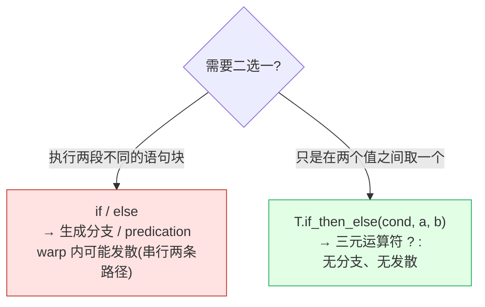
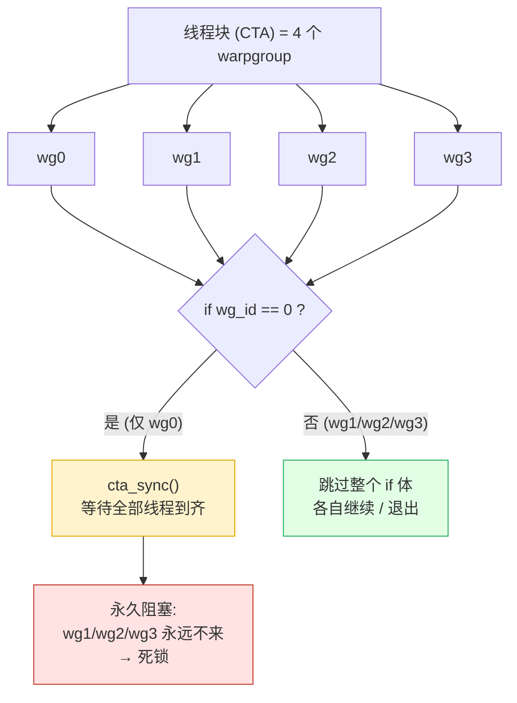
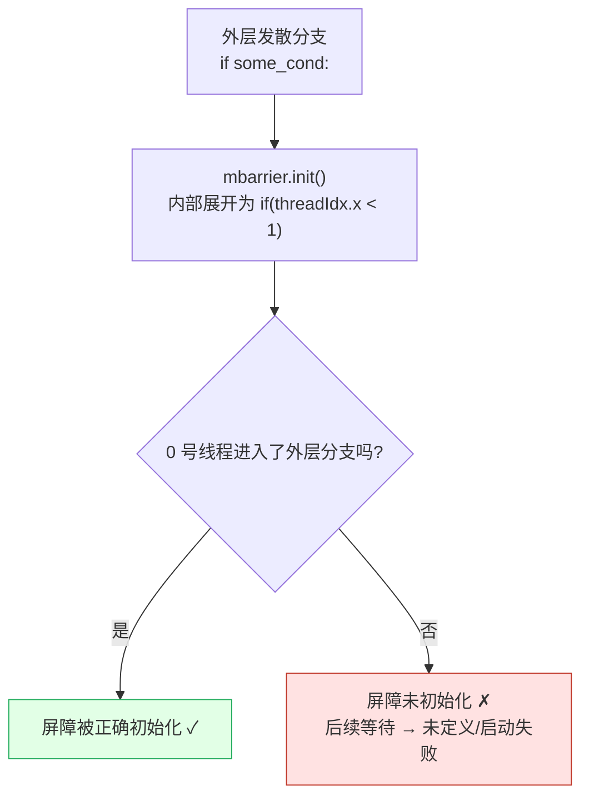

# 第 23 章 · 控制流

> 原文:[Control flow](https://mlc.ai/modern-gpu-programming-for-mlsys/tirx_guide/language_reference/cuda/control_flow.html)

> **本章要点(TL;DR)**
> - TileIR(TIR-X)里的控制流就三大类:`if`/`else` 分支、循环家族(`T.serial` / `T.unroll` / `T.vectorized` / `T.grid`),还有 `while`。每一类都会被「直白地」降级(lower)成对应的 CUDA C++ 写法。
> - 想在两个值之间二选一,用 `T.if_then_else(cond, a, b)`。它降级成三元运算符 `? :`,**不产生分支、也不引入控制流发散(divergence)**,做 ReLU 这类逐元素取舍很合适。
> - 一定要分清**统一控制流(uniform control flow)**和**发散控制流(divergent control flow)**:逐线程的 `if tx < 128` 用来做普通计算没问题;但**集体操作(collective op)**(比如 `__syncthreads()`)必须被所有参与同步的线程**统一**到达,否则会死锁。
> - `T.cuda.cta_sync()`(= `__syncthreads()`)绝不能放进任何线程级或 warpgroup 级发散的分支。只想同步单个 warpgroup 时,改用 `T.cuda.warpgroup_sync(id)`。还有 `mbarrier.init()` 这种「单线程守护」式的初始化,同样不能嵌进发散分支,否则屏障可能根本没被初始化。
> - `while` 靠一个可变标量计数器实现,底层降级成 `while(1) + 提前 break`,而这个计数器其实是个单元素寄存器缓冲区(register buffer)。

> **前置知识**:读这一章前,你最好对 GPU 的「线程层级」和「同步」这两件事有点概念。别紧张,这里先用一段话给你铺个底,后文每个词第一次出现时还会再讲一遍。
>
> - **GPU 为什么要搞一堆线程?** CPU 擅长一件事接一件事快速地干;GPU 反过来,它的强项是「同一件事,同时对成千上万份数据各干一遍」。所以 GPU 编程里,你写的一段代码会被**几万个「线程(thread)」同时跑**,只不过每个线程处理的数据不一样。你可以把线程理解成「一个干活的小工」,GPU 一次性派出几万个小工。
> - **这些线程是分层组织的**,从小到大大致是:`lane`(一个线程在它小队里的编号)→ `warp`(32 个线程绑成的「方阵」,硬件调度的最小单位)→ `warpgroup`(几个 warp 再打包)→ `CTA / thread block`(一个「线程块」,这一块线程能共享一小块高速内存、还能互相等)。这些词后文都会在第一次用到时当场解释,你现在只要知道「线程是分层的,层越大管的线程越多」就够了。
> - **「同步」是什么?** 就是「大家在某个点上互相等一等,等齐了再一起往下走」。多线程一起干活时,常常需要先确保「所有人都把上一步做完了」,才能安全地进下一步——这就是同步的意义。
>
> 想看更系统的讲解,可以先翻一下 [第 0 章 · 极简入门](./ch00_gpu_ml_primer.md);但只看上面这三条,也足够把本章读下来了。

---

先交代一下背景。本书在讲一门叫 **TileIR(也写作 TIR-X)的语言**——它是一种「专门用来写 GPU 程序的 Python 风格小语言」(行话叫 DSL,domain-specific language,领域专用语言)。你用 Python 的语法写 TileIR,工具链再把它翻译成真正能在 GPU 上跑的代码。这个「翻译成更底层代码」的过程,行话叫**降级(lowering)**——就像高级语言被编译成汇编一样,从「人好懂的写法」一层层落到「机器好执行的写法」。

那它最后翻译成什么?是 **CUDA C++**(NVIDIA 给 GPU 用的 C++ 方言)和 **PTX**(一种比 CUDA C++ 更靠近硬件的「GPU 汇编」)。本章不要求你会写它们,但会拿它们来给你看「你写的 TileIR 到底变成了啥」。

这一章干的事很简单:把 TileIR 里和**控制流**(就是 `if`、循环、`while` 这些决定「代码往哪走、走几遍」的语句)有关的每一个「原语(primitive,可以理解成这门语言提供的内置积木)」,一个一个跟它降级出来的 CUDA C++/PTX 对上号。

这事为什么值得单独讲?因为 TileIR 不是个「黑盒」——你写的每一条控制流语句,几乎都能一对一地对应到一段 CUDA。换句话说,看着 TileIR 代码,你脑子里基本就能预判出底层会生成什么。这对调试和优化都很有用。

篇幅不长,但里头有一节——**统一控制流 vs 发散控制流**——是 GPU 编程里最容易翻车、最容易把程序卡死的地方,我们会重点讲透它。

下面先把各种控制流积木一个个过一遍,再单独深挖「发散」这个大坑。

## 一、`if` / `else`:分支

这是最省心的一种:你在 TileIR 里写的 Python `if` / `else`,几乎原封不动就变成 CUDA 的 `if` / `else`,中间什么花活都没有。

> **一句话先理解**:GPU 上几万个线程跑的是同一段代码,但每个线程有自己的「编号」。`if` 最常见的用法,就是**拿这个编号做判断,让不同编号的线程走不同的路**——这样虽然代码只有一份,行为却能各不相同。

先认识两个编号:`threadIdx.x`(简称 `tx`)是**线程在它所在线程块里的编号**;`lane` 则是**一个线程在它所属那个 32 人 warp 里的小编号(0~31)**。拿编号当条件,限定「哪些线程才能执行某段代码」,这种套路有个行话叫**守护(guard)**——就像门口的保安,按编号放行。

来看个最常见的例子:按线程号把活儿分成两半。

```python
# TileIR 写法:按线程号划分两段不同的工作
if tx < 128:
    A[tx] = A[tx] * T.float32(2.0)   # 编号小于 128 的线程:把自己那格乘 2
else:
    A[tx] = A[tx] + T.float32(1.0)   # 其余线程:把自己那格加 1
```

这里 `A[tx]` 的意思是「第 `tx` 号线程去处理数组 `A` 里第 `tx` 个元素」——每个线程认领一格,互不干扰。`T.float32(2.0)` 就是「32 位浮点数 2.0」的写法。

降级后的 CUDA C++ 跟它几乎一模一样,一行对一行:

```c++
if (((int)threadIdx.x) < 128) {
  A_ptr[tx] = A_ptr[tx] * 2.0f;
} else {
  A_ptr[tx] = A_ptr[tx] + 1.0f;
}
```

没有任何魔法:`tx` 就是 `threadIdx.x`(CUDA 里读「当前线程编号」的内置变量),`T.float32(2.0)` 就变成了字面量 `2.0f`(C++ 里 `f` 后缀表示「这是个 32 位浮点」),一个对一个。

不过有一点你得先记牢。前面说过,32 个线程绑成一个 **warp(线程束)**,而 warp 是硬件**真正一起调度、一起执行**的最小单位——可以把它想成「32 个人被铐在一起、必须迈同一步」的方阵。问题来了:这种逐线程的 `if`,很可能让**同一个 warp 里的 32 个 lane 想走不同的分支**(比如有的 lane 满足 `tx < 128`,有的不满足)。这种「一个方阵里的人想往不同方向走」的现象,就是 GPU 里大名鼎鼎的**发散(divergence)**。

发散可怕吗?分情况:
- 在普通的逐元素计算里,它一点事没有,顶多损失一点速度。因为硬件应付发散的办法很朴素:**让方阵先整体走一遍「真」分支(走那条路的人干活、不走的人原地发呆),再整体走一遍「假」分支**。两条路前后串着各跑一遍,所以慢一点,但结果是对的。
- 可一旦碰上「集体操作」(下一节会讲的那种「必须全员到齐」的操作),发散就是禁区了——这正是第二节要重点讲的大坑。

### 选举单个发射线程:`T.ptx.elect_sync()`

先说它是来解决什么问题的——不然你根本不知道要它干嘛。

有些 GPU 指令,**只要一个线程去触发一次就够了,而且必须只触发一次**。典型的两个:
- **TMA(Tensor Memory Accelerator)拷贝**:一个专门搬数据的硬件部件,「下一道命令」就能让它把一大块数据从慢内存搬到快内存。你只需要派一个线程去下这道命令。
- **MMA(矩阵乘累加,Matrix Multiply-Accumulate)**:GPU 里专门算「矩阵乘法」的硬件指令(矩阵乘法是深度学习里最核心、最耗时的运算,所以 GPU 专门为它造了硬件)。同样,一个线程发一次,整个 warp 就一起把这块矩阵算了。

这类指令本身就是「warp 级、甚至更大粒度」的——意思是它一发出去,影响的就是一整批线程,而不是发它的那一个。所以如果让 warp 里 32 个 lane **每人都发一遍同样的命令**,那就等于同一件事被重复下达了 32 次,轻则浪费、重则出错。

于是我们需要一个办法:**从一个 warp 的 32 个 lane 里,挑出唯一一个来干这件事**。这正是 `T.ptx.elect_sync()`(elect = 选举)的活儿:

```python
if T.ptx.elect_sync():
    ...   # 只有被选中的那一个 lane 会进来(例如在这里发起 TMA / MMA)
```

它怎么做到的?在一个同步点上,它从当前还活跃的 lane 里**确定性地点名一个**(每次点的都是同一个,不随机),给这个被点中的 lane 返回 `true`,其余所有 lane 一律返回 `false`。把它当 `if` 的条件,就只有那一个 lane 能进 `if` 体——这就是「只让一个线程发射」的标准写法。

> **关键**:`elect_sync()` 选的是「**一个 warp 内部的代表**」,它管的范围也就到这个 warp **里面**为止。这个 warp 里所有活跃的 lane 都会执行到这条 `elect_sync()`,只不过被点中的那个拿到 `true`、其他人拿到 `false`,选举在 warp 内部就办完了。请特别注意:它的「全员」最多到一个 warp,**不是整个线程块**。
>
> 这里顺带把一个更大的单位讲清楚:**CTA / thread block(线程块)**——它是「能跑在同一个 SM 上、能共享一小块高速内存(SMEM)、还能互相同步等待」的一组线程(SM 是 GPU 上的一个「计算核心区」,你可以先把它当成「一个班级的教室」)。一个线程块里通常有好几个 warp。`elect_sync()` 只在「一个 warp」这个小圈子里选代表,跟后面要讲的「线程块级别的操作必须全班到齐」完全是两码事,千万别混。

### 表达式级选择:`T.if_then_else`,无分支

前面的 `if`/`else` 是「跑两段不同的代码」。但很多时候你根本不需要那么大动干戈,你只是想**在两个值里挑一个**——比如「这个数大于 0 就保留它,否则用 0」。这种「二选一取值」,用 `T.if_then_else(cond, a, b)` 才对(读法:条件 `cond` 成立就取 `a`,否则取 `b`)。

它好在哪?**它根本不生成 `if` 分支,而是降级成 C 语言的三元运算符 `cond ? a : b`**(三元运算符就是一行写出「条件成立取前者、否则取后者」的紧凑写法)。

```c++
// 例如 ReLU:大于 0 就取原值,否则取 0,全程没有分支
O_ptr[tx] = (A_ptr[tx] > 0.0f) ? A_ptr[tx] : 0.0f;
```

(ReLU 是神经网络里最常用的一个激活函数,作用就是「负数全压成 0,正数原样保留」,所以是个经典的「逐元素二选一」。)

> **这两种写法为什么要分开?为什么不能都用 `if`?** 区别在于编译器和硬件拿它们怎么办:
> - 写成 `if`/`else`:编译器一般会生成**真正的分支**(或者用一种叫**谓词执行 / predication** 的技巧,简单说就是「给每条指令挂个开关,条件不满足的线程就让这条指令空转」)。只要 warp 里的 lane 走了不同的路,就**发散**了,两条路径得前后串行各跑一遍——慢。
> - 写成三元运算符:编译器通常生成一条 `select` 类指令(也叫条件传送,PTX 里写作 `selp`)。**全部 32 个 lane 跑的是同一条指令、同一步**,只是每个 lane 按自己的条件挑结果。既不发散,也不用串行跑两条路——快。
>
> 所以记住一条原则:凡是能写成「一个表达式」的逐元素取舍——clamp(把值夹在上下限之间)、ReLU、`max(0, x)`、按掩码取值这些——一律优先用 `T.if_then_else`。代码更短,性能也更稳。

下面拿一张图把这两条路对比一下:



## 二、统一控制流 vs 发散控制流(核心)

这一节是全章的核心,也是 GPU 程序**死锁(deadlock)**最常冒出来的地方。死锁就是「大家互相干等、谁也走不了,程序永远卡住」——后面会看到它是怎么发生的。

> **一句话先理解**:GPU 上有两类截然不同的操作。一类是「各干各的」,线程之间互不相干;另一类是「**必须全员一起到齐才能进行**」(比如同步:大家在一个点上互相等)。这一节的全部要害就是:**第二类操作,绝对不能藏在「只有一部分线程会进去」的 `if` 里**,否则没到齐的那些线程会让大家永远等下去。

先把两类操作掰开说清楚:

| 这类操作 | 含义 | 例子 | 把它放进「只有部分线程会进的分支」会怎样 |
| --- | --- | --- | --- |
| 普通逐线程工作 | 每个线程独立算自己那份,谁也不等谁 | `A[tx] = ...` 这种逐元素运算 | 没问题,顶多是前面讲的那点发散开销 |
| **集体操作(collective op)** | 一组线程**必须「一起」到达**、共同参与(比如同步) | `T.cuda.cta_sync()`(就是 CUDA 的 `__syncthreads()`)、各种屏障操作 | **可能死锁,或者行为完全没准（未定义）** |

(「集体操作」这个词记住就行:顾名思义,它是「集体活动」,讲究的就是人到齐。)

核心规则,一句话:

> **集体操作必须被「它要同步的每一个线程」都统一(uniformly)地走到——绝不能把它藏在「只有一部分线程才会进去」的发散分支里。**「统一地走到」的意思是:要么所有相关线程都执行到它,要么都不执行,不能有人到、有人没到。

### 经典死锁:把 `cta_sync()` 放进发散分支

`T.cuda.cta_sync()` 降级成 CUDA 的 `__syncthreads()`,这是最常用的同步操作。它的含义是:「**这个线程块里的每一个线程，都在这儿等着，等所有人都到了，再一起往下走**」。所以它有个铁打的前提——**线程块里的每一个线程都必须走到这一行**,缺一个都不行。

现在看个反面教材:把它塞进一个按 **warpgroup** 划分的分支里。先解释下 warpgroup:它就是「**若干个连续的 warp 再打包成的一组**」(在 Hopper 这代 GPU 之后,常用它来给线程分工——比如让 warpgroup 0 专门搬数据、warpgroup 1 专门算)。这里假设 `wg_id` 是「当前线程属于第几个 warpgroup」。

```python
# 反面教材:这会死锁!
if wg_id == 0:
    T.cuda.cta_sync()   # 只有 warpgroup 0 的线程才会进来、才会走到这一行
    ...
```

问题出在哪?`cta_sync()` 要的是「整个线程块所有线程到齐」,可这个 `if` 只放 warpgroup 0 的线程进来。于是:warpgroup 0 的线程进来了、停在屏障前等;而 warpgroup 1、2、3 的线程压根不进这个 `if`,它们继续往后跑了。结果 warpgroup 0 苦苦等着「全块到齐」,可剩下那几个 warpgroup 永远不会来——大家就这么干等到天荒地老,整个 kernel(kernel = 你提交给 GPU 跑的那段程序)**永久卡死**。这就是死锁。

下面这张图把这个坑画出来了:



> **注意**:死锁的病根不在「同步」本身,而在「**只有一部分线程会走到同步点**」。集体操作天生就带着「全员都得到场」的约定,而发散分支恰恰把这个约定给破坏了。

### 正确做法:用 warpgroup 作用域的同步

上面那个需求其实很合理——你**本来就只想让 warpgroup 0 自己内部对一下表、互相等一等**,根本没打算惊动别的 warpgroup。那问题不在「想同步」,而在「**用错了工具**」:你用的 `cta_sync()` 要求的是「全块到齐」,范围太大了。

正确做法是换一个「**作用范围更小**」的同步工具——只管一个 warpgroup 的那种:

```python
if wg_id == 0:
    T.cuda.warpgroup_sync(id)   # 只同步本 warpgroup,根本不要求别的 warpgroup 参与
```

`T.cuda.warpgroup_sync(id)` 立的屏障只在「一个 warpgroup 内部」生效,它要的「全员」就只算这一个 warpgroup 的线程。所以把它放进 `if wg_id == 0:` 里反而**完全安全**——因为一个 warpgroup 的线程会**整整齐齐一起**进这个分支(要么全进、要么全不进),不会出现「有人到、有人没到」,屏障自然能凑齐。

> **关键区别**(这是本节最该记住的一张对照):
> - `cta_sync()`:它要的「全员」= **整个线程块**的所有线程 → 所以**不能**放进只有部分线程会进的发散分支。
> - `warpgroup_sync(id)`:它要的「全员」= **单个 warpgroup** 的所有线程 → 所以**可以**放进「按 warpgroup 整齐划分」的分支。
>
> 一句话:选哪个同步工具,就看「你真正要同步的范围」和「这个分支把线程切成多大块」**对不对得上**。范围对得上就安全,对不上就死锁。
>
> 顺带一提,warpgroup 级同步最常出场的场合,是「用 **warp 专化(warp specialization)**——也就是给不同 warp 分派不同工种——和 **cluster** 来加速 GEMM」这类高级场景。这里有两个新词:`cluster` 是「多个线程块再打包成的更大一组,能跨块协作」(Hopper 引入的);GEMM(General Matrix Multiply,通用矩阵乘法)则是深度学习里最核心、最吃算力的运算,可以说 GPU 一大半力气都花在它身上。细节本章不展开,感兴趣可看相关章节和「CUDA C++/PTX intrinsics(内建函数)」那一节。

### 同样的坑:屏障初始化(`mbarrier.init`)

发散这个坑,不光「同步」这一步会踩,**给屏障做初始化**那一步同样危险,而且更隐蔽。

先认识 `mbarrier`:它是一种**内存屏障(memory barrier)**,专门用来给「异步操作」做「等结果到齐」的。啥叫异步操作?比如前面提的 TMA 拷贝——你下完搬运命令,硬件在后台慢慢搬,你的线程不用傻等,可以先去干别的;等真要用那批数据时,就靠 `mbarrier` 来确认「搬完了没有」。所以用之前,得先把这个屏障「初始化」一下(类似用一个对象前先 new 出来、设好初值)。

关键点来了:`mbarrier` 的 `.init()`(初始化)操作,会降级成一个**只让单个线程去做**的形式——这种「只放一个线程进来干」的写法,前面讲过,叫**单线程守护**:

```c++
if (threadIdx.x < 1) {   // .init() 的本质:只让 0 号线程去初始化屏障
    /* 初始化 mbarrier */
}
```

也就是说,`.init()` 自己**里面已经裹了一层** `if (threadIdx.x < 1)`(只放 0 号线程进)。问题就出在这儿——如果你**再把整个 `.init()` 套进另一个发散分支里**,比如:

```python
if some_cond:        # 外层分支:只有满足 some_cond 的线程才进来
    mbarrier.init()  # 它内部又自带一层「只让 0 号线程做」
```

就可能闹出一个特别坑的局面:**负责初始化的那个 0 号线程,恰好不满足外层的 `some_cond`,根本没进来**。

那结果呢?屏障压根没人初始化。后面任何对它的「等待 / 到达」操作,行为全是「未定义」的(意思是:可能崩、可能卡、可能算错,完全没准),最常见的表现就是**莫名其妙的启动失败(unspecified launch failures)**——程序一跑就挂,还看不出为啥。



> **经验法则**:凡是带「集体语义」或「单线程守护语义」的原语——同步、屏障初始化、TMA/MMA 发射准备这些——都得保证它们待在**所有相关线程都会统一走到**的位置。要么搁在所有线程都会经过的直线代码里,要么搁在「按同样粒度统一划分」的分支里。一旦把它们跟普通的逐元素发散分支搅在一块,基本就是必出问题。

## 三、循环家族

TileIR 的循环有**四种口味**。它们干的事都是「重复跑几遍」,区别在于「**怎么个跑法、最后生成什么样的底层代码**」。你平时写的那个普通 Python `range`,默认对应的就是第一种 `T.serial`:

| 写法 | 它表达的意思 | 最后生成什么 / 用在哪 |
| --- | --- | --- |
| `T.serial(n)` | 老老实实一轮接一轮地跑 | 生成普通的 `for` 循环;`ptxas`(GPU 的汇编器,管最后一步生成机器码)**有可能**自作主张地展开它 |
| `T.unroll(n)` | 完全展开 | 在编译期就把循环**整个铺平**成一条条直线语句,运行时不再有「循环」这个结构 |
| `T.vectorized(n)` | 向量化循环 | 生成「一条指令处理多个元素」的访存/计算(下面会解释什么叫向量化) |
| `T.grid(*extents)` | 嵌套循环 | 一行就写出好几层嵌套的 `for` |

这里有两个新词先点一下:**「展开(unroll)」**指「把循环按次数复制成一串重复语句,从此不再循环」;**「向量化(vectorize)」**指「让一条指令一次处理一批数据,而不是一个一个来」——后面都会展开讲。

另外,`break`(提前跳出循环)/ `continue`(跳过本轮、进下一轮)在这些循环里都照常能用。

### `T.grid`:一次写出嵌套循环

`T.grid(8, 8)` 其实就等于「外层 `i` 跑 0~7、内层 `j` 跑 0~7」这两层嵌套 `for`,只是写起来比手写两层嵌套清爽得多:

```python
for i, j in T.grid(8, 8):
    B[i, j] = T.max(A[i, j], T.float32(0.0))   # 对 8×8 的每一格做 ReLU
```

这段的意思是:对一张 8×8 的表里每一格 `(i, j)`,取 `A` 这一格和 0 之间的较大值,写进 `B`(`T.max` 就是取较大值)——这正是二维版的 ReLU。

它降级成标准的双层 `for`。这里有个底层细节值得一看:二维坐标 `(i, j)` 被「拉平」成了一维下标 `i * 8 + j`。为什么?因为内存其实是一条**一维的长条**,没有真正的「二维」;要在一条长条上找到第 `i` 行第 `j` 列,就得算「跳过前面 `i` 整行(每行 8 个),再往后数 `j` 个」,也就是 `i * 8 + j`:

```c++
for (int i = 0; i < 8; ++i)
  for (int j = 0; j < 8; ++j)
    B_ptr[i * 8 + j] = max(A_ptr[i * 8 + j], 0.0f);
```

### `T.serial` vs `T.unroll`:循环 vs 直线代码

这俩的区别,说白了就一句话:**到底留不留「循环」这个结构。**

| | `T.serial(4)`(保留循环) | `T.unroll(4)`(不要循环,直接铺成 4 条语句) |
| --- | --- | --- |
| 生成代码 | `for (int k=0; k<4; ++k)`<br/>`  stmt(k);` | `stmt(k=0);`<br/>`stmt(k=1);`<br/>`stmt(k=2);`<br/>`stmt(k=3);` |
| 备注 | `ptxas` 仍可能自行展开 | 在 IR 层就完全铺平,运行时没有循环 |

- `T.serial(n)`:循环结构留着,生成的代码也短。「要不要进一步展开」这件事,交给 `ptxas` 自己拿主意。
- `T.unroll(n)`:在 IR 这一层就把循环**整个铺平**成 4 条直线语句。好处是:没有循环开销了(不用每轮都判断「跑够没」、不用每轮跳回开头),指令一条接一条往下走。它常用在那种**次数又少又固定**的小循环上(比如「把寄存器里的 4 个分片累加起来」)。铺平之后,编译器还更容易做优化(比如重新排指令的顺序、把能提前算出来的常量直接算掉)。

  这里出现一个新词:**寄存器(register)**——它是「每个线程私有的、速度最快的一小块存储」。可以类比 CPU 的寄存器,但 GPU 上**每个线程各有一份自己的**。它快是快,可数量很有限,是稀缺资源。`T.unroll` 的代价正在这儿:铺平后代码变大,而且因为同时要用到的中间值更多,**吃掉的寄存器也更多**——寄存器一紧张,反而可能拖慢整体。

> **设计取舍**:展开的好处是甩掉循环控制开销、让更多指令能「同时排队往前推进」(这叫指令级并行,ILP);坏处是代码膨胀、多吃寄存器。这是一条需要权衡的线,没有标准答案。TileIR 干脆把「展开」做成一个**你能显式写出来的积木**,而不是全靠编译器去猜——这样「在性能和资源之间怎么取舍」这件事,就握在你自己手里了。

## 四、`while` 循环

`while` 循环会一直转,直到条件不成立才停。要让它有朝一日能停下来,通常得有一个**能反复改值的计数器**(比如 `i`,每转一圈就 `+1`,加到 64 就停)。这里「标量」就是「单个数值」的意思,跟「数组」相对。

听起来再普通不过,但在 TileIR 里有个有意思的拐弯:这种「会变的单个数值」,它是拿一个「**只有 1 个元素的寄存器数组**」来装的(完整原因下一段会讲;更多细节看「缓冲区与内存 / Buffers and memory」那一章):

```python
i: T.int32 = 0
while i < 64:
    A[i] = A[i] + T.float32(1.0)
    i += 1
```

它降级的路子有点出人意料:它**不直接**生成 `while (i < 64)`,而是生成一个 **`while (1)` 的「死循环」**(`while(1)` 的条件永远成立,本来会无限转),**再在循环体一进来就先检查条件,不满足就 `break` 跳出去**。等于把「停不停」的判断从循环头搬到了循环体开头。计数器 `i` 则被实现成一个长度为 1 的寄存器数组 `i_ptr[1]`(下标固定用 `[0]`):

```c++
int i_ptr[1];
i_ptr[0] = 0;
while (1) {
  if (!(i_ptr[0] < 64)) { break; }              // 条件不满足就提前退出
  A_ptr[i_ptr[0]] = A_ptr[i_ptr[0]] + 1.0f;
  i_ptr[0] = i_ptr[0] + 1;                       // 计数器自增
}
```

> **为什么非得拿「单元素数组」来装一个会变的数?这不脱裤子放屁吗?** 还真不是,这是 IR 的设计逼出来的。在 TileIR 这类编译器内部表示(IR)里,有一条规矩:一个「值」一旦定下来就**不能再改**了(这套风格叫 SSA,简单理解就是「每个变量只许赋值一次,赋完就钉死」)。这么设计是因为「值不会变」能让编译器放心大胆地做优化。
>
> 可是循环计数器偏偏天生就要一遍遍被改写,跟「不能改」直接打架。怎么破?办法是:**别把它当成一个值,而把它当成一块「能读能写的存储」**——也就是一个 1 元素的寄存器数组。值不能改,但「存储里的内容」当然能改。于是 `i += 1` 就翻译成了对 `i_ptr[0]` 的「读出来、加一、写回去」。这也顺便解释了:为什么写 `while` 循环时,那个计数器得**显式声明成一个变量**(像例子里的 `i: T.int32 = 0`)——因为它要落到一块实实在在的存储上。

> **注意**:别被 `while(1) + break` 这个写法吓到——它跟 `while(cond)` 在效果上**一模一样**,无非是把「条件检查」从循环头挪到了循环体的最前头而已,一行都没少做。知道这点,以后你在底层代码(PTX,或者更靠近硬件的 SASS——可以理解成 GPU 真正执行的「机器码」)里看到这种结构时,就不会一头雾水了。

## 小结

- TileIR 的控制流基本「所见即所得」:`if`/`else`、四种循环、`while`,全都直白地翻译成 CUDA C++。看着 TileIR 代码,你脑子里基本就能预判出生成的代码长啥样。
- **逐元素的「二选一取值」,优先用 `T.if_then_else`**:它降级成三元运算符,不产生分支、也不发散,拿来做 ReLU、clamp、掩码这类逻辑最合适。
- **全章最该刻在脑子里的,是「统一 vs 发散控制流」**:集体操作(像 `cta_sync()`,要全块到齐)和单线程守护(像 `mbarrier.init()`,内部只让一个线程干),都必须被相关线程**统一地走到**,绝不能塞进「只有部分线程会进」的发散分支——否则不是死锁,就是莫名其妙的启动失败。需要更小范围的同步,就换 `warpgroup_sync(id)` 这种作用域更窄的工具,并保证「分支把线程切多大块」和「同步要管多大范围」对得上。
- 循环这几个积木,把「展不展开 / 向不向量化 / 怎么嵌套」全都摆成了**明牌**,让你自己去权衡性能和资源(主要是寄存器)。`T.unroll` 和 `T.serial` 的差别,归根到底就是「运行时还留不留循环结构」。
- `while` 用一个「单元素寄存器数组」来装会变的计数器,并降级成 `while(1) + 提前 break`。在「IR 里的值不能改」这个前提下,这是表达「可变状态」最自然的办法。

## 延伸阅读

- 原文:[Control flow — Modern GPU Programming for MLSys](https://mlc.ai/modern-gpu-programming-for-mlsys/tirx_guide/language_reference/cuda/control_flow.html)
- 相关章节(原文交叉引用):「Scaling GEMM with Warp Specialization and Clusters」(warp 专化与 cluster 扩展 GEMM)、「CUDA C++/PTX intrinsics」(内建函数)、「Buffers and memory」(缓冲区与内存)。

## 术语对照

| 中文 | English | 说明 |
| --- | --- | --- |
| 控制流 | control flow | `if` / 循环 / `while` |
| 发散(控制流) | divergence / divergent control flow | warp 内 lane 走不同分支 |
| 统一控制流 | uniform control flow | 所有相关线程一致到达 |
| 集体操作 | collective operation | 需全员参与的操作(如同步) |
| 守护 | guard | 用条件限制某段代码的执行 |
| 选举(单线程) | elect (`elect_sync`) | warp 内选出唯一发射 lane |
| 谓词执行 | predication | 用条件位控制指令是否生效 |
| 完全展开 | unroll | 把循环铺开为直线语句 |
| 向量化 | vectorize | 单指令处理多元素 |
| 死锁 | deadlock | 屏障等不齐全部线程而永久阻塞 |
| 线程块 | CTA / thread block | `__syncthreads()` 的同步范围 |
| 线程束 | warp | 32 lane 的调度/执行单元 |
| warpgroup | warpgroup | 多个 warp 组成的同步单元 |
| 内存屏障 | mbarrier | 异步操作的同步屏障 |
| 寄存器缓冲区 | register buffer | 承载可变标量的 1 元素存储 |
