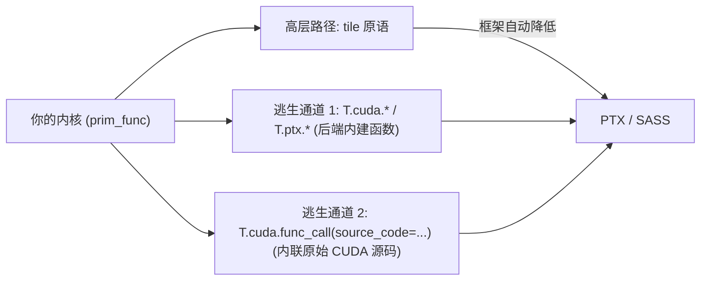
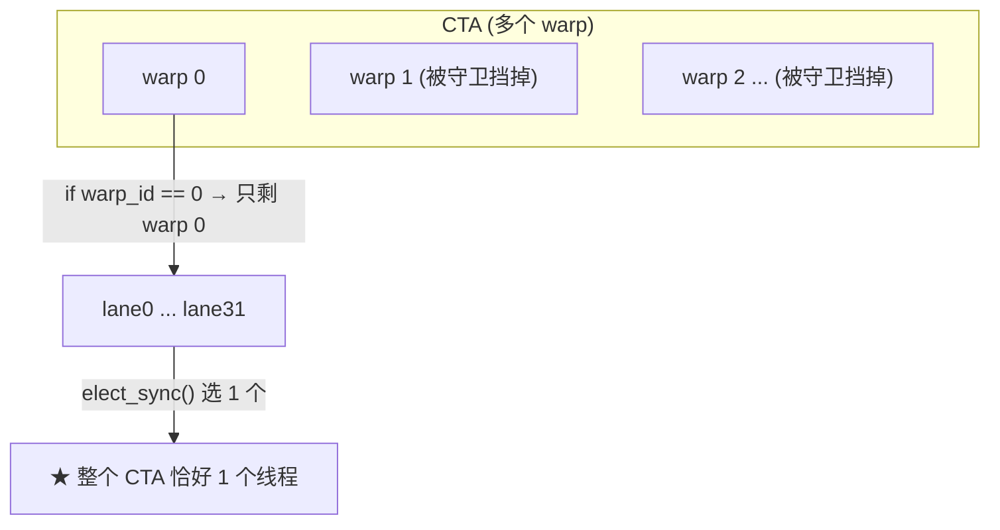
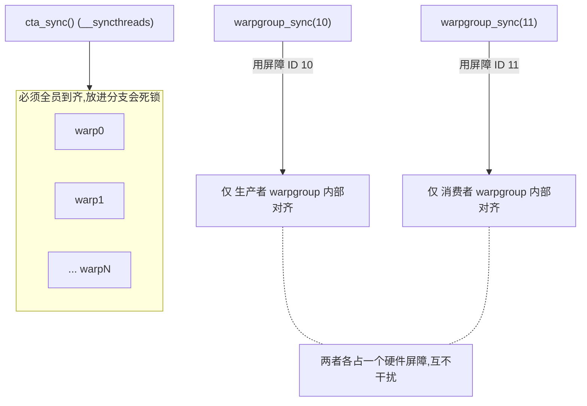
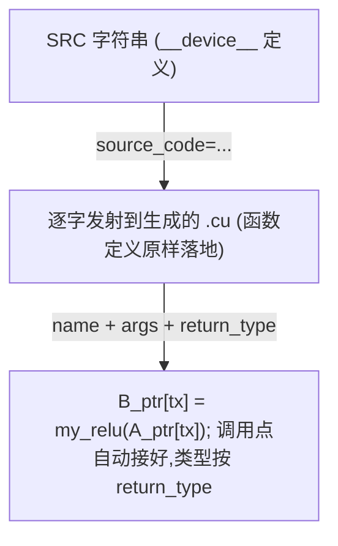

# 第 24 章 · CUDA C++ / PTX intrinsics

> 原文:[CUDA C++/PTX intrinsics](https://mlc.ai/modern-gpu-programming-for-mlsys/tirx_guide/language_reference/cuda/threads_sync.html)

> **本章要点(TL;DR)**
> - 先说人话:在 GPU 上写程序,代码不叫「函数」,叫**内核 / kernel**——就是一段「会被成千上万个线程同时各跑一份」的代码。平时我们写内核,用的是高层的 **tile 原语 / tile primitive**(tile = 把一个大矩阵切成的一个个小方块;原语 = 框架替你封好的、现成的高级操作),很省心。可有时候,你脑子里想要的那个硬件动作,这层高级封装根本表达不出来。这时候有两条「逃生通道」让你绕过封装、直接命令硬件:一条是**调用后端内建函数 / backend intrinsic**(intrinsic = 编译器/框架内置的、一一对应某条硬件指令的特殊函数),也就是 `T.cuda.*` / `T.ptx.*` 这一堆命名空间;另一条是**内联一段原始 CUDA 源码**(CUDA = 英伟达写 GPU 程序用的那门 C++ 方言)。
> - `T.cuda.*` / `T.ptx.*` 干的活其实很朴素:把 GPU 硬件提供的那些底层操作,原封不动地端到你面前,让你在 Python 风格的代码里直接调。这里头有线程之间「对表/等齐」用的同步,有专门等异步搬运完成的 mbarrier,有把一堆数汇总成一个数的归约,还有 PTX(可以理解成 GPU 的「汇编语言」)那套搬数据和做矩阵乘法的家族(`cp_async`、TMA、`ldmatrix`、`tcgen05` 这些名字先混个脸熟,后面会逐个讲)。
> - 写 GEMM(矩阵乘法,深度学习里最核心的运算)、Flash Attention(一种高效的注意力算法,内部全是矩阵乘和数据搬运)这类内核,你会反复碰到 **四类同步机制**:**mbarrier 相位 / phase**、**单线程选举 / election**、**具名 warpgroup 屏障 / named barrier**、**栅栏 / fence**。它们管两件事:一是协调成百上千个并行线程,二是协调那些「自己在后台默默干活的硬件搬运引擎」。坑在哪?用错了它通常不报错,而是直接给你**悄悄算错数据**,或者干脆**卡死**。
> - 这四个里头,mbarrier 的相位坑藏得最深。同一个 mbarrier 要在循环里反复用,你本地那个「相位记号」每转一圈都得手动翻一下(`phase ^= 1`,意思是 0 变 1、1 变 0)。一旦忘了翻,后面的等待会立刻返回——根本没真等,于是放任硬件去读那块「才写了一半」的内存。
> - 万一连内建函数都凑不齐,还有最后一招:`T.cuda.func_call(..., source_code=..., return_type=...)`。你给它一段原始的 GPU 函数源码,它原样塞进生成的代码里,还顺手帮你把调用点接好。

> **前置知识**:这一章会大量用到 GPU 的几个基础概念——**线程层级**(warp / CTA / warpgroup,简单说就是「线程怎么分组」)、**异步引擎**(能在后台自己搬数据/算矩阵、不占用线程的专用硬件,比如 TMA、异步 MMA)、以及**屏障 / 同步**(让一群线程「在某个点上对齐、互相等一等」的机制)。这些词本章第一次出现时都会当场用大白话讲一遍,所以你**没有 GPU 背景也能读**,别担心。要是想更系统地打底,可以先翻 [第 0 章 · 极简入门](./ch00_gpu_ml_primer.md)。

---

## 24.1 为什么需要「逃生通道」

> **一句话先理解**:高级封装(tile 原语)能帮你搞定大部分情况,但 GPU 新硬件出能力的速度太快,封装总有跟不上的时候——这一章就是教你「封装不够用时怎么自己上」。

这本教材从头到尾的主线,就是用高层的 **tile 原语** 来描述 GPU 内核。你只管声明数据怎么摆放(数据布局)、写「一个小方块(tile)上的计算」这一层逻辑,剩下的全交给框架——它会自动把你的代码**降低 / lower**(编译领域的术语:把高层、抽象的写法一步步翻译成更底层、更贴近硬件的形式)成高效的 PTX。这套抽象用起来很舒服,常见的那些套路(GEMM、注意力 attention、归约……)它基本都能包圆。

可问题来了:硬件更新得太快,封装跟不上。这里先认两个名词——英伟达每隔一两年出一代新 GPU 架构,会起个代号:**Hopper** 是其中一代(数据中心常用的 H100 就属于它),**Blackwell** 是更新的一代。Hopper 这代刚带来 **TMA**(Tensor Memory Accelerator,张量内存加速器——一个专门负责「在后台批量搬运大块数据」的异步引擎,搬的时候不占用线程),Blackwell 又甩出个新的矩阵乘法引擎 `tcgen05`。每出一波这种新能力,tile 原语都**还没来得及封装**,或者**压根就不打算封**(因为太底层、太专用,封了也没几个人用)。遇上这种情况,你总不能被抽象「锁死」、干瞪眼吧。这一章讲的,就是怎么绕过抽象、直接命令硬件,一共两条路:



> **关键**:这两条通道是来「补缺」的,不是来「顶替」tile 原语的。优先级顺序很清楚,从上到下越下越底层:**能用 tile 原语就用 tile 原语;原语够不着,才下沉到内建函数;内建函数也没有,才退到内联源码。** 记住一句话:越往下沉,框架帮你兜的底越少,出错的风险越得你自己扛——尤其是同步这块(为什么同步这么容易出事,24.3 节会让你彻底明白)。

---

## 24.2 调用后端内建函数(backend intrinsics)

`T.cuda.*` 和 `T.ptx.*` 这两个命名空间(都来自 `tvm.backend.cuda` 这个模块)干的事很直白:把 GPU 硬件提供的那些底层操作原封不动端给你,让你在代码里直接喊。你能拿到的东西包括:**线程同步**(让一群线程在某个点上互相等齐)、**mbarrier**(一种专门等异步搬运完成的「计数门闩」,后面 24.3.1 细讲)、**归约**(reduction——把一组数汇成一个值,最常见的就是求和),还有 PTX 那套**数据搬运**和 **MMA**(Matrix-Multiply-Accumulate,矩阵乘加;这是 GPU 里一块叫 **Tensor Core** 的专用电路干的活——Tensor Core 你可以理解成「专门做小矩阵乘法的硬件加速器」,深度学习快就快在它身上)家族。

### 24.2.1 常见入口一览

在看代码前,先把几个「线程怎么分组」的名词一次说清楚——这是读懂全章的地基,你会写代码但没碰过 GPU,所以这几句务必看进去:

- **线程 / thread**:GPU 上最小的执行单位。一份内核代码会被海量线程同时各跑一遍,只是每个线程处理数据的不同部分。
- **warp(线程束)**:GPU 把线程**每 32 个绑成一束**一起调度,这一束就叫一个 warp。关键特性:同一个 warp 里这 32 个线程**必须迈同一步**(同一时刻执行同一条指令)。打个比方,就像 32 个人组成的方阵,口令一响必须一起迈左脚,没法你走你的我走我的。
- **CTA / 线程块(thread block)**:若干个 warp 再凑成一个 CTA(CTA 是 CUDA 里的叫法,和「线程块」是一回事)。同一个 CTA 里的线程能共享一块高速内存、能互相等齐。
- **warpgroup(线程束组)**:**4 个 warp(也就是 128 个线程)**再抱成一团,叫一个 warpgroup。这是 Hopper 这代新引入的概念,后面讲「让不同线程组各干各的活」时会用到。

层级关系串起来就是:**线程 → 32 个凑成 warp → 几个 warp 凑成 warpgroup → 若干 warp/warpgroup 凑成 CTA**。

好,现在看最常用的那几类入口长啥样(右边注释先扫一眼,具体每行下面表格里逐个解释):

```python
T.cuda.cta_sync()                    # CTA(线程块)级屏障,等价于 __syncthreads()
T.cuda.warp_sync()                   # warp 级屏障,等价于 __syncwarp()
T.cuda.warpgroup_sync(8)             # warpgroup 屏障(具名屏障,见 24.3.3)
T.cuda.cta_sum(val, num_warps, scratch.ptr_to([0]))   # CTA 级归约求和

bar = T.alloc_shared((1,), "uint64") # mbarrier 必须放在共享内存里
T.ptx.mbarrier.init(bar.data, 1)     # 初始化 mbarrier,用于异步完成通知
T.ptx.mbarrier.try_wait(bar.data, phase)  # 按相位等待(注意相位语义,见 24.3.1)
```

这里有个反复出现的词「**屏障 / barrier**」,先解释清楚:屏障就是代码里的一个「集合点」——线程跑到这儿会停下等,直到「该到的线程全到齐了」才一起放行。为啥需要它?因为线程是各跑各的、快慢不一,你要是不设集合点,跑得快的线程可能去读跑得慢的线程「还没写完」的数据,就出错了。`cta_sync` 是「整个 CTA 集合」,`warp_sync` 是「一个 warp 内集合」,粒度不同而已。

下面一个一个说:

| 内建函数 | 作用 | 对应的底层硬件操作 |
| --- | --- | --- |
| `T.cuda.cta_sync()` | 让整个 CTA(线程块)的线程在此集合等齐 | `__syncthreads()` |
| `T.cuda.warp_sync()` | 让一个 warp 内的 32 个线程集合等齐 | `__syncwarp()` |
| `T.cuda.warpgroup_sync(id)` | 让一个 warpgroup 内的线程集合等齐(用具名屏障实现) | 具名屏障(`bar.sync`) |
| `T.cuda.cta_sum(val, num_warps, scratch)` | CTA 级求和归约(需要一块叫 scratch 的临时共享内存做中转) | 多步 warp shuffle + 共享内存 |
| `T.ptx.mbarrier.init(bar, n)` | 初始化 mbarrier,告诉它「要等 `n` 次到达」 | `mbarrier.init` |
| `T.ptx.mbarrier.try_wait(bar, phase)` | 按相位等屏障翻转,非阻塞(等不到立刻返回) | `mbarrier.try_wait.parity` |

> 表里「对应的底层硬件操作」一列,像 `__syncthreads()` 这种带双下划线的,就是 CUDA C++ 里真正的底层函数名;`T.cuda.*` 基本是它们的「一一对应的别名」,框架会把你写的 `T.cuda.cta_sync()` 直接翻译成 `__syncthreads()`。

> **注意**:这里要补两个概念。第一,**共享内存 / SMEM(shared memory)**:每个 CTA 都有一小块**位于芯片上、特别快**的内存,这个 CTA 里的所有线程都能读写它——你可以把它类比成「一块由你手动管理的高速缓存」,数据放进去后大家共用,比从大而慢的全局显存反复取要快得多。第二,**mbarrier** 说白了就是 SMEM 里的一个 64 位整数(`uint64`)。所以你得先用 `T.alloc_shared((1,), "uint64")` 在共享内存里给它腾块地方,再把 `.data`(也就是指向这块内存的指针)递给 `init` / `try_wait`。它专门干一件事:等**异步引擎**(前面说过,就是 TMA 拷贝、异步 MMA 这类「在后台自己干活的硬件」)把活干完再通知你。到了 Hopper/Blackwell 这代,**异步流水线**(让「搬数据」和「算数据」重叠起来同时跑、互相不干等,从而榨干硬件)的同步全靠它,算得上是顶梁柱级别的机制。

### 24.2.2 完整可运行示例:warp 内 all-reduce

> **一句话先理解**:我们想让一个 warp 里 32 个线程各自手上的数,加在一起,而且让每个线程最后都拿到这个总和。难点在于:线程之间默认不能直接读对方的变量,得用一种叫 **shuffle** 的特殊硬件指令来交换数据。

先说清楚要解决的问题。一个 warp 有 32 个线程,假设每个线程手上有一个数,我们想求这 32 个数的总和——这种「把一堆数汇成一个数」的操作就叫**归约 / reduction**。麻烦在于:每个线程的局部变量是它自己私有的,别的线程看不见。那线程之间怎么交换数据?

这就要引入 **shuffle(线程束内洗牌)** 这个 warp 专属的硬件指令。它的能力很特别:**让同一个 warp 里的线程,直接读取另一个线程寄存器里的值**,完全不经过内存,所以极快。下面这个例子用的是它的一个变种 `T.tvm_warp_shuffle_xor`,来实现「warp 内全归约求和」。要搞懂 shuffle,这个例子再合适不过了。咱们先看代码,然后一点点把思路捋清楚(代码里有些 GPU 专有的函数,看不懂别慌,下面逐行解释):

```python
@T.prim_func
def warp_reduce(A_ptr: T.handle):
    A = T.match_buffer(A_ptr, (32,), "float32", align=16)
    T.device_entry()
    # 取当前线程的三层身份:CTA 号 / warp 号 / lane 号(0..31)
    cta_id = T.cta_id([1]); warp_id = T.warp_id([1]); lane_id = T.lane_id([32])
    v = T.alloc_local((1,), "float32"); i = T.alloc_local((1,), "int32")
    v[0] = T.float32(31 - lane_id)   # 每个 lane 放一个初值(便于验证结果)
    i[0] = 16                        # 蝶形归约的初始步长 = 32/2
    while i[0] >= 1:
        # 关键:与「相距 i 个位置」的 lane 交换并相加 —— 蝶形(butterfly)归约
        v[0] += T.tvm_warp_shuffle_xor(0xFFFFFFFF, v[0], i[0], 32, 32)
        i[0] = i[0] // 2             # 步长折半:16 -> 8 -> 4 -> 2 -> 1
    A[lane_id] = v[0]                # 归约完成后,全部 32 个 lane 持有同一个和
```

先逐行解释一下上面这段代码在干嘛(只挑关键行):

1. `cta_id / warp_id / lane_id`:取当前线程的「三层身份证号」。这里要认识一个新词 **lane(通道)**——它就是「一个线程在自己 warp 里的编号」,范围 0~31。同一个 warp 里 32 个线程,lane 号分别是 0 到 31。后文说「lane 5」你就理解成「这个 warp 里的第 6 个线程」。
2. `v[0] = 31 - lane_id`:给每个 lane 塞一个不同的初值(纯粹为了好验证结果)。`alloc_local` 申请的是**线程私有的局部变量**,每个线程一份、互不干扰——类比 CPU,就像每个线程有自己的局部变量。
3. `i[0] = 16`:这是一会儿要讲的「蝶形归约」的初始步长,等于 32 的一半。
4. `while i[0] >= 1` 循环:核心就在这一句 `v[0] += T.tvm_warp_shuffle_xor(...)`——每个 lane 跟「相距 `i` 个位置」的那个 lane 交换数据并相加,然后把步长 `i` 折半(16→8→4→2→1),循环 5 次。
5. `A[lane_id] = v[0]`:把结果写回。循环跑完后,32 个 lane 手里的 `v[0]` 全都等于那个总和。

**核心思路:蝶形归约 / butterfly reduction**。先给个直觉:它就是「两两配对、交换相加,然后步长一层层折半」这么个求和办法。为什么这么折腾、不直接一个线程把 32 个数加一遍?因为那样太慢(要 32 步,而且只有那一个线程在干活,其余 31 个干瞪眼)。蝶形归约让所有线程一起动手,**只用 5 步**(log₂32 = 5)就把 32 个数加完,而且 32 个 lane 个个都攒齐了总和。

`__shfl_xor_sync`(就是 `T.tvm_warp_shuffle_xor` 对应的底层指令)妙就妙在配对的方式上。每个 lane 都跟「自己 lane 号**按位异或** `i`」算出来的那个 lane 换数据(异或 = XOR,二进制位运算;不熟也没关系,看下面的配对表更直观)。`i` 一路取 `16, 8, 4, 2, 1`,信息 5 步就传遍整个 warp。最后的效果是:**32 个 lane 全都拿到同一个总和**,而不是只有 lane 0 一家拿到——这就是为什么它叫「all-reduce / 全归约」(all = 人人有份)。如果只让 0 号拿到总和,那才叫普通的 reduce。

warp 内 32 个 lane 的蝶形归约(以步长 `i` 的变化为例):

| 步长 `i` | 配对(lane ⇄ 异或 i 得到的 lane) |
| --- | --- |
| `i=16` | lane 0 ⇄ lane 16, lane 1 ⇄ lane 17, ..., lane 15 ⇄ lane 31 |
| `i=8` | lane 0 ⇄ lane 8, lane 1 ⇄ lane 9, ... |
| `i=4` | lane 0 ⇄ lane 4, ... |
| `i=2` | lane 0 ⇄ lane 2, ... |
| `i=1` | lane 0 ⇄ lane 1, ... |

5 步走完后,所有 lane 持有相同的最终和(all-reduce,不是单点 reduce)。

这个 `T.tvm_warp_shuffle_xor`,框架会把它**原样翻译(降低)**成对应的 CUDA 底层函数 `__shfl_xor_sync`,基本就是一对一的直译:

```c++
// 框架生成的 C++,几乎是一行直译
v_ptr[0] = v_ptr[0] + __shfl_xor_sync(0xFFFFFFFF, v_ptr[0], i_ptr[0], 32);
```

> **注意**:这行里有两个需要解释的细节。第一,`0xFFFFFFFF` 是 **lane 掩码 / lane mask**——它是一个 32 位的二进制数,每一位对应一个 lane,某位是 1 就表示「这个 lane 要参与」。`0xFFFFFFFF` 是 32 个全 1,意思就是「32 个 lane 一个不落、全都参与」。第二,函数名后缀 `_sync` 表示「带同步语义」:掩码里点到名的 lane 必须**全部一起执行到这一句**,少一个,结果就是未定义的(可能算错、可能崩)。为啥非要这么严格?因为从 **Volta** 这代 GPU 起,英伟达引入了「**独立线程调度**」——简单说,以前一个 warp 里 32 个线程铁定齐步走,Volta 之后**不再保证**它们时刻同步了。这么一来,老式的、不带 `_sync` 的 shuffle 就可能在「线程没对齐」时读到错的数;新式带 `_sync` 的版本会强制先对齐再交换,这才安全。所以现在写 shuffle 一律用带 `_sync` 的。

### 24.2.3 其它内建函数家族

同步和 shuffle 只是冰山一角。`T.ptx.*` / `T.cuda.*` 底下,还藏着一大堆跟「搬数据」和「做矩阵乘法」有关的家族。下面这张表先混个脸熟,知道有这些东西、各自大概管什么就行,不用记:

| 家族 | 含义 | 典型用途 |
| --- | --- | --- |
| `cp_async`(LDGSTS) | 把数据从全局显存「异步」拷到共享内存(异步 = 下完命令线程不用干等,可以接着干别的) | 软件流水线提前预取下一块 tile |
| `cp_async.bulk.tensor`(TMA) | 用 TMA(张量内存加速器)一次性批量拷一大块数据 | Hopper 上搬运大块 tile |
| `ldmatrix` / `stmatrix` | 按 Tensor Core 要求的特殊摆放方式,从/向共享内存加载/存回小矩阵片 | 把数据喂给 Tensor Core / 取出结果 |
| `tcgen05.*` | Blackwell 上第 5 代 Tensor Core 的矩阵乘加 | Blackwell 上做 GEMM |
| `atomic_add` | 原子加(「原子」= 多个线程同时加同一个地址也不会互相覆盖、算错) | 多个线程往同一个累加器上累加 |
| `fence` | 内存栅栏(管「读写先后顺序」,见 24.3.4) | 协调普通线程和异步引擎的访存顺序 |

这里有两个名词顺带认一下。**全局显存 / 全局内存(global memory)**:GPU 上那块又大又慢的主内存(就是显卡参数里说的「24GB 显存」那个),所有线程都能访问,但比共享内存慢得多——所以才有「先把数据从全局显存搬到共享内存,再反复用」这套常规操作。**异步(asynchronous)**:你下一条命令后,不用站在原地等它干完,可以接着往下跑,等它干完了再回来取结果——就像点外卖后你该干嘛干嘛,而不是站门口等。

> **关键**:这些名字摆在一起,其实就是一张「硬件能力地图」——**每一族对应一代 GPU 架构**。`cp_async` 是 **Ampere**(Hopper 的上一代)那代的,TMA(`cp_async.bulk.tensor`)是 Hopper 的,`tcgen05.*` 是 Blackwell 的。说白了,你的目标显卡是哪一代,就决定了你能用上哪些家族——拿 Ampere 卡去调 `tcgen05` 是不行的,硬件根本没那电路。想要完整清单,去翻 `tvm.backend.cuda` 的后端 API 参考。

---

## 24.3 同步语义(synchronization semantics)

这一节是全章最硬的骨头,读慢点,别急。写 GEMM 和 Flash Attention 内核,有四类同步机制**翻来覆去地出现**。它们的共同任务是「协调时间」:协调成百上千个并行线程之间、以及线程和那些**异步引擎**(后台搬数据/算矩阵的硬件)之间的步调。

为什么这一节这么重要、值得你读慢点?因为这类 bug **最折磨人**。普通 bug 一般会报错、会崩、会给你个堆栈,你顺着查就行。但同步用错了,程序**通常不报错**——它要么悄悄给你算错数据(英文叫 **silent corruption / 静默损坏**:结果是错的,但程序一声不吭,你甚至发现不了),要么直接**卡死**(**deadlock / 死锁**:线程们互相等对方,谁也不动,整个程序就僵在那)。这两种都极难排查,所以宁可前面多花点时间把原理弄懂。

### 24.3.1 mbarrier 相位(Mbarrier Phases)

> **一句话先理解**:mbarrier 不是用「计数器到几了」来判断该不该放行,而是用「一个开关翻没翻」来判断。你等的是「这个开关从我上次看到的状态翻过去了」。理解了这一点,这一节的坑就躲过去一大半。

先建个直觉。回忆一下:mbarrier 是共享内存里的一个特殊整数,专门用来等异步引擎干完活。它内部带着**一个相位位 / phase bit**——你就把它想成一个只有「0 / 1」两种状态的开关。它靠这一个开关来记「这一轮大家到齐了没」:每当该到的全到齐一轮,这个开关就**翻一次**(0 变 1,或 1 变 0)。这个开关的状态,就叫「相位 / phase」。

那 `T.ptx.mbarrier.try_wait(bar, phase)` 这个「等待」函数到底在等什么?记住这一句:

> **它会一直挡着(阻塞),直到屏障内部的相位跟你传进去的 `phase` 参数「不一样」为止。**

换句话说:你传进去的那个 `phase`,代表「**我上回看到的相位是几**」;而这个函数在等的,就是「相位**翻过去了、跟我上回看到的不一样了**」这件事——一旦翻了,就说明这一轮活干完了,可以放行。等待成功返回之后,屏障内部的相位也就从 `phase` 变成了它的反面(写作 `phase ^ 1`,`^` 是异或,对 0/1 来说就是取反)。

**这里埋了个经典的坑**。你要是在**循环里反复用同一个 mbarrier**(这太常见了——流水线每一轮都要等一次搬运完成),那么每等完一轮,你**必须在自己代码里把那个本地的 `phase` 变量翻一下**(`phase ^= 1`)。为什么?因为屏障内部的开关每轮自己会翻,你本地记的「上次看到的状态」也得跟着翻,两边才对得上。不翻会怎样?跟着走一遍你就懂了:

- 第一次 `try_wait(bar, 0)`:你说「我上次看到的是 0」。这一轮活干完后屏障翻到 1,跟你说的 0 不一样了,于是顺顺当当等到、放行,没毛病。
- 可你忘了把本地 `phase` 翻成 1,第二次还是传 `try_wait(bar, 0)`。问题来了:这会儿屏障内部早就是 1 了,而你又说「我上次看到的是 0」——「现在是 1,跟你说的 0 不一样」这个条件**当场就成立**!于是函数**扭头就立刻返回**,压根没真等这一轮干完。
- 后果很严重:负责写数据的一方(生产者)还没写完呢,负责读数据的一方(消费者)就以为「等到了」抢先去读——**读到那块「才写了一半」的内存(half-written memory)**,数据就这么悄没声地坏掉了。这正是前面说的「静默损坏」:不报错,但结果全错。

(这里顺带认两个词:**生产者 / producer** 指负责「产出数据」的那批线程或引擎,比如把数据搬进共享内存的;**消费者 / consumer** 指负责「使用数据」的那批,比如拿这些数据去算矩阵乘的。两者一前一后,必须靠同步对好步调。)

正确的相位跟踪(每轮都翻转本地 `phase`):

| 迭代 | 进入时本地 phase | 调用 | 等待结果 | 收尾 `phase ^= 1` |
| --- | --- | --- | --- | --- |
| 0 | 0 | `try_wait(bar, 0)` | 等到屏障翻到 1 | phase = 1 |
| 1 | 1 | `try_wait(bar, 1)` | 等到屏障翻到 0 | phase = 0 |
| 2 | 0 | `try_wait(bar, 0)` | 等到屏障翻到 1 | ... |

错误示范(忘了翻转本地 phase):

| 迭代 | 进入时本地 phase | 调用 | 实际发生 |
| --- | --- | --- | --- |
| 1 | 0(应为 1) | `try_wait(bar, 0)` | 屏障已是 1,「≠0」当场成立 → 不等就返回!消费者抢跑 → 读到生产者「写了一半」的数据 → 静默损坏 |

> **关键**:就记一句——相位是用来「**看有没有翻转**」的,不是用来「数到几了」的。你本地维护的那个 `phase` 其实就是个布尔值(0 或 1),代表「我知道的最新相位是几」;每完整等过一轮,就把它取个反。把这一点刻进脑子,mbarrier 最大的坑就躲掉了。原文「Building a Tiled GEMM」那章会把相位跟踪表整个走一遍,想看实战就去那儿。

### 24.3.2 单线程选举(Election)

> **一句话先理解**:有些命令(比如「让后台引擎搬一块数据」)只需要、也只能由**一个线程**去下达一次,多发就乱套。`elect_sync()` 就是用来「从一群线程里推选出一个代表」的。但它的推选范围只到 warp 这一级,不是整个 CTA——这是它最容易被误解的地方。

先说为什么需要「选一个代表」。有些操作的本质是「向硬件下一道命令」,比如「TMA 你去把这块数据搬过来」。这种命令发一遍就够了,要是 warp 里 32 个线程一人发一遍,就成了「同一道命令喊了 32 遍」,轻则重复劳动,重则直接出错。所以我们需要一个机制:从一群齐步走的线程里,挑出唯一一个来干这件「只该干一次」的事。

`T.ptx.elect_sync()` 干的就是这个:从 **一个 warp 里还在活跃运行的 lane** 里挑出一个,被挑中的那个 lane 上这个函数返回「真」,其余返回「假」。这里有三个常见误会必须先掰扯清楚,它**不是**你想的那样:

- **不一定是 lane 0**。到底选中谁,硬件自己定,你别想当然以为永远是 0 号。
- **不是「每个 CTA 选一个」,而是「每个 warp 选一个」**。它的选举范围只到 warp 这一级,管不到整个 CTA。
- 它只在**活跃 lane / active lanes**(此刻确实在执行的 lane;那些因为 `if` 分支没走到、被「掩掉」而暂停的 lane)里头挑,没在跑的不参与。

那问题来了:你要是想让某个操作**在整个 CTA 里只由一个线程**去发起(比方发起一次 TMA、提交一次 MMA),光靠 `elect_sync()` 够不够?**不够**。因为它是「每个 warp 选一个」,而一个 CTA 里有好几个 warp,那不就同时选出来好几个代表了吗。怎么收口成「全 CTA 就一个」?办法是再加一层 **warp 级守卫 / warp-level guard**——「守卫」就是一个 `if` 条件,把不符合的线程挡在门外: 

```python
if warp_id == 0:            # 守卫一:只让 0 号 warp 进入
    if T.ptx.elect_sync():  # 守卫二:在这个 warp 内再选出唯一一个 lane
        # 此时:整个 CTA 中恰好一个线程在执行
        Tx.gemm_async(...)      # 例如发起异步 GEMM
        # tcgen05.commit(...)   # 例如提交 Blackwell MMA
```



看懂这段代码的逻辑:`warp_id == 0` 这第一道守卫,把整个 CTA 里除了 0 号 warp 之外的所有 warp 全挡在门外,于是只剩 0 号 warp 这 32 个线程能进来;接着 `elect_sync()` 第二道守卫,在这 32 个里头再选出唯一一个。两道叠在一起,**整个 CTA 里就恰好剩一个线程**能执行大括号里的代码了。

> **注意**:为啥非得「恰好一个线程」不可?因为 `gemm_async` / `tcgen05.commit` 这类指令,本质是**向异步引擎下一道命令**,同一条命令发一遍就够了。要是放任好几个线程一起发,轻则重复发起、白费功夫,重则直接「未定义行为」(undefined behavior——意思是结果完全不可预测,可能算错、可能崩、可能这次对下次错)。所以「先用 `if warp_id == 0` 守一道,再用 `elect_sync()` 挑一个」,就是把「一大堆线程在跑」稳稳收成「单个线程发令」的**标准套路**,以后遇到这种场景照抄就行。

### 24.3.3 具名 warpgroup 屏障(Named Warpgroup Barriers)

> **一句话先理解**:`cta_sync()`(就是 `__syncthreads()`)要求「全 CTA 一个不少都到齐」才放行;可一旦不同的线程组在跑不同的代码,这种「全员到齐」的要求就会把自己卡死。这一节讲的是一种「只让某一小组内部对齐、别管其他组」的屏障。

先回顾一下:`T.cuda.cta_sync()` 对应底层的 `__syncthreads()`,它非得 **CTA 里每个线程都跑到这一句、到齐**了才放行。要是内核里所有线程跑的都是同一套代码,那大家迟早都会到这一句,没问题。

可一旦你用上 **warp 特化 / warp specialization**,情况就变了。先解释这个词:**warp 特化**就是「让不同的线程组各干各的专职活」,而不是所有线程干一样的事。最典型的分工就是——一组 warpgroup(还记得吗,warpgroup = 4 个 warp 抱团)当**生产者**专管把数据搬进共享内存,另一组 warpgroup 当**消费者**专管拿这些数据去算矩阵乘(MMA)。这就好比流水线上分工:有人专门上料,有人专门加工。为什么要这么分工?因为搬数据和算数据可以**同时进行**、互不干等,这样硬件利用率最高。

但分工带来一个麻烦:不同的 warpgroup 现在走的是**不同的代码路径**了。这时候你要是把 `cta_sync()` 塞进**某一个 warpgroup 的分支里头**,就会直接**死锁**。道理不难想:别的 warpgroup 走的是另一条岔路,**压根就不会执行到**这句 `cta_sync()`;可 `__syncthreads()` 又死活非要「等齐 CTA 里所有线程」。于是——到了这句的线程在傻等那些永远不会来的线程,大家你等我、我等你,整个程序就僵死了。

硬件早就给这事备好了解法:**16 个具名屏障 / named barriers,编号 0~15**(「具名」= 每个屏障有自己的编号,你点名用哪个就同步哪一拨人)。`T.cuda.warpgroup_sync(10)` 就是用 10 号这个屏障,**只让某一个 warpgroup 内部**的线程互相等齐,别的 warpgroup 它一概不管: 

```python
# 不同 warpgroup 必须用不同的屏障 ID,避免「撞车」到同一个硬件屏障上
T.cuda.warpgroup_sync(wg_id + 10)   # 例如 wg_id=0 用 10,wg_id=1 用 11 ...
```



| 对比 | `cta_sync()` | `warpgroup_sync(id)` |
| --- | --- | --- |
| 同步范围 | 整个 CTA 的所有线程 | 单个 warpgroup 内的线程 |
| 底层 | `__syncthreads()` | 16 个具名屏障之一 |
| 放进 warpgroup 分支里 | **死锁** | 安全(其它 warpgroup 不受影响) |
| ID 管理 | 无需 | **必须给不同 warpgroup 分配不同 ID** |

> **关键**:具名屏障的编号是**有限的硬件资源,拢共就 16 个**(0~15)。这里顺带认一个词——**寄存器 / register**:它是每个线程私有的、速度最快的一小块存储,类比 CPU 的寄存器,但 GPU 上是「每个线程各有一份」,数量很少很金贵。具名屏障的稀缺程度和寄存器类似,所以你得**规划着用**,千万别让两个不同的 warpgroup 撞到同一个屏障号上(撞了就会互相误等、出错)。原文那句 `warpgroup_sync(wg_id + 10)` 是个小巧的手法:拿 warpgroup 自己的编号(`wg_id`)去算屏障号,这样 0 号组用 10、1 号组用 11……每个组自动分到一个**独一无二、不打架**的号。实战怎么用,见原文「Scaling GEMM with Warp Specialization and Clusters」那章。

### 24.3.4 栅栏(Fences)

> **一句话先理解**:屏障管的是「**人**等齐了没」;栅栏管的是「**读写动作**的先后顺序乱没乱」。这是两回事,别混。

栅栏 / fence 管的是**定序 / ordering**:它保证「先写、后读」这个顺序不会被打乱。为什么需要它?因为现代硬件为了快,会偷偷调整读写指令的实际执行顺序,或者把刚写的数据先攒在某个缓存里没及时让别人看见。平时这没事,但当「写的一方」和「读的一方」是两套不同的硬件机制时,就可能出现「我明明先写了,你却读到了旧值」的怪事。栅栏就是插在中间的一道命令:「**到此为止,前面的写必须全部生效、对后面的读可见,谁也不许乱序**」。

别拿它跟屏障弄混。再强调一遍区分:**屏障**管的是「等一群线程都到齐这个点」;**栅栏**管的是「我写下的东西,后面的读者一定看得见,而且看到的顺序没乱」。

原文列了三种栅栏: 

| 栅栏 | 它保证的定序 |
| --- | --- |
| `T.ptx.fence.proxy_async("shared::cta")` | 让「线程写进共享内存的东西」,能被**异步代理(async proxy)**(比如 TMA store、MMA)随后读到。普通线程访存和异步引擎访存走的是不同的「代理」,得靠这道栅栏把两边接上。 |
| `T.ptx.fence.mbarrier_init()` | 保证 mbarrier 的**初始化**排在前头,任何对这个屏障的到达(arrive)或等待(wait)都在它之后。不然别的线程可能在屏障还没建好的时候就去用了。 |
| `T.ptx.tcgen05.fence.after_thread_sync()` | 在 `tcgen05` 写回(writeback)这条边上,加一道**偏保守的定序栅栏**。原文说它出现在「Step 8 和 Step 9」,而且 **在 TMA→MMA 这条路径上用不着**。 |

> **注意**:要搞懂 `fence.proxy_async`,关键是「**代理 / proxy**」这个词。在 Hopper/Blackwell 上,**普通线程**去读写内存,和**异步引擎(TMA/MMA)**去读写内存,走的是两条**各管各的通道**,硬件管这两条通道叫两个不同的「代理」。麻烦在于:这两条通道**各算各的可见性顺序,谁也不自动知道对方写了啥**。所以哪怕你 `__syncthreads()` 让所有线程都对齐了,也**保证不了**「普通线程写进共享内存的东西,异步引擎能正确看到」——因为对齐的是线程,管不着另一条代理通道。`fence.proxy_async("shared::cta")` 干的就是**把这两条代理通道接通**,在「CTA 范围的共享内存」(就是 `"shared::cta"` 这个参数的意思)里硬把顺序定死:线程先写的,异步引擎一定后读、且读得到。

> **关键**:第三种栅栏 `tcgen05.fence.after_thread_sync()`,原文白纸黑字说它「偏保守 / conservative」(意思是它定的顺序比实际需要的更严,稳是稳,但代价大),而且「在 TMA→MMA 这条路径上用不到」。这给我们提了个重要提醒:**栅栏不是白来的,它有性能开销**——每插一道,硬件就得停下来「等前面的写都生效」,会拖慢速度。所以**不能见缝就往里插**。该加的地方(`tcgen05` 写回那条边)加上,不该加的地方(TMA→MMA)就省掉——这样既保证正确,又不白白搭上性能。一句话:栅栏要「按需精准投放」,不是越多越安全。

---

## 24.4 内联原始 CUDA(Inlining raw CUDA)

> **一句话先理解**:这是最后的兜底招——前面那些封装好的入口都没有你要的东西时,你可以直接写一段原始的 GPU C++ 函数,塞进去让它原样生效。

万一你要的功能**连内建函数都没有**,别急,还有最后一招:用 `T.cuda.func_call` 把一段 GPU 设备函数源码**原样塞进去**,调用它的地方框架会帮你自动接好。

先认一个关键字:**`__device__`**。在 CUDA C++ 里,函数前面加 `__device__` 修饰,表示「这个函数是跑在 GPU 上、给 GPU 线程调用的」(对应地,普通 CPU 函数就没有这个修饰)。还有个常搭配的 `__forceinline__`,意思是「强烈要求编译器把这个函数的代码直接展开到调用处」,省去函数调用开销。下面例子里这两个你都会看到。

```python
SRC = r"""
__device__ __forceinline__ float my_relu(float x) { return x > 0.f ? x : 0.f; }
"""

@T.prim_func
def k(A_ptr: T.handle, B_ptr: T.handle):
    A = T.match_buffer(A_ptr, (256,), "float32")
    B = T.match_buffer(B_ptr, (256,), "float32")
    T.device_entry(); bx = T.cta_id([1]); tx = T.thread_id([256])
    # 调用注入的设备函数:名字 + 实参 + 源码 + 返回类型
    B[tx] = T.cuda.func_call("my_relu", A[tx], source_code=SRC, return_type="float32")
```

上面这段代码读法:`SRC` 里写了一个叫 `my_relu` 的 GPU 函数(就是个 ReLU:大于 0 返回原值,否则返回 0);然后在内核里,通过 `T.cuda.func_call("my_relu", A[tx], ...)` 调用它,把结果存到 `B[tx]`。

`func_call` 有四个要紧的参数:

- **`name`**:你要调用的那个设备函数叫啥名字(这里是 `"my_relu"`)。注意,它必须跟 `source_code` 里定义的函数名**一字不差地对上**,否则框架找不到。
- **`*args`**:递给这个函数的实参,这里就是 `A[tx]`(当前线程负责的那个元素)。
- **`source_code=...`**:一段源码字符串,框架会把它**一字不改地(verbatim)塞**进生成的代码文件里。
- **`return_type=...`**:返回类型。框架靠这个信息知道「这次调用返回的是个什么类型的值」,好把结果接回到表达式里,这里是 `"float32"`(32 位浮点数)。

降低之后的 C++ 大概是这副样子——源码原样落地,调用点自动接上:

```c++
__device__ __forceinline__ float my_relu(float x) { return x > 0.f ? x : 0.f; }
// ...
B_ptr[tx] = my_relu(A_ptr[tx]);   // 调用点由框架自动生成
```



> **注意**:这是逃生通道里**最底下的一档**,动手前先想清楚。源码「一字不改地塞进去」听着方便,但反过来说就是:除了帮你接一下返回类型,框架几乎**啥检查、啥兜底都不给你做**了。拼写有没有错、函数签名对不对、`__device__` / `__forceinline__` 这类修饰加没加、有没有越界——全得你自己写对,错了它也不拦你,直接交给底层编译器去崩。所以一条铁律:**但凡 `T.cuda.*` / `T.ptx.*` 内建函数能办的事,就别退到这一层来**。

---

## 小结

- 本章给了你两条**直达硬件**的逃生通道。它俩定位一样:高层的 tile 原语够不着时,拿来补缺。
  1. **后端内建函数** `T.cuda.*` / `T.ptx.*`——同步、mbarrier、归约、shuffle,加上 `cp_async`/TMA/`ldmatrix`/`tcgen05` 这些搬数据和做矩阵乘的家族,基本就是一条「直接调用 GPU 底层硬件操作」的直通车。
  2. **内联原始 CUDA** `T.cuda.func_call(source_code=...)`——连内建函数都没有时的最后兜底,把一段 `__device__` GPU 函数源码一字不改地塞进去。
- **本章最大的雷区,是同步语义**——再提醒一遍,这类错误通常不报错,而是悄悄算错或者卡死,所以最值得花心思。四个机制,每个都各自带着一个「最容易踩」的坑: 

| 机制 | 一句话记忆 | 最容易踩的坑 |
| --- | --- | --- |
| mbarrier 相位 | `try_wait` 等的是相位「翻转」 | 循环复用时忘了 `phase ^= 1` → 不等就返回 → 读半写内存 |
| 单线程选举 | `elect_sync()` 是「每 warp 一个」 | 误以为是 lane 0 / 每 CTA 一个;需配 `if warp_id == 0` 守卫 |
| 具名 warpgroup 屏障 | 只同步本 warpgroup,共 16 个 | `cta_sync()` 放进 warpgroup 分支 → 死锁;ID 撞车 → 互相干扰 |
| 栅栏 | 定序「写在前、读在后」 | 跨代理(proxy)不加栅栏 → 异步引擎读到旧值;乱加 → 损性能 |

- 最后送你一个统一的心智模型:**逃生通道越往下沉,框架帮你兜的底就越少**。从 tile 原语 → 内建函数 → 内联源码,这一路下来,「写对」的担子是一级一级往你自己肩上压的。尤其是异步引擎和线程同步的先后顺序,千万别凭感觉瞎写——一定对着实战章节里给好的相位跟踪表和栅栏摆放规则来,照着抄,别自己发明。

## 延伸阅读

- 原文链接:[CUDA C++/PTX intrinsics](https://mlc.ai/modern-gpu-programming-for-mlsys/tirx_guide/language_reference/cuda/threads_sync.html)
- 原文交叉引用的实战章节(用于把本章机制落地):
  - **Building a Tiled GEMM** —— 完整走一遍 mbarrier 相位跟踪表,以及 `elect_sync()` + warp 守卫发起 `gemm_async` / `tcgen05.commit`。
  - **Scaling GEMM with Warp Specialization and Clusters** —— 具名 warpgroup 屏障在 warp 特化下的用法与 ID 规划。
- `tvm.backend.cuda` 后端 API 参考 —— `T.cuda.*` / `T.ptx.*` 全部内建函数的完整清单。

## 术语对照

| 中文 | English |
| --- | --- |
| 后端内建函数 | backend intrinsic |
| tile 原语 | tile primitive |
| 线程束 | warp |
| 线程束组 | warpgroup |
| 共享内存 | SMEM(shared memory) |
| 线程块 | CTA(thread block) |
| 蝶形归约 | butterfly reduction |
| 全归约 | all-reduce |
| 通道(lane) | lane |
| 通道掩码 | lane mask |
| 相位 | phase(mbarrier phase) |
| 单线程选举 | election(`elect_sync`) |
| 具名屏障 | named barrier |
| 栅栏 | fence |
| 异步代理 | async proxy |
| 张量内存加速器 | TMA(Tensor Memory Accelerator) |
| 静默数据损坏 | silent corruption |
| 死锁 | deadlock |
| warp 特化 | warp specialization |
