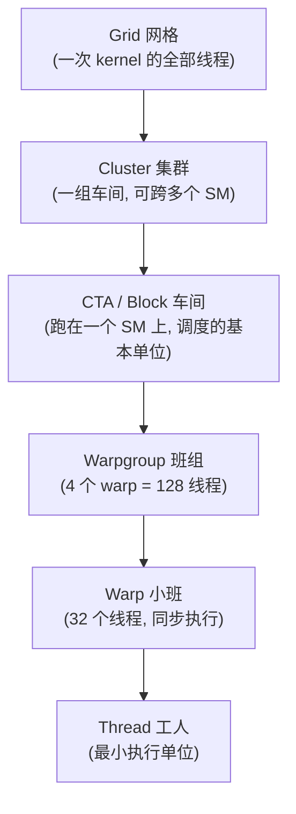
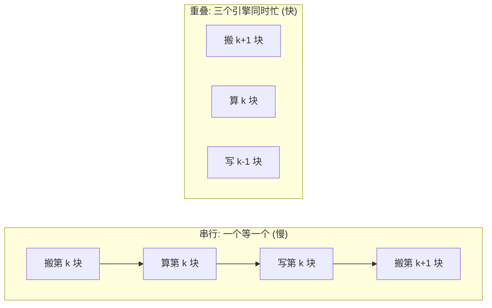

# 第 0 章 · 写给纯新手:GPU & ML Infra 极简入门

> **本章是中文笔记新增的"地基"章**,原书没有对应章节。如果你会写代码(Python / C++ / 后端 / 数据都行)但几乎没碰过 GPU,**请从这一章开始**。读完它,你再翻后面任何一章,那些满天飞的 warp、SMEM、tile、MMA 才会有画面感,而不是一堆吓人的黑话。

> **本章要点(TL;DR)**
>
> - GPU 不是"一颗更快的 CPU",而是一座**超大并行工厂**:几万个很弱的小工人(线程)被编成班组一起干活。
> - 三件事撑起整本书:**谁来干活**(线程层级:thread / warp / lane / warpgroup / CTA / cluster)、**东西放哪**(内存层级:寄存器 / 共享内存 / 全局内存 / 张量内存)、**到底在算什么**(矩阵乘 GEMM 和注意力 Attention)。
> - GPU 跑得快的秘诀只有一个词:**重叠(overlap)**——让"搬数据"和"做计算"同时进行,谁也别等谁。
> - 这本书讲的是 NVIDIA **最新的 Blackwell 架构**,以及一种用来写 GPU 内核的语言 **TIRx**。这两个名字现在记不住没关系,本章末尾会点一下。
> - 这一章只求"听个大概、建立画面"。每个概念后面都有专章细讲,**看不懂的细节先放过,有印象就行**。

---

## 0.1 先说清楚:这本书在讲什么,你为什么需要先读这一章

这本书讲的是**怎么把 GPU 榨干、写出"飞快"的计算内核**——尤其是深度学习里最吃算力的两个运算:**矩阵乘法(GEMM)** 和 **注意力(Attention)**。

问题在于:原书默认你已经懂 GPU 是怎么工作的,所以一上来就是 warp、共享内存、Tensor Core……对一个没写过 GPU 的人,这就像没学过加减乘除就被拉去听微积分。

所以这一章的任务很简单:**用大白话,把后面会反复出现的那套基础词汇,一次性给你讲明白。** 不求深,只求你心里有画面。

---

## 0.2 一个贯穿全书的比喻:GPU 是一座"超大工厂"

把 GPU 想象成一座工厂,你大概就抓住八成了:

- **工人 = 线程(thread)**:数量极多(几万个),但每个都很弱、只会干很简单的活。
- **班组 = 线程的层级**:工人不是一盘散沙,而是 32 人一个**小班(warp)**、几个小班一个**车间(CTA)**……一层层编起来,方便协作。
- **仓库 = 各级内存**:有的仓库就在工位手边(快但极小),有的在车间角落(中等),有的在厂区外的大仓库(巨大但远)。
- **专用机床 = Tensor Core**:普通工人(CUDA 核)啥都能干但慢;而工厂里有几台专门做"矩阵乘"的高速机床,一开起来吞吐量甩开普通工人一个数量级。
- **传送带 = 数据搬运引擎(TMA)**:专门负责把原料从大仓库运到工位,且**运的时候不占用工人的手**。

> **关键**:工厂效率高不高,不在于某个工人多快,而在于**机床别停**。只要传送带能一直把原料及时送到,高速机床就能一直满负荷转。这就是后面整本书在折腾的事。

---

## 0.3 谁来干活:线程的层级

GPU 不会把几万个线程当成一个扁平的大池子,而是**一层层嵌套**地组织起来。为什么?因为"协作"发生在不同的尺度上——有时两个线程要交换一个值,有时一整个车间要共用一块数据。每一层,都是为了让"某个尺度的协作"变得便宜。

从小到大,六层:

逐个认识一下(**这张表是全书最该记住的一张**):

| 名字 | 是什么 | 大白话 |
| --- | --- | --- |
| **线程 / thread** | 最小的执行单位,有自己的"程序计数器"和私有寄存器 | 一个工人 |
| **lane(通道)** | warp 里某个线程的**编号(0~31)** | 工人在小班里的**座位号**。注意:lane 不是新硬件,就是线程的编号 |
| **warp(线程束)** | **32 个线程**捆在一起,同一时刻发同一条指令 | 一个 32 人小班,动作整齐划一 |
| **warpgroup(线程束组)** | **4 个 warp = 128 个线程** | 4 个小班拼成的班组(较新的架构才有) |
| **CTA / block(线程块)** | 一批线程,跑在**同一个 SM**(下面解释)上,共享一块"共享内存" | 一个车间 |
| **cluster(集群)** | 一组 CTA,**可以分布在不同 SM 上**还能互相协作 | 几个车间联手 |
| **grid(网格)** | 一次 kernel 启动的**所有**线程 | 整个厂这一单活的全部人手 |

> **关键**:这几层是"谁装谁"的包含关系,但**每一层具体装几个,有的硬件定死、有的你自己定**。硬性规定:一个 warp 永远是 32 个线程,一个 warpgroup 永远是 4 个 warp(= 128 线程)。可一个 **CTA(车间)里到底放几个 warp,是你写 kernel 时自己定的**——比如一个 128 线程的 CTA = 4 个 warp = 1 个 warpgroup;一个 256 线程的 CTA = 8 个 warp = 2 个 warpgroup。所以别把 warpgroup 当成 CTA 和 warp 中间一个固定的硬层级,它说白了就是"把相邻的 4 个 warp 凑成一组"的叫法,方便某些指令一次指挥 128 个线程。

还有两个一定会撞见的词:

- **SM(流式多处理器 / Streaming Multiprocessor)**:GPU 里真正干活的"车间厂房"。一颗 GPU 由很多个 SM 拼成,一个 CTA 跑在一个 SM 上。
- **SIMT(单指令多线程)**:warp 里 32 个线程**发同一条指令**,但各自拿自己的数据。这就是为什么 GPU 适合"对一大堆数据做同样的事"。

> **注意**:"同发一条指令"不代表它们必须走同一个 if 分支。每个 lane 可以被单独"屏蔽"掉,所以同一个 warp 里有的 lane 走 if、有的走 else 也行——只是这时硬件得分两趟跑,慢一些(这叫**分支发散**)。

---

## 0.4 东西放哪:内存的层级

GPU 的内存不是一块,而是**好几层**,典型规律是:**越靠近工人的越快、但越小;越远的越大、但越慢。**

| 名字 | 在哪 | 谁能用 | 特点 | 工厂比喻 |
| --- | --- | --- | --- | --- |
| **寄存器 / Register(RF)** | 紧贴计算单元 | **每个线程私有** | 最快、最小 | 工人手里攥着的几个零件 |
| **共享内存 / SMEM** | SM 片上 | **一个 CTA 内共享** | 很快、不大 | 车间中间的公用工作台 |
| **全局内存 / GMEM(也叫 HBM)** | 显存 | **所有线程都能访问** | 很大、相对慢 | 厂区外的大仓库 |
| **张量内存 / TMEM** | SM 片上(Blackwell 新增) | 给 Tensor Core 放累加结果用 | 专用 | 高速机床旁边的专属料台 |

数据的典型流向就是:**从大仓库(GMEM)搬到工作台(SMEM)→ 工人/机床计算 → 结果再写回大仓库**。

这里有两个性能上极其要命、后面反复出现的概念,先混个脸熟:

- **访存合并(coalescing)**:一个 warp 的 32 个线程同时读数据时,如果它们要的地址**正好连续**,硬件能把 32 次访问合并成 **1 次**;如果地址东一个西一个,就可能裂成 32 次。差距几十倍。
- **bank 冲突(bank conflict)**:共享内存被切成 32 个"**bank(存储体)**"。32 个线程如果各读各的 bank,能并行;如果挤到**同一个 bank 的不同地址**,硬件只能排队一个个来。这也是为什么后面要费劲折腾数据的"摆放方式"(布局、swizzle)。

> **关键**:GPU 编程里大量的"奇技淫巧",归根结底都是在回答同一个问题——**怎么把数据摆好,让 32 个线程读得又快又不打架。**

---

## 0.5 到底在算什么(一):矩阵乘 GEMM

深度学习里最核心、最吃算力的运算,就是**矩阵乘法**。专业点叫 **GEMM**(General Matrix Multiply,通用矩阵乘),本质就是你高中学的 `C = A × B`。

为什么它是主角?因为神经网络里的全连接层、卷积、注意力,落到底层几乎全是矩阵乘。GPU 跑得快不快,很大程度上就看 GEMM 跑得快不快。

**关键概念:tile(分块)。** 一个矩阵可能是 4096×4096,一次根本算不完、也放不进快内存。怎么办?**切块。** 把大矩阵切成一个个固定大小的小方块(比如 128×128),每次只搬一小块、算一小块。这个小方块就叫 **tile**。整本书你会看到无数次 tile——记住它就是"大矩阵切出来的小方块"。

**还有一个公式你会反复看到:`D = A·B + C`。** 它读作"乘了再加":

- `A`、`B`:要相乘的两块小矩阵(tile);
- `C`:**之前已经累加的中间结果**;
- `D`:这一步算完的新结果。

为什么要"加上 C"?因为大矩阵乘被切成很多小块后,**最终结果是很多小块乘积累加起来的**。那个一直在累加的 `C`/`D`,就叫**累加器(accumulator)**。它放哪儿,其实是个大学问:累加器往往不小,而且要从第一块一直累到最后一块,**全程都得占着地方**。要是一直霸占着每个线程那点**稀缺的寄存器**,就没几个寄存器干别的了。所以最新的 Blackwell 干脆给它单开了一块专用片上内存——就是 0.4 里提到的 **TMEM**,专门用来摆累加器,把宝贵的寄存器腾出来。(这条线索,第 6 章会细讲。)

---

## 0.6 到底在算什么(二):Tensor Core 与 MMA

GPU 里有两类"算手":

- **CUDA 核(CUDA Core)**:通用的标量计算单元,啥都能算(加减乘除、判断、寻址),但做矩阵乘相对慢。
- **Tensor Core(张量核)**:**专门做矩阵乘的固定功能硬件**。它一次就能吞下两块 tile,直接算出 `D = A·B + C`,吞吐量比 CUDA 核高一个数量级以上。

Tensor Core 做的这个"小块矩阵乘加"操作,有个专门的名字:**MMA**(Matrix Multiply-Accumulate,矩阵乘累加)。你还会看到 `wgmma`、`tcgen05` 这种词——它们是不同架构上发起 MMA 的具体指令,现在只需知道"哦,这是在让 Tensor Core 算矩阵乘"就够了。

> **关键**:现代 GPU 之所以能跑大模型,核心就是 Tensor Core。后面大半本书的折腾,本质都是为了**让 Tensor Core 一刻不停地有数据可算**。

---

## 0.7 怎么喂数据:异步搬运、流水线与"重叠"

Tensor Core 再快,**没数据可算也只能干瞪眼**。所以"怎么及时把数据喂上"和"怎么算"一样重要。

- **同步 vs 异步**:老办法是让计算线程自己去搬数据——但它搬的时候就没法算了,白白浪费。新办法是**异步搬运**:线程只下个"搬运指令",活儿交给专门的硬件引擎,自己继续算。
- **TMA(张量内存加速器 / Tensor Memory Accelerator)**:就是这个专门的搬运引擎,负责在大仓库(GMEM)和工作台(SMEM)之间**成批、异步**地搬 tile。
- **mbarrier(异步屏障)**:既然搬运是异步的,就得有个东西通知"搬完了,可以用了"。mbarrier 就是这个"信号灯",负责在搬运方和计算方之间对暗号。
- **流水线 / 重叠(pipeline / overlap)**:这是**全书的灵魂**。与其"搬完→算完→写完"一步步串着来(同一时刻只有一个引擎在忙),不如让它们**像流水线一样错开重叠**:这边在算第 k 块,传送带已经在搬第 k+1 块,收尾引擎在写第 k-1 块。三个引擎同时忙,整体就快得多。

> **关键**:记住这一句,后面就不会迷路——**慢内核和快内核的差距,几乎全在"重不重叠"上。**

---

## 0.8 注意力(Attention)是什么,为什么在硬件上难

Transformer 大模型的核心运算是**注意力(Attention)**。抛开数学,它干的事是:对每个词,去看序列里所有其他词、算出"该关注谁多一点",再据此把信息加权汇总。

落到计算上,它是**两次矩阵乘,中间夹一个 softmax**:

1. `S = Q · Kᵀ`:算出一个**分数矩阵(score matrix)**,形状是 `序列长 × 序列长`。序列一长,这个矩阵就**大得吓人**。
2. `softmax(S)`:把**一行**分数变成一组**权重**。做法是:每个分数先取指数 `exp`,再除以这一行的总和。效果是——分数大的被进一步拉大、所有权重都为正、且一行加起来正好等于 1(所以叫"归一化",你可以理解成"把一行分数换算成百分比")。
3. `O = softmax(S) · V`:用权重把信息加权汇总成输出。

难点在哪?那个巨大的分数矩阵 `S` 如果老老实实存进显存,**又占地方又慢**。更麻烦的是 softmax 本身:它要除以"**一整行的总和**",还要先找出这一行的最大值(为了数值稳定)。这就好像逼着你**先把一整行的分数都算出来、攒齐了**,才能开始归一化——那不就等于要把 S 整个存下来吗?

著名的 **Flash Attention** 就是来破这个两难的。它的核心思路是:**绝不把完整的 S 存下来**,而是一块一块地流式过 K/V,边算边维护两个"运行中的统计量"——当前见过的最大值、当前的累计总和;每来一块新数据,就**按比例修正**之前的结果。这样既不用存下整个 S,又能算出和"完整 softmax"完全一样的答案。这套技巧的硬件实现,正是本书第 14 章的高潮。

现在你只需记住:**注意力 = 两个矩阵乘 + 中间一个 softmax,且要想办法别把那个大分数矩阵实际存出来。**

---

## 0.9 这本书的两个"新东西":Blackwell 与 TIRx

最后两个名字,扫个盲就行:

- **Blackwell**:NVIDIA **最新一代 GPU 架构**(代表卡如 B200)。GPU 架构是一代代演进的:**Ampere(A100)→ Hopper(H100)→ Blackwell(B200)**。一代比一代多出新硬件(比如 Hopper 带来了 TMA 和 warpgroup,Blackwell 带来了 TMEM)。本书专门讲 Blackwell,所以会出现很多"只有最新卡才有"的特性。
- **TIRx**:本书用来写 GPU 内核的**编程语言/工具**,是嵌在 Python 里的一种 DSL(随 Apache TVM 一起发布)。它的特别之处是:**让你直接、明确地点名硬件**(这块数据放 SMEM、这步用 Tensor Core 算……),而不像高层框架那样把硬件细节藏起来。第 9 章开始专门讲它。

---

## 0.10 术语速查表(读后面遇到生词就回来翻)

| English | 中文 | 一句话理解 |
| --- | --- | --- |
| thread | 线程 | 一个最小的工人 |
| lane | 通道 | 线程在 warp 里的座位号 0~31 |
| warp | 线程束 | 32 个线程的小班,同步执行 |
| warpgroup | 线程束组 | 4 个 warp = 128 线程 |
| CTA / block | 线程块 / 车间 | 跑在一个 SM 上的一批线程 |
| cluster | 集群 | 可跨 SM 协作的一组 CTA |
| grid | 网格 | 一次 kernel 的全部线程 |
| SM | 流式多处理器 | GPU 里真正干活的"车间厂房" |
| SIMT | 单指令多线程 | 一个 warp 同发一条指令、各算各的数据 |
| Register / RF | 寄存器 | 每个线程私有、最快最小的存储 |
| SMEM | 共享内存 | 一个 CTA 内共享的片上快内存 |
| GMEM / HBM | 全局内存 / 显存 | 所有线程可见、又大又慢 |
| TMEM | 张量内存 | Blackwell 给 Tensor Core 放累加器的专用内存 |
| coalescing | 访存合并 | 连续地址的访问合并成一次,极大提速 |
| bank conflict | bank 冲突 | 多线程挤同一存储体,被迫排队 |
| GEMM | 通用矩阵乘 | `C = A × B`,深度学习的算力主角 |
| tile | 分块 / 小方块 | 大矩阵切出来的固定大小小块 |
| MMA | 矩阵乘累加 | Tensor Core 干的活:`D = A·B + C` |
| accumulator | 累加器 | 一直累加中间结果的那块数据 |
| Tensor Core | 张量核 | 专做矩阵乘的高速固定功能硬件 |
| CUDA Core | CUDA 核 | 通用标量计算单元,啥都能算但慢 |
| TMA | 张量内存加速器 | 异步成批搬 tile 的专用引擎 |
| mbarrier | 异步屏障 | 协调异步搬运/计算的"信号灯" |
| overlap / pipeline | 重叠 / 流水线 | 让搬、算、写同时进行,快的关键 |
| epilogue | 收尾阶段 | 算完后把结果写回去的那一段 |
| Attention | 注意力 | 两个矩阵乘夹一个 softmax |
| swizzle | 换序摆放 | 打乱数据摆放以避开 bank 冲突 |
| Blackwell | (架构代号) | NVIDIA 最新一代 GPU 架构 |
| TIRx | (编程语言) | 本书用来写 GPU 内核的 Python 内嵌 DSL |

> **提示**:更全的术语对照见 [术语对照表](./术语对照表.md)。

---

## 0.11 该怎么读这本书

- **完全没基础**:先把这一章看完(细节不懂没关系),再从**第 1 章**顺着往下读。每读到一章卡壳,回这里的速查表瞄一眼。
- **会一点 CUDA**:可以快速扫过本章,直接进第 1 章;遇到 Blackwell 专属的 TMA / TMEM / warpgroup 再回头查。
- **只想看 GEMM / Attention 实战**:也建议先看完本章和第 1、2 章,否则第 11–14 章会很吃力。

完整的阅读路线见 [首页 README](./README.md)。

---

## 小结

这一章不指望你记住所有细节,只要在脑子里搭起三根支柱就够了:

1. **谁干活**:线程被编成 warp(32)→ warpgroup(128)→ CTA(车间)→ cluster,跑在一个个 SM 上。
2. **东西放哪**:寄存器(私有最快)→ 共享内存 SMEM(车间共用)→ 全局内存 GMEM(又大又慢),外加 Blackwell 的 TMEM。
3. **在算什么、怎么算快**:核心是矩阵乘 GEMM 和注意力 Attention;让 Tensor Core 不停转、让搬运和计算**重叠**,就是全书的主线。

带着这三根支柱,翻开第 1 章吧——你会发现那些黑话,忽然就有画面了。

## 延伸阅读

- 下一章:[第 1 章 · GPU 执行模型](./ch01_gpu_execution_model.md)(把本章的"谁干活、东西放哪"讲得更细)
- 速查:[术语对照表](./术语对照表.md)
