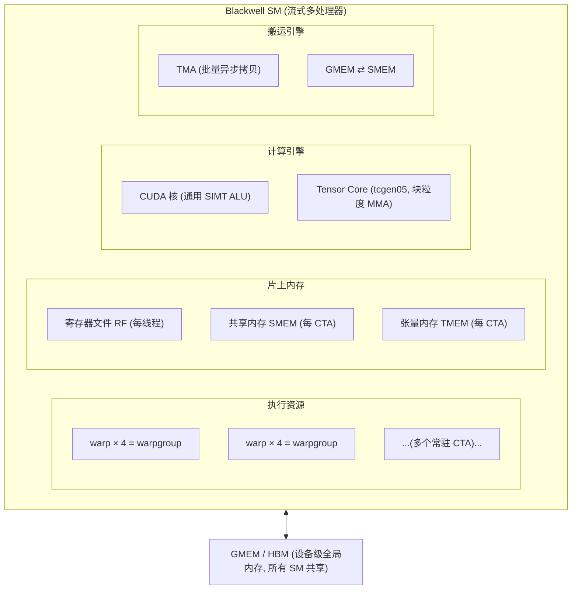
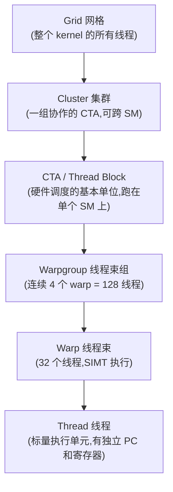
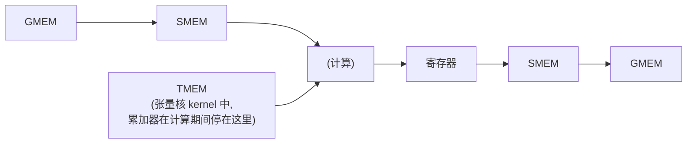
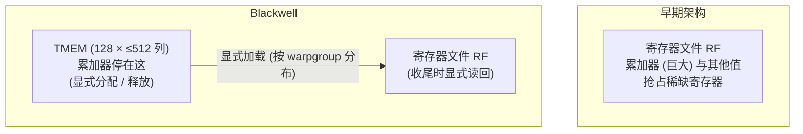
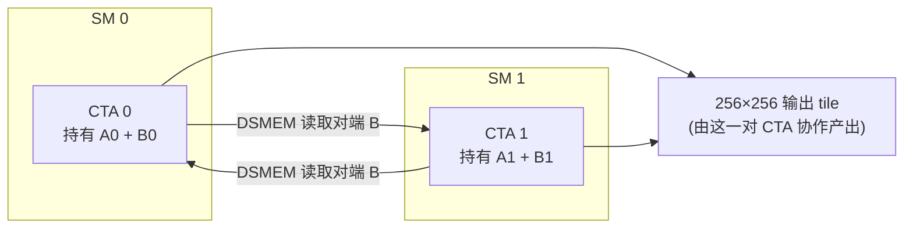

# 第 01 章 · GPU 执行模型

> 原文:[GPU Execution Model — Modern GPU Programming for MLSys](https://mlc.ai/modern-gpu-programming-for-mlsys/)

> **本章要点(TL;DR)**
> - GPU 把数以千计的线程组织成一个**嵌套层级**:线程(thread)→ 线程束(warp)→ 线程束组(warpgroup)→ CTA → 集群(cluster)→ 网格(grid)。每一层都是为了让"某个尺度上的协作"变得廉价而存在。
> - 一个核函数(kernel)的工作流,本质上是把数据在多个**内存空间**之间搬运并暂存的过程:寄存器(RF)、共享内存(SMEM)、全局内存(GMEM),以及 Blackwell 新增的张量内存(TMEM)。典型数据通路是 `GMEM → SMEM →(计算)→ 寄存器 → SMEM → GMEM`。
> - 算力被拆成两类引擎:通用的 **CUDA 核(CUDA core)** 负责索引、逐元素运算、归约、控制流;**张量核(Tensor Core)** 是固定功能单元(fixed-function),以"块(tile)"粒度一次性完成 `D = A·B + C`,吞吐量比 CUDA 核高一个数量级以上。
> - 专门的**数据搬运引擎**(如 TMA)负责喂数据给计算引擎。计算引擎与搬运引擎是**相互独立、异步运行**的。
> - 把以上拼成一条 GEMM 流水线后,快慢的全部差距都在于 **重叠(overlap)**:让搬运、计算、收尾(epilogue)三个引擎**同时忙起来**,而不是一个等一个。

> **前置知识**:这是全书的基础章,几乎不要求额外背景——只要你知道 GPU 大致是"成千上万个线程一起算"、矩阵乘法(GEMM)是 ML 的核心运算就够了。没把握的话,先翻一下 [第 0 章 · 极简入门](./ch00_gpu_ml_primer.md)。本章会默认你已经认识这些词,并从这里开始把它们一层层讲清楚。

---

这是全书第一部分「硬件、内存与执行模型」的头一章。它就想干一件事:在你脑子里画出一张地图。

怎么画?分两步。第一步,把执行层级、内存空间、计算引擎、搬运引擎这几块拼图**一块一块**讲明白。第二步,用一条 GEMM(通用矩阵乘)流水线把它们**串成一条线**,让你亲眼看见数据和执行是怎么在硬件里跑起来的。

> **关键**:全书就围着一个核心观点转——后面几乎所有的优化技巧,说到底都在回答同一个问题:"怎么把活儿合理地铺到这几块拼图上?" 所以别把这一章当成可看可不看的背景。它是后面每一章都要用的一套词汇和坐标系,先打好这个底,后面才走得顺。

先看一眼硬件长啥样。GPU 里最核心的计算单元叫**流式多处理器 / Streaming Multiprocessor**,简称 SM。原文用一个交互式演示,把 Blackwell 架构下一个 SM 内部的主要部件都摆了出来:线程束、线程束组、共享内存、张量内存,还有张量核和 TMA 引擎。我们用一张静态图表达同样的东西,你就把它当成这一章的"地图总览"来看: 

> **注意**:一颗 GPU 是由一大堆这样的 SM 拼起来的,这些 SM 共用一块设备级的全局内存(HBM)。这一章我们盯着看的,是**单个 SM 内部**,以及**几个 SM 凑在一起协作**(也就是集群)时的执行和内存模型。

---

## 一、执行层级:为什么不是"一锅线程"

### 1.1 嵌套层级的设计动机

很多人第一反应是这样:GPU 不是有成千上万个线程嘛,那它们大概就是一大锅平铺的线程吧?**还真不是。** GPU 把这些线程套了好几层,组成了一个嵌套的层级。

干嘛这么费劲?因为**线程之间的协作,远近不一样**。举几个例子: 

- 挨着的两个线程,想交换一下寄存器里的值——这是很"近"的协作。
- 同一个块里的 128 个线程,想合用一小块暂存数据——这是中等距离的协作。
- 趴在两个不同 SM 上的两个块,想共享操作数(operand,就是参与运算的输入数据,比如矩阵乘里的 A、B 矩阵)——这就"远"了。

要是只有一锅平铺的线程,硬件就只能拿"最贵的那套"通信手段去对付所有情况,哪怕很多协作其实近在眼前。GPU 反着来:**分层,每一层专门把某个距离上的协作做得又快又省**。下面这张图,就是 Blackwell 上整个层级的样子。

### 1.2 逐层拆解

我们从最小的标量单位起步,一层一层往上爬。

| 层级 | 规模 | 关键特性 |
| --- | --- | --- |
| **线程(thread)** | 1 | 标量执行单元;有自己独立的程序计数器(PC)和寄存器(register,线程私有、最快的小块存储);在所属 warp 内用 lane ID(通道号,即线程在 warp 里的 0–31 编号)标识。 |
| **线程束(warp)** | 32 线程 | 以 **SIMT**(*single instruction, multiple threads*,单指令多线程)方式执行。32 个 lane 一起发射同一条指令,但各自持有独立寄存器,且可被单独屏蔽(mask)。 |
| **线程束组(warpgroup)** | 4 个 warp = 128 线程 | Hopper 引入,作为发射 **warpgroup 级 MMA**(MMA = 矩阵乘加,一次算 `D = A·B + C`;`wgmma` 即由 warpgroup 发射的那种)的单位;在 Blackwell 上又多了一个角色——它是**访问 TMEM 的协作单位**,128 个线程一起把一块 TMEM 搬进/搬出寄存器。 |
| **CTA**(*Cooperative Thread Array*,即 CUDA 里的 thread block) | 多个 warp | 硬件调度的**基本单位**;一个 CTA 跑在单个 SM 上,并在 SM 内拥有一块私有的共享内存。多个 CTA 可同时常驻同一 SM,此时它们瓜分该 SM 的共享内存容量。 |
| **集群(cluster)** | 一组 CTA | 一组协作的 CTA,**成员可以分布在不同 SM 上**。集群内的 CTA 之间可以互相同步,并能读写彼此的共享内存——这就是**分布式共享内存(DSMEM)**。 |

说到 SIMT,有个地方特别容易绕进去,这里专门拎出来讲。

> **关键**:warp 里 32 个 lane "发射同一条指令",乍一听好像它们必须齐步走、只能走同一条分支——其实不用。每个 lane 有自己的寄存器,还能被单独屏蔽掉,所以同一个 warp 里,不同 lane 完全可以走不同的分支。那代价是什么?一旦分支发散,硬件没法同时跑,只能把这几条分支**轮着串行跑一遍**,跑哪条就把不走这条路的 lane 先屏蔽掉。正是这种"允许同一 warp 内部分叉"的本事,把 SIMT 和纯 SIMD 从根上区分开了。

### 1.3 "作用域(scope)":同一个操作由谁来发起

想读懂 Blackwell,这里有个关键观点,先记牢。

**早期架构**上事情很简单:一个核函数里的各种操作,基本都是"同一组线程"在发起。可到了 **Blackwell,玩法变了——关键操作不再由同一组线程发起了**。为什么?因为每种操作都有它**最顺手的粒度**:有的活儿一个线程做最合适,有的得拉上一整个 warpgroup 一起干: 

| 操作 | 由谁执行(作用域/scope) |
| --- | --- |
| **TMA 拷贝**(TMA = 张量内存加速器,专门在 GMEM 与 SMEM 之间批量异步搬数据的硬件) | 由**单个线程**发起,随后交给专门硬件去完成。 |
| **TMEM → 寄存器 加载** | **按 warpgroup 分布**:4 个 warp 协作,每个 warp 搬运 TMEM 块的一个切片。 |
| **`tcgen05` MMA** | 由**一个被选中(elected)的线程**提交。 |
| **集群级 MMA(2-CTA)** | **一次横跨两个 CTA**。 |

"具体由哪组线程来执行某个操作",书里给这件事起了个名字,叫这个操作的**作用域 / scope**。

> **关键**:scope 是全书反复出现的三大设计要素之一——**作用域 / scope、布局 / layout、派发 / dispatch**。往后每碰到一个 GPU 操作,你都该先问一句:"它的 scope 是啥?单个线程?一个 warp?一个 warpgroup?还是跨 CTA?" 把这个想明白了,你才知道同步该怎么写、数据该怎么分。layout 和 dispatch 是另外两位,后面的章节会一点点补齐。

---

## 二、内存空间:容量与速度的取舍

### 2.1 为什么有这么多种内存

线程再快,手上没数据也只能干等着。所以光有计算单元不顶用,还得有地方搁数据。

这里有条躲不开的物理铁律:**没有哪种内存能既大又快**。容量和速度,你只能挑一头,或者在中间找个折中。既然不存在完美的内存,GPU 索性多备几种,每种在"大"和"快"这根取舍曲线上各占一个位置。说白了,一个核函数忙活的事,核心就是**让数据在这几种内存之间来回倒腾**。

| 内存空间 | 归属 | 角色 | 说明 |
| --- | --- | --- | --- |
| **全局内存(GMEM)** | 设备级(device-wide) | 张量的持久存储 | 大容量 HBM,所有 SM 共享;离计算最远,延迟最高。 |
| **共享内存(SMEM)** | 每 CTA(单个 SM 内) | 块(tile)的暂存区 | 低延迟的"便笺本(scratchpad)";B200 上每 SM 最多 228 KB。(tile/分块:把大矩阵切成的小方块,GPU 一次处理一块。) |
| **张量内存(TMEM)** | 每 CTA | MMA 累加器存储 | Blackwell 新增;由 `tcgen05` 使用。(累加器/accumulator:矩阵乘一块块累加结果时,暂存中间和的那块地方。) |
| **寄存器文件(RF)** | 每线程 | 标量与每线程的块片段(fragment,即一块大 tile 切给单个线程、暂存在它寄存器里的那一小片) | 最快;存放收尾(epilogue)阶段和临时值。 |

这张表别当成四个互不相干的条目来看。**你从上往下顺一遍就会发现,它其实勾出了一条路**——数据从最远最慢的 GMEM 出发,一步步往计算单元身边凑。本书里几乎每个核函数的数据通路,都是这个走法: 

要是这个 kernel 用了张量核,那 **TMEM 就卡在这条路的中间**——计算正进行的时候,累加器就停在它那儿。

### 2.2 重点理解 TMEM:Blackwell 独有的设计

四种内存里,前三种你多多少少都打过照面,**就 TMEM 是 Blackwell 全新的玩意儿,以前压根没有它这一号**。它的完整细节留到后面「Tensor Cores: tcgen05」那章再讲,但它**当初为啥被造出来**,现在就值得弄明白——因为这背后是一笔很经典的权衡。

**先看它要解决啥问题**:早期 GPU 把那个巨大的 MMA 累加器直接塞进**寄存器**。问题就出在这儿——累加器本身就大,寄存器又是稀缺到不行的资源。累加器占得越多,能匀给别处的寄存器就越少;寄存器一吃紧,能同时常驻的线程数(也就是占用率 / occupancy)就被压下来了。这成了一个甩了好多年都甩不掉的瓶颈。

**Blackwell 的解法**:把 `tcgen05` 算出来的累加器,从寄存器里挪出去,搬到一块叫 **TMEM** 的新地方。TMEM 是个 CTA 作用域的**二维便笺本**,规格是 **128 个 lane × 最多 512 个 32 位列(每 CTA 一块)**,物理上就长在 SM 上。当然天下没白吃的午餐——代价是:核函数进收尾阶段之前,**得自己动手把 TMEM 里的数据显式读回寄存器**,系统不会自动给你搬。

就这"多出来的一步",牵出了两个会贯穿全书的后果:

1. **读 TMEM 得自己显式来,而且是按 warpgroup 分着读**:一个 warpgroup 的 4 个 warp 一起协作完成(还记得上一节那个 scope 吗?这就是活生生的例子)。
2. **TMEM 不像寄存器那样系统帮你自动打理**:你得**亲手分配,用完亲手释放**。

> **注意**:把累加器从寄存器挪到 TMEM,是笔很典型的买卖——**花一点写代码的麻烦,换硬件资源彼此解耦**。好处是寄存器再也不被那个大累加器占满了;代价是程序员得自己惦记 TMEM 的生死(分配、释放),还得记得那次显式读回。这种"拿复杂度换性能"的权衡,后面你会一遍遍碰到。

### 2.3 跨集群的分布式共享内存(DSMEM)

回想一下:整个层级里,**就集群这一层**,成员能横跨好几个 SM。正是这个"够得着别的 SM"的本事,让它有了一项别的层级都没有的内存能力。

**它解决啥问题?** 一个 CTA 趴在单个 SM 上,平时只能用自家这个 SM 的共享内存。可单个 CTA 的 SMEM 预算就那么一丁点,处理大块数据时往往要么**得放下更多操作数**,要么想**把已经搬进来的数据多用几遍**——这些事,一个 CTA 光靠自己根本兜不住。

**Hopper 的答案**叫**线程块集群 / thread block cluster**:把一组 CTA 拴在一块,让它们协作得比平时更近一步。它们能一起同步,还能读写对方的共享内存。这种"互相读写对方 SMEM"的能力,就叫**分布式共享内存 / DSMEM(Distributed Shared Memory)**。到了 Blackwell,集群不但留了下来,还更上一层楼,添了**动态调度**(见后续「集群启动控制 / Cluster Launch Control」)和 **2-CTA 协作式 MMA**。

具体怎么玩?一个 CTA 可以**直接指名道姓地去访问对端(peer)CTA 的共享内存**。一个线程能"点名"对端 SMEM 里的某个位置,把一块 tile **从自己的 SMEM 整批拷过去**,等字节全都送到了,再**升起一面完成屏障 / barrier**(barrier/mbarrier:一种同步信号,用来告诉别人"我这步干完了,你可以接着干了")招呼对方一声(见后续「Async Coordination: mbarriers」)。第三部分那个 2-CTA 集群 GEMM,就是靠这套机制在两个 CTA 之间共享操作数 tile,**全程不用把数据绕到全局内存再绕回来**——省了一大圈冤枉路。

原文用交互演示展示了 2-CTA 集群多出来的这一下"DSMEM 跳转"。我们用图说一遍同样的意思:每个 CTA 各攥着 A、B 的一半,再通过集群去读对端的那半 B(走 DSMEM),最后两个 CTA 合力憋出一个 256×256 的输出 tile: 

> **关键**:DSMEM 的价值,一句话——它开了一条**绕开全局内存的近道**。以前两个块想共享数据,只能各自跑一趟 GMEM 把它读出来(流量白白翻倍,延迟还高);现在直接 SMEM 拷给 SMEM,又快又省。后面要讲的 2-CTA 协作式 MMA 和 TMA 多播,底下踩的都是它。

---

## 三、计算引擎:CUDA 核与张量核

线程,加上它们辛辛苦苦搬来的数据,最后都得在算术单元上"会合",真正开算。这里有个关键:一个 SM 给你的不是一种引擎,而是**两种压根不一样**的数学引擎。它俩各管一摊、互相搭台,而这分工几乎把每个核函数该怎么写都定下来了。

| 引擎 | 类型 | 职责 |
| --- | --- | --- |
| **CUDA 核(CUDA core)** | 通用 SIMT ALU | 跑标量/向量指令:索引算术、逐元素运算、归约、控制流——也就是围绕矩阵重活的"胶水逻辑"。 |
| **张量核(Tensor Core)** | 固定功能单元(fixed-function) | 以 **块(tile)粒度**做稠密矩阵的乘加,一条指令算出 `D = A·B + C`。 |

### 3.1 为什么这个分工如此重要

道理很直白:**张量核的算术吞吐量,比 CUDA 核高出一大截**,在 FLOP/s 上差着 **10 倍甚至更多**。所以那些稠密线性代数(GEMM、卷积、注意力 / attention——Transformer 里那个靠矩阵乘算 token 之间关联度的核心算子),只有搬到张量核上跑,才有戏逼近硬件的峰值。

> **关键**:顺着这个差距,能推出一条贯穿全书的"第一性原理"——**想拿性能,基本就是一件事:把张量核喂饱,别让它停。** 这话很硬:CUDA 核哪怕优化到头,也补不回那 10 倍的吞吐窟窿。这也就解释了,为啥后面那么多章节都在死磕同一个问题:怎么把数据够快地递到张量核嘴边,让它一刻都别闲着。

### 3.2 代际变化:张量核怎么被编程、结果停在哪

一代 GPU 升到下一代,张量核这东西本身一直都在。真正在变的是另外两件事:**你怎么给它编程**,还有**它算出来的结果搁在哪儿**。

- **Hopper**:引入了异步的 warpgroup MMA —— `wgmma.mma_async`(由 warpgroup 发射,见 §1.2)。
- **Blackwell**:第五代张量核 **`tcgen05`**,把累加器放进 **TMEM** 而非寄存器(见 §2.2)。本书用专门一章「Tensor Cores: tcgen05」讲它。

### 3.3 集群对计算引擎的两项扩展

前面说集群把内存撑大了(DSMEM)。其实它对计算引擎也动了两处手脚,这两点在后面的 GEMM 章节里会一再冒头:

1. **2-CTA 协作式 MMA**:让两个 CTA **各掏出自己那份 SMEM 操作数**,拼成一个**更大的**张量核 MMA tile 一块算。
2. **TMA 多播 / multicast**:让搬运引擎**只加载一次**,就把同一块 GMEM tile **一股脑分发给好几个 CTA**,省掉"每个 CTA 各加载一遍"那份白白浪费的流量。

这两处,底下都是踩着前面那个分布式共享内存(DSMEM)来的。

---

## 四、GEMM 数据流水线:把拼图拼起来

到这儿,几块拼图我们一块一块都摆出来了。现在终于能把它们拼到一起——拿一条最典型的 **GEMM(通用矩阵乘)流水线**,看看数据和执行是怎么配合着流起来的。原文用交互演示给了一条**三级 GEMM tile 流水线**,你点一下某个动作(比如 `tma load`),它在硬件单元之间走过的那条数据路径就会被高亮出来。

### 4.1 单个 GEMM tile 的三个阶段

一块 GEMM tile 从头走到尾,要过三关。下面这张表,把每一关的 scope(谁来发起)和数据往哪儿走都标清楚了: 

| 阶段 | scope(谁发起) | 数据通路 |
| --- | --- | --- |
| ① Load 加载 | 单个线程发起 TMA | `GMEM ──TMA──► SMEM`(记录预期字节数,字节到齐后屏障翻转) |
| ② Compute 计算 | 一个被选中的线程发起 tcgen05 MMA | `SMEM ──读──► Tensor Core ──累加──► TMEM`(算完后发信号给屏障) |
| ③ Epilogue 收尾 | 整个 warpgroup 协作 | `TMEM ──读回──► 寄存器 ──转 dtype──► SMEM ──TMA store──► GMEM` |

一关一关说:

1. **加载 / Load**:用一次 **TMA 拷贝**(详见后续「Async Data Movement: TMA」),把一块 A 或 B 操作数 tile 从 GMEM 搬进 SMEM。这趟拷贝由**一个线程**发起,它还会**先报个数:这趟一共要到多少字节**。然后字节一点点落地,TMA 引擎边搬边报进度,直到**说好的字节全到齐**,完成屏障才翻一下,等于跟大家说一声"数据齐活了"。
2. **计算 / Compute**:用一次 **`tcgen05` MMA**(详见后续「Tensor Cores: tcgen05」),从 SMEM 把操作数 tile 读出来,把乘积**累加进一块 TMEM tile**。这一关由**一个被选中(elected)的线程**发起,算完了给屏障递个信号。
3. **收尾 / Epilogue**:**整个 warpgroup** 一起上,把 TMEM 里的累加器读回**寄存器**,把结果**转成输出要的数据类型**,最后写回 GMEM——一般是先在 SMEM 里中转一下,再发一次 TMA store。

> **注意**:回头对一下 §1.2 那张 scope 表,你会发现一个挺妙的巧合:这三关刚好各用了一种不同的作用域——加载是**单个线程**发起,计算是**单个被选中的线程**提交,收尾是**整个 warpgroup** 一起干。前面那句"Blackwell 的关键操作不再由同一组线程发起",这就是它最实打实的例子。

### 4.2 真正的胜负手:重叠(overlap)

照上面这个写法,三关看着像是**规规矩矩排队、一个接一个**跑下来的。可这里藏着全章最要紧的一句话:**慢 kernel 和快 kernel 的差距,全在"重叠 / overlap"这三个字上。**

- **朴素(naive)kernel**:真就老老实实按顺序来——加载,等;计算,等;存储。坏就坏在,每个引擎等上一个干完的那段时间里,自己都在**干瞪眼、白白闲着**。
- **快速 kernel**:把这三步**流水线(pipeline)**起来——张量核正算第 `k` 块的同时,TMA 引擎已经在取第 `k+1` 块了,收尾那头还在收拾(drain)第 `k-1` 块。这么一来,**同一时刻三个引擎全都在忙**,谁都没闲下来。

**朴素(串行,引擎大把闲着)** —— 横轴是时间(t0 → t9),每个时刻只有一个引擎在干活,剩下的都在等: 

| 引擎 | t0 | t1 | t2 | t3 | t4 | t5 | t6 | t7 | t8 |
| --- | --- | --- | --- | --- | --- | --- | --- | --- | --- |
| TMA | `[load k]` | | | | | `[load k+1]` | | | |
| Tensor | | `[mma k]` | | | | | `[mma k+1]` | | |
| Epilog | | | `[ep k]` | | | | | `[ep k+1]` | |

**流水线(重叠,三引擎一起忙)** —— 同一个时刻三个引擎都在干活: 

| 引擎 | t0 | t1 | t2 | t3 | t4 |
| --- | --- | --- | --- | --- | --- |
| TMA | `[load k]` | `[load k+1]` | `[load k+2]` | `[load k+3]` | ... |
| Tensor | | `[mma k-1]` | `[mma k]` | `[mma k+1]` | ... |
| Epilog | | | `[ep k-2]` | `[ep k-1]` | `[ep k]` |

> **关键**:三个**异步引擎**想重叠着跑,就得有人盯着,保证它们能安全地把活儿交给下一个——这正是后续「Async Coordination: mbarriers」要讲的**屏障(barrier)加相位(phase)模型**。第三部分那个"GEMM 阶梯(GEMM ladder)",就是一级一级地把朴素 kernel 改造成深度流水线 kernel,而这整套改造踩的地基,就是 mbarrier/phase 模型。这也是本书为啥要专门拨一章讲异步协调——没有它,重叠根本无从谈起。

---

## 小结

这一章把读懂整本书要用的坐标系搭好了。要是只让你记三句话,就记这三句:

1. **执行是分层的**。线程 → warp → warpgroup → CTA → 集群 → 网格,每一层都把某个距离上的协作变便宜。Blackwell 带来的关键转变是:**不同操作各有各的"作用域 / scope"**——TMA 由单线程发起,tcgen05 MMA 由单个被选中的线程提交,TMEM 读回和 epilogue 按 warpgroup 分着干,集群 MMA 跨两个 CTA。scope 是本书三大设计要素(scope / layout / dispatch)里打头的那个。
2. **数据是分层暂存的**。GMEM(大而慢)→ SMEM(快便笺本)→ 寄存器(最快);用张量核的 kernel 里,TMEM 还夹在中间替你拿着累加器。TMEM 是 Blackwell 独有的设计,它拿"自己分配、自己释放、还得显式按 warpgroup 读回"这点麻烦,换来把那个大累加器从稀缺的寄存器里解放出来。再往上,集群这一层又解锁了 DSMEM,让 CTA 之间能绕开 GMEM 直接共享数据。
3. **算力被拆成几个各干各的引擎,胜负全押在重叠上**。CUDA 核管胶水逻辑,张量核以 10 倍以上的吞吐扛矩阵重活,TMA 这类搬运引擎专门负责喂数据。把它们拼成 GEMM 的 load → MMA → epilogue 三级流水线之后,真正的性能秘诀就一句:**让搬运、计算、收尾这三个异步引擎一起忙起来**——而它们之间能安全交接,靠的就是 mbarrier/phase 模型。

> 一句话收尾:本书后面几乎所有的优化,翻来覆去都是同一件事的不同版本——**怎么把活儿铺到这几块拼图上,再让各个引擎重叠着一起跑**。

接下来推荐读的章节(都是本书后面的内容):

- **Tensor Cores: tcgen05** —— 详解 `tcgen05` 计算与张量内存(TMEM)。
- **Async Data Movement: TMA** —— 讲解基于 TMA 的异步数据搬运。
- **Async Coordination: mbarriers** —— 介绍协调这些引擎的 mbarrier 与相位(phase)模型。

## 延伸阅读

- 原文(英文):[GPU Execution Model — Modern GPU Programming for MLSys](https://mlc.ai/modern-gpu-programming-for-mlsys/)

> **建议**:原文里有好几个交互式演示(Blackwell SM 全貌、执行层级逐层高亮、2-CTA 集群的 DSMEM 跳转、GEMM 三级流水线的数据路径追踪)。这份笔记用静态图把同样的内容画了出来,但要说"点一下某个动作,亲眼看它在硬件单元之间怎么流"那种直观劲儿,静态图到底差点意思。想找那个感觉,建议配着原书的交互演示一起看。

## 术语对照

| 中文 | English / 缩写 | 含义速记 |
| --- | --- | --- |
| 线程 | thread | 标量执行单元,有独立 PC 与寄存器 |
| 线程束 | warp | 32 个线程,SIMT 执行 |
| 线程束组 | warpgroup | 4 个 warp = 128 线程;发射 wgmma、访问 TMEM 的协作单位 |
| 协作线程阵列 | CTA / thread block | 硬件调度基本单位,跑在单个 SM 上 |
| 集群 | cluster | 一组可跨 SM 协作的 CTA |
| 网格 | grid | 一个 kernel 的全部线程 |
| 流式多处理器 | SM | GPU 的基本计算核心模块 |
| 单指令多线程 | SIMT | warp 内同发一条指令、各 lane 可独立屏蔽 |
| 全局内存 | GMEM | 设备级大容量 HBM,所有 SM 共享 |
| 共享内存 | SMEM | 每 CTA 的低延迟片上便笺本(B200 ≤228 KB/SM) |
| 张量内存 | TMEM | Blackwell 新增,每 CTA 的 128×≤512 列累加器便笺本 |
| 寄存器文件 | RF | 每线程最快存储,放标量与块片段 |
| 分布式共享内存 | DSMEM | 集群内 CTA 互相读写对端 SMEM 的能力 |
| CUDA 核 | CUDA core | 通用 SIMT ALU,做胶水逻辑 |
| 张量核 | Tensor Core | 固定功能单元,块粒度 `D=A·B+C` |
| 张量内存加速器 | TMA | 异步批量数据搬运引擎(GMEM⇄SMEM) |
| 矩阵乘加 | MMA | matrix multiply-accumulate |
| 通用矩阵乘 | GEMM | 稠密矩阵乘法 |
| 收尾阶段 | epilogue | 把累加器转 dtype 并写回的尾部阶段 |
| 重叠 | overlap | 让多个异步引擎同时忙起来 |
| 屏障 | barrier / mbarrier | 协调异步引擎交接工作的同步原语 |
| 作用域 | scope | 执行某操作的那组线程 |
