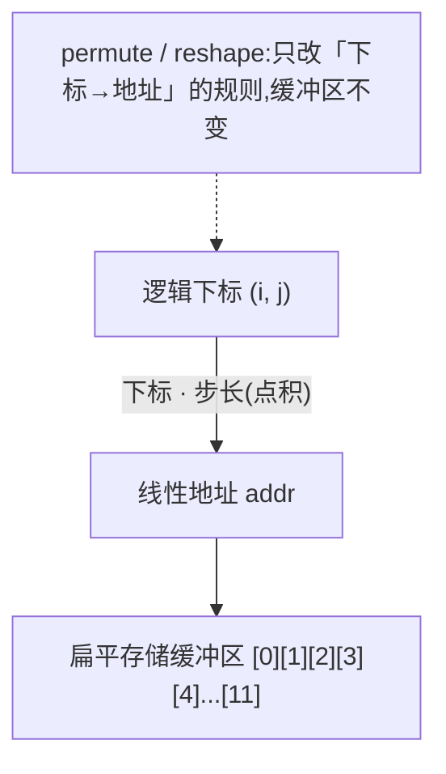
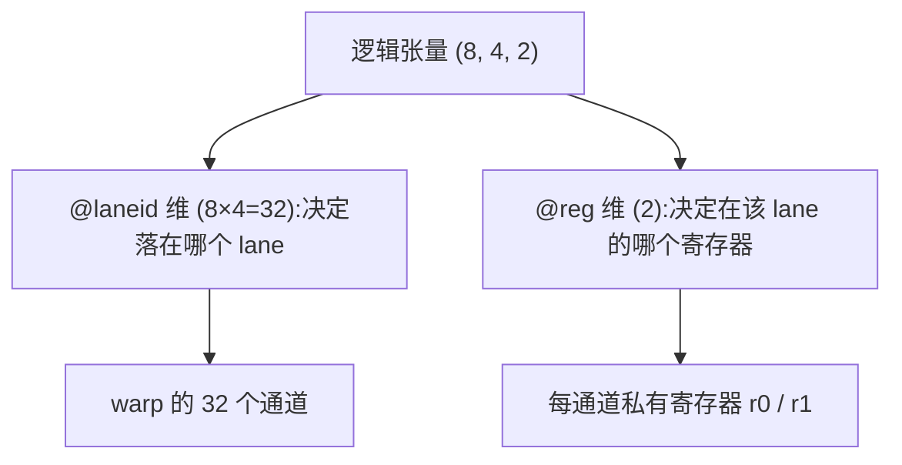

# 第 03 章 · 数据布局与其记号

> 原文:[Data Layout and Its Notation](https://mlc.ai/modern-gpu-programming-for-mlsys/chapter_data_layout/index.html)

> **本章要点(TL;DR)**
>
> - **数据布局(data layout / 数据布局)** 干的事,就是告诉你某个逻辑下标对应的数,到底躺在物理上的哪个位置。别小看它:访存能不能合并(coalescing)、会不会撞 bank、某个硬件引擎读不读得了一块 tile,全看它怎么摆。同一批数字,光是换个摆法,在同一块 GPU 上性能就能差一个数量级。
> - 全书就用一套紧凑记号描述所有布局:`S[(shape) : (strides)]`,说白了就是「形状 : 步长」做点积。这玩意儿你早就见过——PyTorch/NumPy 里的 `shape` + `stride` 就是它,这里只是把它搬到了 GPU 上。
> - 给步长贴上 **命名轴(named axes / 命名轴)**(像 `@m`、`@laneid`、`@reg`、`@gpuid_x`、`@TLane` 这些),同一套记号就能描述数据在内存、寄存器、warp 通道、TMEM、乃至整个 GPU 网格上是怎么铺开的。
> - 再加一个 **复制项(replication term / 复制项)** `R[n : stride]`,就能表达「同一份数据被广播或拷贝到好几个地方」。分布式分片里的副本是它,Blackwell block-scaled MMA 在 TMEM 里的 `warpx4` 广播也是它。
> - **Swizzle(地址异或重排 / swizzle)** 专门用来消掉共享内存的 bank 冲突,让同一块 tile 按行读、按列读都能跑得快。注意它不属于仿射布局 `S[...]`,而是单独叠在上面的一层非仿射变换。

---

> **前置知识**:读这一章前,最好先懂 warp 与 lane(通道)、寄存器 vs 共享内存、内存 bank 与 bank 冲突,以及 Tensor Core 大概是干嘛的。没把握的话,先翻一下 [第 0 章 · 极简入门](./ch00_gpu_ml_primer.md)。本章会默认你已经认识这些词。

---

平时写机器学习程序,我们脑子里基本只有张量的「逻辑形状」,比如一个 `(M, N)` 的矩阵。可形状只说清了一件事:一共有多少个数。至于这些字节摆在内存的哪个角落,它一个字都没提。偏偏硬件最在意的就是这个。

这一章要补的,就是这块拼图。**数据布局(data layout)** 回答的问题很直接:逻辑下标 `(i, j, …)` 对应的那个元素,到底存在哪儿?答案可能是全局内存,可能是共享内存,可能是寄存器,也可能是某种专用的硬件存储。

那物理摆放为什么这么要紧?原文给了三条理由,都挺具体,记住就够了。

1. **访存能不能合并**:一个 warp(一个 warp = 32 个线程组成的小班,见第 0 章)里 32 个通道(lane,即线程在 warp 内的编号)同时发 load。要是它们读的地址刚好连成一片,硬件一把就能合成 **1 次** 内存事务;可要是地址东一个西一个,就可能炸成 **32 次**。这差距,大得吓人。
2. **会不会撞 bank**:这些地址落在不同的内存 bank(共享内存被切成的若干「存储体」)上,就能并行处理;可要是挤进同一个 bank 的不同地址,硬件没辙,只能一个一个排队来,串行化。
3. **引擎读不读得了**:一块 tile(大矩阵切出来的小方块)的字节怎么排,直接决定 Tensor Core(GPU 里专门算矩阵乘的硬件单元,见第 0 章)能不能把它当成一个合法的操作数(参与运算的输入数据)读进去。

这一章的讲法是一层一层往上垒:先搭最朴素的「形状-步长」模型,再一点点往上加东西(tile、命名轴、复制项),最后才到 swizzle。讲到后面你会发现,整章翻来覆去其实就是 **同一个想法换着花样讲**。

---

## 一、形状-步长模型(The Shape–Stride Model)

咱们从最简单的布局讲起。说到底,描述一个布局只要两样东西:一个 **形状(shape)**,加上一组对应的 **步长(stride)**。写成记号长这样:

```
S[(shape) : (strides)]
```

想知道某个逻辑下标存在哪儿?把「下标」和「步长」做一次 **点积** 就完事了。拿一个行主序(row-major)的 4×4 矩阵来说:

```
S[(4, 4) : (4, 1)]        addr(i, j) = i·4 + j·1
```

步长 `(4, 1)` 是啥意思?其实特好懂。行下标 `i` 每加 1,地址就往前蹦 4 步——因为一行有 4 个元素嘛。列下标 `j` 每加 1,地址只往前挪 1 步。就这么个经典的 shape/stride 模型,只是写法更紧凑(你把它当成 CuTe 记号的行主序简化版就行)。

### 你其实早就用过它

别把它当成什么新鲜玩意儿。只要你写过 PyTorch 或 NumPy,你早就在用这套东西了。这些库里的张量,**说白了** 就是「一个 shape 加一个 stride,盖在一段扁平的存储缓冲区上面」:

```python
import torch
t = torch.arange(12).reshape(3, 4)
t.shape        # torch.Size([3, 4])
t.stride()     # (4, 1)   ← 正是 S[(3, 4) : (4, 1)]
```

一旦你这么去看张量,很多「重排」操作为什么 **压根不碰数据**,一下就通了。它们干的事无非是改写步长,然后在同一段存储上给你返回一个 **视图(view)**。最典型的就是转置 / permute:

```python
tt = t.permute(1, 0)               # 等价于 t.T
tt.shape                           # torch.Size([4, 3])
tt.stride()                        # (1, 4)   ← 步长互换,没有移动任何数据
tt.data_ptr() == t.data_ptr()      # True,同一片字节
```

`t.permute(1, 0)` 不过就是同一片内存上的 `S[(4, 3) : (1, 4)]`。换句话说,**所谓转置,就是把步长换了换,一个字节都没挪**。`reshape` / `view` 作用在连续张量上也是同样的套路——给老存储套上一个新 shape、新 stride,如此而已。

> **注意**:NumPy 的行为跟这一模一样,唯一的区别是它的 `.strides` 按「字节」算,而 PyTorch 的 `.stride()` 按「元素」算。

### 零拷贝推理的边界

下面这张图把「逻辑视图」和「物理存储」的关系串了起来:



GPU 上的布局也是这么回事。一块 tile 的映射,不管映到内存,还是用后面要讲的命名轴映到通道和寄存器,骨子里都是「固定缓冲区上的一条步长规则」。所以 **重排一块 tile,多数时候只是换了个 *布局*,并没有真去拷贝数据**。

> **关键**:零拷贝这套说法,只有在「单一线性地址空间上的逻辑视图」里才干干净净地成立。到了 GPU 上,它只在一种情况下管用:新视图跟现有的字节排布、跟所有权的安排是兼容的。反过来,只要你动了「哪个线程、哪个寄存器拥有某个元素」,或者改了 SMEM 的 swizzle,那就 **躲不掉**,必须老老实实搬数据,靠 load、store、shuffle、`ldmatrix`、transpose 这些操作来搬。后面好几章的优化,根子都扎在这儿。

---

## 二、Tile 布局(Tile Layout)

前面讲的都是「整个张量」的布局。可现实里,GPU kernel 几乎从不会一口气啃下整块矩阵,而是把它切成一个个更小的 **tile(分块)**,丢给硬件的不同部分分头去加载、变换、计算。

好消息是:**搞 tiling,不需要学任何新概念**。它还是一个布局,无非就是多写几个维度罢了。

举个例子,把一个 8×8 矩阵切成若干 2×4 的小块。这样我们就得到一个 **4 维** 布局,坐标是 `(tile_row, row_in_tile, tile_col, col_in_tile)`;步长得挑得让每个 tile 内部保持连续:

```
S[(4, 2, 2, 4) : (16, 4, 8, 1)]
```

映射就分两步。第一步,把逻辑 `(i, j)` 拆成一个四元组 `(i//2, i%2, j//4, j%4)`,也就是分出「外坐标」和「内坐标」;第二步,拿这四个数跟步长做点积。还拿 8×8 切 2×4 来说,拆法是这样:

| 逻辑下标 | 拆分(外, 内) | 含义 |
| --- | --- | --- |
| `i`(行,8 行) | `(i//2, i%2)` | 第几个 tile 行(共 4 个) / tile 内第几行(共 2 行) |
| `j`(列,8 列) | `(j//4, j%4)` | 第几个 tile 列(共 2 个) / tile 内第几列(共 4 列) |

那步长 `(16, 4, 8, 1)` 又是怎么定下来的?就盯住一条约束:让每个 tile 里头那 8 个元素在物理上连着放(也就是按 tile 一块一块地铺,而不是整体一刀切的行主序)。咱们挨个看:

```
内坐标先走,保证 tile 内 8 个元素连续:
  col_in_tile (stride 1)  : 0→1→2→3,tile 内同一行的 4 列紧挨着
  row_in_tile (stride 4)  : +4 跳到 tile 内下一行(刚好跨过 4 列)
                            → 一个 2×4 tile 占满 8 个连续地址 [0..7]
外坐标后走,从一个 tile 跨到下一个:
  tile_col   (stride 8)   : +8 跳到右边相邻的 tile(整整一个 tile = 8 元素)
  tile_row   (stride 16)  : +16 跳到下一行 tile(一行有 2 个 tile = 16 元素)

最值得记住的一点:
  这套记号根本没有引入任何特殊的「tile」概念,
  它就是原来的 shape–stride 模型,只是把下标拆成了外/内两层。
```

> **注意**:原书在这儿放了个交互演示,随便点一个格子就能看到它的 tiled 下标和物理地址。静态笔记没法还原这种点来点去的效果,不过上面的步长拆解已经把「逻辑 `(i,j)` → 拆分 → 地址」整条规则讲透了。想找找手感,可以去原书那个交互演示里玩一玩。

---

## 三、命名轴(Named Axes)

到目前为止,`S[...]` 里每个步长指的都是「线性内存里的一个偏移」,我们也一直默认「地址」就等于内存里的位置。可 GPU 上的数据,能待的地方 **远不止内存这一处**。除了内存,一块 tile 还可能散在 warp 通道(lane)上、散在线程寄存器(register,每个线程私有、访问最快的小存储)上,甚至散在 TMEM(Tensor Memory,Blackwell 新增的、专给 Tensor Core 用的片上存储)的通道和列上。

那怎么用 **同一套记号** 把这些情况一网打尽?作者这招挺巧:给每个步长系数贴一个「轴标签」,标清楚它是在哪个空间里挪动。

| 标签 | 含义 |
| --- | --- |
| `@m` | 普通内存(memory) |
| `@laneid` | warp 通道索引,即 `thread_index % warp_size` |
| `@reg` | 每通道私有的寄存器(register) |
| `@warpid` | warp 索引 |
| `@TLane` / `@TCol` | TMEM 的通道 / 列坐标 |

贴好标签,一个行主序的 8×16 内存 tile 就写成这样:

```
S[(8, 16) : (16@m, 1@m)]
```

(两个步长都带 `@m`,说明它们都指向线性内存。)

### 读法速成:手把手念一行 `S[...]`

你可能已经被后面那种 `S[(8,4,2):(4@laneid,1@laneid,1@reg)]` 的写法吓到了。别慌——它再花哨,**念法永远是固定的几步**。先把套路记下来,后面所有表达式都照这个模子读就行。

> **关键**:`S[(形状):(步长)]` 就念成一句话——「这块数据有这么大(形状);每个下标 +1,就在某个空间里走这么远(步长)」。

**第 1 步:看中括号。** `S[ ... ]` 就代表"一个布局"。中间的冒号 `:` 把它劈成两半:**左边是形状,右边是步长**,两边的项一一对应。

**第 2 步:读形状。** `(8, 4, 2)` 就是说这块数据是 8 × 4 × 2,三个维度,没别的。

**第 3 步:读步长里的 `N@axis`(这是命门)。** `N@axis` 念作:**「这一维的下标每 +1,就沿 `axis` 这个轴走 N 步」**。关键全在 `@` 后面那个轴——它告诉你"走在哪个空间里":

| 轴标签 | 走在哪 |
| --- | --- |
| `@m` | 内存地址上 |
| `@laneid` | warp 的 32 个通道(lane)上 |
| `@reg` | 某个通道自己的寄存器上 |
| `@TLane` / `@TCol` | TMEM 的通道 / 列上 |

**第 4 步:同一个轴出现多次,就把它们加起来。** 要是有两个维度的步长都带 `@laneid`,说明这俩**合伙决定**"落在哪个 lane"——把它们各自的「下标 × 步长」加到一起,就是最终的 lane 号。

把这套套到那个吓人的例子上:`S[(8, 4, 2) : (4@laneid, 1@laneid, 1@reg)]`。假设我想知道逻辑元素 `(i=2, j=3, r=1)` 到底住哪:

- 前两维都带 `@laneid`,合起来算 lane:`lane = 2×4 + 3×1 = 11`;
- 第三维带 `@reg`:`reg 槽 = 1×1 = 1`。
- **结论:元素 (2,3,1) 住在第 11 号 lane 的 1 号寄存器里。**

(顺手验证一下:第一维 8 × 第二维 4 = 32,正好等于一个 warp 的 32 个 lane——所以这块数据刚好摊满一整个 warp,每个 lane 手里攥 2 个元素。)

**最后一块拼图:`+ R[n : stride]`。** 有时你会看到 `S[...] + R[...]`,那个 `R` 是**复制(replication)**:把前面 `S[...]` 定好位置的那份数据,再沿某个轴**抄 n 份**,相邻两份隔 `stride` 那么远。比如 `+ R[4 : 32@TLane]` 念作"沿 TMEM 通道轴复制 4 份、每份隔 32 个通道",也就是第 0、32、64、96 号通道拿的是同一个值。

记住这套念法,后面 `@TLane`、`@gpuid_x`、`R[...]` 再怎么排列组合,你都能一个字一个字拆开读懂,而不用死背结论。

### 标签真正发光的时刻:数据跨线程分布

光给内存 tile 贴个 `@m`,你还看不出标签有啥用。它真正出彩,是在描述「数据散在好多个线程上」、而不是「老老实实躺在内存里」的时候。看这个例子:

```
S[(8, 4, 2) : (4@laneid, 1@laneid, 1@reg)]
```

这个布局不再指向线性内存了,它把「行、列」映射到了 **lane ID** 和 **每个通道里的寄存器** 上:

- 前两维(形状 8 和 4)的步长都带 `@laneid`。也就是说,这俩逻辑维度合起来决定「数据落在 warp 的哪个通道」(`lane = 维0·4 + 维1·1`,一共 8×4=32 个 lane,正好把一个 warp 填满)。
- 最后一维(形状 2)的步长带 `@reg`。意思是这一维顺着「同一个通道内的寄存器」展开,说白了就是每个 lane 手里攥着 2 个元素 `r0` 和 `r1`。



> **关键**:这恰好就是 Tensor Core 的「寄存器片段(register fragment,即一块矩阵被拆开、分散存放在各个线程寄存器里的那一份份小碎片)」布局,后面《Tensor Core Operand Layouts Across GPU Generations》那一章会反复用到。同一套 `S[...]` 记号,既能描述内存布局,又能描述「哪个通道、哪个寄存器拿着哪个元素」——这套记号的本事,就在这儿。

> **注意**:原书在这儿也配了交互演示,点一下格子就能看到它是由哪个 lane / register 持有的。想把「逻辑元素 ↔ 物理 lane/reg」这层对应关系摸熟,去原书玩一玩这个演示。

---

## 四、分布式布局(Distributed Layout)

命名轴最妙的一点是:**它能在系统的好几个层级上,用同一种方式描述「数据放在哪」**,甚至能描述「跨好几台设备」的摆放。前面我们用它讲了单卡内部的 lane 和 register,现在把同一个想法往外推,推到一整个 **GPU 网格(mesh)** 上:

- 像 `@gpuid_x` / `@gpuid_y` 这种轴,说的是「数据落在网格里的哪台 GPU 上」;
- 有了它俩,这套记号就能描述分布式训练 / 推理里的 **分片(sharding)** 模式了。

### 用 `R[...]` 描述复制

命名轴几乎啥都能描述,但还缺一块:**复制(replication)**,也就是「同一份数据被拷到好几个地方」这种情形。为此作者添了个新记号:

```
R[n : stride]
```

`R` 标明这是一个复制维度,`n` 是复制几份,`stride` 是相邻两份副本之间隔多远(也照样能带轴标签)。比如 `R[2 : 1@gpuid_x]`,意思就是「沿 `@gpuid_x` 轴复制 2 份」。

把分片和复制拼一块儿,**一个表达式就能一口气干两件事**:先在 2×2 的 GPU 网格上把张量分片,再沿某一轴复制:

```
S[(2, 4, 8) : (1@gpuid_y, 8@m, 1@m)] + R[2 : 1@gpuid_x]
```

下面这张图,画的就是这个「分片 + 复制」模式落在 2×2 网格上是什么样:

横轴 `@gpuid_x` 是复制方向,纵轴 `@gpuid_y` 是分片方向。网格上每台 GPU 手里拿着啥,看下表:

| | `@gpuid_x = 0` | `@gpuid_x = 1`(复制方向) |
| --- | --- | --- |
| **`@gpuid_y = 0`** | GPU(0,0):分片 A | GPU(1,0):分片 A 副本 |
| **`@gpuid_y = 1`** | GPU(0,1):分片 B | GPU(1,1):分片 B 副本 |

- `S[...]` 里的 `1@gpuid_y` → 张量沿 y 轴在两台设备间「分片」(分片 A / 分片 B);
- `R[2 : 1@gpuid_x]` → 这个分片再沿 x 轴「复制」一份给配对的设备(副本)。

> **注意**:原书的交互演示能点格子看它由哪台(或哪几台)设备持有,还能在「完全分片 / 分片+副本 / 分片+偏移」三种布局之间来回切。静态图没法还原这种切换,想看个明白就去原书体验一下。

### 4.1 kernel 内的复制:TMEM 中的 Scale Factor

复制维度 `R[...]` 可不光是给「多台设备」用的。同样这套写法,也能描述 **单个 kernel 内部** 发生的事——硬件把数据 **跨通道广播** 出去。Blackwell(NVIDIA 的最新 GPU 代号,Hopper 的下一代)的 block-scaled MMA(MMA = 矩阵乘加,Tensor Core 干的核心活)就是个绝佳的例子。

它的缩放因子(scale factor)存在 TMEM 里。妙就妙在:一个 **128 行** 的缩放向量,实际上只吃掉了 **32 个 TMEM 通道**。

- 逻辑行 `r` → TMEM 通道 `r % 32`;
- `r // 32` 沿列方向展开。

接着,这存好的 32 个 TMEM 通道,会沿着 TMEM 的 `TLane` 轴 **复制一遍**,从 32 个铺成 128 个。这么一弄,读这份数据的 warpgroup(4 个 warp 凑成的一组,共 128 个线程)里 **每一个 warp**,都能在自己那个 32 通道的 TMEM 窗口里摸到一份副本。这就是一次 `warpx4` 广播,用复制维度写出来就是:

```
S[(32, …) : (1@TLane, …)] + R[4 : 32@TLane]
```

这就给出了 4 份副本,相邻两份隔 32 个 TMEM 通道。换句话说,TMEM 通道 `l`、`l+32`、`l+64`、`l+96` **拿的是同一个缩放值**。

**存储阶段:128 逻辑行 → 32 TMEM 通道**

- 行 `r` → TMEM lane `r % 32`,列偏移看 `r // 32`;
- 总共只动用了 32 条通道(lane 0 … lane 31)。

**广播阶段:warpx4 复制(`R[4 : 32@TLane]`)**

通道 `l`、`l+32`、`l+64`、`l+96` 拿的是同一份缩放值;每个 warp 的 32 通道窗口各自分到一份副本:

| | warp0 | warp1 | warp2 | warp3 |
| --- | --- | --- | --- | --- |
| **TMEM 通道范围** | 0..31 | 32..63 | 64..95 | 96..127 |

> **关键**:跟 GPU 网格那回事一样,**复制维度本身一个新数据都不带**。它只是声明「同一个值,同时坐在 4 个 TMEM 通道上」,就像 `@gpuid_x` 把一行广播到整个 GPU 网格那样。真正去读它的,是这些 warp 里的线程。

> **注意**:每列内部的字节怎么打包(`scale_vec` 的 1X/2X/4X 模式),还有 `cta_group::2` 的拆分,这些留到《Tensor Core Operand Layouts Across GPU Generations》再细说。原书在这儿也有交互演示,把「压紧塞进 32 个 TMEM 通道」和「warpx4 广播到 128 个读取通道」这两步连着演给你看,值得一看。

> 要是你熟悉 CuTe,本章的记号这么理解就行:它就是 CuTe 的一个 **行主序变体**,只不过多塞了「显式的硬件命名轴」和「专门的复制结构」。

---

## 五、Swizzle 布局(Swizzle Layout)

这一章的最后一个布局,是专门为治一个具体的硬件毛病而生的。

### 问题:bank 冲突

GPU 的 **共享内存(shared memory, SMEM)** 在物理上被切成了好几个 **内存 bank**。访问最快的情形,是几个通道恰好落在 **不同的 bank** 上。可一旦多个通道挤去访问 **同一个 bank 里的不同地址**,硬件就没招了,只能把这些访问 **一个接一个排队来**。这就是 **bank 冲突(bank conflict)** 要交的学费。

在张量程序里,这个坑几乎绕不过去,因为内存访问往往不是干干净净的线性。处理矩阵时,我们老是要同时读同一块 tile 的 **某一行** 和 **某一列**。这就把人逼进了一个两难:

| 布局 | 行访问 | 列访问 |
| --- | --- | --- |
| 利于行的布局 | 高效 | 产生 bank 冲突 |
| 利于列的布局 | 产生 bank 冲突 | 高效 |

**Swizzle(混洗 / 异或重排)** 这招,就是冲着打破这个两难来的。

### 思路:用 XOR 把地址打散

Swizzle 的核心,就是 **把地址映射重排一下**。最典型的玩法,是拿列索引跟行索引做一次 **异或(XOR)**。这么一来,**无论你按行读还是按列读,地址都会被甩到不同的 bank 上**。

下面拿一个 8×8 tile,把「朴素行主序」和「XOR swizzle」摆一块儿对比(假设有 8 个 bank,看某一整列各自落进哪些 bank):

读「第 c 列」那 8 个元素,各自落进哪个 bank:

| 行 | 朴素行主序(bank = c) | XOR swizzle(bank = c XOR row) |
| --- | --- | --- |
| 行 0 | bank c | bank (c XOR 0) |
| 行 1 | bank c | bank (c XOR 1) |
| … | …(全是同一个 bank) | … |
| 行 7 | bank c | bank (c XOR 7) |
| **结果** | 8 个元素全落进同一个 bank → 串行化成 8 个周期 ❌ | 同一列被打散到 8 个不同 bank → 1 个周期读完 ✅ |

> **关键**:swizzle 给的「无冲突保证」是 **带条件的**。只有当「元素宽度、swizzle 模式、访问模式」三者对得上(也就是凑成某个引擎 descriptor 期望的那一组)时,它才成立;**并不是** 随便什么元素宽度、什么对齐方式都灵。一句话:模式选错,保证作废。

### 真实硬件:分段 + atom

8×8 只是个方便讲解的玩具例子。真实 GPU 的 bank 多得多,一般是 32 个。为了在真实规模上也好用,swizzle **不会把整块 tile 当成铁板一块来处理**,而是先把内存切成一小段一小段(segment),再在 **每一段内部** 各自施加 swizzle 模式。

最常见的是 `SWIZZLE_128B`,它围着 **128 字节的段** 来组织。这么安排,「行/列重排」这套把戏就跟 32-bank 的内存系统天然对上了(128 B = 32 bank × 4 B)。它的读取规则大致是:

```
physical_sector = logical_sector XOR row
```

在每个 128 字节段里头,光靠这一条规则,就能把每一列都打散到不同的 bank 上。

### 不同的 swizzle 模式(atom 大小)

把上面的思路再往前推一步:硬件定一个又小、又会反复出现的 **atom(原子单元)**,在它身上施加置换;不同的 swizzle 模式,挑的 atom 大小不一样;整块 tile 就拿选好的 atom 一格一格平铺(tile)出来。

| 模式 | atom 形状 | 适用条件(连续维度至少) |
| --- | --- | --- |
| `SWIZZLE_128B` | 8 × 128 B | 128 字节(fp16 下即 64 个元素) |
| `SWIZZLE_64B` | 8 × 64 B | 64 字节 |
| `SWIZZLE_32B` | 8 × 32 B | 32 字节 |
| 16 B 交错(interleaved)模式 | 原书未给出具体 atom 形状 | 用于更小的连续维度 |

### 该选哪个模式?

一条经验法则:**tile 能填满哪个最大的 atom,就挑哪个**。

- 一个 N 字节的 atom,要求 tile 的 **连续维度** 至少有 N 字节,而且得是 N 的整数倍。
- 所以 `SWIZZLE_128B` 只有在一行至少跨 128 字节(也就是 64 个 `float16` 元素)时才用得上。
- 而一旦用得上,它就是首选。它那个 8 × 128 B 的 atom 刚好铺满一整条 128 字节的 bank line,所以能 **一把就把一列打散到全部 32 个 bank**;在 fp16 下,8 行 8 列读起来都不撞 bank。
- 要是问题形状把连续维度逼得很小,128 B atom 填不满,那就退一档,换 `SWIZZLE_64B` 或 `SWIZZLE_32B`——原则不变,就是「一行能盖得住的最大 atom」。

### Swizzle 与 `S[...]` 记号的关系

> **关键**:这些被置换过的地址,你 **根本不用自己去手算**。另外有一点得说清楚:**swizzle 不属于 `S[...]` 那个仿射映射**。它是单独叠在上头的、自成一体的、**非仿射** 的一层。

具体来说:`S[...]` 布局先把元素安顿到一个线性内存(`@m`)地址,**swizzle 再把这个地址置换一下**。在 TIRx 的 Layout API 里,写成:

```
ComposeLayout(swizzle, tile)
```

你要操心的只有一件事:**给每一个会碰这块 tile 的算子,选一个统一的模式**。剩下的,全甩给这个「组合后的布局」去摆平就行。


### 与 tiling、TMA 的会合

这个「组合后的布局」,恰好也正是 **硬件要去填的** 那个东西。swizzle 和 tiling 就在这儿碰上头:

- 一个 **TMA descriptor** 本身就是多维的,所以单个三维「盒子(box)」一次就能把两件事说清:tile 的 atom 怎么平铺,**外加** 每个 atom 内部怎么 swizzle;
- 这样一次 TMA load,就能 **一个 atom 一个 atom 地把 tile 铺开,顺手在写进共享内存的同时把 swizzle 也做了**,压根不用再单独跑一遍 swizzle(详见《Async Data Movement: TMA》)。

> **注意**:至于每个引擎到底「要哪种」swizzle,这是 **看代际(generation)而定** 的,正好就是下一章的内容。

---

## 小结

这一章一层一层往上垒,最后搭出了一套贯穿全书的布局语言:

1. **形状-步长模型 `S[(shape):(strides)]`** 是地基——逻辑下标跟步长做点积,就得到物理地址。它其实就是 PyTorch/NumPy 张量背后那套 shape+stride。转置、reshape 为啥能零拷贝?就因为它们只改步长、不碰数据。
2. **Tile 布局** 没添任何新概念,无非就是把下标拆成「外坐标 / 内坐标」、再多写几个维度。
3. **命名轴(`@m`、`@laneid`、`@reg`、`@warpid`、`@TLane`/`@TCol`、`@gpuid_x/y`)** 把同一套记号推到了内存、寄存器、通道、TMEM,乃至整个 GPU 网格,让「数据在硬件资源上怎么铺」也能精确写出来。
4. **复制项 `R[n:stride]`** 描述「同一份数据被广播到好几处」,分布式分片里的副本是它,Blackwell block-scaled MMA 在 TMEM 里的 `warpx4` 广播也是它。复制维度本身不带新数据。
5. **Swizzle** 拿 XOR 把地址重排,消掉 SMEM 的 bank 冲突,让按行读、按列读都快。它是叠在 `S[...]` 上头的一层非仿射变换(`ComposeLayout(swizzle, tile)`),按 atom(8×N B)分段施加;挑法是「能填满的最大 atom 优先」,默认就用 `SWIZZLE_128B`。

最后,记牢贯穿全章那句话:**同样一批数字,换个物理摆法,在同一块 GPU 上跑出来的性能能差一个数量级**。而 `S[...]` + 命名轴 + `R[...]` + swizzle,就是用来精确说清、并攥住这种物理摆放的家伙事儿。

> **本章局限说明**:原书一共有 7 处交互演示(tile 拆分、lane/reg 分布、GPU 网格分布、TMEM warpx4 广播、8×8 bank 冲突对比、SWIZZLE_128B 分段、各 swizzle 格式 atom 浏览)。这份笔记已经用 ASCII 图和表格把它们的核心要点重搭出来了,但点击切换、逐周期步进这类交互,静态文档实在还原不了。想真正吃透,最好配着原书的交互演示一起看。

---

## 延伸阅读

- 原文章节:[Data Layout and Its Notation](https://mlc.ai/modern-gpu-programming-for-mlsys/chapter_data_layout/index.html)
- 相关后续章节(原书内部引用):
  - *Tensor Core Operand Layouts Across GPU Generations* —— 寄存器片段、block-scaled MMA、`scale_vec`、`cta_group::2`
  - *Async Data Movement: TMA* —— TMA descriptor 如何一次性完成 atom 平铺 + swizzle
  - *TIRx Layout API* —— `ComposeLayout(swizzle, tile)` 的实际接口
- 概念背景:CuTe(本章记号是其行主序变体)、PyTorch/NumPy 的 stride 模型

---

## 术语对照

| 中文 | English |
| --- | --- |
| 数据布局 | data layout |
| 形状 | shape |
| 步长 | stride / strides |
| 视图 | view |
| 分块 / 瓦片 | tile / tiling |
| 命名轴 | named axes |
| warp 通道 | lane / laneid |
| 寄存器 | register / reg |
| 复制(广播) | replication |
| 分片 | sharding |
| GPU 网格 | GPU mesh |
| 缩放因子 | scale factor |
| 访存合并 | coalescing |
| 内存 bank | memory bank |
| bank 冲突 | bank conflict |
| 共享内存 | shared memory (SMEM) |
| 混洗 / 异或重排 | swizzle / swizzling |
| 原子单元 | atom |
| 仿射(映射) | affine (map) |
| 张量核心 | Tensor Core |
| 寄存器片段 | register fragment |
