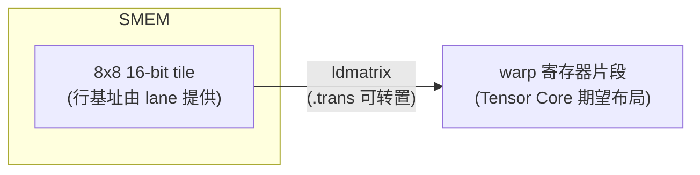
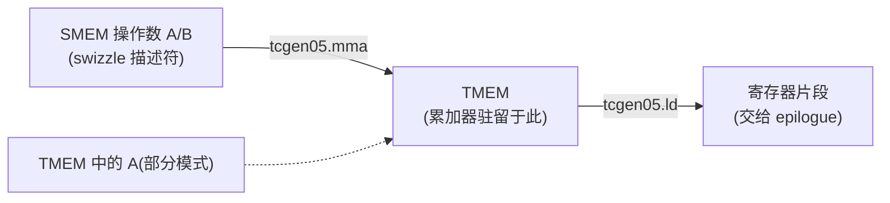
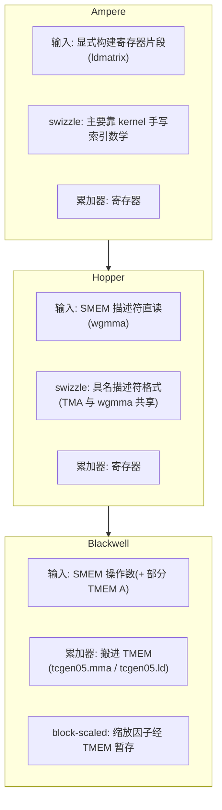

# 第 04 章 · 各代 GPU 的 Tensor Core 操作数布局

> 原文:[Tensor Core Operand Layouts Across GPU Generations](https://mlc.ai/modern-gpu-programming-for-mlsys/chapter_layout_generations/index.html)

> **本章要点(TL;DR)**
>
> - 从 Ampere 到 Hopper 再到 Blackwell,Tensor Core 干的活始终是同一件:`D = A·B + C`(矩阵乘累加 / MMA)。真正在变的,是**操作数怎么喂进 Tensor Core、支持哪些 tile 形状和数据类型、以及累加器(accumulator)落在哪里**。
> - **Ampere**:操作数是分布在 warp 32 个 lane 上的**寄存器片段(register fragment)**。用 `ldmatrix` 把共享内存(SMEM)tile 搬进寄存器,`mma.sync` 在寄存器之间计算,累加器全程驻留在寄存器里。
> - **Hopper**:`wgmma` 可以通过**矩阵描述符(matrix descriptor)直接从 SMEM 读操作数**,描述符里写明硬件期望的 swizzle 格式。但累加器**仍然在寄存器里**。
> - **Blackwell**:输入侧保留 SMEM 操作数路径,但把累加器**搬进 TMEM(Tensor Memory)**;block-scaled MMA 的缩放因子(scale factor)也要经 TMEM 暂存。
> - 两条贯穿所有世代的内存约束从未消失:**全局内存合并访问(coalescing)** 和**共享内存 bank 冲突(bank conflict)**。布局不是 Tensor Core kernel 的"装饰",它本身就是指令接口的一部分——任何一环对不上,硬件照样运行,只会读错字节或读得慢。

> **前置知识**:读这一章前,最好先懂第 3 章的布局记号(就是 `S[(8,4):(...)]` 那套写法),以及这几个词:warp(一个 warp = 32 个线程的小班)、lane(warp 里每个线程的编号,0–31)、寄存器片段(register fragment,一块 tile 被拆散摊在各个 lane 的寄存器里)、MMA(矩阵乘累加,`D = A·B + C`)、TMEM(Blackwell 新增的张量内存)。没把握的话,先翻一下 [第 0 章 · 极简入门](./ch00_gpu_ml_primer.md),以及第 3 章《数据布局》。本章会默认你已经认识这些词。

---

## 引子:为什么"逻辑公式没变"还会算错

你远远地看 Tensor Core(GPU 里专门做矩阵乘法的硬件单元),会觉得它特别稳:喂进去 A、B 两块 tile(大矩阵切出来的小方块),带上累加器 C(存放累加结果的那块数据),吐出来一个 D。这个样子打 Volta 那会儿就没变过。可你凑近一看就会发现,**这个运算周围的种种细节,其实一直在变**。

这一变,就给我们惹出两个很实在的麻烦。

1. **同一个 kernel,在这一代上飞快,换一代可能就拖泥带水了。** 为什么?因为数据进出 Tensor Core 走的路换了。
2. **布局要是摆错了,kernel 干脆给你算出个错答案。** 注意,哪怕你写的逻辑明明白白还是 `D = A·B + C`,结果照样能错。

这是为什么?说白了,**Tensor Core 根本不认什么"抽象矩阵",它认的是按某个固定硬件布局摆好的操作数**。在它眼里,第 0 个元素天经地义就该躺在某个 lane 的某个寄存器槽里,第 1 个该在另一个位置,后面以此类推。你的数据只要没按它想要的样子摆,它就会照样去乘,只不过把"压根不该相乘的两个元素"给乘到一块儿去了。

所以这一章,我们就顺着这根「布局契约 / layout contract」的线,把三代硬件挨个走一遍。描述契约要用到的那套布局记号,出自《数据布局》那一章;Blackwell 的 TMEM 细节比较多,单独搁在《Special Memory: TMEM》一章里讲。

---

## 一、两条从未离场的约束

其实早在 Tensor Core 出现之前,就有两条最朴素的内存约束在悄悄左右着 GPU kernel 的布局。它们不挑对象,对**哪个** kernel 都管用,哪怕这个 kernel 跟 Tensor Core 八竿子打不着。我们先把这两条掰扯清楚,后面 Tensor Core 那套故事才好接得上。

### 1. 全局内存合并访问 / global memory coalescing

先建立个直觉。一个 warp(32 个线程的小班)里有 32 个 lane(每个线程的编号),它们会同时伸手去读全局内存(GMEM,显存,GPU 上最大也最慢的那层内存)。这时内存系统最乐意看到的,是这 32 个地址挨得近近的,凑在**少数几个连续、对齐的内存段**里。

- 地址又连续又对齐 → 一次、顶多几次内存事务就全搬回来了。
- 地址东一个西一个 → 同样这点数据,硬要拆成一大堆内存事务才搬得完,带宽和时间双双浪费。

### 2. 共享内存 bank 冲突 / shared memory bank conflict

共享内存(SMEM,一个 block 内线程共享的高速片上内存)被切成 **32 个 bank**(存储体,可同时独立访问的小仓库)。麻烦就出在这儿:一个 warp 里好几个 lane 去读的地址**各不相同,却偏偏都落在同一个 bank** 上,这时硬件没法一口气服务它们,只能让它们**排着队一个一个来**,也就是串行化。

> **注意** 一个看着特别老实、人畜无害的"扁平共享内存数组",也可能因为 bank 怎么映射而慢得离谱。慢,慢的不是数据本身,而是物理地址到 bank 的那套映射关系。

### 解药:swizzle / 地址混洗

那共享内存这边怎么救?常用的招数叫 **swizzle / 地址混洗**(故意打乱数据在内存里的物理摆放,把访问摊开到不同 bank)。思路其实很简单:逻辑 tile 我们一个字节都不挪,只是给**物理地址的映射偷偷加一道排列**,把访问横着摊到好几个 bank 上,别再一窝蜂全挤一个 bank。


*图:swizzle 只改物理摆放,不改逻辑坐标。*

### Tensor Core 额外加的第三条约束

Tensor Core kernel 在上面两条之上,还要**再背一条**:操作数得摆成 **Tensor Core 指令自己想要的那个布局**。本章接下来的主线,就是看这"第三条约束"怎么从 Ampere 一路演变到 Hopper、再到 Blackwell。

> **关键** 一句话先记住:前两条(合并访问、bank 冲突)三代都跑不掉;真正在变的是第三条,以及"布局这件脏活到底归谁干"——是 kernel 自己一行行写出来,还是直接甩给硬件描述符去管。

---

## 二、Ampere:跨 warp lane 的寄存器片段

Ampere 这代 GPU 上,挑大梁的 Tensor Core 指令是 warp 级的 `mma.sync.aligned.m16n8k*` 这一家子。想搞懂这一代,你只要盯死一个问题:**这条指令到底在哪儿读、又往哪儿写?答案就俩字——寄存器。**

A、B,连同 C/D 累加器,**统统是摊在 warp 那 32 个 lane 上的 per-thread 寄存器片段**(寄存器 / register 是每个线程私有、速度最快的那点存储)。共享内存在这里说白了就是个中转站。换句话说,MMA 还没开跑,操作数 tile 就得先从 SMEM 搬进寄存器,而且得严丝合缝地摆成指令要的那个片段布局。

### Ampere 的数据通路

| 步骤 | 数据通路 | 说明 |
| --- | --- | --- |
| 1 | `SMEM ──ldmatrix──▶ registers` | 把 tile 搬进片段 |
| 2 | `regs ──mma.sync──▶ registers` | 寄存器到寄存器计算 |
| 3 | `regs ──普通 store──▶ SMEM` | 累加器写回 |


*图:Ampere 的 Tensor Core 通路,输入靠 `ldmatrix`,输出靠普通 store。*

Ampere 布局这套故事,大半都能从这条通路里顺出来:**kernel 得先把 tile 用一种"方便高效加载"的姿势写进 SMEM,然后靠 `ldmatrix` 把它捏成 `mma.sync` 想吃的那种寄存器片段。**

---

### 2.1 Ampere Tensor Core 到底期望什么

Ampere Tensor Core 读的那种寄存器片段,是拿 **8×8 子 tile** 当最小积木一块块拼出来的。这些 8×8 的小单元,就是 `ldmatrix` 加载、MMA 吃进去的基本单位。

我们拿个具体例子上手:`mma.m16n8k16`,输入是 fp16/bf16,累加用 fp32。它的累加器 tile 是 **16×8**,会按一个**雷打不动的固定模式**摊到 32 个 lane 上。别急,这个模式我们一步步拆。

先看 C/D 累加器。lane `l` 手里攥着的**行**是: 

```text
l / 4
l / 4 + 8
```

它攥着的**列**是:

```text
2 * (l % 4)
2 * (l % 4) + 1
```

公式你别背,记住结论就够了:**每个 lane 手里都攥着 4 个 fp32 累加值。** 这 4 个值,来自两行——上下两个"8 行半区"各贡献一行——每行又取相邻的两列。还有个特好记的规律:**连着的 4 个 lane,正好把某一行的全部 8 列凑齐。**

下面这张表,把 16×8 累加器到底怎么分给各个 lane 摆了出来(每格写的是它归哪个 lane)。就拿 **lane 0–3 这一组**说:它们的 `l/4 = 0`,所以管的是**第 0 行**(再加上第二个寄存器对应的**第 8 行**):

| 行 | 列0,列1 | 列2,列3 | 列4,列5 | 列6,列7 | 备注 |
| --- | --- | --- | --- | --- | --- |
| 行 0 | L0 | L1 | L2 | L3 | 行 = l/4,lane 0–3 占第 0 行 |
| 行 1 | L4 | L5 | L6 | L7 | lane 4–7 占第 1 行 |
| … | … | … | … | … | 每 4 个 lane 覆盖一行 |
| 行 7 | L28 | L29 | L30 | L31 | lane 28–31 占第 7 行 |
| 行 8 | L0 | L1 | L2 | L3 | 行 = l/4 + 8,同一 lane 的第二个寄存器 |
| … | … | … | … | … | |
| 行 15 | L28 | L29 | L30 | L31 | |

(每格里的那个 lane,同时握着这一格对应的两列;比如行 0 的"列0,列1"格里写着 L0,意思就是 lane 0 握着第 0 行的第 0、1 两列。)

*说明:lane 0 同时持有 (行0,列0)、(行0,列1)、(行8,列0)、(行8,列1) 四个值;lane 1 持有列 2/3;以此类推。每个 lane 拿 4 个 fp32 值,连续 4 个 lane 刚好拼出某行的 8 列;32 个 lane 覆盖上半区(行 0–7)与下半区(行 8–15)。*

A 和 B 的摆法跟累加器大同小异,只是各有各的侧重:

- **A 操作数**:M 这一侧的行怎么切,跟上面一模一样;K 维度则沿着 `l % 4` 和 lane 手里那几个寄存器铺开。对 fp16/bf16 来说,**一个 32-bit 寄存器里塞 2 个 K 值**。
- **B 操作数**:K 的摆法得跟 A 对上,然后把 N 这一侧沿着 lane 组和寄存器铺开。

> **关键** 具体数字会随指令形状、数据类型变来变去,但有条原则万变不离其宗:**Tensor Core 要的就是一个特定的 per-lane 寄存器片段。值只要没待在对的寄存器、没排成对的模式,指令就会把不该乘的元素乘到一块儿。**

用布局记号写出来,m8n8 片段长这样(带上"命过名的 lane 轴"):

```text
S[(8, 4, 2) : (4@laneid, 1@laneid, 1@m)]
```

这堆符号别被它唬住,一项一项翻成人话就清楚了:

- 两个 `@laneid` 项凑一块儿,讲的是**行、列的碎片怎么撒到各个 lane 上**;
- 最后那个 `@m` 项,讲的是**在某一个 lane 内部,值该塞进哪个寄存器槽**。

---

### 2.2 `ldmatrix`:从 SMEM 到寄存器片段的桥

`ldmatrix` 要解决的事儿很明确:**怎么把数据从共享内存里,变成 Tensor Core 想要的那个寄存器片段?** 它就是架在这俩中间的那座桥。它是一条 **warp 协作式加载**——整组 lane 一起上,一条指令就能把一个、或者好几个 8×8 的 16-bit 矩阵,从 SMEM 搬进 `mma.sync` 想要的那种分布式寄存器布局。

指令长这样(后面还能选挂一个 `.trans` 限定符):

```ptx
ldmatrix.sync.aligned.m8n8.x1.shared.b16   // 加载 1 个 8x8 矩阵
ldmatrix.sync.aligned.m8n8.x2.shared.b16   // 加载 2 个
ldmatrix.sync.aligned.m8n8.x4.shared.b16   // 加载 4 个
```

这里头有个关键约定:**每一行的基地址,是由某个 lane 负责给出的**。具体说,第 `m` 个矩阵的第 `r` 行,它的基地址来自 **lane `m*8 + r`**。这么一算就是:

| 形态 | 加载矩阵数 | 用到的 lane(提供行地址) |
| --- | --- | --- |
| `.x1` | 1 | lane 0–7 |
| `.x2` | 2 | lane 0–15 |
| `.x4` | 4 | lane 0–31 |

加载完,结果**直接就落进 MMA 片段**里了。在最基础的 8×8 情形下,lane `l` 拿到手的,正好就是 Tensor Core 指望它持有的那一对行/列。

> **为什么非它不可** 反过来想一下:你要是不用 `ldmatrix`,改拿一堆普通的 per-lane `ld.shared` 去凑,那就得**自己一字不差地把那套散射模式手工拼出来**——又烦又特别容易出错。`ldmatrix` 的好处,就是把"共享内存到片段"这套重排,压成**一条 warp 协作指令**一把搞定。

那 `.trans` 是干啥用的?它会在加载的时候**捎带手把每个 8×8 矩阵转个置**。什么时候用得上?就是当操作数在 SMEM 里存的方向,跟 MMA 指令想要的方向正好拧着的时候,靠它来掰正。



*图(等价于原书 ldstmatrix.svg):`ldmatrix` 把 8×8 SMEM tile 装进 warp 寄存器片段;Ampere 上反方向只能用普通 store,专用的 `stmatrix` 要到 Hopper 才出现。*

---

### 2.3 把 Ampere 片段写回去

`mma.sync` 算完之后,累加器**还是一个寄存器片段**。收尾阶段(epilogue,矩阵乘算完后做缩放、写回等收尾工作的那一段)要干的,就是把它从片段里捞出来。

> **注意** 这儿有个坑:Ampere 上**压根没有 `ldmatrix` 的专用反向指令**。所以 kernel 只能拿普通的 per-thread store 凑合,有时还得搭上 warp shuffle 或者局部重排,先把片段理顺了,再写进 SMEM/GMEM,凑成一个有用的布局。

这套模型,好处是够简单,代价是把**一大摊子布局脏活全甩给了 kernel**:输入侧用 `ldmatrix` 造片段,中间计算指令读写寄存器片段,输出侧又靠普通 store 把片段一点点写出去。

---

### 2.4 Ampere 上的 swizzle

Ampere kernel **天生就甩不掉**共享内存 swizzle。为什么?一句话就能讲明白:**同一块 SMEM tile,写进去是一种访问模式,读出来又是另一种访问模式。** 这两种模式一打架,bank 冲突就找上门了。

来看个典型场景。从全局内存按行往 tile 里灌数据,行主序(row-major)让这个**写**既能合并、又对 bank 友好,看着挺美。可坏就坏在读这一步:`ldmatrix` 读这块 tile 的时候,走的可能是**沿着列**,或者**横跨好几个 8×8 子 tile**。在朴素行主序下,这些读会一股脑全撞进同一个 bank。

**给你算笔账就懂了** —— 一块 `(8, 64)` 的 float16 tile,它一行有多大:

```text
64 * 2 字节 = 128 字节
```

128 字节,恰好就是**一整条共享内存 bank line**。坏就坏在这儿:沿着某个固定列往下走,每跨一行就往前蹦 128 字节,**bank 索引绕一圈又绕回原点**。结果呢,8 行全塌进同一个 bank,变成 **8 路冲突**。

> **关键** 你大概会想:"那我改成列主序不就完了?"——没那么便宜。改列主序通常只是把冲突挪了个地方:列式读是好了,可行式写又变差了。说白了就是按下葫芦浮起瓢。

真正管用的解法是 **XOR swizzle**:让物理列的位置,跟着行号一起动。最简单的一版长这样:

```text
physical_col = logical_col XOR row
```

妙就妙在:逻辑 tile 半个字节没动,光是把物理摆放重排了一下,就让**行式写**和 **Tensor Core 的读模式**俩一块儿躲开了 bank 冲突。下面这张表,把三种方案摆一块儿对比一下:

| 方案 | 行式写(从 GMEM 填充) | 列式读(给 ldmatrix) |
| --- | --- | --- |
| 朴素行主序 | 合并、bank 友好 ✅ | 塌到同一 bank,8 路冲突 ❌ |
| 朴素列主序 | 写变差 ❌ | 读变好 ✅ |
| **XOR swizzle** | 仍合并、bank 友好 ✅ | 散到多个 bank ✅ |

沿同一列 `col_c` 往下读时,两种方案落到的 bank 对比如下:

| 访问 | 朴素行主序(每行 +128B,bank 索引循环重复) | XOR swizzle(`physical_col = logical_col XOR row`) |
| --- | --- | --- |
| `row0 col_c` | `bank k` | `bank (k XOR 0)` |
| `row1 col_c` | `bank k`(冲突!) | `bank (k XOR 1)` |
| … | … | … |
| `row7 col_c` | `bank k`(8 路冲突) | 散开,无冲突 |

*图(等价于原书 swizzle_conflict.svg):朴素行主序下行写横铺、列读撞 bank;XOR swizzle 在保住合并行写的同时,把列读打散到各 bank。*

> **承上启下** 这里记住一点:在 Ampere 上,这套 swizzle 基本上全靠你**手写共享内存的索引计算**来实现。到了往后的世代,它会摇身一变,变成硬件引擎直接读的**描述符格式**里的一部分。这正是接下来 Hopper 最值得看的地方。

---

## 三、Hopper:`wgmma`、共享内存描述符与 swizzle 格式

Hopper 这代,动刀子动的是 Tensor Core 通路的**输入侧**。它不再死磕"每个操作数都得先用 `ldmatrix` 塞进寄存器",而是让 `wgmma` **直接从共享内存里读操作数**。

- **B 操作数**:从一个 **SMEM 矩阵描述符**读。
- **A 操作数**:既能从 SMEM 描述符读,也能从寄存器读——这就对应 `.ss` 和 `.rs` 两种形态。

> **注意** 可别误会,这只是把"SMEM 来源操作数"那个显式的 `ldmatrix` 步骤给省了,**布局要求一条没少**。Tensor Core 照旧要求操作数按精确的 SMEM 格式摆好。真正变了的是说明的方式:**现在这个格式是通过矩阵描述符,直接说给硬件听的**,不再埋在 kernel 手写的那堆索引计算里。

---

### 3.1 Hopper Tensor Core 期望什么

先讲讲这个描述符是干啥的。Hopper 的 **SMEM 矩阵描述符**,你就把它当成一块 SMEM 矩阵 tile 的一份小巧说明书。它的活儿,就是告诉 `wgmma`:逻辑操作数坐标该怎么换算成实际的 SMEM 地址。说明书里写着这么几个字段:

| 字段 | 作用 |
| --- | --- |
| start address(起始地址) | tile 在 SMEM 的基址 |
| leading dimension offset(主维偏移) | 沿主维前进的步长 |
| stride dimension offset(步维偏移) | 沿另一维前进的步长 |
| swizzle mode(swizzle 模式) | 选定 atom 形状 + atom 内的 XOR 排列 |
| base offset(基偏移) | 附加偏移 |

> **关键** 同样这几个字段,具体该怎么读,得看操作数的 **major mode / 主序**。对 **K 主序**的 tile,一个步长是沿 K 走、另一个沿 M 走;换成 **MN 主序**的 tile,这俩角色正好掉个个儿。

上面那个 **swizzle 模式**字段,取值就是下面这几种"SMEM 描述符格式"里挑一个:

```text
SWIZZLE_NONE
SWIZZLE_32B
SWIZZLE_64B
SWIZZLE_128B
```

swizzle 模式一选,就**两件事**当场拍板:

1. 描述符用多大的 **atom 形状(atom shape)**;
2. 在每个 atom 内部,到底施加哪一种 **XOR 排列**。

举个例子:**128 字节 swizzle 模式**会把操作数看成一张网格,格子是 **8 行 × 128 字节的 atom**,swizzle 就在每个 atom 内部各管各的。


*图(等价于原书 smem_descriptor.svg):描述符的 stride 选 atom,swizzle 选 atom 内的字节位置。*

### 3.2 数据是谁写进去的?TMA 与 wgmma 必须"对暗号"

描述符再聪明,字节也总得有人先按规矩码好。这活儿一般交给 **TMA / Tensor Memory Accelerator**(Hopper 起的硬件搬运引擎,专门成块地把数据从 GMEM 搬进 SMEM),由它来把这块 SMEM tile 填上。这里有条要命的规矩:**TMA 用的 swizzle 格式,必须跟后面 `wgmma` 描述符用的一模一样。** 这就跟对暗号一个道理:

- TMA 写进去的要是 128 字节的 swizzled tile,那 `wgmma` 描述符也得按 128 字节的 swizzled tile 来读。
- 一旦**描述符和数据对不上**,Tensor Core 读到的就是一堆被打乱的操作数。


*图:TMA 写入与 `wgmma` 读取必须命名同一种 swizzle 格式,否则读到乱码。*

> **这正是 Hopper 比 Ampere 最关键的那一步转变。** swizzle 不再窝在某段手写的 SMEM 索引计算里了。Hopper 把它提拔成了**一等公民——一种有名有姓的描述符格式**:写 tile 的 TMA load 和读 tile 的 `wgmma`,**引用的是同一份格式**,自然也就对得上暗号。

---

### 3.3 Hopper 的输出仍用寄存器

Hopper 虽然把输入路径翻新了,可有一样东西没动:**累加器还是住在寄存器里。**

`wgmma` 把累加器写进 per-thread 寄存器片段。片段多大、占几个寄存器,看指令形状——比如 `m64nNk16`,**N 越大,累加器吃掉的寄存器就越多**。可骨子里跟 Ampere 没两样:**收尾阶段到手的,还是一个寄存器片段。**

所以 Hopper 是个**混血儿**——输入是新的,输出是旧的:

| 阶段 | Ampere | **Hopper** | 变化 |
| --- | --- | --- | --- |
| 输入操作数 | 寄存器片段(经 ldmatrix) | **SMEM 描述符直读**(swizzle 由硬件描述) | ✅ 改了 |
| 累加器/输出 | 寄存器片段 | 寄存器片段 | ❌ 没变 |

换句话说,到了 Hopper 这代,**输出累加器仍然是个寄存器布局的活儿**。这个输出侧的故事,得等到 Blackwell 才会被重写。

---

## 四、Blackwell:`tcgen05` 与 TMEM

数据操作数这一边,Blackwell **基本照搬了 Hopper 那套 SMEM 描述符的路子**:A、B 还是在 SMEM 里按 Tensor Core 想要的布局摆好;某些模式下,A 操作数(operand,送进 Tensor Core 参与运算的一块数据)甚至能直接从 **TMEM**(Tensor Memory,Blackwell 新增、专给 Tensor Core 暂存累加器的一块片上内存)读。

**真正翻天覆地的变化,落在累加器身上。** 搁以前,累加器是个"成天泡在寄存器里"的片段;Blackwell 的 `tcgen05.mma` 干脆把它改成写进 **Tensor Memory / TMEM**:

- **计算阶段**:累加器**就待在 TMEM 里**。
- **收尾阶段**:再用 `tcgen05.ld` 把它从 TMEM 装回寄存器。



*图:Blackwell 把累加器的"家"从寄存器搬到了 TMEM。*

这么一搬,等于把**输出布局这个难题,从寄存器挪到了 TMEM**。于是 kernel 现在多了几桩活儿要干:

1. **分配 TMEM**;
2. 挑对 **TMEM 布局**;
3. **等 MMA 算完**;
4. 走对应的 `tcgen05.ld` 路径,把累加器片段取回来,交给收尾阶段。

> **注意** 至于 `cta_group::1` 和 `cta_group::2` 怎么把累加器拆到一个或两个 CTA(cooperative thread array,也就是一个线程 block)上,那是《Tensor Cores: tcgen05》那章的事,这里就不展开了。本章里**跟前几代差得最远**的,其实是下面要讲的 block-scaled 缩放因子布局。

---

### 4.1 TMEM 里的缩放因子布局(scale factor layout)

先说说这个缩放因子是从哪冒出来的。像 **mxfp8**、**nvfp4** 这类 block-scaled MMA 模式,会平白多出一类**缩放因子操作数**。所以这时候除了 A、B,MMA 还得再读两块东西:

```text
SFA(M, SFK)
SFB(N, SFK)
```

这里的 `SFK`,说的是 K 方向上**缩放块(scale block)一共有几个**。

> **关键** 一句话先记住:数据操作数 A、B 住 **SMEM**,缩放因子住 **TMEM**。住的地方不一样,搬运的路线当然也跟着不一样。

那为什么搬运得分两步?因为 **TMA 只管从 GMEM 搬到 SMEM,没本事直接往 TMEM 里写**。所以缩放因子得绕个弯,分两步走:

| 步骤 | 数据通路 | 说明 |
| --- | --- | --- |
| 第一步 | `GMEM ──TMA──▶ SMEM` | TMA 从 GMEM 搬到 SMEM |
| 第二步 | `SMEM ──tcgen05.cp──▶ TMEM` | 再从 SMEM 拷进 TMEM |

只有等这次拷贝干完,缩放因子才算真到了位——也就是落进了 `tcgen05.mma` 指望读到它们的那块内存空间。


*图:缩放因子的两步搬运路径(数据 A/B 是 GMEM→SMEM 一步直达,缩放因子要多绕一步进 TMEM)。*

---

### 4.2 缩放因子的 TMEM 坐标:warpx4 广播

缩放因子在 TMEM 里怎么摆,用的是 TMEM 自己那套硬件坐标 **Lane** 和 **Col**(在 TIRx 布局记号里写成 `TLane` 和 `TCol`)。

它的核心套路一句话就能说清:**把一份缩放数据先压实成一小份,再复制四份铺满整个空间。** 说细点,一个 **128 行的缩放向量**先被**压实进一个 32-lane 组**,然后**原封不动复制到 TMEM 的四个 32-lane 窗口**里。写成布局记号就是:

```text
S[(32, sf_per_mma) : (1@TLane, 1@TCol)] + R[4 : 32@TLane]
```

符号不用抠那么细,对着这两项看就行:

- **分片项(shard)**:管的是摆好那份基础的 32 行组——`TLane = r`,`TCol = s`;
- **复制项(replica)**:管的是在 lane 偏移 0、32、64、96 这四个位置各放一份副本——`TLane = r + 32*q`(`q` 取 0、1、2、3),`TCol = s` 不动。

这套就叫 **warpx4 广播模式**:同一份压实的缩放因子组,被复制到各处,这样整个 128-lane 的 TMEM 空间里,它哪儿都能看见。

同一个 32 行缩放组被广播 4 份,铺满 128-lane 的 TMEM 空间:

| TMEM TLane 窗口 | 0 … 31 | 32 … 63 | 64 … 95 | 96 … 127 |
| --- | --- | --- | --- | --- |
| 内容 | 基组 | 副本 | 副本 | 副本 |
| 副本编号 | q=0 | q=1 | q=2 | q=3 |

*图:warpx4 把压实的 32-lane 缩放组,复制到四个 32-lane 窗口,覆盖 128-lane TMEM 空间。*

---

### 4.3 `TCol` 单元内部的字节打包(scale_vec 模式)

广播管的是"放到哪些 lane",可每个 32-bit 的 `TCol` 单元**里头**,还有一层更细的讲究——**这 4 个字节里到底装了几个缩放值**。这就看 `scale_vec` 模式怎么定了:

| 模式 | 4 字节单元内的打包方式 |
| --- | --- |
| **1X** | 一个缩放值,广播填满整个 32-bit 单元 |
| **2X** | 打包两个缩放值,每个各复制一份 |
| **4X** | 打包四个 K-block 缩放值 |

4 字节(32-bit)`TCol` 单元内部,三种模式的字节摆放:

| 模式 | 字节 0 | 字节 1 | 字节 2 | 字节 3 | 含义 |
| --- | --- | --- | --- | --- | --- |
| 1X | S0 | S0 | S0 | S0 | 一个值,广播 |
| 2X | S0 | S0 | S1 | S1 | 两个值,各复制 |
| 4X | S0 | S1 | S2 | S3 | 四个 K-block 值 |

*图(等价于原书 sf_scale_vec.svg):scale_vec 字节打包的三种模式。*

> **注意** 这种字节打包,在 Ampere 和 Hopper 上**根本找不到对应物**。道理也简单:那两代压根就没有给 `tcgen05` block-scaled MMA 用的那种 TMEM 缩放因子操作数,既然东西都没有,自然也谈不上怎么打包。

---

### 4.4 `cta_group::2` 下缩放因子跟着数据走

到了 `cta_group::2`,你记住一条原则就够了:**缩放因子永远跟着它要缩放的那块数据走。** 拆开看就是:

- **SFA** 缩放的是 A。A 既然按 M 维在两个 CTA 之间切开,那 SFA 也**跟着按 M 切**,好对上各个 CTA 手里的那些 A 行。
- **SFB** 缩放的是 B。B 既然被参与计算的两个 CTA 半区共用,那 SFB 就**多播(multicast,一份数据同时发给多个目标)给这两个 CTA**。

(想看更细的,翻《Tensor Cores: tcgen05》。)

---

## 五、一个反复出现的片段:m8n8

三代一路讲下来,周围的内存路径换了一茬又一茬,可有个老面孔始终赖着没走:**m8n8 风格的寄存器片段**。只不过它每一代出场的地方不太一样。

| 世代 | m8n8 片段扮演的角色 |
| --- | --- |
| **Ampere** | `ldmatrix` 构建它,好让 `mma.sync` 读取(输入侧) |
| **Hopper** | `wgmma` 把累加器**写成**寄存器片段,交给 epilogue(输出侧) |
| **Blackwell** | 计算阶段累加器在 TMEM;但 `tcgen05.ld` 在 epilogue 处理与存储之前,把它**装回寄存器片段** |

> **关键** 片段从来没消失过,**变的只是它露脸的地方**。早些的世代里,累加器**整个计算阶段**都泡在片段里;到了 Blackwell,它基本只在 **TMEM 和收尾阶段交接的那个当口**才冒一下头。

---

## 六、贯穿三代的主线(The Throughline)



把三代横向对比成一张表:

| 维度 | Ampere | Hopper | Blackwell |
| --- | --- | --- | --- |
| 主力 MMA 指令 | `mma.sync.aligned.m16n8k*` | `wgmma`(`.ss`/`.rs`) | `tcgen05.mma` |
| 输入操作数来源 | 寄存器片段(经 `ldmatrix`) | SMEM 描述符直读 | SMEM 描述符(+ 部分 TMEM A) |
| swizzle 谁负责 | kernel 手写索引数学 | 硬件描述符格式(TMA + wgmma 共享) | 硬件描述符格式 |
| 累加器位置 | 寄存器 | 寄存器 | **TMEM** |
| 输出取回 | 普通 store | epilogue 读寄存器片段 | `tcgen05.ld` 从 TMEM 取回 |
| 缩放因子(block-scaled) | 无 | 无 | 经 `tcgen05.cp` 暂存到 TMEM |

> **核心论断** 千万别以为有了描述符就高枕无忧了。描述符**根本没替你把布局这活儿免掉,它只是把契约写清楚了而已**。kernel 该兜的底还得自己兜:数据搬运路径、内存布局、Tensor Core 指令,这三样必须**严丝合缝地对齐**。写 swizzled SMEM tile 的那个 TMA 描述符、读这块 tile 的那个 MMA 描述符、还有挂在 buffer 上的那个布局——**它们说的得是同一种物理摆放,一个字都不能差**。
>
> 而且最要命的一点是:就算有一环没对上,硬件也**照跑不误**,一声不吭,不报错。它就默默地给你读错字节,或者慢吞吞地读。正因为这样,**布局压根不是 Tensor Core kernel 上面可有可无的装饰,它本身就是指令接口(instruction interface)的一部分。**

---

## 小结

- Tensor Core 的"高层语义"三代都没动(还是 `D = A·B + C`),可**操作数进出走哪条道、累加器最后落在哪儿**,每代都在变。而这恰恰决定了你的 kernel 算得对不对、跑得快不快。
- **Ampere**:一切围着**寄存器片段**打转。`ldmatrix` 造片段、`mma.sync` 算、普通 store 写回;swizzle 靠手写索引计算(典型就是 `physical_col = logical_col XOR row`)来躲 bank 冲突。
- **Hopper**:`wgmma` 改成拿 **SMEM 矩阵描述符**直接读操作数,swizzle 也升级成了**有名有姓的描述符格式**(TMA 写和 wgmma 读必须对上暗号);不过累加器**还窝在寄存器里**。
- **Blackwell**:输入侧接着用 SMEM 描述符,但**累加器搬进了 TMEM**(`tcgen05.mma` 写、`tcgen05.ld` 取回);block-scaled MMA 的缩放因子得经 `tcgen05.cp` 分两步挪进 TMEM,还用上了 warpx4 广播 + scale_vec 字节打包这套独门布局。
- 两条老约束——**全局内存合并**和**共享内存 bank 冲突**——从头到尾都在。三代怎么演变,说到底就是**把"第三条约束(Tensor Core 操作数布局)"从 kernel 的手工活,一点点交给硬件描述符契约去管**。描述符让契约更清楚了,可一分钱没替你出:**布局,自始至终都是指令接口的一部分。**

---

## 延伸阅读

- 原文(英文):[Tensor Core Operand Layouts Across GPU Generations](https://mlc.ai/modern-gpu-programming-for-mlsys/chapter_layout_generations/index.html)
- 相关章节(本书):《数据布局(Data Layout)》——本章布局记号的来源;《Special Memory: TMEM》——Blackwell TMEM 细节;《Tensor Cores: tcgen05》——`cta_group::1/2` 累加器拆分与缩放因子多播细节。

---

## 术语对照

| 中文 | English |
| --- | --- |
| 矩阵乘累加 | MMA / matrix-multiply-accumulate |
| 寄存器片段 | register fragment |
| 线程束 / 通道 | warp / lane |
| 共享内存 | SMEM(shared memory) |
| 全局内存合并访问 | global memory coalescing |
| 共享内存 bank 冲突 | shared memory bank conflict |
| 地址混洗 | swizzle |
| 矩阵描述符 | matrix descriptor |
| 主序(K 主序 / MN 主序) | major mode(K-major / MN-major) |
| 张量内存 | TMEM(Tensor Memory) |
| 缩放因子(块缩放) | scale factor(block-scaled) |
| 收尾阶段 | epilogue |
| 协作线程阵列 | CTA(cooperative thread array) |
| 张量内存加速器 | TMA(Tensor Memory Accelerator) |
| 多播 | multicast |
