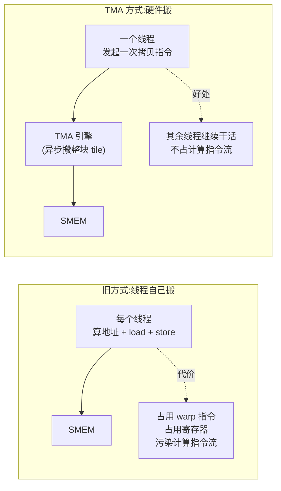
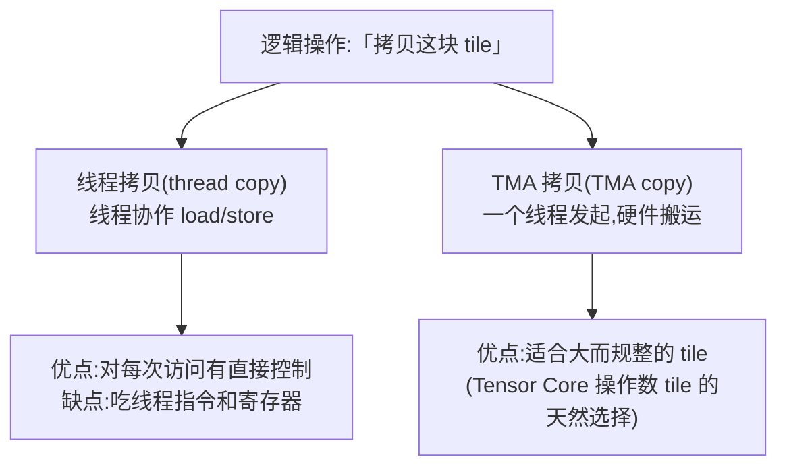
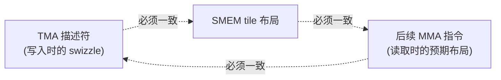
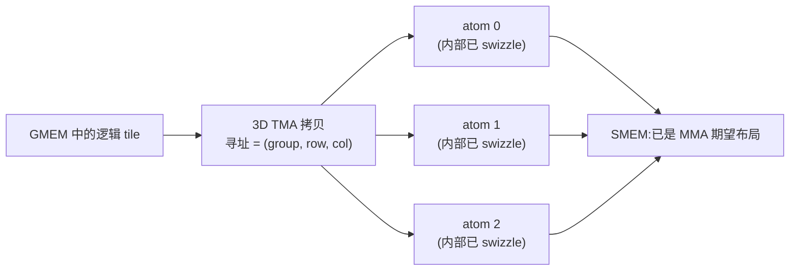
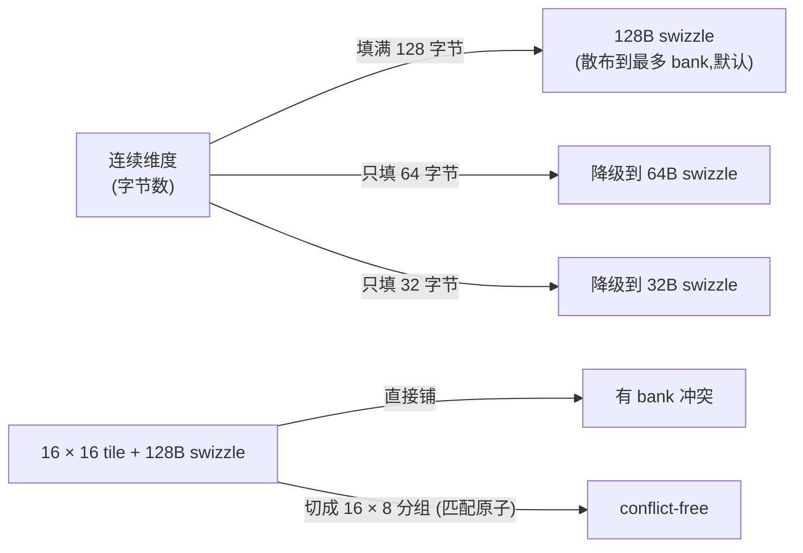
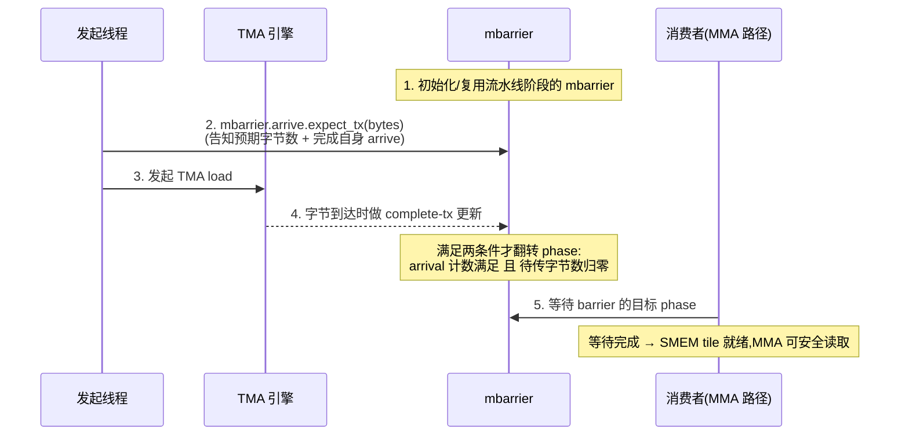
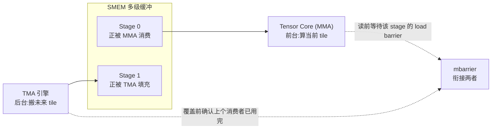

# 第 05 章 · 异步数据搬运:TMA

> 原文:[Async Data Movement: TMA](https://mlc.ai/modern-gpu-programming-for-mlsys/chapter_tma/index.html)

> **本章要点(TL;DR)**
> - **TMA(Tensor Memory Accelerator / 张量内存加速器)就是一个专门搬数据的硬件引擎**:你只要派「一个线程」喊一嗓子,引擎就在后台把一整块矩形 tile 在全局内存(GMEM)和共享内存(SMEM)之间搬好。搬的时候不挡道,整个 CTA 该干嘛干嘛。
> - **整件事靠一份「张量映射描述符(tensor-map descriptor)」说了算**:形状、步长、每个元素几个字节、tile 多大,还有最关键的 **swizzle(交织)模式**,全写在里头。
> - **加载(load)的时候,TMA 顺手就把 swizzle 做了**:字节往 SMEM 一落,就已经摆成 Tensor Core 爱吃的样子,省掉单独再重排一遍。前提是描述符、SMEM 布局、后面的 MMA 三家对布局得说好同一套规矩。
> - **怎么知道搬完了?加载靠 `mbarrier`(还会盯着字节数),存储(store)靠 commit group 加 wait group**——这俩管的是不同的「交接点」。
> - **TMA 真正的看家本领是流水线(pipelining)**:让引擎在后台先把「下一块 tile」搬进来,同时让 Tensor Core 在前台算「这一块 tile」,中间用 barrier 把两边对上。

> **前置知识**:读这一章前,最好先懂 GMEM/SMEM(显存与片上共享内存)、tile(把大矩阵切出来的小方块)、GEMM(通用矩阵乘)、还有 mbarrier(异步屏障)。没把握的话,先翻一下 [第 0 章 · 极简入门](./ch00_gpu_ml_primer.md),mbarrier 的细节可以看第 7 章。本章会默认你已经认识这些词。

---

## 0. 为什么需要 TMA:从「线程自己搬」说起

想搞懂 TMA,咱们先看看没它的时候活是怎么干的。

先问一句:一个 GEMM 或者注意力(attention)核函数,跑得快不快,到底卡在哪儿?卡在 **Tensor Core(GPU 里专门算矩阵乘的硬件单元,见第 0 章)有没有数据吃**。流水线一旦填满,这类核函数基本都是**计算受限(compute-bound)**的,也就是算力已经榨干了。可这有个前提——下一块操作数(operand,即参与矩阵乘的输入数据,如 A、B 矩阵)tile 得及时端上来。端晚了,Tensor Core 就只能干瞪眼空转。

**过去的做法**是让线程自己去搬 tile。每个线程算好地址,从 GMEM 发 load,再把值 store 到 SMEM。能用是能用,但暗里要付两笔账:

1. **指令预算白花了**:本该拿去算数的 warp(一个 warp = 32 个线程的小班,见第 0 章)指令,现在全耗在算地址、做拷贝这些「跑腿记账」上。
2. **把计算 warp 的指令流搅浑了**:这批 warp 本来一门心思该喂 Tensor Core,结果被迫掺进一大堆搬运指令。

> **关键**:这两点凑一块,问题就清楚了——「搬数据」和「做计算」在抢同一份硬件(指令发射、寄存器——线程私有的高速小存储,见第 0 章)。TMA 的招数很干脆:**把搬运整个外包给一个专职硬件引擎**,计算 warp 腾出手来,专心算就行。

下面这张图把两条路摆一块比一比:



> **注意**:原文这儿有个交互演示(*TMA copying a tile from global memory to shared memory*),你能切换 swizzle 模式,把鼠标停在源单元格上,看它最后落到 SMEM 的哪个位置。静态笔记没法还原这种交互,想直观感受就去翻原书;后面我会用 ASCII 和 Mermaid 图把要点画给你看。

---

## 1. 一个线程发起,硬件搬运整块 tile

### 1.1 发起线程做什么、不做什么

一次 TMA 拷贝,是从一个**发起线程(issuing thread)**开头的。但注意,这线程**不会**去一个个遍历 tile 里的元素。它干的活更像是「下单」——递给硬件一份「拷贝说明书」,真正搬运的力气活,全甩给 TMA 引擎。

这份「说明书」的主体,就是 **张量映射描述符(tensor-map descriptor)**。它写清了这么几件事:

| 描述内容 | 含义 |
| --- | --- |
| tensor shape | 全局张量的形状 |
| strides | 各维度步长(用于在 GMEM 中寻址) |
| element size | 单个元素的字节大小 |
| tile shape | 要读取的 tile 形状 |
| swizzle mode | 写入 SMEM 时采用的交织模式 |

光有描述符还不够。真要发起一次拷贝,还得现补上两个「运行时坐标」:

- 这回从全局张量的**哪儿**取 tile(也就是 tile 坐标 / tile coordinates)。
- 取来的 tile **放到 SMEM 的哪个地址**。

这么理解就顺了:描述符回答的是「这张量长啥样、怎么排的」,坐标回答的是「这一次到底搬哪块、搬哪去」。前者一锤定音、固定不变,后者每次都可能不一样。

指令一发出去,拷贝就**异步**跑起来了。发起线程接着往下走它的,CTA(一个线程块 block,即一组协作线程,见第 0 章)里其他线程也不用停下来等。这会儿搬运全归 TMA 引擎管了,不再是一串普普通通的 load/store 在那儿循环。

### 1.2 同一个逻辑操作,两条实现路径

「把这块 tile 拷过去」这件事,核函数现在有两种写法:



这两条路,**同步的规矩不一样,跑出来的性能也不一样**。到底走哪条,这件事本身就是一个**分发(dispatch)决策**。原文把整件事拆成三个互不打架的概念,这么一拆就清楚多了:

- **布局(layout)**:核函数想要内存排成啥样。
- **作用域(scope)**:哪些线程、哪些 CTA 来掺和这次拷贝。
- **分发(dispatch)**:这次拷贝用普通线程代码做,还是丢给 TMA 做。

---

## 2. Swizzle 布局:不只是「搬到」,还要「摆对」

### 2.1 为什么搬到位还不够

把 tile 搬进 SMEM,其实只算干完一半。为啥?因为 Tensor Core 不光要 SMEM 里装的是**对的值**,还要这些值**摆成对的样子**。摆得不对,读起来就慢——最常见的坑就是 SMEM bank 冲突(SMEM 被切成多个存储体即 bank,多个线程同时挤同一个 bank 就被迫排队,见第 0 章)。

这时候 **TMA swizzle(交织)** 就上场了。TMA 往 SMEM 写 tile 的同时,能顺手把 **SMEM 的地址模式重排(permute)一下**。逻辑上看,这 tile 还是规规矩矩一个矩形;可它在 SMEM 里到底落在哪些格子,早就被交织打散了。

> **关键**:swizzle 用哪种模式,本身就写在描述符里。描述符配好了,发起线程**根本不用自己动手 swizzle**——字节落进 SMEM 那一刻,引擎已经替你交织妥当了。

### 2.2 「一致约定」是硬性前提

swizzle 是省事,但有一条铁律不能破:**三家对布局得统一口径**。哪三家?看下图。



这条铁律有多硬?你想想:TMA 拿一种 swizzle 把数据写进去,MMA(矩阵乘累加,Tensor Core 执行的核心指令)却拿另一种 swizzle 去读。这时候硬件**才不报错,它就老老实实照你说的做**。结果呢?字节全摆错位,算出来的东西跟着错,而且一声不吭——半点提示都没有。

举个例子。假设核函数声明某个操作数 tile 按 **128 字节 swizzle 布局** 来存,那 TMA 描述符就得用对得上的 swizzle 模式,MMA 分发也得照着同一套 SMEM 排布去预期。这正是布局记号(layout notation)的价值——它可不只是个「记账的」:DSL 里写的布局,必须跟 TMA 描述符、跟 Tensor Core 指令用的硬件布局,严丝合缝对上。

> **换个角度想**:swizzle **不动逻辑 tile**。后面 MMA 吃的,还是同一个逻辑 A/B tile。swizzle 只管这 tile **怎么跨着 SMEM bank 在物理上摆**。一句话:它改的是「某个逻辑元素摆在物理哪个位置」,不是「这元素本身是啥」。

---

## 3. 3D TMA:在一次拷贝里同时完成「分块」和「swizzle」

### 3.1 问题:Tensor Core 想要的是「分块进 swizzle 原子」的布局

普通的 2D TMA 拷贝,搬的是一块**扁平的 2D tile**。可 Tensor Core 想要的 SMEM 布局往往没这么省心——它要 tile 被**一个个塞进 swizzle 原子(atom)**里。这里说的原子,就是《数据布局及其记号》那章讲过的 **8 × 128 字节原子**。

扁平 tile 跟「塞进原子」的布局对不上,咋办?TMA 的解法挺妙:**给描述符再加一个维度**。

### 3.2 3D TMA 的寻址方式:(group, row, col)

**3D TMA** 把 SMEM 这块地方当成一个三维盒子,用 `(group, row, col)` 来点位置:

- **group**:走到第几个原子(就是在一个个原子之间跨步)。
- **row / col**:定位**某个原子内部**的具体位置。

有了这三维,**一次 3D 拷贝**就能一口气把两件事都办了:

1. **分块(tile)**:把 tile 一个原子一个原子地铺开。
2. **swizzle**:在每个原子里头做交织。

最妙的是落地的结果:数据搬进 SMEM 的时候,**已经就是 MMA 想要的布局了**,不用再额外跑一趟分块或者 swizzle。



> **注意**:原文配了个交互演示 *a 3D TMA copy, addressed as (group, row, col), tiling into swizzled shared memory*。想直观体会一下这个寻址过程,去原书点点看。

### 3.3 swizzle 格式的选择:取决于 tile 能不能「填满」原子

那到底用哪种 swizzle **格式**呢?这事跟分块是绑死的。背后就两条道理:

- swizzle 越宽,越能把一列数据**摊到更多 bank** 上,读起来越不容易撞车。所以只要塞得下,**128 字节 swizzle 永远是默认首选**。
- 但是,**N 字节的原子,要求 tile 的「连续维度」得把它填满**。要是某个 tile 因为形状受限太瘦、填不满 128 字节,那 **128 字节 swizzle 就用不成了**,只能往下退,退到 64 字节,甚至 32 字节。

> **经验法则**:在 tile 能填满的前提下,挑**最大的**那个 swizzle。

原文举了个特别直观的例子:拿一个 **16 × 16 tile** 直接铺 128 字节 swizzle,会撞车;非得把它切成对得上原子的 **16 × 8 分组**,才能做到**无冲突(conflict-free)**。

下面用个简化的 ASCII 图,帮你建立「填满 vs 填不满」的直觉:



| swizzle 格式 | 适用场景 | bank 散布 |
| --- | --- | --- |
| 128 字节 | 连续维度能填满 128B(默认首选) | 最广 |
| 64 字节 | tile 偏小、填不满 128B 时降级 | 中等 |
| 32 字节 | tile 更小时进一步降级 | 较窄 |

---

## 4. 完成机制(一):加载用 `mbarrier`

### 4.1 为什么「发出指令」不等于「可以读」

别忘了,拷贝是异步的。这就意味着:**指令发出去,数据可不一定到位**。消费者**不能**一看 TMA 指令发出去了,就急吼吼跑去读 SMEM tile——得等引擎真把字节**写完了**,这 tile 才安全、才能读。

那怎么知道引擎写完没?对 TMA **加载**来说,报「干完了」这个信儿的,是 `mbarrier`(细节看《异步协调:mbarriers》那章)。

### 4.2 标准时序



### 4.3 关键 API:`mbarrier.arrive.expect_tx`

设置字节数,用的就是这么一条操作:

```ptx
mbarrier.arrive.expect_tx(bytes)
```

这一条指令,**一下子干了两件事**:

1. **记下这次预期要传多少字节**;
2. **顺带替发起线程在 barrier 上完成 arrive(到达)**。

> **关键**:可别误会,调了这条指令**并不等于 barrier 就完成了**。它还得等 TMA 引擎回话:「该到的字节都齐了」。
>
> barrier 的 **phase(相位)非得两个条件都凑齐才翻转**:
> 1. arrival 计数到位;
> 2. 待传字节数(pending byte count)清零。

接下来消费者就守在这个 barrier 上等。一等到目标 phase,就说明 SMEM tile 已经备好了,这时候 MMA 路径才能放心去读。

原文这儿还配了张同步流程图(`tma_sync_flow.png`),意思跟上面那张时序图一模一样:**生产者是 TMA 引擎,消费者是 MMA 路径(或者随便哪段要读 SMEM tile 的代码),barrier 就是横在它俩中间那个说一不二的交接点**。这跟别处异步「生产者-消费者」交接,用的是同一套 barrier 模型。

---

## 5. 完成机制(二):存储用 commit group + wait group

### 5.1 为什么 store 的完成机制不一样

TMA **存储**正好是倒过来:把数据从 SMEM 搬回 GMEM。它一样是异步的,可**报完成的那套机制换了**。为啥换?根子上是「交接点」变了——看下面这张对照表就懂了。

| | TMA 加载(load) | TMA 存储(store) |
| --- | --- | --- |
| 数据方向 | GMEM → SMEM | SMEM → GMEM |
| 典型场景 | 喂给同核函数内的消费者(MMA) | 把最终结果写出到 GMEM |
| 核函数关心什么 | SMEM tile 何时**就绪可读** | 何时可以**安全复用 SMEM 缓冲区** / 确认搬运排空 |
| 完成机制 | `mbarrier`(带字节计数) | commit group + wait group |

说白了就是俩边操心的东西不一样。加载是要把一个 SMEM tile **亮给后面的消费者看**,所以得靠 `mbarrier` 精确地通知一声。存储则是把最终数据写出去,**一般压根没有哪个核内消费者在等它**——核函数真正惦记的是另一码事:「啥时候能安全地把 SMEM 缓冲区拿回来重用,或者说这串存储到底啥时候算完」。

### 5.2 用法

用起来是这么个流程:核函数发出一个或者好几个 store,把它们**提交(commit)**成一组,过一会儿再来**等(wait)**这一组排空(drain)。等待一返回,在核函数看来这组 store 就全干完了,它们占的那块 SMEM 也就能放心拿回来重用了。

原文拿一段很精炼的对照,把这两套机制摆在一块总结:

```text
TMA load:  通过带字节计数追踪的 mbarrier 等待
TMA store: 通过 commit group 和 wait group 等待
```

> **理解**:这两套机制说到底干的是**同一件事,只不过交接点不一样**。加载是让一个 SMEM tile 对后面的消费者亮相;存储是确认往外的传输真的完事了——这样核函数才敢重用源头那块存储,或者拿「store 已经排空」这个事实接着往下走。

---

## 6. 为什么 TMA 对流水线(pipelining)至关重要

前面铺垫了这么多,TMA 真正大显身手的时刻,是它当上**流水线**里一环的时候。

核心思路一句话就够:**Tensor Core 正算着「当前 tile」,核函数就抢先把「下一块 tile」的加载发出去**。加载在后台闷头跑,计算在前台连轴转,等「下一块 tile」终于轮到被算了,barrier 就负责把这两条线接上。

一个典型的 GEMM 循环就翻来覆去用这套结构,它有个名字,叫多级缓冲(multi-stage buffering):



循环每往前走一步,各个 stage 的角色就轮一次班(rotate)。规矩就两条:

- **MMA 想读某个 stage 之前**,先等这个 stage 的 load barrier(确认数据齐了);
- **TMA 想覆盖某个 stage 之前**,先确认上一个消费者已经用完它了(别把人家还没读的数据给盖了)。

> **关键**:这也就讲明白了,为啥在 Blackwell、Hopper(NVIDIA 较新的两代 GPU 架构,Hopper 即 H100 那代,Blackwell 更新)风格的核函数里,**TMA 和 `mbarrier` 几乎总是成对出现**。TMA 给的是异步拷贝引擎,管搬;`mbarrier` 给的是**精确判断「字节啥时候就绪」**的本事,管通知。一个搬一个通知,缺哪个都转不起来。

---

## 小结

- **TMA 就是个硬件拷贝引擎**:一个线程喊一声、硬件异步把整块矩形 tile 搬好,把搬运彻底从计算 warp 的指令流里拎出去,Tensor Core 就不会被搬运拖后腿了。
- **张量映射描述符是核心那层抽象**:形状、步长、元素大小、tile 形状、swizzle 模式全装在里头;它把「一次拷贝」从「一长串 load/store 循环」拎成「一份说明书 + 喊一声发起」。
- **swizzle 在加载路上顺手就把布局重排了**:数据落进 SMEM 那一刻,已经摆成 MMA 想要的样子。但描述符、SMEM 布局、MMA 这三家必须对布局说好同一套规矩,不然硬件会「正确地」给你算出错的结果。
- **3D TMA `(group, row, col)`** 一次拷贝里就把「按原子分块」和「原子内 swizzle」一块办了;swizzle 格式(128/64/32 字节)选哪个,看 tile 的连续维度能不能填满对应原子,经验法则是挑能填满的最大那个。
- **报完成分两套**:加载用带字节计数的 `mbarrier`(arrival 到位且字节清零,phase 才翻转),存储用 commit group + wait group。它俩对着的是不同的交接点。
- **TMA 的终极价值落在流水线上**:前台算、后台搬、barrier 把两边对上——这正是现代 GEMM、attention 核函数能把 Tensor Core 喂得满满当当的关键。

## 延伸阅读

- 原文:[Async Data Movement: TMA — Modern GPU Programming for MLSys](https://mlc.ai/modern-gpu-programming-for-mlsys/chapter_tma/index.html)
- 相关章节(原文中引用):《What Makes a Kernel Fast》(核函数性能受限因素)、《Data Layout and Its Notation》(数据布局与 swizzle 原子)、《Async Coordination: mbarriers》(mbarrier 的异步协调模型)。

## 术语对照

| 中文 | English |
| --- | --- |
| 张量内存加速器 | Tensor Memory Accelerator (TMA) |
| 张量映射描述符 | tensor-map descriptor |
| tile 坐标 | tile coordinates |
| 交织(模式) | swizzle (mode) |
| swizzle 原子 | swizzle atom |
| 共享内存 | shared memory (SMEM) |
| 全局内存 | global memory (GMEM) |
| 异步屏障 | mbarrier |
| 相位 | phase |
| 字节计数追踪 | byte-count tracking |
| 提交组 / 等待组 | commit group / wait group |
| 矩阵乘累加 | MMA (matrix multiply-accumulate) |
| 协作线程阵列 | CTA (Cooperative Thread Array) |
| 通用矩阵乘 | GEMM |
| 计算受限 | compute-bound |
| 流水线 | pipelining |
| 多级缓冲 | multi-stage buffering |
| bank 冲突 | bank conflict |
| 分发(决策) | dispatch |
| 作用域 | scope |
