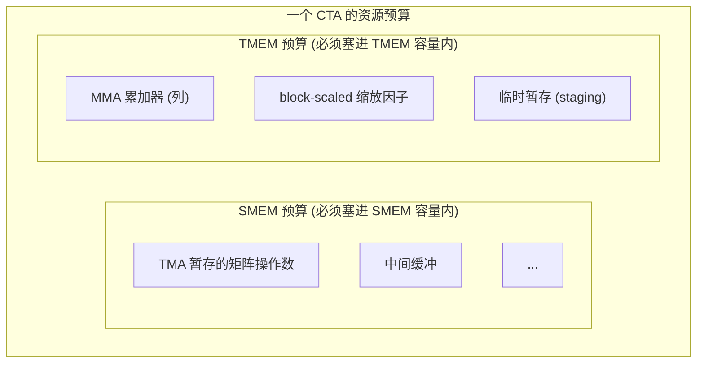
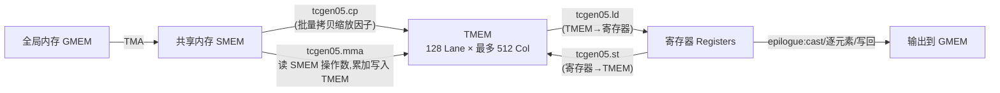

# 第 06 章 · 特殊内存:TMEM(Tensor Memory)

> 原文:[Special Memory: TMEM](https://mlc.ai/modern-gpu-programming-for-mlsys/chapter_tmem/index.html)

> **本章要点(TL;DR)**
>
> - **TMEM(Tensor Memory,张量内存)是 Blackwell 架构才有的一块片上内存**,专门伺候新一代 Tensor Core 指令族 `tcgen05`。每个 SM 上一块,长成 **128 个 Lane(行)× 最多 512 个 Col(列)** 的二维便笺(scratchpad),每个 Col 宽 32 位。
> - **它存在的头号任务,就是给寄存器减负**:以前(Hopper 及更早)MMA 的累加器(accumulator)得全程赖在寄存器里;Blackwell 让 `tcgen05.mma` 把累加器直接写进 TMEM,这样不挤爆寄存器也能开更大的 Tensor Core tile。
> - **TMEM 靠「二维坐标 (Lane, Col)」寻址**,不是共享内存那种一个线性字节偏移就完事。在本书的 TIRx 布局记号里,这两根硬件轴写作 `TLane` 和 `TCol`。
> - **TMEM 得自己显式分配、显式释放**(每个 CTA、按 32 列一档),它不像寄存器那样编译器替你派好——把它当成跟共享内存(SMEM)一样、需要「精打细算做预算」的资源。
> - **普通的 `ld.shared`/`st.shared` 根本碰不到 TMEM**。数据想进想出,只能走专用、而且**异步**的 `tcgen05` 指令:`tcgen05.ld`(TMEM→寄存器)、`tcgen05.st`(寄存器→TMEM)、`tcgen05.cp`(SMEM→TMEM),还得配上各自的完成/等待机制。

---

> **前置知识**:读这一章前,最好先懂寄存器 vs 共享内存、MMA / 累加器、warpgroup、Tensor Core 这几个概念。没把握的话,先翻一下 [第 0 章 · 极简入门](./ch00_gpu_ml_primer.md),也可随时查 [术语对照表](./术语对照表.md)。本章会默认你已经认识这些词。

---

## 引子:寄存器不够用,Blackwell 才另开了一条路

要搞懂 TMEM 为什么会出现,咱们先问一个老问题:**矩阵乘算出来的累加结果,到底该放哪儿?**

在 Hopper 和更早的 GPU 上,答案很简单——放**寄存器**里。Tensor Core(专做矩阵乘累加的硬件单元)的累加器(accumulator,也就是矩阵乘累加结果的暂存)就待在寄存器里,整个流程也好理解:

1. MMA(矩阵乘累加 Matrix-Multiply-Accumulate)指令一算完,就吐出一个**寄存器片段(register fragment,累加器在每个线程寄存器里的那一份)**;
2. 接下来整个计算阶段(compute phase),内核就让这个片段**一直赖在寄存器里**;
3. 等到收尾的 epilogue(收尾阶段,负责类型转换/逐元素/写回)阶段,内核再把片段读出来,做类型转换(cast)、做逐元素操作,最后写回去。

这一套听着挺顺。可问题来了:**寄存器又少又金贵,而且是一个线程一个线程死死分好的。** 这就埋下了一个绕不过去的矛盾。

> **关键**:Tensor Core 就好「大 tile」(tile = 从大矩阵切出来的小方块)这一口——tile 开得越大,它越能跑满、吞吐越高。可 tile 一大,累加器片段也跟着膨胀。片段一膨胀,它在每个线程的寄存器里就占得越多,把线程本来要用的其他变量全挤出去了。说白了,「想用大 tile 提吞吐」和「累加器全塞寄存器」这两件事,直接顶上了。

这个矛盾,画张表就一目了然。寄存器文件每个线程的容量是死的,同一块寄存器文件,在大小两种 tile 下被占成什么样,对比一下:

| 场景 | 累加器片段占用 | 留给其他工作变量的空间 | 结果 |
| --- | --- | --- | --- |
| 小 tile | 较小 | 充足 | 舒服 |
| 大 tile | 几乎占满整个寄存器文件 | 被严重挤压 | 溢出 / 降低占用率 |

**Blackwell 就是冲着这个矛盾下的刀。** 思路很直接:既然寄存器装不下大累加器,那干脆**别让累加器一直占着寄存器**。所以 `tcgen05.mma` 不再把累加器留在寄存器里,而是直接写进一块**新加的片上内存——也就是 TMEM**。这块内存,早期的 NVIDIA GPU 根本没有。

这么一改,好处立竿见影:**Blackwell 能开更大的 Tensor Core tile 了,还不用拿每个线程的寄存器去硬扛整个累加器。** 那代价呢?TMEM 可不像寄存器那样白送给你。编译器不会顺手帮你管好它,这些活儿得内核自己干:

- 自己去**分配(allocate)** TMEM;
- 用**对的布局(layout)** 去寻址;
- 用**对的指令**把数据搬进搬出;
- CTA 用完了,记得把它**释放(free)** 掉。

下面我们一条一条来看。

---

## TMEM 是一个二维地址空间

先记一句话:**TMEM 不是一条扁平的字节数组,它是一张二维网格。** 共享内存那套「给个线性字节偏移就能定位」的玩法,在这儿行不通。硬件给 TMEM 的两根坐标起了名字,一根叫 **Lane**,一根叫 **Col**:

| 维度 | 含义 | 规模 | 备注 |
| --- | --- | --- | --- |
| **Lane** | 行(纵向) | 128 个 Lane 行 | 对应 TIRx 记号里的 `TLane` 轴 |
| **Col** | 列(横向) | 最多 512 个 Col 列 | 每个 Col 是一个 **32 位的列**,对应 TIRx 记号里的 `TCol` 轴 |

这个形状可不是拍脑袋定的:**`tcgen05.mma` 往里写累加器,用的就是这套二维结构。** 所以你想定位 TMEM 里的某个位置,得给一对坐标——一个 Lane、一个 Col,而不是一个字节偏移。

下面这张表就是这张二维网格(对应原书的 `tmem_grid` 图):纵着看是 Lane(128 行,对应 TIRx 的 `TLane` 轴),横着看是 Col(最多 512 列,对应 `TCol` 轴,每个 Col 宽 32 位)。每个格子,就是一个 (Lane, Col) 坐标。

|         | Col 0 | Col 1 | Col 2 | ... | Col N-1 |
| --- | --- | --- | --- | --- | --- |
| **Lane 0**   |  |  |  | ... |  |
| **Lane 1**   |  |  |  | ... |  |
| **Lane 2**   |  |  |  | ... |  |
| **...**      |  |  |  | ... |  |
| **Lane 127** |  |  |  | ... |  |

- 竖着的行:128 个 Lane,也就是 `TLane` 轴。
- 横着的列:最多 512 个 Col,也就是 `TCol` 轴,每个 Col 宽 32 位。

### 在 TIRx 布局记号里怎么写

在 **TIRx**(也就是本书用的那套张量 IR / DSL)里声明一块 TMEM 缓冲区,得给它配一个**能把这两根硬件坐标说清楚的布局**。在布局记号里(完整定义在原书「Data Layout and Its Notation」那一章),我们把 TMEM 的 Lane 轴叫 `TLane`,Col 轴叫 `TCol`。

> **注意**:`TLane` / `TCol` 不过是布局轴的名字,**并不是要替换官方硬件术语** Lane / Col。起这两个名,纯粹是想在 DSL 里把 TMEM 的两个维度**写明白**,顺便跟其他张量布局用上同一套写法。

举个例子,一个累加器 tile 可以这么写:

```text
S[(128, N) : (1@TLane, 1@TCol)]
```

把这个记号拆开看就清楚了:

- `(128, N)`——这个 tile 有 **128 行**(沿 Lane 维度)、**N 列**(沿 Col 维度)。
- `(1@TLane, 1@TCol)`——这是**步长(stride)**:往下走一行,就在 `TLane` 轴上前进 1;往右走一列,就在 `TCol` 轴上前进 1。
- 合起来看:**这就是最直来直去的一种布局**——挨着的行沿 `TLane` 排,挨着的列沿 `TCol` 排,中间不搞任何重排、不搞交错。

> **关键**:千万别把 TMEM 当成「Tensor Core 背后那个看不见的仓库」。它是**整个 tile 布局里堂堂正正的一员**:内核得给它起名、从里头分配列,还得用一个**跟 `tcgen05` 指令读写方式严丝合缝的布局**。布局一旦对不上,数据就错位了。

---

## 分配:把 TMEM 当成像 SMEM 一样要做预算的资源

内核要想用 TMEM,得先在里头**占块地方**。这点跟寄存器完全两码事:**寄存器是编译器替你分好的,TMEM 你得自己张口去要。**

分配的规矩不多,记住这几条就行:

- **以 CTA(线程块,即一个 thread block)为单位申请**:由 CTA 里**某一个 warp**(一个 warp = 32 个线程的小班,见第 0 章)出面,要一段 TMEM 列区间。
- **32 列起步**:你要多少列,硬件都会**向上取整**到 32 的倍数。
- **要完会给你一个基址(base TMEM address)**:往后所有 `tcgen05` 指令,都靠这个基址找到你占下的那块地方。
- **用完务必释放(free)**:CTA 结束的时候把地还回去。

想真正理解它,最好的办法就是**把 TMEM 当成和共享内存一个性质的、CTA 级别、得做预算的资源**:



这么一来,TMEM 就成了**内核做资源规划(resource planning)** 时绕不开的一项。具体怎么取舍,都是很实在的账:

| 决策 | 收益 | 代价 |
| --- | --- | --- |
| 用更大的累加器 tile | 提升 Tensor Core 吞吐 | 消耗更多 TMEM 列 |
| 启用 block-scaled MMA(分块缩放) | 支持更细粒度的量化缩放 | 需要额外 TMEM 空间放缩放因子 |

这些用途加到一块,**全都得挤进那点有限的 TMEM 预算里**——道理跟你必须把所有共享内存缓冲塞进 SMEM(共享内存 Shared Memory,CTA 内片上共享的快内存)预算里,一模一样。

> **注意**:TMEM 的总量是有天花板的(每个 SM(流式多处理器,GPU 上一个独立的计算核心)就一块,128 × 512 个 32 位列)。它和占用率(occupancy)、SMEM 用量这几样凑在一起,共同决定了一个内核能开多大 tile、能同时跑几个 CTA。

---

## 读写 TMEM:三条专用的异步通路

前面那句话再敲一遍黑板:**普通的 `ld.shared` / `st.shared` 根本够不着 TMEM。** TMEM 是块独立的地址空间,数据想进想出,只能走专门的 `tcgen05` 指令。这样的通路总共**三条**。

下图把 Blackwell Tensor Core 的整条数据通路都画出来了,你一眼就能看到 TMEM 正好卡在中间:



整条链路一句话串下来:**TMA(Tensor Memory Accelerator,负责 GMEM↔SMEM 异步大块搬运的硬件)把矩阵操作数(operand,即参与矩阵乘的输入矩阵)暂存进 SMEM → `tcgen05.mma` 读这些操作数,把结果累加进 TMEM(要是 block-scaled,缩放因子也搁 TMEM 里)→ 计算阶段一结束,`tcgen05.ld` 把累加器搬回寄存器 → epilogue 做转换,把最终结果写出去。**

### 通路一:`tcgen05.ld`(TMEM → 寄存器)

这条用得最勤,**epilogue 必走这条**。MMA 阶段把累加器算在了 TMEM 里,可 epilogue 要的偏偏是一个**寄存器片段**——数据只有回到寄存器,才方便做类型转换、逐元素操作、最后写回。

这条通路有个挺要紧的脾气:它是「分着干」的。

> **关键**:在 DSL 这一层,一次 TMEM 加载是**整个 warpgroup(4 个 warp 合成的更大协作单位,共 128 个线程)凑一块儿分头干**的。它会被拆(lower)成**四条 warp 级的 `tcgen05.ld`,一个 warp 摊一条**。每个 warp 管 128 个 Lane 行里的 **32 行**,四个 warp 一拼,正好把整个 Lane 维度(也就是布局记号里的 `TLane` 轴)铺满。

整个 `TLane` 维度一共 128 行,一个 warpgroup(4 个 warp)分着扛,每个 warp 发一条 `tcgen05.ld`,各管 32 行:

| warp | 负责的 Lane 行 | 发出的指令 |
| --- | --- | --- |
| warp 0 | Lane 0 .. 31 | `tcgen05.ld` |
| warp 1 | Lane 32 .. 63 | `tcgen05.ld` |
| warp 2 | Lane 64 .. 95 | `tcgen05.ld` |
| warp 3 | Lane 96 .. 127 | `tcgen05.ld` |

这条指令本身还带着一大家子**加载形状(load shape)**,什么 `.16x64b`、`.16x128b`、`.16x256b`、`.32x32b`、`.16x32bx2` 等等,外加一个**重复因子(repeat factor)**,从 `.x1` 一路到 `.x128`。**你挑哪个形状,就决定了这一趟读几列 TMEM、每个线程能分到几个寄存器。**

不过最该上心的,是**读回来的寄存器片段到底长啥样**。在常见的 epilogue 路径里,规律是这样:

> **关键**:lane `l`(线程在 warp 里的编号)拿到的值,来自 **TMEM 第 `l / 4` 行**的**那两列**。

这有啥讲究?讲究就在于:它给出的形态,**跟早期 GPU 上 MMA 直接暴露的那种「一个 lane 一份累加器片段」长得一模一样**(细节见原书「Tensor Core Operand Layouts Across GPU Generations」)。这份**前后一致**,可太值钱了。

> **注意**:正因为片段的样子没变,**Blackwell 的 epilogue 能直接捡起 Ampere `mma` 或 Hopper `wgmma` 时代那套「寄存器级 cast + 写回」的老代码接着用**——哪怕计算阶段累加器其实是住在 TMEM 里的。说白了:TMEM 不过是给累加器换了个住处,可一旦搬回寄存器,上层软件几乎不用动。

把 `l / 4` 这个映射画出来,大概是这个样子(对应原书 `tcgen05_ldst` 那张图,m8n8 片段):好几个 lane 共用同一个 TMEM 行,每个 lane 从这行里取 2 列(也就是 2 个值)进寄存器。

| TMEM 行 (row = l / 4) | 由哪些 lane 读取 | 每个 lane 拿到 |
| --- | --- | --- |
| row 0 | lane 0, 1, 2, 3 | 该行的 2 列(2 个值) |
| row 1 | lane 4, 5, 6, 7 | 该行的 2 列(2 个值) |
| row 2 | lane 8 .. 11 | 该行的 2 列(2 个值) |
| ... | ... | ... |

### 通路二:`tcgen05.st`(寄存器 → TMEM)

`tcgen05.st` 就是 `tcgen05.ld` 反过来:线程手里已经攥着一个寄存器片段,想把它**塞回 TMEM**。

啥时候用得上?比方说某些操作数或者中间值,得**先在寄存器里过一道手(staging)**,再写进 TMEM,留给后面某条 `tcgen05` 指令使。

### 通路三:`tcgen05.cp`(共享内存 → TMEM)

`tcgen05.cp` 走的是**批量拷贝(bulk copy)** 这条路,干得最多的活儿就是搬 **block-scaled MMA 的缩放因子**。流程两步:

1. 先用 **TMA** 或者普通线程代码,把缩放数据(scale data)先备到**共享内存**里;
2. 再让 `tcgen05.cp` 把它搬成 **Tensor Core 想要的那种 TMEM 布局**。

### 三条通路有个共同点:全是异步的

> **关键**:`tcgen05.ld`、`tcgen05.st`、`tcgen05.cp` **这三条全是异步(asynchronous)的**。也就是说,指令很可能在**数据还没真搬完**的时候就先返回了。所以在你**用这份结果**、或者**回头再用那块内存**之前,一定得用**对的完成机制**把它等住(细节见原书「Async Coordination: mbarriers」)。

这里特别容易踩坑:**到底怎么等,得看你用的是哪条指令。** 单拉个表:

| 指令 | 完成 / 等待机制 |
| --- | --- |
| `tcgen05.ld` | 通过 `tcgen05.wait::ld` 等待完成 |
| `tcgen05.st` | 通过 `tcgen05.wait::st` 等待完成 |
| `tcgen05.cp` | 像 `tcgen05.mma` 一样,通过 **commit group(提交组)+ mbarrier(异步屏障,用来等异步操作完成的同步对象)** 完成 |

还有一点别忘了:

> **注意**:要是数据得从**一组线程**交到**另一组线程**手上(producer → consumer),那光「等」还不够,内核多半还得补一道**栅栏(fence)**,接收方才能**按对的顺序**看到那些已经写好的数据。栅栏一漏,接收方就可能读到旧数据,或者读得乱七八糟。

---

## 把整条数据通路串起来:TMEM 就在 Tensor Core 数据流的正中间

最后退一步,咱们从头到尾捋一遍:**TMEM 就坐在 Blackwell Tensor Core 数据通路的正中间。**

| 阶段 | 谁在动 | 数据从哪到哪 |
| --- | --- | --- |
| 1. 预取操作数 | TMA | GMEM → SMEM |
| 2. (block-scaled)准备缩放因子 | TMA/线程 + `tcgen05.cp` | GMEM/SMEM → TMEM |
| 3. 矩阵乘累加 | `tcgen05.mma` | 读 SMEM 操作数,累加写入 TMEM |
| 4. 取回累加器 | `tcgen05.ld` | TMEM → 寄存器 |
| 5. 尾声处理与写回 | epilogue(寄存器级 cast/逐元素) | 寄存器 → GMEM |

这套设计的来龙去脉,一句话就能讲透:**寄存器文件想做大,物理上难、成本上也贵,与其硬磕,Blackwell 干脆另加一块专给 Tensor Core 用的二维便笺内存,把「装大累加器」这副担子从寄存器卸下来,扔给了 TMEM。** 代价就是:本来编译器替你打理的累加器存储,现在得内核亲自动手去分配、寻址、搬运、释放。可回报也实打实——不用牺牲寄存器,就能把 tile 开得更大。

---

## 小结

- **TMEM 是 Blackwell 专属、`tcgen05` 专用的片上二维内存**(每 SM 一块,128 Lane × ≤512 Col,每 Col 32 位)。它来到世上就一个目的:**把大 tile 压在寄存器上的那份压力卸掉**——让累加器不必一直霸着寄存器。
- 它靠**二维坐标 (Lane, Col)** 寻址(TIRx 记号里写作 `TLane` / `TCol`)。它是 **tile 布局里的正式成员**,不是躲在背后的后备仓库;布局必须跟 `tcgen05` 指令的读写方式对得上。
- 它得跟 SMEM 一样**自己显式分配、显式释放**(以 CTA 为单位、按 32 列向上取整、返回基址),还得算进内核的资源预算里。
- 数据进出 TMEM 就三条**异步专用通路**:`tcgen05.ld`(搬回寄存器,epilogue 的主路径,一个 warpgroup 拆成四个 warp,lane `l` ↔ 行 `l/4`)、`tcgen05.st`(从寄存器写回 TMEM)、`tcgen05.cp`(从 SMEM 批量拷贝,常拿来搬缩放因子)。三条各等各的(`wait::ld`、`wait::st`、commit group + mbarrier),跨线程交接时还得补栅栏。
- 还有一条值得记牢的「前后一致」:**累加器虽然搬进了 TMEM,但 `tcgen05.ld` 把它取回寄存器之后,片段的样子和 Ampere/Hopper 时代一个样,所以 epilogue 那套 cast 和写回的代码,几乎能原封不动地接着用。**

## 延伸阅读

- 原文:[Special Memory: TMEM — Modern GPU Programming for MLSys](https://mlc.ai/modern-gpu-programming-for-mlsys/chapter_tmem/index.html)
- 相关章节(原书内部引用):
  - Data Layout and Its Notation(布局记号 `TLane`/`TCol` 的定义)
  - Tensor Core Operand Layouts Across GPU Generations(各代 Tensor Core 操作数/片段布局的连续性)
  - Async Coordination: mbarriers(异步完成与 mbarrier 协调机制)

## 术语对照

| 中文 | English | 说明 |
| --- | --- | --- |
| 张量内存 | TMEM(Tensor Memory) | Blackwell 专属、`tcgen05` 专用的片上二维内存 |
| 张量核心 | Tensor Core | 执行矩阵乘累加的专用硬件单元 |
| 累加器 | accumulator | MMA 矩阵乘累加的结果存储 |
| 寄存器片段 | register fragment | 累加器/操作数在每个线程寄存器里的那一份 |
| 线程束 | warp | 32 个线程组成的调度单位 |
| warp 组 | warpgroup | 4 个 warp 组成的更大调度/协作单位 |
| 线程块 | CTA(Cooperative Thread Array) | 协作线程阵列,即一个 thread block |
| 共享内存 | SMEM(Shared Memory) | CTA 内共享的片上内存 |
| 全局内存 | GMEM(Global Memory) | 设备主存 |
| 矩阵乘累加 | MMA / GEMM | Matrix-Multiply-Accumulate / 通用矩阵乘 |
| 张量内存加速器 | TMA(Tensor Memory Accelerator) | 负责 GMEM↔SMEM 异步大块搬运的硬件 |
| 分块缩放 MMA | block-scaled MMA | 带分块缩放因子的低精度 MMA |
| 尾声阶段 | epilogue | MMA 后做 cast/逐元素/写回的阶段 |
| 占用率 | occupancy | SM 上并发活跃 warp/CTA 的比例 |
| 内存栅栏 | fence | 保证跨线程写入可见顺序的同步原语 |
| 异步屏障 | mbarrier | 用于异步操作完成协调的屏障对象 |
