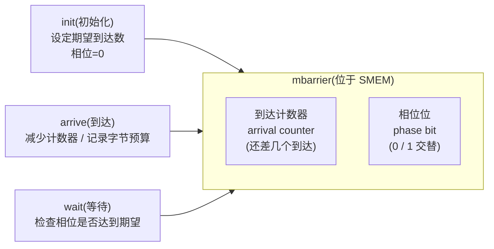
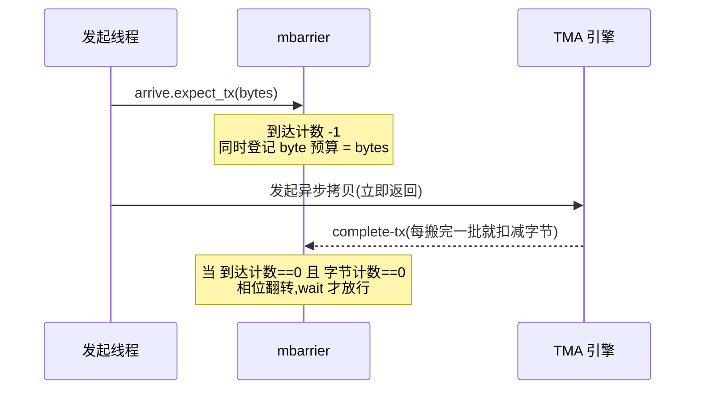
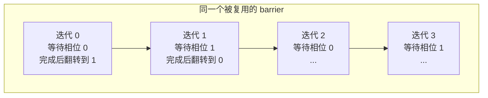
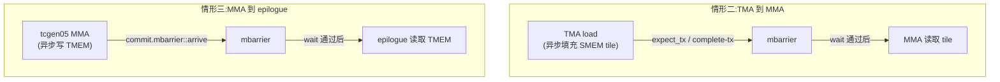

# 第 07 章 · 异步协调:mbarrier

> 原文:[Async Coordination: mbarriers](https://mlc.ai/modern-gpu-programming-for-mlsys/chapter_async_barriers/index.html)

> **本章要点(TL;DR)**
>
> - **TMA 和 Tensor Core 都是异步的**:发出一条指令,不等于这条指令已经做完。发起线程把活儿往硬件引擎一塞就走了,真正的搬数据、算矩阵在后台跟你的程序并行跑。所以别再靠"代码写在前面"就一口咬定数据备好了。
> - **`mbarrier` 就是那个"完成信号"**:它把五花八门的异步交接,捏成一个特别简单的套路——干活的人 `arrive`(到达),用数据的人 `wait`(等待)。
> - 一个 `mbarrier` 内部记两笔账:**到达计数器**(还差几个人报到),还有专门给 TMA 用的**字节计数**(还差多少字节没搬完)。两笔账都归零,这一轮才算结。
> - 每个屏障还带一个 **相位位 / phase bit**,每过一轮翻一下。就靠它,同一个屏障才能在循环里反复用,而不会把"上一轮做完了"误当成"这一轮做完了"。
> - 流水线 GEMM(矩阵乘,深度学习里最核心的算子)里,屏障要几个,看的是**可复用的流水级(stage)有几个**,跟 K 维一共有多少个 tile 没关系。每个 stage 配一个屏障,再加上寄存器里的一个相位值,就齐活了。

> **前置知识**:读这一章前,最好先懂**异步搬运(TMA)**、**warp/线程**、**共享内存(SMEM)**,以及**流水线 / 重叠(overlap)**这几个概念。没把握的话,先翻一下 [第 0 章 · 极简入门](./ch00_gpu_ml_primer.md)。本章会默认你已经认识这些词。

---

## 7.1 为什么需要一个显式的"完成信号"

想搞懂 `mbarrier`,我们得先弄明白:它到底在替我们擦什么屁股?

现代 GPU(尤其是 Hopper / Blackwell 这一代,英伟达较新的两代数据中心架构)上,最累的两类活儿都是**异步**干的:

- **TMA / Tensor Memory Accelerator**:专门在全局内存(global memory,GPU 的"主存",大但慢)和共享内存(SMEM,一个 block 内线程共用的片上快速内存)之间搬大块张量(tile,大矩阵切出来的小方块)。
- **Tensor Core 上的 `tcgen05` MMA**(Tensor Core 是专做矩阵乘的硬件单元;MMA = 矩阵乘累加):专门把矩阵乘的累加结果写进 TMEM(Tensor Memory,Blackwell 上专给 Tensor Core 用的一块片上内存)。

"异步"是个啥意思?说白了就是:kernel 发出一条 TMA load 之后,发它的那个线程**根本不会停下来等**。它把活儿往硬件引擎手里一塞,扭头自己接着往下跑。真正的搬运,是在后台跟你程序的后半段**同时**进行的。MMA 也是一个道理。

这么干的好处一目了然:**搬数据和算数据能叠在一起跑(overlap)**,谁也不耽误谁——想把 GPU 的算力榨干,全靠这个。可天下没有免费的午餐,它也带来一个绕不开的大麻烦:

> **关键**:异步说白了就是——"代码写在前面"不代表"事情已经做完"。前面那条异步操作还没收尾,后面的代码就可能抢跑了。换句话说,**你再也不能靠"谁写在前面"来判断数据准没准备好。**

不加约束的话,马上就会冒出三种经典的数据竞争(race):

| 出错场景 | 后果 |
| --- | --- |
| TMA 还在往 SMEM tile 写数据,MMA 就开始读这块 tile | MMA 读到**残缺的数据** |
| Tensor Core 还没把累加器(accumulator,边乘边累加结果的那块存储)写完,尾声阶段(epilogue)就去读 TMEM | epilogue(收尾阶段,把算好的结果写回的那段代码)读到**错误的值** |
| kernel 等在了一个永远不会满足的条件上 | kernel **永远卡住,推进不下去** |

那怎么办?办法很朴素:**每有一处异步交接(handoff),就在那儿插一个明确的完成信号**,让 kernel 知道"这步真做完了"。`mbarrier` 就是这个信号。它的玩法特别统一:

```text
生产者(producer): 工作做完     -> 在 barrier 上 "arrive"(到达)
消费者(consumer): 用数据之前   -> 在 barrier 上 "wait"(等待)
```

就这一套"到达 / 等待",能同时管三种交接:

1. **TMA → MMA**:这块 tile 搬好了没?
2. **MMA → epilogue**:累加器算完了没,能读了没?
3. **跨流水级复用缓冲区**:这块 buffer 腾出来了没,能拿去覆写了没?

> **注意**:`mbarrier` 可不是那种"用一次就扔"的一次性标志位。它身上带一个相位位,每完成一轮就翻一下。正是靠它,同一个屏障才能在几百次循环里反复复用,而不会把"上一轮做完了"当成"这一轮做完了"。

---

## 7.2 mbarrier 到底是什么

`mbarrier` 是 memory barrier(内存屏障)的缩写。你就把它想成一个**摆在共享内存(SMEM)里的小账本**,专门记同步状态。这本账上主要有两栏:

- **到达计数器 / arrival counter**:这一轮还差几个人没报到。
- **相位位 / phase bit**:现在轮到第几轮了(用 0、1 来回切)。



> 原书这里有个**交互演示**:能看到 `mbarrier` 的到达计数器、相位位,还能点 `init` / `arrive` / `wait` 三个操作,挨个字段单独看。这份静态笔记用上面那张图做了等价表达,但**想体会动态过程,还是去原书的在线演示玩一玩最直观**。

### 7.2.1 init:初始化

屏障这辈子从 `init` 开始。这一步,kernel 只要交代清楚一件事:**这一轮总共要等几个人报到**(也就是期望到达数)。初始化一完成:

- 屏障停在 **相位 0**;
- 计数器被设成你说的那个期望到达数。

从这一刻起,屏障就开始"点名等人"了。它得等所有该报到的生产者、用资源的人都喊一声"我干完了",这一轮才算凑齐。

### 7.2.2 arrive:到达(三条不同的路径)

每来一次"到达",屏障还要等的活儿就少一点。但有个点你得记住:**不同角色"到达"的姿势是不一样的**——这个区别特别关键。原书一共讲了三条到达路径。

#### 路径一:TMA 的 tx-count 到达(字节预算)

说到 TMA load,它常用的报到方式是 **tx-count 到达**。代码长这样:

```cpp
// 概念示意:expect_tx 同时做两件事
mbarrier.arrive.expect_tx(bytes);
```

别看就一行,它**一口气干了两件事**:

1. 替**发起线程在屏障上报一次到**;
2. 顺手**告诉屏障:这趟 TMA 引擎大概要搬多少字节**(也就是先记一笔字节预算)。

> **关键**:光是"发起线程报了到",屏障**还不算完成**。它还得等 TMA 引擎把这笔字节账"还清"——真把那么多字节搬到位才行。**所以相位要翻转,得同时满足两条:普通到达计数归零,而且待传输的字节计数也归零。**

这也是为什么不能把 `expect_tx` 想成简单的"又报了一次到"。它真正的活儿,是给这次异步拷贝**先挂一笔字节预算**;之后硬件每搬完一批,就靠 **complete-tx** 把对应的字节扣掉。一直扣到字节归零、到达也归零,这个屏障才算彻底交差。



#### 路径二:Tensor Core 的 commit 到达

换到 Tensor Core 这边,报到的方式就完全是另一套了。记牢一句话:**你发一条 `tcgen05` MMA,它自己是不会去碰任何屏障的。** 你得**手动**把一次屏障到达,挂到 MMA 的"提交(commit)"路径上,比如:

```cpp
// 概念示意:把 barrier 到达挂到 MMA 的 commit 上
tcgen05.commit.mbarrier::arrive;
```

挂好之后,等这一批提交出去的 MMA 全算完,Tensor Core 就会替你去屏障上报到。

> **注意**:要是 kernel **忘了**挂这个 commit 到达,那等在这个屏障上的消费者就会**傻等一辈子,永远等不到**。这是写 `tcgen05` 特别容易栽的一个坑。

#### 路径三:普通线程的直接到达

普通线程也能**自己直接**去屏障上报到。这一般用在两种场合:

- 这个普通线程本身就扮演生产者;
- 一伙线程想宣布:**我们把某个资源用完了**。

举个最常见的例子:某个消费者把一块 SMEM 缓冲区读完之后,可以在屏障上"到达"一下,意思就是告诉生产者——**这块 buffer 我腾出来了,你拿去复用吧**。

### 7.2.3 wait:等待(消费者这一侧)

`wait` 是同一套协议里消费者要干的事。消费者会**死等,直到屏障转到"这一轮该到的那个相位"**,然后才敢去读数据、或者复用这个屏障护着的资源。

把上面三条到达路径凑一块看,本章最要紧的一个洞见就浮出来了:

> **关键**:异步硬件不光是"自己闷头跑在程序前面",它还会**反过来通过屏障,把'我干完了'回报给程序**。TMA 报的是"SMEM tile 备好了";Tensor Core 报的是"TMEM 结果算好了";普通线程报的是"这块 buffer 我不占了"。情况五花八门,最后全被收成同一个形状:**生产者 arrive,消费者 wait。**

---

## 7.3 相位追踪(Phase Tracking)

### 7.3.1 为什么必须有相位

屏障一般**不会用一次就重新分配一个**。一个做了流水线(pipelined)的 K 维循环,可能要把同一种交接重复**几百遍**。每次迭代都新建一个 SMEM 屏障?既不现实,也太浪费。所以真实做法是:**kernel 只攥着固定的一小撮屏障,随着循环往前推,翻来覆去地复用它们。**

那复用怎么才不出乱子?全靠**相位位**。

屏障每凑齐当前这一轮的全部到达,就**把相位翻一下**:0 变 1,1 变 0,循环往复。`wait` 这边则会盯着看:**消费者期望的那个相位,跟现在对上了没**。这个期望相位,kernel 自己存在**寄存器**(register,每个线程私有的最快存储)里。某个 stage 等到一轮之后,kernel 在拿它跑下一轮之前,会**顺手把本地存的相位值也翻一下**。



> 原书这里又是个**交互演示**:一个屏障跨好几次流水迭代被反复用,每完成一轮,你就能看到相位位翻一下。上图是它的静态版,**想看动起来的样子,配合原书交互演示一起看**。

### 7.3.2 没有相位会出什么乱子

设想一个屏障刚给一次 TMA load 用过,而且已经完成了。下一轮循环又拿**同一个屏障来复用,可偏偏没追踪相位**——这下消费者一瞅,发现屏障是"完成"状态,就乐呵呵地以为"新的 load 已经就绪了",冲上去读数据。可它看到的其实是**上一轮**遗留的完成状态,新数据压根还没搬过来呢。

相位位干的就是把这两轮**隔开**这件事。下面这张表是**最简单的情形:只有一个屏障,每次迭代都用它**,所以期望相位每轮都翻一次。

| 迭代 | 期望相位 |
| --- | --- |
| 迭代 0 | 相位 0 |
| 迭代 1 | 相位 1 |
| 迭代 2 | 相位 0 |
| 迭代 3 | 相位 1 |
| … | 0/1 交替继续 |

> **注意**:"每迭代翻一次相位"是有前提的——前提是只有一个屏障在那儿连轴复用。下一节你就会看到,一旦有**好几个 stage、好几个屏障轮班上**,某个屏障得隔好几次迭代才轮到一回。所以**单盯着某一个屏障**,它的相位翻得没那么勤——千万别把这两种情形的相位序列混为一谈。

### 7.3.3 真实流水线里的记账:按 stage 来记

真实流水线里,这本账一般是**一个 stage 一本(per stage)**地记。kernel 手里攥着:

- 固定几个 **SMEM 流水级(stage)**;
- 跟 stage **一对一配好**的固定几个**屏障**;
- 寄存器里存的一小撮**相位值**。

循环往前推的时候,**每个逻辑迭代都会被派到某个物理 stage 上**。相位值干的活儿,就是告诉 `wait`:你这会儿等的,到底是这个物理屏障的**哪一轮**。

```text
逻辑迭代:   0    1    2    3    4    5   ...
物理 stage: s0   s1   s0   s1   s0   s1     (假设 2 级流水)
相位:       p0   p0   p1   p1   p0   p0     (每回到同一个 stage 就翻一次)
```

> **关键**:这一下就讲通了后面那个问题:为什么"用 TMA 做流水线化 GEMM"的代码,**用不着给每个 K tile 都配一个屏障**?因为它只要**每个可复用 stage 配一个屏障,再搭上相位追踪**,就够使了。
> - **stage 索引**管的是:这回该用哪块 SMEM 缓冲区、哪个屏障;
> - **相位值**管的是:把"这个 stage 这一次用"和"上一次用"区分开。

> **试一试(让你的 agent 陪你练)**:丢给它一个**两级流水线**,让它追四次迭代。每次迭代都把这几样列出来:stage 索引、本地相位值、屏障啥时候翻转,还有——**要是复用 stage 之前忘了翻相位,会捅出什么娄子**。

---

## 7.4 同步规则(Synchronization Rules)

把屏障和相位这套机制吃透之后,你会发现 Tensor Core kernel 里的同步其实很有规律,基本就是"照章办事"。这套章程一句话就能交代清楚:

> **只要一条执行路径生产了数据、或者腾出了某个资源,而另一条路径接下来要用,那这次交接就必须白纸黑字写出来。**

原书把它分成三种常见情形。

### 情形一:线程代码 → 异步引擎

假设线程往 SMEM 写了点东西,紧跟着一条 **TMA store 或 MMA** 就要来读这块 SMEM。这时候 kernel 得保证:**线程写进去的内容,在引擎读之前已经是看得见的**。想做到这点,得靠合适的**线程级同步,或者一道栅栏(fence)**。

至于具体用哪条指令,要看这次交接的作用域(scope),但道理从头到尾就一个:

> **注意**:生产线程**没写完之前**,引擎绝对不许看到那块 SMEM 缓冲区。

### 情形二:TMA → MMA

TMA load 是异步往一块 SMEM tile 里灌数据的。**就算看到"TMA 指令已经发出去了",MMA 也别想当然地认为 tile 备好了。** 所以:

- TMA 操作必须**绑一个 `mbarrier`**;
- MMA 动这块 tile 之前,必须先**在那个屏障上 wait**。

### 情形三:MMA → epilogue

`tcgen05` MMA 是异步把结果写进 TMEM 的。Tensor Core 没把活儿干完,epilogue 就**别急着去读累加器**。所以:

- MMA 的 **commit 路径要在一个完成屏障上 arrive**;
- epilogue 读 TMEM 之前,先**在那个屏障上 wait**。



> 原书这里又有个**交互演示**:一个 TMA load 通过 `mbarrier` 发出完成信号,MMA 路径等屏障放行了才去读 SMEM tile。Tensor Core → epilogue 那次交接**长得一模一样**,唯一的区别是:那边的到达,是 **Tensor Core 的 commit 路径**来报的,不是 TMA。**想看它动起来,去翻原书的交互演示。**

### 7.4.1 同一套机制,也能拿来"回收资源"

屏障可不只会发"数据备好了"的信号,它**一样能发"资源腾出来了"的信号**:

- 一个 SMEM stage,旧 tile 的**所有消费者还没用完之前**,不许覆写;
- 一块 TMEM 区域,**上一个占用的人还没读写完之前**,不许复用。

到了这两种场合,arrive 和 wait 的意思就换了个讲法:

- **arrive** = "这资源我用完了";
- **wait** = "好了,这资源现在可以放心交给下一个 stage 了"。

> **关键**:这才是读流水线 GEMM kernel 里那堆同步语句的正确打开方式——那一片 `wait` 和 `arrive` **绝不是到处乱撒的防御代码**。每一条都对着一次**明明白白的所有权交接(ownership transfer)**:一块 tile 备好了、一个累加器能读了、或者一块 buffer 能回收了。把这些交接点一个一个认出来,再绕的控制流也就读顺了。

---

## 小结

- TMA 和 Tensor Core 的**异步**让搬数据和算数据能叠着跑,代价是"代码先后顺序"再也证明不了数据就绪了。所以**每一处异步交接,都得配一个明确的完成信号**。
- `mbarrier` 是个**摆在 SMEM 里的硬件同步对象**,主要记两笔账:**到达计数器**和**相位位**;碰上 TMA,还多记一笔**字节计数(tx-count)**。完成的条件是:到达归零 **而且** 字节归零。
- **三条到达路径**各玩各的:TMA 用 `expect_tx`(顺手设字节预算)、Tensor Core 用 `tcgen05.commit.mbarrier::arrive`(忘了挂就死等)、普通线程可以直接 arrive(常拿来发"资源腾出来了"的信号)。
- **相位位**让同一个屏障在循环里能放心复用:每过一轮翻一次,消费者把期望相位存在寄存器里、每轮也翻一下,就不会把旧的完成当成新的完成。
- 真实流水线**按 stage 记账**:stage 有几个,屏障就几个,跟 K tile 一共多少个没关系;**stage 索引管选缓冲区和屏障,相位值管区分这一轮和上一轮**。
- 把所有 `wait` / `arrive` 都当成**所有权交接**来读(数据就绪 / 累加器可读 / buffer 可回收),再复杂的 kernel,控制流也读得明明白白。

## 延伸阅读

- 原文:[Async Coordination: mbarriers — Modern GPU Programming for MLSys](https://mlc.ai/modern-gpu-programming-for-mlsys/chapter_async_barriers/index.html)(含本章三处交互演示:mbarrier 状态视图、相位翻转、TMA→MMA 完成信号)
- 相关章节:**Async Data Movement: TMA**(异步数据搬运)、**Tensor Cores: tcgen05**(张量核心)、**Pipelining GEMM with TMA**(用 TMA 做流水线化 GEMM)——想搞懂最后那章里"为啥屏障数 = stage 数",得先把本章啃下来。

## 术语对照

| 中文 | English |
| --- | --- |
| 内存屏障 / 异步屏障 | mbarrier (memory barrier) |
| 到达计数器 | arrival counter |
| 相位位 | phase bit |
| 字节计数 / 事务计数 | tx-count / byte count |
| 期望字节预算 | expect_tx |
| 完成事务回报 | complete-tx |
| 到达 / 等待 | arrive / wait |
| 提交(MMA 工作组) | commit |
| 异步数据搬运引擎 | TMA (Tensor Memory Accelerator) |
| 张量核心 | Tensor Core |
| 张量内存 | TMEM (Tensor Memory) |
| 共享内存 | SMEM (shared memory) |
| 矩阵乘累加 | MMA (Matrix-Multiply-Accumulate) |
| 尾声阶段 | epilogue |
| 流水级 | stage |
| 程序顺序 | program order |
| 访存与计算重叠 | overlap |
| 所有权转移 | ownership transfer |
