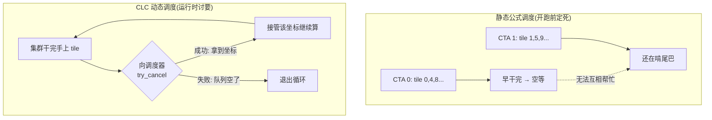
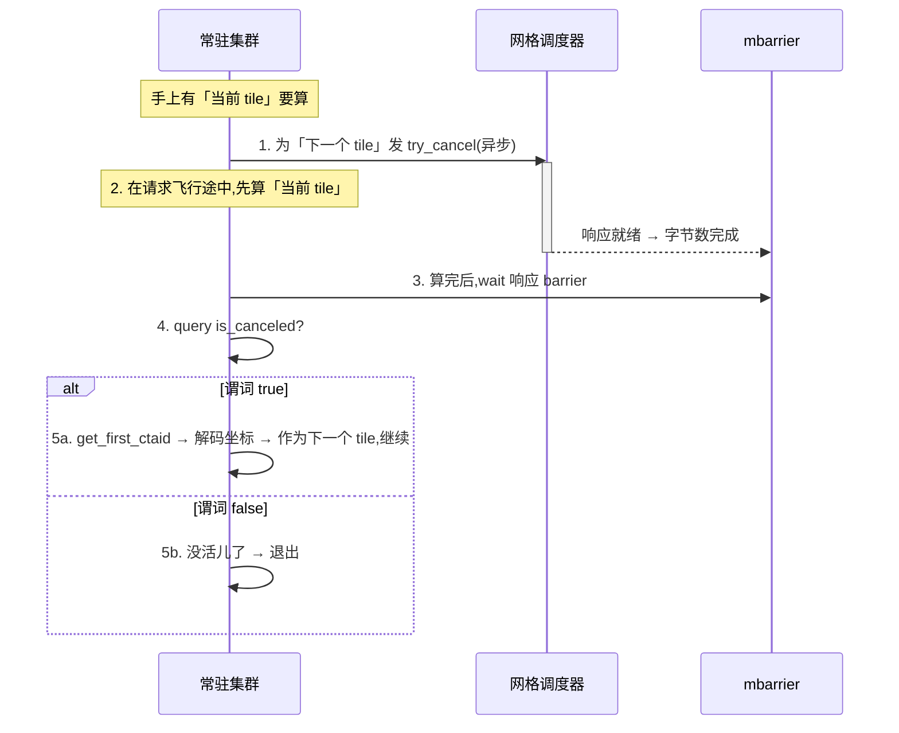

# 第 08 章 · 进阶:集群启动控制(CLC)

> 原文:[Advanced: Cluster Launch Control](https://mlc.ai/modern-gpu-programming-for-mlsys/chapter_clc/index.html)

> **本章要点(TL;DR)**
>
> - **常驻核 / persistent kernel**:传统做法是「一个 CTA(一个线程块,GPU 调度的基本单位)算一块输出 tile(大矩阵切出来的小方块),算完就走人」。常驻核换了个思路——只起一小批活得久的 CTA / 集群(cluster,一起启动、能互相同步的一组 CTA),让它们循环不停地一块接一块吞 tile。于是核心问题就剩一句:**手上这块算完了,下一块打哪来?**
> - **集群启动控制 / Cluster Launch Control(CLC)**:Blackwell(NVIDIA 较新的 GPU 架构代号,继 Hopper 之后)新加的硬件机制,作用是让一个已经在跑的集群,在运行时向硬件的网格调度器 / grid scheduler **讨**还没启动的集群坐标。说白了,它就是一条**硬件级的工作窃取(work-stealing)**通道。
> - CLC 对外就给**两条 PTX 指令**:一条异步发请求,一条读回结果。完成信号靠 **mbarrier**(内存屏障,异步操作干完后用来报信的同步对象)报,沿用 TMA(异步搬数据的硬件引擎)那套 barrier + phase 模型,**不另搞任何新的等待方式**。
> - 它最大的好处是**改善尾部行为(tail behavior)**:当各块 tile 算得有快有慢、或者 tile 数除不尽 SM 数时(SM = 流式多处理器,GPU 上真正干活的核心,见第 0 章),先干完的集群马上就能接着拉新活儿,不用在那儿干瞪眼空等。
> - 注意别把它跟「线程块集群」搞混:集群打 Hopper 起就是**启动单位**了;CLC 是 Blackwell 补上的本事,让**这些集群坐标的调度从死的变成活的**。

> **前置知识**:读这一章前,最好先懂 CTA / cluster(集群)、tile(分块)、SM、关键路径与尾部、常驻核(persistent kernel)这几个概念。没把握的话,先翻一下 [第 0 章 · 极简入门](./ch00_gpu_ml_primer.md)。本章会默认你已经认识这些词。

---

## 8.1 从静态调度到动态调度:为什么需要 CLC

想搞懂 CLC,得先把**常驻核**这个执行模式弄明白。这套玩法,前面《用 warp 特化与集群扩展 GEMM》那一章是一步步搭起来的。

先看传统 GPU kernel 怎么干活。它把 CUDA 网格 / grid(一次启动的全部 CTA 的总集合)当成一锤子买卖:有多少个 tile,就一口气启动多少个 CTA,一个 CTA 包一个输出 tile,算完拍屁股走人。常驻核不这么玩,它换了个思路:

- 它只起一小批**活得久**的 CTA 或者集群。数量大概调到「一个 SM 上差不多蹲一个干活的」这个量级——但要说清楚,它**并不靠**严格的 1:1 映射,不需要这种保证。
- 每个集群算完一个 tile,就接着算下一个,算完再下一个,就这么转圈,一直转到整个输出空间全算完为止。

核一旦变成常驻的,整个调度问题就被压成了一句话:

> **关键**:一个集群算完当前 tile 之后,**下一个 tile 从哪里来?**

### 静态公式调度:简单但尾部会拉胯

最省事的答案是**静态公式 / static formula**:拿 CTA id 直接算出第一个 tile 的坐标,往后每跳一步,都按一个固定的 **网格步长 / grid stride** 往后挪。

```text
tile_id = cta_id
while tile_id < num_tiles:
    compute_tile(tile_id)
    tile_id += grid_size      # 网格步长跳到自己负责的下一个 tile
```

这招好不好用,得看情况:

- ✅ 写起来简单。哪个 CTA 该算哪几块 tile,在 kernel 真正开跑之前就**全排明白了**。
- ✅ 要是每块 tile 算起来都差不多累,而且 tile 总数又恰好能被 SM 数整除,那它跑得挺香。
- ❌ 可问题就出在「活儿在开干之前就钉死了」这件事上。万一有几块 tile 算得特别慢,或者最后剩下的几块怎么也分不匀,就会撞上一个很尴尬的场面:**一些 SM 早早把自己那份干完了,只能在旁边干瞪眼;另一些还在那儿吭哧吭哧啃尾巴。**

### CLC:把分配推迟到运行时再决定

CLC 就是来收拾这个烂摊子的。它改了一件事:不再开跑前就把整张排班表钉死,而是让一个正在跑的常驻集群,跑着跑着、在运行时向**硬件网格调度器**现要一份活儿——要的是「另一个还没启动的集群」那份。



这一要,结果无非两种:

- 要**到了** → 当前集群就「接管」那个集群坐标,掉头去算它对应的 tile。
- 要**不到** → 说明没活儿可偷了,循环到这儿就收工。

> **注意**:CLC 和「线程块集群」**根本是两码事**,千万别混。线程块集群说的是一起启动、能做集群级同步、能访问分布式共享内存的那么一组 CTA,它是 **Hopper** 带来的(见《GPU 执行模型》)。CLC 则是 **Blackwell** 才加上的本事,管的是「这些集群坐标到底怎么调度」这件事,让它从死的变成活的。换句话说,**集群一直就是启动的单位;CLC 干的只是让一个正在跑的集群去取消一次还没发生的启动,然后把那份坐标接过来。**

这里有个心智模型特别关键,先记牢:CLC **不是**从某个软件任务队列里发一个抽象任务给你。它干的事很实在——**把一次还没发生的集群启动取消掉(cancel a pending cluster launch)**,再把那个集群本来该有的坐标转手给来要活儿的人。后面那一堆协议细节,追到根上,都是从这一句话长出来的。

---

## 8.2 两条指令:请求与查询

CLC 对外就给你**两条 PTX 指令**:一条异步发请求(`try_cancel`),一条读回响应(`query_cancel`)。

这里有个小地方得说一句:读响应的 `query_cancel` 又拆成两个变体,一个查「成没成」,一个取坐标。所以下面你会看到 3 个具体指令名。别被这个数字吓着——说到底,要干的就「发请求」和「查结果」这两件事。

### 请求指令:`clusterlaunchcontrol.try_cancel.async`

| 维度 | 说明 |
|------|------|
| **语义** | 请求调度器**取消**一个待定集群的启动,并把那个集群的坐标返回给调用方 |
| **响应位置** | 写入**共享内存**,是一条 **16 字节** 的记录 |
| **同步性** | **异步**——指令发出后**不等待**响应到达 |
| **完成信号** | 通过 **mbarrier** 报告,沿用与 TMA 相同的 **barrier + phase** 模型;响应到达由 barrier 的**字节数完成(byte-count completion)**来通知 |

> **关键**:CLC **没另搞一套等待机制**,它直接沿用你早就熟的那一套。流程是这样:kernel 发出请求,把它挂到一个 barrier 上,之后要读响应之前,先 wait 一下这个 barrier。响应到没到?靠 barrier 的「字节数完成 / byte-count completion」来报信。这跟 TMA 这类异步硬件操作,完全是一个路数(见《异步协调:mbarriers》)。

### 查询指令:`clusterlaunchcontrol.query_cancel.*`

等 barrier 触发(fired)了,kernel 就拿查询指令去读结果。这一步得分两小步走:

**第一小步:`query_cancel.is_canceled`** —— 它给你一个**谓词 / predicate**,说白了就是一个真/假的判断,告诉 kernel 这次取消到底成没成。

- 谓词是 **true** → 调度器真找着了一个待定的集群启动,把它取消了,坐标也给你了。
- 谓词是 **false** → 没活儿剩了,拿不到了。

**第二小步(只有 `is_canceled` 为 true 时才做):`query_cancel.get_first_ctaid`** —— 把被取消那个集群的**第一个 CTA id** 取出来。这个 CTA id 其实是个坐标向量,一般按 `(x, y, z)` 读出来。拿到手之后,kernel 再把它**解码**成接下来要算的那块输出 tile。

```text
// 伪代码:读响应的两步查询
mbarrier_wait(clc_barrier, phase)            // 1) 先等响应到位
if query_cancel.is_canceled(response):       // 2) 判断是否真的偷到活儿
    (x, y, z) = query_cancel.get_first_ctaid(response)
    next_tile = decode_tile_coord(x, y, z)   //    只有 true 时坐标才有效
else:
    break                                    //    false → 队列已空,收工
```

> **注意**:这个协议里**没拿「哨兵 tile id / sentinel」这种魔法数字**来表示「没活儿了」。kernel 纯粹是**靠谓词来分支**:谓词 true,坐标就有效;谓词 false,工作窃取循环就到头。
>
> 为什么这么设计?还得绕回 CLC 到底在干啥:硬件不是从软件队列里发个抽象任务给你,而是在**取消一次还没发生的集群启动**。既然是这样,「成功的响应」自然就捎着一个**货真价实的集群坐标**;而「失败的响应」无非就是说启动队列已经掏空了。这么一想,全都顺了。

---

## 8.3 工作窃取循环

有了这两条指令,整个常驻调度器就缩成了**一个很短的循环**。而这个循环里最妙的一笔,在于**请求该摆在哪个位置**。先卖个关子,往下慢慢看。

### 循环的结构



用大白话列出来,就这五步:

1. 先为「可能还有的下一个 tile」发一发 `try_cancel`。
2. **趁这个请求还在路上飞着(in flight)**,赶紧把**当前**这块 tile 算了。
3. 算完,wait 那个响应 barrier。
4. 查一下取消到底成没成。
5. 成了就拿返回的坐标接着算,没成就退出。

### 为什么要「先请求,再计算」?

> **关键**:集群**才不会**傻等着当前 tile 算完了,再去要下一份活儿。它的套路是**先问、后算**。这么一来,「向调度器发请求」和「干正经计算」这两件事就**叠(overlap,让等待和计算同时进行、互相遮掩)**到一块儿了——等你把当前 tile 算完,下一个 tile 的答案**多半早就在那儿等着了**,你几乎不用干等。

这个道理,跟常驻核在别处用异步拷贝(TMA)、用 Tensor Core(GPU 里专门做矩阵乘的加速单元)barrier 时**完全是一个意思**,核心就一句话:**别让又慢又长的高延迟操作直愣愣地卡在关键路径 / critical path 上(关键路径 = 决定整体快慢、省不掉的那条最长链路)。** CLC 无非是把这套老办法挪到了 tile 调度上——早早地把下一份活儿要上,手头先把当前这份算了,真要用结果时再去取。

下面拿一张时间轴表来说(简化过):行是两个并行的角色,列是时间往前走,t0 → t3。

| 角色 \ 时间 | t0 | t1 | t2 | t3 |
|------------|----|----|----|----|
| 集群(关键路径) | 发 try_cancel(异步,不阻塞) | 算当前 tile | 算当前 tile | wait barrier(此时多半已就绪,几乎不阻塞) |
| 调度器(后台) | 收到请求 | 在后台找下一块 | 响应就绪 → 字节数完成 | — |

看明白了吧:发请求和算当前 tile 在 t1–t2 完全叠在一起,所以等集群算完、走到 t3 去 wait 的时候,响应早就备好了,基本不卡。

---

## 8.4 与常驻 GEMM 的关系

《用 warp 特化与集群扩展 GEMM》那一章(GEMM = 通用矩阵乘法,深度学习里最核心的算子),主线讲解用的是**静态调度器**。为啥用它?理由很实在:静态调度器**好讲**——下一个 tile 拿循环状态一算就出来了。比如那章里有个叫 `ClusterPersistentScheduler2D` 的调度器,就是按网格步长的路子,在输出 tile 空间上一块一块往下分的。

而**CLC,就是这套静态分配的动态版替身**。这儿要重点强调一句:**外层循环一个字都没动**——每个常驻集群干的还是那套老活儿「算一块输出 tile,再往下挪一块」。**真正变的,就只有『下一个 tile 打哪来』这一件事**:

| 维度 | 静态调度器 | CLC 动态调度 |
|------|-----------|-------------|
| 下一个 tile 来源 | 公式算出(grid-stride) | 硬件工作窃取返回 |
| 决策时机 | 启动时一次性定死 | 运行时按需分配 |
| tile 计算体(tile body) | 相同的常驻 GEMM 主体 | **完全相同** |
| 尾部不均时 | 早干完的 SM 空等 | 早干完的集群继续拉活 |
| tile 成本不均时 | 假设开跑前的分配「足够好」 | 不需要这个假设 |

### 在两种场景下 CLC 优势最明显

**1)启动的尾巴(tail of the launch)**
跑到收尾这段,静态排班下剩的活儿往往七零八落:有些 SM 早把分到的 tile 全啃光了,有些却还压着好几块。换成 CLC,先干完的集群直接掉头去要另一个待定集群的坐标——**只要启动队列里还有活儿,先收工的人就能不停地拉新 tile 来干**,不会在那儿闲着。

**2)tile 一块比一块累**
有些 GEMM tile 走的代码路径跟别人不一样,可能是碰上了边界(boundaries)、掩码(masking)、稀疏(sparsity)、分组调度(grouped scheduling),也可能是围着主矩阵乘做了点融合(fused)计算。静态排班的麻烦在哪?它得**假设**:在还没真跑、压根看不出这些成本差异的时候,分配就已经分得够好了。而 CLC **压根不需要**这个假设——它是等某个集群真闲下来了,才再给它派活儿。

### 在 TIRx 里怎么暴露

就冲这些好处,在 TIRx 里可以把 CLC 包装成一个**动态 tile 调度器**。对编程模型来讲,**tile 的计算根本不用动**:tile 主体还是静态调度器用的那套常驻 GEMM 主体。变的只有调度器,它从原来的

> 「按公式算出我的下一个 tile 坐标」

变成了

> 「向硬件要下一个可用的集群坐标」。

到头来的效果是:**还是那个常驻循环**,只不过分活儿的法子从「启动时就钉死的排班」,换成了「硬件实时说了算」。

---

## 小结

- **常驻核 + CLC** 这一套组合,把 GPU 上的 tile 调度从「编译/启动期就钉死」往后挪到了「运行时由硬件现派」。它要治的病很清楚:**负载不均,导致收尾时一帮人干瞪眼空转**。
- CLC 这套实现相当克制:就**两条 PTX 指令**,外加**白用现成的 mbarrier 完成模型**。它没另起炉灶造什么新的等待原语,而是把「异步发请求 + barrier 等响应」这套在 TMA、Tensor Core 上早验证过的老范式,原封不动搬到了调度上。
- 它的协议是**靠谓词驱动**,不是靠哨兵值。为啥?还是那句话——CLC 的本质是**取消一次还没发生的集群启动**,不是从软件队列里取任务。所以成功就直接给你真坐标,失败就说明队列空了。
- **它设计上最漂亮的一手**,是「先请求、后计算」这个循环安排:把调度延迟悄悄塞进当前 tile 的计算时间里,不让它压在关键路径上。这跟整套异步 GPU 编程的思路是一脉相承的。
- 从工程角度看,CLC 对上层(比如 TIRx)**几乎是零打扰**:tile 计算体一个字不动,只要把调度器从「套公式」换成「问硬件」,就白捡一个硬件级的动态负载均衡。

> **一句话**:CLC = 给常驻核接上一条**硬件工作窃取**通道,让先干完的集群在运行时「偷」走还没启动的集群坐标,这样一来,tile 成本或数量不均时,收尾的性能就能明显好上一截。

---

## 延伸阅读

- 本章原文:[Advanced: Cluster Launch Control — Modern GPU Programming for MLSys](https://mlc.ai/modern-gpu-programming-for-mlsys/chapter_clc/index.html)
- 相关章节(同书):
  - 《GPU 执行模型》—— 线程块集群、分布式共享内存的来历(Hopper)
  - 《异步协调:mbarriers》—— barrier + phase + 字节数完成模型,CLC 的完成信号复用了它
  - 《异步内存:TMA》—— 同样的「异步请求 + barrier 等待」范式
  - 《用 warp 特化与集群扩展 GEMM》—— 常驻 GEMM 与静态 `ClusterPersistentScheduler2D` 的来龙去脉

---

## 术语对照

| 中文 | English / 缩写 |
|------|----------------|
| 集群启动控制 | Cluster Launch Control(CLC) |
| 常驻核 | persistent kernel |
| 线程块集群 | thread block cluster |
| 工作窃取 | work-stealing |
| 网格调度器 | grid scheduler |
| 网格步长 | grid stride |
| 静态调度器 | static scheduler |
| 动态 tile 调度器 | dynamic tile scheduler |
| 尾部行为 | tail behavior |
| 关键路径 | critical path |
| 谓词 | predicate |
| 哨兵值 | sentinel |
| 内存屏障 | mbarrier |
| 相位(位) | phase (bit) |
| 字节数完成 | byte-count completion |
| 输出分块 | output tile |
| 线程块 | CTA |
| 矩阵乘 | GEMM / MMA |
| 张量内存访问 | TMA |
