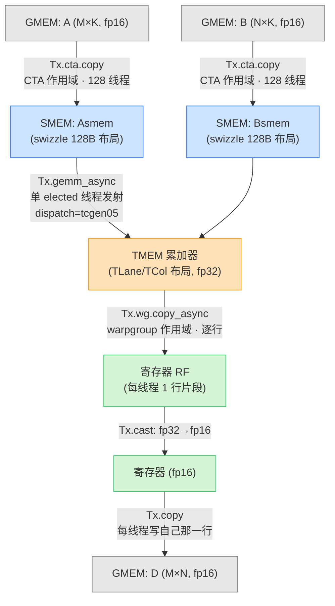
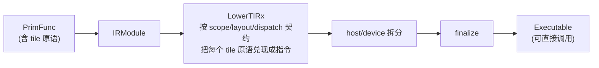

# 第 09 章 · TIRx 入门

> 原文:[Introduction to TIRx](https://mlc.ai/modern-gpu-programming-for-mlsys/chapter_intro_tirx/index.html)

> **本章要点(TL;DR)**
>
> - **TIRx(张量 IR neXt / Tensor IR neXt)** 是一种嵌在 Python 里的 DSL,专门用来在 **IR(中间表示)这一层** 写 GPU kernel。它的妙处在于:你照样能直接点名硬件——线程、SMEM、TMEM、屏障、`tcgen05` MMA 一个不少;但你点的这些东西,全都以**结构化 IR** 的样子存着,所以编译器看得懂,能帮你下降(lower)、检查、调度。
> - 一个 kernel 到底怎么跑,关键就那么几件事。TIRx 把它们**全摆到台面上**,归成三大设计要素:**作用域(scope)**——谁来干;**布局(layout)**——数据块放哪;**派发(dispatch)**——走哪条硬件路。
> - 整章就盯着一个**能跑的最小 GEMM**(只做一次 MMA):算一个 `128×128` 的输出 tile,公式是 `D = A·Bᵀ`,K=64,而且整个矩阵乘就用一句 `Tx.gemm_async` 写完。
> - 别看 kernel 小,三大要素它一个不落全演示到了。说白了,全书后面的章节,做的就是「把这三个要素放大到更大规模」这一件事。
> - 编译就一句 `tvm.compile(mod, target="cuda", tir_pipeline="tirx")`,核心的下降 pass 叫 `LowerTIRx`——它挨个把 tile 原语按各自的 scope/layout/dispatch 契约「兑现」成真指令。整个过程**对你不藏一点东西**:IR 能看,最后生成的 CUDA C 也能看。

> **前置知识**:读这一章前,最好先懂 GPU 的线程层级(grid → CTA/block → warpgroup → warp → 线程)、内存层级(GMEM/SMEM/寄存器,以及 Blackwell 上的 TMEM)、还有 Tensor Core / MMA 大概是干嘛的。没把握的话,先翻一下 [第 0 章 · 极简入门](./ch00_gpu_ml_primer.md)。本章会默认你已经认识这些词。

---

## 一、为什么需要 TIRx:把「隐藏的决策」翻到台面上

前面第一部分(Part I),我们把硬件**是什么**讲透了。可光认识硬件还不行——你想让它真干活,总得有个**写代码的法子**才行。

最直接的法子,就是裸写 CUDA 或者 PTX。事实上,不少高性能 kernel 就是这么手搓出来的。那它差在哪?**差在:决定这个 kernel 怎么跑的那几件关键事,在裸代码里你几乎看不出来。** 比如这几个问题:

- 哪些线程在执行某个操作?
- 每一块数据 tile 究竟住在哪个存储层级?
- 这条计算实际走的是哪条硬件路径(普通线程拷贝?TMA(硬件异步批量搬数据的引擎)?Tensor Core(专做矩阵乘的硬件单元)?)?

裸写 CUDA/PTX 的时候,这几个选择都散落在哪了呢?埋在 intrinsic 的一长串参数里,埋在手算的地址里,还有一堆「大家都这么写」的约定俗成里。于是就成了这样:别人来读你的代码,基本得靠「考古」,才能猜出你当初到底想干嘛。

那 TIRx 是怎么破这个局的?它没走「把硬件细节都藏起来、让你写得省心」那条路——那是高层框架的玩法。TIRx 偏不:**它照样让你直接点名硬件,但把上面那三类决策,从「藏在代码里」改成了「明明白白写在 IR 上」**。

> **关键**:一句话说清 TIRx 的思路——底层控制力一点不丢,同时还让编译器看得懂。道理很简单:决策只要明着写出来,编译器就能拿它去检查(check)、下降(lower)、调度(schedule)。

这三类决策,TIRx 给起了三个名字,后面整本书都会用到:

| 设计要素 | 它回答的问题 | 在代码里体现为 |
| --- | --- | --- |
| **作用域(scope)** | *谁(哪些线程)* 来执行这个操作? | CTA(一个线程块,见第 0 章)/ warpgroup(4 个 warp = 128 线程)/ 单个 elected 线程 等前缀与 guard |
| **布局(layout)** | 操作数 tile(大矩阵切出来的小方块)*住在哪里*、以什么方式排布? | SMEM(片上共享内存)的 swizzle 布局、TMEM 的 `TLane/TCol`、寄存器视图等 |
| **派发(dispatch)** | 走*哪条硬件路径* 执行? | `dispatch="tcgen05"`、拷贝是普通线程还是 TMA |

这三件事,本章不想干巴巴地讲概念。咱换个法子:**直接搬一个完整、能跑的 kernel 出来看**。先让它跑起来,再回头一行一行读,看看 scope、layout、dispatch 分别是怎么把这段代码捏成现在这样的,以及它最后又是怎么编出来的。

> **注意**:本章就盯着「一个 kernel + 三个要素」,故意把焦距收得很窄。这个 kernel 用到的张量布局模型,留到后面《TIRx 布局 API》专门讲;完整的语言特性,放在《TIRx 语言参考》里。

---

## 二、运行环境与依赖

想真把本章的例子跑起来,你得有一块 **Blackwell 架构的 GPU**(目标是 `sm_100a`,比如 B200)。TIRx 编译器是跟着 Apache TVM 一起发的,就在 wheel 包里的 `tvm.tirx` 模块,安装的时候记得配上 CUDA 版的 PyTorch:

```bash
pip install apache-tvm
```

装完跑一行命令,确认能正常 import 就行:

```bash
python -c "import tvm, tvm.tirx; print(tvm.__version__)"
```

> **注意**:这套环境配好,全书的例子都能跑。手头没有 Blackwell GPU 也别慌——代码是跑不了,但你完全可以当「阅读理解」来读。本章真正值钱的地方,本来就在于搞懂这一个 kernel 是怎么对应到 scope、layout、dispatch 上的。

---

## 三、第一个 kernel:单次 MMA 的 GEMM

咱要看的这个 kernel,是把 GEMM(通用矩阵乘 `C = A·B`)砍到不能再砍的最小版——可即便这么小,它还是刚好能驱动起一个 Tensor Core。规格很清楚:

- 计算**单个** `128 × 128` 的输出 tile;
- 公式为 `D = A · Bᵀ`,其中 `K = 64`;
- 整段计算从头到尾用**一个** `Tx.gemm_async` tile 操作表达。

### 3.1 「一个 tile 操作 ≠ 一条硬件指令」

这一点想明白了,你就抓住 TIRx 的价值了。`Tx.gemm_async` 看着就是「一句话」,可它**并不会**变成一条硬件指令。为啥?咱算笔账:

- 硬件 MMA(矩阵乘累加,Tensor Core 的核心操作)的 **K-atom(K 方向原子粒度)是 16**;
- 而我们这个 tile 的 `K = 64`;
- 所以编译器会把它下降成**一小串沿 K 步进的 `tcgen05.mma` 指令**(64 / 16 = 4 步)。

> **关键**:DSL 值钱的地方就在这儿——**你写的是「tile(数据块)」,不是「一串指令」**。怎么沿 K 拆、怎么生成对的 `tcgen05.mma` 序列,那都是编译器的活,程序员根本不用管。

光发一个 MMA 还不够,kernel 周边还得干一圈杂活。顺着数据流走一遍就清楚了:先把 SMEM(共享内存)和 TMEM(张量内存 / Tensor Memory)分配好,把 A、B 从 GMEM(全局内存)搬进 SMEM,接着把 tile MMA 发到 TMEM 累加器(accumulator,边算边累加结果的那块存储)里算,算完再经寄存器(RF)把结果读回来,最后写出去。

这 kernel 虽小,它可是后面《构建分块 GEMM》那条优化路上的**第 1 步(Step 1)**。到那一章,我们会带着完整讲解再回来找它。

### 3.2 起手式:统一的 import

每个 TIRx kernel 开头那几行 import 都大同小异,先扫一眼混个脸熟:

```python
import tvm
from tvm.script import tirx as T                  # T:TIRx 的核心命名空间(device_entry、Buffer、ptx 等)
from tvm.script.tirx import tile as Tx            # Tx:tile 级原语(cta.copy、gemm_async、wg.copy_async …)
from tvm.tirx.cuda.operator.tile_primitive.tma_utils import tma_shared_layout, SwizzleMode  # TMA/swizzle 布局工具
from tvm.tirx.layout import TileLayout, S, TLane, TCol, tid_in_wg  # 布局 DSL:命名轴 TLane/TCol、线程内索引 tid_in_wg
```

记住它们各管一摊就行:**`T` 管「语言/硬件层」**——入口声明、buffer、PTX intrinsic 这些;**`Tx` 管「tile 操作层」**——拷贝、矩阵乘这些;**`tvm.tirx.layout` 则是一套专门用来描述布局的小 DSL**。

### 3.3 kernel 的整体骨架

整个 kernel 被装进一个小 builder `hgemm_v1(M, N, K)` 里:你喂它一个问题规模,它吐给你一个 `PrimFunc`。本章挑的是 `M=N=128, K=64`,这个尺寸跑起来正好只有**一个输出 tile**。第一版能让你「一口气读完」,靠的就是这个小尺寸。

下面把它拆成几块,每块只摘最要紧的那几行(完整源码看原文)。

**(a) 数据类型与分块常量**

```python
a_type = b_type = d_type = tvm.DataType("float16")  # A/B/D 均为 fp16
acc_type = tvm.DataType("float32")                   # 累加器用 fp32(精度更高)

BLK_M, BLK_N, BLK_K = 128, 128, 64   # 一个 CTA 负责的输出分块大小
MMA_M, MMA_N, MMA_K = 128, 128, 16   # 仅作文档:硬件 MMA tile 形状,尤其 K-atom=16
```

> **注意**:`MMA_M/N/K` 在这儿纯粹是「注释」,就为了告诉你底层硬件那个 MMA tile 长啥样。它们**压根不会**传进 `gemm_async`——`gemm_async` 自己会**从操作数 tile 和累加器 tile 把 MMA 形状推出来**。既然用不上,后面几步索性就把这几个常量删了。这也透着 TIRx 的一点小脾气:**形状只要编译器能推出来,你就别手动喂。**

**(b) 为 A、B 准备 swizzled SMEM 布局**

```python
A_layout = tma_shared_layout(a_type, SwizzleMode.SWIZZLE_128B_ATOM, (BLK_M, BLK_K))
B_layout = tma_shared_layout(b_type, SwizzleMode.SWIZZLE_128B_ATOM, (BLK_N, BLK_K))
```

**布局(layout)** 这个要素,头一回露面就在这儿:A、B 在 SMEM 里用的是 **128B swizzle** 布局。Swizzle(混排,把数据在 SMEM 里打乱地址摆放)是干嘛使的?两件事:一来躲开 SMEM 的 bank 冲突(多个线程挤同一个存储体,被迫排队),二来满足 `tcgen05.mma` 对操作数怎么摆的要求。它到底怎么混排,《TIRx 布局 API》里会细说;眼下你记住一句话就够了:**这就是 `tcgen05.mma` 想要的布局。**

**(c) 进入 device 入口、计算线程坐标**

```python
@T.prim_func
def kernel(A: T.Buffer((M, K), a_type),
           B: T.Buffer((N, K), b_type),
           D: T.Buffer((M, N), d_type)):
    T.device_entry()                         # 声明这是 device 端 kernel 入口
    bx, by = T.cta_id([M // BLK_M, N // BLK_N])  # CTA 在网格中的二维坐标(本例 grid 为 1×1)
    wg_id   = T.warpgroup_id([1])            # 单 warpgroup → wg_id 恒为 0(下文未用)
    warp_id = T.warp_id_in_wg([4])           # warpgroup 内的 warp 编号(0~3)
    lane_id = T.lane_id([32])                # warp 内的 lane 编号(0~31)
```

> **关键**:这几行,就是**作用域(scope)** 的那套「坐标系」。`cta_id / warpgroup_id / warp_id_in_wg / lane_id`(lane = warp 内的线程编号,0~31)一层套一层,从「整个网格(grid,所有 CTA 的总集)」一路定位到「某一个线程」。后面凡是要判断「这活儿归谁干」(比如 `if warp_id == 0`),全靠这套坐标说话。
>
> 第一步故意让 `M` 等于 `BLK_M`、`N` 等于 `BLK_N`,这样 **grid 就是 1×1**,每个 CTA 的 tile 偏移 `(m_st, n_st)` 自然全是 0。要等到 Step 3 往后,才会把它扩到更大的 M/N。

**(d) SMEM 分配:用 pool 显式排布**

```python
pool = T.SMEMPool()                              # 共享内存「池」,手动管理偏移
tmem_addr = pool.alloc((1,), "uint32")           # 存放 TMEM 基址的一个槽
mma_bar   = pool.alloc((1,), "uint64", align=8)  # MMA 完成屏障(mbarrier),需 8B 对齐
pool.move_base_to(1024)                           # 把后续分配的基址移到 1024,给上面的元数据留位
Asmem = pool.alloc((BLK_M, BLK_K), a_type, layout=A_layout)  # A 的 SMEM,带 swizzle 布局
Bsmem = pool.alloc((BLK_N, BLK_K), b_type, layout=B_layout)  # B 的 SMEM,带 swizzle 布局
pool.commit()                                     # 提交,完成布局
```

这一段最能看出 TIRx「**直接点名硬件**」是个什么味儿:SMEM 不是背着你偷偷分配好的,而是你拿一个 `SMEMPool` 亲手摆出来的。还有个点要留意——`Asmem/Bsmem` 在分配的那一刻,就**绑上了上一步定义的那套 swizzle 布局**。布局这个要素,到这儿又落地了一回。

**(e) 屏障 + TMEM 初始化(只让 warp 0 干)**

```python
if warp_id == 0:                                  # 作用域收窄:只有 warp 0
    if lane_id == 0:                              # 再收窄:只有 lane 0
        T.ptx.mbarrier.init(mma_bar.ptr_to([0]), 1)         # 初始化 mbarrier,期望计数 1
    T.ptx.tcgen05.alloc(T.address_of(tmem_addr), n_cols=512, cta_group=1)  # 分配 TMEM(512 列)

T.ptx.fence.proxy_async("shared::cta")   # 异步代理 fence:保证后续异步操作看到 SMEM 写入
T.ptx.fence.mbarrier_init()              # mbarrier 初始化 fence
T.cuda.cta_sync()                        # CTA 内全员同步,确保初始化对所有线程可见
```

> **注意**:一看到 `T.ptx.*`,你就该知道:这是在**直接发 PTX intrinsic**。这正是 TIRx 和高层框架彻底分家的地方——`mbarrier`(异步操作完成时用来同步等待的内存屏障)、`tcgen05.alloc`、`fence` 这些底层概念,它一个都不躲,只不过把它们包成了结构化的、编译器看得懂的 IR 节点罢了。

**(f) 声明 TMEM 累加器视图**

```python
tmem = T.decl_buffer(
    (128, 512), "float32", scope="tmem", allocated_addr=tmem_addr[0],
    layout=TileLayout(S[(128, 512) : (1@TLane, 1@TCol)])   # 行→TLane,列→TCol
)
```

这一行,大概是**布局**要素最有代表性的一处了。TMEM 累加器是用 `TileLayout` 来描述的:128 行映射到 **`TLane`(lane 维)**,512 列映射到 **`TCol`(列维)**。

这里的 `TLane`/`TCol` 到底是啥?它们是 TIRx 专门给 TMEM 这种特殊存储起的名字,叫**命名轴 / named axes**。注意了:它们可不是你平时理解的那种「行」「列」,而是跟 Tensor Core 硬件布局一一对应的逻辑轴。

**(g) 加载:全员协作把 GMEM 拷到 SMEM**

```python
m_st = T.meta_var(bx * BLK_M)   # 本 CTA 的行偏移(本例为 0)
n_st = T.meta_var(by * BLK_N)   # 本 CTA 的列偏移(本例为 0)
phase_mma: T.int32 = 0          # mbarrier 的相位(phase)

Tx.cta.copy(Asmem[:, :], A[m_st:m_st + BLK_M, :])   # CTA 作用域拷贝:128 线程齐上
Tx.cta.copy(Bsmem[:, :], B[n_st:n_st + BLK_N, :])
T.cuda.cta_sync()                                    # 等所有拷贝完成
```

> **关键**:`Tx.cta.copy` 是 **CTA 作用域**的拷贝——CTA 里 128 个线程全员上,一块儿搬数据。这是 scope 要素的典型样本:同样是「拷贝」俩字,作用域一换,干活的线程是哪一群也跟着换了。

**(h) 计算:单个 elected 线程发射 MMA**

```python
if warp_id == 0:
    if T.ptx.elect_sync():                 # 在 warp 内「选举」出唯一一个线程
        Tx.gemm_async(
            tmem[:, :BLK_N], Asmem[:, :], Bsmem[:, :],
            accum=False,                   # 首次写入,不累加(覆盖)
            dispatch="tcgen05",            # 派发:走 Blackwell Tensor Core 路径
            cta_group=1
        )
        T.ptx.tcgen05.commit(mma_bar.ptr_to([0]), cta_group=1)  # 提交,完成后触发屏障

T.ptx.mbarrier.try_wait(mma_bar.ptr_to([0]), phase_mma)         # 等待 MMA 完成
```

这是**整段 kernel 的核心**,也是三要素难得同框的一幕。一个一个看:

- **scope**:`if warp_id == 0` 再加上 `elect_sync()`,意思就是由**选举出来的那一个线程**来发射。凭啥一个线程就够了?因为下降出来的每条 `tcgen05.mma`,本身就是一次**协作式(cooperative)** 的 MMA 启动——真正的计算是 Tensor Core 硬件一起完成的,软件这边只要派一个线程「点个火」启动它就行。
- **layout**:操作数 `Asmem/Bsmem` 走 swizzle SMEM 布局,累加器 `tmem` 走 `TLane/TCol` 布局——这些前面早铺好了。
- **dispatch**:`dispatch="tcgen05"`,明明白白选了 Blackwell Tensor Core 这条路。

**(i) 写回:TMEM → 寄存器 → GMEM**

```python
Dreg     = T.alloc_local((BLK_N,), acc_type)   # 寄存器中的 fp32 缓冲(每线程一行片段)
Dreg_f16 = T.alloc_local((BLK_N,), d_type)     # 转成 fp16 后的寄存器缓冲
Dreg_wg  = Dreg.view(128, BLK_N,
                     layout=TileLayout(S[(128, BLK_N) : (1@tid_in_wg, 1)]))  # 把 128 行映射到 warpgroup 内线程
Tx.wg.copy_async(Dreg_wg[:, :], tmem[:, :BLK_N])   # warpgroup 作用域:128 线程逐行从累加器读回到寄存器
T.ptx.tcgen05.wait.ld()                            # 等 TMEM load 完成
Tx.cast(Dreg_f16[:], Dreg[:])                      # fp32 → fp16
m_thr = T.meta_var(m_st + warp_id * 32 + lane_id)  # 每个线程负责的输出行号
Tx.copy(D[m_thr, n_st : n_st + BLK_N], Dreg_f16[:])  # 写回 GMEM
```

> **关键**:`Tx.wg.copy_async` 是 **warpgroup 作用域**——warpgroup 的 128 个线程把 TMEM 累加器**一行一行(row by row)** 读回来。这里的门道在 `Dreg_wg` 这个视图:它靠 `tid_in_wg` 把「行」对应到「warpgroup 里的某个线程」,于是**每个线程刚好分到一行片段(row fragment)**。这是 layout 和 scope 配合得最漂亮的一幕——布局回答「哪个线程拿哪一行」,作用域回答「这 128 个线程一块儿上」。

**(j) 释放 TMEM**

```python
T.cuda.cta_sync()
if warp_id == 0:
    T.ptx.tcgen05.relinquish_alloc_permit(cta_group=1)         # 交还分配许可
    T.ptx.tcgen05.dealloc(tmem_addr[0], n_cols=512, cta_group=1)  # 释放 TMEM
```

TMEM 这东西金贵,既然当初是你手动分配的,用完就得自己手动还回去——这又是「直接点名硬件」这股风格的一处体现。

### 3.4 整体数据流示意

读到这儿,各块代码都过了一遍,咱用一张图把它们串成一条完整的数据流(顺手标上每一段是谁在干活):



> **图说**:顺着这条数据流走,一共冒出来三种不一样的**作用域**——CTA 级拷贝(128 线程全员搬,GMEM→SMEM)、单个 elected 线程发射 MMA(协作式硬件 MMA,SMEM→TMEM)、warpgroup 级读回(128 线程逐行取累加器,TMEM→RF)。同一个 kernel 里,**不同的操作各挑各的作用域**,这就是 scope 要素活生生的样子。图里颜色是按存储层级分的:灰=GMEM、蓝=SMEM、橙=TMEM、绿=寄存器。

### 3.5 先跑起来:用 torch 对拍验证

在逐行细抠 kernel 之前,先干件让人踏实的事——确认它真能跑,而且算得对。流程很短:

```python
import torch

target = tvm.target.Target("cuda")     # 不必写死 sm_100a,arch 会从设备自动检测
device = torch.device('cuda')

M, N, K = 128, 128, 64
kernel = hgemm_v1(M, N, K)
with target:
    # tir_pipeline="tirx" 选定 TIRx 下降流水线;返回一个可直接调用的 Executable
    ex = tvm.compile(tvm.IRModule({"main": kernel}), target=target, tir_pipeline="tirx")

A_tensor = torch.randn(M, K, dtype=torch.float16, device=device)
B_tensor = torch.randn(N, K, dtype=torch.float16, device=device)
D_tensor = torch.zeros(M, N, dtype=torch.float16, device=device)

ex.mod(A_tensor, B_tensor, D_tensor)   # 直接吃 torch 张量,无需手工转换

D_ref = (A_tensor.float() @ B_tensor.float().T).half()      # torch 参考实现
torch.testing.assert_close(D_tensor, D_ref, rtol=2e-2, atol=1e-2)
print("PASS")
```

> **注意**:这段里有两个对开发者特别贴心的小设计。一是 **arch 自动探测**:你只写 `target="cuda"` 就够了,编译器会自己上设备上摸出 `sm_100a` 这类具体架构。二是 **`ex.mod(...)` 直接吃 torch 张量**,中间你不用手动转一道。还有一点,容差为啥给到 `rtol=2e-2, atol=1e-2` 这么松?因为 fp16 算起来本身就带数值误差,卡得太死反倒容易误判。

---

## 四、三要素回读:scope / layout / dispatch

kernel 跑通了,现在咱换个角度回头再读一遍,边读边问自己一个问题:**它每一行,到底「拍了什么板」?** 说白了,整个 kernel 不过就是沿着三个设计要素做的一连串选择。每个操作都在回答同样三个问题——*谁* 来跑、数据 *住哪*、*怎么* 执行——这三个答案,恰好就是 scope、layout、dispatch。

> **关键**:原文这块有个**交互演示**——你点一下 Scope / Layout / Dispatch 按钮,kernel 里归这个要素管的代码行就会高亮起来。静态笔记没法复现这个交互,不过下面三张表已经把「每个要素管哪几行」列清楚了,效果是一样的。

### 4.1 Scope:谁来执行?

| 操作 | 作用域 | 参与线程 | 为什么是这个作用域 |
| --- | --- | --- | --- |
| `Tx.cta.copy(...)` | **CTA** | 全部 128 线程 | GMEM→SMEM 是大批量搬运,全员一起上最快 |
| `Tx.gemm_async(...)` | **单个 elected 线程** | 1 个线程发起 | 下降出的每条 `tcgen05.mma` 本身就是**协作式 MMA 启动**,真正算的是 Tensor Core 硬件,软件派一个线程点火就够 |
| `Tx.wg.copy_async(...)` | **warpgroup** | warpgroup 的 128 线程 | TMEM 读回是按**行**切的,每个线程拿一行片段最顺 |

### 4.2 Layout:每块 tile 住在哪、怎么排?

| tile | 存储层级 | 布局 | 说明 |
| --- | --- | --- | --- |
| A、B 操作数 | SMEM | 128B **swizzle** 布局 | `tcgen05.mma` 想要的就是这个摆法,顺带躲开 bank 冲突 |
| 累加器 | TMEM | **`TLane` / `TCol`** 命名轴布局 | 跟 Tensor Core 硬件的累加布局一一对应 |
| 寄存器读回视图 `Dreg_wg` | RF | 行映射到 **`tid_in_wg`** | 让 warpgroup 里每个线程刚好「占一行」 |

### 4.3 Dispatch:走哪条硬件路径?

| 操作 | dispatch 选择 | 含义 |
| --- | --- | --- |
| `Tx.gemm_async(..., dispatch="tcgen05", ...)` | **`tcgen05`** | 走 Blackwell Tensor Core 这条路 |
| 拷贝操作(本章) | 普通线程拷贝 | 第一版就用最朴素的线程拷贝 |
| 拷贝操作(后续章节) | **TMA** | 后面的 GEMM 步骤会把拷贝换成 TMA,**可周围的 scope 和 layout 一点不动** |

> **关键**:dispatch 想换就换,这是 TIRx 的一大长处。想「换条硬件路」(比如线程拷贝 → TMA)?这是个**局部、正交**的小改动:只动 dispatch,作用域不碰,布局也不碰。正因为「三要素互不打架」这个设计,kernel 从第一版一路升级到生产级,才能拆成一小步一小步稳稳地走,而不是每次都推倒重来。

> **动手练(让你的 agent 搭把手)**:从第一个 kernel 里挑三行——一行拷贝、一行 MMA、一行 TMEM 读回。让 agent 给每行贴上 scope / layout / dispatch 三个标签,然后你对着代码里的 guard(像 `if warp_id == 0`)、buffer 布局、还有 `dispatch=` 参数,核一核它贴得对不对。

---

## 五、编译是怎么发生的

其实前面跑测试那会儿,已经悄悄编译过一次了。这里咱凑近瞧瞧,那一步背后到底干了啥。做法很短:把 `PrimFunc` 塞进 `IRModule`,扔给 `tvm.compile(...)` 就完事:

```python
target = tvm.target.Target("cuda")
ex = tvm.compile(tvm.IRModule({"main": kernel}), target=target, tir_pipeline="tirx")
```

`tir_pipeline="tirx"` 这个参数,启动的就是 **TIRx 下降流水线**。它的核心 pass 是 **`LowerTIRx`**:



- **`LowerTIRx`** 才是真正的主角:它一个一个啃 tile 原语,读懂每个原语的 **scope / layout / dispatch 契约**。换句话说,**前面咱聊的那三个设计要素,就是在这一步被「兑现」成一条条真指令的**(比如 `Tx.gemm_async`,正是在这儿被展开成沿 K 步进的 `tcgen05.mma` 序列)。
- 再往后是两步常规活儿:**host/device 拆分** 加一个 **finalize**,最后产出一个能直接启动的模块。
- 顺带提一句,你也可以把 `tvm.compile` 写在 `with target:` 块里头,这样 kernel 会自动继承外层的 target 上下文,target 就不用再传一遍了。

### 5.1 一切都可检视

这套流程有个特别招人喜欢的脾气:**它对你不藏一点东西**。编译结果你能从**两个层级**上看:

```python
kernel.show()                              # 漂亮打印 TIRx(TVMScript 形式)
print(kernel.script())                     # 同上,但返回字符串

# 看编译器最终吐出的 CUDA C 源码:
print(ex.mod.imports[0].inspect_source())
```

> **注意**:这种「**往上能读 IR,往下能读生成的 CUDA C**」的透明度,不管是调 bug 还是学东西,都太管用了——高层的意图(IR)你看得到,它最后落成啥样的底层代码,你照样看得到。本节只是个「速写」;完整的下降故事(所有 pass、tile 原语的 dispatch 怎么解析、host/device 怎么拆)留到《编译器内部》那一章再讲。

---

## 六、接下来去哪

就这么一个 kernel,已经够咱认全 scope、layout、dispatch 了,还顺手看着它编译、跑起来。那接下来去哪?这三个设计要素,加上 kernel 本身,各自都拽出了一个后续章节:

| 后续章节 | 内容 | 什么时候去看 |
| --- | --- | --- |
| **TIRx 布局 API** | `TileLayout`、命名轴、swizzle 这套张量布局模型——本章 A/B/累加器怎么摆,全建在它上面 | 要是你觉得 layout 是三要素里最摸不透的一个,就从这儿入手 |
| **TIRx 语言参考** | 完整的语言特性:解析器工具、数据类型、buffer 与内存、控制流、线程同步 | 当你想要一本完整的「词典」,而不只是「导览」时 |
| **构建分块 GEMM** | 把本章 kernel 当 Step 1,一路加上 K 循环累加、空间分块、TMA、warp 专门化(warp specialization),最后建成真正能用的 kernel | 想看同样这三个要素怎么扩到生产级 kernel?这是最顺的下一站 |

---

## 小结

- **TIRx 是一种「IR 层级」的 GPU 编程 DSL**:它特别在哪?一边**照样让你直接点名硬件**(线程、SMEM、TMEM、屏障、`tcgen05` MMA),一边又把决定 kernel 怎么跑的那几个关键决策抬到**结构化 IR** 上,这样编译器才有得检查、有得下降、有得调度。
- 全章的认知抓手,就是 **scope / layout / dispatch 三大设计要素**:分别回答「谁来干」「数据住哪」「走哪条硬件路」。这三个问题抓住了,你就有了一把通读任意 TIRx kernel 的万能钥匙。
- 一个**只做一次 MMA 的最小 GEMM**,就把三要素一次性演全了:`Tx.cta.copy`(CTA 作用域加载)→ `Tx.gemm_async(dispatch="tcgen05")`(单线程发射、走 tcgen05 路径)→ `Tx.wg.copy_async`(warpgroup 逐行读回)。
- **核心思路是「写 tile,不写指令」**:`Tx.gemm_async` 就一句,`LowerTIRx` 会沿 K-atom=16 把它展成好几条 `tcgen05.mma`——这些你一条都不用手写。
- **三要素互不打架**,正是 TIRx 好演进的根子:后面想把线程拷贝换成 TMA,只动 dispatch 就行,scope 和 layout 一个都不用动。
- 编译流程 `tvm.compile(..., tir_pipeline="tirx")` **全程透明**:IR 能看(`.show()` / `.script()`),生成的 CUDA C 也能看(`inspect_source()`)。
- 说到底,本书后面那些章节,干的就是一件事——把这一个 kernel 里的三个要素「放大到真实规模」。

## 延伸阅读

- 原文章节:[Introduction to TIRx](https://mlc.ai/modern-gpu-programming-for-mlsys/chapter_intro_tirx/index.html)
- 全书主页:[Modern GPU Programming for MLSys](https://mlc.ai/modern-gpu-programming-for-mlsys/)
- 相关后续章节(原书内):TIRx 布局 API、TIRx 语言参考、构建分块 GEMM、编译器内部
- 原书的交互演示(Scope/Layout/Dispatch 行高亮)无法在本笔记中复现,**建议直接到原文页面体验**。

## 术语对照

| 中文 | English | 说明 |
| --- | --- | --- |
| 张量 IR neXt | TIRx (Tensor IR neXt) | 本章主角:IR 层级的 GPU 编程 Python DSL |
| 作用域 | scope | 三要素之一:哪些线程执行某操作 |
| 布局 | layout | 三要素之一:tile 数据住在哪、怎么排 |
| 派发 | dispatch | 三要素之一:走哪条硬件路径 |
| 中间表示 | IR (Intermediate Representation) | 编译器可处理的结构化程序表示 |
| 下降 | lower / lowering | 把高层 IR 翻译为更低层指令的过程 |
| 共享内存 | SMEM (Shared Memory) | CTA 内共享的片上内存 |
| 张量内存 | TMEM (Tensor Memory) | Blackwell 上专供 Tensor Core 累加的内存 |
| 全局内存 | GMEM (Global Memory) | 设备全局显存 |
| 寄存器文件 | RF (Register File) | 每线程私有寄存器 |
| 线程块 | CTA (Cooperative Thread Array) | 一组协作线程,对应 CUDA block |
| warp 组 | warpgroup | 4 个 warp(128 线程)组成的协作单元 |
| 线程束 | warp | 32 个 lane 组成的执行单元 |
| 通用矩阵乘 | GEMM | General Matrix Multiply |
| 矩阵乘累加 | MMA (Matrix Multiply-Accumulate) | Tensor Core 的核心操作 |
| Blackwell Tensor Core 路径 | tcgen05 | 第 5 代 Tensor Core 指令族(`tcgen05.mma` 等) |
| 混排 / 搅动 | swizzle | SMEM 地址重排,避免 bank 冲突 |
| 命名轴 | named axes (TLane / TCol) | 布局 DSL 中与硬件对应的逻辑轴 |
| 协作式 | cooperative | 一条指令由整组线程协同完成 |
| 屏障 | mbarrier | 异步操作完成同步的内存屏障 |
| 张量内存访问 | TMA (Tensor Memory Accelerator) | 硬件异步批量拷贝引擎 |
| warp 专门化 | warp specialization | 让不同 warp 承担不同角色的优化手法 |
