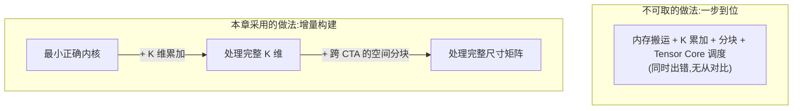
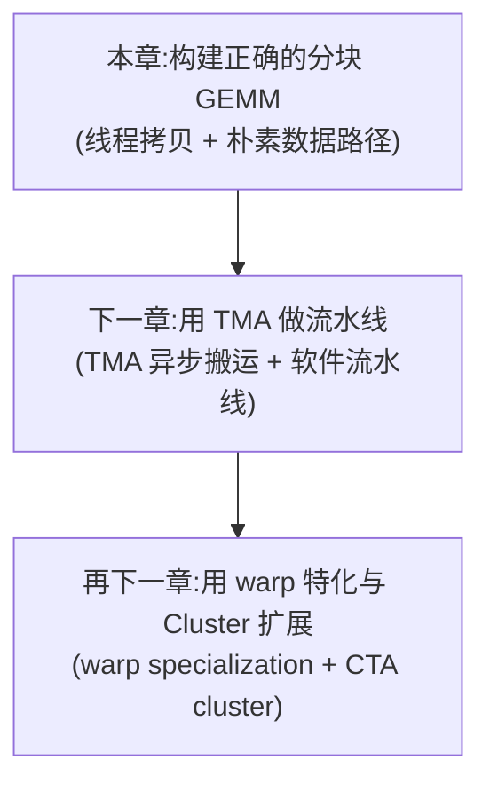
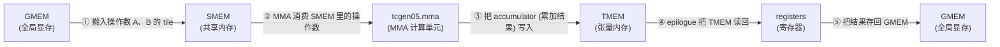
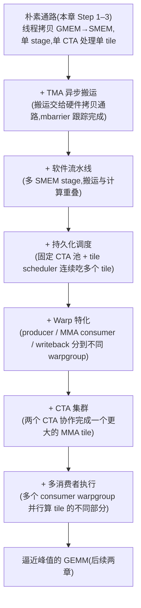
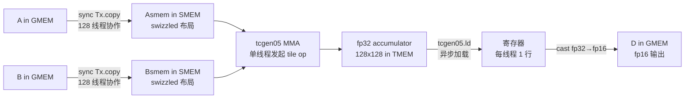
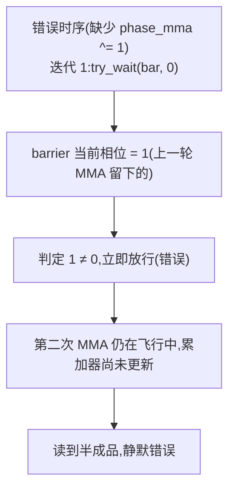
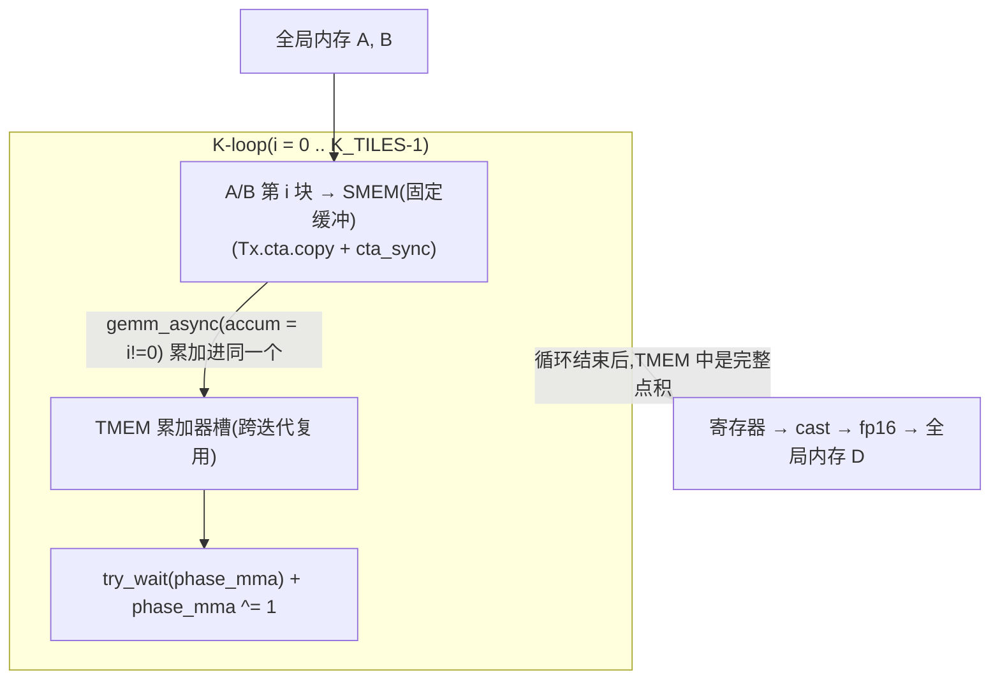
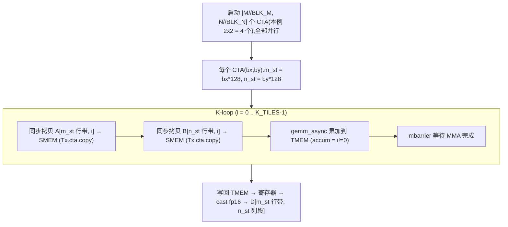

# 第 11 章 · 构建分块 GEMM(Step 1–3)

> 原文:[构建分块 GEMM(Step 1–3)](https://mlc.ai/modern-gpu-programming-for-mlsys/chapter_gemm_basics/index.html)

> **本章要点(TL;DR)**
>
> - GEMM($D = A B^{\top}$)是几乎所有深度学习算子的底层原语;本章只追求**正确**,性能留给后两章,先建立一个可信的基线(baseline)。
> - 采用「一次只改一个决策」的增量式构建:Step 1 单 Tile 顺序 GEMM 建立基线契约,Step 2 加 K 维循环累加,Step 3 用多 CTA 网格做空间分块。
> - 把每一步都读成对同一份「契约三要素」的编辑——**scope(由谁执行)/ layout(操作数 tile 布局)/ dispatch(走哪条派发路径)**,大多数步骤只动其中一项。
> - 基线数据通路恒定不变:`GMEM → SMEM → tcgen05.mma → TMEM → 寄存器 → GMEM`;后续优化只改「每一跳怎么做得更高效」,从不增删跳本身。
> - 两个最隐蔽的正确性陷阱:协作拷贝后 MMA 读 SMEM 前必须 `cta_sync`(等齐 + 发布写入);复用 mbarrier 时 K 循环里必须 `phase_mma ^= 1`,否则 `try_wait` 会提前放行,**静默**算错。
> - 累加器在 TMEM 中用 fp32 保存「运行和」压住舍入误差,写回时才收窄(cast)为 fp16;Step 3 暂不复用相邻 CTA 的 operand,带宽浪费留待持久化调度解决。

> **前置知识**:读这一章前,最好先懂 GPU 的执行/存储层级(warp、CTA、SM、SMEM/GMEM)和矩阵乘法的基本概念(GEMM、tile、MMA、Tensor Core)。没把握的话,先翻一下 [第 0 章 · 极简入门](./ch00_gpu_ml_primer.md),以及第 9 章的 TIRx scope / layout / dispatch 模型。本章会默认你已经认识这些词。

## 本章导读:从一个正确的 Tile 开始(Building a Tiled GEMM)

这一章是整本书的转折点。前面几章一直在讲抽象——TIRx 的 scope / layout / dispatch 这套模型。从这里开始,我们要动真格的:把这套模型落到一个真实的内核(kernel)上,亲手写出第一个**正确的分块 GEMM(tiled GEMM)**。

### 为什么整本书都围着 GEMM 转

GEMM(通用矩阵乘法 / General Matrix Multiplication)是现代机器学习里最核心的一个计算。你看,线性层、注意力里的各种投影、还有一大堆卷积的实现,扒到底层全是一次矩阵乘法。说白了,GPU 上的时间,绝大部分都花在 GEMM 上。

正因为它这么重要,「算得对的 GEMM」和「算得快的 GEMM」之间的差距就特别要命。这个差距是什么?其实就是「让芯片大半算力干等着」和「把芯片喂得饱饱的」之间的差距。同样一段乘法,写得好能把硬件榨干,写得差就让 Tensor Core(GPU 里专做矩阵乘加的硬件单元,见第 0 章)大量闲着。

> **注意**：本章的目标只有一个字——**对**。性能(performance)留给后面两章。这里我们要的,是一个能算出正确答案的最小可信基线(baseline)。

### 为什么不一步到位,而要分步搭建

一个能跑满硬件的 GEMM 内核,会一下子把好几件难事全压你身上:内存搬运、K 维累加、分块(tiling)、还有 Tensor Core 的调度。一上来就写这种内核,等于逼你**同时调试这一整套东西**。更要命的是,你手里连个可信的对照都没有,真出了错,根本说不清是哪一环坏的。

所以更稳的走法是:先从「能算对的最小内核」开始,然后**一次只改一个决策**,慢慢往上长。每一步只动一个地方,一出问题就知道准是这步引进来的。这种一点一点搭起来的做法,就是本章——乃至后面两章——从头到尾的套路。



### 本章的三步路线图

本章从一个 128 × 128 的输出 tile(大矩阵切出来的小方块,见[术语对照表](./术语对照表.md))起步,一步步长成能算完整尺寸矩阵的内核。三步各管一摊:

| 步骤 | 名称 | 引入的核心变化 |
| --- | --- | --- |
| Step 1 | 单 Tile 顺序 GEMM | 只算**一个**输出 tile,建立后续一切修改所基于的基线 |
| Step 2 | K 维循环累加 | 增加沿 K 维度的循环累加,处理完整的收缩(contraction)维度 |
| Step 3 | 跨 CTA 的空间分块 | 在多个 CTA(Cooperative Thread Array,一组协作的线程 / 即线程块,共享 SMEM,见第 0 章)之间做空间分块,覆盖完整矩阵 |

Step 1 搭的是基线,后面每一步都只是在它上面「改一个地方」而已。

### 把每一步读成「对一份契约的编辑」

理解这条路线,有个特别好使的角度:把每一步都当成在改**同一份契约(contract)**。这份契约说白了就三条:

| 条款 | 含义 |
| --- | --- |
| scope(作用域) | 哪个执行单位来跑这个操作 |
| layout(布局) | 操作数 tile 使用哪种布局 |
| dispatch(分派) | 走哪条分派路径来真正执行它 |

大多数步骤,主要也就动这三条里的**一条**。所以本章每一步开头,我都会先给你一张小卡片,点明这步到底改了哪一条,顺带把「想安全复用,还得补哪些同步」标清楚。

> **注意**：「scope / layout / dispatch」这条主线,会一路贯穿到后面两章。你要是把每个新内核都读成「它在上一个内核上改了契约里的哪一条」,会比把它当成一个全新内核轻松太多。

### 本章在三章优化路径中的位置

本章是「同一条 GEMM 优化路径」三连章里的**头一章**。这三章共用一个内核,一层叠一层、特性越加越多,而不是每章都推倒重来:



- **本章**:把一个正确的分块内核搭出来,然后**就停手**——性能一概不碰。
- **下一章(用 TMA 做 GEMM 流水线)**:把朴素的线程拷贝换成 TMA(Tensor Memory Accelerator,一个专管异步搬数据的硬件单元,不占线程),再用流水线(pipelining,让搬数据和算数据这两件事在时间上叠着干、不互相干等)让搬数据和算数据重叠起来。
- **再下一章(用 Warp 特化与 Cluster 扩展 GEMM)**:再往上加 warp 特化(warp specialization,让不同的 warp 各干一种活,如搬数据 / 算 / 写回分开)和 CTA cluster(把多个 CTA 编成一组协作的「集群」)。

每一章都踩在前一章的肩膀上,内核一路**攒特性**,而不是从零再来一遍。这就是「一次改一个决策」放大到章节这个尺度的样子。
## GEMM:问题定义与数据通路(GEMM)

GEMM 就是稠密矩阵相乘,它埋在几乎每一个深度学习算子的底下。线性层、注意力里的各种投影、很多卷积的实现,扒到最后都是一次矩阵乘法。正因为它无处不在,**只要把 GEMM kernel 写快,好处就会摊到整个模型上**——这也正是本章要从零搭一个分块 GEMM 的理由。

### 本章采用的形状约定

本教程的所有例子都算 $D = A B^{\top}$,三个矩阵的形状和元素定义如下:

| 矩阵 | 形状 | 含义 |
| --- | --- | --- |
| $A$ | $M \times K$ | 左操作数(operand) |
| $B$ | $N \times K$ | 右操作数 |
| $D$ | $M \times N$ | 输出(accumulator 最终写出的结果) |

逐元素的定义是沿着收缩维 $K$ 求和:

$$ D[m,n] = \sum_{k} A[m,k] \cdot B[n,k] $$

> **注意**:这个转置 $B^{\top}$,**不是我们额外多做的一步**,它是数据本来就那么存出来的结果。看 $B$ 的形状:$N \times K$,也就是「$N$ 行,每行 $K$ 个数」。这恰好就是线性层权重平时的摆法。所以沿 $K$ 维做收缩时,顺着内存把 $B$ 读下来,读到的天然就是 $B^{\top}$,**根本不用挪一个字节**。换句话说,选 $D = A B^{\top}$ 这个写法,是为了贴着真实权重布局、让访存顺手,而不是平白多算一次转置。

### 性能度量:TFLOPS

全书衡量一个 kernel 快不快,统一看吞吐量 **TFLOPS**(每秒万亿次浮点运算)。算法很简单:一次「乘加」记 **2** 次浮点运算(乘一次、加一次),再拿总浮点运算量除以墙钟时间(wall-clock time):

$$ \text{TFLOPS} = \frac{2 \times M \times N \times K}{t_{\text{seconds}} \times 10^{12}} $$

这个公式有几个点值得记住:

- 分子 $2 \times M \times N \times K$ 是**算法本身定死的浮点运算量**,只跟问题多大有关,你 kernel 怎么写它都不变。
- 分母里能动的只有 $t_{\text{seconds}}$ 这一个量。所以后面所有优化,归根结底都是一件事:**同样多的运算,用更短的时间跑完**,TFLOPS 自然就上去了。
- 至于除以 $10^{12}$,纯粹是把单位从 FLOPS 换成 TFLOPS。

### GEMM 数据通路(GEMM Data Path)

本章后面**每一项优化,说到底都在回答两个问题:数据现在待在哪块存储里,以及它怎么搬过去**。所以动手写代码之前,先把数据流捋清楚,绝对值得。

往大处看,Blackwell(NVIDIA 的一代 GPU 架构,本章代码即面向它;前几代是 Hopper、Ampere)上的一个 GEMM kernel 翻来覆去就干两件事:

1. **搬(move)**:在不同层级的存储之间搬 tile(数据分块);
2. **算(compute)**:对搬进来的 tile 做矩阵乘累加。

下面这张图,跟着一个 tile 从输入一路走到输出,把它路过的每一层存储都标出来。这是一条**基线(baseline)通路**。后面每一步优化,改的都只是这条链上「某一跳具体怎么走」,但**这些跳本身,一个都不增、一个都不删**。



把这条从左到右的链记死,它的关键节点是:

| 阶段 | 动作 | 源 → 目的地 |
| --- | --- | --- |
| ① 加载操作数 | 操作数 tile 进片上 | GMEM → SMEM |
| ② MMA 计算 | `tcgen05.mma` 消费 SMEM 里的操作数 | SMEM → MMA 单元 |
| ③ 写累加器 | MMA 把累加结果(accumulator)写进张量内存 | MMA 单元 → TMEM |
| ④ epilogue(尾处理) | 把累加结果读回寄存器 | TMEM → 寄存器 |
| ⑤ 存回结果 | 输出写回全局显存 | 寄存器 → GMEM |

这里冒出来的几个名词,后面会反复用,先有个直观印象:

- **GMEM / 全局显存**:容量最大、离计算最远、带宽也最吃紧,输入和最终输出都放它这儿。
- **SMEM / 共享内存**:CTA(线程块 / Cooperative Thread Array)内部共享的片上高速存储,操作数 tile 先搬到这儿,MMA 才好读。
- **`tcgen05.mma`**:Blackwell 上跑 MMA(矩阵乘累加 / Matrix Multiply-Accumulate)的指令,真正干乘加活的就是它。
- **TMEM / 张量内存(Tensor Memory)**:Blackwell 新加的一层存储,专门放 MMA 累加器,MMA 算完的结果直接写这里。
- **epilogue / 尾处理段**:kernel 收尾的那一段,负责把 TMEM 里的累加结果搬回寄存器(顺手做点缩放、激活之类),再写出到 GMEM。

> **注意**:后面 Step 1 / Step 2 / Step 3 的所有优化,都不会动「GMEM → SMEM → MMA → TMEM → 寄存器 → GMEM」这条链的整体形状。它们改的只是**每一跳怎么走得更快**——比如换 TMA 异步搬、用 mbarrier 搭流水线、让多个 CTA 在空间上分担。先把这条不变的主干刻进脑子,再看每一步在哪一跳上做文章,一下就清楚了。
## 优化路线图(Optimization Path)

前面讲的那条「朴素数据通路(plain data path)」——把操作数从 GMEM 搬到 SMEM、用 Tensor Core 算出来、再写回 GMEM——确实能算出**对**的答案。可对不等于快。这条最省事的通路,几乎让整块芯片都在干等:搬数据的时候计算单元闲着,算数据的时候拷贝引擎闲着,大半硬件都没喂饱。

接下来要干的,说白了就是:在「数据要走哪几层内存」这条主链不动的前提下,一项一项把 Blackwell 的硬件本事补齐,每次只加一个特性,把那些空转的硬件填满。**每个特性都对应一个 TIRx 的 tile primitive(tile 原语)**。这样就不用从零重写 kernel,只在同一份代码上「一次改一处」地往前推。

> **注意**:这一小节其实是后面两章的「目录预览」。本章(Step 1–3)只管把正确的分块 GEMM 搭出来;下面这六个优化特性,会在《用 TMA 做 GEMM 流水线》和《用 warp 特化与 cluster 扩展 GEMM》里一个一个落地。读到这儿,你心里有个「接下来往哪走」的地图就够了。

### 为什么要分步走,而不是一步到位

朴素通路最大的好处,是它**靠得住**:它给的是一个正确结果,后面所有优化都拿它当对照基准(ground truth)。要是一上来就写个能跑满芯片的 kernel,你就得同时盯着内存搬运、累加、分块、Tensor Core 调度这一大坨,而且手里连个可信的参照都没有,错了都不知道找谁对。

所以这里的打法是:**先弄一个能算对的最小 kernel,然后每次只加一个特性**。每加一项,都能单独验两件事——「它有没有把答案搞坏」「它有没有带来该有的提速」。问题被圈在一个小范围里,排查起来才不抓瞎。

### 六个优化特性概览

下面这六项,按加入的先后排好,正是后面两章要走的路。它们是一层叠一层,不是谁替换谁:

| 顺序 | 特性 | 核心作用 | 解决的问题 |
| --- | --- | --- | --- |
| 1 | **TMA 异步搬运(TMA async movement)** | 用 Blackwell 的硬件拷贝通路在 GMEM ↔ SMEM 之间搬运 tile,并用 mbarrier 跟踪拷贝完成 | 让数据搬运不再占用线程,可与计算解耦 |
| 2 | **软件流水线(Software pipelining)** | 用多个 SMEM stage(多缓冲),让"取下一个 K tile"与"对当前 K tile 做 Tensor Core 计算"在时间上重叠 | 消除"搬完才能算、算完才能搬"的串行等待 |
| 3 | **持久化调度(Persistent scheduling)** | 维持一个固定数量的 CTA 池,每个 CTA 通过 tile scheduler 连续处理多个输出 tile,而不是"一个 tile 启动一个 CTA" | 减少 CTA 启动/销毁开销,提高占用率 |
| 4 | **Warp 特化(Warp specialization)** | 把生产者(producer)、MMA 消费者(MMA consumer)、写回(writeback)三种角色拆分到不同的 warpgroup 上 | 让不同职责的 warp 各司其职、并行流转 |
| 5 | **CTA 集群(CTA clusters)** | 让两个 CTA 协作,共同处理一个更大的 Blackwell MMA tile | 突破单 CTA 的 tile 规模上限,提升单次 MMA 的有效尺寸 |
| 6 | **多消费者执行(Multi-consumer execution)** | 用多个消费者 warpgroup 同时计算 tile 的不同部分 | 进一步提高计算密度(compute density),榨干 Tensor Core |

### 这些特性是如何叠加的

这六项,你可以当成对同一条数据通路的「一层层加料」。从最素的「线程拷贝 + 单 stage + 单 CTA 单 tile」起步,一路堆到「硬件异步搬运 + 多缓冲流水 + 持久化 + 角色特化 + 跨 CTA 协作 + 多消费者并行」:



> **注意**:整条路线都绕着同一组「契约三要素」转——**scope(谁来执行)、layout(操作数 tile 用什么布局)、dispatch(走哪条派发路径)**。后面每一步,基本都只是在这份契约上改一处:动一个主要的点,再顺带交代「为了安全复用还得补哪些同步」。本章的 Step 1 负责把这份契约的**基线版本**立起来,之后的优化全是在这个基线上「打补丁」。
## 第 1 步:单 Tile 顺序 GEMM(Step 1: Sequential Single-Tile GEMM)

从零搭一个 GEMM,聪明的做法不是一上来就奔着高性能去,而是先写一个**能把整条硬件数据通路完整跑一遍、却简单到一个循环都没有**的版本。Step 1 就是这么个「最小可运行内核」:它只算**一个** 128 × 128 的输出 tile,K 也只有 64。规模小到什么都不用循环——数据通路上的每一段(GMEM、SMEM、TMEM、寄存器)都恰好只出现一次。这样我们就能把每一跳(hop)单独看个明白,不必同时跟循环、流水线缠在一起。

### 这一步确立了什么:基线契约

写代码之前,先把这个内核的「形状」说定。它定下来的,就是后面每一步都要沿用的基线(baseline):

| 维度 | 约定 |
|------|------|
| 范围(Scope) | 单个 warpgroup(4 个 warp = 128 个线程组成的执行单位;一个 warp 是 32 个线程的小班,见第 0 章)**顺序地**走完整条通路,一个阶段接一个阶段,中间不重叠 |
| 数据布局(Layout) | A、B 两个操作数 tile 放在 SMEM;累加器(accumulator)放在 TMEM;结果经由寄存器(register)暂存后写回 |
| 派发方式(Dispatch) | 同步的 `Tx.copy` 负责搬运数据;`tcgen05` 负责执行 MMA(矩阵乘加) |

> **注意**:这里特意挑了「同步搬运 + 顺序执行」,而不是 TMA / 流水线。就是想先把**正确性**和**数据通路的全貌**讲透。性能优化是后面一项一项加的,不归 Step 1 管。

### 单 Tile 的数据流向(Single-Tile Dataflow)

基线契约定好之后,下一件要钉死的,是**一个 tile 沿这条通路走的先后顺序**。第一个内核把核心 GEMM 数据通路完整走一遍——也就是经典的 `GMEM → SMEM → TMEM → 寄存器 → GMEM`——外面**一个循环都不套**。它先分配工作内存,加载操作数,算出乘积,写回结果,最后收拾干净走人。

整个流程长这样:



对应的五步是:

1. **分配(Allocate)**:开出 SMEM(用 pool allocator 池式分配器)、TMEM(`tcgen05.alloc`),再加一个 mbarrier(内存屏障)。
2. **加载(Load)**:128 个线程**一起协作**,把 A、B 两个 tile 从 GMEM 拷到 SMEM(同步 `Tx.copy`)。
3. **计算(Compute)**:挑**一个线程**出来发起 `Tx.gemm_async` + `tcgen05.commit`;其他所有线程在 mbarrier 上等结果出来。
4. **写回(Writeback)**:warpgroup 把结果从 TMEM 读进寄存器;每个线程把 fp32 转(cast)成 fp16,再写到 GMEM。
5. **释放(Deallocate)**:把 TMEM 还回去。

### 第一个内核的四个部件(Four Pieces)

完整内核就几十行,但拆成四块来读更好啃:**内存分配、同步加载、MMA 派发、写回**。这里用到的 API,名字全来自 Part II 讲过的 TIRx tile primitive(分块原语)。

#### 部件一:内存分配

内核一开头,先给操作数划出共享内存,再给 TMEM 地址和 mbarrier 各留一个槽位:

```python
pool = T.SMEMPool()
tmem_addr = pool.alloc((1,), "uint32")           # 存 TMEM 地址(4 字节)
mma_bar = pool.alloc((1,), "uint64", align=8)    # mbarrier(8 字节,需 8 字节对齐)
pool.move_base_to(1024)                           # 把基址推到偏移 1024
Asmem = pool.alloc((BLK_M, BLK_K), a_type, layout=A_layout)  # 128×64 fp16
Bsmem = pool.alloc((BLK_N, BLK_K), b_type, layout=B_layout)  # 128×64 fp16
pool.commit()
```

这里有两个细节,值得多想一下:

- **`pool.move_base_to(1024)` 为什么要「跳到偏移 1024」?** 它把两块大的操作数 tile(`Asmem`、`Bsmem`)推到 1024 这个偏移之后,把前面的低地址区留给那几个小元数据(TMEM 地址槽、mbarrier)。为什么非这么干?因为 TMA 和 `tcgen05.mma` 对操作数的对齐有讲究,这么大的操作数 tile,必须落在一个干净的边界上。
- **`layout=A_layout` 为什么非得是 swizzled(交错)布局?** 它向 `tma_shared_layout` 要的,是一种 swizzle 过的 SMEM 摆法,这样 TMA 和 `tcgen05.mma` 都能**直接读**。这正是 Part II 一再强调的「布局即契约(layout-as-contract)」:布局不是随便摆的,它得同时对上搬运硬件和计算硬件的格式胃口。

#### 部件二:同步加载

缓冲区开好了,操作数还得真搬进 SMEM。第一版,我们就让 CTA(协作线程阵列 / Cooperative Thread Array)自己的线程去拷:

```python
Tx.cta.copy(Asmem[:, :], A[:, :])  # CTA 全体协作,各线程负责自己那一片
Tx.cta.copy(Bsmem[:, :], B[:, :])
T.cuda.cta_sync()                  # 既等所有线程拷完,又发布它们的 SMEM 写入
```

因为这里就一个 tile(M = N = 128,K = 64),把整个 A 和 B 拷过去,加载就算干完了。`Tx.cta.copy(...)` 让整个 CTA 一起协作拷,**每个线程管自己那一片**。

紧跟着的 `T.cuda.cta_sync()` 一身二职:它既**等**每个线程都拷完,又把它们写进共享内存的内容**发布(publish)**出去。这样后面 MMA 去读 `Asmem`、`Bsmem` 时,看到的才是一个填满的完整 tile,而不是只填了一半的缓冲区。

> **注意**:这种「线程自己来拷」的做法,是我们**头一个要换掉**的东西。下一章(用 TMA 做 GEMM 流水线)就把它换成 TMA。这里先留着它,纯粹是为了让 Step 1 简单直白。

#### 部件三:MMA 派发

操作数现在已经躺在 SMEM 里了,可以发起 MMA 了。注意:发起它的,只用**挑出来的那一个线程**:

```python
if warp_id == 0:                       # 外层:只保留 warpgroup 里的 warp 0
    if T.ptx.elect_sync():             # 内层:在该 warp 里再选出唯一一个活跃 lane
        Tx.gemm_async(tmem[:, :BLK_N], Asmem[:, :], Bsmem[:, :],
                      accum=False, dispatch="tcgen05", cta_group=1)
        T.ptx.tcgen05.commit(mma_bar.ptr_to([0]), cta_group=1)
```

这两层嵌套的 if,是在一层层把「发起者」往小里掐:外层 `if warp_id == 0` 先只留下 warpgroup 的 warp 0,内层 `if T.ptx.elect_sync()` 再在这个 warp 里挑出唯一一个活跃 lane(线程)。两层一叠,最后**就剩一个线程**去跑 `Tx.gemm_async` 和 `tcgen05.commit`。

这里有个特别容易理解错的地方,得先掰开说清楚:

> **注意**:**「一个线程发起」绝不等于「一个线程在做乘法」。** 计算照样是一个完整的、tile 级别的 MMA。硬件会照着 SMEM 操作数布局和 TMEM 累加器布局,**一起协作**把整个 tile 的乘法做掉。关键就一句:`Tx.gemm_async` 是一个 **tile 操作(tile operation)**,不是**一条硬件指令**。

为什么这么说?因为 K = 64 的 tile,比硬件 MMA 的 K 原子(`MMA_K = 16`)宽多了。所以这**一个** tile op 会被降级(lower)成**一小串**沿 K 维往前走的原始 `tcgen05.mma` 指令,整个 warpgroup **一起协作**把每一条都驱动起来。

那为什么发起这串指令,只用一个线程?因为底层每一条 `tcgen05.mma` 本身就是一个**一发起就协作**的操作:发一次,就能驱动整个 tile MMA 里的那个 K 原子。要是让 128 个线程都去发这串序列,同一份活就被**重复发了 128 遍**——纯属浪费。

最后,`accum=False` 这个标志是告诉 MMA:**直接覆盖(overwrite)**TMEM 目标,而不是往里**累加(add into)**。这里我们要的就是覆盖,因为压根没有上一轮的部分和(partial sum)要接着用。

#### 部件四:写回(Writeback)

乘积现在躺在 TMEM 里,可调用方要的,是回到 GMEM、而且是 fp16 的结果。所以收尾阶段(epilogue)得把结果经寄存器带下来,顺手把类型转了:

```python
Dreg = T.alloc_local((BLK_N,), acc_type)         # 每线程一行 fp32 寄存器
Dreg_f16 = T.alloc_local((BLK_N,), d_type)       # 同一行,转成 fp16
Dreg_wg = Dreg.view(128, BLK_N,                  # 把这些寄存器看成 warpgroup 级视图
                    layout=TileLayout(S[(128, BLK_N) : (1@tid_in_wg, 1)]))
Tx.wg.copy_async(Dreg_wg[:, :], tmem[:, :BLK_N]) # 异步:TMEM → 寄存器(降级为 tcgen05.ld)
T.ptx.tcgen05.wait.ld()                          # 等异步加载完成,否则会读到没填好的寄存器
Tx.cast(Dreg_f16[:], Dreg[:])                    # fp32 → fp16
m_thr = T.meta_var(m_st + warp_id * 32 + lane_id)# 算出本线程负责的全局行号
Tx.copy(D[m_thr, n_st : n_st + BLK_N], Dreg_f16[:])
```

**累加器为什么用 fp32?** MMA 在 TMEM 里留下的,是一个 128 × 128 的 **fp32** 累加器 tile。这个 fp32 是特意选的。GEMM 要沿 K 维把一大堆乘积加起来,用更高的精度存这个「运行和(running sum)」,能把本来会越滚越大的舍入误差摁住。但输出 `D` 是 fp16,所以这些值不能直接出去:得先落到寄存器,在那儿收窄(narrow)成 fp16,然后才能写到 GMEM。

**两个寄存器缓冲各管什么?** `Dreg` 是个**每线程一份**、长度为 `BLK_N` 的缓冲;`Dreg_wg` 则是同一批寄存器换了个布局后的**warpgroup 级视图(view)**:

```python
TileLayout(S[(128, BLK_N) : (1@tid_in_wg, 1)])
```

这个布局把 tile 的**第一维摊到 warpgroup 的线程上**:线程 0 拿第 0 行,线程 1 拿第 1 行,一直到第 127 行。第二维则留在每个线程自己的寄存器缓冲里,所以**每个线程攥着自己那一行的全部列**。warpgroup 有 128 个线程,tile 有 128 行,于是这个 128 × 128 的输出**正好一人一行**,分得清清爽爽。

照这个视图把累加器读出来,就是 `Tx.wg.copy_async(Dreg_wg, tmem)` 干的活;它会降级成 Blackwell 的 TMEM 加载通路 `tcgen05.ld`。这个加载是**异步**的,所以在任何线程去碰 `Dreg` 之前,都得先等 `T.ptx.tcgen05.wait.ld()` 返回。不然线程就会读到加载还没填好的寄存器。

等这个 wait 返回,每个线程私有的 `Dreg[:]` 里,就装着它那一行逻辑输出的 fp32 值了。线程把它们收窄成 fp16 存进 `Dreg_f16`,再算出自己该写哪个全局行:

```python
m_thr = T.meta_var(m_st + warp_id * 32 + lane_id)
```

然后写到 `D[m_thr, n_st:n_st + BLK_N]`。这些行在四个 warp 之间分得很整齐:

| Warp | 负责写的行 |
|------|-----------|
| warp 0 | 第 0–31 行 |
| warp 1 | 第 32–63 行 |
| warp 2 | 第 64–95 行 |
| warp 3 | 第 96–127 行 |

### 完整内核(Complete Kernel)

现在把四个部件拼成一个能跑的完整内核(M = N = 128,K = 64)。先看导入:

```python
import tvm
from tvm.script import tirx as T
from tvm.script.tirx import tile as Tx
from tvm.tirx.cuda.operator.tile_primitive.tma_utils import tma_shared_layout, SwizzleMode
from tvm.tirx.layout import TileLayout, S, TLane, TCol, tid_in_wg
```

内核照后面各步统一的 `hgemm_vX(M, N, K)` 样式包起来。Step 1 跑 `M = N = 128, K = 64`,所以整个启动(launch)里**就一个输出 tile**。下面是内核主体,关键的地方都加了中文注释:

```python
def hgemm_v1(M, N, K):
    a_type = tvm.DataType("float16"); b_type = tvm.DataType("float16")
    d_type = tvm.DataType("float16"); acc_type = tvm.DataType("float32")
    BLK_M, BLK_N, BLK_K = 128, 128, 64
    # MMA_M/N/K 只是文档化底层硬件 MMA tile 的形状;它们并不传给 gemm_async
    # (后者从操作数/累加器 tile 自行推导 MMA 形状),所以后续步骤直接省略它们。
    MMA_M, MMA_N, MMA_K = 128, 128, 16
    # 为 A、B 请求 swizzled 的 SMEM 布局,TMA 与 tcgen05.mma 都能直接读
    A_layout = tma_shared_layout(a_type, SwizzleMode.SWIZZLE_128B_ATOM, (BLK_M, BLK_K))
    B_layout = tma_shared_layout(b_type, SwizzleMode.SWIZZLE_128B_ATOM, (BLK_N, BLK_K))

    @T.prim_func
    def kernel(A: T.Buffer((M, K), a_type),
               B: T.Buffer((N, K), b_type),
               D: T.Buffer((M, N), d_type)):
        T.device_entry()
        # 单 tile 内核:M=BLK_M, N=BLK_N,所以 grid 是 1x1;每 CTA 的 tile 偏移
        # (m_st, n_st) 自然为 0。Step 3+ 才把它推广到更大的 M/N。
        bx, by = T.cta_id([M // BLK_M, N // BLK_N])
        wg_id = T.warpgroup_id([1])      # 单 warpgroup,wg_id 恒为 0(下面未用)
        warp_id = T.warp_id_in_wg([4]); lane_id = T.lane_id([32])

        # --- SMEM 分配(见部件一)---
        pool = T.SMEMPool()
        tmem_addr = pool.alloc((1,), "uint32")
        mma_bar = pool.alloc((1,), "uint64", align=8)
        pool.move_base_to(1024)
        Asmem = pool.alloc((BLK_M, BLK_K), a_type, layout=A_layout)
        Bsmem = pool.alloc((BLK_N, BLK_K), b_type, layout=B_layout)
        pool.commit()

        # --- 屏障 + TMEM 初始化(仅 warp 0)---
        if warp_id == 0:
            if lane_id == 0:
                T.ptx.mbarrier.init(mma_bar.ptr_to([0]), 1)   # 期望计数 1
            T.ptx.tcgen05.alloc(T.address_of(tmem_addr), n_cols=512, cta_group=1)
        T.ptx.fence.proxy_async("shared::cta")  # 发布 SMEM 写入给异步代理
        T.ptx.fence.mbarrier_init()             # 让 mbarrier 初始化对全体可见
        T.cuda.cta_sync()

        # 声明 TMEM 累加器缓冲(地址来自前面 alloc 的 tmem_addr)
        tmem = T.decl_buffer((128, 512), "float32", scope="tmem",
            allocated_addr=tmem_addr[0],
            layout=TileLayout(S[(128, 512) : (1@TLane, 1@TCol)]))
        m_st = T.meta_var(bx * BLK_M); n_st = T.meta_var(by * BLK_N)
        phase_mma: T.int32 = 0

        # --- 加载:全体线程同步拷贝 GMEM → SMEM(见部件二)---
        # 切片形式在单 tile 下覆盖整个矩阵,保留切片是为了和 Step 3 的 diff 最小。
        Tx.cta.copy(Asmem[:, :], A[m_st:m_st + BLK_M, :])
        Tx.cta.copy(Bsmem[:, :], B[n_st:n_st + BLK_N, :])
        T.cuda.cta_sync()

        # --- 计算:单线程发起 MMA(见部件三)---
        if warp_id == 0:
            if T.ptx.elect_sync():
                Tx.gemm_async(tmem[:, :BLK_N], Asmem[:, :], Bsmem[:, :],
                              accum=False, dispatch="tcgen05", cta_group=1)
                T.ptx.tcgen05.commit(mma_bar.ptr_to([0]), cta_group=1)
        T.ptx.mbarrier.try_wait(mma_bar.ptr_to([0]), phase_mma)  # 全体等 MMA 完成

        # --- 写回:TMEM → 寄存器 → GMEM(见部件四)---
        Dreg = T.alloc_local((BLK_N,), acc_type)
        Dreg_f16 = T.alloc_local((BLK_N,), d_type)
        Dreg_wg = Dreg.view(128, BLK_N,
                            layout=TileLayout(S[(128, BLK_N) : (1@tid_in_wg, 1)]))
        Tx.wg.copy_async(Dreg_wg[:, :], tmem[:, :BLK_N])
        T.ptx.tcgen05.wait.ld()
        Tx.cast(Dreg_f16[:], Dreg[:])
        m_thr = T.meta_var(m_st + warp_id * 32 + lane_id)
        Tx.copy(D[m_thr, n_st : n_st + BLK_N], Dreg_f16[:])

        # --- 释放 TMEM ---
        T.cuda.cta_sync()
        if warp_id == 0:
            T.ptx.tcgen05.relinquish_alloc_permit(cta_group=1)
            T.ptx.tcgen05.dealloc(tmem_addr[0], n_cols=512, cta_group=1)
    return kernel
```

> **注意**:`mbarrier.init(..., 1)` 的期望计数(arrival count)给的是 1,因为要等的事件只有「MMA 完成」这一个。`tcgen05.commit` 会在整串 MMA 跑完后给这个 mbarrier 发个信号,全体线程则卡在 `mbarrier.try_wait` 上,等它翻 phase(相位)。

#### 配套的编译与校验脚手架

后面每个 GEMM 步骤,编译、运行、自检的套路都一样。所以这套脚手架在这儿**完整写一遍**,之后就只贴内核本身。想跑哪个后续步骤,把它的 `hgemm_vX` 和对应的问题规模换进来就行。

```python
import torch
target = tvm.target.Target("cuda"); device = torch.device('cuda')
M, N, K = 128, 128, 64
kernel = hgemm_v1(M, N, K)
with target:
    ex = tvm.compile(tvm.IRModule({"main": kernel}), target=target, tir_pipeline="tirx")

A_tensor = torch.randn(M, K, dtype=torch.float16, device=device)
B_tensor = torch.randn(N, K, dtype=torch.float16, device=device)
D_tensor = torch.zeros(M, N, dtype=torch.float16, device=device)
ex.mod(A_tensor, B_tensor, D_tensor)              # 直接传 torch 张量

D_ref = (A_tensor.float() @ B_tensor.float().T).half()
# 用相对容差:输出量级随 K 增大,固定的绝对界在大 K 下会失败
torch.testing.assert_close(D_tensor, D_ref, rtol=2e-2, atol=1e-2)
print("PASS")
```

> **注意**:有个坑容易踩——**一个新的 Python 会话只能编译一个步骤,换步骤之前得重启**。原因是这些例子复用了内部名称,而编译器又攥着一份按会话(per-session)走的状态。

Step 1 到 Step 3 都故意用很小的规模(这里 128 × 128,Step 3 用 256³),就是为了让最开始这几次讲解好跟。后面「用 Warp 特化与 Cluster 扩展 GEMM」一节末尾那张跨步骤端到端结果表则反过来:它把**每一个**步骤(包括 Step 1 这套算法)都放到统一的 M = N = K = 4096 规模下跑一遍,这样各步骤之间的加速比才能直接比。

### 单 Tile 内核的局限(Limits)

这个内核是**对的**——这正是 Step 1 想要的。但它的「对」只在一个特别窄的设定下才成立。有四个局限是**故意**埋进去的,后面的优化路径会一个一个把它们拆掉:

| # | 局限 | 由哪一步解决(方向) |
|---|------|---------------------|
| 1 | 只处理**单个 K tile**,无法在大 K 上做收缩(contract) | 引入 K 维循环 |
| 2 | 只处理**单个输出 tile**,M、N 被钉死在 128 | 推广到多 tile / 网格(Step 3) |
| 3 | 用**同步**的 GMEM → SMEM 拷贝,而非 TMA | 下一章换成 TMA |
| 4 | 数据搬运与计算**不重叠**,两者永远不会同时进行 | 引入流水线(pipelining) |
## 第 2 步:K 维循环累加(Step 2: K-Loop Accumulation)

第 1 步只能啃一个宽 64 的 K 切片(K tile),可真实矩阵的收缩维度(contraction dimension)常常远不止 64。第 2 步要补的,就是这个最直接的短板:**输出 tile 还是只算一块,但让 K 维能横跨任意多个 64 宽的小块。**

思路其实很素:把「加载 → MMA → 等待」这一套照 K 的块数重复跑,每次 MMA 都累加进**同一个 TMEM 槽位**。难点不在算,在**同步**。同一个 mbarrier 跨迭代反复用,就会冒出本章头一个真正的正确性陷阱:代码要是把相位(phase)跟丢了,`wait` 可能在它该等的那次 MMA 还没算完时就提前放行,于是**不声不响**地算出错误结果。下面我们就把这个错怎么发生、又怎么躲开,讲个透。

### 这一步改变了什么:复用既有布局

| 维度 | 第 2 步的变化 |
| --- | --- |
| 作用范围(Scope) | **不变**,仍然是单个 warpgroup。 |
| 布局/复用(Layout/reuse) | 同一对 SMEM tile 和同一个 TMEM 累加器槽位在整个 K-loop 中**反复复用**。不再分配任何新存储:操作数 tile 像「流水」一样穿过这对固定缓冲区,累加状态始终待在同一个 TMEM 槽位里。 |
| 同步(Synchronization) | 被复用的 MMA barrier 必须在**每个 K 块**上正确推进相位,否则后续的 `wait` 会观察到更早一次的完成信号。 |
| 调度(Dispatch) | **不变**。 |

说到底,第 2 步没添一个字节的新存储,它全部的复杂度就压在一件事上:「**怎么安全地把一个 mbarrier 反复用**」。

### K-loop 的运行机制

第 1 步只在一个宽 64 的 K tile 上做收缩。这回我们保留它那唯一的输出 tile,但放开 K,让它按矩阵真实的需要爱伸多长伸多长。做法是以 `BLK_K=64` 为步长沿 K 往前走,每一轮把下一块 A、B 的 K 切片加载进 SMEM,然后发起一次 `Tx.gemm_async`。

把这些零碎小块「缝」成一个完整点积,靠的就是 `accum` 这个标志:

```python
Tx.gemm_async(tmem[:, :BLK_N], Asmem[:, :], Bsmem[:, :],
              accum=(i != 0),          # 第 0 块:accum=False,初始化 TMEM 累加器
              dispatch="tcgen05", cta_group=1)
```

- **第一块(`i==0`)**:`accum=False`,把 TMEM 累加器**初始化**(直接写进去,旧值丢掉)。
- **后面每一块(`i!=0`)**:`accum=True`,把这一块的乘积**加到**已经躺在 TMEM 里的运行总和上。

#### 同步:相位翻转(phase flip)才是真正的考点

> **关键**:先记住一句话——同一个 mbarrier 被反复用,所以软件得自己记住「这一轮我该等它翻到哪一相」,记错了就等错。

每次 MMA 完成,我们用的都是**同一个** mbarrier。想安全地反复用它,核心就一件事:盯住「我们现在到底在等哪个相位」。

mbarrier 内部带一个 **1 比特的相位**(0 或 1)。每凑齐一次预期的到达(arrival),这个相位就**翻**到另一个值。微妙就微妙在 `try_wait` 的判定条件上:

> **注意**:`try_wait(bar, phase)` 会一直堵着,**直到 barrier 的内部相位跟你传进去的 `phase` 不一样为止**。换句话说,你传进去的那个参数,代表的是「**你预期马上要离开的那个旧相位**」,而不是「你想等到的那个新相位」。

下表把三次迭代的相位变化完整列出来:

| K 迭代 | 等待前本地的 `phase_mma` | `try_wait` 在等什么 | 等待后本地的更新 |
| --- | --- | --- | --- |
| 0 | 0 | barrier 翻到 1 | `phase_mma = 1` |
| 1 | 1 | barrier 翻到 0 | `phase_mma = 0` |
| 2 | 0 | barrier 翻到 1 | `phase_mma = 1` |

让这张表一直对得上的,就是循环里那行毫不起眼的代码:

```python
T.ptx.mbarrier.try_wait(mma_bar.ptr_to([0]), phase_mma)  # 等待:barrier 相位 != phase_mma
phase_mma ^= 1                                            # 翻转本地相位,为下一轮做准备
```

下面这张表,把「本地 `phase_mma`」和「barrier 真实相位」怎么一块儿往前走,摆得明明白白:

| 迭代 | 等待前本地 `phase_mma` | MMA 完成后 barrier 翻转 | `try_wait` 判定 | 放行 | `^=1` 后本地更新 |
| --- | --- | --- | --- | --- | --- |
| 迭代 0 | 0 | 0 → 1 | `try_wait(.,0)`:0 ≠ 1 | 放行 | 1 |
| 迭代 1 | 1 | 1 → 0 | `try_wait(.,1)`:1 ≠ 0 | 放行 | 0 |
| 迭代 2 | 0 | 0 → 1 | `try_wait(.,0)`:0 ≠ 1 | 放行 | 1 |

**要是把 `phase_mma ^= 1` 删了会怎样?** 这就是这一步最该警惕的 bug:

- 第二轮迭代还是去调 `try_wait(bar, 0)`;
- 可 barrier 在第一次 MMA 之后**早翻到相位 1 了**;
- 于是 `try_wait` 一进来就发现「当前相位 1 ≠ 参数 0」,**当场返回**——可这会儿第二次 MMA 压根还没算完;
- 内核接着就去读一个**半成品**的累加器,报出一个错误答案,却**一声不吭、不抛任何错**。



> **注意**:这是一个能**正常编译、正常跑**、却给出错误数值的 bug——不崩、不报错。正因为它这么藏得深,这一行相位翻转才值得花这么多笔墨。一句话:复用 mbarrier 的时候,「盯住相位」永远是头等大事。

### 完整内核

完整内核说穿了就是「第 1 步 + K-loop + 相位翻转」叠到一起。导入部分跟之前一模一样:

```python
import tvm
from tvm.script import tirx as T
from tvm.script.tirx import tile as Tx
from tvm.tirx.cuda.operator.tile_primitive.tma_utils import tma_shared_layout, SwizzleMode
from tvm.tirx.layout import TileLayout, S, TLane, TCol, tid_in_wg
```

内核包在 `hgemm_v2(M, N, K)` 里。网格(grid,本次启动里所有 CTA 排成的阵列;`[1, 1]` 即只有一个 CTA)还是 `[1, 1]`,因为我们依旧只算一个输出 tile。**变大的只有它的 K 跨度**:

```python
BLK_M, BLK_N, BLK_K = 128, 128, 64
K_TILES = K // BLK_K          # K 被切成多少个 64 宽的块
```

下面只摘跟第 2 步直接相关的核心结构,长实现精简掉了:

**1)初始化(照搬第 1 步):分配 TMEM、初始化 mbarrier,再做一次跨 CTA 同步。**

```python
if warp_id == 0:
    if lane_id == 0:
        T.ptx.mbarrier.init(mma_bar.ptr_to([0]), 1)   # mbarrier 预期到达数=1
    T.ptx.tcgen05.alloc(T.address_of(tmem_addr), n_cols=512, cta_group=1)  # 分配 TMEM

T.ptx.fence.proxy_async("shared::cta")
T.ptx.fence.mbarrier_init()
T.cuda.cta_sync()

phase_mma: T.int32 = 0     # 本地相位,初始为 0
```

**2)K-loop 主体(这步的核心):每一块都走一遍「加载 → 同步 → MMA → 等待 → 翻相位」。**

```python
for i in T.serial(K_TILES):                 # 串行设备循环,保持完整 K 的 A/B 形状正确
    # 加载第 i 块 K 切片到 SMEM(复用同一对缓冲区)
    Tx.cta.copy(Asmem[:, :], A[:, i*BLK_K:(i+1)*BLK_K])
    Tx.cta.copy(Bsmem[:, :], B[:, i*BLK_K:(i+1)*BLK_K])
    T.cuda.cta_sync()

    if warp_id == 0:
        if T.ptx.elect_sync():              # 选举单个 lane 发起 MMA
            Tx.gemm_async(tmem[:, :BLK_N], Asmem[:, :], Bsmem[:, :],
                          accum=(i != 0),    # 首块初始化,其余累加
                          dispatch="tcgen05", cta_group=1)
            T.ptx.tcgen05.commit(mma_bar.ptr_to([0]), cta_group=1)  # MMA 完成时让 barrier 到达

    T.ptx.mbarrier.try_wait(mma_bar.ptr_to([0]), phase_mma)  # 等待本块 MMA 完成
    phase_mma ^= 1                                           # 翻转相位(切勿删除!)
```

**3)写回(跟第 1 步一字不差):从 TMEM 取出累加结果,cast 成 fp16,写回 D,最后把 TMEM 释放掉。**

```python
Tx.wg.copy_async(Dreg_wg[:, :], tmem[:, :BLK_N])   # TMEM → 寄存器
T.ptx.tcgen05.wait.ld()
Tx.cast(Dreg_f16[:], Dreg[:])                       # fp32 累加器 → fp16 输出
Tx.copy(D[m_thr, n_st : n_st + BLK_N], Dreg_f16[:]) # 写回全局内存
...
if warp_id == 0:
    T.ptx.tcgen05.relinquish_alloc_permit(cta_group=1)
    T.ptx.tcgen05.dealloc(tmem_addr[0], n_cols=512, cta_group=1)  # 释放 TMEM
```

整个内核的数据流,大致可以这么概括:



你看,第 2 步在结构上对第 1 步的改动小得可怜:套一层 K-loop、把 `accum` 改成看块号、再加上 `phase_mma ^= 1` 那一行。可偏偏就是这一行,划开了「能跑」和「能跑对」这道分水岭。
## 第 3 步:空间分块,多 CTA 并行(Step 3: Spatial Tiling / Multi-CTA)

第 2 步用 K-loop 搞定了收缩维度(K 维)的累加,可输出还是被钉死在一个 128 x 128 的单 tile 上。真实的输出矩阵,可比一个 tile 大太多了。所以基础内核的最后一块拼图,就是让 M、N 这两个维度被**许多 tile 一起铺满**。

第 3 步的核心动作就一个:开一个二维的 CTA 网格(grid),让**每个 CTA 包一个输出 tile**,然后让 GPU 把所有 tile 并行算出来。例子特意挑了 `M=N=K=256`,正好切成 2x2 共 4 个 tile——既让 tile 索引的逻辑「不那么一眼就看穿」,又不至于多到把逻辑淹了。

### 这一步到底改了什么

把内核拆成三个关注点来看,第 3 步只动了其中一个:

| 关注点 | 与第 2 步相比 | 说明 |
| --- | --- | --- |
| 作用域(Scope) | **改变** | 从单个 CTA 变成二维 CTA 网格,每个 CTA 拥有一个 128 x 128 的输出 tile |
| 布局(Layout) | 不变 | 单个 CTA 内部的 SMEM → TMEM → 寄存器(register)数据通路与第 2 步完全相同 |
| 分发(Dispatch) | 不变 | MMA 的指令分发方式照旧 |

换句话说,**单个 CTA 内部的计算逻辑一行都没动**,变的只是「开几个 CTA」和「每个 CTA 算哪一块」。这恰恰是分块 GEMM 设计漂亮的地方:tile 级别的实现是一个能反复用的原子,要往空间上铺开,只要给它套上对的坐标偏移就行。

### 网格映射:每个 CTA 找到自己那一块

网格的形状直接由分块方式推出来。既然一个 CTA 对一个 128 x 128 的输出 tile,那一共要的 CTA 数就是:

```
grid = [M // BLK_M, N // BLK_N]
```

跟第 2 步比,真正多出来的活只有一件:**告诉每个 CTA,它该算矩阵的哪一块切片**。

设 CTA 的二维坐标是 `(bx, by)`,那它负责的输出区域就是:

```
D[bx * BLK_M : (bx + 1) * BLK_M,     # 行方向:由 bx 选定
  by * BLK_N : (by + 1) * BLK_N]     # 列方向:由 by 选定
```

为了算出这块结果,这个 CTA 的 K-loop 会反复加载 A 对应的「行带」和 B 对应的「列带」:

```
A[bx * BLK_M : (bx + 1) * BLK_M, k : k + BLK_K]   # A 中属于本 CTA 的行带
B[by * BLK_N : (by + 1) * BLK_N, k : k + BLK_K]   # B 中属于本 CTA 的列带
```

#### 为什么 by 选的是 B 的"行",却变成了 D 的"列"

这一点最容易把人绕晕,根子在于内核守的是 `D = A @ B.T` 这个约定——B 是先转置、再参与乘法的:

- `bx` 一下选中 **A 的行** 和 **D 的行**,这俩直接对上,好理解。
- `by` 选的是 **B 的行**。可 B 要转置(`.T`),这些行一转,就变成了**列**,于是对到了 **D 的列**上。

下表把 2x2 网格里各个 CTA 归谁管,摆得清清楚楚(拿 `M=N=256`、`BLK=128` 举例)。行方向是 A 的行(`bx`),列方向是 B.T 的列(`by`):

| A 的行方向 (bx) \ B.T 的列方向 (by) | by=0 | by=1 |
| --- | --- | --- |
| **bx=0** | CTA (0,0) — D[0:128, 0:128] | CTA (0,1) — D[0:128, 128:256] |
| **bx=1** | CTA (1,0) — D[128:256, 0:128] | CTA (1,1) — D[128:256, 128:256] |

每个 CTA 各自跑一遍完整的 K-loop:`CTA(bx,by) = Σ_k A[bx 行带, k] @ B[by 行带, k].T`。

> **注意**:`bx` 是行索引、`by` 是列索引,但 `by` 是绕了 `B.T` 一圈才映射到 D 的列。要是你把 A、B 的切片偏移搞混,矩阵乘法在数值上不会报错,却会给你算出一个完全错的结果——这是多 CTA 分块里最常见的索引 bug。

#### 一个 tile 一个 CTA:能用,但费

「一个 tile 配一个 CTA」是能跑通的最简单映射,可它**特别费内存带宽**:

- 同一行上的所有 CTA(`bx` 相同、`by` 不同),会**各自从头**到全局内存(GMEM)里去拉**一模一样的 A 行带**。
- 同一列上的所有 CTA(`by` 相同、`bx` 不同),也各自重新加载一模一样的 B 列带。

说白了,相邻 CTA 明明已经拉进来的数据,彼此之间一点没省着用。这步先忍着这份浪费。后面《用 TMA 做 GEMM 流水线》的第 6 步会上**持久化调度(persistent scheduling)**回头收拾它,让这些被多个 CTA 共用的操作数尽量「赖在 L2 里保持热乎」,少往 GMEM 跑重复的活。

> **和你的 agent 一起练**:就用 `M=N=K=256`、`BLK_M=BLK_N=128`、`BLK_K=64` 这套设置,让它盯着 CTA `(1, 0)` 和 CTA `(0, 1)` 跑。每个 CTA 都写清楚:`m_st`、`n_st`、每轮 K 迭代加载的 A/B 切片、还有最后写回的 D 区域。再答一道:既然内核算的是 `D = A @ B.T`,到底是 B 的哪些行,转过身变成了 D 的列?

### 完整内核:在第 2 步上只改两处

第 3 步的内核骨子里还是第 2 步,就动了**两处**:

1. **网格形状**:从 `[1, 1]` 改成 `[M // BLK_M, N // BLK_N]`。
2. **每个 CTA 的偏移**:加载和写回的时候,都加上本 CTA 自己的 `m_st` 和 `n_st`。

内层的 K-loop 和写回(writeback)逻辑**一个字没改**。下面只把体现这两处改动的关键行挑出来,配上中文讲解;TMEM 分配、mbarrier 初始化这些样板代码跟第 2 步一样,这里就略了。

#### 关键改动一:二维网格 + 计算本 CTA 偏移

```python
@T.prim_func
def kernel(
    A: T.Buffer((M, K), a_type),
    B: T.Buffer((N, K), b_type),
    D: T.Buffer((M, N), d_type),
):
    T.device_entry()
    # 二维网格:每个 CTA 负责一个 128x128 的输出 tile
    bx, by = T.cta_id([M // BLK_M, N // BLK_N])
    ...
    # 由 CTA 坐标推出本 tile 在 D 中的起始行/列偏移
    m_st = T.meta_var(bx * BLK_M)   # 本 CTA 输出 tile 的起始行
    n_st = T.meta_var(by * BLK_N)   # 本 CTA 输出 tile 的起始列
```

这里 `T.cta_id([...])` 顶掉了第 2 步那个写死的 `[1, 1]` 网格,返回当前 CTA 的二维坐标 `(bx, by)`;`m_st`、`n_st` 再把坐标翻译成本 CTA 的输出 tile 在全局矩阵里的起始行 / 列偏移(注意是元素下标的偏移,不是字节偏移)。

#### 关键改动二:K-loop 里给 A/B 切片加偏移

```python
for i in T.serial(K_TILES):
    # A:固定取本 CTA 的行带 m_st:m_st+BLK_M,K 维随 i 滑动
    Tx.cta.copy(Asmem[:, :], A[m_st:m_st+BLK_M, i*BLK_K:(i+1)*BLK_K])
    # B:固定取本 CTA 的行带 n_st:n_st+BLK_N(转置后成为 D 的列),K 维随 i 滑动
    Tx.cta.copy(Bsmem[:, :], B[n_st:n_st+BLK_N, i*BLK_K:(i+1)*BLK_K])

    T.cuda.cta_sync()

    if warp_id == 0:
        if T.ptx.elect_sync():
            # accum=(i != 0):第 0 次迭代写入,之后逐次累加——与第 2 步完全一致
            Tx.gemm_async(tmem[:, :BLK_N], Asmem[:, :], Bsmem[:, :],
                          accum=(i != 0), dispatch="tcgen05", cta_group=1)
            T.ptx.tcgen05.commit(mma_bar.ptr_to([0]), cta_group=1)

    T.ptx.mbarrier.try_wait(mma_bar.ptr_to([0]), phase_mma)
    phase_mma ^= 1
```

跟第 2 步对一下,这里**就一处变了**:A、B 切片在 M/N 方向的起点从 `0` 换成了 `m_st`、`n_st`。K 维照样靠循环变量 `i` 往前滑,`accum=(i != 0)` 的累加语义、`gemm_async` 的 MMA 调用、mbarrier 的等待握手,统统原样不动。

#### 关键改动三:写回到正确的输出 tile

```python
# 每个线程负责的 D 行:本 tile 起点 + warp 内偏移 + lane 偏移
m_thr = T.meta_var(m_st + warp_id * 32 + lane_id)
# 写回时列方向也带上 n_st 偏移,落到本 CTA 自己的那一列段
Tx.copy(D[m_thr, n_st:n_st+BLK_N], Dreg_f16[:])
```

写回这块也只动了偏移:行偏移从 `warp_id * 32 + lane_id` 变成 `m_st + warp_id * 32 + lane_id`,列范围从 `0:BLK_N` 变成 `n_st:n_st+BLK_N`。warpgroup 里的线程照旧各写一行,只是现在落点是本 CTA 在 D 里那块专属区域,而不是全局的左上角了。

#### 整体数据流回顾



你看,第 3 步只靠一层简单的坐标偏移,就把一个「会算一个 tile」的内核,扩成了「在 GPU 上一口气铺满整张输出矩阵」。这就是 GPU GEMM 的基本骨架:**tile 内部那条精细的数据通路一动不动,往空间上铺开就全靠网格 + 偏移**。带宽浪费先搁着,留给持久化调度去收拾;但功能上,这已经是一个能算任意 M、N 大小输出的完整分块 GEMM 了。
## 习题精解(Exercises)

这一节用三道题,把 Step 1–3 的核心要点串起来。三道题看着零散,其实正好卡在从单 Tile 到 K 循环、再到多 CTA 这条路上三个最容易翻车、也最值得讲透的地方:**共享内存(SMEM)的可见性同步**、**mbarrier 相位(phase)的正确性陷阱**,还有**多 CTA 网格下的数据复用**。下面每道题都给完整推导和道理,不只是丢个结论给你。

> **注意**:做这几道题,建议对着本章 Step 1–3 那三份完整 kernel 一起看。三个版本内层结构几乎一样,差别就在「K 循环」和「网格 / 偏移」这两处,所以同一套同步道理,会在三步里一遍遍冒出来。

---

### 第 1 题:为什么 `Tx.gemm_async` 读 SMEM 前必须先 `cta_sync`?

**题目**:在 Step 1–3 里,`Tx.copy`(准确说是 `Tx.cta.copy`)把 A、B tile 从全局内存(GMEM)搬进 SMEM,搬完才做 MMA。那为什么在 `Tx.gemm_async` 读这些 SMEM tile 之前,kernel 非得插一句 `T.cuda.cta_sync()`?

**核心答案**:因为这次拷贝是 **CTA 里一堆线程一起协作干的**,而 MMA 又是 **挑一个线程发起、却要把整个 tile 都读进去** 的。少了 `cta_sync`,发起 MMA 的那个线程什么保证都没有——它不知道别的线程是不是已经把各自那一片写完了、写的东西对自己是不是已经能看见。结果 MMA 很可能读到一个「只填了一半」的缓冲区。

想说透这件事,得拆成两层看:

#### 1)`Tx.cta.copy` 是「大家分着搬」,不是哪个线程一个人扛

```python
Tx.cta.copy(Asmem[:, :], A[m_st:m_st + BLK_M, :])  # CTA 内 128 个线程各搬自己那一片
Tx.cta.copy(Bsmem[:, :], B[n_st:n_st + BLK_N, :])
T.cuda.cta_sync()                                   # 等齐 + 公布写入
```

`Tx.cta.copy` 让整个 CTA 一块儿搬:128 个线程,每人管 `Asmem` / `Bsmem` 的一小块。也就是说,拷完之后,`Asmem` 这块 SMEM 里不同的区域,是被**不同线程**分头写进去的。

#### 2)MMA 由挑出来的一个线程发起,却要读「整块」tile

```python
if warp_id == 0:
    if T.ptx.elect_sync():            # 整个 CTA 只剩一个线程
        Tx.gemm_async(tmem[:, :BLK_N], Asmem[:, :], Bsmem[:, :], ...)
```

发起 MMA 的就一个 lane。可 `Tx.gemm_async` 是个 **tile 级操作**:硬件 MMA 得把 `Asmem`、`Bsmem` 这两整块都读进去做协作矩阵乘。也就是说,这一个线程发起的指令,吃的是**另外 127 个线程刚写下去的数据**。

#### 3)两个保证,少一个都不行

线程之间不会自动对齐,所以 `T.cuda.cta_sync()` 在这儿**一身二职**:

| 它提供的保证 | 没有它会怎样 |
| --- | --- |
| **等齐(同步)**:阻塞到 CTA 内所有线程都跑完拷贝 | 慢的线程可能还没搬完,MMA 就开始读 |
| **公布(可见性 / fence)**:让所有线程对 SMEM 的写入对其他线程可见 | 即使线程都「跑过了」拷贝语句,写入也可能还停在缓存/写缓冲里,MMA 读到旧值 |

第二条尤其要命:哪怕没有竞速,现代 GPU 的内存模型也**不担保**一个线程写进 SMEM 的东西,另一个线程立马就能看见。必须有一个同步 / 栅栏点,把这些写入「发布」出去。`cta_sync` 既是 barrier(等齐),又顺手把发布写入这件事一起办了。

**一句话总结**:写 SMEM 的是「一帮人」,读 SMEM 的是「一个人」。这种跨线程的生产—消费关系,必须靠 `cta_sync` 一边等齐、一边公布。不然 MMA 读到的就是一块只填了一半、还可能根本看不全的缓冲区,然后悄没声地算错。

> **注意**:这条同步是「先写后读」型(SMEM 写入 → MMA 读取)。本章后面的 K 循环里还有一条**反方向**的依赖:拷下一轮数据之前,得先确认上一轮 MMA 已经把旧数据读完了,不然就会「新数据盖掉了还没读完的 buffer」。Step 2/3 还是用同一个 `cta_sync` 把两个方向一起挡住;真把这两类依赖拆开、做成流水线,那是后面 TMA 章节的事了。

---

### 第 2 题:删掉 `phase_mma ^= 1` 会发生什么?

**题目**:在 Step 2 里,要是把 K 循环里的 `phase_mma ^= 1` 删掉,会怎样?kernel 还会乖乖等每一次 MMA 吗,还是某次 `wait` 会提前放行?

**核心答案**:kernel **不会**再正确地等了。从第二轮迭代起,`try_wait` 会**当场提前返回**,根本没等这轮的 MMA 算完。于是 kernel 读到一个只累加了部分 K 的「半成品」累加器,给出错误结果——而且**一个错都不报**。

想搞懂为什么,得先把 mbarrier 的相位语义讲清楚。这是整章头一个真正的正确性陷阱。

#### 1)mbarrier 的相位只有 1 个比特,而且语义「反直觉」

一个 mbarrier 内部带一个 1 比特的相位(0 或 1)。每凑齐一次预期的「到达(arrival)」,相位就**翻**到另一个值。而等待原语的判断条件是:

```python
T.ptx.mbarrier.try_wait(bar, phase)   # 阻塞直到 barrier 内部相位 != 传入的 phase
```

注意这儿反直觉的地方:`try_wait(bar, phase)` 堵着的条件,是 barrier 内部相位**不等于**你传进去的 `phase`。所以你传进去的那个参数,应该是**「你预期马上要被翻走的那个旧相位」**,而不是你想等到的那个新相位。

#### 2)正确情形:相位一轮一轮翻

每轮迭代里,`phase_mma ^= 1` 这一行让本地记的相位跟着 barrier 一块儿翻,两边始终咬合:

| K 迭代 | wait 前的本地 `phase_mma` | `try_wait` 实际在等什么 | wait 后本地更新为 |
| --- | --- | --- | --- |
| 0 | 0 | barrier 翻到 1 | `phase_mma = 1` |
| 1 | 1 | barrier 翻到 0 | `phase_mma = 0` |
| 2 | 0 | barrier 翻到 1 | `phase_mma = 1` |

#### 3)删掉翻转后:第二轮就出事

要是删了 `phase_mma ^= 1`,`phase_mma` 就**永远卡在 0**。一轮一轮跟一下:

```
迭代 0:  调用 try_wait(bar, 0)。barrier 当前相位=0,与传入值相同 → 正常阻塞,
         等到第 0 次 MMA 完成、barrier 翻到 1 才返回。  ✅ 这一轮恰好对
迭代 1:  调用 try_wait(bar, 0)。但 barrier 现在已经是 1 了(上一轮翻过来的),
         1 != 0 → 条件「相位 != phase」立即成立 → wait 立刻返回,
         根本没等第 1 次 MMA!  ❌
```

也就是说:**第一轮碰巧还对**(初始相位本来就是 0),可从**第二轮起,每次 `try_wait` 都瞬间放行**——因为本地一直拿 0 去比一个早就变成 1 的 barrier。kernel 不卡死,会一路跑到底,然后从 TMEM 读出一个还没把所有 K chunk 累加完的累加器,给你个错答案。

这就是这类 bug 最阴的地方:**能编译、能跑、不报错,数值还「看着差不离」**(尤其 K 小、误差被相对容差放过去的时候),实则是个不声不响的错误。`phase_mma ^= 1` 这一行毫不起眼,却是整个 K 循环正确性的命门。

> **注意**:为什么得本地自己记一个相位,不能让硬件自动管?因为同一个 mbarrier 被跨迭代复用——硬件就一个 1 比特状态在 0/1 之间来回翻,软件必须自己盯住「我现在该等的是哪一相」。复用 barrier 的好处是零额外存储,代价就是这份相位账,得你自己记对。

---

### 第 3 题:Step 3 启动多少 CTA?相邻 CTA 之间复用了哪些 tile?

**题目**:M=N=4096、BLK_M=BLK_N=128 的情况下,Step 3 会启动多少个 CTA?相邻 CTA 之间,哪些 operand tile 在逻辑上其实是能共用的?Step 3 有没有把这种复用用上?

#### 1)CTA 数量:1024 个

Step 3 的网格直接由 tiling 定下来,一个 CTA 管一个 128×128 输出 tile:

```python
bx, by = T.cta_id([M // BLK_M, N // BLK_N])   # 二维网格,每个 CTA 一个输出 tile
```

代入数字:

```
每维 tile 数 = 4096 / 128 = 32
网格形状     = 32 × 32
CTA 总数     = 32 × 32 = 1024 个
```

你可以画成一张 32×32 的输出 tile 网格,一个格子就是一个 CTA。**同一行**(`bx` 相同)的 CTA 共用同一条 A 行带;**同一列**(`by` 相同)的 CTA 共用同一条 B 列带:

| bx \ by | by=0 | by=1 | ... | by=31 |
| --- | --- | --- | --- | --- |
| **bx=0** | CTA (0,0) | CTA (0,1) | ... | CTA (0,31) |
| **bx=1** | CTA (1,0) | CTA (1,1) | ... | CTA (1,31) |
| **...** | ... | ... | ... | ... |
| **bx=31** | CTA (31,0) | CTA (31,1) | ... | CTA (31,31) |

- 每一**行**(如 `bx=0` 这一整行的 32 个 CTA)共用同一条 A 行带。
- 每一**列**(如 `by=0` 这一整列的 32 个 CTA)共用同一条 B 列带。

#### 2)逻辑上可复用的 operand tile

回忆每个 CTA 加载的切片:CTA `(bx, by)` 在每一轮 K 里加载

```
A[bx*BLK_M : (bx+1)*BLK_M,  k : k+BLK_K]   # A 的「行带」,只取决于 bx
B[by*BLK_N : (by+1)*BLK_N,  k : k+BLK_K]   # B 的「行带(转置后成 D 的列)」,只取决于 by
```

关键就一句:**A 的切片只看 `bx`,B 的切片只看 `by`**。于是天然就冒出两类复用机会:

| 复用方向 | 谁共享 | 共享的内容 | 在 4096 例子里被重复加载的次数 |
| --- | --- | --- | --- |
| 同一行 (`bx` 相同) | 整行 32 个 CTA | 相同的 A 行带(所有 K chunk) | 同一份 A tile 被 32 个 CTA 各加载一次 |
| 同一列 (`by` 相同) | 整列 32 个 CTA | 相同的 B 列带(所有 K chunk) | 同一份 B tile 被 32 个 CTA 各加载一次 |

换句话说,理论上每一片 A 从 GMEM 读一次,就够喂整行 32 个 CTA;每一片 B 读一次,就够喂整列。绝大部分 GMEM 流量,本来是能省下来的。

#### 3)Step 3 有没有把这种复用用上?——没有

**没用上。** Step 3 走的是「一 tile 一 CTA」这种最素的映射,每个 CTA **各干各的**,自己的 A 行带、B 列带都从 GMEM 重新拉一遍,彼此之间一点不共享。结果就是:同一份 A tile,同一行的 32 个 CTA 各读了一遍;同一份 B tile,同一列的 32 个 CTA 各读了一遍,大把 GMEM 带宽白扔了。

原文对这点态度很明确:这份浪费是**故意先留着的**。Step 3 要的只是把 M、N 铺开、让多 tile 并行跑起来,把正确性和网格映射讲清楚。**复用的事,留给后面的「持久化调度(persistent scheduling)」**(TMA 章节的 Step 6)去办——靠让共享的 operand 常驻 L2 缓存,把相邻 CTA 重复读 GMEM 的开销压下去。

> **注意**:这里要把两件事分清:「逻辑上有没有复用机会」和「kernel 实现到底兑没兑现」。复用机会是 GEMM 结构自带的(A 切片只看 bx、B 切片只看 by),它一直都在;但 Step 3 只是让一堆 CTA 把同一份数据各从 GMEM 搬一遍,压根没去兑现它。想明白这点,你才能懂后面为什么还要持久化调度这类优化,以及它们到底在省什么。
## 小结

本章从一个 128 × 128、K = 64 的单输出 tile 起步,亲手把抽象的 TIRx scope / layout / dispatch 模型,落到一个真能跑的分块 GEMM 内核上,然后顺着「一次只改一个决策」的路子,分三步把它养大:

- **Step 1(单 Tile 顺序 GEMM)**:用一个 warpgroup 顺序走完 `GMEM → SMEM → MMA → TMEM → 寄存器 → GMEM` 这条完整通路,把后面一切修改都依着的基线契约立起来。几个关键点:swizzled SMEM 布局(布局即契约)、一个线程发起 tile 级 MMA(发起 ≠ 一个线程在算)、还有 fp32 累加器写回时收窄成 fp16。
- **Step 2(K 维循环累加)**:不添一个字节新存储,套上 K-loop,用 `accum=(i!=0)` 把零散的 K 块缝成完整点积。真正的难点在于反复复用同一个 mbarrier 时的相位记账:少了 `phase_mma ^= 1`,就会不声不响地算错。
- **Step 3(空间分块 / 多 CTA)**:单 CTA 内部的计算一行不动,只靠二维网格 + 坐标偏移,就把内核铺到任意 M、N。重点搞懂两件事:`D = A B^{\top}` 下 `by` 怎么经转置对到 D 的列,以及「一 tile 一 CTA」带来的、特意先留着的那份带宽浪费。

最值钱的收获,是一套能搬到别处用的方法论:把每个新内核都读成「它在上一个内核上改了契约里的哪一条」,同时对跨线程的生产—消费依赖(SMEM 可见性、mbarrier 相位)死盯不放——这类 bug 能编译、能跑、不报错,却悄没声地给你错数值。

## 延伸阅读

- 原文:[构建分块 GEMM(Step 1–3)](https://mlc.ai/modern-gpu-programming-for-mlsys/chapter_gemm_basics/index.html)
- **下一章《用 TMA 做 GEMM 流水线》**:把本章朴素的线程拷贝换成 TMA(Tensor Memory Accelerator),并用多 SMEM stage 的软件流水线让数据搬运与计算重叠;持久化调度(Step 6)回头解决本章 Step 3 暂留的 operand 复用 / GMEM 带宽浪费问题。
- **再下一章《用 Warp 特化与 Cluster 扩展 GEMM》**:引入 warp 特化(producer / MMA consumer / writeback 分到不同 warpgroup)与 CTA cluster(两个 CTA 协作完成更大的 MMA tile),并在统一的 M = N = K = 4096 规模下给出跨步骤端到端加速比对比。
- **本书 Part II(TIRx tile primitive)**:本章用到的 `Tx.copy` / `Tx.gemm_async` / `tma_shared_layout` / `TileLayout` 等原语词汇表的来源,建议回看以理解「布局即契约」。

## 术语对照

| 英文 | 中文 | 简要说明 |
| --- | --- | --- |
| GEMM (General Matrix Multiply) | 通用矩阵乘法 | 稠密矩阵相乘,本章计算 $D = A B^{\top}$;深度学习几乎所有算子的底层原语 |
| Tile | 分块 / 瓦片 | 矩阵被切成的小块(本章输出 tile 为 128 × 128),内核以 tile 为单位搬运与计算 |
| Tiling / Spatial tiling | 分块 / 空间分块 | 把大矩阵切成多个 tile,Step 3 用多 CTA 网格在空间上并行覆盖完整输出 |
| Contraction dimension (K) | 收缩维度 | 矩阵乘法中被求和消去的维度;Step 2 沿 K 循环累加 |
| Baseline | 基线 | 最小可信的正确实现,作为后续所有优化的对照基准(ground truth) |
| Scope | 作用域 | 契约三要素之一:由哪个执行单位(warpgroup / CTA / 网格)来跑操作 |
| Layout | 布局 | 契约三要素之一:操作数 tile 在内存中如何摆放(如 swizzled SMEM) |
| Dispatch | 分派 / 派发 | 契约三要素之一:走哪条派发路径真正执行操作(如 `tcgen05`) |
| CTA (Cooperative Thread Array) | 协作线程阵列 / 线程块 | 一组协作线程,共享 SMEM;Step 3 一个 CTA 负责一个输出 tile |
| Warpgroup | warp 组 | 128 个线程(4 个 warp)组成的执行单位,本章顺序走完整条通路 |
| GMEM (Global Memory) | 全局显存 | 容量最大、离计算最远的存储,输入与最终输出所在地 |
| SMEM (Shared Memory) | 共享内存 | CTA 内共享的片上高速存储,操作数 tile 先搬到此供 MMA 读取 |
| TMEM (Tensor Memory) | 张量内存 | Blackwell 新增、专门存放 MMA 累加器的存储层级 |
| MMA (Matrix Multiply-Accumulate) | 矩阵乘累加 | 真正执行乘加的运算;`tcgen05.mma` 是 Blackwell 上的对应指令 |
| Accumulator | 累加器 | 沿 K 维累加部分和的缓冲,本章在 TMEM 中以 fp32 保存以压制舍入误差 |
| Swizzle / Swizzled layout | 交错布局 | 一种 SMEM 摆放方式,使 TMA 与 `tcgen05.mma` 都能直接读取 |
| mbarrier (Memory barrier) | 内存屏障 | 用于跨线程 / 异步同步的硬件屏障,内部带 1 比特相位 |
| Phase (flip) | 相位(翻转) | mbarrier 的 1 比特状态;复用时须本地翻转 `phase_mma ^= 1` 才能正确等待 |
| `try_wait` | 等待原语 | 阻塞直到 barrier 内部相位 != 传入参数;参数是「预期要离开的旧相位」 |
| `cta_sync` | CTA 同步 | 一身二职:等齐所有线程 + 发布(publish)它们的 SMEM 写入 |
| Epilogue | 尾处理段 | 内核收尾阶段,把 TMEM 累加结果读回寄存器、收窄类型后写回 GMEM |
| `accum` flag | 累加标志 | `gemm_async` 参数:`False` 覆盖(初始化)、`True` 累加进已有 TMEM 值 |
| TFLOPS | 每秒万亿次浮点运算 | 吞吐量度量;一次乘加算 2 次浮点运算,$2MNK / (t \times 10^{12})$ |
| TMA (Tensor Memory Accelerator) | 张量内存加速器 | Blackwell 硬件异步拷贝通路,下一章用以替换本章的线程拷贝 |
| Persistent scheduling | 持久化调度 | 固定 CTA 池连续处理多个 tile,后续用以复用 operand、减少 GMEM 重复读 |
