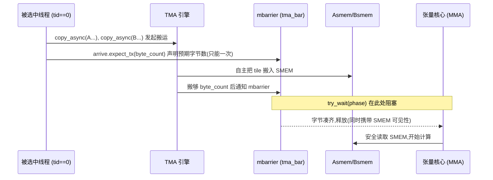
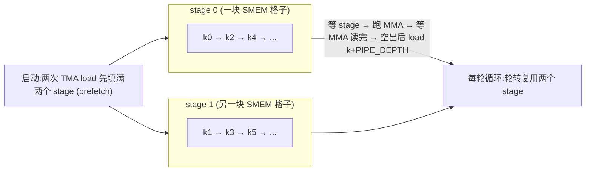

# 第 12 章 · 用 TMA 为 GEMM 做流水线(Step 4–6)

> 原文:[Pipelining GEMM with TMA](https://mlc.ai/modern-gpu-programming-for-mlsys/chapter_gemm_async/index.html)

> **本章要点(TL;DR)**
> - 上一章写出的"正确"分块 GEMM(通用矩阵乘法,深度学习里最核心的计算)让最贵的张量核心(Tensor Core,芯片上专门干矩阵乘的计算单元)大部分时间在**空等**:线程搬一块、张量核心算一块、线程再搬下一块,两件本可以并行的事被排成了串行。
> - 本章不改数据通路(tile,即大矩阵切出来的小方块;以及 layout、数学都对),只改**何时做、由谁调度**,核心思想只有一个:**让一个硬件引擎跑在另一个引擎前面**(异步交接)。
> - **Step 4**:把 GMEM(全局内存,显存里那块大空间)→SMEM(共享内存,片上那块小而快的)的搬运交给 TMA(Tensor Memory Accelerator)硬件,一个线程下一条命令即可,用 mbarrier(memory barrier)按字节数判断搬完没有——但**每次 load 后仍然等**,所以还没真重叠。
> - **Step 5**:把 SMEM 双缓冲(PIPE_DEPTH=2 的环形缓冲),给"下一块"腾出落脚点并预取(prefetch),建立起流水线骨架——但单 warpgroup(4 个 warp、共 128 线程一组,见第 0 章)主循环**仍先等当前 MMA 再发下一个 load**,真正的 load/compute 重叠要到 Step 7 的 warp 专门化(warp specialization)才到来。
> - **Step 6**:把 kernel 改成**持久化(persistent)**,固定开一池 CTA(线程块,一组协同的线程,等同 block;约一 SM 一个,SM 即流多处理器,GPU 上的计算核心,见第 0 章),用 tile 调度器(tile scheduler)让每个 CTA 连续处理多个输出 tile,既摊薄每 tile 的启动开销,又能挑一个让操作数留在 L2 里的 tile 顺序。

> **前置知识**:读这一章前,最好先懂第 11 章那个分块 GEMM(把大矩阵切成小方块来算),以及 TMA(搬数据的专用硬件)、mbarrier(异步完成的"门闩")、双缓冲/流水线(让搬运和计算两条线错开跑)这几个词。没把握的话,先翻一下 [第 0 章 · 极简入门](./ch00_gpu_ml_primer.md),再回头看第 11 章。本章会默认你已经认识这些词。

---

这一章属于「第三部分 · GEMM 实战(Step 1→9)」。上一章我们盯着"算得对不对",这一章换个问题:"算得满不满?"——说白了,就是别让最贵的那块硬件闲着。

读之前,先把终点记在心里。这三步,一步干一件事:

- Step 4:让专门的拷贝硬件(TMA)替线程搬数据;
- Step 5:给数据腾出双缓冲的落脚点;
- Step 6:把整个 launch 重塑成持久化形态。

这里有个点要先说清楚:这三步从头到尾,SMEM、TMEM(张量内存,Blackwell 上专门放 MMA 累加器的片上内存)、寄存器(register,每个线程私有的最快存储)的 layout 一行都没改过。真正算新东西的,就一个——**硬件单元之间的异步交接**。剩下的全是老零件,换个用法而已。

## 为什么基础版 GEMM 在浪费时间

先把问题摊开讲。张量核心(Tensor Core)是整块芯片上**最贵的家伙**,理应一刻不停地转。可上一章那个写法本身没错的分块 GEMM,偏偏让它大半时间都在干等。

为什么?因为这个 kernel 是"一个一个轮着来"的:

1. 线程把一块 tile 拷进共享内存(SMEM);
2. 张量核心把这块嚼完;
3. 线程拷下一块;
4. 张量核心又在等。

每一步都得等上一步收工。可你仔细想想:**搬下一块 tile** 和 **算手里这块**,根本是两套不同的硬件在干,完全可以同时进行啊!

要把这条缝补上,不用动任何数据通路——tile、layout、数学,现成的全够用。要改的就两样:**什么时候做**,和**谁来调度**。

下面拿两张表对一对,看看"串着跑"和"我们想要的重叠跑"差在哪(行 = 硬件引擎,列 = 时间步,格子 = 那一刻在干什么):

**基础版(串行,轮流上场)**:

| 引擎 | t0 | t1 | t2 | t3 | t4 |
|------|----|----|----|----|----|
| 搬运(拷贝硬件) | load k0 | — | load k1 | — | load k2 |
| 计算(张量核心) | — | mma k0 | — | mma k1 | — |

拷贝硬件和张量核心从来不一起干活,各自都有一半时间在空等。

**理想版(重叠,各司其职)**:

| 引擎 | t0 | t1 | t2 | t3 | t4 |
|------|----|----|----|----|----|
| 搬运(拷贝硬件) | load k0 | load k1 | load k2 | load k3 | ... |
| 计算(张量核心) | — | mma k0 | mma k1 | mma k2 | ... |

算 k0 的工夫,k1 就已经搬好了,张量核心几乎一直在转。

> **关键**:本章三步是**渐进**的。Step 4 把搬运交给硬件(但还是等);Step 5 搭出流水线骨架并预取(但单 warpgroup 还是等);真正"两条线同时跑满"的重叠,要到下一章 Step 7 用 warp 专门化把 TMA 和 MMA 拆成生产者/消费者两个角色才实现。本章打的是地基。

> **注意**:从 Step 4 开始,所有例子都跑在完整规模 M=N=K=4096 上(而非 Step 1–3 的小尺寸),端到端计时统一放在下一章末尾的 *End-to-End Result* 表里。

---

## Step 4:TMA 异步 Load

### 这一步只改了"派发方式"

这一步就动一个地方:原来是线程一块一块同步地拷,现在换成 **TMA load**。别的全不动。拿原书那个三维度框架一对照,就一目了然:

| 维度 | Step 4 的状态 |
|------|---------------|
| **Scope(范围)** | 不变,仍是一个 warpgroup |
| **Layout(布局)** | 不变,同样的 SMEM / TMEM / 寄存器 tile |
| **Dispatch(派发)** | **变了**:GMEM→SMEM 的 load 从同步 `Tx.copy` 改为 TMA 引擎 |

### 同步拷贝 vs. TMA 命令:执行模型的本质差别

代码就改那么几行,可背后的执行模型**根本是两码事**。一句话先抓住区别:同步拷贝是线程自己撸起袖子搬,TMA 拷贝是线程喊一嗓子、剩下的让硬件去搬。

- 同步的 `Tx.copy`:这活儿是 **CTA 线程亲自干的**。算地址、发 load/store,全得线程一条条指令来,搬的整个过程线程都被占着,脱不开身。
- TMA 拷贝:**一个线程发一条命令**,完事。后面的搬运全归 TMA 硬件,自己独立去跑。算地址、合并访存(coalescing,把相邻线程的访问拼成一笔大传输)、swizzle(打乱地址摆放以避开 bank 冲突)这些琐事,早就写进 TMA 描述符(descriptor)里了,TMA 引擎照着做就行。

两段代码摆一块儿,差别看得清清楚楚。

**改前(Step 3)**:128 个线程一起上手拷,再用一句 `cta_sync` 让 SMEM 的写入对所有线程都可见:

```python
Tx.cta.copy(Asmem[:, :], A[m_st:m_st+BLK_M, i*BLK_K:(i+1)*BLK_K])   # 全部 128 线程参与
Tx.cta.copy(Bsmem[:, :], B[n_st:n_st+BLK_N, i*BLK_K:(i+1)*BLK_K])
T.cuda.cta_sync()
```

**改后(Step 4)**:一个线程发起 TMA load,硬件搬完没搬完,交给 mbarrier 去盯:

```python
tid = warp_id * 32 + lane_id                 # warpgroup 内的 0..127
if tid == 0:  # 恰好一个线程启动 TMA
    Tx.copy_async(Asmem, A[...], dispatch="tma")
    Tx.copy_async(Bsmem, B[...], dispatch="tma")
    T.ptx.mbarrier.arrive.expect_tx(tma_bar, byte_count)  # 告诉 mbarrier 预期收到多少字节
T.ptx.mbarrier.try_wait(tma_bar, phase)                  # MMA 读 SMEM 前先等 TMA 完成
```

### 为什么是 `tid == 0`,而不是 `elect_sync()`?

这是这一步最容易栽跟头的地方。乍一看,挑线程用哪种写法都行;真不是。

问题出在"到底挑几个"。`elect.sync` 是**每个 warp 挑一个**活跃 lane(warp 内的线程编号,0–31)。可一个 warpgroup 有 4 个 warp(线程束,32 个线程的小班,见第 0 章),这么一来 `elect_sync()` 就挑出了**四个线程**,四个全冲进了 load 协议。

坏就坏在这。TMA 协议要往 mbarrier 里**报一个预期字节数**,而这个数必须**不多不少报一次**。报了四遍,计数立马乱套,`wait` 就再也等不到那个正确的释放点了。更阴的是,这是个**不声不响的正确性 bug**——程序照跑不崩,就是悄悄给你算错。

所以对的做法是:按 warpgroup 的全局 id,精准点中**一个**线程——`tid == 0`。

> **关键**:图里写"Elected Thread(被选中的线程)"指的是启动 TMA 的那个线程,在我们的代码里就是 `tid == 0`,**不是** `elect_sync()` 选出来的 lane。两者别混淆。

### Load 完成怎么知道:mbarrier + 字节数握手

换成 TMA,其实一口气改了两件事:**谁来发起拷贝**(这个看代码就懂),以及**怎么判断拷完了**(这件事最容易被忽略,可一错就是静默错误)。下面重点讲后一件。

- 用 `Tx.cta.copy` 的时候:CTA 线程一起拷,后面补一句 `cta_sync()` 就够了。
- 换成 TMA,`cta_sync()` 就**不顶用了**。为什么?因为 `cta_sync()` 只管等 CTA 自己那帮线程、只给它们的 SMEM 写入排个序。可那笔正在途中的 TMA 传输,它**压根不知道**——tile 还在半道上呢,它就乐呵呵地返回了。

正确的修法,是把"搬完了"这件事**明明白白地写出来**:

1. 被选中的那个线程,先用 `arrive.expect_tx(total_bytes)` 告诉 mbarrier:这回要等够多少字节。
2. TMA 引擎把这么多字节搬齐之后,对应的 `mbarrier.try_wait(phase)` 才放行。
3. **非得到这一步**,SMEM tile 才能交给 MMA(矩阵乘加 / matrix multiply-accumulate,也就是张量核心干的那摊活)去算。

下面用 Mermaid 把原图重画一遍(TMA Async Load 的这套握手):



> **注意**:mbarrier 的释放本身就**携带了 SMEM 的可见性**,所以释放之后**不需要再补一道 fence**。这点在完整 kernel 的注释里也强调了。

### Store 侧:走同样硬件,但用另一套等待协议

这里有两套同步协议,脑子里千万别混——load 走一套,store 走另一套,等的方式完全不一样:

| | **Load 侧** | **Store 侧** |
|---|------------|--------------|
| 跟踪方式 | mbarrier + 字节数 | commit group + wait group |
| 发起 | 一个线程 `copy_async(..., dispatch="tma")` | 一个线程 `copy_async(D[...], Dsmem, dispatch="tma")` |
| 等待 | `arrive.expect_tx` → `try_wait(phase)` | `cp_async.bulk.commit_group()` → `cp_async.bulk.wait_group(0)` |
| 保护对象 | MMA 读 SMEM 前数据已到 | 旧 store 排空前 `Dsmem` 不可复用 |

store 这边的流程是这样:线程先把 fp16 的结果写进 `Dsmem`,同步一下;然后挑一个线程启动 `Tx.copy_async(D[...], Dsmem, dispatch="tma")`;最后用 `commit_group()` + `wait_group(0)` 卡在那儿,等到 store 全部排空为止。

**最后这一等,可不能省**。道理很简单:上一笔 store 还没走完,`Dsmem` 就还占着呢,你没法拿它去装下一块 tile。

> **Try with your agent(原书练习)**:为一个 K tile 追踪 Step 4 的 load/store 同步——哪个线程启动每条 TMA 命令、哪个 mbarrier 或 commit group 跟踪完成、哪个等待保护 MMA 读 `Asmem`/`Bsmem`、哪个等待保护 `Dsmem` 的复用?为什么这里 `elect_sync()` 是错误的线程选择?

### 完整 kernel 的结构与关键点

完整的 kernel,就是把 TMA load/store 塞进 Step 3 的骨架里,别的地方一概不碰。下面不照抄那一长串源码,只挑出**真正扛着 TMA 语义的那几行**。

K 循环的主体长这样。这里要特别留意:它**每一轮都要等**,所以还谈不上真正的重叠:

```python
for k in range(K_TILES):
    k_st = T.meta_var(k * BLK_K)
    if tid == 0:
        tma_load(k_st)                                       # 一个线程发起 TMA load
    T.ptx.mbarrier.try_wait(tma_bar.ptr_to([0]), phase_tma)  # 等 load 完成(隐含 SMEM 可见性)
    if tid == 0:
        mma(accum=k != 0)                                    # 一个线程发起 MMA(k==0 时不累加)
    T.ptx.mbarrier.try_wait(mma_bar.ptr_to([0]), phase_mma)  # 等 MMA 完成
    phase_tma ^= 1                                           # 单个 barrier,每轮翻转相位
    phase_mma ^= 1
```

关键在那两个 `@T.inline` 辅助函数上。`tma_load` 里发两条 `copy_async`,顺手把字节数报出去:

```python
@T.inline
def tma_load(k_st):
    tma_config = T.meta_var({"dispatch": "tma", "cta_group": 1,
                             "mbar": tma_bar.ptr_to([0])})
    Tx.copy_async(Asmem[:, :], A[m_st:m_st+BLK_M, k_st:k_st+BLK_K], **tma_config)
    Tx.copy_async(Bsmem[:, :], B[n_st:n_st+BLK_N, k_st:k_st+BLK_K], **tma_config)
    T.ptx.mbarrier.arrive.expect_tx(
        tma_bar.ptr_to([0]),
        (BLK_M * BLK_K + BLK_N * BLK_K) * F16_SIZE)  # A、B 两块 fp16 操作数的总字节数
```

整段 kernel 里,真正扛着 TMA 语义的就**五个配置点**。把这五个记住,这一步也就拿下了:

1. **TMA config**:`{"dispatch": "tma", "cta_group": 1, "mbar": tma_bar.ptr_to([0])}`——它告诉 `Tx.copy_async` 走 TMA,并且用 `tma_bar` 来汇报 load 完成。
2. **字节数**:`(BLK_M * BLK_K + BLK_N * BLK_K) * 2`,这是 A、B 两块 fp16 操作数(operand,参与运算的输入数据)tile 加起来的字节数,喂给 `arrive.expect_tx(...)`。
3. **mbarrier 初始化**:`init(tma_bar.ptr_to([0]), 1)`,给 TMA load 立起那道完成屏障。
4. **`@T.inline`**:`tma_load(...)` 和 `mma(...)` 是辅助函数,编译期直接展开进 kernel 主体,所以能随手用周围 kernel 里的变量。
5. **TMA store 同步**:epilogue(收尾阶段,K 循环算完后把结果写回的那段)先把 fp16 行写进 `Dsmem`,再用 `fence.proxy_async` 和 `warpgroup_sync` 把这些线程的写入对 TMA store 通路理顺;接着 store 用 `commit_group()` / `wait_group(0)` 等 SMEM→GMEM 这趟传输跑完。

> **关键**:Step 4 的提速**不是靠重叠**(它每个 load 后都还在等)。提速纯粹来自**数据通路换了**:TMA 接管了批量传输,把 CTA 线程从"用指令带宽一块块搬 tile"里解放出来。光这一项,就足以让性能往前挪一截。一句话——把搬运从关键路径上拿掉,这就是 Step 4 的全部价值。

所以眼下的局面是:**零件配对了,节奏还没踩上**。load 和 MMA 还是一个接一个轮着来。下一步,我们 TMA 通路一动不动,光去重排时间表。

---

## Step 5:软件流水线(PIPE_DEPTH=2)

### 为什么 Step 4 没法重叠?瓶颈在"存储"

两个引擎明明各干各的、互不相干,Step 4 怎么就是重叠不起来?卡点不在硬件,在**地方不够放**。

你想象一下:手头只有一对 SMEM tile。下一个 load 想动身,可它**没地方落脚**。当前的 MMA 还没把这对 tile 读完,它就不能开搬,一搬就把人家正用着的数据给盖了。说白了,就是缺第二块空地。

Step 5 的招就是**双缓冲(double buffering)**:多准备一块格子,这个存储冲突自然就化解了。不过有句话得先说在前头:这时候单 warpgroup 的主循环**还是先等当前 MMA、再发下一个 load**。区别只在于,现在有了"两块分开的格子",可以预取、可以轮着复用了。

| 维度 | Step 5 的状态 |
|------|---------------|
| **Scope** | 不变,仍是一个 warpgroup |
| **Layout** | **变了**:单对 SMEM tile 变成 `PIPE_DEPTH` 级的**环形缓冲(ring buffer)** |
| **Dispatch** | 不变,仍是 TMA load + `tcgen05` MMA(Blackwell,NVIDIA 较新的一代 GPU 架构,这一代张量核心的 MMA 指令族,累加器(accumulator,逐块累加部分乘积的那块结果存储)落在 TMEM 上);本步加了预取和阶段复用,完整重叠仍留给 Step 7 |

### 流水线骨架长什么样

`PIPE_DEPTH=2` 说白了就是:开两个 SMEM 阶段(stage),让 load 通路和 MMA 通路各有各的格子用。

下面这张图,画的是**双缓冲想撑起的那套流水线结构**(PIPE_DEPTH=2),它**不是**这个单 warpgroup kernel 真实跑起来的轨迹。别会错意——这一步只是先把预取搭出来,真要跑满重叠,得等 Step 7。每个 stage 就是一块 SMEM 格子,K tile 轮着用它:



> **注意**:这还**不是**并发的 TMA/MMA 时间表;它只是建立了环形缓冲结构,Step 7 会把这个结构**拆成生产者/消费者两个角色**,届时 TMA 和 MMA 才真正同时跑。

### 相对 Step 4 的四处改动

Step 5 的代码跟 Step 4 比,就差这四处:

1. `Asmem` 和 `Bsmem` 前头多挂了一个 **`PIPE_DEPTH` 维度**,这样每个 stage 都有自己那份 SMEM 存储。
2. `tma_bar` 从一个变成**一个数组**,一个 stage 配一个 mbarrier。
3. 主 K 循环开跑前,先把头两个 stage **预取**好。
4. K 循环里用 `stage = k % PIPE_DEPTH` 轮转:等当前 stage → 在它上面跑 MMA → 再把这个 stage 拿去 load `k + PIPE_DEPTH`。

### 流水线机制三件套

> 下面三段都是**示意伪代码**,只为把机制讲清楚(为了读着清爽,`if tid == 0` 守卫和 `try_wait` 的完整写法都略掉了);带守卫的真实版本,看后面"完整 kernel"那一节。

**(1)预取(Prefetch)**:主循环还没开跑,先把头 `PIPE_DEPTH` 个 stage 给 load 进来,这样循环第一轮一开始,数据就已经在那儿等着了:

```python
for s in range(min(PIPE_DEPTH, K_TILES)):
    tma_load(s, s * BLK_K)
```

**(2)主循环**:每个 K tile,先等它的 stage 备好、在上面把 MMA 跑了,然后趁这个 stage 刚腾空,马上拿去 load `PIPE_DEPTH` 之外的那块:

```python
stage = k % PIPE_DEPTH
wait(tma_bar[stage], phase_tma)   # 等当前 stage 的 load
mma(stage, accum)                 # 在当前 stage 上算
wait(mma_bar[0], phase_mma)       # 等 MMA 读完当前 stage
phase_mma ^= 1
tma_load(stage, next_k * BLK_K)   # 把空出来的 stage 拿去预取下一块
```

**(3)相位管理(Phase management)**:这块最容易把人绊倒,但规则其实就一句话——**一个 barrier 多久翻一次相位,全看它有几个槽位**。槽位多少不一样,翻的节奏自然就不一样。我们这两个 barrier 一对照,正好说明问题:

- **`mma_bar`(就一个 barrier)**:MMA 累加器只占一个 TMEM 槽,所以 `mma_bar` 也只有一个,**每一轮都会被重新摸到**。一个每轮都摸的 barrier,当然**每轮都翻相位**。

  ```python
  phase_mma ^= 1   # 每轮都翻
  ```

- **`tma_bar`(PIPE_DEPTH 个元素的数组)**:每个 stage 配一个 barrier。某个 stage 的那个 barrier,得**把整圈环绕完**才会再被摸到一次。所以 `phase_tma` **只在 stage 下标绕回 0 的那一下**翻一次:

  ```python
  if stage == PIPE_DEPTH - 1:
      phase_tma ^= 1   # 绕完一圈才翻
  ```

> **关键**:把"相位翻转节奏 ∝ barrier 槽位数"这条规律记牢。`mma_bar` 每轮回访 → 每轮翻;`tma_bar[stage]` 每 `PIPE_DEPTH` 轮才回访同一个 → 绕圈才翻。这是 mbarrier 相位语义最直接的推论。

> **Try with your agent(原书练习)**:取 `PIPE_DEPTH=2`、`K_TILES=5`,逐 `k` 追踪主循环——列出每轮的 `stage`、传给 `try_wait` 的 `phase_tma`/`phase_mma`、以及是否发出新的预取。`phase_tma` 究竟在哪里翻?为什么最后两轮没有预取?(提示:`next_k = k + PIPE_DEPTH < K_TILES` 不成立时就不再预取。)

### 完整 kernel:关键差异

完整 kernel 把 Step 4 那条 TMA load/store 通路**原封不动地留着**,外面只是又裹了一层分阶段缓冲和相位逻辑。结构上的不同就集中在三处,下面各挑几行最能说明问题的。

双缓冲的 layout——第一维就是流水线 stage:

```python
PIPE_DEPTH = 2
A_layout = tma_shared_layout(a_type, SwizzleMode.SWIZZLE_128B_ATOM,
                             (PIPE_DEPTH, BLK_M, BLK_K))   # 多一个 stage 维
B_layout = tma_shared_layout(b_type, SwizzleMode.SWIZZLE_128B_ATOM,
                             (PIPE_DEPTH, BLK_N, BLK_K))
```

barrier 初始化——MMA 一个、TMA 每 stage 一个:

```python
if warp_id == 0 and lane_id == 0:
    T.ptx.mbarrier.init(mma_bar.ptr_to([0]), 1)            # 单个 MMA barrier
    for s in range(PIPE_DEPTH):
        T.ptx.mbarrier.init(tma_bar.ptr_to([s]), 1)        # 每个 stage 一个 TMA barrier
```

主循环里多了"发下一笔预取"和"绕圈翻相位"两步:

```python
for k in range(K_TILES):
    stage = k % PIPE_DEPTH
    T.ptx.mbarrier.try_wait(tma_bar.ptr_to([stage]), phase_tma)  # 等本 stage 的 load
    if tid == 0:
        mma(stage, accum=(k != 0))
    T.ptx.mbarrier.try_wait(mma_bar.ptr_to([0]), phase_mma)
    phase_mma ^= 1
    next_k = k + PIPE_DEPTH
    if next_k < K_TILES:                                        # 最后两轮不再预取
        if tid == 0:
            tma_load(stage, next_k * BLK_K)
    if stage == PIPE_DEPTH - 1:                                 # 绕完一圈才翻 phase_tma
        phase_tma ^= 1
```

epilogue(TMEM → 寄存器 → `Dsmem` → TMA → GMEM)跟 Step 4 一模一样,这里就不再展开了。

---

## Step 6:持久化 kernel + tile 调度器

### 从"优化单 tile 内"到"优化跨 tile"

前面那些功夫,都花在优化**单个 tile 内部**的活儿上。Step 6 把镜头往后一拉,换了个尺度看——**跨 tile 优化**。

先回顾 Step 5 怎么干的:每个 128×128 输出 tile,起一个 CTA。对 4096×4096 的输出,那就是 **1024 个互不相干的 CTA**。每个 CTA 都得自己掏一遍启动成本,干完自己那块就**直接散伙、灰飞烟灭**。

Step 6 换个活法:只起一个**固定大小的 CTA 池**,让每个 CTA 轮着去啃**好几个** tile。这么一来,能换来两样好处:

1. **摊薄启动开销**:TMEM 分配、barrier 初始化、调度器状态这些事,原来要在 1024 个一次性 CTA 上重复 1024 遍,现在每个 CTA 只做一次,这一次的成本摊到它经手的大约 7 个 tile 上。
2. **更聪明的 tile 顺序**:tile 怎么分配挪进了 kernel 内部,调度器就能挑一个**让操作数能复用**的顺序来跑。

| 维度 | Step 6 的状态 |
|------|---------------|
| **Scope** | **变了**:固定一池持久化 CTA,每个通过调度器循环处理多个输出 tile |
| **Layout** | 不变,同样的 per-tile SMEM/TMEM/寄存器通路 |
| **Dispatch** | 不变 |

### 持久化调度:grid 大小贴合硬件,而非问题

持久化 kernel 的核心想法,一句话:**grid 多大,看硬件,不看问题**。

换句话说,它就起 `SM_COUNT` 个 CTA(大致一个 SM 一个),管你输出 tile 总共多少个。图的就是一件事:让每个 SM 手里一直有活,别让它闲着。

> **注意**:这里说"大致"是有讲究的——精确的 1:1 驻留**没人保证**,具体得看占用率(occupancy),还看硬件怎么调度 CTA。

这一章的目标硬件是 B200,`SM_COUNT=148`。于是就开 148 个 CTA,各自循环去处理 `ClusterPersistentScheduler2D` 派给它的那些 tile。

第二个好处,来自调度器挑的那个**处理顺序**。这里把 `l2_group_size` 设成 8,意思是把相邻的 tile 凑成一组、一个挨一个地处理。下表是输出 tile 的网格布局(行 = M 方向,列 = N 方向),每格就是一个 128×128 的输出 tile:

| M 方向 ＼ N 方向 | N=0 | N=1 | N=2 | N=3 |
|---|---|---|---|---|
| **M=0** | T0 | T1 | T2 | T3 |
| **M=1** | T4 | T5 | T6 | T7 |

表里的复用关系很清楚:同一行带(同一 M 行)上的那几个 tile,用的是同一份 A 行块;同一列带(同一 N 列)上的,用的是同一份 B 块。

道理就在这儿:既然同一行带里的 tile 共用一份 A、同一列带里的共用一份 B,那把这些沾亲带故的 tile 一个挨一个地处理,操作数就能**一直赖在 L2 里**,不用一趟趟跑回 HBM 重新拉。这份复用红利,Step 3 当时其实就摆在桌面上了,只是没顺手吃掉。

接进调度器,几行就够:

```python
bx = T.cta_id([SM_COUNT])   # 1D grid,一 CTA 一 SM(不再是 2D grid!)

tile_scheduler = ClusterPersistentScheduler2D(
    "ts",
    num_m_tiles=M // BLK_M,
    num_n_tiles=N // BLK_N,
    l2_group_size=8,        # 把 8 个相邻 tile 凑成一组
    num_clusters=SM_COUNT)
tile_scheduler.init(bx)
```

### 一个容易漏掉的正确性后果:相位初始化要进循环

一个 CTA 要循环啃好几个 tile,这就牵出一个**特别容易漏的坑**:每个 tile 都得跑一遍自己**全新的 K 循环**,而它的 barrier 相位,必须**从一个干净的、已知的状态起步**。

- Step 5 里,一个 CTA 就管一个 tile,所以 `phase_tma`、`phase_mma` 开头初始化一次就完事,没毛病。
- 到了 Step 6 就不行了。这俩初始化得**挪进 `while tile_scheduler.valid()` 循环里头**,让每个 tile 都从一个跟它自己 TMA/MMA 节奏对得上的相位重新起步,而不是**把上一个 tile 留下的残值给接了过来**。

```python
while tile_scheduler.valid():
    phase_tma: T.int32 = 0    # 每个 tile 都从 0 开始
    phase_mma: T.int32 = 0
    ...
    tile_scheduler.next_tile()   # 处理完移到下一个 tile
```

### 完整 kernel:结构上就是 Step 5 套了个外层 tile 循环

从结构上讲,Step 6 不过是把 Step 5 那整条流水线**套进一个 tile 级的外层循环**罢了。新加的依赖就一个——调度器本身:

```python
from tvm.tirx.lang.tile_scheduler import ClusterPersistentScheduler2D
```

骨架长这样(内层那个 K 循环跟 Step 5 一字不差):

```python
SM_COUNT = 148   # NVIDIA B200 的 SM 数量

# ... 同 Step 5 的 SMEM/barrier/TMEM 初始化(每 CTA 只做一次)...

while tile_scheduler.valid():
    m_st = T.meta_var(tile_scheduler.m_idx * BLK_M)   # 当前 tile 位置由调度器给
    n_st = T.meta_var(tile_scheduler.n_idx * BLK_N)
    phase_tma: T.int32 = 0
    phase_mma: T.int32 = 0
    # === 内层:与 Step 5 完全相同的流水线 ===
    #   prefetch 头 PIPE_DEPTH 个 stage
    #   K 循环:wait stage → mma → wait mma → 预取 k+PIPE_DEPTH → 绕圈翻相位
    #   epilogue:TMEM → RF → Dsmem → TMA → GMEM
    T.cuda.cta_sync()
    tile_scheduler.next_tile()   # 移到下一个 tile

# TMEM 释放放在所有 tile 处理完之后(每 CTA 只做一次)
```

> **关键**:注意 TMEM 的 `alloc`/`dealloc` 在**整个 while 循环之外**——它们随 CTA 生命周期一次性分配和释放,不在每个 tile 上重做。这正是"摊薄启动开销"的具体体现。

---

## 练习(原书 Exercises)

1. **Step 4**:`arrive.expect_tx` 用的字节数是 `(BLK_M * BLK_K + BLK_N * BLK_K) * 2`。如果这个字节数**偏小或偏大**,mbarrier 会等什么?(思路:偏小则字节没凑齐它就提前释放,MMA 读到不完整数据;偏大则永远凑不齐,`wait` 死等不放。)
2. **Step 5**:为什么每个 SMEM stage 需要**自己的** TMA barrier,而不能两个 stage 共用一个 `tma_bar`?(思路:两个 stage 的 load 在途时间不同,共用会让"哪个 stage 好了"分不清,相位语义也会乱。)
3. **Step 6**:4096×4096 输出、`BLK_M=BLK_N=128`,有多少个输出 tile?`SM_COUNT=148` 时每个持久化 CTA 平均处理几个?(算一下:每边 4096/128 = 32 个,共 32×32 = **1024** 个 tile;1024/148 ≈ **6.9**,即平均约 7 个。)

---

## 小结

这一章的主线就一句话:**让一个硬件引擎跑在另一个前头**。下面三步,就是把这句话一点点落到地上的过程:

| 步骤 | 改的维度 | 核心动作 | 是否真重叠 |
|------|---------|---------|-----------|
| **Step 4** | Dispatch | 同步拷贝 → TMA 命令;mbarrier+字节数跟踪 load,commit/wait group 跟踪 store | 否(每 load 后仍等);提速来自把搬运移出关键路径 |
| **Step 5** | Layout | SMEM 双缓冲(PIPE_DEPTH=2 环形缓冲)+ 预取;相位翻转节奏 ∝ barrier 槽位数 | 否(单 warpgroup 仍等);搭好流水线骨架 |
| **Step 6** | Scope | 持久化 kernel(一 SM 一 CTA)+ tile 调度器;`l2_group_size` 控操作数 L2 复用;相位初始化进循环 | 否;摊薄启动开销 + 跨 tile 操作数复用 |

几条最该揣走的认知:

- **TMA 的价值有两层**:Step 4 先吃到的是"把搬运从线程的指令带宽里摘出去";至于真正的 load/compute 重叠,那是后话(Step 7 的 warp 专门化)。
- **两套同步协议别串了**:load 用 mbarrier + `expect_tx` 报字节数;store 用 commit group + wait group。拿 `cta_sync()` 去等 TMA load,是个不声不响的错。
- **挑线程用 `tid == 0`,别用 `elect_sync()`**:后者每个 warp 挑一个,4 个线程会把字节数重复报四遍,直接把 mbarrier 的计数搞坏。
- **相位翻转记个口诀**:barrier 每轮都回访,就每轮翻(`mma_bar`);每绕一圈才回访一次,就绕圈翻(`tma_bar[stage]`)。
- **持久化换来两份红利**:摊薄每个 tile 的启动成本,外加用 tile 顺序换 L2 复用;代价是相位初始化和 prefetch 都得搬进 tile 外层循环里头。

下一章(从 Step 7 起)会上 warp 专门化,把 TMA 和 MMA 拆成生产者、消费者两个角色。到那会儿,这一章搭好的这套环形缓冲,才真正两条线一起跑满。

---

## 延伸阅读

- 原文:[Pipelining GEMM with TMA — Modern GPU Programming for MLSys](https://mlc.ai/modern-gpu-programming-for-mlsys/chapter_gemm_async/index.html)
- 本章末尾提到的端到端计时,见下一章 *Scaling GEMM with Warp Specialization and Clusters* 的 *End-to-End Result* 表。

---

## 术语对照

| 中文 | English | 说明 |
|------|---------|------|
| 张量核心 | Tensor Core | 芯片上最贵、最该跑满的计算单元 |
| 共享内存 | SMEM (shared memory) | tile 在片上的落脚点 |
| 线程束 | warp | 32 个 lane 一组 |
| warpgroup | warpgroup | 4 个 warp 一组,共 128 线程 |
| 张量内存加速器 | TMA (Tensor Memory Accelerator) | 专门搬 GMEM↔SMEM tile 的硬件引擎 |
| 内存屏障 | mbarrier (memory barrier) | 用字节数/到达数跟踪异步完成 |
| 相位 | phase | mbarrier 的翻转位,区分轮次 |
| 双缓冲 | double buffering | PIPE_DEPTH=2 的两阶段环形缓冲 |
| 环形缓冲 | ring buffer | 多 stage 轮转复用的 SMEM 结构 |
| 预取 | prefetch | 主循环前先填满头几个 stage |
| 持久化 kernel | persistent kernel | grid 按硬件(SM 数)定,CTA 循环处理多 tile |
| tile 调度器 | tile scheduler | 在 kernel 内分配 tile 并挑复用友好的顺序 |
| warp 专门化 | warp specialization | 把 TMA/MMA 拆成生产者/消费者(Step 7,下一章) |
| 提交组 / 等待组 | commit group / wait group | TMA store 的完成跟踪机制 |
| 张量内存 | TMEM (tensor memory) | tcgen05 MMA 累加器所在的片上内存 |
