# 第 14 章 · Flash Attention 4

> 原文:[Flash Attention 4](https://mlc.ai/modern-gpu-programming-for-mlsys/chapter_flash_attention/index.html)

> **本章要点(TL;DR)**
>
> - 别把 Attention 当成「再写一遍 GEMM」。它是**两段矩阵乘**中间夹着一段 softmax:先算分数 `S = Q·Kᵀ`,再算输出 `O += P·V`,中间那段 softmax 跑在 CUDA Core 上。难就难在这段 softmax——你嘴上说在优化 Attention,十有八九是在跟它较劲。
> - **在线 softmax(online softmax)** 一句话说白了:从不把整个 `S` 算出来摆那儿,而是把 K/V 一块一块喂进来,边喂边加。每一行它都盯着三个「运行态」:`row_max`、`row_sum` 和输出 `O`。麻烦在于,只要 `row_max` 一变大,之前加进 `O` 的东西尺度就错了,得先**重缩放(rescale)** 再往下加——这正是 GEMM 永远不用操心的事。
> - TIRx 把 kernel 拆成 4 个 warpgroup,**按「干什么活」分工**:WG3 专门驱动硬件引擎(TMA load、MMA、TMA store),WG0/WG1 各管一个 Q stage 的 softmax,WG2 做 correction(校正)和 epilogue(收尾)。记住一条就够:所有 MMA 都只从 WG3 warp 0 发出来。
> - `S`、`P`、`O` 三块数据全挤在**同一块 `128×512` 的 TMEM** 里。靠一个 fp16 视图别名(`tmem_as_f16`)硬给 `P` 腾出地方。这么挤还能不出错,全靠一组 mbarrier(`s_ready`、`p_o_rescale`、`p_ready_2`、`o_ready`、`softmax_corr` 等)把时序管得死死的。
> - **因果掩码**(整块跳过 + 跨对角线逐行掩码)、**GQA**(Q 加载、O 存储两端用 3D 视图零拷贝打包/解包)、**tile 调度**(非因果用 Linear、因果用 LPT)——这三样都只在「边界」上动手脚,计算核心几乎一行没碰。
> - 最关键的一点:底层那套 TIRx 契约(tile 原语 + scope + layout + barrier)和 GEMM **一模一样**。FA4 不是另起炉灶,只是在「广度」上铺得更开——多了些 tile,多了些交接。

> **前置知识**:读这一章前,最好先懂 TMA / TMEM / mbarrier(第 5–8 章)和 GEMM 的 tile 流水线(第 11–13 章),以及 attention / softmax 的基本算法。没把握的话,先翻一下 [第 0 章 · 极简入门](./ch00_gpu_ml_primer.md),再回顾一下 GEMM 那几章。本章会默认你已经认识这些词。

## 本章导读:为什么 Attention 不是「再来一遍 GEMM」(Overview)

前面几章,我们已经把一台 GPU 拆到了最底层:TMA(在 GMEM↔SMEM 之间异步搬数据的硬件引擎)负责在显存(GMEM,全局内存,大但慢)和共享内存(SMEM,片上的小块快速内存)之间搬数据,`tcgen05` 指令驱动 Tensor Core(专做矩阵乘的硬件单元)做 MMA(矩阵乘累加,`C += A·B`),累加器(accumulator,边算边攒结果的那块内存)放在 TMEM(Tensor Memory,Blackwell 新增、专给 MMA 用的片上内存)里,再加上各种 mbarrier(线程间同步用的「门闩」)做同步。到了第三部分,我们又学会了怎么把这些零件拼成一个高性能的 GEMM(通用矩阵乘)。

现在到了 Flash Attention,这些积木终于要**一起**上场了。说白了,Attention 就是「决定一个 Transformer 跑不跑得起来」的那个核心 kernel,也是前面所有功夫第一次必须拧成一股绳的地方。可它偏偏不是把 GEMM 照抄一遍那么简单——它带着一个 GEMM 从来没碰过的结构性难题。

### 核心矛盾:两个 MMA 中间夹着一坨「真活儿」

普通 GEMM 就是「同一个 MMA 一遍遍重复」:每一步只往累加器里**加**结果,累加器是什么意思,从头到尾没变过。Attention 不一样。它是**两个 MMA**,而且这俩中间还夹着一段非得在 CUDA Core 上做的、实打实的计算:

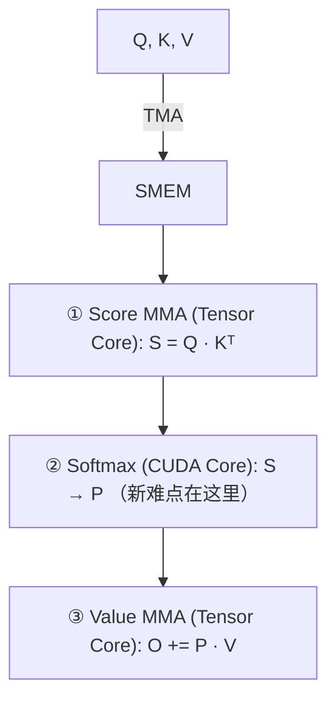

中间这段 softmax 为什么难缠?两个原因:

1. **它跑在 CUDA Core 上(普通通用计算核心,区别于专做矩阵乘的 Tensor Core),正好卡在两个 Tensor Core MMA 中间**。求指数(`exp`)和按行归约(row-wise reduction)都直接压在关键路径上。Tensor Core 想接着算第二个 MMA?对不起,得先等 softmax 把 `S` 揉成 `P`。
2. **它逼着你回头去改已经算好的结果**。这正是 GEMM 从来不用面对的:GEMM 的累加器只加不改;可 Attention 的输出累加器 `O`,会因为新的 K/V 流进来,被迫整体「换个比例」。

也正因为这样,有个听上去反直觉、但很实在的结论:**嘴上说优化 Attention 的人,其实绝大多数时间都在优化 softmax**——要么换种写法表达 `exp`,要么想方设法让 softmax 和 MMA **叠在一起(overlap,让两件事在时间上同时进行、互相藏延迟)** 跑,而不是干等着它算完。

### 那个 GEMM 没有的「twist」:running max 一变,O 就失真

想看懂后面所有代码,先抓住这一条主线就够了——盯着**一个 tile**,跟着它在 kernel 里从头走到尾:

| 阶段 | 输入 | 计算单元 | 产物 | 含义 |
| --- | --- | --- | --- | --- |
| 输入加载 | `Q`、`K`、`V` | TMA | SMEM 中的输入 tile | 从 GMEM 搬到 SMEM |
| ① Score MMA | `Q`、`K` | Tensor Core | 分数 tile `S`(在 TMEM) | `S = Q · Kᵀ` |
| ② Softmax | `S` | CUDA Core | 分子 tile `P` | 把分数变成(未归一化的)权重 |
| ③ Value MMA | `P`、`V` | Tensor Core | 更新输出累加器 `O` | `O += P · V` |

单看这张表,Attention 就像「两个矩阵乘法粘在一起」。可 Flash Attention 的在线 softmax(online softmax)会带来一个 GEMM 永远碰不到的麻烦:

> **注意**:只要那个滑动的 softmax 最大值(running max)一变,之前加进 `O` 的结果**当场就处在错误的比例上**。你得先拿新最大值把旧 `O` **重新缩放(rescale)** 一遍,下一次 Value MMA 才能安全地往里加。

说白了,Flash Attention 靠「分块一步步算 + 维护 running max / running sum」来躲开「一次性把整个 `S` 摆出来」这件事;代价就是:每来一块新 K/V,只要发现了更大的最大值,就得把历史累加值整体打个折,让先来的块和后来的块站到同一个尺度上。下面这段伪代码就点出了这条「rescale」主线(具体的 TMEM/MMA 细节先略掉):

```python
# 在线 softmax 的核心:m 是 running max,l 是 running sum(分母),O 是输出累加器
for kv_block in key_value_blocks:          # 沿 K/V 维度分块迭代
    S = Q @ kv_block.K.T                    # ① Score MMA(Tensor Core)
    m_new = max(m, rowmax(S))               # 更新 running max
    P = exp((S - m_new) / sqrt(d))           # ② Softmax(CUDA Core,exp 在关键路径上)
    alpha = exp((m - m_new) / sqrt(d))       # 旧尺度→新尺度的缩放因子
    l = l * alpha + rowsum(P)                # 同步修正分母
    O = O * alpha + P @ kv_block.V          # ③ 先 rescale 旧 O,再做 Value MMA
    m = m_new
O = O / l                                    # 最后统一归一化
```

看 `O = O * alpha + ...` 这一行,这就是前面反复念叨的那个 twist——它把「回头改已经算好的结果」这件 GEMM 压根不用做的事,变成了每来一块 K/V 都要做一遍的日常动作。

### 本章的目标与组织方式

先把话说清楚:本章**不会从零把 Flash Attention 算法重新推一遍**。算法部分只讲到「够你看懂 kernel」为止;真正下功夫讲的,是那块**全新**的内容——这套算法**怎么落地成 TIRx**,也就是怎么把它映射到具体的硬件原语和 warp 角色上。

所以本章是这么个讲法:

1. **先跟着一个 tile 把整条数据通路走完**(就是上面那条 `Q,K,V → S → P → O`,外加 rescale 这个 twist),把「算法到底要干什么」讲透。
2. **再看 TIRx 怎么把每个阶段分给不同的 warpgroup**,然后用 warp 角色分工、在线 softmax 的重缩放、因果掩码(causal masking)、GQA(分组查询注意力)这些机制,把各个阶段一段段**接线**串起来。

这条主线一句话就能说完:GEMM 教会我们怎么把数据搬进来、怎么喂给 Tensor Core 累加;Attention 在这之上又逼我们多学一手——怎么在两个 MMA 之间塞进一段 softmax,还要在 running max 一变就**回头修正**已经算好的输出。接下来所有 TIRx 代码,要解决的就是这件事。
## 算法的形状(Algorithm Shape)

把 tile(数据块)往各级存储里摆之前,得先搞清楚这些 tile 到底为哪个算法服务。换句话说,内存布局不是拍脑袋设计的——它就是算法的计算流程往硬件上一投影的结果。所以这一节先把 Flash Attention 的核心计算逻辑讲明白,再回头看每个 tile「住哪儿」,因为「住哪儿」直接决定了你后面要写什么样的 layout 代码和同步(barrier)代码。

说到一个 query 块(query block),Flash Attention 要算的,就是标准的缩放点积注意力(scaled dot-product attention):

$$O = \text{softmax}(QK^{\top} / \sqrt{d})\,V$$

### 为什么不能照着公式直算

要是真照公式字面去做,流程就是:先把完整的分数矩阵(score matrix)`S = QKᵀ` 算出来,对它做 softmax,再乘 `V`。可这偏偏是**唯一不能用**的做法,原因很简单:整个 `S` 实在太大了。

我们算笔账。序列长度 seq = 4096 的时候,每个注意力头(head)的 `S` 差不多有 16M 个元素,用 fp32 存大概 **64 MB**。这个量级比片上的 SMEM(shared memory,共享内存)大了好几个数量级,也远远超过一块 128×512 的 TMEM(tensor memory)。一句话——片上根本没地方搁它。

> **注意**:这里真正卡脖子的不是「算得慢」,而是「放不下」。Flash Attention 的核心思路就一条:**永远不把完整的 `S` 实打实地摆出来(materialize)**。

### 流式更新与「重缩放」的由来

既然没法一口气算完整个 `S`,Flash Attention 就换个打法:**把 `K/V` 一块一块(block)流式喂进来**,边读边算。问题来了——只看到局部数据,怎么保证结果还对?办法是给每一行维护三个「运行态(running state)」,用它们来概括「到目前为止看过的所有块」:

| 运行态 | 含义 |
| --- | --- |
| `row_max` | 到目前为止见过的最大分数(每行一个) |
| `row_sum` | softmax 分母的累加值(每行一个) |
| `O` | 输出累加器(output accumulator) |

难点在哪?**每来一个新块,`row_max` 都可能变大**。一旦它变大,之前用旧 max 算出来的那一堆结果就「量错尺子」了——它们是按旧尺度归一化的。所以在把新块的贡献加进来之前,得先把旧的运行态「拉」到新尺度上。这就是 Flash Attention 里那个有名的**在线重缩放(online rescaling)**。

单个块的更新逻辑可以写成如下伪代码:

```python
S = Q_block @ K_block.T              # 当前块的分数 tile(尚未归一化)
m_new = max(row_max, rowmax(S))      # 更新本行的运行最大值
scale = exp((row_max - m_new) / sqrt(d))  # 旧尺度 -> 新尺度的校正因子
P = exp((S - m_new) / sqrt(d))       # 当前块的 softmax 分子(numerator)
row_sum = row_sum * scale + rowsum(P)     # 分母:先把旧分母缩放,再加新贡献
O = O * scale + P @ V_block          # 输出:先把旧 O 缩放,再加新贡献
row_max = m_new                      # 提交新的运行最大值
```

这里有个挺妙的设计:**同一个 `scale` 因子干了两份活**——它既缩放了运行分母 `row_sum`,又缩放了运行输出 `O`。为什么这么干就对?因为有了这个统一的因子,先来的块和后来的块最后都被换算到同一个尺度上,这样它们才能正确地加到一起。

### 工程上的两处优化:exp2 与延迟归一化

**用 `exp2` 顶替 `exp`。** 上面的伪代码为了好读,写的是自然指数 `exp` 加上明晃晃的 `/sqrt(d)`。但真正的 kernel 走的是更省的路子:它把 `1/sqrt(d)` 和 `log2(e)` 这俩常量**提前揉成一个常量** `scale_log2 = log2(e)/sqrt(d)`,然后对着原始分数直接用硬件的 `exp2` 求所有指数,靠的是这个恒等式:

```text
exp(x / sqrt(d)) = exp2(x · scale_log2)
```

动机很朴素:在这类硬件上,`exp2` 就是比自然指数 `exp` 快。

**归一化是故意往后拖的。** 这点得说清楚:伪代码里的 `P` **不是**最终归一化好的注意力矩阵,它只是**当前这一块 K/V 的 softmax 分子**。真正的归一化被有意往后推——非要等最后一块处理完了,kernel 才写出 `O / row_sum` 当最终输出。这么做就是为了省掉「每块都除一遍」的反复折腾。

### 每个 tile「住在哪儿」

对 TIRx 来说,知道算法**算什么**只算搞懂了一半;另一半是**每个 tile 在 kernel 跑起来的时候待在哪种存储里**。后面这一半才是决定 layout 和 barrier 代码的关键。`S`、`P`、`O` 都是 tile 值,各有各的「家」:

| Tile | 含义 | 驻留位置与数据通路 |
| --- | --- | --- |
| `S` | 分数 tile | 由 score MMA 算出后写入 **TMEM** |
| `P` | softmax 分子 tile | softmax 把 `S` 从 TMEM 读进寄存器(register,每个线程私有的最快存储),算出 `P = exp((S - m_new)/√d)`,再把 `P` 写回 **TMEM** |
| `O` | 输出累加器 tile | value MMA 从 TMEM 读 `P`、从 **SMEM** 读 `V`,把结果累加进 **TMEM** 里的 `O` |

把这条数据流画成图,谁读谁写就一目了然了:

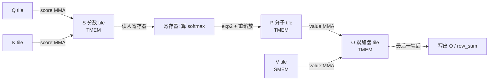

> **注意**:前面说的「重缩放」也是一次 **tile 操作**,可不是几句标量记账那么轻巧。`row_max` 一变,旧的 `O` 就得从 TMEM 读出来、在寄存器里乘上 `scale`、再写回 TMEM,然后下一次 value MMA 才能往里累加。

这套结构会一直贯穿后面每一节:**一处 tile 摆放 + 一条硬件通路 + 一个用来宣告「下一个消费者可以开跑了」的 barrier**。把这三件套吃透,整章实现的骨架你也就抓住了。
## Tile-原语图(Tile-Primitive Graph)

上一节我们已经定下了三个运行状态(`S`、`P`、`O`)各自「住」在哪儿:`S` 在 TMEM,`P` 经寄存器在 TMEM 来回跑,`O` 累加在 TMEM。有了这张「数据住哪」的地图,这一节就把整个算法落成一条**具体的、能跑的 tile 搬运路径**——也就是所谓的「Tile-原语图」。

tile-原语图说白了就是一张「生产者—消费者」依赖图。图里每个节点,就是某块数据待在某一级内存里的那个样子(比如「SMEM 里的 Q」);每条边,就是一次操作——要么把数据从这儿搬到那儿,要么就地算出点新东西。这张图一画清楚,后面所有关于 layout、barrier、流水线的活儿,本质上就剩一件事了:给图上每条边补上对的同步。

### 一条 K/V block 的短路径

对一个 K/V block 来说,kernel 从上往下走的这条搬运路径,几行就能概括:

| 步骤 | 数据落点 | 靠什么完成 |
| --- | --- | --- |
| 起点 | GMEM 中的 Q、K、V | —— |
| 1 | SMEM 中的 Q、K、V | TMA load 搬入 |
| 2 | TMEM 中的 S | score MMA:计算 QKᵀ |
| 3 | TMEM 中的 P | softmax 分子:TMEM → 寄存器 → TMEM |
| 4 | TMEM 中的 O | value MMA:计算 P·V |
| 5 | GMEM 中的 O | 归一化、SMEM 暂存、TMA store 写回 |

画成有向图更直观,每条边都标了「靠哪条硬件路径完成」:

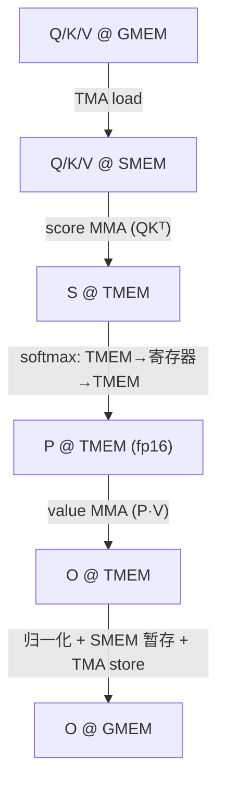

> **注意**:这里的 `P` 不是最终归一化好的注意力权重,只是当前这块 K/V 的 softmax「分子」。真正的归一化(除以 `row_sum`)被特意拖到最后一块处理完才做,所以图里只有 `O @ TMEM -> O @ GMEM` 这条边上才冒出「归一化」这几个字。

### 和 GEMM 的唯一本质区别

这张图跟 GEMM 的 tile-原语图比,差别其实就「一行」:

- **GEMM**:就是**一条 MMA 链**反复累加——`A·B` 一路 MMA 算下去,中间没有任何非 MMA 的计算插进来。
- **FA4**:有**两段 MMA**(score MMA 和 value MMA),而 **softmax 恰好卡在这条链中间**。

你可以这么理解:把 GEMM 的 MMA 链从中间「劈」一刀,塞进一个 softmax 阶段。后面几乎所有比 GEMM 复杂的地方——多出来的 TMEM↔寄存器流量、多出来的角色分工、多出来的 barrier——全是这「多出来的一段」连锁反应出来的后果。先把这一点攥住,后面再乱的复杂度也有了主心骨。

### 展开成完整的生产者—消费者图

把上面那条短路径每一步都摊开,标清「用哪个原语 + 走哪条硬件路径」,就得到完整的依赖图。下表把 TIRx 原语(`Tx.*`)一一对到底层硬件指令上:

| 阶段 | tile 搬运 / 计算 | TIRx 原语 | 硬件路径 |
| --- | --- | --- | --- |
| 加载 Q/K/V | GMEM tile -> SMEM tile | `Tx.copy_async(..., dispatch="tma")` | TMA load |
| Score MMA | SMEM 中的 Q、K -> TMEM 中的 score tile `S` | `Tx.warp.gemm_async(..., dispatch="tcgen05")` | `tcgen05.mma` |
| Softmax 读 | TMEM 中的 `S` -> warpgroup 寄存器 tile | `Tx.wg.copy_async(reg, tmem)` | `tcgen05.ld` |
| Softmax 写 | 寄存器中的分子 tile `P` -> fp16 TMEM 视图 | `Tx.copy_async(tmem_as_f16, reg)` | TMEM store,随后 `tcgen05.wait.st()` |
| Value MMA | TMEM 中的 `P`、SMEM 中的 V -> TMEM 中的输出累加器 `O` | `Tx.warp.gemm_async(..., dispatch="tcgen05")` | `tcgen05.mma`(带一个 TMEM 操作数) |
| Correction(校正) | TMEM 中的 `O` -> 寄存器 -> TMEM 中的 `O` | TMEM 回读、寄存器乘法、TMEM store | `tcgen05.ld` / TMEM store |
| Epilogue(收尾) | 最终的 `O`(TMEM)-> 寄存器 -> SMEM -> GMEM | TMEM 回读、`Tx.copy`、TMA store | `tcgen05.ld` + TMA store |

几个细节值得单拎出来说:

- **Softmax 写回为什么非得来一句 `tcgen05.wait.st()`?** 因为把寄存器里的 `P` 写回 TMEM(`tcgen05` 风格的 TMEM store)是异步的,可后面紧跟的 value MMA 又要把这块 `P` 当输入读。那怎么办?必须先 `wait`,确认 store 真落地了,才能放心让 MMA 去消费——这是图里一条藏着的、但很关键的依赖边。
- **Value MMA 带一个「TMEM 操作数(operand,即送进 MMA 的输入矩阵)」**。普通 GEMM 的 MMA 两个输入都在 SMEM;可这里 `P` 在 TMEM、`V` 在 SMEM,MMA 直接吃一个 TMEM 操作数,省掉了把 `P` 再搬回 SMEM 那一趟。
- **Correction 这一行是「新冒出来的」**。`row_max` 一往上跳,之前算的 `O` 就还停在旧 scale 上,必须先把 TMEM 里的 `O` 读到寄存器、乘上校正系数、再写回 TMEM,然后下一次 value MMA 才能接着往里累加。这正对应上一节强调的那句:rescale 是一次 tile 操作,不是标量记账。

### 哪些边是 GEMM 里没有的

把这张图跟 GEMM 的链摆一块儿对比,**多出来的就是 softmax 和 correction 这两行**。它俩有个共同毛病:

1. 都得来回跑 **TMEM -> 寄存器 -> TMEM**(GEMM 的 MMA 链里,数据基本不用绕回寄存器再算)。
2. 都在 **score MMA 和 value MMA 之间硬加了一道交接(handoff)**——也就是说,两段 MMA 没法背靠背连上,中间隔着「先读出来、在寄存器里算、再写回去」这一套。

FA4 为什么要更细的 warp 角色分工、更绕的 barrier?根子就在这两条「绕回寄存器」的边上。数据要在不同执行单元之间来回交接,那就得有人生产、有人消费,中间还得有个同步原语来喊一嗓子:「好了,下一个消费者可以开跑了。」

> **注意**:读这张图,有个特别好用的练习——只盯那条短路径,对每一个箭头挨个回答四件事:**生产者是哪个阶段、消费者是哪个阶段、源 tile 是谁、目标 tile 是谁、走的哪条硬件路径**。一个箭头一个箭头过完,再问自己一句:哪些箭头在 GEMM 那章里**压根不存在**?答案就落在 softmax 读/写、还有 correction 这几条 TMEM↔寄存器的边上。
## Warp 的角色与作用域(Warp Roles and Scopes)

上一小节把「数据怎么流」讲完了——Q、K、V 怎么在 GMEM、SMEM、TMEM 之间倒腾,score MMA 和 value MMA 各在哪一步发生。数据通路定了之后,下一个该问的问题自然就是:**这每一个阶段,到底谁来干?**

答案是:把一个 CTA 里的线程按「角色」分,而不是按「数据」分。

### 核心思路:按「做什么活」分工,而不是按「碰哪块数据」分工

这里每个 CTA(线程块,一组一起调度、能共享 SMEM 的线程)有 4 个 warpgroup(warp 组,4 个 warp = 128 个线程),总共 512 个线程(4 × 128)。Flash Attention 4 的分工原则很要紧:

> **注意**:线程是按「这个 warpgroup 负责哪一类活」来分的,不是按「它碰哪块数据」来分。这就是看懂整个 kernel 结构的入口。

整体先记住一句话:

- **WG3 是「开机器」的那个 warpgroup**——TMA 加载、MMA 计算、TMA 存储这三类硬件引擎指令,都归它来发。
- **WG0、WG1、WG2 是「埋头算寄存器数学」的 warpgroup**——夹在两次引擎调用中间的那些运算:softmax、correction(校正/重缩放)、epilogue(收尾),都归它们干。

换句话说,WG3 更像一个「调度台」,只管按按钮启动那些专用硬件单元(TMA 引擎、Tensor Core);WG0~WG2 才是真正趴在通用 CUDA core 上做寄存器运算的「计算工」。

### 完整角色分配表

| 归属(Owner) | 角色(Role) | 具体做什么 |
| --- | --- | --- |
| WG3, warp 1 | TMA load | 把 Q、K、V 的 tile 从 GMEM 搬到 SMEM |
| WG3, warp 0 | MMA | 发起 score MMA 和 value MMA 两类矩阵乘 |
| WG3, warp 2 | TMA store | 把最终的 O tile 从 SMEM 写回 GMEM |
| WG0 | Q stage 0 的 softmax | 从 TMEM 读 S,算出 P,把 P 写回 TMEM |
| WG1 | Q stage 1 的 softmax | 对第二个 Q 流水线阶段做同样的工作 |
| WG2 | correction 与 epilogue | 在 TMEM 中重缩放 O、归一化、整理输出 |

能看出来,WG3 内部还按 warp(线程束,32 个线程的最小调度单位)又细分了一层:warp 0 专盯 MMA,warp 1 专盯 load,warp 2 专盯 store。三类硬件引擎,一类配一个 warp 守着,谁也不碍着谁。

### 关键澄清:「两个 Q stage」不是两个 attention head

表里 WG0 和 WG1 干的是「同一种活」(softmax),只不过各管 Q 流水线里的一个槽位。这地方特别容易看岔:

> **注意**:千万别把「两个 Q stage」读成「两个 attention head」。它俩其实是 **Q 流水线里的两个槽位(slot)**——WG0 占一个,WG1 占一个,这样两个 Q tile 就能同时「在飞」(in flight),凑成流水并行。softmax 之所以写了两份,就是因为有这俩流水槽,跟「有两个头」一点关系没有。

画张图,把这种「同种活、两个流水槽」的关系摆出来:

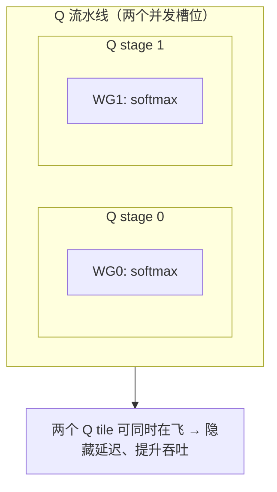

### 代码里如何「认领」角色

kernel 靠一组符号化坐标(symbolic coordinates)来认线程:当前这个线程属于哪个 warpgroup、又是 warpgroup 里的第几个 warp:

```python
wg_id = T.warpgroup_id([4])      # 当前线程属于哪个 warpgroup(0~3)
warp_id = T.warp_id_in_wg([4])   # 在所属 warpgroup 内属于第几个 warp
```

> **注意**:读这份 kernel 有个实用窍门——**先去找「角色分支」(role branch)**,也就是那些基于 `wg_id` / `warp_id` 的 if 分支。一旦你锁定了某个角色分支,嵌在它里头的所有 tile 级原语(load、MMA、softmax 等)归哪支「队伍」管,就一目了然了。这是快速理清控制流的最佳切入点。

各个角色分支里头到底在干什么:

- **WG3 warp 1**:发 TMA load 命令。先由一个被选中的 lane(elected lane,lane 即 warp 内的线程编号 0~31)发出拷贝指令,接着 TMA 引擎真正去搬 tile。
- **WG3 warp 0**:发 `tcgen05.mma` 指令(也就是在 Tensor Core 上做矩阵乘)。
- **WG0 和 WG1**:在**整个 warpgroup 作用域(full warpgroup scope)** 下跑 softmax——也就是 128 个线程一整组一起协同完成。
- **WG2**:同样是整组 warpgroup 一起跑 correction 和 epilogue。

### 一个关键的「不对称」,决定了整张 barrier 图

整个 kernel 的同步结构(barrier graph),被一个核心的「不对称」给定了形:

> **注意**:**所有 MMA——不管是 score MMA 还是 value MMA——都只从 WG3 warp 0 这一个地方发出来。** WG0 和 WG1 自己从来不发 MMA;它们只负责「消费」已经算好的 score tile,跑 softmax,再把结果 `P` 写回 TMEM。

为什么 softmax 非得拿 barrier 包起来?根子就在这儿:发 MMA 的(WG3 warp 0)和消费 score、跑 softmax 的(WG0/WG1)压根不是同一拨人。两边各干各的,中间就必须有个东西帮它们对上节奏。这条依赖链画成图是这样的:

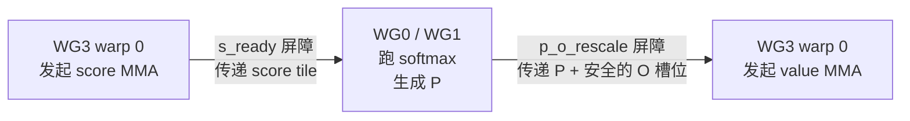

这里冒出来两个会贯穿整章的 mbarrier 名字,务必记牢:

| 屏障名 | 作用 |
| --- | --- |
| `s_ready` | 把 score tile 从 MMA warp(WG3 warp 0)传递给 softmax(WG0/WG1),表示「分数算好了,可以做 softmax 了」 |
| `p_o_rescale` | 把 `P` 以及一个对 value MMA 安全的 `O` 槽位传递回去——这个 O 槽位要么已经完成重缩放,要么因为不需要重缩放而被释放 |

> **注意**:`s_ready` 和 `p_o_rescale` 这俩名字,本章后面会反复出现。它们就是把「MMA 发起方」和「softmax 消费方」这条跨 warpgroup 依赖链拴在一起的两根绳——把它俩弄明白了,FA4 同步逻辑的骨架你就拿下了。
## 怎么读后面的代码片段(Reading the Fragments)

本章后面要一段段拆的代码,全是从 `flash_attention4.py` 这个真实 kernel 里**抠**出来的片段(fragment)。既然是节选,就难免会用到一些「定义在别处、本章又没整段贴出来」的名字。第一次撞上一个不认识的变量,人很容易就卡住了——所以这一小节的用处,就是先把这些名字**一次性理一遍**,给你一张随时能翻回来查的「术语速查表」。

怎么用?很简单:**现在不用背**。把这节当字典摆着,后面哪段代码蹦出个陌生名字,翻回来瞄一眼它是啥就行。

### 哪些名字「望文生义」,会在用到时就地解释

有一类名字本身就挺「望文生义」的,它们会在**第一次真正派上用场的地方**就地登场、就地讲清楚,所以这里不细说,先让你混个眼熟:

- `wg_id`、`warp_id`:warpgroup 编号、warpgroup 内的 warp 编号(上一节已经见过)。
- `BLK_M` / `BLK_N`:tile 在 M / N 方向上的分块大小。
- `HEAD_DIM`:注意力头维度 \(d\)。
- `kv_stage`:K/V 流水线的阶段(stage)索引。
- `SMEM_PIPE_DEPTH_*` / `TMEM_PIPE_DEPTH`:各条流水线在 SMEM / TMEM 上的**深度**(同时能有几个 tile 在路上)。
- `should_accumulate`:value MMA 这一步是「累加进旧 `O`」还是「初始化 `O`」的标志。
- `CTA_GROUP`:一个 MMA 由几个 CTA 协作完成(本章固定为 `1`)。

这些等到对应片段出现时再讲,反而更顺,这里就先不抢戏了。

### 剩下这些名字:用到前先建个索引

真正得先打个底的,是下面这批——它们既不那么望文生义,又会反复出现。下表用中文把它们的意思重新捋了一遍,后面看代码随时翻回来查:

| 名字 | 含义 |
| --- | --- |
| `q_stage`、`i_q` | Q 流水线的阶段号,取值 0 或 1,表示用的是哪个 Q tile 槽位(`SMEM_PIPE_DEPTH_Q = 2`)。**关键巧合**:在 WG0/WG1 的 softmax 里,warpgroup 自己的 `wg_id`(0 或 1)就正好**等于**这个阶段号,所以 `S_region[q_stage]`、`P_region[wg_id]`、`O_region[i_q]` 选中的是**同一个 Q 阶段** |
| `MMA_N` | score / output tile 的宽度,以 TMEM 列数计,这里是 `128` |
| `MMA_K` | value MMA 在内层 K 维(也就是 `P` / `V` 的列方向)上每步前进的宽度,`16` 列 |
| `K_SPLIT` | value MMA 调度的**切分点**,等于 `6 * MMA_K = 96`(详见《两个 MMA 阶段》一节)。第一段 value MMA 负责列区间 `0:K_SPLIT`,即 `0:96` |
| `should_rescale` | WG2 用的**逐行(per-row)标志**:在下一次 value MMA 之前,旧的 `O` 是否需要先重缩放(rescale)。它在整个 warpgroup 内用 `any_sync` 归约成一个统一结论 |
| `rescale_threshold` | 「行最大值变化太小就跳过 rescale」的阈值,本版 kernel 取 `8.0`;一旦判定跳过,`acc_scale` 会被直接设成 `1.0`(即「不缩放」) |
| `scale_log2` | 以 log2 为底表达的 softmax 缩放系数,`log2(e)/√d`,于是 `P = exp2((S - m) · scale_log2)` |
| `acc_scale` | softmax 算出来、要传给 WG2 的**逐行重缩放因子** |
| `chunk_start` / `chunk_end`、`p_start` / `p_end` | 当前正在**读取 / 写入**的那一段 32 宽 softmax chunk 的列区间 |

### 几个值得提前点透的设计意图

光盯着表格,容易只记住「等号右边等于几」;可有几条背后的「为什么」,一旦你看穿了,后面读代码会顺很多。

**① 三个数组,共用同一个阶段号——这是故意对齐的。**
`q_stage`、`wg_id`、`i_q` 在 softmax 这条路上其实就是**同一个 0/1**,只不过分别出现在不同数组的下标位置上。想通这点有什么好处?以后你看到 `S_region[q_stage]`、`P_region[wg_id]`、`O_region[i_q]`,就不用担心它们指向三套八竿子打不着的东西——它们说的是同一个 Q 流水线槽位里的分数、概率、输出。用下面这张图把这个「三合一」记牢:

Q 流水线两个槽位(`SMEM_PIPE_DEPTH_Q = 2`),同一列里的 S / P / O 属于同一个 Q tile,且 `q_stage == wg_id == i_q`:

| 维度 | 槽位 0 | 槽位 1 |
| --- | --- | --- |
| 阶段号 | 0 | 1 |
| 谁负责 | WG0 softmax | WG1 softmax |
| 分数 S | `S_region[0]` | `S_region[1]` |
| 概率 P | `P_region[0]` | `P_region[1]` |
| 输出 O | `O_region[0]` | `O_region[1]` |

> **注意**:别把「两个 Q 阶段」看成「两个注意力头(attention head)」。它们就是 Q 流水线里的**两个槽位**,目的是让两个 Q tile 同时在路上(in flight),WG0、WG1 各管一个。softmax 代码「写了两遍」,纯粹是因为有这俩并行的槽位。

**② `MMA_N` / `MMA_K` / `K_SPLIT`:列方向上的尺寸语言。**
这三个名字都是在说 TMEM 列方向上的「步长和边界」:`MMA_N = 128` 是一个 tile 多宽,`MMA_K = 16` 是 value MMA 每步往前啃几列,而 `K_SPLIT = 6 * MMA_K = 96` 把整条 value MMA 切成了两段。为什么要切?这是后面《两个 MMA 阶段》那一节的重头戏——眼下先记住「第一段管 `0:96`、剩下的归第二段」这条边界就够了。

**③ `scale_log2`:为什么用 log2,不用自然底数。**
softmax 里要算 `exp(S - m)`,可硬件上 `exp2`(以 2 为底)比 `exp`(以 e 为底)省事。换底公式给出 `exp(x) = exp2(x · log2(e))`,于是把 `1/√d` 的缩放和 `log2(e)` 合成一个常数 `scale_log2 = log2(e)/√d`,最后 `P = exp2((S - m) · scale_log2)`。一句话:用 `exp2` 是为了贴合硬件指令,`scale_log2` 就是「把所有缩放揉进一个系数」的产物。

**④ `should_rescale` / `rescale_threshold` / `acc_scale`:rescale 这条主线的三件套。**
还记得导读里那个 twist 吗——running max 一变,旧 `O` 就处在错误尺度上,得重缩放。这三个名字正是这件事的实现细节:

- `should_rescale`:**要不要**缩放(先逐行判断,再用 `any_sync` 在 warpgroup 内归约成一个统一动作);
- `rescale_threshold = 8.0`:行最大值只动了一丁点(小于阈值)就**跳过**,跳过时 `acc_scale` 直接取 `1.0`;
- `acc_scale`:真要缩放时**缩放多少**,由 softmax 算出来,再通过 SMEM 邮箱(mailbox)递给 WG2 去执行。

串起来读就是:softmax(WG0/WG1)负责**拍板**缩放因子,WG2 负责**动手**缩放——这也正好呼应上一节那句「softmax 跟 correction/epilogue 分属不同 warpgroup」的分工。

把这张表和这四点记住,后面再生的片段也都有处可查。
## 两个 MMA 阶段:被 softmax 串起来的双矩阵乘(The Two MMA Phases)

Flash Attention 的内层循环里,装的不是一个矩阵乘,而是两个 MMA,中间拿一段 softmax 串着。每来一个 K/V tile,kernel 都得把这三步挨个跑一遍:

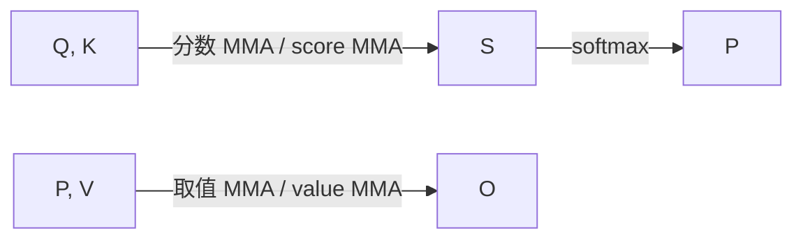

你可以把它想成三个工人排成一条流水线:第一个 MMA 产出分数 `S`,softmax 把 `S` 加工成分子 `P`,第二个 MMA 拿 `P` 去更新输出累加器 `O`。这里有个关键设计:**除以 `row_sum` 那步归一化,被故意拖到了最后的收尾阶段(epilogue)**。非得等所有 K/V tile 都处理完、`O` 攒齐了,才在最后统一除这一次。这恰恰是在线 softmax 的精髓:边累加边维护统计量,最后一锤子归一化,中途绝不反复除。

### 怎么读懂每个 tile 算子:四问 + 一个 Handoff

前面讲 GEMM 那几章,我们用"作用域 / 布局 / 调度(scope / layout / dispatch)"这张卡片来逐个审视 tile 算子。这里照搬同一套问法,只是再添一行 **Handoff(交接)**,专门点出"是哪个(些) mbarrier 把这块 tile 递给下一个角色"。也就是对每个算子问四个问题:

| 问题 | 含义 |
| --- | --- |
| Scope(作用域) | 谁来执行它(哪个 warpgroup / warp / lane) |
| Layout(布局) | 输入输出 tile 各自住在哪里(SMEM / TMEM / 寄存器) |
| Dispatch(调度) | 用什么指令路径发射(如 `tcgen05`) |
| Handoff(交接) | 用哪个 mbarrier 把成果交给下一棒 |

> **注意**:计算代码从来不直接写裸的 TMEM 列号。kernel 把它**唯一那一块 TMEM 分配**切成几个"按阶段命名的视图"——`S_region`、`P_region`、`O_region`,然后拿流水线阶段去索引,比如 `S_region[q_stage]`、`O_region[i_q]`、`P_region[i_q, 0:K_SPLIT]`。这些视图是 `T.TMEMStages` 在《TMEM 布局与复用》那节里定义的。现在你只要把每个 region 当成"同一块物理 TMEM 上的一个有名字的切片"就行。

### 第一阶段:分数 MMA(Score MMA)

每一轮 K/V 迭代,开场就是分数 MMA,它算的是:

$$S = Q_{\text{block}} \, K_{\text{block}}^{\top}$$

然后把 `128 x 128` 的分数 tile 写进 TMEM。核心 API 这么用:

```python
Tx.warp.gemm_async(
    S_region[q_stage],                       # 输出:S 写进 TMEM 的对应阶段视图
    Q_smem[q_stage, 0:BLK_M, 0:HEAD_DIM],    # 操作数 A:Q,来自 SMEM
    K_smem[kv_stage, 0:BLK_N, 0:HEAD_DIM],   # 操作数 B:K,来自 SMEM
    dispatch="tcgen05",                      # 走 tcgen05(第 5 代 Tensor Core)指令路径
    cta_group=CTA_GROUP,
)
if T.ptx.elect_sync():                        # 选出 warp 内的一个 lane
    s_ready.arrive(q_stage)                   # 由这一个 lane 在 s_ready 上 arrive,完成交接
```

按四问拆解:

- **Scope**:由 WG3(warpgroup 3)的 warp 0 发射;再由一个被选中的 lane(elected lane)在 `s_ready` 上 arrive。
- **Layout**:Q、K 都在 SMEM,结果 `S` 落到 TMEM(`S_region[q_stage]`)。
- **Dispatch**:`tcgen05`。
- **Handoff**:`s_ready`(交给 softmax)。

> **注意**:整个交接,就是"被选中的那一个线程在 `s_ready` 上 arrive"这么一个动作。它对外喊一声:这块分数 tile 算完了,softmax warpgroup 可以放心去读了。为什么用单个 lane arrive、而不是整个 warp?就是怕整 warp 一起 arrive 把 barrier 的计数搞乱。

### 中间阶段:夹在两个 MMA 之间的 softmax(Softmax Between MMAs)

两个 MMA 中间夹的就是 softmax,它把分数 tile `S` 加工成分子 tile `P`。这是**整条流水线里唯一一个在 GEMM 里完全找不到对应物的阶段**——它压根不是矩阵乘,而是逐行(row-wise)的标量运算。它的卡片是:

- **Scope**:WG0(对应 Q stage 0)/ WG1(对应 Q stage 1),整个 warpgroup 都参与。
- **Layout**:`S` 在 TMEM → 读进寄存器(registers) → 算出的 `P` 以 fp16 写回 TMEM(`P_region[wg_id]`)。
- **Dispatch**:用 `tcgen05.ld` 读出,用 TMEM store 写回;中间在寄存器里做逐行数学。
- **Handoff**:等待 `s_ready`;完成后在 `p_o_rescale`(前 96 列)和 `p_ready_2`(后 32 列)上 arrive。

WG0/WG1 先等 `s_ready`,确认分数 tile 备好了,然后**一次一个寄存器大小的块(register-sized chunk)** 地把分数从 TMEM 读进寄存器:

```python
Tx.copy_async(
    s_chunk[:, chunk_start : chunk_end],        # 目的地:寄存器侧的分块
    S_region[wg_id, chunk_start : chunk_end],   # 源:TMEM 里的分数 tile
)                                               # 这是 warpgroup 作用域下的 TMEM→寄存器读取
```

分数进了寄存器,softmax warpgroup 就严格按顺序干三件事:

1. 算出每行的行最大值(row max)和行和(row sum);
2. 算出 softmax 分子 tile `P`;
3. 把 `P` 以 fp16 写回 TMEM。

第 3 步的写回长这样:

```python
Tx.copy_async(
    P_region[wg_id, p_start : p_end],   # 目的地:TMEM 中 fp16 的 P 视图
    p_chunk[:, p_start : p_end],        # 源:寄存器里刚算好的 P 分块
)
```

这里很自然会冒出一个疑问:**`P` 我们刚在寄存器里算出来了,干嘛还费劲写回 TMEM?**

答案是:下游的取值 MMA 要把 `P` 当一块**矩阵操作数**来读,而 MMA 指令读不了散落在各个线程里的标量寄存器——它只认共享、规整、能按矩阵布局寻址的内存。在这个 kernel 里,`P` 唯一能被 MMA 读进去的形态,就是 `P_region`(它是搭在 fp16 TMEM 别名 `tmem_as_f16` 上的一个视图)。所以这趟写回**不是白搬**,而是把 `P` 摆成「下一个 MMA 唯一认得的形状」,不做不行。

### 第二阶段:取值 MMA(Value MMA)

每一轮 K/V 迭代收尾的,是取值 MMA,它算的是:

$$O = O + P_{\text{block}} \, V_{\text{block}}$$

走到这一步,`O` 已经被调到当前 K/V 块该有的正确状态了——第一块时被初始化,后面每块时被重缩放(rescale)过——所以这个 MMA 剩下要干的就只有"累加"。它跟普通 GEMM 最大的区别,在于**操作数都住在哪**:A 操作数 `P` 在 TMEM,B 操作数 `V` 在 SMEM,累加器 `O` 也在 TMEM。

```python
# 第一个子 MMA:覆盖 P 的前 96 列(0:K_SPLIT),对应 V 的前 96 行。
Tx.warp.gemm_async(
    O_region[i_q],                                  # 累加器:O 在 TMEM
    P_region[i_q, 0:K_SPLIT],                       # A 操作数:P,来自 TMEM
    V_smem[kv_stage, 0:K_SPLIT, 0:HEAD_DIM],        # B 操作数:V,来自 SMEM
    transB=True,
    accum=should_accumulate,                        # 决定"初始化"还是"累加"
    dispatch="tcgen05",
    cta_group=CTA_GROUP,
)
# 第二个子 MMA 形式相同(accum=True,以 p_ready_2 为门控),
# 负责剩下的 K_SPLIT:BLK_N 这一段列。
```

卡片:

- **Scope**:WG3 的 warp 0。
- **Layout**:`P` 在 TMEM + `V` 在 SMEM → `O` 在 TMEM(`O_region[i_q]`)。
- **Dispatch**:`tcgen05`,且带一个 TMEM 操作数。
- **Handoff**:等待 `p_o_rescale`、`p_ready_2`、`kv_load.full`;完成后在 `o_ready` 上 arrive(交给 epilogue)。

#### 两个 MMA 在硬件上的根本区别:操作数位置

| 项目 | 分数 MMA(Score MMA) | 取值 MMA(Value MMA) |
| --- | --- | --- |
| A 操作数 | Q,来自 **SMEM** | `P`,来自 **TMEM** |
| B 操作数 | K,来自 **SMEM** | V,来自 **SMEM** |
| 累加器/输出 | `S` 写入 **TMEM** | `O` 累加进 **TMEM** |
| 特点 | 两个操作数都从 SMEM 读 | 一个操作数(`P`)从 TMEM 读 |

看得出来:分数 MMA 两个输入都从 SMEM 来;而取值 MMA 把 `P` 这一路输入换成了从 TMEM 直接喂给 Tensor Core——这正是上一步非把 `P` 写回 TMEM 不可的根本原因。

> **注意**:`accum=should_accumulate` 这个标志,就是算法里"初始化还是累加"那个开关的实现:一个 query 块的**第一个** K/V tile 上它是 `False`(直接写,等于初始化),后面每个 tile 上都是 `True`(往上加)。

#### 为什么把取值 MMA 拆成 96 + 32 两刀?

你会发现取值 MMA 不是一发打完的,而是按 `96 + 32` 拆成两次发。流程是这样:

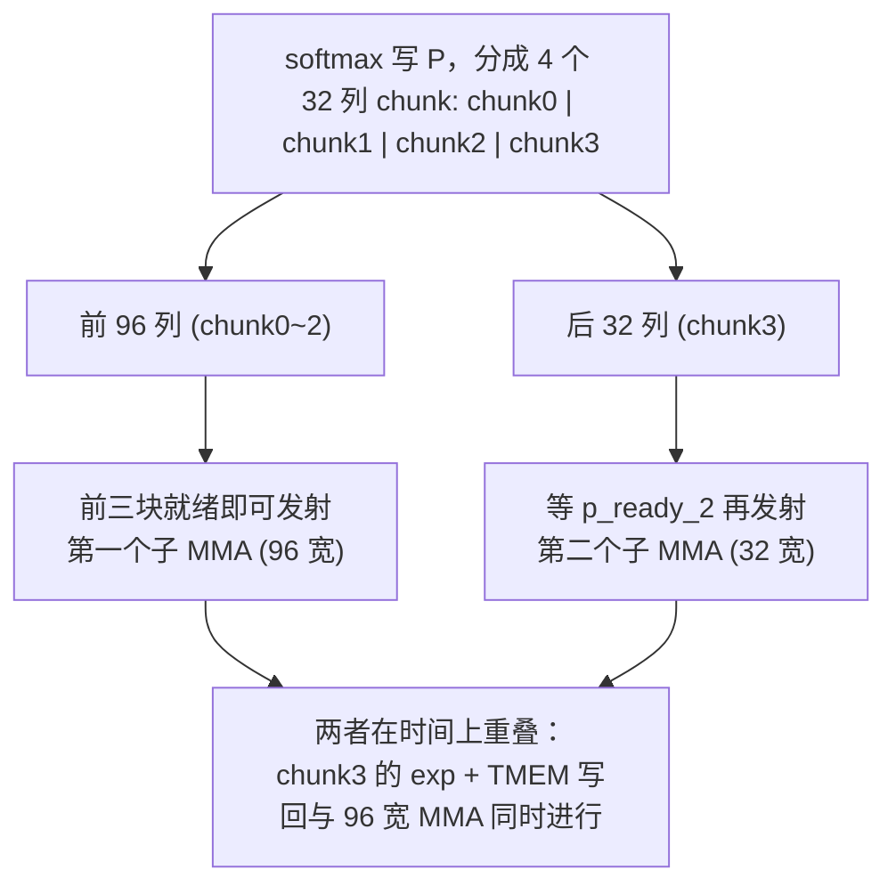

拆分的逻辑是这样:

1. softmax 把 `P` 分成 4 个 32 列的 chunk 来写;
2. 前 3 个 chunk(共 96 列)一备好,取值 MMA 就立刻对着 `P` 的前 96 列和 `V` 的对应行开跑;
3. 最后 32 列得等 `p_ready_2`;
4. 第二个 MMA 把这最后一块吃掉,整个 tile 收尾。

**拆开的根本目的,就是别让 Tensor Core 闲着。** 假如把取值 MMA 当一条整指令来发,那整个阶段就得干等着,等到全部 4 个 32 列 chunk 都求完指数(exp)、都存好为止。而"前三块一就绪就先开打"这么一来,kernel 就把最后一块 chunk 的 `exp` 计算和 TMEM 写回,跟一条已经在飞的 96 宽 MMA 叠到一块儿了——本来要白白浪费的空闲时间,这下变成了有用的计算。这是典型的"用细粒度流水化(pipelining)换吞吐"的手法。
## TMEM 的布局与复用(TMEM Layout and Reuse)

这一小节回答一个看着不起眼、实际牵动全局的问题:`S`、`P`、`O` 这三块中间结果,到底搁哪儿?答案有点出人意料——它们全被塞进**同一块** `128 × 512` 的 TMEM 里。正因为挤在一起,在这个 kernel 里 barrier 和内存布局就成了拆不开的一对:布局把复用逼出来,而复用要想合法,就只能靠 barrier 盯着。

> **注意**:这里的 TMEM 是 Blackwell 架构带来的、专给 `tcgen05` MMA 用的张量内存。它的容量小得可怜(每个 CTA 只有 `128 行 × 512 列` 的 fp32 空间),所以"省着用"在这儿不是什么优化技巧,而是硬性约束。

### 三类 tile slot 共享同一块分配

你可以把这块 TMEM 想成一排 tile 槽位(tile slot),每一类数据占其中一段:

| 槽位类型 | 存放内容 | 数据含义 |
|---|---|---|
| Score slots(分数槽) | `S = QK^T` | 注意力打分矩阵 |
| Numerator slots(分子槽) | softmax 指数化之后的 `P` tile | 即 `exp(S - rowmax)` |
| Output slots(输出槽) | fp32 的 `O` 累加器 | 最终输出的累加结果 |

关键在于:**这三类槽位不是各自独立的缓冲区**,而是同一块物理分配上的不同区域。这么共享不是为了代码好看,纯粹是被容量逼的。

算笔账你就明白"被逼"这俩字一点不夸张。设 Q 方向的流水线深度(Q-pipeline depth)是 2:

TMEM 总容量:128 行 × 512 列(fp32)。逐项算账:

| 占用项 | 列数计算 | 列数 |
| --- | --- | --- |
| 两个 S 槽 | 2 × `MMA_N` = 2 × 128 | 256 |
| 两个 O 槽 | 2 × `MMA_N` = 2 × 128 | 256 |
| **合计已占用** | | **512(正好占满!)** |
| 留给 P 的空间 | 512 − 512 | **0** |

也就是说,光 `S` 和 `O`(各两个流水线 stage)就把 512 个 fp32 列**全吃光了**,一列不剩。`P` 连个落脚的地方都没有。

### `P` 如何"无中生有":fp16 视图的别名(aliasing)技巧

fp32 这个视角下既然腾不出地方,kernel 就换个视角看同一片字节:用 **fp16 视图**把这块物理内存重新盖一遍。道理很简单——fp16 元素只有 fp32 的一半宽,同样多的字节,用 fp16 来数就能数出**两倍**的列。`P` 就住进这些「凭空冒出来」的列里。

下面这段代码就是别名技巧的核心:先拿一个 fp32 视图,然后把内存池的基址**倒回 0**,再在**一模一样的那片物理字节**上拿一个 fp16 视图:

```python
tmem_pool = T.TMEMPool(pool, total_cols=N_COLS_TMEM, cta_group=CTA_GROUP, tmem_addr=tmem_addr)
tmem = tmem_pool.alloc((128, N_COLS_TMEM), "float32")        # fp32 视图:给 S 和 O 用
tmem_pool.move_base_to(0)                                    # 关键:基址倒回 0,准备复用同一片字节
tmem_as_f16 = tmem_pool.alloc((128, N_COLS_TMEM * 2), "float16")  # fp16 视图:列数翻倍,给 P 用
tmem_pool.commit()
```

`move_base_to(0)` 是整个技巧的命门:它让第二次 `alloc` 从同一个起点开始分,于是 `tmem`(fp32)和 `tmem_as_f16`(fp16)指的就是**同一块物理内存**,只不过用两种宽度去解读。注意 fp16 视图的列数是 `N_COLS_TMEM * 2`,这正好对应"元素半宽 → 列数翻倍"的换算。

> **注意**:这套别名能安全跑,唯一的前提是**时序**——每块区域都得严格等它"上一任消费者"用完了,才被重新启用。而保证这个时序的,恰恰是 barrier。所以在 FA4 里,barrier 不只是个调度工具,它从根上让这套布局**合法**。下一小节会专门拿一张 barrier 表来捋"每块区域复用之前,得先等谁干完"。

### 用 `T.TMEMStages` 把字节切成按 stage 索引的区域

有了这两个视图,内核就用 `T.TMEMStages` 把 `S`、`P`、`O` 各自切成"分阶段(staged)"的区域。好处是:计算代码可以**按流水线 stage 去索引**,根本不用碰原始列号。

```python
# S 用 fp32 视图,从第 0 列开始
S_region = T.TMEMStages(tmem,        col_start=0,                       width=MMA_N, stages=SMEM_PIPE_DEPTH_Q, stride=MMA_N)
# O 用 fp32 视图,紧接在两个 S 槽之后(MMA_N * 深度)
O_region = T.TMEMStages(tmem,        col_start=MMA_N * SMEM_PIPE_DEPTH_Q, width=MMA_N, stages=SMEM_PIPE_DEPTH_Q, stride=MMA_N)
# P 用 fp16 视图,stride 要 ×2 才能落到正确的物理字节
P_region = T.TMEMStages(tmem_as_f16, col_start=MMA_N,                   width=BLK_N, stages=SMEM_PIPE_DEPTH_Q, stride=MMA_N * 2)
```

这里唯一让别名"露馅"的地方,就是 `P_region` 那个 `stride=MMA_N * 2` 里的 `* 2`:

- `S_region` 和 `O_region` 是按 **fp32 的 `tmem` 列**来量的;
- `P_region` 是按 **fp16 的 `tmem_as_f16` 列**来量的,而 fp16 列只有 fp32 列的一半宽;
- 所以,`P` 在 stage 之间挪动时,要想**落到跟 fp32 布局对齐的同一批物理字节上**,跨 stage 的步长就得**翻倍**。

拿一张图,就能直观看出三块区域在同一片字节上是怎么对应的(以流水线深度 2 为例):

物理 TMEM 是 128 行 × 512 fp32 列;fp16 视图把同一片字节按半宽元素重新数,列数翻倍(0 ~ 1023)。两个视图在同一片字节上的对应关系如下:

| 字节区间(按 fp32 列) | 0–128 | 128–256 | 256–384 | 384–512 |
| --- | --- | --- | --- | --- |
| fp32 视图 | S 槽0 | S 槽1 | O 槽0 | O 槽1 |
| fp16 视图(列号 ×2) | fp16 0–256 | fp16 256–512 | fp16 512–768 | fp16 768–1024 |
| `P_region` | | P 槽0 | P 槽1 | |

`P_region` 的 `col_start = MMA_N = 128`(fp16 列),步长 `= MMA_N*2 = 256`(fp16 列);跨一个 P 槽正好覆盖一个 fp32 槽的字节宽度。

> **注意**:`P_region` 的 `col_start=MMA_N` 和 `stride=MMA_N*2` 都是按 **fp16 列**量的(fp16 列只有 fp32 列一半宽)。所以 P 的字节不是简单"接在 O 后头",而是借用了 fp32 视图里某些槽位对应的同一片字节——`P` 跟 `S`/`O` 能合法共存,全靠 barrier 保证的时序,而不是靠地址互不重叠。

可以这么理解:`P` 借住在那段已经算完、不再要的字节里——`S` 一算完,softmax 把它变成 `P` 写回去,这段字节的"身份"就从 fp32 的 `S` 切成了 fp16 的 `P`,靠的就是同一块内存被两个视图以不同宽度共用。

### 区域定义好之后,计算代码反而很干净

底层那套别名换算虽然绕,可一旦区域定义好了,上层计算代码就根本不用操心原始列号。它只管按 stage / warpgroup 去读写:

```python
S_region[q_stage]        # 写入 S
S_region[wg_id, ...]     # 读取 S
P_region[wg_id, ...]     # 写入 P
O_region[i_q]            # 累加到 O
```

整段计算代码**从头到尾没碰过一个原始列索引**。"哪段字节归谁、fp16 步长要乘 2"这些脏活,全被塞进了 `T.TMEMStages` 的区域定义里。这正是好抽象该干的事:把"被容量逼出来的别名复杂度"圈在一个角落,让主干逻辑保持清清爽爽。

### 和你的 agent 一起试试

你可以让你的 AI agent 来讲讲这个 FA4 内核里的 fp32(`tmem`)视图和 fp16(`tmem_as_f16`)视图:`S`、`P`、`O` 各自落在哪块物理 TMEM 区域?`P_region` 的 stride 为什么是 `MMA_N * 2`?至于"复用"这个问题——某块区域要重新启用,得先等哪些消费者干完——留到下一小节,看完 barrier 表再回来对照。
## barrier 如何把各个角色「接线」起来(How Barriers Connect the Roles)

这是整个 kernel 里最难啃的一块,所以最好一层一层剥开看。前面几节已经把活儿分到了不同的 warpgroup:WG3 开硬件引擎(TMA load、MMA、TMA store),WG0/WG1 做 softmax,WG2 做修正(correction)和收尾(epilogue)。可问题是——这些角色彼此**不说话**,它们只能靠 barrier 互相「递东西」。这一节要干的,就是把这些 barrier 看成一张「谁把哪块 tile 交给谁」的接线图。

### 先抓主干:只有 5 个搬运数据的 handoff

面对一长串 barrier,正确的打开方式是:**先只盯那几个真正在主计算路径上搬数据的 handoff,其余的一律先当成「记账(bookkeeping)」,以后用到再查**。真正「数据就绪(data-ready)」的交接,就下面这 5 条:

| 交接(handoff) | 含义 |
| --- | --- |
| TMA load → score / value MMA | Q、K 或 V 已经到达 SMEM,可以喂给 MMA |
| score MMA → softmax | `S` 已在 TMEM 里就绪 |
| softmax / correction → value MMA | `P` 已在 TMEM 里就绪,且 `O` 可以安全累加 |
| value MMA → epilogue | 最终的 `O` 已在 TMEM 里就绪 |
| epilogue → TMA store | `O_smem` 已就绪,可以写回 |

除此之外的所有 barrier,本质上都是**流水线记账**:它们管的是释放某块 SMEM / TMEM / 暂存(staging)缓冲区,好让另一个角色拿去复用。

> **注意**:好消息是,一个 barrier 不管是搬数据还是单纯记账,**读法都一样**——都是一次「tile 交接」。每碰到一个 barrier,就问三句:**谁生产了数据?谁来消费?两边都用完之后,哪块缓冲区被腾出来了?** 这三问问清楚,再玄乎的 barrier 也就那么回事。

### 两个 MMA 的「就绪闸门」

把上面这些交接收一收,关键就看两个 MMA 各自在等什么。这里要摆正一个心态:**这些 barrier 是「正确性闸门(correctness gate)」,不是「时间表(schedule)」**。它只回答「这个 MMA 开火前得满足哪些条件」,至于「什么时候发生」它压根不管。

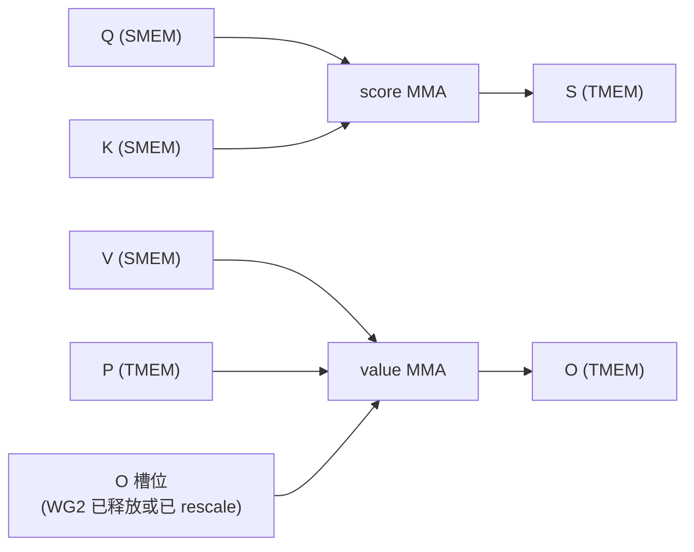

- **score MMA** 就等两样:Q、K 都到了 SMEM。等齐了就产出 `S`。
- **value MMA** 得**同时**等三样:V 在 SMEM、softmax 给的 `P` tile、还有一个能安全写入的 `O` 槽位(WG2 要么已经把旧 `O` 释放掉,要么已经给它重缩放好了)。

`P` 的就绪为什么被**拆成两半**?就是因为上一节那个 `96 + 32` 调度:`P` 前 96 列一就位,value MMA 就能先开火,最后 32 列由另一个闸门 `p_ready_2` 单独放行。

### 唯一的「异类」:softmax → correction 的标量信箱

有一个交接不走「tile 就绪」这套路子:**softmax 到 correction 这条边**。它递过去的不是一块 tile,而是**一个标量**——在 K/V 循环里是缩放因子 `acc_scale`,在 epilogue 里是最终的行和 `row_sum`。这个标量通过一个**只有一格的 SMEM「信箱(mailbox)」**交给 WG2。

正因为这一格信箱**每轮迭代都得复用**,所以没法用普通的 tile 就绪闸门,得用一对 `full` / `empty` barrier 守着它——这是个标准的「生产者-消费者通道」,而不是 tile-ready 闸门:

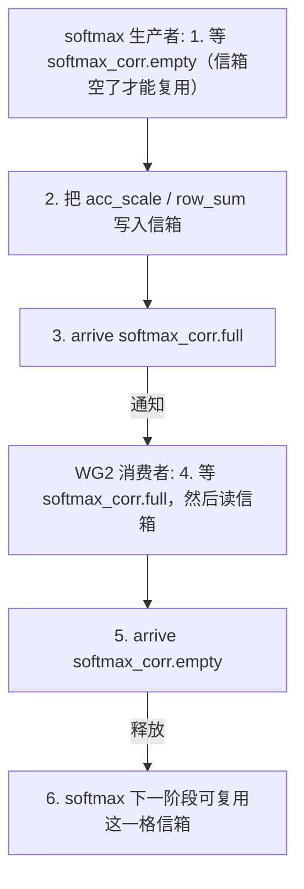

这套握手一步步是这样:

1. softmax 先等 `softmax_corr.empty`,确认信箱已经腾空,才能复用这一格;
2. softmax 把 `acc_scale` 或最终的 `row_sum` 写进信箱;
3. softmax 在 `softmax_corr.full` 上 arrive(喊一声「写好了」);
4. WG2 等 `softmax_corr.full`,然后把信箱读出来;
5. WG2 在 `softmax_corr.empty` 上 arrive(喊一声「读完了」);
6. 到下一阶段,softmax warpgroup 就能复用这一格信箱了。

> **注意**:`softmax_corr.empty` 的含义**特别容易看岔**,务必盯清楚。它**只**说明「WG2 已经把这一格标量消费掉了」,它**绝不**代表 `P` 就绪,**更不是**放行 value MMA 的那道闸门。放行 value MMA 的闸门是 `p_o_rescale`(只在 `P` 前 96 列写好、且 `O` 槽位能安全累加时才触发)。把这俩搞混,是一类经典「结果算错」bug 的源头。

### 完整 barrier 清单(参考表)

主干捋清楚了,下面这张完整清单就当查阅手册用。每一行还是老规矩——「谁 → 谁」、「什么变安全了」:

| Barrier | 生产者 → 消费者 | 什么变得安全了 |
| --- | --- | --- |
| `q_load.full` | TMA load → score MMA | Q 的 SMEM tile 可以喂 MMA |
| `q_load.empty` | 本 Q 阶段的所有 score MMA → TMA load | Q 的 SMEM 阶段可被下一个 task 复用 |
| `kv_load.full` | TMA load → score / value MMA | K 或 V 的 SMEM tile 可以喂 MMA |
| `kv_load.empty` | score / value MMA → TMA load | K/V 的 SMEM 阶段可被复用 |
| `s_ready` | score MMA → softmax | TMEM 里的 `S` tile 可读 |
| `p_o_rescale` | softmax + WG2 → value MMA | `P` 的前 96 列已在 TMEM,且 `O` 槽位可安全累加 |
| `p_ready_2` | softmax → value MMA | `P` 的最后 1/4(32 列)已在 TMEM |
| `o_ready` | value MMA → epilogue | 最终的 `O` 累加器就绪 |
| `softmax_corr.full` | softmax → WG2 | `acc_scale` 或最终 `row_sum` 已在 SMEM 信箱里就绪 |
| `softmax_corr.empty` | WG2 → softmax | WG2 读完后,同一格信箱可复用 |
| `corr_epi.full` | epilogue → TMA store | `O_smem` 就绪,可以写回 |
| `corr_epi.empty` | TMA store → epilogue | `O_smem` 阶段可被复用 |

### 看「谁发信号」就能猜出 barrier 类型

跟 GEMM 一样,**barrier 是哪种类型,看「谁来发完成信号」就知道了**,这条规律反过来还能帮你读代码:

| 信号来源 | barrier 类型 | 为什么 |
| --- | --- | --- |
| TMA load | `TMABar` | TMA 引擎自己**按字节计数(byte-count)**来判断搬运完成 |
| MMA 完成 | `TCGen05Bar` | `tcgen05.commit` 负责给整个「完成组(completion group)」发信号 |
| 纯线程间交接 | `MBarrier` | 参与的线程各自**显式 arrive** |

### 拆开看 softmax → value 的双闸门

softmax 到 value 这个交接值得再放大看一眼,它用了两道闸门:

- **`p_o_rescale`**:`P` 前 96 列写好、且 `O` tile 能安全累加时,放行 value MMA 开跑;
- **`p_ready_2`**:放行 `P` 的最后 32 列,正好对上上一节那个 `96 + 32` 的 value-MMA 调度。

**第一个 K/V 块最省心。** 这会儿还没有「旧 `O`」要 rescale,所以 WG2 干脆对 `p_o_rescale` 直接**预先 arrive(pre-arrive)**——相当于一上来就把这道闸门打开,反正也没活可干。

**后面的块就得当心了。** WG2 必须等到自己**要么跳过了一次不必要的 rescale,要么已经把旧 `O` 缩放完了**,才在 `p_o_rescale` 上 arrive。这里有个**故意做得保守**的「跳过判定」:

```python
# softmax 端:用 log2 尺度计算新旧最大值的差
delta = (m_old - m_new) * scale_log2
if delta > -rescale_threshold:
    # 新最大值没动多远,不值得 rescale:沿用旧 max,acc_scale 直接置 1.0
    acc_scale = 1.0
else:
    # 只有最大值跳得够大,才走 exp2 路径,真正请求 WG2 去 rescale O
    acc_scale = exp2(delta)
```

说白了就是:只有最大值「跳」得够大,才走 `exp2` 路径、真正叫 WG2 去 rescale `O`。

拿到 softmax 的信号后,WG2 还要用 `any_sync` 把整个 warpgroup 里的 `should_rescale` 归约一遍:

```python
# 整个 warpgroup 内做一次 OR 归约:只要有任何一行需要 rescale 就触发
if T.ptx.any_sync(should_rescale):
    rescale_O()   # 否则整块 O 原封不动
```

这个「跳过」为什么重要?因为 rescale `O` 是一次横跨整个累加器的 **TMEM → 寄存器(RF) → TMEM** 读-改-写。要是阈值逻辑已经把 `acc_scale` 定成 1.0 了,那这趟读-改-写就是**纯浪费**,能跳当然要跳。

### 为什么所有新 barrier 都挤在 softmax 周围?

最后还有一个观察值得点破:**所有新增的 barrier 都挤在同一个地方。** `s_ready`、`p_o_rescale`、`p_ready_2`,加上 `softmax_corr` 这一对,**全围着 softmax 转**。

它们存在的理由只有一个:**score MMA 和 value MMA 不再挨着了。** 在 GEMM 里两个 MMA 可以背靠背连发;可在 Attention 里,中间硬塞进了寄存器上的数学运算、TMEM 的回写、还有对输出的 rescale——这中间的每一步,都得配一次自己的交接。说到底,barrier 的数量,就是「softmax 这段非 MMA 工作」复杂度的直接写照。

> **和你的 agent 一起试试**:让它把**一个 K/V 块**完整走一遍 `s_ready` → `p_o_rescale` → `p_ready_2` → `o_ready`。每碰到一个 barrier,都把四件事问清楚:谁在等?谁来 arrive?哪块 tile 变得能读了?之后哪块存储能被复用了?
## 流水线结构:同一时刻到底谁在干活(Pipelining Structure)

上一节讲的 barrier 回答的是「正确性」问题:某个角色(role)消费一个 tile 之前,**哪些东西得先备齐**。可 barrier 有一件事不告诉你——**实际上到底谁和谁在同时跑**。这一节就来回答这第二个问题。

这俩真是两码事。一道正确性闸门啥时候被满足,跟生产者啥时候真正在跑,可以差出十万八千里——可能早得多,也可能晚得多。换句话说,「`S` 就绪了没」这个检查发生在哪一刻,跟「`S` 到底是啥时候算出来的」根本不绑定。barrier 图回答的是依赖关系,这一节要画的是**时间线(timeline)**。

### 没有「单一流水线深度」这回事

GEMM 里我们习惯问「流水线深度(pipeline depth)是几」——因为 GEMM 只有一条数据流(K 维度上的 tile),所有东西都跟着同一个节奏走。FA4 这套就不行了:不同的 tile 流(tile stream)前进的速度不一样,所以**每条流各管各的环形缓冲(ring buffer)**,各有各的深度。

| 流水线(tile 流) | 深度 | 含义 |
| --- | --- | --- |
| Q 流水线 | 2 | 一个 CTA 同时处理两个 Q stage:WG0 负责其中一个,WG1 负责另一个 |
| KV 流水线 | 3 | K、V 块在内层循环里不断流过,而同样的两个 Q stage 被反复复用 |
| TMEM 流水线 | 2 | 每个 Q stage 拥有自己的一组 S/P/O 的 TMEM slot;等对应 barrier 触发后这些 slot 才被回收复用 |

> **注意**:把这三条流水线分开看,是关键。Q 为什么是深度 2?因为「两个 Q stage 并行算 softmax」(WG0 和 WG1 各管一个);KV 为什么是深度 3?因为我们想让 TMA 多提前预取几个 K/V 块,把访存延迟藏起来;而 TMEM slot 的复用又各自被对应的 barrier phase 卡着。三套节奏彼此独立,没法用一个数字一概而论。

### 从「正确性闸门」切到「时间线视角」

原文这里给的是一张时间线示意图(timeline)。它跟上一节的 barrier-flow 图回答的是两个不同问题:

- **barrier-flow 图**:去这儿查「精确的生产者-消费者等待关系」(谁等谁)。
- **时间线图(本节)**:去这儿看「大致同一时刻,哪些角色正活跃着」。

下面拿一张表,把一条「有代表性的流水线波次(pipeline wave)」的时间线重画一遍:行 = 角色(对应代码里的一个 role branch),列 = 大致的时间步(从左往右推进),格子 = 那一刻这个角色在干啥。

| 角色 | t0 | t1 | t2 | t3 | t4 | t5 | t6 | … |
| --- | --- | --- | --- | --- | --- | --- | --- | --- |
| WG3 warp1 TMA load | Q0 | K[n-1] | Q1 | V[n-1] | K[n-2] | V[n-2] | K[n-3] | … |
| WG3 warp0 MMA | | S0 | S1 | PV0 | S0' | PV1 | S1' | … |
| WG0/WG1 softmax | | | P0 | P1 | | P0' | P1' | … |
| WG2 rescale | | | | release | rescale O | … | normalize | … |
| WG3 warp2 TMA store | | | | | | | O 写回 | … |

> 说明:`Sx` = 第 x 个 Q stage 的 score MMA;`PVx` = 第 x 个 Q stage 的 value MMA;带撇号(`'`)的是进了下一个 K/V 块之后的同名操作;MMA 这一行里,score 和 value 是交错着发的。你能看到 score、softmax、correction(rescale)、value 这几行在时间上是**彼此重叠**的(同一列里好几个角色都在动),而不是一个干完再轮下一个。

每一行对应的角色,正好就是 kernel 里那几个分支:

- **WG3 warp 1**:发起所有 TMA load(把 Q/K/V 从 GMEM 搬进 SMEM)。
- **WG3 warp 0**:发起 score MMA **和** value MMA(两种 MMA 都归它管)。
- **WG0 和 WG1**:为两个 Q stage 分别跑 softmax。
- **WG2**:负责 `O` 的 release / rescale,最后再做一次最终输出的归一化(normalize)。
- **WG3 warp 2**:发起 TMA store(把最终的 `O` 写回 GMEM)。

### 跟着一条波次从左往右走

把上面的时间线从左往右读一遍,就是一次完整的流水线波次:

1. **load warp 先起步**:先发 `Q0`、`K[n-1]`、`Q1`、`V[n-1]`,然后接着往下流式预取索引更低的 K/V 块(`K[n-2]`、`V[n-2]`……)。留意一下,K/V 是从高索引往低索引走的。
2. **MMA warp 跟上**:先发头几个 score MMA,产出 `S0` 和 `S1`。
3. **WG0/WG1 接棒**:把 `S0`、`S1` 经过 softmax 变成 `P0`、`P1`。

### 关键设计:MMA warp 必须把 score 和 value **交错**发

这是本节最重要的一点。MMA warp **千万不能**先把所有 score MMA 发完、再去发所有 value MMA。等两个 Q stage 都「热身(primed)」好了,它就开始**交替**发两种 MMA:给当前 `V` 块发一个 value MMA,紧接着给下一个 `K` 块发一个 score MMA,就这么来回倒:

| 发射顺序 | 类型 | 运算 | 备注 |
| --- | --- | --- | --- |
| 1 | score | Q0 * K[n-1] | |
| 2 | score | Q1 * K[n-1] | |
| 3 | value | P0 * V[n-1] | 开始交错:value 进来了 |
| 4 | score | Q0 * K[n-2] | |
| 5 | value | P1 * V[n-1] | |
| 6 | score | Q1 * K[n-2] | |
| 7 | value | P0 * V[n-2] | |
| … | … | … | |

**为什么非得这么交错?** 因为正是这种交错,才让时间线里 score、softmax、correction、value 这四行**叠**到了一起,而不是排成一队规规矩矩地一个接一个跑。要是先把全部 score 做完再做全部 value,Tensor Core 在两段之间就会空出一大段窗口,softmax 和 rescale 也没法跟 MMA 并行——流水线一下就退化成串行了。

### WG2 那一行:release / rescale 的两种情形

时间线里 WG2 那一行写的是 `release / rescale`,这两个词对应的就是我们之前见过的两种情况:

| 情形 | WG2 干什么 | 原因 |
| --- | --- | --- |
| **第一个 K/V 块** | 只参与 handoff,让 value MMA 能往下走(只 release) | 此时还没有「旧的 `O`」,无需 rescale |
| **后续 K/V 块** | 在 value MMA 累加进 `O` 之前,可能先 rescale 旧的 `O` | running max 变了,旧 `O` 的比例失真,需要先校正 |

而**归一化(normalization)和 TMA store 只来这么一次**——非得等整个 attention task 的**最后一个** K/V 块处理完了,才动手。

### 为什么 FA4 没法用「一条 GEMM 式流水线」来描述

收个尾,回到本节的主旨:**没有哪条 GEMM 式的单一流水线能描述 FA4**,因为 Q、K/V、TMEM slot 各走各的**独立时间表**。这正是前面要拆出三个环形缓冲、三个深度的原因。

TIRx 的做法,是把这些时间表**明明白白**地摊开:用分开的 tile buffer、各自的 `PipelineState` 游标(cursor)、各自的 barrier phase 来表达,而**不是**把整个 kernel 藏到一个庞大的单体原语(monolithic primitive)后面。

> **注意**:这是个明摆着的工程取舍。代价是「活动部件(moving parts)更多」——你得同时盯着好几个 ring、好几个游标、好几个 barrier;但好处是**复杂度始终摆在明面上、看得见也查得了(visible and inspectable)**。kernel 一出问题,你能一条 tile 流一条 tile 流地去追,而不是干瞪着一个黑盒。
## 重缩放与写回(Rescaling and Writeback)

在线 softmax 的精髓就在「边算边修正」。每来一个新分数 tile,每行的最大值 `m` 都可能被刷新。`m` 一变,之前加进 `O` 的那些结果就尴尬了——它们是用旧 `m` 算的,整体偏大。这一小节讲两件事:这一步非做不可的修正(也就是重缩放),还有 K/V 循环跑完之后,怎么把最终结果归一化再写回显存。

### 为什么重缩放是「必须」而不是「优化」

不少人第一次看 Flash Attention,会以为重缩放是个性能技巧,图省事可以跳过。恰恰相反:**它是保证结果正确的硬性步骤,跳不得**。

顺一遍逻辑就明白了。在线 softmax 不是一口气看到所有分数的,而是一块一块往上加。算每一块时,用的是「当时已知的最大值 `m_old`」来做指数减法。等下一块带来个更大的 `m_new`,麻烦就来了:之前加进 `O` 的每一项,都比它该有的值大了一个倍数 `exp(m_new - m_old)`。不修正?那先来的块就被「加权过头」了,最终输出直接算错。

修正办法是把已经累加的 `O` 整体乘上一个缩小因子:

$$O_{\text{old}} \leftarrow O_{\text{old}} \cdot e^{(m_{\text{old}} - m_{\text{new}}) / \sqrt{d}}$$

注意 `m_old - m_new ≤ 0`,所以这个因子 `≤ 1`,刚好把之前偏大的部分缩回来。

> **注意**:这里的 `m`(`row_max`)存的是**原始、没缩放过**的 `QK^T` 分数的最大值,所以指数项里得额外带上 `1/√d` 这个注意力缩放因子。这个约定后面写 LSE 时还会再用到一次。

### 这是一次完整的 TMEM → 寄存器 → TMEM tile 操作

还有一点也常被误解:重缩放**不是几个标量的小记账**,而是对整个 `O` 累加器(accumulator)来一次完整的「读出—乘—写回」。`O` 待在 TMEM 里,得先用 `tcgen05.ld` 把整块 tile 读进寄存器,在寄存器里逐元素乘上缩放因子,再写回 TMEM。

这活儿拆给两个角色合作完成:
- **Softmax 角色**:负责算出每行的缩放因子 `acc_scale`,塞进 SMEM「信箱(mailbox)」里。
- **WG2(第二个 warpgroup)**:等 `softmax_corr.full` 信号,从 TMEM 把当前的 `O` 读出来,乘上缩放因子,再写回 TMEM。

核心代码片段(关键行加了中文注释):

```python
RESCALE_TILE = T.meta_var(16)
o_row = T.wg_reg_tile(RESCALE_TILE)                       # 在寄存器中开一块 tile
Tx.copy_async(o_row, O_region[i_q, d_start : d_start + RESCALE_TILE])  # TMEM → 寄存器(tcgen05.ld)
Tx.mul(o_row, o_row, acc_scale)                          # 寄存器内逐元素乘缩放因子
Tx.copy_async(O_region[i_q, d_start : d_start + RESCALE_TILE], o_row)  # 寄存器 → TMEM(TMEM store)
T.ptx.tcgen05.wait.st()                                  # 等待 TMEM 写回完成,保证后续 MMA 看到新值
```

#### Tile 原语读出卡:修正(rescale)

本书每个阶段都拿同一张「读出卡」来统一描述,这一阶段的卡片是这样:

| 项目 | 内容 |
| --- | --- |
| 作用域(Scope) | WG2,整个 warpgroup |
| 布局(Layout) | `O` 在 TMEM → 寄存器 → `O` 在 TMEM(`O_region[i_q]`) |
| 派发(Dispatch) | `tcgen05.ld` 读出,TMEM store 写回,中间在寄存器里做乘法 |
| 交接(Handoff) | 等待 `softmax_corr.full`;完成后触发 `p_o_rescale`(→ value MMA)和 `softmax_corr.empty`(→ softmax) |

### 端到端的同步流程

重缩放最微妙的地方,就在于几个角色之间的握手(handoff)。一整轮的同步,可以画成下面这条流水线:

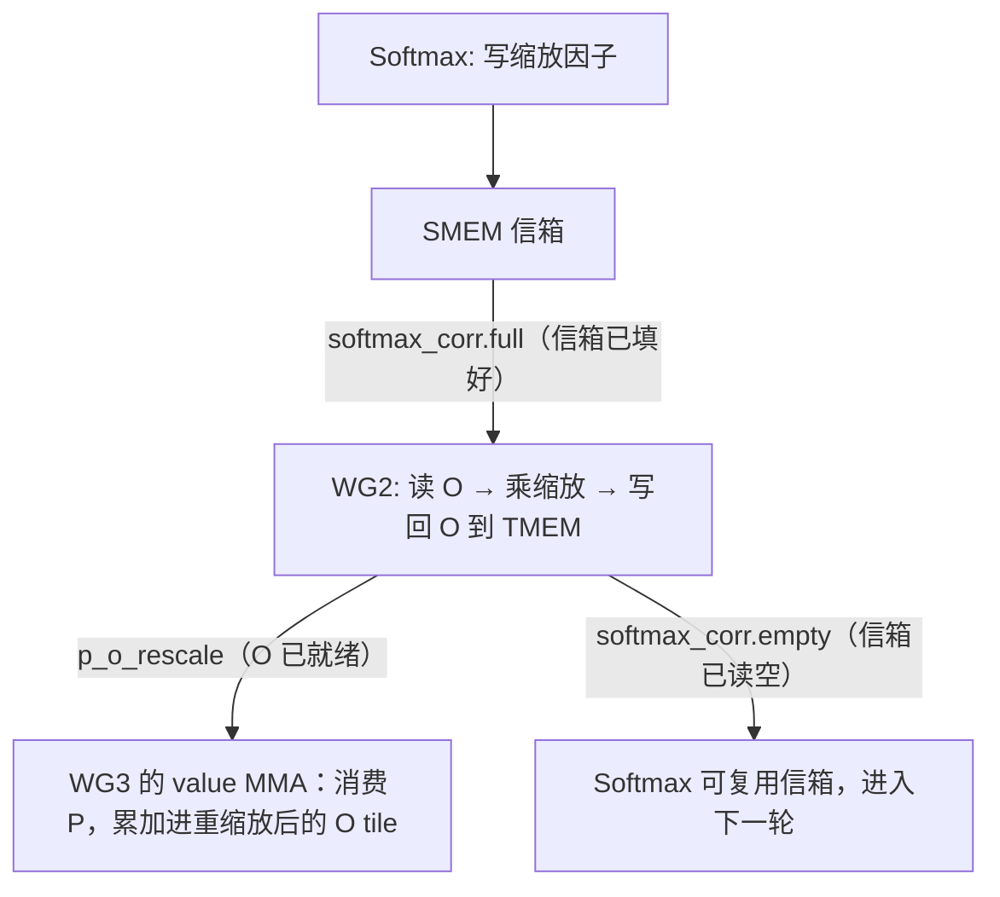

一步一步拆开看:

1. Softmax 把缩放因子写进 SMEM 信箱。
2. WG2 等 `softmax_corr.full`(确认信箱写好了)。
3. WG2 在 TMEM 里把 `O` 重缩放一遍。
4. WG2 在 `p_o_rescale` 上「到达(arrive)」,宣告 `O` 已经是新值了。
5. 到这时候,WG3 的 value MMA 才能安全地消费 `P`,把结果累加进**已经重缩放过**的 `O` tile。

整个循环靠 `softmax_corr.empty` 来闭合:WG2 读完信箱、把这个 SMEM 槽位释放掉,softmax 角色下一轮就能复用同一个信箱。

> **注意**:第 5 步那个顺序约束是关键——必须先把 `O` 重缩放,WG3 的 value MMA 才能往里加;不然新一块结果就会被加到还没缩小的旧 `O` 上,前面那番修正全白费。`p_o_rescale` 这个 mbarrier,干的就是强制这个先后次序的活。

### K/V 循环结束后:从修正切换到收尾(epilogue)

所有 K/V 块都处理完了,WG2 就从「修正」模式切到「收尾」模式,把最终结果归一化、写回显存:

1. 等最终的 `row_sum` 和 `o_ready` 信号。
2. 从 TMEM 读出最终的 `O`。
3. 乘上 `1 / row_sum`——**这就是我们一开始故意往后拖的那次归一化**(除以分母这步留到最后统一做,是在线 softmax 省算力的惯用招)。
4. 把结果转成(cast)fp16。
5. 写进 `O_smem`。

最后,由 WG3 的 TMA store warp 把 `O_smem` 通过 TMA 搬回 GMEM(全局显存)。

### 一个需要注意的限制:只有前向输出,没有 LSE

想拿这个 kernel 去扩展的人得留个心:**它只算前向输出(forward output)**。而训练场景下的前向传播,一般还得存下反向用的对数和指数(log-sum-exp,LSE)。

要补 LSE,有个缩放细节绕不开。前面说过,本 kernel 的约定是:
- `row_max` 存的是**原始、没缩放过**的 `QK^T` 分数的最大值;
- `row_sum` 累加的是 `exp((S - row_max) / √d)`。

因为 `row_max` 身上没带 `1/√d`,所以你在拼自然对数形式的 LSE 时,得把这个缩放因子重新补回 `row_max`:

$$\mathrm{LSE}_i = \log(\mathrm{row\_sum}_i) + \mathrm{row\_max}_i / \sqrt{d}$$

> **注意**:这个实现「只出前向输出」,不写 LSE。要是想支持训练的反向传播,记得按上面的式子把 `1/√d` 补回去,否则 LSE 的数值会差一个常数因子。
## 因果掩码(Causal Masking)

因果注意力(causal attention)里有条硬规矩:**一个 query 只能看「自己这个位置或更早位置」的 key**。换句话说,对第 `i` 个 query 来说,它在分数矩阵里合法的列只到第 `i` 列,后面的 key 全是「未来」,必须当作不存在。

FA4 处理这条规矩的办法很利落:**已经成型的那条数据通路(data path)它一概不碰**——score MMA、softmax、value MMA 整套流程原封不动。因果模式只在两个地方动手脚,一个图「省」,一个图「准」:

- **省**:那些纯属未来、对当前 Q 块一点贡献都没有的 K/V 块,整块整块直接跳过;
- **准**:对横跨对角线的那一两个块,逐行把越界的列精确屏蔽掉。

下面这两手分别看。

### 先看「省」:整块跳过对角线上方的 K/V 块

把分数矩阵想成一张二维网格:行是 query,列是 key,对角线就是「query == key 位置」那条线。因果约束下,**对角线右上方(列号大于行号)整片区域都非法**。

按块一划分,很多 K/V 块会**整块**落在某个 Q 块所需范围的右上方——里面每一列都是未来,对这个 Q 块的输出贡献是零。既然如此,根本没必要把它们从 GMEM 搬进来,更别说跑 MMA 和 softmax 了。

实现里用 `get_n_block_max(...)` 算出「当前 Q 块**顶多**用得到的最后一个 K/V 块」,然后 K/V 循环对超出这个上界的块,就干脆**不加载、也不计算**了。

```python
# 根据当前 Q 块的位置,算出它真正需要遍历的最后一个 K/V 块编号
n_block_max = get_n_block_max(...)
for n_block in range(n_block_max):   # 越界的块直接不进循环
    ...                              # 正常的 load / score MMA / softmax / value MMA
```

> **注意**:这一手纯粹是「省工」——被跳过的块,连数据都不搬。因为上三角(对角线右上方)整块都被跳掉,平均下来因果 kernel 只需算全注意力(full attention)大约一半的 K/V 块(越靠后的 Q 块要遍历的 K/V 越多,越靠前的越少),这正是它比全注意力快的主要原因。

下图直观看一下哪些块被跳过、哪些块要逐列精修(拿一个靠中间的 Q 块举例):

以一个靠中间的 Q 块为例,它对各 key 块的处理(横轴是 key 块编号):

| key 块 | 0 | 1 | 2 | 3 | 4 | 5 |
| --- | --- | --- | --- | --- | --- | --- |
| 处理方式 | ✔ | ✔ | ◐ | ✗ | ✗ | ✗ |
| 含义 | 全保留 | 全保留 | 跨对角线(逐列掩码) | 整块跳过 | 整块跳过 | 整块跳过 |

- ✔ 完全在对角线下方:每一列都合法,无需掩码
- ◐ 横跨对角线:跑 MMA,但 softmax 前要按行精确掩码
- ✗ 完全在对角线上方:全是未来,`get_n_block_max` 让循环根本不会碰它

### 再看「准」:对横跨对角线的块逐行掩码

`get_n_block_max` 只能整块整块地取舍,可总有那么**正好压在对角线上**的块:这种块里**一部分列合法、一部分列非法**,既不能整块跳,也不能整块留。

对这类块的处理是:**score MMA 照常跑、把分数算出来,但在求指数之前,先在 softmax 里把非法列屏蔽掉**。具体是逐行干的:

1. 拿这一行的 query 位置,加上当前块的列偏移(block offset),推出这一行的**列上限**;
2. 列号在上限以内的,保留;
3. 列号超过上限的,在寄存器里直接置 `-inf`。

为什么置 `-inf` 而不是置 0?因为这一步是在 `exp2` **之前**做的:

- `exp2(-inf) = 0`,这些非法列对 softmax **分子**(`P`)的贡献自然就是零;
- 同时 `-inf` 也不会把这一行的 `row_max`(行最大值)带歪,因为它永远当不上最大值。

这么一来,不管是行最大值,还是 `exp2` 分子的累加,非法列都被干干净净地剔掉了,后续运算压根不带它玩。

> **注意**:回顾一下前面——`row_max` 维护的是原始(未缩放)`QKᵀ` 分数的逐行最大值,`P` 是 `exp2((S - row_max) · scale_log2)`。把非法列设成 `-inf`,正好让它既抬不高 `row_max`,又在 `exp2` 之后归零,一箭双雕。

### 实现技巧:用位掩码一次性处理,而不是逐元素分支

要是对每个元素都写一句 `if 列号 > 上限 then -inf` 的分支,在 GPU 上会慢得离谱——分支会把 warp 内的整齐执行搅乱。FA4 的做法是把「列上限」变成一个**罩住整段 32 宽分数块的位掩码(bit mask)**,然后**一把**就把这段里所有越界列一起屏蔽掉:

```python
# 把「逐行列上限」转成一个 32 宽的位掩码,一次性屏蔽整段分数块
mask_r2p(score_chunk, col_limit)
```

这就把「一个元素一个元素地判断」变成了「整段按位操作」,发散分支也就躲掉了。至于那些**完全落在对角线下方**的块(每一列都合法),连掩码都省了,直接照原样进 softmax。

下表把三类块各自怎么处理归纳一下:

| 块相对对角线的位置 | 是否加载/计算 | softmax 掩码 | 说明 |
| --- | --- | --- | --- |
| 完全在下方 | 是 | 不需要 | 每列都合法,等同全注意力 |
| 横跨对角线 | 是 | 需要,用 `mask_r2p` 按位屏蔽 | 部分列合法,逐行求列上限 |
| 完全在上方 | 否 | —— | 由 `get_n_block_max` 直接跳过,数据都不搬 |

### 从 tile 原语视角看:因果模式只是「微调」,不是「重写」

站在 tile 级原语(tile primitive)的视角回头看,因果模式的改动相当克制:

- 它**一条数据通路都没碰**——score MMA 到 softmax、softmax 到 value MMA 的衔接全照旧;
- 它就干了两件事:**(1)** 用 `get_n_block_max` 把 K/V 循环的遍历次数(trip count)砍短了;**(2)** 在寄存器里的 softmax 流程中、夹在 score MMA 和 `P` 写回(writeback)之间,**插了一步掩码操作**。

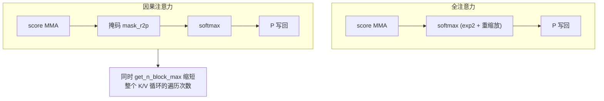

> **注意**:这正是 FA4「tile 原语 + barrier」骨架的一个好处——像因果掩码这种功能变体,可以**只往某一步原语内部**塞逻辑(这里是 softmax),其余阶段和同步结构一概不用动。数据流、barrier 图都保持原样,改动被牢牢圈在局部。
## GQA 支持(GQA Support)

### 为什么需要 GQA

「分组查询注意力(Grouped Query Attention,GQA)」让**多个查询头(query head)共用同一个 K/V 头**。动机很直接:自回归推理(decoding)阶段,真正吃显存带宽的是反复读 KV cache,而 KV cache 的大小跟 K/V 头的数量成正比。要是让每 4 个 Q 头共用 1 个 K/V 头,KV cache 直接缩到 1/4,带宽压力跟着大降。

可这种共用给 kernel 带来一个「打包(packing)」难题:既然我们对某个 K/V 头只想加载、只想留**一个** K/V tile,那怎么让**好几个**不同的 Q 头都从这同一个 tile 里取数算?Flash Attention 4 的答案是——**把共用同一个 K/V 头的那一整组 Q 头,一次性凑在一起处理**,针对调度器派下来的单个 `kv_head_idx` 把活儿算完。

### 核心思路:重新解释 Q tile 的 128 行

先定义两个关键比例:

```python
GQA_RATIO = num_qo_heads // num_kv_heads   # 每个 K/V 头被多少个 Q 头共享(分组大小)
SEQ_Q_PER_TILE = BLK_M // GQA_RATIO        # 一个 Q tile 内真正容纳的序列位置数
```

精髓就在于**给 Q tile 的 128 行(BLK_M=128)换一种读法**。标准的多头注意力里,这 128 行就是 128 个序列位置(sequence position)。可在 GQA 下,拿 `GQA_RATIO=4` 来说,它们就不再是 128 个序列位置了,而是 **32 个序列位置 × 4 个查询头**,交错打包(packed)进同一块 tile,这样这 4 个 Q 头就一起骑在同一个 K/V tile 上了。

每一行怎么解码回「序列位置 + 头编号」:

```python
seq_pos = row // GQA_RATIO   # 行号整除分组大小 → 落在哪个序列位置
q_head  = row % GQA_RATIO    # 行号取余分组大小 → 是组内第几个查询头
```

下面用 `GQA_RATIO=4` 直观看一下这 128 行是怎么排布的:

`GQA_RATIO=4` 时这 128 行的排布(每个 seq 位置占连续 4 行,放它的 4 个 Q 头):

| 行号 row | 0 | 1 | 2 | 3 | 4 | 5 | 6 | 7 | … | 124 | 125 | 126 | 127 |
| --- | --- | --- | --- | --- | --- | --- | --- | --- | --- | --- | --- | --- | --- |
| seq_pos | 0 | 0 | 0 | 0 | 1 | 1 | 1 | 1 | … | 31 | 31 | 31 | 31 |
| q_head | 0 | 1 | 2 | 3 | 0 | 1 | 2 | 3 | … | 0 | 1 | 2 | 3 |
| 分组 | \<-- seq 0 的 4 个 Q 头 --> | | | | \<-- seq 1 的 4 个 Q 头 --> | | | | … | \<-- seq 31 的 4 个 Q 头 --> | | | |

> **注意**:这种「序列位置在外、头在内」的交错排法,让 MMA 看到的依旧是一块连续的 `128 × HEAD_DIM` 操作数。计算单元根本不用知道 GQA 这回事。

### Q 加载:用 3D 视图无拷贝地完成打包

难点在于:内存里的 Q 是自然布局 `Q[batch, seq, qo_head, dim]`,可 MMA 后面要读的却是一块扁平的 `128 × HEAD_DIM` SMEM tile。怎么把前者「塞进」后者,又一点额外的数据搬运都不引入?

答案是给同一块 SMEM 套一个 **3D 视图(view)**——视图无非是换个角度解释同一段内存,不产生任何拷贝:

```python
# 把扁平的 Q SMEM tile 重新解释为 (流水线深度, 序列位置, 组内头, head_dim)
Q_smem_3d = Q_smem.view(SMEM_PIPE_DEPTH_Q, SEQ_Q_PER_TILE, GQA_RATIO, HEAD_DIM)

Tx.copy_async(
    Q_smem_3d[i_q, :, :, :],                       # 目标:当前流水线槽位的 3D 视图
    Q[batch_idx,
      m_start : m_start + SEQ_Q_PER_TILE,          # 序列维:只取 SEQ_Q_PER_TILE 个位置
      kv_head_idx * GQA_RATIO :                     # 头维:精确切出共享该 K/V 头的
      (kv_head_idx + 1) * GQA_RATIO,               #       那一组 GQA_RATIO 个 Q 头
      :],
    **tma_copy_q,                                   # 走 TMA 异步拷贝
)
```

几个关键点:
- 目标侧的 `(SEQ_Q_PER_TILE, GQA_RATIO)` 这两维,正好跟上面 `seq_pos / q_head` 的解码规则一一对上,把 32×4 的逻辑结构原样映射进 128 行。
- 源侧在头维度上用 `kv_head_idx * GQA_RATIO : (kv_head_idx+1) * GQA_RATIO`,精准切出「归这个 K/V 头管的那一组 Q 头」。
- 整件事靠 TMA(Tensor Memory Accelerator)的异步拷贝完成,**视图负责把两种布局对齐,拷贝本身一气呵成**。

### K/V 不扩展 + O 存储对称还原

GQA 真正省钱的地方在于:**K 和 V 在显存里压根不被复制扩展**。`kv_head_idx` 对应的那唯一一块 K/V tile,被打包进 Q 行里的全部 `GQA_RATIO` 个查询头一起复用。这正是 GQA 省带宽的本质——少读 K/V,而不是把 K/V 复制成好几份去将就 Q。

输出侧跟输入侧完全对称:epilogue 之后,同样用一个对应的 3D 视图,把打包在一起的各行结果**解包还原**,写回自然布局 `O[batch, seq, qo_head, dim]`。

### 设计上的优雅:GQA 只活在边界上

这整个方案最让人服气的一点,是关注点切得干干净净:

| 位置 | 是否感知 GQA | 看到的数据形状 |
| --- | --- | --- |
| Q 加载边界 | 是(3D 视图打包) | `Q[batch, seq, qo_head, dim]` ↔ `(SEQ_Q_PER_TILE, GQA_RATIO, HEAD_DIM)` |
| 内部计算路径(score MMA 等) | **否** | 普通的 `128 × HEAD_DIM` Q tile |
| O 存储边界 | 是(3D 视图解包) | `(SEQ_Q_PER_TILE, GQA_RATIO, HEAD_DIM)` ↔ `O[batch, seq, qo_head, dim]` |

也就是说,**GQA 全被摁在 Q 加载和 O 存储这两个边界上解决掉了**。一进计算路径,score MMA 看到的还是一块平平无奇的 `128 × HEAD_DIM` Q tile,后面整张 tile-primitive 计算图(softmax、PV MMA、流水线、mbarrier 同步等等)**一行都不用改**。

拿一张流程图把这种「夹心」结构概括一下:

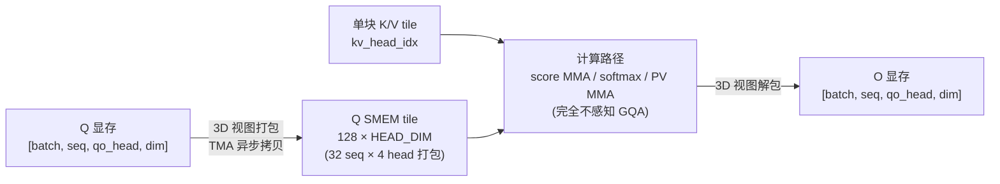

> **注意**:这种「边界上打包、核心里透明」的套路,很值得搬到别的场景去——凡是只想在数据进出时改排布、又希望计算核心保持通用的需求,都能靠零拷贝视图(view)把转换逻辑摁在加载/存储这两端。
## Tile 调度(Tile Scheduling)

调度器(scheduler)的核心职责就一件事:把每个 CTA 派到一个具体的注意力任务上。这个任务用三元组 `(batch, kv_head, m_block)` 描述——也就是「第几个 batch、第几个 KV 头、第几个 Q 块(Q block)」。换句话说,调度器只管「这个 CTA 负责算哪一块输出 tile」,至于这块怎么算,它**不操心**。

为什么要专门搞个调度器?因为在 GPU 上,所有 CTA 是一起启动、一起收尾的;一个 kernel 的总耗时,取决于**最后一个干完的 CTA**。要是任务分得不匀,有些 CTA 早早算完干等着、另一些还在埋头苦算,整体吞吐就被拖下来了。要不要费心调度,关键就看一件事:**这些 tile 任务的计算量是不是一样大**。而这一点,又是掩码(masking)模式说了算。

### 两种调度策略对应两种掩码模式

Flash Attention 4 对「非因果(non-causal)」和「因果(causal)」这两种模式,用了两套不同的调度器。

**非因果模式:`FlashAttentionLinearScheduler`(线性调度器)**

非因果注意力里,每个 Q 块都得对**全部** K/V 块算一遍注意力。也就是说,每个 tile 任务的活儿一样多、整整齐齐。负载这么均匀,就用不着什么花活儿:维护一个固定大小的 CTA 池,每个 CTA 干完手头的任务,就把任务索引**整体往前跳 `num_ctas` 个**(也就是 GPU 上 CTA 的总数),这样所有任务就被均匀铺给了所有 CTA。这是典型的「跨步划分(strided partition)」——简单、没分支、负载天然就平。

**因果模式:`FlashAttentionLPTScheduler`(最长处理时间优先调度器)**

因果掩码把「均匀」这个前提彻底打破了,各任务的活儿一下子变得极不平均:

- 序列开头附近的 Q 块,只能「看到」自己前面那一点 token,所以大概只要处理 **一个** K/V 块;
- 序列末尾附近的 Q 块,前面所有 token 都「看得到」,所以要处理 **全部** K/V 块。

因果掩码下各 Q 块的工作量(`#` = 需要计算的一个 K/V 块):

| Q block | 需要计算的 K/V 块 | 工作量 |
| --- | --- | --- |
| 0(开头) | `#` | 最小 |
| 1 | `##` | |
| 2 | `###` | |
| … | … | |
| N(末尾) | `############` | 最大 |

这时候要还像非因果那样「傻乎乎地」平均切任务,就会冒出严重的长尾:分到「重」块的 CTA 会比分到「轻」块的 CTA 晚收工老半天,GPU 利用率被尾巴上那几个任务拖垮。

所以因果模式改用 **LPT(Longest-Processing-Time,最长处理时间优先)** 调度。它的核心思想来自经典的多机调度算法:**先把最重的任务安排上**。把活儿大的 Q 块「前置(front-load)」分配,让重活先开工,这样各 CTA 的完成时间(finish time)就被拉平了,长尾也削掉了。

> **注意**:LPT 一边追求负载均衡,一边还会**尽量把相邻的 batch / head 任务凑在一起**调度,好保住 **L2 cache 局部性(locality)**。也就是说,它不是死板地按工作量贪心,而是在「均衡」和「数据复用」之间找平衡——既要让重活先跑,又不想老是切到八竿子打不着的数据上,白白糟蹋已经缓存好的 K/V。

### 两类策略对比

| 维度 | 非因果(Linear) | 因果(LPT) |
|------|------------------|-------------|
| 调度器 | `FlashAttentionLinearScheduler` | `FlashAttentionLPTScheduler` |
| 各 tile 工作量 | 完全相等(每个 Q 块都遍历全部 K/V) | 高度不均(开头轻、末尾重) |
| 划分方式 | 固定 CTA 池,步长为 `num_ctas` 跨步推进 | 最长任务优先、重块前置 |
| 优化目标 | 均匀铺满 | 拉平完成时间 + 兼顾 L2 局部性 |
| `next_tile()` 行为 | 跳到下一个任务,**继续循环** | 当前任务结束后,**退出循环** |

### 统一的循环接口

两个调度器内部策略差得远,可它们对外露出来的循环接口**一模一样**。所以 kernel 主体代码根本不用管自己用的是哪种调度器:

```python
while scheduler.valid():                  # 是否还有任务要处理
    m_block_idx = scheduler.m_block_idx   # 当前 Q 块索引
    batch_idx   = scheduler.batch_idx     # 当前 batch 索引
    kv_head_idx = scheduler.head_idx      # 当前 KV 头索引
    # 在此处理一个 Q 块,对其对应的 K/V 块区间做注意力
    scheduler.next_tile()                 # 推进到下一个 tile(或结束循环)
```

两者**唯一的行为差别**,全藏在 `next_tile()` 里:

- **非因果模式**:`next_tile()` 让当前 CTA 跳到**下一个**任务,循环接着转(一个 CTA 这辈子可能要处理好几个 tile);
- **因果模式**:`next_tile()` 干完当前任务后**直接把循环结束掉**(因为 LPT 早在 kernel 启动前就把每个 CTA 该干哪些活都排好了)。

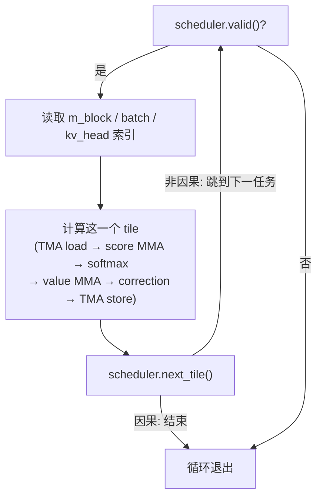

### 调度只决定「算哪一块」,不决定「怎么算」

这一点是整个调度设计的精髓:不管用哪种调度器,它干的都**纯粹是调度决策**——只挑「这个 CTA **摊上哪一块**注意力 tile」,至于这块 tile 内部怎么算,它**从不插手**。

循环体里跑的,始终是同一套本地原语(local primitives),跟调度策略半毛钱关系没有:

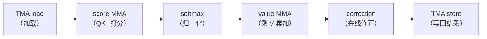

把「调度」和「计算」这么彻底地拆开,带来两个好处:一是 kernel 主体逻辑能保持单一、稳定,不用为不同掩码模式写两套计算路径;二是以后想加新的调度策略(比如针对别的稀疏掩码模式),只要再写一个实现相同循环接口的调度器就行,计算内核一点不用动。
## 编译并验证(Compile and Verify)

前面所有小节给的都是「片段」——一块一块拆开来讲原理。这一节反过来:把整章拆出来的零件重新拼成一个能跑的整体,真刀真枪编译它、扔到 GPU 上跑,再拿 PyTorch 的参考实现核对结果对不对。说白了,这是整章唯一一个「跑一下就能把全部内容验收掉」的单元格(cell)。

完整 kernel 的实现书里没有逐行铺开,而是收在 `tirx-kernels` 仓库的 `flash_attention4.py` 这一个文件里——本章讲过的每一块(TMA 加载、两阶段 MMA、在线 softmax、rescale 与回写、causal 掩码、GQA、tile 调度)都在那儿组装成了一份能直接 import 的源码。

### 与 GEMM 验证单元格的两点差异

要是你跑过上一章 GEMM 的验证单元格,会发现 Flash Attention 的入口几乎一个样,就两处不同:

| 维度 | GEMM 验证 | Flash Attention 4 验证 |
| --- | --- | --- |
| 入口函数 | 直接拿到 kernel | 更丰富的工厂函数 `get_flash_attention4_kernel`(需要传形状、GQA 头数、是否 causal 等) |
| 额外参数 | 无 | 多一个 `profiler_buf`,供 kernel 内置的 profiler 写计时数据 |

第一点,是因为 attention 的参数空间比 GEMM 大太多了(序列长度、query/KV 头数、head dim、要不要 causal),所以得有个工厂函数照着这些参数「现做」一份具体的 kernel。第二点,是因为这份 kernel 自带 profiler,跑的时候需要一块设备上的 buffer 来落计时点——所以调用时比 GEMM 多传一个张量。

### 跑通整章的那一个单元格

下面就是「一键验收全章」的代码。它干了四件事:备输入、编译、跑、核对。

```python
import torch
import torch.nn.functional as F
import tvm
from tirx_kernels.attention.flash_attention4 import (
    get_flash_attention4_kernel, PROFILER_BUFFER_SIZE)

# GQA 配置:32 个 query 头共享 8 个 KV 头
B, S, Hq, Hkv, D = 1, 1024, 32, 8, 128
Q = torch.randn(B, S, Hq,  D, dtype=torch.float16, device="cuda")
K = torch.randn(B, S, Hkv, D, dtype=torch.float16, device="cuda")
V = torch.randn(B, S, Hkv, D, dtype=torch.float16, device="cuda")
O = torch.empty(B, S, Hq,  D, dtype=torch.float16, device="cuda")
# profiler 的输出 buffer,必须额外分配并作为最后一个参数传入
prof = torch.zeros(PROFILER_BUFFER_SIZE, dtype=torch.uint64, device="cuda")

# 工厂函数按形状定制出一份具体 kernel(此处 non-causal)
kernel = get_flash_attention4_kernel(B, S, S, Hq, Hkv, D, is_causal=False)
target = tvm.target.Target("cuda")
with target:
    # 用 tirx 流水线把 TIR 模块编译成可执行模块
    ex = tvm.compile(tvm.IRModule({"main": kernel}), target=target, tir_pipeline="tirx")

# ex.mod 直接吃 torch 张量,和本书其它章节一致;注意最后多了 prof
ex.mod(Q, K, V, O, prof)
torch.cuda.synchronize()

# torch 参考实现;enable_gqa 让 32 个 query 头共享 8 个 KV 头
qt, kt, vt = (x.transpose(1, 2).float() for x in (Q, K, V))
ref = F.scaled_dot_product_attention(qt, kt, vt, enable_gqa=True).transpose(1, 2).half()
torch.testing.assert_close(O, ref, rtol=1e-2, atol=1e-2)
print(f"FA4: B={B} S={S} Hq={Hq} Hkv={Hkv} D={D}, non-causal -> PASS")
```

几个细节值得留意:

- **布局转换**:Q/K/V 在内核里用的是 `(B, S, H, D)`,而 PyTorch 的 `scaled_dot_product_attention` 要的是 `(B, H, S, D)`,所以参考实现先 `transpose(1, 2)` 把 head 维挪到前头,算完再换回来。
- **GQA 对齐**:`enable_gqa=True` 让 PyTorch 用上跟我们 kernel 一样的「32 个 query 头共享 8 个 KV 头」语义,不然两边算的压根不是一回事。
- **精度对齐**:参考实现先 `.float()` 升到 fp32 再算,最后 `.half()` 落回 fp16,这样才跟 kernel 的输出 dtype 对得上。

**期望输出**:最后一行打印 `... -> PASS`。

### 为什么用 rtol/atol 而不是逐位相等

你可能会问:都是算注意力,为啥不要求结果分毫不差,反倒给个 `rtol=1e-2, atol=1e-2` 这么「松」的容差?原因是:就算 kernel 把在线 softmax 的累加放在 fp32 里做,它跟「高精度参考实现」之间也还隔着好几层互相独立的近似来源。一项项拆开看:

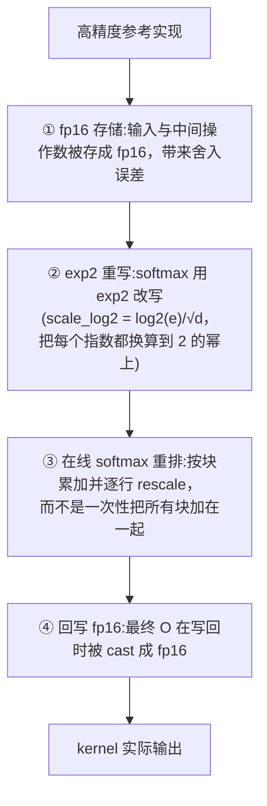

> **注意**:这里挑的 `rtol`/`atol` 跟源 kernel 自带测试用的容差是一样的。它是冲着「上面四种误差叠加之后相对参考实现的总偏差」来设的,**不是**只盯 fp16 舍入这一项。换句话说,它得把 ①~④ 全罩住,而不是只罩其中某一层。

### 如果真的 FAIL 了,去哪里找问题

正因为这个容差是「按总误差量身定的」,所以你要是看到的不是「擦边差一点」的临界值,而是一次**实打实的失败**,那它差不多就是个明确的路标:问题八成出在 softmax 通路上,而不是浮点精度本身。具体说,得回头查本章那些用 barrier 串起来的「交接(handoff)」:

| 可疑现象 | 对应被破坏的交接点 |
| --- | --- |
| 漏等 `s_ready` | scores 还没算好就进了 softmax |
| 漏等 `p_o_rescale` | rescale 与第二个 MMA 之间的同步丢失 |
| 漏等 `p_ready_2` | 概率矩阵 P 还没就绪就被第二阶段 MMA 消费 |
| `row_max` / `row_sum` 更新后,rescale 步骤没有应用 | 在线 softmax 的运行缩放(running scale)没跟上 |

这些恰好就是本章一路用 mbarrier 小心护着的那几个 handoff。一次真正的数值失败,说白了就是在告诉你:某对 producer/consumer 之间的等待被漏了,或者某次 `row_max`/`row_sum` 的更新没被 rescale 好好吸收掉。把验证失败当成「指向 softmax 路径的诊断信号」来读,往往比死盯着浮点数本身更快摸到根因。
## 与 GEMM 的区别(Differences from GEMM)

前面几节我们已经看明白,Flash Attention 4(下面简称 FA4)在内核结构上其实是「站在 GEMM 肩膀上」的:它复用的还是那同一套搬 tile、做 MMA、再写回的硬件原语。那问题来了——底层硬件能耐没变,FA4 写起来怎么就比一个高性能 GEMM 难这么多?

本节的核心观点很简单:**FA4 难,不是因为它换了硬件,而是因为它的 tile 数值更多,这些数值之间的「交接(handoff)」也更多。** 所有复杂度,最后都能追到本章开头点明的那个结构性变化上——多了第二个 MMA,而且 softmax 还被夹在两个 MMA 中间。

### 逐项对比:GEMM 与 FA4 在哪些轴上发生了变化

下面这张表把 FA4 相对 GEMM 变了的几个维度一条条列出来。看的时候建议带个视角:每一行的差异,归根到底都是「第二个 MMA + 中间那段 softmax」这一件事派生出来的。

| 对比维度 | GEMM | Flash Attention 4 |
| --- | --- | --- |
| MMA 阶段 | 同一个 MMA 反复执行 | 分成两段:打分 MMA(score MMA)和取值 MMA(value MMA) |
| MMA 之间的工作 | 除了流水线交接外没有别的事 | 在线 softmax(online softmax)、掩码(masking)、对 O 的重缩放(rescaling) |
| 运行时状态 | 只有累加器(accumulator) | 行最大值(row max)、行求和(row sum)、O 累加器 |
| 主要中间结果 | 累加器所在的 TMEM tile | S、P、O 三块 TMEM tile 区域 |
| warp 角色分工 | TMA 生产者、MMA 消费者、写回(writeback) | TMA load、MMA、softmax、correction(校正)、TMA store |
| 屏障(barrier) | 主要是 load / compute / writeback 之间的交接 | 额外多出 score / softmax / value / correction 等多组交接 |
| 调度单元(scheduling unit) | 一个输出矩阵 tile | 一个注意力任务:`(batch, kv_head, m_block)` |

### 为什么会有这些差异:从「两个 MMA」一路推下去

把上表每一行串起来看,你会发现它们不是一堆零散的设计选择,而是一条因果链:

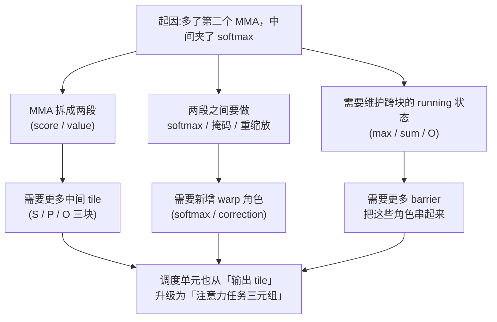

- **MMA 从一段变两段**:GEMM 全程就是把同一个 `C += A @ B` 重复跑很多遍;FA4 则是先算 `S = Q @ Kᵀ`(打分 MMA),再算 `O += P @ V`(取值 MMA)。两段 MMA 的输入输出都不一样,自然就得有两套节奏。

- **两段 MMA 之间不再是「空档」**:GEMM 里,两次 MMA 之间除了流水线交接啥也不干。FA4 偏要往这个夹缝里塞 online softmax(在线、分块地求 softmax)、给被掩盖的位置打掩码、行最大值更新后还要对已累加的 O 重缩放。这些可都是「真活儿」,不只是搬数据。

- **运行时状态变多**:GEMM 只要维护一个累加器。FA4 因为 softmax 要在分块流式处理里保持数值稳定,就得额外带上每行的 running max、running sum,再加 O 累加器——三份状态都得跨 KV 分块一路更新。

- **中间结果从一块变三块**:相应地,TMEM 里得给 S(打分结果)、P(softmax 之后的概率)、O(输出累加)各留一块 tile 区域,而不是 GEMM 那一块累加器 tile。

- **warp 角色更细**:GEMM 大致就「TMA 生产者 / MMA 消费者 / 写回」三类角色。FA4 把分工拆得更碎——TMA load、MMA、softmax、correction、TMA store,各管一摊,这样上面那些额外的计算环节才能流水线化地并行起来。

- **屏障更多**:角色多了,交接点跟着就多了。除了 GEMM 里常见的 load/compute/writeback 交接,FA4 还得多加 score、softmax、value、correction 等好几组 mbarrier,把「谁算完了、下一个角色才能消费」管得死死的。

- **调度单元升级**:GEMM 的调度单元就是一个输出矩阵 tile;FA4 的调度单元升成了一个完整的「注意力任务」,用三元组 `(batch, kv_head, m_block)` 来标识——也就是「哪个 batch、哪个 KV 头、哪个 M 方向的块」。

### 底层契约其实一点没变

有一点要专门强调:上面列了这么一大堆差异,可**FA4 靠的那套 TIRx 底层契约(contract),从头到尾一点没变。** 也就是说,描述这套内核的「四件套」语义,在 GEMM 和 FA4 里完全一样:

| 契约要素 | 它回答的问题 |
| --- | --- |
| tile 原语(tile primitive) | 「搬运 / 计算的是哪一块 tile」 |
| 作用域(scope) | 「哪些线程在协作完成它」 |
| 布局(layout) | 「这块 tile 存在哪里」 |
| 屏障(barrier) | 「下一个角色什么时候可以消费它」 |

> **注意**:看懂这一点对学 FA4 太重要了——你不用去啃一套全新的硬件抽象。FA4 用的还是同样的 tile 原语、同样的 scope/layout/barrier 语义。区别只在「数量」上:tile 数值更多、角色之间的交接更多。一句话,FA4 是 GEMM 在「广度」上的铺开,不是在「深度」上另起炉灶。

所以,你要是已经把 GEMM 内核那套契约吃透了,读 FA4 的正确姿势就是:把它拆成「同样的契约 + 更多 tile + 更多 handoff」,然后顺着上面那条因果链,把新增的角色和屏障一个个对号入座就行。
## 课后练习(Exercises)

这一小节拿几道问答,把全章最容易绕晕的几个点串起来:两段 MMA 之间多出来的那次 tile 交接、softmax 为什么要把 `P` 写回 TMEM、还有某个 barrier 到底"证明"了什么。下面每道题,我先把"问的是啥、该往哪个方向想"讲清楚,再给一份对着本章前文(尤其是「两段 MMA」和「barrier 如何连接各角色」这两节)推出来的参考答案。建议你先把答案盖上,自己推一遍,卡住了再翻回来看。

> **注意**:这些练习真正要练的不是"背答案",而是把每个 tile 原语都套进同一张读卡——**scope(谁在跑) / layout(tile 在哪) / dispatch(怎么发射) / handoff(用哪个 barrier 交棒)**。哪天你能拿这四问拆开任意一个原语,这章就算读通了。

### 第 1 题:FA4 相比 GEMM 多出来的 tile 交接

**问题**:相比 GEMM,FA4 在两段 MMA 之间多出来一个全新的 tile 交接。请说出它的**生产者(producer)、所交接的 TMEM tile、消费者(consumer)**。

**怎么想**:GEMM 只有"一段反复跑的 MMA",累加器 tile 就在 MMA 内部循环里转,中间没有别的角色插队。FA4 把一段 MMA 拆成了「score MMA」和「value MMA」两段,中间硬塞了 softmax。规律是:只要"角色变多",就一定"交接变多"——所以新交接肯定落在 score MMA 与 softmax、softmax 与 value MMA 这两条边上。题目问的是"两段 MMA 之间"那个 GEMM 压根没有的环节,落点就是 score MMA 把分数 tile 递给 softmax 这一步。

**参考答案**:

| 要素 | 内容 |
| --- | --- |
| 生产者 | score MMA(由 WG3 warp 0 发射) |
| TMEM tile | 分数 tile `S`(写入 `S_region[q_stage]`) |
| 消费者 | softmax(WG0 / WG1,整 warpgroup 读出) |
| 交接 barrier | `s_ready` |

整个交接说穿了就一句话:score MMA 算完,由一个被选中的 lane(`elect_sync`)在 `s_ready` 上 arrive,喊一声"这块 `S` 已经躺在 TMEM 里了",softmax warpgroup 这才能去读。GEMM 里没这一步,是因为 GEMM 的 MMA 算完直接进下一轮累加,中间没别的角色要看这块中间结果。

```python
Tx.warp.gemm_async(S_region[q_stage], Q_smem[...], K_smem[...],
                   dispatch="tcgen05", cta_group=CTA_GROUP)
if T.ptx.elect_sync():
    s_ready.arrive(q_stage)   # 唯一被选中的 lane 在这里交棒给 softmax
```

### 第 2 题:为什么 softmax 要把 `P` 写回 TMEM

**问题**:softmax 在寄存器里刚算完分子 tile `P`,为什么不直接把它留在寄存器里喂给 value MMA,反而要写回 TMEM?

**怎么想**:这题考的是"MMA 的操作数到底能读什么形状"。寄存器是**每个线程私有、按线程散开**的一堆标量;而 MMA 是 Tensor Core 指令,它要的是一个**矩阵形状的 tile 操作数**,只认 SMEM 或 TMEM 这种共享、规整、能被硬件按矩阵布局寻址的地方。一堆散落在各线程私有寄存器里的 fp32 标量,Tensor Core 根本没法当矩阵来读。

**参考答案**:因为 value MMA 要把 `P` 当**矩阵操作数(tile operand)**来吃,而 MMA 读不了散在各线程的标量寄存器。本 kernel 里 `P` 唯一能被 MMA 消费的形态,就是 `P_region`——它是 fp16 TMEM 别名 `tmem_as_f16` 上的一个视图。所以这趟写回**不是多此一举的搬运**,而是把 `P` 摆成"下一段 MMA 唯一真能读进去的形状"。顺便说一句,写回时还顺手做了 fp32→fp16 的 `cast`,既省了 TMEM 占用,又对上了 Tensor Core 处理低精度操作数的吞吐。

可以这样对照记忆:

| 阶段 | `P` 的存放形态 | 谁能用它 |
| --- | --- | --- |
| softmax 算完瞬间 | 各线程私有寄存器(分散标量) | 只有本线程的标量运算 |
| 写回之后 | `P_region`(fp16 TMEM 视图) | value MMA 当矩阵操作数读取 |

### 第 3 题:`p_o_rescale` 或 `p_ready_2` 到底证明了什么

**问题**:从 `p_o_rescale` 和 `p_ready_2` 里挑一个,说清楚这个 barrier 究竟"证明"了什么;如果 value MMA 跳过对它的等待,会出什么问题?

**怎么想**:value MMA 干的是把 `P × V` 累加进 `O`。它要能安全开跑,前提有两类:一是**操作数真到位了**(`P` 这部分列已经写进 TMEM),二是**累加目标安全**(`O` 这个槽位要么已经被 WG2 rescale 成新 max 下的正确状态,要么因为压根不需要 rescale 而被放行)。这两个 barrier 分别守的,就是 `P` 的两段(`96 + 32` 切分)和 `O` 的安全性。

**参考答案(以 `p_o_rescale` 为例)**:

- **它同时证明两件事成立**:(1)`P` 的**前 96 列**已经写进 TMEM;(2)`O` 槽位对 value MMA 的累加是**安全的**——WG2 要么已经把旧 `O` 按新 row max rescale 完了,要么判定本轮 max 跳得不够大、`acc_scale` 保持 1.0、于是跳过了 rescale。第一个 K/V block 是特例:没有旧 `O` 要 rescale,WG2 干脆直接预先 arrive `p_o_rescale`。
- **要是跳过这个等待会怎样**:value MMA 可能在 `P` 前 96 列还没写完时就去读 TMEM,读到陈旧/半成品数据;更阴的是 `O` 还没被 rescale 就被加了进去——旧 `O` 是按旧 max 缩放的,新一块直接加上去,数值基准对不齐,结果就是个**悄无声息的错误结果(wrong-result bug)**,通常还不报错、不崩溃,排查起来要命。

> **注意**:本章特意警告过一个经典坑——`softmax_corr.empty` 只说明"WG2 已经把那个 scale/sum 邮箱槽位消费掉了",它**不代表** `P` 就绪,**更不是**放行 value MMA 的门。真正放行 value MMA 的是 `p_o_rescale`。把这俩搞混,正是 wrong-result bug 的常见来源。

**要是你选 `p_ready_2`**:它证明的是 `P` 的**最后 32 列(最后四分之一)**已写进 TMEM,对应 value MMA 那个 `96 + 32` 切分调度——第二个 sub-MMA 专吃这最后一段。跳过等它,第二段 MMA 就会在最后 32 列还没写好时去读,照样读到垃圾数据、结果出错。这个切分的意义就是别让 Tensor Core 空转:前三块 chunk 一就绪就先发 96 宽的 MMA,把最后一块的 `exp` 和 TMEM 写入跟正在飞的 MMA 叠到一起。

### 和你的 agent 一起练(Try with your agent)

挑一个**前文没给读卡的 tile 原语**,让 agent 替它补一张 **scope / layout / dispatch / handoff** 卡,然后回到源码里,用 guard、allocation、wait 这三处线索去核对它说得对不对。可以拿来练的对象有:

- **epilogue 里的 `Tx.copy_async`**:把最终 `O` 从 TMEM/寄存器搬到 `O_smem`,核对它是谁(WG2)发起的、交给哪个 barrier(`corr_epi.full` → TMA store)。
- **fp32 → fp16 的 `Tx.cast`**:就是第 2 题里把 `P` 降精度写回 TMEM 的那一步,核对它的精度转换是发生在 register 里、还是写入 TMEM 时。
- **第二个 `gemm_pv` sub-MMA**:吃 `P` 最后 32 列的那段 value MMA,核对它的 handoff 等的是不是 `p_ready_2`、`accum` 是不是 `True`。

核对的方法永远是同一套:**guard**(`if T.ptx.elect_sync()` / 角色分支 `wg_id == ...` 告诉你 scope)、**allocation**(`S_region` / `P_region` / `O_region` 视图告诉你 layout)、**wait/arrive**(`barrier.wait` / `barrier.arrive` 告诉你 handoff)。把 agent 的回答一项一项对回源码,别直接信它。
## 小结

本章顺着「跟一个 tile 走完整条数据通路」这条主线,把 Flash Attention 4 怎么落到 GPU 上讲透了。核心脉络拢成几条:

- **算法层面**:Attention 的难点不在矩阵乘本身,而在两段 MMA 中间夹的那段 softmax。在线 softmax 靠「分块流式累加 + 维护 `row_max`/`row_sum`/`O`」躲开了物化整个 `S`,代价就是行最大值一变大就得对旧 `O` 重缩放——这是贯穿全章的 twist。工程上又拿 `exp2`(配合 `scale_log2 = log2(e)/√d`)顶替 `exp`,还把归一化拖到最后统一做。
- **落地层面**:TIRx 按「干什么活」而不是「碰哪块数据」给 4 个 warpgroup 分角色,把 `S`/`P`/`O` 挤进同一块 TMEM、靠 fp16 别名复用,再用一组 mbarrier 把跨 warpgroup 的 handoff 接起来。所有新增的 barrier(`s_ready`、`p_o_rescale`、`p_ready_2`、`softmax_corr` 等)都围着 softmax 转,因为正是 softmax 把本来挨着的两段 MMA 给拆开了。
- **流水线层面**:Q(深度 2)、KV(深度 3)、TMEM slot(深度 2)各跑各的节奏,没有「单一流水线深度」这一说;MMA warp 必须把 score 和 value **交错**着发,才能让 score / softmax / correction / value 这四类活在时间上叠起来。
- **功能扩展**:因果掩码、GQA、tile 调度都被特意摁在「边界」上,核心那张 tile-primitive 计算图原封不动——这正是「tile 原语 + barrier」骨架的厉害之处。
- **关键收获**:读懂 FA4 的正确姿势,是把它当成「跟 GEMM 同一套契约 + 更多 tile + 更多 handoff」,对每个原语反复套那四问 **scope / layout / dispatch / handoff**,同时盯紧 `softmax_corr.empty` 和 `p_o_rescale` 混淆这类 wrong-result bug。

## 延伸阅读

- 原文:[Flash Attention 4 — Modern GPU Programming for ML Systems](https://mlc.ai/modern-gpu-programming-for-mlsys/chapter_flash_attention/index.html)
- 前置章节(第三部分 GEMM):本章一路拿 GEMM 当参照系——GEMM 的 tile-primitive 图、scope/layout/dispatch 读卡,还有 TMA / `tcgen05` MMA / TMEM / mbarrier 这些原语,都是读懂 FA4 的必备底子。
- 硬件背景:Blackwell 架构的 TMEM(Tensor Memory)和第 5 代 Tensor Core(`tcgen05`)指令族,是本章讨论 TMEM 别名复用、MMA 操作数位置的硬件前提。
- 参考实现:`tirx-kernels` 仓库的 `flash_attention4.py` 把本章讲过的全部组件(TMA 加载、两段 MMA、在线 softmax、rescale 与回写、causal 掩码、GQA、tile 调度)都收在一起,可以直接 import、编译,再拿 PyTorch 的 `scaled_dot_product_attention(enable_gqa=True)` 对拍验证。
- 进一步阅读:想把 kernel 扩到训练场景,得补写 log-sum-exp(LSE),还要记得按 `LSE_i = log(row_sum_i) + row_max_i/√d` 把 `1/√d` 缩放因子补回 `row_max`。

## 术语对照

| 英文 | 中文 | 简要说明 |
| --- | --- | --- |
| Flash Attention 4 (FA4) | Flash Attention 4 | 用在线 softmax 实现、避免物化完整分数矩阵的高性能注意力 kernel |
| Online softmax | 在线 softmax | 按 K/V 块流式累加、逐行维护运行态、最后统一归一化的 softmax 算法 |
| Score MMA | 打分 / 分数 MMA | 第一段矩阵乘 `S = Q·Kᵀ`,两个操作数都来自 SMEM |
| Value MMA | 取值 MMA | 第二段矩阵乘 `O += P·V`,`P` 来自 TMEM、`V` 来自 SMEM |
| Rescale / Correction | 重缩放 / 校正 | `row_max` 变大后对旧 `O` 做的 TMEM→寄存器→TMEM 读-改-写,统一尺度 |
| row_max / row_sum | 行最大值 / 行和 | 在线 softmax 逐行维护的两个运行态(`row_max` 存未缩放分数的最大值) |
| `scale_log2` | log2 缩放系数 | `log2(e)/√d`,使 `P = exp2((S - m)·scale_log2)`,贴合硬件 `exp2` 指令 |
| `acc_scale` | 累加器缩放因子 | softmax 算出、经 SMEM 信箱传给 WG2 的逐行 rescale 因子 |
| `rescale_threshold` | 重缩放阈值 | 行最大值变化小于此阈值(本版 `8.0`)则跳过 rescale,`acc_scale` 置 1.0 |
| TMEM (Tensor Memory) | 张量内存 | Blackwell 为 `tcgen05` MMA 引入的片上内存,每 CTA 仅 `128×512` fp32 |
| `tcgen05` | 第 5 代 Tensor Core 指令 | 驱动 MMA、TMEM 读(`tcgen05.ld`)/写、commit 的指令族 |
| TMA (Tensor Memory Accelerator) | 张量内存加速器 | 在 GMEM↔SMEM 之间异步搬运 tile 的硬件引擎,按字节计数判完成 |
| Warpgroup (WG) | warp 组 | 128 线程为一组;本 kernel 每 CTA 有 4 个(WG0~WG3),按角色分工 |
| Q stage | Q 流水线阶段 / 槽位 | Q 流水线的 0/1 两个并发槽(非两个 attention head),WG0/WG1 各管一个 |
| mbarrier | 内存屏障 | 跨线程/角色的同步原语,FA4 用它把各 handoff 接线起来 |
| `s_ready` | score 就绪屏障 | score MMA → softmax:`S` 已在 TMEM 可读 |
| `p_o_rescale` | P/O 就绪屏障 | softmax+WG2 → value MMA:`P` 前 96 列就绪且 `O` 槽位可安全累加 |
| `p_ready_2` | P 尾段就绪屏障 | softmax → value MMA:`P` 最后 32 列就绪(对应 96+32 切分) |
| `softmax_corr` (full/empty) | softmax-校正信箱屏障 | 保护单格 SMEM 信箱,在 softmax 与 WG2 间传 `acc_scale`/`row_sum` |
| Causal masking | 因果掩码 | query 只能关注自身及更早的 key;整块跳过 + 跨对角线逐行掩码 |
| `get_n_block_max` | 最大 K/V 块上界 | 按 Q 块位置算出需遍历的最后一个 K/V 块,跳过对角线上方整块 |
| `mask_r2p` | 列上限转位掩码 | 把逐行列上限转成 32 宽位掩码,一次性屏蔽越界列(避免发散分支) |
| GQA (Grouped Query Attention) | 分组查询注意力 | 多个 Q 头共享一个 K/V 头,缩小 KV cache、降带宽 |
| `GQA_RATIO` | 分组比例 | 每个 K/V 头被多少个 Q 头共享(如 4) |
| LPT Scheduler | 最长处理时间优先调度器 | 因果模式用:重块前置以拉平各 CTA 完成时间,兼顾 L2 局部性 |
| Linear Scheduler | 线性调度器 | 非因果模式用:固定 CTA 池按 `num_ctas` 跨步均匀分配任务 |
| Epilogue | 收尾阶段 | K/V 循环结束后归一化(乘 `1/row_sum`)、cast fp16、写 SMEM、TMA store |
| LSE (log-sum-exp) | 对数和指数 | 训练反向所需的统计量;本 kernel 仅前向输出、不写 LSE |
| Tile-primitive graph | tile-原语图 | 「生产者—消费者」依赖图:节点是某层存储里的 tile,边是搬运/计算 |
