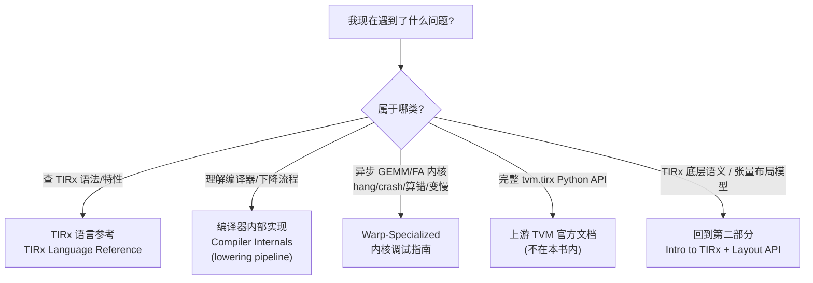

# 第 15 章 · 参考资料(附录)

> 原文:[Reference](https://mlc.ai/modern-gpu-programming-for-mlsys/appendix/index.html)

> **本章要点(TL;DR)**
> - 这一章是「第五部分 · 参考与附录」的**导读页**。它不教新东西,只告诉你一件事:遇到具体问题时,该去翻哪一页。
> - 全书真正的主线是第一到第四部分(Parts I–IV)。附录不是用来通读的,而是你**边读边查**的工具箱。
> - 附录主要有三块内容:**TIRx 语言参考**、**编译器内部实现(讲下降流水线)**、**Warp-Specialized 内核调试指南**。
> - 完整的 `tvm.tirx` Python API 不在这本书里,而是放在**上游 TVM 官方文档**中。
> - 至于 TIRx 的底层语义和张量布局模型(Layout API),其实**第二部分**已经讲过了,这里只是给你一个指路牌。

> **前置知识**:读这一章前,最好先大致认识 GPU 内核(在 GPU 上跑的小程序)、GEMM(矩阵乘法)、warp specialization(让不同线程组各干各的活)这几个概念。没把握的话,先翻一下 [第 0 章 · 极简入门](./ch00_gpu_ml_primer.md)。本章是一张导航页、术语多为预告,这里点到的名词在正文各章会细讲,看不懂可先跳过。

---

## 15.1 这一部分是什么

先把整本书的脉络捋一遍。《Modern GPU Programming for MLSys》真正讲东西的,是 **Parts I–IV** 这四个部分。它的讲法大概是这样:先带你认识 GPU 硬件长什么样;再引出 TIRx,这是一门张量级的中间语言;接着讲编译器是怎么把你写的高层算子,一步一步"降"成高效 GPU 代码的;最后教你怎么写出 warp-specialized 的高性能内核。这条线才是主菜。

那这一章所在的「参考与附录」呢?定位完全不一样。原文说得很白:这里放的,是"你读着读着随手要查的东西"。说白了,它不是让你从头啃到尾的,而是搁在手边的一本工具书。你读正文卡住了,或者真动手写内核、调内核的时候撞上某个具体问题,翻到对应那一页查一下就行。

> **关键**:附录是用来"哪里不会查哪里"的,不是用来通读的。第一次学的话,先把 Parts I–IV 顺顺当当读一遍,附录就当成踩坑时翻一翻的入口,够用了。

---

## 15.2 三类需求 → 三个去处

附录是按"你想干嘛"来分的——你有什么需求,就告诉你该往哪儿翻。下面这张表把需求和去处一一对上:

| 你的需求 | 该翻哪一页 |
| --- | --- |
| 想查某个 **TIRx 语言特性**(语法、内建、语义) | **TIRx 语言参考(TIRx Language Reference)** |
| 想搞懂**编译器内部实现**,尤其是**下降流水线(lowering pipeline)** | **编译器内部实现(Compiler Internals)** |
| 要调试**异步 GEMM(矩阵乘法,深度学习里最核心的算子) / FlashAttention(高效计算注意力的内核,简称 FA)内核**的 hang(挂死)、crash(崩溃)、结果错误或性能变慢 | **Warp-Specialized 内核调试(Debugging Warp-Specialized Kernels)** |

说白了,这三块对着三种最常见的场景:

- **查语言**:写 TIRx 的时候,忘了某个语法、某个算子怎么用 → 翻语言参考。
- **看原理**:想弄明白"我写的高层算子,最后到底怎么变成 GPU 指令的" → 翻编译器内部实现,重点看 lowering pipeline。
- **修 bug**:异步内核出毛病了 → 翻调试指南。这里说的异步内核,是指那些用到 TMA(异步搬数据的硬件单元,见第 0 章)、warp specialization(让不同 warp 各司其职:有的专搬数据、有的专算)、`tcgen05` MMA(矩阵乘加,Tensor Core 的核心指令)和 TMEM(Tensor Memory,Blackwell 上专给 Tensor Core 用的一块片上内存)的 GEMM / FA 内核。为什么单拎出来给它一节?因为这种异步、流水线化的内核,是最难调的一类。

> **澄清一个容易混的点**:这本书的 warp-specialized 调试指南,讲的是**跑在 Blackwell(`sm_100a`,NVIDIA 较新的一代 GPU 架构)上的内核**。它的矩阵乘用的是 Blackwell 那套 `tcgen05` MMA 指令,再配上 TMEM(Tensor Memory)。注意,这**不是** Hopper(上一代架构)那一代的 warpgroup MMA(`wgmma`,以 4 个 warp 为一组协同做矩阵乘的指令)。两者是不同代架构上的不同指令,千万别搞混。

下面用一张 Mermaid 图,把这个"对症下药"的过程画出来:

> **注意**:图里的 R1/R2/R3,是附录自己的三个子页面。R4(完整 Python API)和 R5(底层语义与布局)就**不在附录里**了,作者只是顺手给你指个路,告诉你"这俩该上哪儿找"。

---

## 15.3 两个"不在这里,但你可能要找"的指针

有两样东西,你读着读着八成会去找,可它们偏偏不在这儿。附录特意提了一句,免得你白翻半天。

### 1. 完整的 `tvm.tirx` Python API

书里讲 TIRx,只讲关键概念和怎么用。**那种完整、一条一条列全的 `tvm.tirx` Python API 文档,书里没有**,它放在**上游 TVM(upstream TVM)的官方文档**里。

> **关键**:你要是想查"某个函数的精确签名、全部参数、所有可选项"这种字典式的细节,该去翻 TVM 官方 API 文档,别在这本书里找。说白了就是分工:书负责把思想讲透,API 文档负责把细节列全。

### 2. TIRx 原生层 / native level 与张量布局模型 / Layout API

这两块,**第二部分(Part II)早就讲过了**。附录在这儿只是给你指条路,告诉你"回去看哪儿",省得你在附录里瞎翻:

| 内容 | 在哪讲过 |
| --- | --- |
| TIRx 的原生/底层语义 | 第二部分 · TIRx 入门(Introduction to TIRx) |
| 张量布局模型(tensor layout model) | 第二部分 · TIRx 布局 API(TIRx Layout API) |

---

## 15.4 建议的使用方式(阅读顺序)

这是张导航页,它自己没什么"先读这段、再读那段"的讲究。真正值得说道的,是**怎么把附录揉进你整个学习过程里**。给你一套实在的用法:

1. **第一遍学**:顺着主线把 Parts I–IV 读完。这阶段附录就当"卡住了再去查"的入口,不用提前看。
2. **写代码的时候**:TIRx 的某个语法或特性吃不准 → 先翻 **TIRx 语言参考**;想要精确的 API → 直接奔 **TVM 官方文档**。
3. **想往深里钻原理**:等正文读明白了,再去看 **编译器内部实现**,顺着 lowering pipeline 把"高层算子 → GPU 代码"这一路走一遍。
4. **真上手调内核**:开始写或调异步 GEMM、FlashAttention 这类 warp-specialized 内核,遇到挂死、算错的时候 → 重点啃 **Warp-Specialized 内核调试指南**。
5. **底层语义或布局忘了**:回 **第二部分** 复习 Intro to TIRx 和 Layout API。

---

## 小结

这一章是「参考与附录」的导航页,记住三点就够了:

- 全书的主线在 **Parts I–IV**。附录是**手边随查的工具箱**,哪里不会查哪里,别从头通读。
- 附录按"需求"分成三个子页面:**TIRx 语言参考**(查语法特性)、**编译器内部实现**(看 lowering pipeline)、**Warp-Specialized 内核调试**(修异步 GEMM / FA 内核的 hang、crash、算错、变慢)。
- 两样最容易"找不着"的:完整 `tvm.tirx` Python API 在**上游 TVM 文档**里;TIRx 底层语义和张量布局模型在**第二部分**。

把这张"对症下药"的导航表记牢,真动起手来,你就能很快翻到对的那一页。

## 延伸阅读

- 原文页面:[Reference — Modern GPU Programming for MLSys](https://mlc.ai/modern-gpu-programming-for-mlsys/appendix/index.html)
- 完整 `tvm.tirx` Python API:见上游 TVM 官方文档(Apache TVM 项目文档)。
- 相关前置章节:第二部分「TIRx 入门(Introduction to TIRx)」与「TIRx 布局 API(TIRx Layout API)」。

## 术语对照

| 中文 | English |
| --- | --- |
| 下降流水线 | lowering pipeline |
| 编译器内部实现 | Compiler Internals |
| TIRx 语言参考 | TIRx Language Reference |
| Warp-Specialized 内核调试 | Debugging Warp-Specialized Kernels |
| 张量布局模型 | tensor layout model |
| TIRx 布局 API | TIRx Layout API |
| TIRx 原生层 | TIRx native level |
| 上游 TVM | upstream TVM |
| 挂死 | hang |
| 崩溃 | crash |
