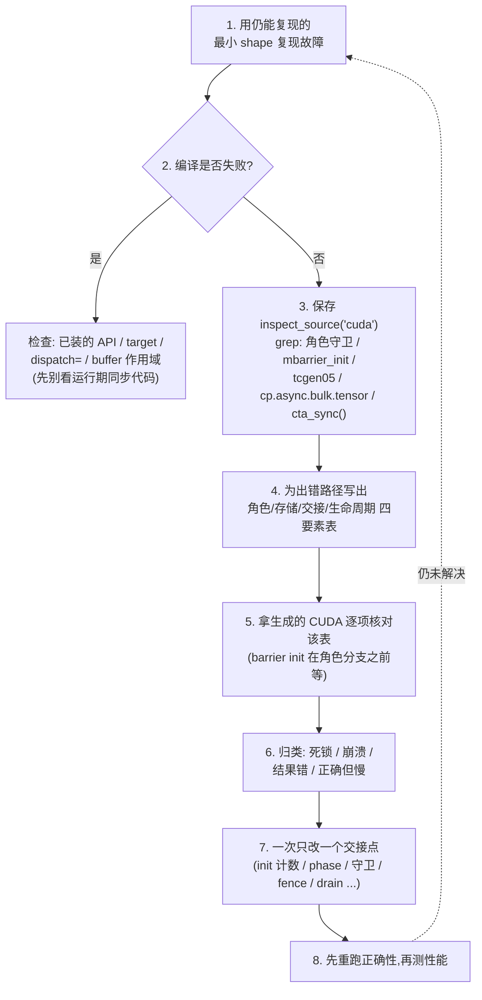
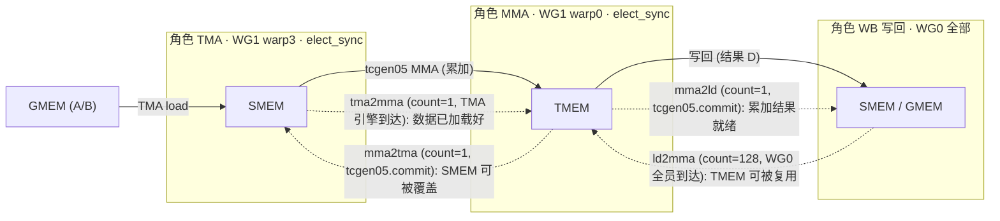

# 第 16 章 · 调试 Warp 专门化 Kernel

> 原文:[Debugging Warp-Specialized Kernels](https://mlc.ai/modern-gpu-programming-for-mlsys/appendix/debugging_warp_specialized.html)

> **本章要点(TL;DR)**
>
> - **先别急着重写 kernel。** Warp 专门化 / warp specialization kernel 出运行期故障,十有八九不是算法写错了,而是某一次「**交接 / handoff**」掉了链子。具体怎么坏的?无非这么几种:barrier 没初始化、到达计数对不上、集体操作被角色守卫挡掉了一半、barrier phase 过期了,或者存储还没用完就被人抢去复用了。
> - **动手之前,先填一张「角色 → 存储 → 交接 → 生命周期」四要素表。** 把这四样东西白纸黑字写下来,再拿生成的 CUDA 一项一项去对。千万别凭感觉乱改同步代码——那样越改越乱。
> - **真正算数的是生成的 CUDA,它才是「事实来源 / source of truth」。** 你在 Python 里写的那些高层守卫(`wg_id == 0`、`elect_sync()`),编译一过就变成了一堆 `threadIdx` 算术。所以先用 `inspect_source("cuda")` 把生成代码存下来,grep 一下关键字,再回头去读 Python。
> - **CUDA 一旦出错,会把整个 context「毒化 / poison」掉。** 撞上非法内存访问怎么办?别犹豫,直接**重启 Python 进程**。不然你接着调的根本不是当前代码,而是上一次崩溃留下的残局。
> - **症状只是线索,不是结论。** 先把现象按「死锁 / 崩溃 / 结果错 / 正确但慢」分个类,再对着对应的检查清单一条一条排。还有一句话要刻在脑子里:**一次只改一个交接点**。

> **前置知识**:读这一章前,最好先懂 warp 专门化(把不同 warp 派去干不同的活)、mbarrier / phase(异步屏障和它的相位计数)、以及生成的 CUDA 大概长啥样。没把握的话,先翻一下 [第 0 章 · 极简入门](./ch00_gpu_ml_primer.md),以及第 13 章「用 Warp 专门化和 Cluster 扩展 GEMM」。本章会默认你已经认识这些词。

这一章是《Modern GPU Programming for MLSys》参考与附录里的一篇「工程实战手册」。它不教新算法,只干一件事:把前面那些复杂的异步流水线 kernel,提炼成一套**能反复用、能直接上手的调试套路**(配套代码就是「用 Warp 专门化和 Cluster 扩展 GEMM」那一章里 GEMM(通用矩阵乘法,深度学习里最核心的算子)的步骤 7–9)。

这些 kernel 有个共同点:TMA 加载(TMA = 硬件的批量异步搬运引擎,专门在 GMEM 和 SMEM 之间整块搬数据)、`tcgen05` 的 MMA(矩阵乘加,即 Tensor Core 上的矩阵乘法指令)、还有 TMEM(Tensor Core 专用的累加器内存)/SMEM(共享内存,一个 block 内线程共用的高速片上内存)写回 / writeback,这三件事是**叠在一起 / overlap** 跑的,谁也不等谁。好处是快,坏处是——一旦出 bug,因为并发度太高,排查起来格外恼火。不过有个好消息:这套方法不光对 GEMM 好使,Flash Attention(注意力 / attention 的高效实现)里那几段交接,照样能套上去。

---

## 16.1 心法:把异步 kernel 看成一组「交接」

传统 GPU kernel 你是怎么调的?基本上就是从头到尾把代码读一遍,逮逻辑 bug。可 warp 专门化 kernel 不能这么干。

它的玩法是这样:把不同的 warp(线程束,32 个线程的最小调度单位,见第 0 章)/ warpgroup(线程束组,4 个 warp = 128 个线程)派去干不同的活,也就是分**角色 / role**——一组专门发 TMA 加载,一组专门发 MMA,一组专门做写回。你就把它们想成流水线上的几个工位,各管一摊。工位和工位之间靠什么协调?靠**异步屏障 / mbarrier**,相当于互相喊话:「我这道工序干完啦,该你接手了。」

> **关键**:在这种结构里,代码本身经常「怎么看都没毛病」,真正爱出事的地方是**角色之间的交接**。哪怕某个 barrier 的到达计数只写错了一个数,整条流水线都能给你永久卡死。

所以这一章开篇就先立一条规矩:

> **注意**:**别一上来就重写 kernel。** 顺序应该是这样:(1)先把运行环境查清楚,(2)再去看生成的 CUDA,(3)最后才回头动 Python。环境和编译这两关一过,剩下的运行期故障基本就跑不出下面这几种「坏掉的交接」了:
> - barrier 压根没初始化
> - 到达计数写错了
> - 集体操作 / collective 被角色守卫挡掉了一部分
> - barrier phase 过期了
> - 生产者 / producer 刚写的数据,消费者 / consumer 还没看见呢,存储就被拿去复用了

这条心法记牢了——后面那一堆检查清单,说白了都只是它的展开版。

---

## 16.2 调试前:先排除运行环境

很多事看着像「kernel 的 bug」,其实根本不在 kernel 里——是环境出了岔子。所以这一章的要求很明确:**第一步先把环境查干净**。两条命令就够了:

```bash
# 确认 TVM 是哪个安装、哪个版本(防止导入了过期的 checkout)
python -c "import tvm, tvm.tirx; print(tvm.__file__, tvm.__version__)"

# 确认 GPU 型号和计算能力(这些 kernel 需要 Blackwell)
python -c "import torch; print(torch.cuda.get_device_name(), torch.cuda.get_device_capability())"
```

为什么偏偏查这两样?

- **这些 kernel 只认 Blackwell(`sm_100a`)。**(Blackwell 是 NVIDIA 的一代 GPU 架构,比上一代 Hopper、再上一代 Ampere 更新) `tcgen05` 那条路径,非得 Blackwell 这一档的硬件才撑得住。GPU 要不是 Blackwell,代码你怎么改都白搭。
- **Python 很可能偷偷导入了一个过期的 TVM。** 万一 `tvm.__file__` 指过去的是个旧目录,你还以为早更新过了——那你跑的压根不是刚改的代码。这个坑最阴,经常一搭进去就是好几个钟头打水漂。

> **关键**:环境确认没问题之后,先跑一遍 kernel 的**最小正确性检查**(比如 `run_correctness()`),**之后再去管性能**。先看「对不对」,再操心「快不快」,顺序别反了。

---

## 16.3 标准调试流程(Workflow)

原文给了一条 8 步的工作流,我把它画成了下面这张流程图。它的精神用一句话就能说清:**一步步收窄范围、拿生成代码对照、一次只动一个地方**。



这几步里,有几个细节得拎出来反复念叨:

- **第 1 步**:要是故障是**非法内存访问 / illegal memory access**,下次跑之前务必先**重启 Python**(为啥?16.7 节专门讲)。
- **第 2 步**:编译挂了,先去看 API / target / dispatch / 作用域,**别急着去抠运行期的同步代码**。编译问题和同步问题压根是两码事。
- **第 3 步**:生成的 CUDA 存盘之后,**先 grep 关键字符串,再去读 Python**。这是本章翻来覆去强调的招:把生成代码当成你的「地图」来用。
- **第 7 步**:**一次只改一个交接点**(init 计数、arrive/wait 的 phase、角色守卫、fence、TMA store 的 drain、TMEM 的 alloc/dealloc、tile scheduler 的推进,挑一个改)。你要是一口气改好几处,真出了问题,根本分不清到底是哪一处起的作用。

---

## 16.4 「四要素表」:可迁移的调试工作表

这是整套方法的心脏,也是最该背下来的一段。不管你面前是**哪个**异步 kernel,动手改代码之前,先老老实实把下面这张表填出来:

| 要素 | 要写下来的内容 |
| --- | --- |
| **角色 / Roles** | 每一个异步操作,到底是谁发出来的——哪些线程 / warp / warpgroup / CTA(线程块,一个 block 的线程集合,见第 0 章)。 |
| **存储 / Storage** | 每个 tile(大矩阵切出来的小方块)走到每一步时「住」在哪儿:GMEM(全局内存,显存,容量大但慢)、SMEM、TMEM,还是寄存器(register,每个线程私有的最快存储)。 |
| **交接 / Handoff** | 谁生产、谁消费、用的哪个信号对象、到达计数多少、phase 多少,还有那个让数据真正可见的 fence 或 drain。 |
| **生命周期 / Lifetime** | 每个存储槽位,最早什么时候能拿去复用、能读回、能释放。 |

表填完了,接下来**拿生成的 CUDA 去逐项验**这五件事:

1. **角色守卫**跟你表里的角色对得上。
2. **barrier 初始化**是在被守卫的角色分支**外面**(在它前面),不是塞在分支里头。
3. **集体操作 / collective 没被 lane(通道,即线程在 warp 内的编号 0~31)/ warp / warpgroup 守卫不小心收窄**。这一类 bug 最隐蔽,后果也最狠。
4. **arrive / wait 的 phase** 跟你的交接表对得上。
5. **TMA store 的 drain、TMEM 的 dealloc、SMEM 的复用**,统统等到生命周期表点头说「现在可以了」之后才发生。

> **关键**:同一张表,套在 GEMM 的 `TMA → MMA → 写回` 流水线上行,套在 Flash Attention 的 `score → softmax → value → correction` 那几段交接上也行(score = 分数矩阵,Q·K 的结果;softmax = 把分数归一化成概率的那步)。这就是「可迁移」的意思——方法本身一个字不用变,你只要把表里的内容换成对应 kernel 的角色和存储就完事了。

下面这张图,把 GEMM 流水线的三个角色、以及它们之间的交接都画了出来。看一眼,你就能摸到「四要素」在真实 kernel 里到底长啥样:



> **注意**:重点盯紧那几个到达计数。`tma2mma`/`mma2tma`/`mma2ld` 都是 **1**(一个引擎或一条 commit 触发一下就够了),而 `ld2mma` 是 **128**(得等 WG0 全部 128 个线程都到齐)。**这些数对不对,几乎就决定了 kernel 会不会死锁**(细节见 16.9 节)。

---

## 16.5 当编译失败时

编译期的问题,要**抢在**运行期同步问题前头解决,因为这俩根本不是一类 bug。原文给了一张对照表,我重新理了一下:

| 症状 | 大概率出问题的地方 | 第一步该查什么 |
| --- | --- | --- |
| 报「未知 TIRx API」或属性错误 | 装的 wheel 跟教程代码对不上 | 打印 `tvm.__file__` / `tvm.__version__`,拿 API 名字去和「TIRx 语言参考」核一遍。 |
| 报「不支持的 `dispatch=`」 | 你选的 target 或原语撑不起这条路径 | 看 `dispatch` 参数和 target 能力;本教程的 `tcgen05` 路径要 Blackwell。 |
| buffer 作用域(scope)对不上 | 有个 buffer 走错了硬件路径 | 翻工作表的「存储」那行:**TMEM 只能走 `tcgen05` 访问**,TMA 的操作数(operand,指令的输入数据)得用兼容的 GMEM/SMEM 布局(layout)。 |
| 编译过了,可生成的 CUDA 里**根本没有**你要的那条路径 | dispatch 没按你以为的方式降级 | 改算法之前,先去生成的 CUDA 里 grep 一下 `tcgen05` 和 `cp.async.bulk.tensor`。 |

> **关键**:最后一行是个超级容易栽的坑。一句话记牢:**编译过了,不等于生成了你想要的指令**。dispatch 完全可能悄没声地拐去一条慢路(没用 TMA、没用 Tensor Core),却照样编译成功。所以「去生成的 CUDA 里亲眼确认那条路径在不在」,这一步是躲不掉的。

---

## 16.6 检查生成的代码:让 CUDA 当地图

这是本章最实用的一个工程招数。把生成的 CUDA 落成一个文件,你就能对它 grep、对它 diff——调试效率立马上一个台阶:

```python
from pathlib import Path

# 取出生成的 CUDA 源码
cuda_source = ex.mod.imports[0].inspect_source("cuda")
Path("artifacts").mkdir(exist_ok=True)
Path("artifacts/my_kernel.cu").write_text(cuda_source, encoding="utf-8")
print(cuda_source)
```

### 16.6.1 TIRx 守卫 → CUDA 表达式的对照

关键就在这儿:你在 Python 里写的那些高层守卫,过了编译会**变成**一堆具体的 `threadIdx` 算术。你得先把下面这张映射表吃透,才能在生成的 CUDA 里一眼认出「哦,这段就是我那个角色守卫」:

| TIRx 写法 | 生成的 CUDA |
| --- | --- |
| `wg_id == 0` | `(warp_id_in_cta >> 2) == 0` |
| `wg_id == 1` | `(warp_id_in_cta >> 2) == 1` |
| `warp_id == 0` | `(warp_id_in_cta & 3) == 0` |
| `warp_id == 3` | `(warp_id_in_cta & 3) == 3` |
| `lane_id == 0` | `(((int)threadIdx.x) % 32) == 0` |
| `.init()` 的内部守卫 | `((int)threadIdx.x) < 1`(仅 CTA 的 0 号线程) |
| `elect_sync()` | `tvm_builtin_elect_one_sync_op()` |

这张表里,有几处得想明白:

- **`wg_id` 凭啥用 `>> 2`?** 因为一个 warpgroup 刚好 4 个 warp。把 warp 号右移 2 位(也就是除以 4),得出来的就是它归哪个 warpgroup。
- **`warp_id` 凭啥用 `& 3`?** 取最低两位,看它在 warpgroup 里头排第几(0~3)。
- **`.init()` 凭啥变成 `threadIdx.x < 1`?** 它的意思是「**只有 CTA 的 0 号线程**才去做 barrier 初始化」。这条太关键了——它正好解释了后面 16.9 节那个「barrier init 被 `wg_id` 守卫坑死」的经典死锁。

### 16.6.2 读 Python 前,先 grep 这些字符串

| 在生成 CUDA 里搜 | 它意味着什么 / 要检查什么 |
| --- | --- |
| `if (threadIdx.x < 1)` | 单 CTA 线程守卫,通常是 barrier 初始化所在处 |
| `mbarrier_init` | barrier 初始化存在,且应当**出现在角色分支之前** |
| `tcgen05` | Tensor Core 路径确实生成了 |
| `cp.async.bulk.tensor` | 拷贝确实降级成了 TMA |
| `cta_sync();` | CTA 范围的 barrier;它**绝不能**待在 `wg_id` 分支里面 |

> **注意**:这套「先 grep 后读」的路子,等于把一个又大又长的生成 kernel,变成了一张能导航的地图。你根本不用从头啃到尾,顺着这几个锚点(barrier init、角色守卫、tcgen05、TMA、cta_sync)一路摸过去,就能落到出问题的那个交接上。

---

## 16.7 何时必须重启 Python

这是一条单独的、但要命的纪律,所以我专门拎出来说:

> **关键**:CUDA 出了错,**不会自己收拾干净**。只要撞上一次非法内存访问、XID 错误,或者「CUDA context 被毒化 / poisoned」,那么**后面那些跟它八竿子打不着的调用**——哪怕你只是来一句 `torch.randn`——都可能跟着一路报错。

这后果很坑:你要是不重启进程就接着调,那你**调的其实是上回崩溃留下的烂摊子,根本不是你眼下这份代码**。结果就是你对着一个早修好的 bug 来回折腾,死活想不通。所以——

**一碰到非法内存访问 / XID / context 毒化,马上重启 Python 进程,再去试下一个 fix。**

---

## 16.8 症状地图(Symptom Map)

拿到一个跑挂的 run,先别忙着下结论,按「现象」快速归个类再说。不过有句话得先打个预防针:

> **注意**:**症状只是线索,不是最终诊断。** 它顶多帮你圈出「大概率是这一片出事了」,真正的根因还得回头靠四要素表,一项一项去对。

| 线索(现象) | 大概率区域 | 第一步该查什么 |
| --- | --- | --- |
| kernel 挂住,随后运行时报「unspecified launch failure」 | **死锁** | barrier init 的位置、到达计数、`cta_sync()` 的位置、`next_tile()` 的参与情况 |
| 非法内存访问、XID,或之后无关的 CUDA 调用也跟着失败 | **崩溃 / context 被毒化** | 重启 Python,再查指针范围、存储生命周期、集体操作参与情况 |
| 错误的行以「128 行」或「tile 大小」的条带(stripe)出现 | **同步竞争或 tile 索引错位** | 生产者/消费者 phase、scheduler 推进、以及哪个 warpgroup 拥有哪个行条带 |
| 出现 `NaN` 或明显非法的值 | **描述符 / 操作数设置 / 累加未初始化** | SMEM/TMEM 描述符设置、swizzle(把数据按特定规律打散摆放以避开 bank 冲突)/layout、累加器初始化 |
| 有限但呈规律性的错误值 | **数据过期或仅部分可见** | 缺 fence、缺 TMA store drain,或存储在生命周期允许之前被复用 |
| 输出正确,但没达到预期加速 | **dispatch 或资源问题** | 生成的 CUDA 路径、流水线深度、占用率(occupancy)、寄存器溢出(spill) |

接下来这几节,就把「死锁 / 崩溃 / 结果错 / 正确但慢」这四类挨个掰开了细讲。

---

## 16.9 死锁(Deadlocks)

死锁是 warp 专门化 kernel 最家常便饭的故障。建议你照下面的顺序,一条一条往下排:

### ① 到达计数 ≠ 初始化计数(最常见)

这是头号嫌疑犯。举个典型例子:`MBarrier.init(128)` 这句话等于放出话来——「我得等满 128 个线程到了才放行」。可实际的 `arrive` 却被 `if warp_id == 0: if lane_id == 0:` 这两层守卫给框住了,**到头来真正到的只有 1 个线程**。这下好了,这个 barrier 永远凑不够 128,wait 也就永远等不到头——卡死。

下面这张表,把 GEMM 里几个 barrier 的「正确计数」列了出来。拿它跟你的 kernel 比一比,看对不对得上:

| Barrier | init(计数) | 谁来到达 | 实际到达数 |
| --- | --- | --- | --- |
| `TMABar`(tma→mma) | 1 | TMA 引擎,经 `arrive(stage, bytes)` | 1 |
| `TCGen05Bar`(mma→tma, mma→ld) | 1 | MMA warp,经 `tcgen05.commit` | 1 |
| `MBarrier`(ld→mma) | 128 | WG0 全部线程,经 `arrive` | 128 |

> **关键**:`128` 这个数从哪来的?它正好是一个 warpgroup 的线程数(4 warp × 32 lane)。所以 init 计数是 128 的时候,arrive **必须**让 WG0 的全体线程都来执行一遍,绝不能被 lane 或 warp 守卫拦掉一部分。

### ② barrier init 被塞进了 `wg_id` 守卫里

回想一下 16.6 节:`.init()` 会被翻译成 `if threadIdx.x < 1:`,意思就是**只有 CTA 的 0 号线程**才去做初始化。而 CTA 的 0 号线程,偏偏归在 **WG0** 名下。问题就出在这儿:

```c
// 反例:把 init 放进了 WG1 的守卫
if (wg_id == 1) {
  mbarrier_init(...);   // 永远不会执行! CTA 线程 0 在 WG0,进不来这个分支
}
```

所以记牢一句:**所有 barrier init 都得待在顶层 / top level**,别往任何角色守卫里塞。怎么验?简单——在 `inspect_source()` 里 `grep mbarrier_init`,看看它们都蹲在什么位置。

### ③ `cta_sync()` 蹲进了 warpgroup 分支里

`cta_sync` 说白了就是 `__syncthreads()`,它要求**所有 CTA 线程**都到齐。你要是把它放进 `if wg_id == 0:` 里头,那 WG1 的线程压根走不到这个同步点 → 又死锁了。

> **关键**:如果你只是想在**单个 warpgroup 内部**做同步,用 `T.cuda.warpgroup_sync(10)`,**别**拿 `cta_sync()` 来凑。

### ④ 有些消费者 warpgroup 的线程漏掉了 `next_tile()`

tile scheduler 盯的是**每个线程各自的状态(per-thread)**。一旦有线程跳过了 `tile_scheduler.next_tile()`,它的状态就跟别的线程对不上号了,后果往往是某些线程在那儿一直空转、出不来。

### ⑤ TMA 和 MMA 对 K-tile 数量没数到一块去

要是 MMA 把循环次数手滑写成了 `K_TILES - 1`(而不是 `K_TILES`),barrier 的 phase 就会**一点点跑偏 / drift**,跑到第二个外层 tile 时一下就死锁。

> **注意**:TMA 循环和 MMA 循环,都得老老实实迭代 `K_TILES` 次。哪怕少跑一次,整条流水线的 phase 节奏就全乱套了。

### ⑥ `PipelineState` 的初始 phase 设反了

这里有个设计得相当巧的地方:

- **生产者从 `phase=1` 起步**。这样它**第一次 wait 直接放行**,马上就能动手生产。
- **消费者从 `phase=0` 起步**。这样它**第一次 wait 会被卡住**,老老实实等生产者先产出东西来。

你要是让这俩从**同一个 phase** 起步,那第一次交接当场就可能死给你看。

---

## 16.10 崩溃与 context 毒化

崩溃(非法内存访问、XID 这些)常见的几个根子:

- **`pool.commit()` 之后又去调了 `pool.alloc`。** 注意,barrier 包装器内部也会偷偷调 `alloc`,所以分配顺序得严格按下面这个来:

  ```text
  tmem_addr → barrier 包装器 → move_base_to(1024)
            → Asmem / Bsmem / Dsmem → commit()
  ```

  只要在 `commit()` 之后还想再 `alloc`,事情就坏了。

- **`tcgen05.alloc` 或 `tcgen05.dealloc` 上挂了 lane 守卫。** 发这条指令的那个 warp,**32 个 lane 必须一个不少地一起上**。你要是写成 `if lane_id == 0:`,只放一个线程进去,那就是**未定义行为 / undefined behavior**。

  > **关键**:对一下 16.11 节那个 Step 7 骨架——`tcgen05_alloc`/`tcgen05_dealloc` 该有 **warp 守卫,但绝不能有 lane 守卫**。

- **`tcgen05.dealloc` 之前漏了 `cta_sync()`。** 后果是:写回那边 TMEM 还没读完,这边就把 TMEM 给释放了——读到的全是垃圾。

- **GMEM 或 SMEM 访问越界。** 把问题缩到单个 tile,查一查 scheduler 算出来的 `m_idx` / `n_idx`,再确认当前 shape 是 kernel tile(或 cluster tile)的整数倍。

---

## 16.11 Step 7 参考骨架

原文给了一份「能正常编译的 Step 7 kernel」的顶层结构。这东西特别值钱,你完全可以拿它当「标准答案样板」——把出毛病的 kernel 跟它一段一段地对,常常一眼就能看出哪儿少了一个守卫、或者哪儿多了一个守卫。下面我把它的骨架摘出来,一段一段配上中文讲解:

```c
// (1) Barrier 初始化:顶层,且仅 CTA 0 号线程
if (threadIdx.x < 1) {
  mbarrier_init(tma2mma[0..1], 1);   // TMA→MMA,计数 1(TMA 引擎到达)
  mbarrier_init(mma2tma[0..1], 1);   // MMA→TMA,计数 1
  mbarrier_init(mma2ld, 1);          // MMA→写回,计数 1
  mbarrier_init(ld2mma, 128);        // 写回→MMA,计数 128(WG0 全员到达)
}

// (2) TMEM 分配:WG0 的 warp0,发出指令的 warp 的全部 lane 参与(无 lane 守卫)
if (wg_id == 0 && warp_id == 0) tcgen05_alloc(..., 512);

// (3) fence + cta_sync,然后 phase 初始化:producer=1, consumer=0

// (4) Warp 专门化主循环
if (wg_id == 1 && warp_id == 3 && elect_sync) { /* TMA */ while(valid){ ... next_tile(); } }
if (wg_id == 1 && warp_id == 0 && elect_sync) { /* MMA */ while(valid){ ... next_tile(); } }
if (wg_id == 0)                                { /* WB  */ while(valid){ ... next_tile(); } }

// (5) 清理:发出指令的 warp,无 lane 守卫
cta_sync();
if (warp_id == 0) { tcgen05_relinquish_alloc_permit(); tcgen05_dealloc(..., 512); }
```

动手改算法之前,这四点务必先核一遍:

1. **barrier init 在顶层**,没躲在任何 `wg_id` 守卫里头。
2. **`tcgen05_alloc` / `tcgen05_dealloc` 有 warp 守卫、但没有 lane 守卫**——发指令那个 warp 的所有 lane 都得到场。
3. **TMA 循环和 MMA 循环都跑 `K_TILES` 次**(对应 16.9 节 ⑤)。
4. **phase 初始值是 producer=`1`、consumer=`0`**(对应 16.9 节 ⑥)。

> **关键**:这个骨架,几乎就是前面所有死锁 / 崩溃检查项的「正确答案合集」。你就把它当成一份看得见摸得着的 checklist 来用——你的 kernel 每偏离骨架一处,那一处就先打个问号。

---

## 16.12 结果错误(Wrong Results)

结果算错了,别瞎猜。**先看错误长成什么「样子 / pattern」,按样子分类,再倒推原因**:

| 错误形态 | 大概率指向 |
| --- | --- |
| 整行条带(whole row stripes)错 | 生产者/消费者 phase、tile 索引、或角色归属(role-ownership)不匹配 |
| 输出 `NaN` | 描述符设置、操作数设置、或累加未初始化 |
| 有限但有规律的错值 | 消费者读到了旧 tile、部分写入的 tile,或 store 尚未 drain 的数据 |

下面这几个是经典坑:

- **`tcgen05.commit` 写到了 `elect_sync` 外面。** 后果很微妙:32 个线程**人人**都建了一个 commit group,其中 31 个是**空组**,而这些空组会**立马**给 mbarrier 发信号。结果就是 MMA 还没顾得上读 SMEM,TMA 那边就可能已经把 SMEM 给覆盖掉了。

  > **注意**:`commit` 这种「本该由一个线程发」的操作,一定要圈在 `elect_sync()` 里头,保证真正去提交的就那么一个线程。

- **TMA store 之前漏了 `fence.proxy_async("shared::cta")`。** 这样一来,线程刚写进 SMEM 的数据,TMA 引擎可能压根看不见。为啥?因为不同的内存代理 / proxy 之间,得靠 fence 才能让各自的写入互相看得到。

- **TMA store 之后漏了 `cp_async.bulk.commit_group()` + `wait_group(0)`。** 后果是:store 还没 drain 完,下一个 tile 就过来把 `Dsmem` 抢去复用了。

- **持久化 kernel / persistent kernel 在小尺寸(比如 1024×1024)上偶尔挂掉。** 这种现象特别能唬人——**尺寸一大,K 循环跟着变长,反倒把竞争给盖住了**,看着一切正常。这时候重点去查 tile 之间的 phase reset,还有 TMA store 的 commit / wait。

  > **关键**:「小尺寸偶尔挂、大尺寸看着没事」,这是一个明明白白的**竞争条件 / race condition** 信号,而绝不能拿它当「大尺寸代码就没问题」的证据。

- **`fence.after_thread_sync()` 一般不是你要找的那剂解药。** MMA 完成时用的那个 mbarrier,本身就自带 **release-acquire 语义**了。步骤 8 和 9 里加它,纯粹是为了在**写回边 / writeback edge** 上稳一点——而且位置卡得很死:在 `mma2ld.wait` 之后、第一次 `tcgen05.ld` 之前。**千万别**手一顺,就把它也加到 TMA→MMA 这条边上去。

---

## 16.13 正确但慢(Correct but Slow)

输出对是对了,可性能离预期差一大截,这时候就掏出**前面那套「查生成 CUDA」的老办法**,一模一样的招数往下排:

| 线索 | 大概率区域 | 第一步该查什么 |
| --- | --- | --- |
| 生成的 CUDA 里没有 `cp.async.bulk.tensor` | 拷贝没降级成 TMA | 检查 `dispatch="tma"`、target 能力、操作数 layout |
| 生成的 CUDA 里没有 `tcgen05` 路径 | MMA 没降级成 Blackwell Tensor Core 指令 | 检查 `dispatch="tcgen05"`、target 能力、操作数 layout |
| TMA 和 MMA 没有重叠 | 流水线太浅,或 phase 把生产者/消费者串行化了 | 在生成的 CUDA 里检查 wait/arrive/advance 的顺序 |
| 小 shape 正确性好,但大 shape 速度差 | 寄存器溢出、占用率、或暂存缓冲(staging buffer)压力 | 查编译器资源报告;减小 tile、分块写回、或降低流水线深度 |

> **注意**:性能问题和正确性问题,其实用的是**同一套家伙**——存下生成的 CUDA,grep 关键路径,核对 wait/arrive/advance 的先后。区别只有一处:这回你盯的是「重叠够不够」「资源够不够」,而不再是「交接对不对」。

---

## 16.14 提交一个好的 Issue

上面这些都查过了,故障还赖着不走,那就**先把问题缩到最小,再去 Apache TVM 的 GitHub 仓库提 issue**。一个像样的 issue,得带上这些东西:

- `tvm.__file__` / `tvm.__version__` 的输出,加上 GPU 的计算能力;
- 能复现故障的**最小 shape**;
- 故障是哪一类:编译期 / 死锁 / 崩溃 / 结果错 / 正确但慢;
- **最小**的那段 kernel 或 notebook cell,外带它的正确性检查;
- 你存下来的 `inspect_source("cuda")` 输出,或者一段能把**可疑守卫 / barrier / dispatch 路径**亮出来的最小代码片段。

> **关键**:这一节其实就是整章方法的「收尾」。你前面填的四要素表、存的 CUDA、做的归类——这些刚好就是一个好 issue 要的全部料。换句话说,把调试纪律做扎实和把 issue 材料备齐,本来就是同一件事。

---

## 小结

这一章不是算法教程,而是一份**专门伺候 warp 专门化异步 kernel 的调试操作手册**。它的核心,一句话拎清:**把 kernel 当成一组「交接」,用「角色 / 存储 / 交接 / 生命周期」四要素表把它写出来,再拿生成的 CUDA 一项一项去对。**

整章的逻辑兜成了一个圈:

1. **先把环境排掉**(TVM 版本、GPU 是不是 Blackwell),再跑最小正确性检查。
2. **生成的 CUDA 才算数**:存盘、grep 关键字符串、对着 TIRx→CUDA 映射表看,然后才回头读 Python。
3. **绝大多数运行期故障,都是交接坏了**:到达计数对不上、init 被角色守卫坑了、集体操作被收窄、phase 跑偏或初值写反、存储提前被复用。
4. **先按四类症状归类**(死锁 / 崩溃 / 结果错 / 正确但慢),对着各自的清单查,**一次只改一个交接点**,改完先重跑正确性。
5. **CUDA 出错会毒化 context**:一碰上非法内存访问,马上重启 Python。
6. **小尺寸偶尔挂,八成就是竞争条件**,别让大尺寸那副「看着没事」的样子把你骗了。

最后再唠叨一句:把 16.11 节那个 Step 7 参考骨架记牢。它差不多就是所有检查项的「正确答案合集」,你的 kernel 每偏离它一处,都值得停下来,好好怀疑一下。

## 延伸阅读

- 原文章节:[Debugging Warp-Specialized Kernels](https://mlc.ai/modern-gpu-programming-for-mlsys/appendix/debugging_warp_specialized.html)
- 前置章节:本书「用 Warp 专门化和 Cluster 扩展 GEMM(Scaling GEMM with Warp Specialization and Clusters)」中的 GEMM 步骤 7–9,是本章调试方法的直接应用对象。
- 工具参考:TIRx 语言参考(TIRx Language Reference),用于核对 API 名称与 dispatch 路径。
- 提交 issue:Apache TVM GitHub 仓库。

## 术语对照

| 中文 | English |
| --- | --- |
| 线程束 | warp |
| 线程束组 | warpgroup |
| Warp 专门化 | warp specialization |
| 角色守卫 | role guard |
| 交接 | handoff |
| 生产者 / 消费者 | producer / consumer |
| 异步屏障 | mbarrier (async barrier) |
| 到达计数 | arrival count |
| 相位 | phase |
| 集体操作 | collective operation |
| 共享内存 | SMEM (shared memory) |
| 全局内存 | GMEM (global memory) |
| 张量内存 | TMEM (tensor memory) |
| 线程块 | CTA (cooperative thread array) |
| 非法内存访问 | illegal memory access |
| 上下文毒化 | context poisoning |
| 竞争条件 | race condition |
| 寄存器溢出 | register spill |
| 占用率 | occupancy |
| 持久化 kernel | persistent kernel |
| 流水线深度 | pipeline depth |
