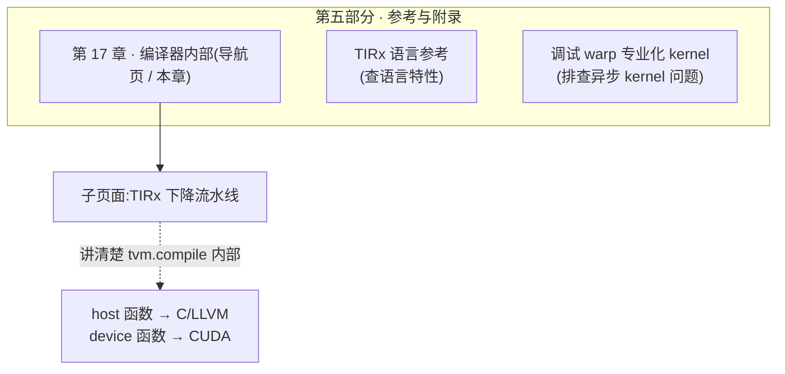
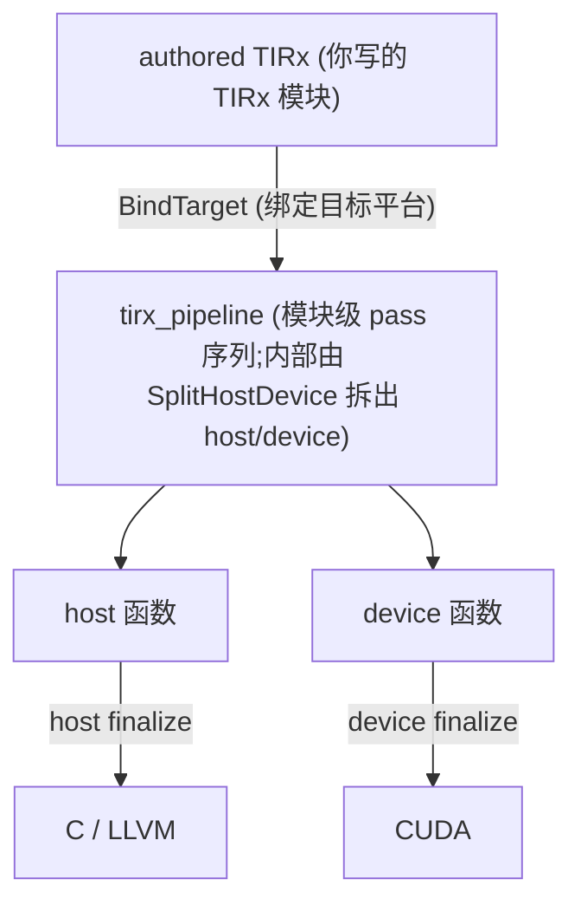

# 第 17 章 · 编译器内部(概览)

> 原文:[Compiler Internals](https://mlc.ai/modern-gpu-programming-for-mlsys/tirx_guide/arch/index.html)

> **本章要点(TL;DR)**
> - 先说清楚:这一章是个**导航页**,放在「参考与附录」里。它不是写给写 kernel(在 GPU 上跑的那段计算程序)的人看的,是写给**想动手改 TIRx 编译器的人**看的。
> - 这章现在就指向一个有内容的子页面——**TIRx 下降流水线 / TIRx lowering pipeline**。它只回答一个问题:你敲下 `tvm.compile(..., tir_pipeline="tirx")` 那一刻,编译器内部到底干了些什么。
> - 「下降 / lowering」是啥?说白了,就是把你写的那些高层东西,一层一层翻译成底层东西。具体来讲,就是把**瓦片原语(tile = 大矩阵切出来的小方块,瓦片原语就是直接操作这些小方块的高层指令)、带 `TileLayout` 类型的缓冲区、执行作用域 id** 这几样,翻译成**主机(host,即 CPU 端的启动代码)和设备(device,即真正在 GPU 上跑的代码)两份函数**,最后由 CUDA 后端吐出源码。
> - 这套翻译的总入口叫 `LowerTIRx`,它就干三件事:把瓦片原语派发成具体的后端实现;把布局算成真正的地址计算;把作用域 id 落到 `blockIdx` / `threadIdx` 上。
> - 这部分最值钱的地方在哪?它会教你**只跑流水线的前几步,然后一阶段一阶段地把 IR 打出来看**。这样编译器每一步干了啥,你是亲眼看见的,而不是靠脑补。

> **前置知识**:读这一章前,最好先懂 TIRx 的基础用法(瓦片原语、缓冲区、`T.copy`/`T.gemm` 这些写法,见第 9 章),以及 host/device(主机/设备)与 kernel 启动(把活儿发到 GPU 上跑)的概念。没把握的话,先翻一下 [第 0 章 · 极简入门](./ch00_gpu_ml_primer.md)。本章会默认你已经认识这些词。

---

## 17.1 这一页是什么:写给贡献者的入口

原文这一页的正文很短,其实就是一个**目录(index)**。它在书里归在「**第五部分 · 参考与附录**」,任务很单纯:把你领到「编译器内部」相关的那几个子页面去。

它跟前面 1–14 章不是一路货。前面那些章教你怎么用,这一章讲的是编译器自己怎么转的。两边一对比就清楚了:

| 维度 | 主线章节(Part I–IV) | 本章「编译器内部」(Part V) |
| --- | --- | --- |
| 读者 | 想**写**高性能 GPU kernel 的人 | 想**改 / 扩展 TIRx 编译器本身**的贡献者 |
| 关注点 | 怎么用 API、怎么排布数据、怎么调性能 | kernel 源码在编译器里**如何被一步步翻译** |
| 阅读时机 | 从头顺着读 | 用到了再翻 |

> **关键**:你就把「编译器内部」当成一份**实现笔记 / 贡献者文档**来看,别当教程。不读它,你照样能写出能跑的 TIRx kernel。可一旦你心里冒出一个念头——"我写的这行 `T.copy`,最后到底被翻译成啥了?"——或者你想往编译器里塞一个新原语,那这里就是你该来的地方。

「参考」部分一共三个页面,分工很清楚。你想干啥,就翻对应那一页:

| 你的需求 | 去哪一页 |
| --- | --- |
| 查某个 TIRx 语言特性 | **TIRx 语言参考(TIRx Language Reference)** |
| 了解编译器内部(下降流水线) | **编译器内部(Compiler Internals)** ← 本章 |
| 调试异步 GEMM(矩阵乘法)/ FlashAttention(一种高效的注意力算子)的挂起、崩溃、结果错误或变慢 | **调试 warp(一个 warp = 32 个线程的小班,见第 0 章)专业化 kernel(Debugging Warp-Specialized Kernels)** |

---

## 17.2 子页面一览:目前只有「TIRx 下降流水线」

这一页眼下就列了一个条目:

- **TIRx lowering pipeline / TIRx 下降流水线**

下面给你画张图,让你一眼看清它在整本书里待在哪儿,跟旁边那两个参考页又是什么关系。



<p align="center"><em>图 17-1:本章在「参考」部分的位置,以及它指向的实质内容。</em></p>

> **注意**:导航页本身一点技术细节都没有,真东西全在子页面「TIRx 下降流水线」里。别急着翻过去——下面 17.3 先给你来一份速览,看完你心里就有数:要不要点进去深读。

---

## 17.3 速览:TIRx 下降流水线在做什么

> 这一节是子页面内容的**浓缩版导读**,先帮你抓住主干,再决定要不要点进去。想看每个 pass 一个一个怎么讲的,翻本仓库的第 18 章笔记。

### 一句话定位

你一调用 `tvm.compile(mod, target, tir_pipeline="tirx")`,后面就连着发生一串事:你写好的 TIRx 模块,被丢进一条**排好顺序的 TIR pass 流水线**(也就是 `python/tvm/tirx/compilation_pipeline.py` 里那个 `tirx_pipeline`)。这条流水线把你那些高层写法翻成 host + device 两份函数,再扔给 CUDA 后端生成源码。

### 整体数据流



<p align="center"><em>图 17-2:编译先 <code>BindTarget</code> 绑定目标,再跑模块级 <code>tirx_pipeline</code>(host/device 的拆分发生在流水线内部),最后按函数种类分别做收尾(finalization)并渲染:host 出 C/LLVM,device 出 CUDA。</em></p>

### 三个值得记住的关键阶段

整条流水线有十几个 pass(narrow dtype、向量化、循环展开、CSE、各种 fp8/bf16 合法化等等)。这些你不用全记。想搞懂 lowering 到底是怎么回事,盯死下面这三步就够了:

| 关键阶段 | 它把什么变成了什么 |
| --- | --- |
| **`LowerTIRx`** | 整个下降的核心。它里头分两半:`TilePrimitiveDispatch` 和 `LowerTIRxCleanup`。前一半把每个瓦片原语(`copy` / `gemm` / `reduction` …)换成你选定的那个后端的具体代码。后一半跑 `LayoutApplier`,干三件事:把 `TileLayout` 类型的缓冲区访问算成真正的地址(`addr = data + elem_offset + layout.apply(coord)`);把缓冲区展平;再把执行作用域 id(`T.cta_id` / `T.thread_id`)经过 `launch_thread` 落到 `blockIdx` / `threadIdx`(GPU 内置的"我是第几个线程块 / 第几个线程"的编号)上。 |
| **`SplitHostDevice`** | 它在 `launch_thread` 这个边界上下刀,把一个 kernel 劈成两半:**host 函数**(管算 grid/block,即一次启动开多少个线程块、每块多少线程,然后发起启动)和 **device 函数**(真正跑在 GPU 上那个 `__global__` 体)。 |
| **`MakePackedAPI`** | 它把 host 函数改写成 TVM 调用约定要的那套 packed-func ABI。改完之后,它就是最终被调起来的那个"启动器"。 |

> **关键**:`LowerTIRx` 一跑完,模块就"掉回"普通 TIR 了。啥意思?就是说瓦片原语没了,`TileLayout` 那层间接也没了,作用域 id 也变成真正的线程轴了。换句话说,高层那些花活儿到这一步全翻译完了。再往后的 pass,无非是在普通 TIR 上做些常规优化和合法化,没别的了。

### 你能自己把每一步复现出来

子页面里最实用的一招,就是教你**只手动跑流水线最前面那几步**,然后一阶段一阶段把 IR 打出来。书里那些 IR 片段,就是这么一步步生出来的:

```python
from tvm.tirx import transform as TT

target = tvm.target.Target("cuda")
# 绑定目标(host 用 llvm),得到待编译模块
mod = TT.BindTarget(target.with_host("llvm"))(tvm.IRModule({"main": scale}))
mod = TT.LowerTIRx()(mod)   # 只跑核心下降:派发瓦片原语、应用布局
print(mod.script())         # 打印下降后的 TIRx IR,直观看到变化
```

要是你想直接看最后生成的 CUDA:

```python
# 完整编译,指定走 tirx 流水线
exe = tvm.compile(tvm.IRModule({"main": scale}), target=target, tir_pipeline="tirx")
print(exe.mod.imports[0].inspect_source())   # 打印生成的 CUDA 源码
```

> **注意**:`LowerTIRx()(mod)` 这种"单跑一段"的玩法,是你排查问题、摸清编译器脾气的利器。想看哪一步的结果,就在那一步前后各 `print(mod.script())` 一次,前后一对比,变了什么一目了然。

---

## 17.4 建议的阅读顺序

1. **先看看你是不是这章的目标读者**。要是你只想写写 kernel、调调性能,这部分先跳过没关系。等哪天你心里冒出"怎么编译出来是这副样子"的疑问,再回头看也来得及。
2. **从这一页(本章)进**,先把一件事搞清楚:「编译器内部」眼下就讲了下降流水线这一个主题,别的还没有。
3. **认真读子页面「TIRx 下降流水线」(也就是本仓库第 18 章笔记)**。把 pass 表按顺序过一遍,重点啃这三个关键阶段:`LowerTIRx`(尤其是里头的 `TilePrimitiveDispatch` 和 `LayoutApplier`)、`SplitHostDevice`、`MakePackedAPI`。
4. **自己动手跑一遍**。拿原文那个就一行的 `scale` kernel,自己走一遍 `BindTarget → LowerTIRx`,每跑一步就 `print(mod.script())`,把脑子里的"概念"跟屏幕上的"真实 IR"一一对上。
5. **要用了再横跳**。要排查异步 kernel 的问题,就转去「调试 warp 专业化 kernel」;只是查个语言特性,就转去「TIRx 语言参考」。

---

## 小结

- 第 17 章自己就是「参考与附录」里的一个**导航页**,写给**编译器贡献者**,不是给写 kernel 的人看的。
- 它眼下就指向一个有内容的子页面:**TIRx 下降流水线**,把 `tvm.compile(..., tir_pipeline="tirx")` 内部那一整套翻译过程讲清楚。
- 下降是怎么回事,一句话:把**瓦片原语 + `TileLayout` 缓冲区 + 执行作用域 id**,过一串排好顺序的 TIR pass,翻成 **host(启动器)和 device(`__global__` 体)** 两份函数,最后渲染成 CUDA。
- 最关键的三个阶段:`LowerTIRx`(派发原语 + 应用布局 + 落地线程轴)、`SplitHostDevice`(主机/设备拆分)、`MakePackedAPI`(打包 ABI)。
- 最实用的一招:**只跑流水线前几步,再 `print(mod.script())`**,这样你就能一阶段一阶段"看见"编译器到底在干什么。

## 延伸阅读

- 原文(本导航页):<https://mlc.ai/modern-gpu-programming-for-mlsys/tirx_guide/arch/index.html>
- 子页面「TIRx 下降流水线」:对应本仓库第 18 章笔记;原书路径在同一 `tirx_guide/arch/` 目录下。
- 完整的 `tvm.tirx` Python API,请参阅上游 TVM 官方文档。
- 相关参考页:「TIRx 语言参考」「调试 warp 专业化 kernel」(均在本书「参考与附录」部分)。

## 术语对照

| 中文 | English |
| --- | --- |
| 下降流水线 | lowering pipeline |
| 瓦片原语 | tile primitive |
| 主机函数 / 设备函数 | host function / device function |
| 执行作用域 id | execution-scope id |
| 收尾(阶段) | finalization |
| 打包函数 ABI | packed-func ABI |
| 布局应用器 | LayoutApplier |
| 编译目标 | target |
