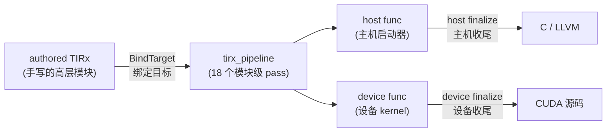
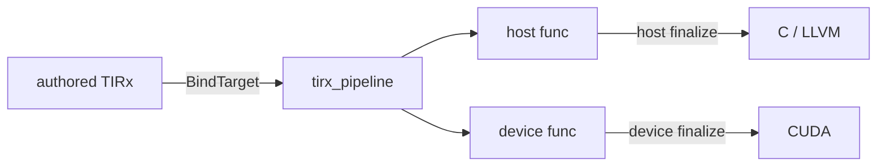
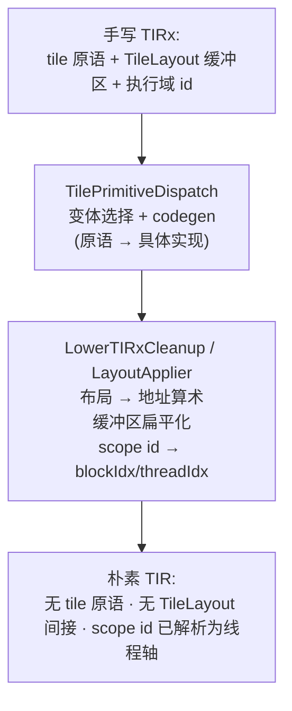
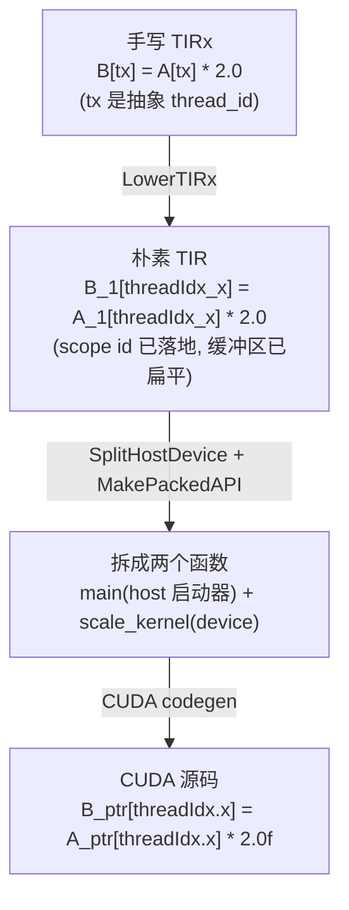

# 第 18 章 · TIRx Lowering 流水线

> 原文:[TIRx lowering pipeline](https://mlc.ai/modern-gpu-programming-for-mlsys/tirx_guide/arch/lowering_pipeline.html)

> **本章要点(TL;DR)**
> - 你写的 TIRx 代码很"高层",但 GPU 看不懂。**TIRx 流水线 / tirx pipeline** 就是一条流水线,负责把它一步步翻译成 GPU 能执行的样子。
> - 整条路径很简单:手写的 TIRx → 绑定目标 → 跑流水线 → 把代码拆成 host(主机)和 device(设备)两部分 → 各自收尾 → 最终生成 C/LLVM 和 CUDA。
> - 流水线一共 **18 个 pass(处理步骤)**,从最核心的 `LowerTIRx` 开始,后面依次做:合并线程绑定、化简、缓冲区扁平化、数据类型合法化、向量化、循环展开、消除重复表达式、拆分 host/device、生成调用接口等。
> - 其中 `LowerTIRx` 自己又拆成两小步:第一步把高层算子(tile 原语)展开成具体实现,第二步把"数据该放哪"的布局抽象算成真实的内存地址,并把"谁来执行"翻译成 `blockIdx` / `threadIdx`。
> - 一个很实用的点:你可以**只跑流水线的前半段**(比如只跑到 `LowerTIRx`),然后用 `mod.script()` 把中间结果打印出来看。本书里的 IR 片段都是这么来的。

> **前置知识**:读这一章前,最好先懂 TIR / pass(编译里一道道处理步骤)、host/device(主机/设备,即 CPU 端和 GPU 端)、以及 grid/block/thread(网格/块/线程)这几个概念。没把握的话,先翻一下 [第 0 章 · 极简入门](./ch00_gpu_ml_primer.md),以及第 17 章。本章会默认你已经认识这些词。

---

## 18.1 这条流水线解决什么问题

先看看我们手上拿着什么。在 TIRx 里,你写的代码站得很"高"——只说大意,不抠细节。一个 kernel(在 GPU 上由大量线程并行执行的那段函数,见第 0 章),你拿三样东西就能描述出来:

- 用 **tile 原语 / tile primitive**(`copy`、`gemm`(矩阵乘,GPU 上最常见的核心运算)、`reduction` 这些)说清楚"要算什么"。
- 用带 `TileLayout` 类型的缓冲区说清楚"数据怎么摆"。
- 用 **执行域 id / execution-scope id**(像 `T.cta_id`、`T.thread_id`)说清楚"谁来干"。

这么写当然省事,可问题来了:GPU 根本看不懂这套东西。GPU 后端只认**最朴素的 TIR**——具体的线程轴、压成一维的内存访问、它原生支持的那几种数据类型。

那怎么办?这就得靠 **lowering(下降)流水线**了。它干的活,就是把上面这套高层写法一步步"压"下去,压成 GPU 跑得动的朴素形式。入口特别简单,就一行:

```python
tvm.compile(mod, target, tir_pipeline="tirx")  # 指定使用 tirx 流水线
```

这一行背后发生了什么?它把你手写的 TIRx 模块塞进 **tirx 流水线**,过一遍那一长串处理步骤,把它劈成 **host(主机)** 和 **device(设备)** 两类函数,最后丢给 CUDA 后端去吐源码。

> **关键**:流水线的定义在 `python/tvm/tirx/compilation_pipeline.py` 里,函数名叫 `tirx_pipeline`。说白了,看懂这条流水线,就等于看懂了"高层的 tile 写法是怎么一步步变成 CUDA kernel 的"。它是整个 TIRx 编译栈的主干。

---

## 18.2 它处在编译流程的哪个位置

`tvm.compile` 干的活,拆开看就是四步:

1. **绑定目标 / BindTarget**:先跟模块交代清楚"咱们要往哪种硬件上编"——比如目标是 `cuda`,host 用 `llvm`。后面的步骤得先知道这个,才知道该往哪个方向翻。
2. **跑 tirx 流水线**:就是 18.3 节要一个个列出来的那一长串步骤。
3. **给 host / device 函数各做各的收尾(finalization)**:注意,host 和 device 用的是**两套不一样**的收尾步骤。
4. **把每个 device 函数交给 CUDA 代码生成器**,生成最终源码。

那为什么 host 和 device 要分开收尾?别急,下面这张图先把整条主干画出来,看完你就明白了。



> **注意**:host 和 device 不是一上来就两家分开的。流水线跑到 `SplitHostDevice` 这一步(也就是 18.3 节的第 15 个 pass)之前,整个 kernel 一直是**一个**函数;到了这一步,它才被"劈"成 host 和 device 两半,然后各回各家、各做各的收尾。收尾为什么要"按函数种类分着跑",原因就在这。

下面这张图讲的是同一件事,只是画得更紧凑、横着排:



---

## 18.3 流水线的 18 个 pass(逐个看)

`tirx_pipeline` 会**严格照下面这个顺序**,一个接一个地把这些步骤施加上去。其中有几个能用 `PassContext` 的开关关掉(用到了会说)。先拿一张表整体扫一眼,不用记,有个印象就够了。

| # | Pass 名称 | 它做什么 | 备注 |
| --- | --- | --- | --- |
| 1 | `LowerTIRx` | **核心下降**——把 tile 原语和布局抽象解析掉(详见 18.4 节) | 流水线的"重头戏" |
| 2 | `UnifyThreadBinding` | 合并等价的线程轴绑定,保证每个 `threadIdx` / `blockIdx` 轴只声明一次 | 去重 |
| 3 | `StmtSimplify` | 语句级算术化简(由 arith 分析器 / arith analyzer 完成) | 第一次化简 |
| 4 | `LowerTIRxOpaque` | 把剩余的不透明(opaque)TIRx 结构下降为朴素 TIR | 收尾性下降 |
| 5 | `FlattenBuffer` | 把多维的 `BufferLoad` / `BufferStore` 扁平化为一维 | 多维 → 1D |
| 6 | `BF16ComputeLegalize` | 把 `bfloat16` 计算改写成合法形式(上转为 f32 再算) | 计算合法化 |
| 7 | `NarrowDataType(32)` | 在可证明安全处,把索引/循环的 `PrimExpr` 数据类型收窄到 32 位 | 省寄存器/算力 |
| 8 | `VectorizeLoop` | 把 `T.vectorized` 循环变成向量操作 | 配 `tir.disable_vectorize` 时跳过 |
| 9 | `UnrollLoop` | 展开标了 `T.unroll` 的循环(以及小的常量循环) | 循环展开 |
| 10 | `StmtSimplify` | 再次化简——此时向量化/展开已暴露出新的常量 | 第二次化简 |
| 11 | `CommonSubexprElim` | 公共子表达式消除(CSE),把重复子表达式提到临时变量 | 配 `tir.disable_cse_tir` 时跳过 |
| 12 | `FP8ComputeLegalize` | 把 `float8` 计算改写成合法形式 | 计算合法化 |
| 13 | `VerifyMemory` | **安全闸门**:检查 host 端代码没有直接解引用 device 内存 | 校验,不改写 |
| 14 | `AnnotateEntryFunc` | 把那个唯一的 PrimFunc 标记为模块入口 | 标注 |
| 15 | `SplitHostDevice` | 在 `launch_thread` 边界把每个 kernel 拆成 **host** 函数 + **device** 函数 | **关键分水岭** |
| 16 | `MakePackedAPI` | 把 host 函数改写成打包函数(packed-func)ABI,即 TVM 调用的启动器 | 生成调用接口 |
| 17 | `FP8StorageLegalize` | 合法化 `float8` 的**存储**(打包进受支持的容器类型) | 存储合法化 |
| 18 | `BF16StorageLegalize` | 合法化 `bfloat16` 的**存储** | 存储合法化 |

### 几个"为什么这么排"的小细节

这串步骤的排法可不是随手摆的。挑几个最值得琢磨的点说说:

- **化简(`StmtSimplify`)为什么来两遍?**(第 3、第 10)不是手抖写重了。第一遍,是把 `LowerTIRx` 翻完之后留下的一堆算术清理干净;第二遍,是专门收拾向量化(第 8)和循环展开(第 9)之后又冒出来的那些常量和能化简的结构。说白了就是:**先把东西摊开,再统一打扫一遍**——编译器排步骤,常用这个套路。

- **数据类型合法化为什么拆成"计算"和"存储"两拨,中间还隔得老远?** `bfloat16` / `float8` 的**计算合法化**(第 6、第 12)放在前头,是因为改写计算会带出新的算术,得留给后面的化简、向量化接着收拾。而**存储合法化**(第 17、第 18)压到了**最后**,等 host/device 拆完才动手——存储打包这事更贴近物理内存布局,属于收尾性质的活,搁最后最合适。

- **`NarrowDataType(32)`(第 7)是个性能优化。** GPU 上算索引,只要 32 位够用,就能省寄存器、跑得更快。但它守着一条底线:**只有在能证明安全的时候才收窄**。不然万一溢出,地址就算错了,直接越界。这就是典型的"能优化就大胆优化,但兜底必须有、还得证得出来"。

- **`VerifyMemory`(第 13)只看、不动手。** 它是一道安全闸门(safety gate)。趁 host/device 还没拆开,它就盯一件事:host 代码有没有违规地直接去碰 device 内存。为什么非得放在 `SplitHostDevice` 前面?就为了**早点把问题拦下来**,别等出了事才追悔。

- **有两个步骤能用开关关掉**:`VectorizeLoop`(对应 `tir.disable_vectorize`)和 `CommonSubexprElim`(对应 `tir.disable_cse_tir`),都能靠 `PassContext` 跳过。调试的时候,或者你想对比一下"开和关到底差在哪",这俩开关特别趁手。

### Finalization(收尾)pass——按函数种类分别跑

前面提过,`SplitHostDevice` 把函数劈成 host 和 device 两类。劈完之后,收尾阶段会给它俩各上**一套不一样**的步骤: 

| 函数种类 | 收尾 pass 序列 | 说明 |
| --- | --- | --- |
| **host(主机)** | `LowerTVMBuiltin` → `LowerIntrin` | 先下降 `tvm_*` 内建函数(builtin),再下降目标特定的内建指令(intrinsic) |
| **device(设备)** | `LowerWarpMemory` → `StmtSimplify` → `LowerIntrin` | 先把线程束作用域(warp-scoped,warp 即一组通常 32 个一起执行的线程,见第 0 章)缓冲区下降成 shuffle 指令,再化简,最后下降内建指令 |

> **关键**:`LowerWarpMemory` 这一步是 device 端独有的。它把"warp 作用域的缓冲区"翻成 **warp 内的 shuffle 指令**。shuffle 是个啥?说白了,就是同一个 warp 里的线程在寄存器(register,线程私有、最快的那层存储)这一层直接互相递数据,不用先写进共享内存(SMEM,块内线程共用的片上内存,比寄存器慢但比全局内存快)、再读出来绕一圈,所以快。这是 GPU 上很常见的高效数据交换招数。host 端没这一步,因为 host 上压根就没有 warp 这回事。

---

## 18.4 深入 `LowerTIRx`:核心下降是怎么发生的

第 1 个步骤 `LowerTIRx` 是整条流水线的"重头戏",绝大部分翻译活儿都堆在这里。它自己其实又是两个小步骤接在一起跑,代码在 `src/tirx/transform/lower_tirx.cc`: 

```python
# LowerTIRx 内部其实是两个子 pass 的顺序组合
LowerTIRx = Sequential([ TilePrimitiveDispatch, LowerTIRxCleanup ])
```

这两步分工很清楚:

### (1) `TilePrimitiveDispatch`——把高层算子换成具体实现

你写的每个 `copy`、`gemm`、`reduction`(底层都是 `TilePrimitiveCall`),其实只是个"调用",并没有真身。这一步干的,就是把每一个这样的调用,**换成它在当前硬件上的真实函数体**。具体两件事:

- **变体选择 / variant selection**:同一个算子,换块硬件可能有好几种实现写法,这一步挑出最合适的那个(比方说 `gemm`,架构不同,走的指令路径就可能不同)。
- **代码生成 / codegen**:把选中的那个实现展开成真正的 TIR 语句。

打个比方,它就像把一个函数调用直接 inline 展开,塞进"这台机器上跑得最快的那段代码"。

### (2) `LowerTIRxCleanup`——用 `LayoutApplier` 把抽象落地

这一步会跑 **`LayoutApplier`(布局施加器)**。前面那些虚的、抽象的东西,到这儿就得全变成实打实的细节。它做三件事:

1. **把布局访问换成真实的地址计算**:你访问一个带 `TileLayout` 的缓冲区,只写了个坐标;这一步把这个坐标算成具体的内存地址。核心公式是: 

   ```text
   addr = data + elem_offset + layout.apply(coord)
   ```

   公式不用背,记住是三样东西相加就行:基址 `data`(数据打哪儿开始)+ 元素偏移 `elem_offset`(这块缓冲区在大数组里的起点)+ `layout.apply(coord)`(布局函数拿你给的坐标算出来的那个偏移)。一句话:**`TileLayout` 那层"绕来绕去"的抽象,在这一步被彻底拆光,变成干干净净的地址加法。**

2. **缓冲区扁平化**:把多维缓冲区压成一维,这样就能直接按地址去寻。

3. **把执行域 id 变成真实线程轴**:`T.cta_id`、`T.thread_id` 这些,靠 `launch_thread` 翻成 GPU 真认识的 `blockIdx`、`threadIdx`。

下面这张图,把 `LowerTIRx` 这两步"吃进去什么、吐出来什么"画清楚了: 



> **关键**:`LowerTIRx` 一跑完,模块就成了**朴素 TIR**——tile 原语没了,`TileLayout` 那层抽象没了,执行域 id 也全落成了真实线程轴。后面那 17 个步骤对着的,都是这种"已经落了地"的 TIR。也正因为前面把 TIRx 特有的那些东西都消化干净了,后面才能直接拿 TVM 现成的通用步骤(化简、向量化、CSE 这些)来用,不用再单独为 TIRx 另写一套。

---

## 18.5 一个完整的小例子:scale kernel 的下降全程

前面概念铺得有点多,这里拿一个最简单的例子,把它们都串起来——一个只有一行计算的缩放(scale)kernel,看它怎么一路变成 CUDA。

### 起点:手写的 TIRx

```python
@T.prim_func
def scale(A_ptr: T.handle, B_ptr: T.handle):
    A = T.match_buffer(A_ptr, (256,), "float32")        # 把句柄绑定成 256 元素的 f32 缓冲区
    B = T.match_buffer(B_ptr, (256,), "float32")
    T.device_entry()                                     # 声明这是设备入口
    bx = T.cta_id([1])                                   # 执行域 id:1 个 CTA(块)
    tx = T.thread_id([256])                              # 执行域 id:256 个线程
    B[tx] = A[tx] * T.float32(2.0)                       # 真正的计算:每个线程算一个元素
```

看一眼此刻的状态:`bx`、`tx` 还是**抽象的执行域 id**,还没变成真实线程轴;`A`、`B` 也还是带类型的缓冲区视图。接下来,咱们就盯着这几样东西,看它们怎么一步步落地。

### 经过 `LowerTIRx` 之后:scope id 变成真实线程轴,布局已施加

```python
with T.launch_thread("blockIdx.x", 1) as blockIdx_x:     # cta_id → blockIdx.x
    threadIdx_x = T.launch_thread("threadIdx.x", 256)    # thread_id → threadIdx.x
    bx: T.let = blockIdx_x                                # 抽象 id 绑定到真实轴
    tx: T.let = threadIdx_x
    B_1[threadIdx_x] = A_1[threadIdx_x] * T.float32(2.0) # A_1/B_1 是扁平化后的 1D 视图
```

对比一下,变了三处:执行域 id 被 `launch_thread` 裹成了真实线程轴;`A`、`B` 压成了一维视图 `A_1`、`B_1`;而计算逻辑本身一动没动,还是"乘以 2"。前面念叨的那个"落地",这会儿全都兑现了。

### 经过 `SplitHostDevice` + `MakePackedAPI` 之后:一个函数裂成两个

```python
@I.ir_module
class Module:
    def main(...):          # host:打包 API 启动器(算好 grid/block,发起 launch)
        ...
    def scale_kernel(...):  # device:真正在 GPU 上跑的 __global__ 函数体
```

原来那个 `scale` 函数,现在劈成了两个:

- **`main`(host)**:在 CPU 上跑,负责把网格(grid,所有块的总集合)和块(block,即 CTA,一组线程,见第 0 章)的配置算好,然后发起 kernel 启动。它对外用的是 TVM 的打包函数调用接口。
- **`scale_kernel`(device)**:真正在 GPU 上跑的那部分,马上就要被生成成 `__global__` 函数。

### 终点:CUDA 后端生成源码

最后一步,CUDA 后端把 `scale_kernel` 生成成 `__global__` 函数,那行核心计算就成了地道的 CUDA: 

```cuda
B_ptr[threadIdx.x] = A_ptr[threadIdx.x] * 2.0f;
```

下面这张竖着排的时间线,把"这一行代码从头走到尾"完整串了一遍: 



---

## 18.6 自己动手复现每个阶段

这条流水线有个特别好用的地方:**你用不着一口气跑完,完全可以只跑前面一段**,然后用 `mod.script()` 把中间结果打印出来瞧瞧。本书里所有 IR 片段,都是这么来的。学 lowering 也好,调 lowering 也好,这都是最趁手的家伙。

### 只跑到 `LowerTIRx`,看看下降后的 TIRx IR 长啥样

```python
from tvm.tirx import transform as TT

target = tvm.target.Target("cuda")
# 先绑定目标(host 用 llvm),把单函数模块包起来
mod = TT.BindTarget(target.with_host("llvm"))(tvm.IRModule({"main": scale}))
mod = TT.LowerTIRx()(mod)          # 派发 tile 原语、施加布局
print(mod.script())                # 打印下降后的 TIRx IR 检视
```

> **注意**:`target.with_host("llvm")` 的意思,是给 CUDA 目标再配一个 host 目标(这里用 LLVM)。为啥要配?因为后面 `SplitHostDevice` 拆出来的那个 host 函数,就得编译到这个 host 目标上去跑。

### 一口气编译整个模块,直接看生成的 CUDA

```python
exe = tvm.compile(
    tvm.IRModule({"main": scale}),
    target=target,
    tir_pipeline="tirx",            # 指定走 tirx 流水线
)
print(exe.mod.imports[0].inspect_source())   # 打印 CUDA 后端渲染出来的源码
```

这两段对照着用:前一段看"逻辑落地后的中间态",后一段看"最终的 CUDA 长啥样"。两头一对照,一个 kernel 从高层 DSL 到 CUDA 源码,中间每一跳你就全看明白了。

> **提示**:想搞清楚某一个步骤到底干了啥?有个简单招——把流水线分别截到这个步骤的"前"和"后",各打印一次,然后一 diff,哪儿改了一目了然。再配上 18.3 节那几个开关(比如把向量化或者 CSE 关掉),你就能精准抓出某个变换到底起了什么作用。

---

## 小结

本章把 **TIRx Lowering 流水线**从入口 `tvm.compile(..., tir_pipeline="tirx")` 一路讲到了 CUDA 源码。回头捋一遍:

- **整体位置**:`BindTarget → tirx_pipeline → 拆 host/device → 各自收尾 → C/LLVM 与 CUDA`。记住一个关键:host 和 device 是在 `SplitHostDevice` 这一步分的家,分完之后各走各的收尾。
- **18 个步骤的排法是有讲究的**:核心下降 `LowerTIRx` 打头阵;中间穿插着两轮化简、分两拨做的数据类型合法化(计算 / 存储)、偏性能的类型收窄和向量化/展开,还有那道只看不改的安全闸门 `VerifyMemory`;`SplitHostDevice` 则是把单函数劈成 host/device 的分水岭。
- **`LowerTIRx` 是整章的核心**:`TilePrimitiveDispatch` 把高层算子换成硬件上的具体实现,`LayoutApplier` 把 `TileLayout` 抽象算成 `addr = data + elem_offset + layout.apply(coord)` 这样的真实地址,顺带把执行域 id 落成 `blockIdx` / `threadIdx`。它一跑完,模块就成了朴素 TIR。
- **可复现**:整条流水线都支持"只跑前面一段 + `mod.script()` 看中间结果"。这既是书里那些 IR 片段的来源,也是你以后调 lowering 的标准做法。

说到底,这条流水线最值钱的地方在于:它把"你写的声明式 tile DSL"和"GPU 真正跑的 CUDA kernel"之间那道看着挺玄乎的鸿沟,拆成了一串**看得懂、能单跑、能逐段检查**的机械步骤。玄乎劲儿一散,剩下的全是你能动手验证的细节。

## 延伸阅读

- 原文:[TIRx lowering pipeline — Modern GPU Programming for MLSys](https://mlc.ai/modern-gpu-programming-for-mlsys/tirx_guide/arch/lowering_pipeline.html)
- 流水线定义源码:`python/tvm/tirx/compilation_pipeline.py`(`tirx_pipeline`)
- `LowerTIRx` 实现源码:`src/tirx/transform/lower_tirx.cc`

## 术语对照

| 中文 | English | 说明 |
| --- | --- | --- |
| 下降 / 降级 | lowering | 把高层结构逐步翻译为低层、贴近硬件形式的过程 |
| 流水线 | pipeline | 一条有序的编译 pass 序列 |
| tile 原语 | tile primitive | 高层算子调用,如 `copy` / `gemm` / `reduction` |
| 执行域 id | execution-scope id | 如 `T.cta_id` / `T.thread_id`,描述"谁执行" |
| 主机 / 设备 | host / device | CPU 端启动器 与 GPU 端内核 |
| 收尾 | finalization | 拆分后对 host/device 分别施加的末段 pass |
| 打包函数 ABI | packed-func ABI | TVM 调用 kernel 所用的标准调用接口 |
| 公共子表达式消除 | CSE (Common Subexpression Elimination) | 把重复子表达式提取为临时变量 |
| 数据类型合法化 | data type legalize | 把 bf16/fp8 等改写为硬件可执行的合法形式 |
| 类型收窄 | narrow data type | 在安全前提下把索引/循环类型降到 32 位 |
| 布局施加器 | LayoutApplier | 把 `TileLayout` 解析为物理地址算术的组件 |
| 线程束作用域内存 | warp-scoped memory | 由 `LowerWarpMemory` 下降为 shuffle 的缓冲区 |
| 线程束 | warp | GPU 中一组(通常 32 个)同步执行的线程 |
| 共享内存 | SMEM (shared memory) | 块内线程共享的片上内存 |
| 块 / 线程块 | CTA (Cooperative Thread Array) | 即 CUDA 的 block |
| 安全闸门 | safety gate | 只校验不改写的 pass,如 `VerifyMemory` |
