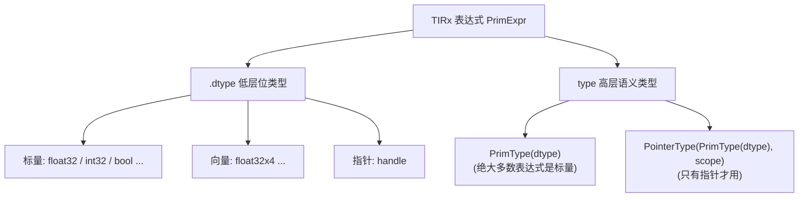
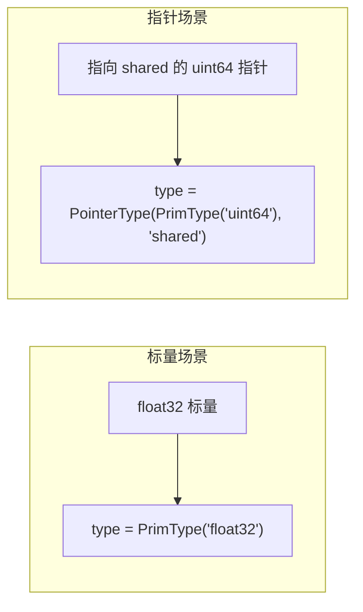
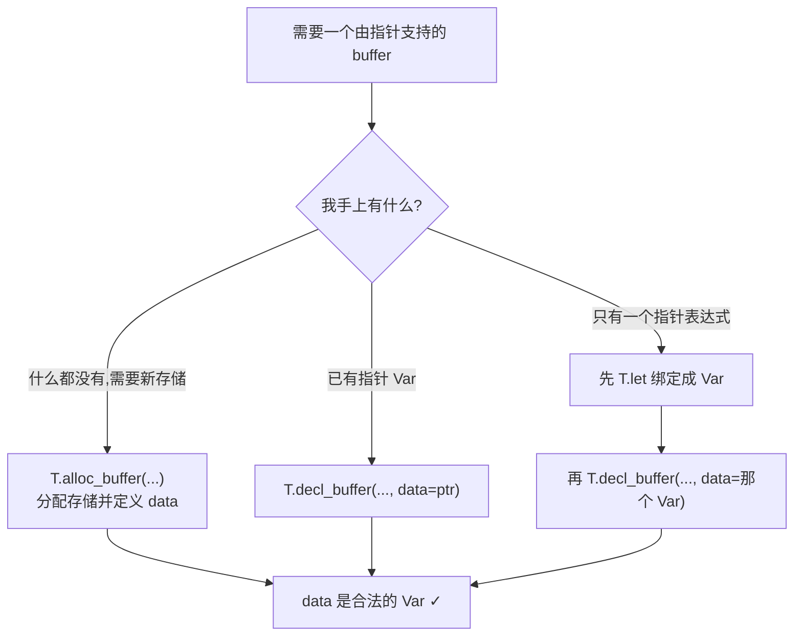
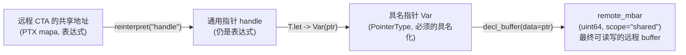

# 第 21 章 · 数据类型与表达式

> 原文:[Data types and expressions](https://mlc.ai/modern-gpu-programming-for-mlsys/tirx_guide/language_reference/cuda/data_types.html)

> **本章要点(TL;DR)**
> - 在 TIRx(TVM 的 TensorIR 扩展)里,**每个表达式身上都挂着两层类型**:下面一层 `dtype` 说的是"这堆是什么位",上面一层 `type` 说的是"这是个值还是个指针"。
> - `dtype` 跟 CUDA 的标量或向量类型一一对得上,比如 `float32 → float`、`float16 → half`、`bfloat16 → nv_bfloat16`、`float32x4 → float4`。生成代码的时候,它说了算——最后落成哪个 C++ 类型,就看它。
> - **向量 dtype**(像 `float32x4`)是头等公民。你拿它声明一个寄存器,再配一次 16 字节的读写(`vload`/`vstore`),向量化访存就成了。但要记住一句:向量这个属性是 dtype 自己带的,跟 `vload` 没关系。
> - 上面那层 `type`,大多数时候就是 `PrimType(dtype)`(也就是标量),你基本不用管。它真正派上用场,是碰到**指针(`handle`)** 的时候——指针得写成 `PointerType(PrimType(dtype), scope)`。
> - buffer 的指针 `data` 是个**改不了的(immutable)`Var`**。要是你想让 buffer 指向一个**算出来的指针表达式**(比如跨 CTA 去够另一个块的共享内存地址),那就得先用 `T.let` 把它绑成一个 `Var`,绕一道。

> **前置知识**:读这一章前,最好先懂 GPU 的几个基本"地盘"——寄存器、共享内存、CTA(线程块)、集群(cluster),以及什么是 TIRx(TVM 描述 GPU kernel 的中间表示,见第 9 章)。没把握的话,先翻一下 [第 0 章 · 极简入门](./ch00_gpu_ml_primer.md)。本章会默认你已经认识这些词。

---

## 21.0 为什么要把"类型"拆成两层?

先把结论撂这儿:在 TIRx 里,一个表达式的"类型"是两层的。为啥要搞得这么麻烦?咱们从平时写 CUDA 聊起。

你写 `float x;` 的时候,类型就一个维度,够用了。编译器一看到 `float`,啥都知道了:占 4 个字节、是浮点、能拿来做浮点运算——一句话就交代清楚了。

可 TIRx 不是给人直接读的代码,它是一种**中间表示(IR / intermediate representation)**:专门给编译器看的半成品,编译器读完它再去生成 CUDA。既然是要喂给编译器的,记的信息自然就得更细。

TIRx 是 TVM 在 TensorIR 上面加的一层扩展,干的活是描述 GPU kernel,最后吐出 CUDA 源码。它有两件事得一块儿顾好:一是把底层每个数据占多少位、怎么摆,控制得死死的;二是在 IR 这层就能看出来"这是个值,还是个指针"。为了一手抓俩,它干脆把类型劈成了两层:

| 层级 | 名称 | 回答的问题 | 典型取值 |
| --- | --- | --- | --- |
| 低层 | `dtype` | "这是什么位?"(标量/向量元素类型) | `float32`、`float16`、`int32`、`float32x4`、`handle` |
| 高层 | `type` | "这是标量还是指针?" | `PrimType(dtype)`、`PointerType(PrimType(dtype), scope)` |

> **关键**:先记住一句话——`dtype` 管"数据长啥样"(多少位、带不带符号、是不是向量),`type` 管"这数据是拿来干嘛的"(是个能直接参与运算的值,还是个指向某块存储的指针)。这两件事一分开,编译器既能精确地生成底层代码,又能顺手对指针做点语义检查。

下面这张图就是这个两层结构的概貌:



---

## 21.1 表达式的 dtype

咱们先讲下面那层——`dtype`,它最好懂。

每个表达式(`PrimExpr / 原始表达式`)身上都有个 `.dtype` 属性,告诉你这个表达式里**每个元素是什么类型**(标量也好,向量也好)。常见的就这么几类:

- **普通浮点**:`float32`、`float16`、`bfloat16`
- **整数**:`int32`、`uint8`
- **布尔**:`bool`
- **低精度浮点**:`float8_e4m3fn`、`float4_e2m1fn` 这一类。它们是专门为 AI 计算憋出来的窄格式(尤其是推理,还有新一代训练),位数特别少。名字里其实就写着位数怎么分:`e4m3` 就是 4 位指数、3 位尾数。
- **指针**:`handle`,说白了就是个 C 指针。
- **向量形式**:像 `float32x4`,意思是"4 个 `float32` 打成一包当向量用",对应 CUDA 里的 `float4`。

> **注意**:每个 dtype 到了生成代码(codegen)那一步,都会变成一个"对得上号的 CUDA 类型"。也就是说,dtype 不是个虚的标签,而是跟后端类型一一咬合的、实打实的物理类型。

### 21.1.1 一个例子:用各种 dtype 分配 buffer

光看列表不解渴,上个例子。原文有个示范 kernel,拿好几种 dtype 各分配了一块 buffer——有放在寄存器里的,有放在共享内存里的——顺手还演了一次 `float32x4` 的向量化访存。核心片段在下面,中文注释我都加好了:

```python
@T.prim_func
def dtypes(A_ptr: T.handle, O_ptr: T.handle):
    A = T.match_buffer(A_ptr, (256,), "float32")   # 把入参指针匹配成 256 元素的 float32 buffer
    O = T.match_buffer(O_ptr, (256,), "float32")
    T.device_entry(); bx = T.cta_id([1]); tx = T.thread_id([64])  # 设备入口 + 取 CTA 索引 bx、线程索引 tx

    f16  = T.alloc_local((1,), "float16")    # 寄存器标量:float16
    bf16 = T.alloc_local((1,), "bfloat16")   # 寄存器标量:bfloat16
    i32  = T.alloc_local((1,), "int32")      # 寄存器标量:int32
    u8   = T.alloc_local((1,), "uint8")      # 寄存器标量:uint8
    b1   = T.alloc_local((1,), "bool")       # 寄存器标量:bool
    sm   = T.alloc_shared((64,), "float16")  # 共享内存(SMEM)tile:64 个 float16

    v    = T.alloc_local((1,), "float32x4")  # 关键:一个向量 dtype 寄存器(float4)
    v[0] = A.vload([tx * 4], dtype="float32x4")  # 一次性向量化加载 4 个 float32
    O.vstore([tx * 4], v[0])                      # 一次性向量化写回 4 个 float32
    # ... (后续使用 f16/bf16/i32/u8/b1/sm) ...
```

有几处得拎出来单说:

1. **`T.alloc_local((1,), dtype)`** 开的是寄存器(register,每个线程自己的一小块超快私有存储,见第 0 章)级别的存储,每个线程自己有一份,别人看不到。形状写成 `(1,)`,就是说"我只要一个标量元素"。
2. **`T.alloc_shared((64,), "float16")`** 开的是一块**共享内存(SMEM / shared memory,一个 CTA 内所有线程共用的片上存储)** tile(大数组切出来的一小块),这块地方是整个 CTA(线程块,一组一起跑、能共用共享内存的线程,见第 0 章)里的线程一块儿用的。
3. **`v = T.alloc_local((1,), "float32x4")`** 是这一节最要紧的一行。它直接用向量 dtype 声明了**一个** `float4` 寄存器,之后写 `v[0]` 就能把这个向量拿出来。这里得留个神:buffer 形状是 `(1,)`,只有一个元素没错,可这"一个元素"本身就是 4 宽的向量。
4. **`A.vload([...], dtype="float32x4")` 和 `O.vstore([...], ...)`** 把挨着的 4 个 `float32` 当成**一次 16 字节的访存**整体搬。为啥这么干?这是 GPU 上压榨带宽的老套路:一条访存指令越宽,总共要发的访存次数就越少。

### 21.1.2 它生成什么样的 CUDA?

TIRx 写完了,咱们肯定想看看它到头来长成啥样。上面那段会被 lower(降级 / 下降)成下面这堆 CUDA。为了让重点更扎眼,原文把没关系的部分都删了:

```c++
half          f16_ptr[1];                // float16  -> half
nv_bfloat16   bf16_ptr[1];               // bfloat16 -> nv_bfloat16
int           i32_ptr[1];                // int32    -> int
uchar         u8_ptr[1];                 // uint8    -> uchar
signed char   b1_ptr[1];                 // bool     -> signed char
__shared__ alignas(64) half sm_ptr[64];  // 共享 float16,带 64 字节对齐
float4        v_ptr[1];                   // float32x4 -> float4 (向量)

v_ptr[0]                   = *(float4*)(A_ptr + tx * 4);  // 向量化加载:reinterpret 成 float4* 再解引用
*(float4*)(O_ptr + tx * 4) = v_ptr[0];                   // 向量化写回:同样 reinterpret 成 float4*
```

> **关键**:盯着最后两行看。所谓向量化访存,在 CUDA 里翻来覆去就一句话:**把 `float*` 硬转成 `float4*`,然后一口气读写**。一个 `float4` 正好 16 字节,对上一条宽访存指令。`float32x4` 这个 dtype 落到底层兑现的,就是这么回事,没别的玄机。

下面这张表把"TIRx dtype → 生成的 CUDA 声明"一行行摆出来,对照着看一目了然:

| TIRx 声明(`alloc_local` / `alloc_shared`) | 生成的 CUDA |
| --- | --- |
| `alloc_local((1,), "float16")` | `half f16_ptr[1];` |
| `alloc_local((1,), "bfloat16")` | `nv_bfloat16 bf16_ptr[1];` |
| `alloc_local((1,), "int32")` | `int i32_ptr[1];` |
| `alloc_local((1,), "uint8")` | `uchar u8_ptr[1];` |
| `alloc_local((1,), "bool")` | `signed char b1_ptr[1];` |
| `alloc_shared((64,), "float16")` | `__shared__ alignas(64) half sm_ptr[64];` |
| `alloc_local((1,), "float32x4")` | `float4 v_ptr[1];` |

### 21.1.3 向量 dtype 是"自带的",不靠 vload

这儿有个特别容易搞混的点,作者也专门拎出来敲了一下:很多人以为"向量"是 `vload` 给变出来的,其实根本不是。

> **注意**:一个数据是不是向量,纯粹是 dtype **自己**的事,跟 `vload`/`vstore` 一点关系都没有。你写下 `T.alloc_local((1,), "float32x4")` 的那一秒,一个 `float4` 寄存器就已经躺那儿了,你完全可以拿它当普通寄存器使。`vload`/`vstore` 不过是"碰巧"也用了同一个向量 dtype,去做一次宽访存而已。换句话说,**任何 buffer、任何标量,都能挂上向量 dtype**,根本不是非得过 `vload` 这道手才能凑出向量。

这种设计背后的讲究叫**正交性(orthogonality)**:把"数据是不是向量"跟"用哪条指令搬它"这两件事彻底拆开,谁也不绑谁。好处是怎么搭都行——你可以声明一个向量寄存器,然后随便拿它去参与运算;也可以冲着一个普普通通的 buffer 发起向量化访存。

### 21.1.4 dtype → CUDA 类型映射表

最后把这些对应关系归到一张表里,以后想查随手翻:

| TIRx dtype | 对应 CUDA 类型 | 说明 |
| --- | --- | --- |
| `float32` | `float` | 单精度浮点 |
| `float16` | `half` | 半精度浮点 |
| `bfloat16` | `nv_bfloat16` | brain float,8 位指数、7 位尾数 |
| `int32` | `int` | 32 位有符号整数 |
| `uint8` | `uchar` | 8 位无符号整数 |
| `bool` | `signed char` | 布尔用 `signed char` 承载 |
| `float32x4` | `float4` | 向量类型(4×float32) |
| `handle` | `T*`(指针) | 指针,`T` 为被指向的元素类型 |
| 其他向量 dtype | 对应的 CUDA 向量类型 | 形如 `<标量>x<N>` → CUDA `<类型><N>` |

> **注意**:你大概会纳闷,`bool` 干嘛映射成 `signed char`,不直接用 C++ 的 `bool`?图的是两件事:一是在 GPU 上有个板上钉钉的 1 字节布局,二是能被寻址。至于那些低精度浮点(`float8_e4m3fn`、`float4_e2m1fn` 之类),它们一样各有各对应的 CUDA 类型,只不过原文没把具体拼写一个个列出来罢了。

---

## 21.2 dtype 和 type 有什么区别?

下面那层 `dtype` 讲完了,抬头看看上面那层 `type`。它俩啥关系?一句话:

- **`dtype` 在下面**——只回答一件事,"是什么位(what bits)"。
- **`type` 在上面**——回答的是,"这玩意儿在类型系统里算个什么角色"。

那具体怎么对上呢?看是哪种东西:

- 是个**标量**,那它的 type 就是 `PrimType(dtype)`。比如一个 `float32` 标量,type 就是 `PrimType("float32")`。
- 是个**指针**,那它的 type 是 `PointerType(PrimType(dtype), scope)`。这里的 `dtype` 说的是它指向的元素是什么类型,`scope` 是存储作用域(像 `"shared"`、`"global"`)。

> **关键**:绝大多数表达式都是标量,这些的 type 没啥花头,就是 `PrimType(dtype)`,你压根不用单独惦记。**type 真正大显身手的地方,是指针**。为啥?因为指针得多记两件事——"指的是什么类型"和"待在哪个作用域",这两件事光靠 dtype 怎么也说不全。



---

## 21.3 指针(`handle`)

接着上节说——指针就是 type 系统真正能耍开的地方,这节好好讲。

在 TIRx 里,指针抛头露面时用的 dtype 是 `handle`。可它的"身份证信息"(指向谁、住哪个作用域)并不写在 dtype 里,而是上层的 `PointerType` 替它保管着。这节聊的是个挺实在的事:**一个指针,你怎么正经地拿到手、又用起来**。

### 21.3.1 一条核心规矩:buffer 的 `data` 是不可变的 `Var`

每个 buffer 都有个 `data` 字段,它就是这个 buffer 底下垫着的那根指针。关于 `data`,记住两点就够:

1. 它是个**指针类型的 `Var`(变量)**;
2. 它**改不了(immutable)**——指针一锤定音之后,就不许再重新赋值了。

> **关键**:干嘛先把这条规矩摆出来?因为后面那几种"取指针"的写法,全是被这条规矩逼出来的。规矩特别简单:`data` 只认 `Var`,不收表达式。所以呢,你别想着把一个"算出来的地址表达式"随手塞给 buffer 当 `data`——得先把它"安顿"成一个 `Var`,才行。

### 21.3.2 拿到指针的三种方式

把上面那条规矩(`data` 必须是 `Var`)揣兜里,取指针就有三条路可走,各管各的场景:

| 方式 | API | 它做了什么 | 适用场景 |
| --- | --- | --- | --- |
| 分配新存储 | `T.alloc_buffer(...)` | **分配存储 + 同时定义 `data` 指针** | 需要一块全新的存储 |
| 复用已有指针 | `T.decl_buffer(..., data=ptr)` | 在一个**已存在的指针 `Var`** `ptr` 之上声明 buffer | 已经有了指针 `Var`,只是想换个 buffer 视图去访问它 |
| 绑定指针表达式 | 先 `T.let` 成 `Var`,再 `decl_buffer` | 把一个**指针表达式**先绑定为 `Var`,再用它声明 buffer | 指针来自计算(如跨 CTA 的远程地址),而非现成的 `Var` |

不管你走哪条,终点是同一个:`data` 最后必须是个合法的 `Var`。下面这张流程图,就是把三条路怎么殊途同归到这个终点画了出来:



### 21.3.3 绑定指针表达式:访问远程 CTA 的共享内存

三条路里头,第三条最有意思,也最值得掰开讲。它对付的是这么一种情况:你手上的指针不是现成的 `Var`,而是**临时算出来的一个表达式**。这时候你绕不开——得先用 `T.let`(搭上 `PointerType`)给它"起个名字"、变成一个 `Var`,然后才好递给 `decl_buffer`。

啥时候会碰上"算出来的指针"?原文举的典型场景是**分布式共享内存(distributed shared memory)/ 集群(cluster,新一代 GPU 上由多个 CTA 组成、能互相读写共享内存的协作单元)**。它靠 `T.ptx.map_shared_rank`(底层就是 PTX 的 `mapa` 指令)干一件事:把"本 CTA 的某个共享地址"换算成"集群里另一个 CTA 的共享地址"。这么一换,几个 CTA 之间就能直接够到彼此的 SMEM 了。而这个换算出来的结果,天生就是个**地址表达式**——所以它正好得走"先 `T.let`,再 `decl_buffer`"这条道。

```python
from tvm.ir.type import PointerType, PrimType

# 1) 用 map_shared_rank(PTX mapa)算出远程 CTA 的共享地址(这是一个表达式)
#    再 reinterpret 成 handle,然后用 T.let 绑定到一个 PointerType 的 Var "ptr"
ptr: T.let[T.Var(name="ptr", dtype=PointerType(PrimType("uint64")))] = \
    T.reinterpret("handle", T.ptx.map_shared_rank(mbar.ptr_to([0]), 0))

# 2) 现在 ptr 是合法的指针 Var,可以用它声明一个 buffer
#    指向另一个 CTA 的 mbarrier(uint64),作用域为 shared
remote_mbar = T.decl_buffer([1], "uint64", data=ptr, scope="shared")
```

咱们一行一行拆:

1. **`T.ptx.map_shared_rank(mbar.ptr_to([0]), 0)`**:它对应 PTX 的 `mapa`,干的活是——把当前 CTA 里某个 mbarrier(放在共享内存里的一个同步计数器,用来等"数据到齐了没")的共享地址,换算成集群里目标 CTA(这里 rank 给的是 `0`)上同一个位置的共享地址。它吐回来的是一个**指针表达式**。
2. **`T.reinterpret("handle", ...)`**:把上面那个结果重新解释成 `handle`,也就是通用指针 dtype。
3. **`T.let[T.Var(..., dtype=PointerType(PrimType("uint64")))] = ...`**:这步就是关键的"起名字"。前面念叨过 `data` 必须是 `Var`,所以这儿用 `T.let` 把那个表达式绑到一个叫 `ptr` 的指针 `Var` 上,它的上层类型是 `PointerType(PrimType("uint64"))`。其中 `PrimType("uint64")` 说的是它指向的是 `uint64` 元素(mbarrier 本来就是拿 `uint64` 存的)。这里有个小细节:`PointerType` 只填了元素类型,没填 `scope`。作用域 `"shared"` 留给了下一步的 `decl_buffer`——俩人各管一摊,分工明确。
4. **`T.decl_buffer([1], "uint64", data=ptr, scope="shared")`**:最后这步,在那个合法的指针 `Var` 上面声明出一个 buffer:1 个元素、`uint64`、作用域 `shared`。打这儿起,你一读一写 `remote_mbar`,真正碰到的就是**远端那个 CTA 的共享内存**。

> **注意**:这段代码别被它唬住。它一下子扯进来好几个底层概念——PTX `mapa`、集群里的分布式共享内存、mbarrier、还有 `reinterpret`。但本章真正要你记的不是这些机制本身,而是一条规则:**指针表达式不能直接拿来当 `data`,必须先用 `T.let` 绑成 `Var`**。这条想通了,你也就明白这段代码为啥非得绕一圈、套个 `T.let` 了。

最后拿一张图收个尾,看看一个"远程共享地址表达式"是怎么一步步熬成一个能用的远程 buffer 的:



---

## 小结

这章没多长,但 TIRx 类型系统的三根顶梁柱算是立住了:

1. **两层类型**:下面那层是 `dtype`(位级的物理类型,跟 CUDA 的标量 / 向量类型 1:1 对得上),上面那层是 `type`(在类型系统里的角色,要么 `PrimType`、要么 `PointerType`)。标量场景下 type 没啥可说的;只有到了指针场景,type 才扛起那点要紧信息——指向谁、在哪个作用域。
2. **向量 dtype 是正交的**:像 `float32x4` 这种向量 dtype 是头等公民,声明个寄存器就到手一个 `float4`,向量化访存只是它一堆用法里的一种。一句话:向量这属性是 dtype 自己带的,跟 `vload`/`vstore` 不捆一块儿。
3. **拿指针得守规矩**:buffer 的 `data` 是个改不了的 `Var`。三条取指针的路(`alloc_buffer` / `decl_buffer(data=ptr)` / 先 `T.let` 再 `decl_buffer`),说到底都是为了守住同一条底线——**`data` 必须是 `Var`,不能是表达式**。指针要是算出来的(比如跨 CTA 的远程地址),那就先用 `T.let` 给它起个名字。

把这三条串一块儿你就咂摸出味儿了:TIRx 的类型设计自始至终就奔着一个目标——**既要把底层 CUDA 代码精确地生成出来,又要在 IR 这层就把"值 vs 指针"这种语义差别拎得明明白白,还能拿来做校验**。

## 延伸阅读

- 原文(英文):[Data types and expressions — Modern GPU Programming for MLSys](https://mlc.ai/modern-gpu-programming-for-mlsys/tirx_guide/language_reference/cuda/data_types.html)

## 术语对照

| 中文 | English | 备注 |
| --- | --- | --- |
| 数据类型 | dtype | 低层位级类型 |
| 高层类型 | type | `PrimType` / `PointerType` |
| 原始表达式 | PrimExpr | TIRx 表达式基类 |
| 原始类型 | PrimType | 标量的高层类型 |
| 指针类型 | PointerType | 指针的高层类型,含元素 dtype 与作用域 |
| 句柄 / 指针 | handle | 通用指针 dtype |
| 向量 dtype | vector dtype | 如 `float32x4` → `float4` |
| 向量化访存 | vectorized memory access | `vload` / `vstore` |
| 共享内存 | SMEM (shared memory) | CTA 内共享 |
| 寄存器 | register | `alloc_local` |
| 作用域 | scope | 如 `"shared"`、`"global"` |
| 不可变 | immutable | buffer 的 `data` 指针 |
| 降级 / 下降 | lower | IR → CUDA 代码生成 |
| 集群 | cluster | 多 CTA 组成的协作单元 |
| 分布式共享内存 | distributed shared memory | 跨 CTA 访问彼此 SMEM |
| 低精度浮点 | low-precision float | `float8_e4m3fn`、`float4_e2m1fn` 等 |
