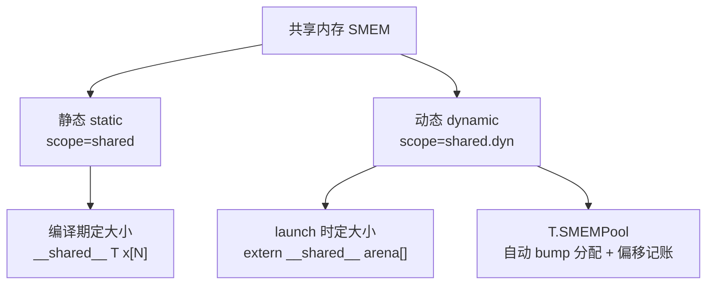
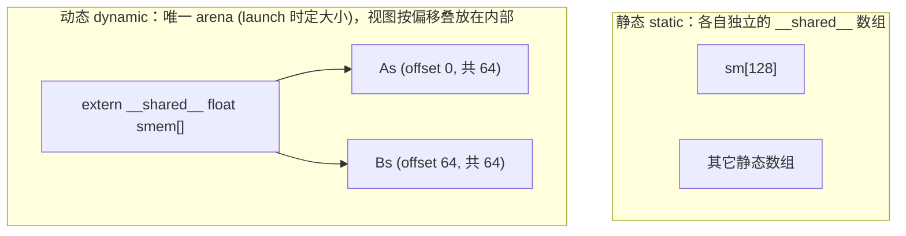
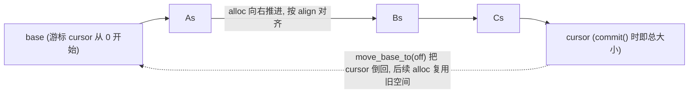
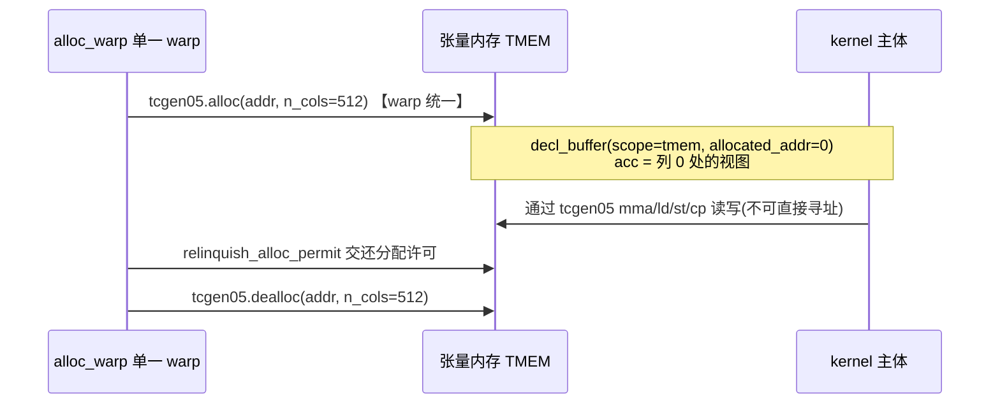

# 第 22 章 · 缓冲区与内存

> 原文:[Buffers and memory](https://mlc.ai/modern-gpu-programming-for-mlsys/tirx_guide/language_reference/cuda/buffers.html)

> **本章要点(TL;DR)**
> - **缓冲区(buffer)的本质就是「指针 + 元数据」**:相同的逻辑下标访问,会因为元数据(布局 layout、偏移 elem_offset)不同而编译成完全不同的地址算术。
> - 创建缓冲区只有两个根本 API:`T.alloc_buffer`(**新分配存储**)和 `T.decl_buffer`(**在已有指针上声明一个视图 view**)。`alloc_shared` / `alloc_local` 都只是带特定 `scope` 的 `alloc_buffer`。
> - `scope` 决定了内存空间:`global` / `shared`(静态共享内存)/ `shared.dyn`(动态共享内存)/ `local`(寄存器)/ `tmem`(Blackwell 张量内存)。
> - **共享内存有静态与动态两种**:静态在编译期定形;动态是一整块在 launch 时定大小的 arena(竞技场),整个 kernel 只能有一块,其它缓冲区都是它的视图。`T.SMEMPool` 自动帮你做这件繁琐的偏移记账。
> - **标量(scalar)是「一个元素的寄存器数组」的语法糖**;而 `T.let` 是**不可变绑定**,会下降成普通 C 局部变量,可被编译器自由传播/CSE。**张量内存(TMEM)** 必须显式 alloc/dealloc,不能直接寻址,只能通过 `tcgen05` 指令读写。

---

> **前置知识**:读这一章前,最好先懂 GPU 的内存层级(寄存器 / 共享内存 / 全局内存谁快谁慢、各归谁用),以及静态 vs 动态共享内存(SMEM)、TMEM 这几个名词;另外对 TIRx 的基本写法(`T.prim_func`、`T.match_buffer` 这类)有个印象会更顺。没把握的话,先翻一下 [第 0 章 · 极简入门](./ch00_gpu_ml_primer.md),以及第 9 章 TIRx。本章会默认你已经认识这些词。

这一章讲的是 TIRx 的**内存模型**,在整个「语言参考」里算是骨干。

想读懂它,你只要先抓住一句话:在 TIRx 里,一个缓冲区 / buffer **并不是一个真的装着数据的「盒子」**。你把它想象成贴在指针上的一张标签更准确——标签上写着「这块数据长什么样、该怎么访问」。这些信息,我们统称**元数据**。

为什么要这么设计?说白了,就是图个省事:这样一来,绝大多数缓冲区方法干的活儿,无非是在**编译期**改改这张标签——换个形状、换种读法而已。它们影响的只是「下标最后怎么翻译成地址」,运行时一条多余指令都不会多出来。这个道理一旦想透,后面所有 API 为什么长成那个样子,你立马就全懂了。

## 一、缓冲区的统一心智模型

先混个脸熟:在 TIRx 里,缓冲区来来回回就这么几种玩法。

- **包装参数指针**:`T.match_buffer(ptr, shape, dtype, ...)`,把外面传进来的指针参数包成一个缓冲区。
- **下标访问**:`A[i, j]`,读写某个元素。
- **切片**:`A[m0:m0+BM, 0:BK]`,取出一块子区域,得到一个 `BufferRegion`(缓冲区区域 / buffer region)。
- **取指针**:`A.ptr_to([i, j])` 拿某个元素的地址,或者 `A.data` 拿这块存储的原始数据指针。

这里有一句最要紧的话:**只要不是 tmem,所谓「声明一个缓冲区」,说到底就是「给一根指针配上一个布局 layout」**。这两样凑齐了,随便你写哪个下标,最后都能算出一个地址来。这个地址怎么算,原文给了个公式,值得记一记:

```text
addr(buffer[coord]) = buffer.data + elem_offset + layout.apply(coord, shape=shape)["m"]
```

公式看着挺唬人,拆开其实就三块加起来:「起点 + 挪一段 + 按坐标算偏移」。一个个说:

| 组成部分 | 大白话 |
| --- | --- |
| `buffer.data` | 起点指针,也叫基址 / base pointer,就是这块存储从哪儿开始 |
| `elem_offset` | 在起点的基础上再往后挪几个元素,用来把一个「视图」摆到 `data` 的某个偏移处 |
| `layout.apply(coord, ...)["m"]` | 把多维坐标 `coord` 换算成一维的元素偏移;`"m"` 就是这个换算结果里的「元素偏移」那一项 |

符号你不用死记,记住这条思路就够了:**从哪儿开始 + 往后挪多少 + 坐标算出多少**,三者一加就是地址。

> **关键**:同样一句 `B[i, j]`,**就因为缓冲区的元数据不一样**,编译出来的地址算术能差出十万八千里。元数据是编译期就钉死的,到了运行时,剩下的不过是对裸指针做加减乘罢了。

下面我用一组对照例子,把这套心智模型给你坐实。我们对一块 `4×8` 的区域干同一件事 `B[i, j] = A[i, j] + 1`,但**只动 `B` 的声明方式**,看看地址会跟着怎么变。`A` 我们让它一直是行主序,所以 `A[i,j]` 的下标永远是 `i*8 + j`,雷打不动——这样你就能专心盯着 `B` 一个看了:

```python
from tvm.tirx.layout import TileLayout, S

# 1) 行主序(row-major):默认布局
B = T.match_buffer(p, (4, 8), "float32")
# 2) 列主序(column-major):用 TileLayout 指定 stride 为 (1, 4)
B = T.match_buffer(p, (4, 8), "float32", layout=TileLayout(S[(4, 8):(1, 4)]))
# 3) 平移视图(shifted view):整体偏移 64 个元素
B = T.match_buffer(p, (4, 8), "float32", elem_offset=64)
# 4) 行 stride 改成 16:每行跨 16 个元素而非紧密的 8 个
B = T.match_buffer(p, (4, 8), "float32", layout=TileLayout(S[(4, 8):(16, 1)]))
```

还是那句 `B[i, j]`,这四种声明生成的 CUDA 下标,各是各的样:

```c++
B_ptr[((i * 8) + j)]        = ...;   // 行主序:        i*8 + j
B_ptr[((j * 4) + i)]        = ...;   // 列主序:        j*4 + i
B_ptr[(((i * 8) + j) + 64)] = ...;   // elem_offset=64: i*8 + j + 64(整体平移 64)
B_ptr[((i * 16) + j)]       = ...;   // 行 stride 16:   i*16 + j(每行间隔 16)
```

> **注意**:`TileLayout(S[(shape):(strides)])` 你就读成「形状 : 每个轴的步长 / stride」。步长是啥?就是「这个轴下标每加 1,地址要往后跳几个元素」。拿 `S[(4,8):(1,4)]` 来说:第 0 轴步长是 1、第 1 轴步长是 4——这不正好就是列主序嘛。把步长这个概念吃透,等于拿到了理解一切「视图变换」的钥匙。

## 二、声明缓冲区:两个根本 API

能造缓冲区的 API,统共就两个。它俩的区别只在一处:**到底要不要分配一块新存储**。

### 2.1 `T.alloc_buffer` —— 分配新存储

```python
T.alloc_buffer(shape, dtype, scope=..., ...)
```

它会**实打实地分配一块新存储**(在 IR 里吐出一个 `AllocBuffer` 节点),然后把一个 `Buffer` 还给你。它有两个常用的简写:

- `T.alloc_shared(...)` 就是 `scope="shared"` 的 `alloc_buffer`。
- `T.alloc_local(...)` 就是 `scope="local"` 的 `alloc_buffer`。

### 2.2 `T.decl_buffer` —— 在已有指针上声明视图

```python
T.decl_buffer(shape, dtype, data=..., ...)
```

它**一块新存储都不分配**,只是在一根现成的指针 `data` 上「再开一个视图」。说白了,就是给同一块存储起个别名(alias),或者换种眼光重新解读(reinterpret)它——比方说内存池里的某段子区域,或者一个张量内存地址。

> **关键**:`decl_buffer` 有个小例外——要是你传了 `data=None`,它手头就没现成指针可用了,这时它会退一步,像 `alloc_buffer` 那样**自己掏腰包分配**一块。

归根结底,这两者的差别就一处:那根 `data` 指针(它是个不可变的 `Var`)究竟从哪儿来:

| API | `data` 指针从哪来 |
| --- | --- |
| `alloc_buffer` | 它**自己造**出这个 `data`(这次分配的产物) |
| `decl_buffer` | 它**接收**一个已经存在的 `data`(从外面传进来) |

> **注意**:要是你手里是个**指针表达式**(而不是现成的 `Var`),想拿它来撑起缓冲区,那得先把它绑定成一个 `Var` 才行(具体怎么绑,见原书「数据类型与表达式」那章)。

### 2.3 共享的描述符参数

这两个 API 共用同一套描述参数。挑几个最常打交道的看看:

| 参数 | 含义 |
| --- | --- |
| `dtype` | 元素类型,如 `"float32"`、`"float16"`、`"float4_e2m1fn"` 等 |
| `shape` | 逻辑形状(各维 extent 组成的元组) |
| `layout` | 物理映射(`TileLayout`);`"default"` 即稠密行主序 |
| `elem_offset` / `byte_offset` | 把一个**视图**放到 `data` 的某个偏移处 |
| `allocated_addr` | 携带一个**预先指定的地址**(用于张量内存) |
| `align` | 数据指针的对齐字节数 |

还有个 `scope` 参数,它说了算的是:这块缓冲区到底落在**哪种内存空间**里。这条线索本章后面几节会反反复复出现,你先认个脸:

| Scope | 快捷方式 | 对应内存 |
| --- | --- | --- |
| `"global"` | (默认) | 设备全局内存(global memory) |
| `"shared"` | `T.alloc_shared` | 静态共享内存(`__shared__`) |
| `"shared.dyn"` | (走内存池) | 动态共享内存(pooled,见下文) |
| `"local"` | `T.alloc_local` | 每线程的寄存器(registers) |
| `"tmem"` | (走 TMEM 池) | Blackwell 张量内存(tensor memory) |

下面这段把四种典型用法摆在一块儿,你对照着看:

```python
A   = T.match_buffer(A_ptr, (M, K), "float16", align=16)    # 参数缓冲区(全局内存)
As  = T.alloc_shared((BM, BK), "float16")                   # 新的共享内存 tile
acc = T.alloc_local((4,), "float32")                        # 寄存器累加器
view = T.decl_buffer((BM, BK), "float16", data=As.data)     # 在 As 上声明的一个视图
```

## 三、共享内存(shared memory)

共享内存 / shared memory(往下简称 SMEM)有两种「口味」:**静态**和**动态**。怎么分?就看一点——它的大小是**编译时**就定死了,还是**每次启动 kernel 的时候**才现定。除此之外还配了个内存池(pool)帮手,专门收拾动态这种麻烦事。



### 3.1 静态共享内存

最省事的共享缓冲区就是**静态**这种——用 `T.alloc_shared`(也就是 `scope="shared"`),大小在编译时就钉死。它最经典的套路是三步走:**先把数据搬进来 → 拿 `cta_sync` 让整个 block(CTA,一组协作的线程,共享同一块共享内存)都看见这次写入 → 再读回来用**。

```python
@T.prim_func
def smem_demo(A_ptr: T.handle, B_ptr: T.handle):
    A = T.match_buffer(A_ptr, (128,), "float32")
    B = T.match_buffer(B_ptr, (128,), "float32")
    T.device_entry()
    bx = T.cta_id([1])
    tx = T.thread_id([128])
    sm = T.alloc_shared((128,), "float32")   # 静态共享内存
    sm[tx] = A[tx]
    T.cuda.cta_sync()                        # 块内同步,等价 __syncthreads()
    B[tx] = sm[tx] * T.float32(2.0)
```

它会老老实实变成一个普普通通的 `__shared__` 数组:

```c++
__shared__ alignas(64) float sm_ptr[128];      // 对应 T.alloc_shared
sm_ptr[tx] = A_ptr[tx];
__syncthreads();                               // 对应 T.cuda.cta_sync()
B_ptr[tx] = sm_ptr[tx] * 2.0f;
```

### 3.2 动态共享内存

**动态**共享内存(`scope="shared.dyn"`)的大小不在编译时定,而是**每回启动 kernel 时**,靠一个叫 `sharedMemBytes` 的启动参数当场指定。它有条铁律,你先记牢:

> **关键**:一个 kernel **只准有一块**动态共享内存——就那一大整块,我们管它叫「arena / 竞技场」。所以你只分配它这一次,然后用 `T.decl_buffer`(把 arena 的指针 `data` 传进去,再配一个 `elem_offset`),把你要用的每个逻辑缓冲区,都声明成这块 arena 内部某个偏移上的视图。

```python
arena = T.alloc_buffer((128,), "float32", scope="shared.dyn")   # 唯一的 arena
# 在 arena 上 decl 两个视图,分别落在偏移 0 和 64
As = T.decl_buffer((64,), "float32", data=arena.data, scope="shared.dyn")                 # offset 0
Bs = T.decl_buffer((64,), "float32", data=arena.data, elem_offset=64, scope="shared.dyn") # offset 64
As[tx] = A[tx]
Bs[tx] = B[tx]
T.cuda.cta_sync()
C[tx] = As[tx] + Bs[tx]
```

这两个视图,共用的是同一块 `extern __shared__` arena(下面为了看得清楚,我把 arena 起名叫 `smem`):

```c++
extern __shared__ __align__(64) float smem[];   // 唯一的动态共享 arena
smem[tx]      = A_ptr[tx];                       // As —— 偏移 0 处的视图
smem[tx + 64] = B_ptr[tx];                       // Bs —— 偏移 64 处的视图
__syncthreads();
C_ptr[tx] = smem[tx] + smem[tx + 64];
```

下面这张图把两者的区别画清楚了:静态是「彼此独立的几块小数组」,动态是「一整块 arena,视图都叠在它里头」:



图注:静态共享内存是几块各自独立的小数组;动态共享内存只有一整块 `arena`（`smem[]`，大小在 launch 时确定),`As` 落在偏移 0、`Bs` 落在偏移 64,两个加起来正好填满 0~128。

> **注意**:千万别手一抖写了两次 `alloc_buffer(scope="shared.dyn")`,那是**错的**——动态共享内存只许分配一块。一句话把两者拎清:静态共享内存编译时就定好大小(`__shared__ T x[N];`);动态共享内存呢,是独此一块、启动时才定大小的 arena,你想要的各个视图,都靠 `decl` 在它内部不同偏移上声明出来。

#### 动态共享大小是怎么被传进去的?

这里有个特别容易绕晕的点:既然大小是启动时才定的,那 `sharedMemBytes` 到底是谁填进去的?答案是——**根本轮不到你手动填**,TVM 会照着你 `shared.dyn` 分配的大小,自动把它算出来。整个流程是这样:

1. 其实呢,arena 多大,编译时就已经心里有数了(上面例子里是 `128` 个 float,也就是 `512` 字节)。
2. 到了 lowering(下降)这一步,TVM 会往设备 kernel 的 `tirx.kernel_launch_params` 里塞一个 `"tirx.use_dyn_shared_memory"` 标记。
3. host 端的启动器一看到这个标记,就把总字节数算好,当成**最后一个**启动参数递进去。

```python
# 设备 kernel 属性:最后多了一个 use_dyn_shared_memory 标记
"tirx.kernel_launch_params": ["blockIdx.x", "threadIdx.x", "tirx.use_dyn_shared_memory"]

# host 端启动调用(..., gridDim.x, blockDim.x, dyn_shared_bytes):
T.call_packed("dyn_kernel", A.data, B.data, C.data, 1, 64, 512)
```

等跑起来,这个 `512` 就被填进 `cuLaunchKernelEx` 调用的 `config.sharedMemBytes` 里。从头到尾一条龙,全自动,你啥都不用管。

### 3.3 内存池语法糖:`T.SMEMPool`

前面那种做法——手动 `decl` 一堆视图、自己掰手指头算偏移——又烦人又容易出错。`T.SMEMPool` 就是来替你包这个脏活的:arena 的偏移记账,它给你**全自动**搞定。

它的工作原理叫**碰撞分配器 / bump allocator**:你每问它要一块,它就在 `shared.dyn` 上往后推一段、把偏移记下来,视图你一行都不用自己写。除了最基本的 `alloc` / `commit`,它还附送几个贴心的小帮手:

- **逐块指定 `align=`**:某一块缓冲区想单独设个对齐?可以。
- **`alloc_mma` 帮手**:自动给你配好一个 MMA(矩阵乘累加,Tensor Core 干的活)用得上的 swizzle(把数据在共享内存里错位摆放,避开 bank 冲突)布局。
- **`move_base_to`**:把游标(cursor)往回倒一倒,后面的分配就能**接着复用**前面那块空间。

```python
pool = T.SMEMPool()                                # 在 shared.dyn 上的 bump 分配器
As = pool.alloc((BM, BK), "float16", align=128)    # 切出一个 tile
Bs = pool.alloc((BK, BN), "float16", align=128)
Cs = pool.alloc_mma((BM, BN), "float16")           # MMA 兼容,swizzle 自动推断
pool.commit()                                       # 敲定内存池的总大小
# pool.move_base_to(offset) 把游标倒回去以复用空间
```

> **注意**:后面要讲的 **TMEM 池(`T.TMEMPool`),其实就是叠在一个 `SMEMPool` 上面的**。所以你现在把 `SMEMPool` 这套 bump 分配的路数搞明白,待会儿看 TMEM 会顺畅很多。

`SMEMPool` 怎么做 bump 分配,看一眼图就明白了:



图注:`SMEMPool` 是个碰撞分配器,游标从 0 起步,每 `alloc` 一次就往右推进一段(顺带按 `align` 对齐);到 `commit()` 那一刻,游标停在哪儿,内存池就有多大;`move_base_to(off)` 能把游标倒回去,让后面的分配覆盖、复用前面那块空间。

## 四、寄存器(registers)

每个线程自己用的那点临时数据,搁寄存器里跑得最快。想要这种存储,就用 `T.alloc_local(shape, dtype)`(也就是 `scope="local"`)来分配。它**每个线程一份、谁也不碍着谁**,最后会变成一个**蹲在寄存器里的本地数组**:

```python
r = T.alloc_local((4,), "float32")   # 每线程的寄存器数组
for k in T.unroll(4):                 # 展开循环,便于编译器把数组提升进寄存器
    r[k] = A[tx, k]
# ... 在 r[0..3] 上做计算 ...
```

```c++
alignas(64) float r_ptr[4];          // 每线程私有,驻留寄存器
r_ptr[0] = A_ptr[tx * 4 + 0];
r_ptr[1] = A_ptr[tx * 4 + 1];
// ...
```

> **注意:那个看着莫名其妙的 `alignas(64)` 到底咋回事?** 它就是缓冲区的**默认**对齐。`data_alignment` 默认取 `runtime::kAllocAlignment`,也就是 64 字节。CUDA codegen 不管三七二十一,把它一股脑盖到**每一个**分配头上,连这种「对它压根没意义」的每线程 `local` 数组都不放过。
>
> 不过你别担心,这个 64 字节对齐放在寄存器数组上**一点不影响性能**。为啥?因为一个下标编译时就能算死的线程本地数组,会被 nvcc/ptxas 直接塞进寄存器(这一招叫「聚合体的标量替换 / SROA」),根本不会落到那种带地址的本地内存里去。既然都进寄存器了,对齐自然成了空操作(no-op),写了等于白写。只有当数组用上了**动态下标**、被逼着溢出(spill)到本地内存的时候,这个过度对齐才会真起作用——可那是少数情况。原文也承认这是个已知的「小毛刺」,以后会修(到时候 `local` scope 改用 dtype 自己的自然对齐)。

### 4.1 标量(scalar):一个元素的寄存器数组

先说个可能有点反直觉的事:**标量根本不是什么新东西**——它就是「只有一个元素的寄存器数组」。不信你瞧,完全可以分配一个大小为 1 的 `local` 缓冲区,然后用 `[0]` 来读写它:

```python
phase = T.alloc_local((1,), "int32")   # 1 个元素的寄存器数组
phase[0] = 0
while phase[0] < 4:
    acc = acc + A[tx, phase[0]]
    phase[0] += 1
```

可满屏都是 `phase[0]`,看着实在别扭。于是「标量」就是为这事加的一层**语法糖**——让你**直接拿名字**读写的单元素寄存器缓冲区:

```python
phase: T.int32 = 0                 # 可变标量(就是上面那段的语法糖)
while phase < 4:
    acc = acc + A[tx, phase]
    phase += 1

s = T.local_scalar("int32")        # 显式形式;按名字赋值(写 s = ...,不是 s[0])
acc: T.float32 = 0.0               # 带类型标注的赋值也会产生一个标量
```

> **关键**:这两种写法可不只是「长得像」——它们**解析出来的 TIRx 结构压根就是同一个**。这层糖在 parser 阶段就化没了:`phase: T.int32` **就是**那个单元素 `local` 缓冲区,`phase` / `phase += 1` **就是** `phase[0]` / `phase[0] += 1`。你拿这俩 kernel 去跑 `tvm.ir.assert_structural_equal`,直接通过;printer 甚至会反着来,把显式的 `alloc_local + [0]` 重新打印成标量的样子。换句话说,解析一结束,两者就再无分别——都下降成同一句 `alignas(64) int phase_ptr[1];`。要是你想显式指定 scope,就用 `T.local_scalar` / `T.shared_scalar` / `T.alloc_scalar`。

> **注意:那为啥不干脆用 `Var`?** 因为 TIRx 的 `Var` 是**不可变**的——它只是个一次性的静态绑定(`T.let` 吐出来的就是这玩意)。可标量要的恰恰是**可变**:循环里、累加器(accumulator,边算边把结果累加进去的那个变量)里,你得一遍遍给它重新赋值。所以标量非得靠一个「能反复写入」的单元素缓冲区来撑着,这活儿 `Var` 干不了。

### 4.2 `let`:不可变绑定

`T.let` 绑定是**不可变**的——它对应一个 `LetStmt`,干的事就是「给一个值起个名字」,而不是开一块缓冲区。它特别适合用来定义那种算一次就再也不变的派生常量:

```python
n: T.let = M * K               # 不可变绑定(LetStmt)
half: T.let[T.int32] = N // 2  # ... 带显式类型
```

它会下降成一个**普通的 C 标量变量**——注意,不是缓冲区,没有数组,也没有 `[0]` 那一套。拿 `half: T.let = m * 2` 举个例子(`m` 是个运行时才知道的值):

```c++
int half = m * 2;     // let -> 一个类似 const 的局部变量
```

正因为这个值一辈子不会变,简化器(simplifier)就能放开手脚,把它到处传播、顺手做公共子表达式消除(CSE)。所以在用到它的地方,你常常直接看到 `m * 2` 被代了进去,而压根见不到对 `half` 的引用。

> **注意:为啥要专门整出个「不可变绑定」?** 一句话你先记着——因为值不变,分析器才能把它对这个值证出来的所有结论,一路带到每个用它的地方去。
>
> 说细点:算术分析器(arithmetic analyzer)碰到 `LetStmt` 时,会把这个变量跟它的值绑死(`analyzer.Bind(var, value)`)。这么一来,凡是关于这个值能证出来的事实——它的上下界、能不能整除 / 对齐情况(术语叫 modular set)、取值范围——统统**穿透到每一个使用点**。这些信息拿去做下标简化、消掉边界检查、判断对齐和向量化,用处可大了。
>
> 反过来看**可变标量**就吃亏了:它说到底是一次内存加载(`buf[0]`),分析器没法假设它一直是个常量,所以上面那堆好处一个都传不下去。再补一刀:`let` 是个**纯值**——不占分配,你想内联、想代入、想 CSE 都随你;而标量是个带 load/store 的单元素缓冲区,没这份自由。

标量和 `let` 到底差在哪,一张表看个明白:

| 维度 | 标量 scalar | `let` 绑定 |
| --- | --- | --- |
| 可变性 | **可变**(可反复赋值) | **不可变**(单次绑定) |
| 底层实现 | 单元素 `local` 缓冲区(load/store) | `LetStmt`,下降成普通 C 局部变量 |
| 分配 | 有(1 元素数组) | 无 |
| 分析器能否传播常量/对齐性 | 否(被当作内存加载) | **能**(绑定到值,事实穿透每个使用点) |
| 典型用途 | 循环计数器、累加器 | 派生常量(如 `M*K`) |

## 五、张量内存(tensor memory,TMEM)

Blackwell(NVIDIA 一代 GPU 架构,比 Hopper、Ampere 更新)上的**张量内存 / tensor memory(TMEM)**可不是那种随手就能用的临时 scope,它脾气有点「轴」,四个特点尤其扎眼:

1. **预留和释放都得你显式来**:靠的是 warp 统一(warp-uniform,意思是一个 warp 里的线程齐刷刷一起执行)的内建指令 `T.ptx.tcgen05.alloc` / `tcgen05.dealloc`。
2. **每个张量都只是它的一个视图**:得用 `T.decl_buffer(..., scope="tmem", allocated_addr=<列偏移>, layout=<tmem 布局>)` 声明出来。
3. **`allocated_addr`(一个列偏移)必须填**——tensor-core 派发的时候会检查它在不在。也正因为这样,`T.alloc_buffer(scope="tmem")` **根本用不了**,因为它**不会**替你设这个 `allocated_addr`。
4. **不能直接按地址访问**:这点跟共享内存不一样,TMEM 只能走 `tcgen05` 的 `mma` / `ld` / `st` / `cp` 这几条指令来读写。

手动管理 TMEM 的完整流程是这样的——由某一个 warp 出面发起分配,各个张量按列偏移 `decl` 成视图,最后再让某一个 warp 出来收尾释放:

```python
addr = T.alloc_shared((1,), "uint32")             # 用一个共享槽存放分配到的基址
if warp_id == alloc_warp:                          # tcgen05.alloc 是 warp 统一的
    T.ptx.tcgen05.alloc(T.address_of(addr), n_cols=512, cta_group=cta_group)
acc = T.decl_buffer((CTA_M, 512), "float32", scope="tmem",
                    allocated_addr=0, layout=tmem_layout)   # 列 0 处的视图
# ... 把 acc 当作 gemm_async / copy_async 的操作数使用 ...
if warp_id == alloc_warp:
    T.ptx.tcgen05.relinquish_alloc_permit(cta_group=cta_group)  # 交还分配许可
    T.ptx.tcgen05.dealloc(addr, n_cols=512, cta_group=cta_group)
```

这里头的列偏移,还有 `tmem_layout`(数据通路上的一种 D/F 布局),通通得你自己操心。看到这儿你大概已经在皱眉头了——别急,下面要讲的内存池,自动帮你发的正是这一整套烦人的序列。

TMEM 手动管理的生命周期:



### 5.1 TMEM 池:`T.TMEMPool`

`T.TMEMPool` 把上面那一大摊子活儿全给你打包了——warp 统一的 alloc/dealloc、列偏移的 bump 分配、外加数据通路布局,一站全搞定:

```python
tmem_addr = pool.alloc((1,), "uint32")          # pool 是这个 kernel 的 smem 池
tmem_pool = T.TMEMPool(pool, total_cols=512, cta_group=cta_group,
                       tmem_addr=tmem_addr)
acc = tmem_pool.alloc((CTA_M, 512), "float32")  # allocated_addr 自动帮你设好
tmem_pool.commit()                               # 发射 tcgen05.alloc(单一 warp)
# ... 使用 acc ...
tmem_pool.dealloc()                              # 发射 tcgen05.dealloc(单一 warp)
```

> **注意**:用 `TMEMPool` 之前,你得先递给它一个现成的 `SMEMPool`。为啥前面说过了——它是「叠」在共享内存池上头的,得借共享内存里的一个小槽,来存放分配到的基址。想看它怎么真刀真枪地用,翻原书第三部分那个 GEMM(通用矩阵乘法,GPU 上最核心的计算)kernel 就行。

## 六、缓冲区方法(Buffer APIs)

咱们绕回开头那句心智模型:**`Buffer` 不过是指针上的一层元数据**。正因为如此,它的绝大多数方法都只是**编译期**的 reshape / reinterpret——要么换个算下标的方式,要么递给你一个指针,**它自己一条运行时指令都不会冒出来**。常用的方法先扫一眼:

| 方法 | 它是什么 |
| --- | --- |
| `B.data` | 原始数据指针(一个 `Var`);打印成 `B_ptr` |
| `B.ptr_to([i, j])` | 指向某元素的有类型指针(即 `address_of`);打印成 `&B_ptr[…]` |
| `B.vload([i], dtype="float32x4")` / `B.vstore([i], v)` | 向量化 load / store;打印成 `*(float4*)(B_ptr + …)` |
| `B.view(*shape, layout=…)` | 用新的形状/布局重新解释同一块存储(无拷贝) |
| `B.local(*shape, layout=…)` | 取出调用线程在某 `local` 缓冲区里的私有寄存器切片 |
| `B.permute(*dims)` | 轴重排后的视图(即转置布局) |
| `B.access_ptr(mask, …)` | 带掩码的访问指针(`tvm_access_ptr` 内建),用于把一块区域传给某 intrinsic |

下面分几类,挑关键的用法挨个看看。

### 6.1 指针:`ptr_to` / `data`

想把**某个元素的地址**递给一个 intrinsic 或者内联函数,就用 `ptr_to`;而 `data` 给你的是整块存储的基址指针:

```python
B[tx] = T.cuda.func_call("ld", A.ptr_to([tx]), source_code=SRC, return_type="float32")
```

```c++
B_ptr[tx] = ld(&A_ptr[tx]);          // ptr_to([tx]) -> &A_ptr[tx];  A.data -> A_ptr
```

### 6.2 向量化访问:`vload` / `vstore`

这俩方法把好几个元素捆成**一次宽传输 / wide transfer** 一起搬,能把带宽榨得更干:

```python
B.vstore([tx * 4], A.vload([tx * 4], dtype="float32x4"))
```

```c++
*(float4*)(B_ptr + tx * 4) = *(float4*)(A_ptr + tx * 4);   // 一次搬 4 个 float
```

### 6.3 reshape / 重新解释:`view` / `permute`

这俩都是**纯元数据操作**——数据指针纹丝不动,变的只是下标怎么算。`A.view(64, 4)` 把一个 256 元素的缓冲区重新当成 `64×4` 来看;`A.permute(1, 0)` 则把两个轴转置过来:

```python
A2 = A.view(64, 4);   y = A2[tx, 0] + A2[tx, 3]   # A2[tx, j] -> A_ptr[tx*4 + j]
At = A.permute(1, 0);  z = At[i, j]                # At[i, j]  -> A_ptr[j*4 + i]
```

```c++
A2_ptr[tx * 4]  /* +3 */                 // view:行主序 64x4 的下标
At_ptr[(j * 4) + i]                       // permute:步长互换(转置)
```

### 6.4 寄存器:`local`

`local` 这个方法是干啥的?它从一个「布局里带着线程轴」的 `local` 缓冲区里,把**当前这个线程自己**的那一束扁平寄存器给切出来。tile(把大矩阵切出来的小方块)原语(tile primitives)里头到处都在用它:

```python
R  = T.alloc_buffer((32, 8), "float32", scope="local",
                    layout=TileLayout(S[(32, 8) : (1 @ laneid, 1)]))
Rl = R.local(8)          # 当前 lane 自己的 8 个寄存器
```

```c++
alignas(64) float Rl_ptr[8];             // 这个 lane 私有的寄存器
```

> **关键**:布局里那个 `1 @ laneid`,意思是「第 0 轴顺着 lane(通道,即 warp 内 0~31 的线程编号)这个维度摊开」。说白了就是:`32` 这一维对应的正是一个 warp 里的 32 个 lane,每个 lane 各揣着其中 8 个寄存器。而 `R.local(8)` 做的,就是把视角从「整个 warp 的全局视角」收回到「单个 lane 自己看到的本地视角」。

## 小结

- **最核心的心智模型**:缓冲区 = **指针 + 元数据**。下标访问的地址 = `data + elem_offset + layout.apply(coord)["m"]`。`view` / `permute` / `vload` 这些方法,全都只在**编译期**改这套算术,运行时啥操作都不多出来。
- **两个根本 API**:`alloc_buffer` 分配新存储;`decl_buffer` 在已有指针上声明视图(传 `data=None` 时它会退化成自己分配)。`alloc_shared` / `alloc_local` 只是带了特定 `scope` 的简写。
- **共享内存**:静态(编译期就定形,普通 `__shared__`)对动态(launch 时才定形,**整个 kernel 只此一块 arena**,其余全是它的视图)。`SMEMPool` 替你自动记账偏移、处理对齐,还能 `move_base_to` 倒回游标复用空间。
- **寄存器与标量**:`alloc_local` 给每个线程一份私有寄存器数组;**标量就是单元素寄存器数组的语法糖**(解析完跟显式写法结构一模一样);那个默认的 `alignas(64)`,对寄存器数组来说是个无害的空操作。
- **`let` 对标量**:`let` 不可变、是个纯值、能让分析器传播常量和对齐性,下降成普通 C 变量;标量可变,本质是带 load/store 的单元素缓冲区。
- **张量内存(TMEM)**:Blackwell 专属,`tcgen05.alloc` / `dealloc` 必须显式来,`allocated_addr` 必填,不能直接寻址,只能走 `tcgen05` 指令读写。`TMEMPool` 叠在 `SMEMPool` 上,整套流程全替你包办。

## 延伸阅读

- 原文:[Buffers and memory — Modern GPU Programming for MLSys](https://mlc.ai/modern-gpu-programming-for-mlsys/tirx_guide/language_reference/cuda/buffers.html)
- 相关章节:原书「数据类型与表达式(Data types and expressions)」(讲指针表达式怎么绑定成 `Var`),还有第三部分的 GEMM kernel(TMEM 池的完整实战例子)。

## 术语对照

| 中文 | English |
| --- | --- |
| 缓冲区 | buffer |
| 缓冲区区域 | BufferRegion |
| 视图 | view |
| 布局 | layout / TileLayout |
| 步长 | stride |
| 元素偏移 | elem_offset |
| 共享内存 | shared memory (SMEM) |
| 静态共享内存 | static shared memory |
| 动态共享内存 | dynamic shared memory |
| 竞技场(动态共享内存的整块区域) | arena |
| 碰撞分配器 | bump allocator |
| 寄存器 | registers |
| 标量 | scalar |
| 不可变绑定 | let / immutable binding |
| 张量内存 | tensor memory (TMEM) |
| 公共子表达式消除 | CSE (common-subexpression elimination) |
| 聚合体的标量替换 | SROA (scalar replacement of aggregates) |
| warp 统一 | warp-uniform |
