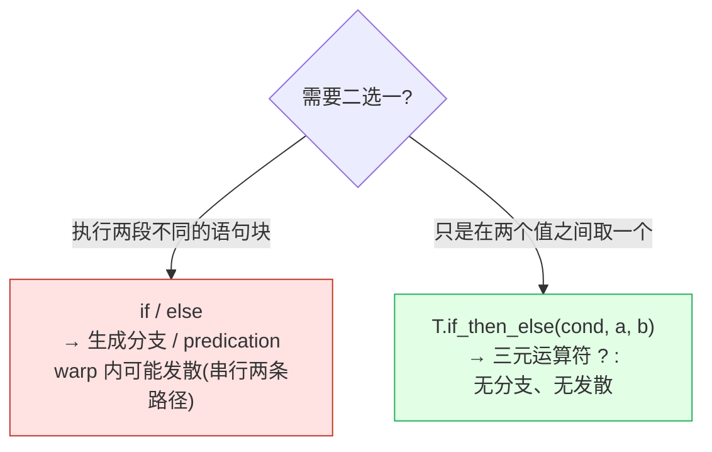
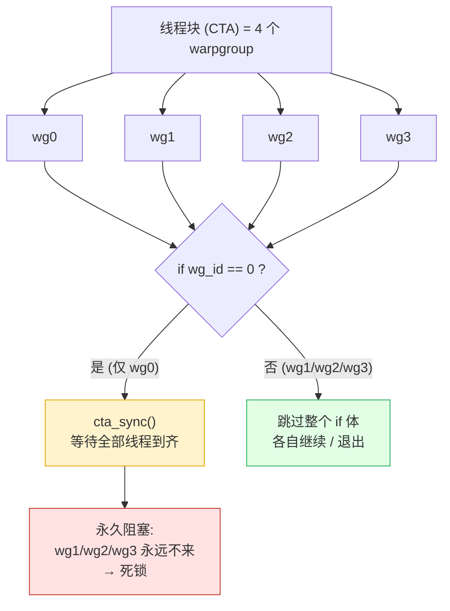
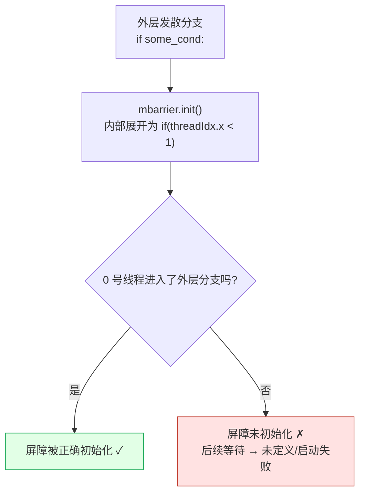

# 第 23 章 · 控制流

> 原文:[Control flow](https://mlc.ai/modern-gpu-programming-for-mlsys/tirx_guide/language_reference/cuda/control_flow.html)

> **本章要点(TL;DR)**
> - TileIR(TIR-X)里的控制流就三大类:`if`/`else` 分支、循环家族(`T.serial` / `T.unroll` / `T.vectorized` / `T.grid`),还有 `while`。每一类都会被「直白地」降级(lower)成对应的 CUDA C++ 写法。
> - 想在两个值之间二选一,用 `T.if_then_else(cond, a, b)`。它降级成三元运算符 `? :`,**不产生分支、也不引入控制流发散(divergence)**,做 ReLU 这类逐元素取舍很合适。
> - 一定要分清**统一控制流(uniform control flow)**和**发散控制流(divergent control flow)**:逐线程的 `if tx < 128` 用来做普通计算没问题;但**集体操作(collective op)**(比如 `__syncthreads()`)必须被所有参与同步的线程**统一**到达,否则会死锁。
> - `T.cuda.cta_sync()`(= `__syncthreads()`)绝不能放进任何线程级或 warpgroup 级发散的分支。只想同步单个 warpgroup 时,改用 `T.cuda.warpgroup_sync(id)`。还有 `mbarrier.init()` 这种「单线程守护」式的初始化,同样不能嵌进发散分支,否则屏障可能根本没被初始化。
> - `while` 靠一个可变标量计数器实现,底层降级成 `while(1) + 提前 break`,而这个计数器其实是个单元素寄存器缓冲区(register buffer)。

> **前置知识**:读这一章前,最好先懂 GPU 的线程层级(thread / warp / lane / CTA / warpgroup)和「同步」这个概念。没把握的话,先翻一下 [第 0 章 · 极简入门](./ch00_gpu_ml_primer.md)。本章会默认你已经认识这些词。

---

这一章是「第五部分 · 参考与附录」里的语言参考(language reference)。它干的事很简单:把 TileIR 这门 DSL 的控制流原语,一个一个跟它生成的 CUDA C++/PTX 代码对上号。这么一来,你不光会写,脑子里还能预判出生成的代码长什么样。

这事为什么值得单独讲?因为 TileIR 不是「黑盒」。你写的每一条控制流语句,几乎都能直接对应到一段 CUDA。说白了,看 TileIR 代码,你基本就能想象出底层会生成什么。

篇幅不长,但里头有一节——**统一控制流 vs 发散控制流**——是 GPU 编程里最容易翻车的地方,我们重点讲透它。

下面先把语法原语一个个过一遍,再单独深挖「发散」这个大坑。

## 一、`if` / `else`:分支

这是最省心的一种:你在 TileIR 里写的 Python `if` / `else`,原封不动就变成 CUDA 的 `if` / `else`,中间什么转换都没有。

最常见的玩法,是**拿线程号或 lane 号(lane = 一个线程在它所属 warp 里的编号,0~31)当「守护(guard)」**,让不同线程各走各的路:

```python
# TileIR 写法:按线程号划分两段不同的工作
if tx < 128:
    A[tx] = A[tx] * T.float32(2.0)   # 前 128 个线程:乘 2
else:
    A[tx] = A[tx] + T.float32(1.0)   # 其余线程:加 1
```

降级后的 CUDA C++ 跟它一模一样,一行对一行:

```c++
if (((int)threadIdx.x) < 128) {
  A_ptr[tx] = A_ptr[tx] * 2.0f;
} else {
  A_ptr[tx] = A_ptr[tx] + 1.0f;
}
```

没有任何魔法:`tx` 就是 `threadIdx.x`,`T.float32(2.0)` 就是字面量 `2.0f`,一个对一个。

不过有一点你得先记牢:这种逐线程的 `if`,会让同一个线程束(warp = 32 个线程组成的小班,GPU 调度和执行的基本单位,见第 0 章)里的不同 lane 走上不同的分支。这就是所谓的「发散(divergence)」。

发散可怕吗?看情况:
- 普通的逐元素计算里,它一点事没有。硬件无非是把两条分支**前后各跑一遍**,顶多吞吐掉一点。
- 可一旦碰上「集体操作」,发散就是禁区了——这正是第二节要重点讲的坑。

### 选举单个发射线程:`T.ptx.elect_sync()`

先说它是来解决什么问题的。有些指令,只要**一个线程**去触发就够了,典型的就是发起 TMA(Tensor Memory Accelerator)拷贝、或者 MMA(矩阵乘累加)。这类指令本身就是 warp 级、甚至更大粒度的,一个线程发一次,整个 warp 都跟着受益。要是让 warp 里 32 个 lane 全都发一遍,那就错了。

所以我们得想个办法,**从一个 warp 里挑出唯一一个 lane** 来干这件事。这就是 `T.ptx.elect_sync()` 的活儿:

```python
if T.ptx.elect_sync():
    ...   # 被选中的那一个 lane(例如用来发起 TMA / MMA)
```

它是怎么干的呢?在一个同步点上,它从当前活跃的 lane 里确定性地点出一个来,给这个 lane 返回 `true`,其余所有 lane 一律返回 `false`。你把它塞进 `if` 的条件,就写成了「只让一个线程发射」这个惯用套路。

> **关键**:`elect_sync()` 选的是 warp 内部的「代表」,它的作用范围也只到 warp **里面**。这个 warp 里所有活跃的 lane 都会执行到这条语句,只是被点中的那个拿到 `true`,别人拿到 `false`——选举在 warp 内部就尘埃落定了。注意,它管的「全员」最多到一个 warp,可不是整个线程块。所以它跟后面要讲的「CTA 级集体操作必须全员统一到达」(CTA / thread block = 一个线程块,跑在同一个 SM 上、能共享 SMEM 并互相同步的一组线程,见第 0 章)压根是两码事,千万别搞混。

### 表达式级选择:`T.if_then_else`,无分支

有时候你压根不想跑两段不同的代码,只是想在「两个值里挑一个」。这种时候,`T.if_then_else(cond, a, b)` 才是对的选择。

它好在哪?**它不生成 `if` 分支,而是降级成 C 的三元运算符 `cond ? a : b`**。

```c++
// 例如 ReLU:大于 0 取原值,否则取 0,无分支
O_ptr[tx] = (A_ptr[tx] > 0.0f) ? A_ptr[tx] : 0.0f;
```

> **这两种写法为什么要分开?** 关键在编译器和硬件拿它们怎么办:
> - 写成 `if`/`else`:编译器一般会生成真正的分支,或者用谓词执行(predication)。只要 warp 里的 lane 走了不同的路,就发散了,两条路径得串行各跑一遍。
> - 写成三元运算符:编译器通常生成一条 `select` 类指令(条件传送 / `selp`)。**所有 lane 跑的是同一条指令流**,只是结果按条件来挑。既不发散,也不用串行两条路径。
>
> 所以一条原则:凡是能写成一个表达式的逐元素取舍——clamp、relu、`max(0,x)`、掩码取值这些——一律优先用 `T.if_then_else`。代码更紧凑,性能也更好预测。

下面拿一张图把这两条路对比一下:



## 二、统一控制流 vs 发散控制流(核心)

这一节是全章的核心,也是 GPU 死锁(deadlock)最常冒出来的地方。先把两个概念掰开说清楚:

| 概念 | 含义 | 对应原语示例 | 放进发散分支会怎样 |
| --- | --- | --- | --- |
| 普通逐线程工作 | 每个线程独立算自己的,互不依赖 | `A[tx] = ...`,逐元素运算 | 没问题,顶多是性能上的发散开销 |
| **集体操作(collective op)** | 一组线程必须「一起」到达并参与同步 | `T.cuda.cta_sync()`(=`__syncthreads()`)、屏障操作 | **可能死锁或未定义行为** |

核心规则,一句话:

> **集体操作要被它同步的每一个线程「统一(uniformly)」地走到——绝不能藏在只有一部分线程会进去的发散分支里。**

### 经典死锁:把 `cta_sync()` 放进发散分支

`T.cuda.cta_sync()` 降级成 `__syncthreads()`。它有个硬性要求:**线程块(CTA / thread block)里的每一个线程**都得走到这个同步点,大家才能一块儿往下走。

来看个反面例子——把它塞进一个按 warpgroup(warpgroup = 若干个连续 warp 打包成的一组,Hopper 之后常见的同步/分工粒度)划分的分支里:

```python
# 反面教材:会死锁!
if wg_id == 0:
    T.cuda.cta_sync()   # 只有 warpgroup 0 的线程会到达这里
    ...
```

问题出在哪?只有 warpgroup 0 的线程会进这个分支、走到屏障;别的 warpgroup 根本不会进来。结果 `__syncthreads()` 永远凑不齐所有线程,整个 kernel 就**永久卡死(死锁)**了。

下面这张图把这个坑画出来了:



> **注意**:死锁的病根不在「同步」本身,而在「**只有一部分线程会走到同步点**」。集体操作天生就带着「全员都得到场」的约定,而发散分支恰恰把这个约定给破坏了。

### 正确做法:用 warpgroup 作用域的同步

那要是你本来就想「**只让某一个 warpgroup 内部同步**」呢?那就别用 CTA 级的 `cta_sync()` 了,换成 **warpgroup 作用域**的同步原语:

```python
if wg_id == 0:
    T.cuda.warpgroup_sync(id)   # 只同步本 warpgroup,不要求其它 wg 参与
```

`T.cuda.warpgroup_sync(id)` 只在一个 warpgroup 内部立屏障,它要求的「全员」也只算这一个 warpgroup。所以把它放进 `if wg_id == 0:` 这种按 warpgroup 划分的分支里,反而是安全的——因为这个 warpgroup 的线程会**整整齐齐一起**进这个分支,没人会掉队。

> **关键区别**:
> - `cta_sync()` 的「全员」= 整个线程块的所有线程 → 不能放进发散分支。
> - `warpgroup_sync(id)` 的「全员」= 单个 warpgroup 的所有线程 → 可以放进「按 warpgroup 统一划分」的分支。
>
> 一句话:用哪个,就看你真正要同步的**范围**,跟分支的**划分粒度**对不对得上。原文还提到,warpgroup 级同步最典型的舞台,是「用 warp 专化(warp specialization)和 cluster(cluster = 多个线程块再打成一组、能跨块协作的更大单位,Hopper 引入)扩展 GEMM(General Matrix Multiply,通用矩阵乘法,深度学习里最核心的算子)」这类场景(细节看相关章节,还有 CUDA C++/PTX intrinsics 那一节)。

### 同样的坑:屏障初始化(`mbarrier.init`)

发散这个坑,不光在「同步」这一步会踩到,**屏障初始化**那一步同样危险。原文特意点了出来:`mbarrier`(内存屏障,专门用来给异步操作如 TMA 拷贝「等结果到齐」的一种屏障)的 `.init()` 会降级成一个**单线程守护**——只让一个线程去做初始化:

```c++
if (threadIdx.x < 1) {   // .init() 的本质:只让 0 号线程去初始化屏障
    /* 初始化 mbarrier */
}
```

注意,`.init()` 自己里头已经裹了一层 `if (threadIdx.x < 1)` 了。问题来了——你要是**再把它套进另一个发散分支里**,就可能闹出这么个尴尬局面:负责初始化的那个 0 号线程,偏偏没进外层那个分支。

那结果呢?屏障压根没初始化。后面任何对它的等待 / 到达操作,行为全是未定义的,最后表现出来就是**莫名其妙的启动失败(unspecified launch failures)**。



> **经验法则**:凡是带「集体语义」或「单线程守护语义」的原语——同步、屏障初始化、TMA/MMA 发射准备这些——都得保证它们待在**所有相关线程都会统一走到**的位置。要么搁在所有线程都会经过的直线代码里,要么搁在「按同样粒度统一划分」的分支里。一旦把它们跟普通的逐元素发散分支搅在一块,基本就是必出问题。

## 三、循环家族

TileIR 的循环有**四种口味**。你平时写的那个普通 Python `range`,默认对应的就是其中的 `T.serial`:

| 原语 | 语义 | 降级结果 / 用途 |
| --- | --- | --- |
| `T.serial(n)` | 顺序循环 | 生成普通 `for`;ptxas 仍**可能**自行展开(unroll) |
| `T.unroll(n)` | 完全展开 | 编译期**完全展开**为直线语句,没有循环结构 |
| `T.vectorized(n)` | 向量化循环 | 生成向量化访存/计算 |
| `T.grid(*extents)` | 嵌套循环巢 | 一次性写出多层嵌套 `for` |

`break` / `continue` 在这些循环里都照常能用。

### `T.grid`:一次写出嵌套循环

`T.grid(8, 8)` 其实就是两层嵌套 `for`,只不过写起来比手写嵌套清爽多了:

```python
for i, j in T.grid(8, 8):
    B[i, j] = T.max(A[i, j], T.float32(0.0))   # 二维 ReLU
```

它降级成标准的双层 `for`。这里有个细节:二维索引 `(i, j)` 被拉平成了 `i * 8 + j`:

```c++
for (int i = 0; i < 8; ++i)
  for (int j = 0; j < 8; ++j)
    B_ptr[i * 8 + j] = max(A_ptr[i * 8 + j], 0.0f);
```

### `T.serial` vs `T.unroll`:循环 vs 直线代码

这俩的区别,说白了就一句话:**循环结构到底留不留。**

| | `T.serial(4)`(保留循环) | `T.unroll(4)`(无循环,铺开 4 条语句) |
| --- | --- | --- |
| 生成代码 | `for (int k=0; k<4; ++k)`<br/>`  stmt(k);` | `stmt(k=0);`<br/>`stmt(k=1);`<br/>`stmt(k=2);`<br/>`stmt(k=3);` |
| 备注 | ptxas 仍可能自行 unroll | 在 IR 层就完全展开,无循环结构 |

- `T.serial(n)`:循环留着,代码也小。要不要再往下展开,扔给 ptxas 自己拿主意。
- `T.unroll(n)`:在 IR 这一层就**整个铺开**成 4 条直线语句,没有循环开销,也省了每一轮的条件判断。它常用在那种又小又固定的循环上(比如对寄存器分片做累加)。铺开之后,编译器做指令调度、常量折叠也更顺手。代价就是:代码变大,寄存器(register = 每个线程私有的、速度最快的小块存储,见第 0 章)压力可能往上走。

> **设计取舍**:展开的好处是甩掉循环控制开销、放出更多指令级并行(ILP);坏处是代码膨胀、吃更多寄存器。TileIR 干脆把「展开」做成一个**显式原语**,不全靠编译器去猜——这样这条性能和资源之间的取舍线,就攥在程序员自己手里了。

## 四、`while` 循环

`while` 循环会一直转,转到条件不成立才停。它得有一个**能改值的标量计数器**。

而在 TileIR 里,这种「可变标量」是拿一个「单元素寄存器缓冲区」来实现的(细节看「缓冲区与内存 / Buffers and memory」那一章,这里先不铺开):

```python
i: T.int32 = 0
while i < 64:
    A[i] = A[i] + T.float32(1.0)
    i += 1
```

它降级的路子有点意思:它不直接生成 `while (i < 64)`,而是生成一个 **`while (1)` 死循环,然后在循环一开头用 `break` 提前跳出来**。计数器 `i` 呢,被实现成了一个长度为 1 的寄存器数组 `i_ptr[1]`:

```c++
int i_ptr[1];
i_ptr[0] = 0;
while (1) {
  if (!(i_ptr[0] < 64)) { break; }              // 条件不满足就提前退出
  A_ptr[i_ptr[0]] = A_ptr[i_ptr[0]] + 1.0f;
  i_ptr[0] = i_ptr[0] + 1;                       // 计数器自增
}
```

> **为什么非得拿「单元素缓冲区」来装可变标量?** 这是 IR 设计闹的。在 TileIR 这类张量编译器 IR 里,值默认是**不能改**的(SSA 风格,一个值定义一回就钉死了)。可循环计数器偏偏得被一遍遍写回去,怎么办?最直接的招,就是把它当成一块**能读能写的存储**——也就是一个 1 元素的寄存器缓冲区。这么一来,`i += 1` 就成了对 `i_ptr[0]` 的「读—改—写」。这也就解释了,为什么 `while` 的计数器得显式声明成一个标量变量。

> **注意**:`while(1) + break` 这种降级法,功能上跟 `while(cond)` 一模一样,无非是把条件检查统一搬到了循环体的最前头。明白这点,对你读懂生成的代码、还有在 PTX/SASS 层面调试,都挺有帮助。

## 小结

- TileIR 的控制流「所见即所得」:`if`/`else`、四种循环、`while`,全都直白地映射到 CUDA C++。看着 TileIR 代码,你基本就能猜出生成的代码长啥样。
- **逐元素取舍,优先用 `T.if_then_else`**:它降级成三元运算符,不分支、不发散,拿来做 ReLU、clamp、掩码这类逐元素逻辑再合适不过。
- **全章最该记住的,是「统一 vs 发散控制流」**:集体操作(像 `cta_sync()`)和单线程守护(像 `mbarrier.init()`),都得被参与的线程**统一走到**,绝不能藏进发散分支,不然不是死锁就是莫名其妙的启动失败。要更细粒度的同步,就换 `warpgroup_sync(id)` 这种作用域更窄的原语,并且保证「分支怎么划分」和「同步管多大范围」对得上。
- 循环原语把「展不展开 / 向不向量化 / 怎么嵌套」全都摆成了**明牌**,让程序员自己去权衡性能和资源。`T.unroll` 和 `T.serial` 的区别,归根结底就是「循环结构留不留」。
- `while` 拿一个单元素寄存器缓冲区来装可变计数器,降级成 `while(1) + 提前 break`。在「IR 的值不能改」这个前提下,这是表达可变状态最自然的办法。

## 延伸阅读

- 原文:[Control flow — Modern GPU Programming for MLSys](https://mlc.ai/modern-gpu-programming-for-mlsys/tirx_guide/language_reference/cuda/control_flow.html)
- 相关章节(原文交叉引用):「Scaling GEMM with Warp Specialization and Clusters」(warp 专化与 cluster 扩展 GEMM)、「CUDA C++/PTX intrinsics」(内建函数)、「Buffers and memory」(缓冲区与内存)。

## 术语对照

| 中文 | English | 说明 |
| --- | --- | --- |
| 控制流 | control flow | `if` / 循环 / `while` |
| 发散(控制流) | divergence / divergent control flow | warp 内 lane 走不同分支 |
| 统一控制流 | uniform control flow | 所有相关线程一致到达 |
| 集体操作 | collective operation | 需全员参与的操作(如同步) |
| 守护 | guard | 用条件限制某段代码的执行 |
| 选举(单线程) | elect (`elect_sync`) | warp 内选出唯一发射 lane |
| 谓词执行 | predication | 用条件位控制指令是否生效 |
| 完全展开 | unroll | 把循环铺开为直线语句 |
| 向量化 | vectorize | 单指令处理多元素 |
| 死锁 | deadlock | 屏障等不齐全部线程而永久阻塞 |
| 线程块 | CTA / thread block | `__syncthreads()` 的同步范围 |
| 线程束 | warp | 32 lane 的调度/执行单元 |
| warpgroup | warpgroup | 多个 warp 组成的同步单元 |
| 内存屏障 | mbarrier | 异步操作的同步屏障 |
| 寄存器缓冲区 | register buffer | 承载可变标量的 1 元素存储 |
