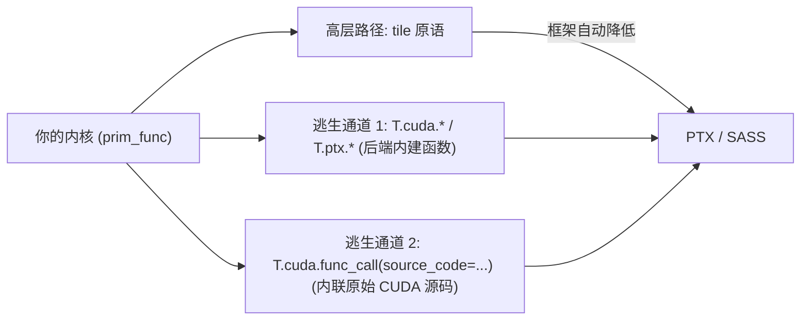
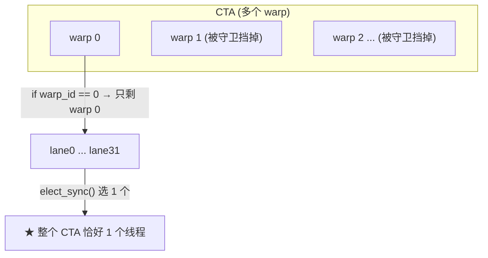
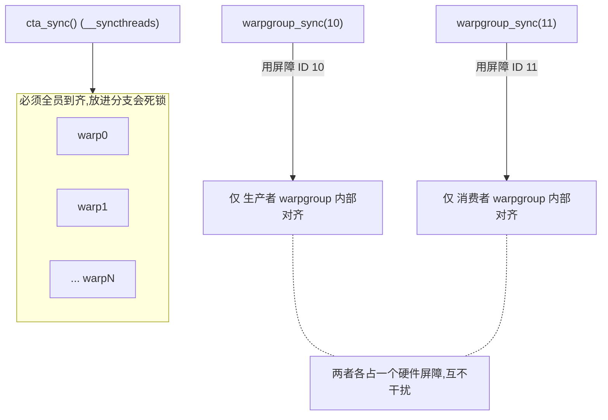
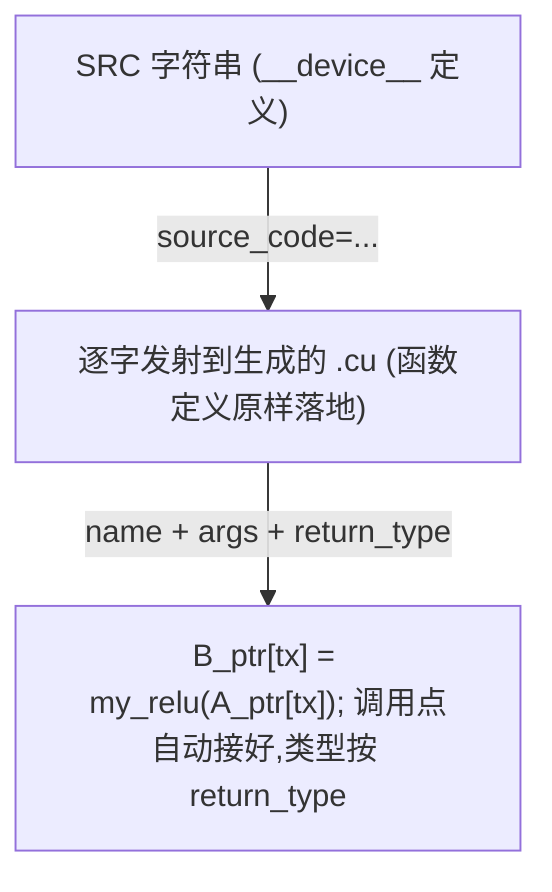

# 第 24 章 · CUDA C++ / PTX intrinsics

> 原文:[CUDA C++/PTX intrinsics](https://mlc.ai/modern-gpu-programming-for-mlsys/tirx_guide/language_reference/cuda/threads_sync.html)

> **本章要点(TL;DR)**
> - 平时我们写内核,用的都是高层的 **tile 原语 / tile primitive**。可有时候,你想要的那个硬件操作它表达不出来。这时候有两条「逃生通道」能让你直接捅到硬件:一条是**调用后端内建函数 / backend intrinsic**,也就是 `T.cuda.*` / `T.ptx.*` 这一堆命名空间;另一条是**内联一段原始 CUDA 源码**。
> - `T.cuda.*` / `T.ptx.*` 干的活其实很朴素:把 CUDA 后端的设备内建函数原封不动地端到你面前。同步、mbarrier、归约都有,还有 PTX 那套数据搬运和 MMA 家族(`cp_async`、TMA、`ldmatrix`、`tcgen05` 这些)。
> - 写 GEMM、Flash Attention 这类内核,你会反复碰到 **四类同步机制**:**mbarrier 相位 / phase**、**单线程选举 / election**、**具名 warpgroup 屏障 / named barrier**、**栅栏 / fence**。它们管的是异步引擎和一群并行的线程。坑在哪?用错了它一般不报错,而是直接给你静默损坏数据,或者干脆死锁。
> - 这四个里头,mbarrier 的相位坑藏得最深。同一个屏障要在循环里反复用,本地那个相位跟踪器每转一圈都得 `phase ^= 1`。一旦忘了翻,后面的等待会立刻返回——根本没等,放任引擎去读那块「才写了一半」的内存。
> - 万一连内建函数都凑不齐,还有最后一招:`T.cuda.func_call(..., source_code=..., return_type=...)`。你给它一段 `__device__` 源码,它原样塞进去,还顺手帮你把调用点接好。

> **前置知识**:读这一章前,最好先懂 GPU 的线程层级(warp / CTA / warpgroup)、异步引擎(TMA、异步 MMA)和屏障 / 同步这几个概念。没把握的话,先翻一下 [第 0 章 · 极简入门](./ch00_gpu_ml_primer.md)。本章会默认你已经认识这些词。

---

## 24.1 为什么需要「逃生通道」

这本教材从头到尾的主线,就是用高层的 **tile 原语** 来描述 GPU 内核。你只管声明数据布局、写 tile(把大矩阵切出来的小方块)这一层的计算,剩下的全交给框架——它会把你的代码降低 / lower 成高效的 PTX。这套抽象用起来很舒服,常见的那些套路(GEMM(通用矩阵乘法,深度学习里最核心的运算)、注意力(attention)、归约……)它基本都能包圆。

可问题来了:硬件跑得太快。Hopper(英伟达 GPU 架构代号,见第 0 章)刚出 TMA(张量内存加速器,一个专搬大块数据的异步引擎),Blackwell(更新一代架构)又甩出个 `tcgen05`。总有那么些新能力,tile 原语**还没来得及封**,或者**压根就不打算封**(太底层、太专用了)。遇上这种情况,你总不能被抽象「锁死」、干瞪眼吧。这一章讲的,就是怎么绕过抽象、直接捅到硬件,一共两条路:



> **关键**:这两条通道是来「补缺」的,不是来「顶替」tile 原语的。先后顺序很清楚:能用 tile 原语就用 tile 原语;原语够不着,才下沉到内建函数;内建函数也没有,才退到内联源码。记住一句话:越往下沉,框架帮你兜的底越少,正确性越得你自己扛——尤其是同步这块。

---

## 24.2 调用后端内建函数(backend intrinsics)

`T.cuda.*` 和 `T.ptx.*` 这两个命名空间(都来自 `tvm.backend.cuda`)干的事很直白:把 CUDA 后端的设备内建函数原封不动端给你。你能拿到的东西包括线程同步、mbarrier、归约(把一组数汇成一个值,比如求和),还有 PTX 那套数据搬运 / MMA(矩阵乘加,Tensor Core 干的活)家族。

### 24.2.1 常见入口一览

先看看最常用的那几类入口长啥样:

```python
T.cuda.cta_sync()                    # CTA(线程块)级屏障,等价于 __syncthreads()
T.cuda.warp_sync()                   # warp 级屏障,等价于 __syncwarp()
T.cuda.warpgroup_sync(8)             # warpgroup 屏障(具名屏障,见 24.3.3)
T.cuda.cta_sum(val, num_warps, scratch.ptr_to([0]))   # CTA 级归约求和

bar = T.alloc_shared((1,), "uint64") # mbarrier 必须放在共享内存里
T.ptx.mbarrier.init(bar.data, 1)     # 初始化 mbarrier,用于异步完成通知
T.ptx.mbarrier.try_wait(bar.data, phase)  # 按相位等待(注意相位语义,见 24.3.1)
```

一个一个说:

| 内建函数 | 作用 | 对应底层 |
| --- | --- | --- |
| `T.cuda.cta_sync()` | 整个 CTA(线程块)对齐 | `__syncthreads()` |
| `T.cuda.warp_sync()` | 一个 warp 内对齐 | `__syncwarp()` |
| `T.cuda.warpgroup_sync(id)` | 一个 warpgroup 对齐(走具名屏障) | 命名屏障(`bar.sync`) |
| `T.cuda.cta_sum(val, num_warps, scratch)` | CTA 级归约求和(需一块 scratch 共享内存做中转) | 多步 warp shuffle + 共享内存 |
| `T.ptx.mbarrier.init(bar, n)` | 把共享内存里的 mbarrier 初始化为期望 `n` 次到达 | `mbarrier.init` |
| `T.ptx.mbarrier.try_wait(bar, phase)` | 按相位非阻塞地等待屏障翻转 | `mbarrier.try_wait.parity` |

> **注意**:mbarrier 说白了就是 **共享内存 / SMEM** 里的一个 `uint64`。所以你得先用 `T.alloc_shared((1,), "uint64")` 给它腾块地方,再把 `.data`(也就是那根指针)递给 `init` / `try_wait`。它专门干一件事:等**异步引擎**(像 TMA 拷贝、异步 MMA)把活干完。到了 Hopper/Blackwell 这代,异步流水线(让搬数据和算数据重叠起来跑,互相不等)的同步全靠它,算得上是顶梁柱级别的原语。

### 24.2.2 完整可运行示例:warp 内 all-reduce

原文给了个例子:用 `T.tvm_warp_shuffle_xor` 做「warp(一个 warp = 32 个线程的小班,齐步走,见第 0 章)内全归约求和」。要搞懂 shuffle 内建函数,这个例子是再合适不过了。咱们先看代码,然后一点点把思路捋清楚:

```python
@T.prim_func
def warp_reduce(A_ptr: T.handle):
    A = T.match_buffer(A_ptr, (32,), "float32", align=16)
    T.device_entry()
    # 取当前线程的三层身份:CTA 号 / warp 号 / lane 号(0..31)
    cta_id = T.cta_id([1]); warp_id = T.warp_id([1]); lane_id = T.lane_id([32])
    v = T.alloc_local((1,), "float32"); i = T.alloc_local((1,), "int32")
    v[0] = T.float32(31 - lane_id)   # 每个 lane 放一个初值(便于验证结果)
    i[0] = 16                        # 蝶形归约的初始步长 = 32/2
    while i[0] >= 1:
        # 关键:与「相距 i 个位置」的 lane 交换并相加 —— 蝶形(butterfly)归约
        v[0] += T.tvm_warp_shuffle_xor(0xFFFFFFFF, v[0], i[0], 32, 32)
        i[0] = i[0] // 2             # 步长折半:16 -> 8 -> 4 -> 2 -> 1
    A[lane_id] = v[0]                # 归约完成后,全部 32 个 lane 持有同一个和
```

**核心思路:蝶形归约 / butterfly reduction**。先给个直觉:它就是「两两配对、交换相加,然后步长一层层折半」这么个求和办法,5 步下来,32 个 lane(lane = warp 里每个线程的编号,0~31)个个都攒齐了总和。

`__shfl_xor_sync` 妙就妙在配对的方式上。每个 lane 都跟「自己 lane 号异或 `i`」算出来的那个 lane 换数据。`i` 一路取 `16, 8, 4, 2, 1`,信息 5 步就传遍整个 warp。最后的效果是:**32 个 lane 全都拿到同一个总和**,而不是只有 lane 0 一家拿到。它叫「all-reduce」(全归约),原因就在这儿。

warp 内 32 个 lane 的蝶形归约(以步长 `i` 的变化为例):

| 步长 `i` | 配对(lane ⇄ 异或 i 得到的 lane) |
| --- | --- |
| `i=16` | lane 0 ⇄ lane 16, lane 1 ⇄ lane 17, ..., lane 15 ⇄ lane 31 |
| `i=8` | lane 0 ⇄ lane 8, lane 1 ⇄ lane 9, ... |
| `i=4` | lane 0 ⇄ lane 4, ... |
| `i=2` | lane 0 ⇄ lane 2, ... |
| `i=1` | lane 0 ⇄ lane 1, ... |

5 步走完后,所有 lane 持有相同的最终和(all-reduce,不是单点 reduce)。

这个 `T.tvm_warp_shuffle_xor`,框架会把它**原样降低**成对应的 CUDA 内建函数 `__shfl_xor_sync`,基本就是一对一的直译:

```c++
// 框架生成的 C++,几乎是一行直译
v_ptr[0] = v_ptr[0] + __shfl_xor_sync(0xFFFFFFFF, v_ptr[0], i_ptr[0], 32);
```

> **注意**:第一个参数 `0xFFFFFFFF` 是 **lane 掩码 / lane mask**,意思是「32 个 lane 一个不落,全都参与」。后缀 `_sync` 表示这是带同步语义的 shuffle——掩码里点到名的 lane 必须**全部到齐**,少一个,行为就是未定义的。为啥要这么设计?因为从 Volta 这代起,GPU 上了独立线程调度 / independent thread scheduling,warp 里的线程不再保证齐步走了。这么一来,老版本那种不带 `_sync` 后缀的 shuffle 就不安全了;新版本补上同步语义,才靠谱。

### 24.2.3 其它内建函数家族

同步和 shuffle 只是冰山一角。`T.ptx.*` / `T.cuda.*` 底下,还藏着一大堆跟数据搬运、矩阵乘法有关的家族:

| 家族 | 含义 | 典型用途 |
| --- | --- | --- |
| `cp_async`(LDGSTS) | 全局内存到共享内存的异步拷贝 | 软件流水线预取 tile |
| `cp_async.bulk.tensor`(TMA) | 张量内存加速器(Tensor Memory Accelerator)批量拷贝 | Hopper 上的大块 tile 搬运 |
| `ldmatrix` / `stmatrix` | 从/向共享内存按 MMA 所需布局加载/存储矩阵片 | 喂给/取出 Tensor Core |
| `tcgen05.*` | Blackwell 上的第 5 代 Tensor Core MMA | Blackwell GEMM |
| `atomic_add` | 原子加 | 跨线程累加 |
| `fence` | 内存栅栏 | 跨代理(proxy)的访存定序(见 24.3.4) |

> **关键**:这些名字摆在一起,其实就是一张「硬件能力地图」——每一族对应一代架构。`cp_async` 是 Ampere 那代的,TMA(`cp_async.bulk.tensor`)是 Hopper 的,`tcgen05.*` 是 Blackwell 的。说白了,你能用上哪一族,看的就是你的目标架构是哪一代。想要完整清单,去翻 `tvm.backend.cuda` 的后端 API 参考。

---

## 24.3 同步语义(synchronization semantics)

这一节是全章最硬的骨头,读慢点。写 GEMM 和 Flash Attention 内核,有四类同步机制**翻来覆去地出现**。它们管的是**异步引擎**和**一群并行的线程**。可怕在哪?用错了,程序不会跳出来给你报错,而是直接**静默损坏数据 / silent corruption,或者死锁 / deadlock**。这是最折磨人的一类 bug——你连它错在哪儿都摸不着。

### 24.3.1 mbarrier 相位(Mbarrier Phases)

先建个直觉:mbarrier 内部带着**一个相位位 / phase bit**,它就靠这一位来记「大家到齐了没」。每凑齐一轮,这一位就翻一次。

`T.ptx.mbarrier.try_wait(bar, phase)` 是什么意思呢?

> **它会一直阻塞,直到屏障内部的相位跟你传进去的 `phase` 参数「不一样」为止。**

换句话说:你传的那个 `phase`,代表「我上回看到的相位」,而函数等的就是「相位翻过去了」这件事。等待一旦成功返回,屏障内部的相位也就从 `phase` 变成了 `phase ^ 1`。

**这里埋了个经典的坑**。你要是在**循环里反复用同一个屏障**,那每等完一轮,**必须把本地这个相位跟踪器翻一下**,也就是 `phase ^= 1`。不翻会怎样?来看一遍:

- 第一次 `try_wait(bar, 0)`:屏障翻到 1,顺顺当当等到,没毛病。
- 可你忘了翻,第二次还是传 `try_wait(bar, 0)`。这会儿屏障内部早就是 1 了,「跟 0 不一样」这个条件**当场就成立**,于是函数**扭头就返回**,压根没真等。
- 结果就是:生产者还没写完呢,消费者就抢跑去读——**读到那块「才写了一半」的内存 / half-written memory**,数据就这么悄没声地坏掉了。

正确的相位跟踪(每轮都翻转本地 `phase`):

| 迭代 | 进入时本地 phase | 调用 | 等待结果 | 收尾 `phase ^= 1` |
| --- | --- | --- | --- | --- |
| 0 | 0 | `try_wait(bar, 0)` | 等到屏障翻到 1 | phase = 1 |
| 1 | 1 | `try_wait(bar, 1)` | 等到屏障翻到 0 | phase = 0 |
| 2 | 0 | `try_wait(bar, 0)` | 等到屏障翻到 1 | ... |

错误示范(忘了翻转本地 phase):

| 迭代 | 进入时本地 phase | 调用 | 实际发生 |
| --- | --- | --- | --- |
| 1 | 0(应为 1) | `try_wait(bar, 0)` | 屏障已是 1,「≠0」当场成立 → 不等就返回!消费者抢跑 → 读到生产者「写了一半」的数据 → 静默损坏 |

> **关键**:就记一句——相位是用来「**看有没有翻转**」的,不是用来「数数」的。你本地维护的那个 `phase` 其实就是个布尔值,代表「我知道的最新相位是几」。每完整等过一轮,就把它取个反。原文「Building a Tiled GEMM」那章会把相位跟踪表整个走一遍,想看实战就去那儿。

### 24.3.2 单线程选举(Election)

`T.ptx.elect_sync()` 干的事,是从 **一个 warp 里的活跃 lane** 里挑出一个来。有三个常见的误会得先掰扯清楚,它**不是**你想的那样:

- **不是 lane 0**。到底选中谁,硬件说了算,你别想当然以为是 0 号。
- **不是每个 CTA 一个线程**。它选举的范围只到 warp 这一级,管不到整个 CTA。
- 它只在**活跃 lane / active lanes** 里头挑。被分支掩掉、没在跑的 lane,不参与。

那问题来了:你要是想让某个操作**整个 CTA 里只由一个线程**去发起(比方发起一次 TMA、提交一次 MMA),光靠 `elect_sync()` 行不行?不行。因为它给你的是「每个 warp 一个」,而一个 CTA 里有好几个 warp,这就选出来好几个了。怎么办?再套一层 **warp 级守卫 / warp-level guard**:

```python
if warp_id == 0:            # 守卫一:只让 0 号 warp 进入
    if T.ptx.elect_sync():  # 守卫二:在这个 warp 内再选出唯一一个 lane
        # 此时:整个 CTA 中恰好一个线程在执行
        Tx.gemm_async(...)      # 例如发起异步 GEMM
        # tcgen05.commit(...)   # 例如提交 Blackwell MMA
```



> **注意**:为啥非得「恰好一个线程」不可?因为 `gemm_async` / `tcgen05.commit` 这类指令,是**冲着异步引擎下命令**去的,同一条命令发一遍就够了。要是放任好几个线程一起发,轻的是重复发起,重的直接给你未定义行为。所以「先用 `if warp_id == 0` 守一道,再用 `elect_sync()` 挑一个」,就是把「一大堆线程在跑」稳稳收成「单个线程发令」的标准套路,以后照抄就行。

### 24.3.3 具名 warpgroup 屏障(Named Warpgroup Barriers)

先回顾一下:`T.cuda.cta_sync()` 对应的是 `__syncthreads()`,它非得 **CTA 里每个线程都到齐**了才放行。要是内核里所有线程跑的都是同一套代码(没做 warp 特化),这倒没啥问题。

可一旦你上了 **warpgroup 特化 / warp specialization**(warpgroup = 4 个 warp 抱团,Hopper 起的概念;warp 特化 = 让不同的线程组各干各的专职活)——也就是不同的 warpgroup 走不同的代码路径(最典型的,就是「生产者 warpgroup 专管搬数据,消费者 warpgroup 专管算 MMA」)——麻烦就来了。这时候你要是把 `cta_sync()` 塞进**某个 warpgroup 的分支里头**,直接**死锁**给你看。道理不难:别的 warpgroup 走的是另一条岔路,**压根就不会跑到**这个 `cta_sync()`;偏偏 `__syncthreads()` 又非要等齐所有人。于是大家你等我我等你,谁也动不了。

硬件早给这事备好了解法:**16 个具名屏障 / named barriers,编号 0~15**。`T.cuda.warpgroup_sync(10)` 只同步**某一个 warpgroup 内部**的线程,别的 warpgroup 它一概不管:

```python
# 不同 warpgroup 必须用不同的屏障 ID,避免「撞车」到同一个硬件屏障上
T.cuda.warpgroup_sync(wg_id + 10)   # 例如 wg_id=0 用 10,wg_id=1 用 11 ...
```



| 对比 | `cta_sync()` | `warpgroup_sync(id)` |
| --- | --- | --- |
| 同步范围 | 整个 CTA 的所有线程 | 单个 warpgroup 内的线程 |
| 底层 | `__syncthreads()` | 16 个具名屏障之一 |
| 放进 warpgroup 分支里 | **死锁** | 安全(其它 warpgroup 不受影响) |
| ID 管理 | 无需 | **必须给不同 warpgroup 分配不同 ID** |

> **关键**:具名屏障的 ID 是**有限的硬件资源,拢共就 16 个**。你得跟分配寄存器(每个线程私有的最快存储,数量很少)似的,规划着用,千万别让两个 warpgroup 撞到同一个号上。原文那句 `warpgroup_sync(wg_id + 10)` 是个小巧的手法:拿 warpgroup 自己的编号去算屏障号,这样每个 warpgroup 自动就分到一个**独一无二、不打架**的号。实战怎么用,见原文「Scaling GEMM with Warp Specialization and Clusters」那章。

### 24.3.4 栅栏(Fences)

栅栏管的是**定序 / ordering**:它保证「生产者先写」「消费者(往往是某个异步引擎)后读」这个先后顺序不会被打乱。

别拿它跟屏障弄混。一句话区分:屏障管的是「等大家到齐」,栅栏管的是「我写下的东西,后面的读者一定看得见,而且顺序没乱」。

原文列了三种栅栏:

| 栅栏 | 它保证的定序 |
| --- | --- |
| `T.ptx.fence.proxy_async("shared::cta")` | 让「线程写进共享内存的东西」,能被**异步代理(async proxy)**(比如 TMA store、MMA)随后读到。普通线程访存和异步引擎访存走的是不同的「代理」,得靠这道栅栏把两边接上。 |
| `T.ptx.fence.mbarrier_init()` | 保证 mbarrier 的**初始化**排在前头,任何对这个屏障的到达(arrive)或等待(wait)都在它之后。不然别的线程可能在屏障还没建好的时候就去用了。 |
| `T.ptx.tcgen05.fence.after_thread_sync()` | 在 `tcgen05` 写回(writeback)这条边上,加一道**偏保守的定序栅栏**。原文说它出现在「Step 8 和 Step 9」,而且 **在 TMA→MMA 这条路径上用不着**。 |

> **注意**:要搞懂 `fence.proxy_async`,关键是「代理 / proxy」这个词。在 Hopper/Blackwell 上,**普通线程的访存**和**异步引擎(TMA/MMA)的访存**,被当成两条各走各的内存「代理」通道。它俩各管各的可见性顺序,谁也不知道对方写了啥。所以你哪怕 `__syncthreads()` 一下,也没法跨代理保证「写完了才读」。`fence.proxy_async("shared::cta")` 干的就是把这两条代理通道接通,在 CTA 共享内存这个范围里硬把顺序定下来。

> **关键**:第三种栅栏 `tcgen05.fence.after_thread_sync()`,原文白纸黑字说它「偏保守 / conservative」,而且「TMA→MMA 这条路径上用不到」。这给我们提了个醒:栅栏不是白来的,它有性能开销,**不能见缝就往里插**。该加的地方(`tcgen05` 写回)加上,不该加的地方(TMA→MMA)就省掉——这样既不出错,又不白白搭上性能。

---

## 24.4 内联原始 CUDA(Inlining raw CUDA)

万一你要的功能**连内建函数都没有**,别急,还有最后一招:用 `T.cuda.func_call` 把一段 `__device__` 源码**原样塞进去**,调用点框架会帮你自动接好。

```python
SRC = r"""
__device__ __forceinline__ float my_relu(float x) { return x > 0.f ? x : 0.f; }
"""

@T.prim_func
def k(A_ptr: T.handle, B_ptr: T.handle):
    A = T.match_buffer(A_ptr, (256,), "float32")
    B = T.match_buffer(B_ptr, (256,), "float32")
    T.device_entry(); bx = T.cta_id([1]); tx = T.thread_id([256])
    # 调用注入的设备函数:名字 + 实参 + 源码 + 返回类型
    B[tx] = T.cuda.func_call("my_relu", A[tx], source_code=SRC, return_type="float32")
```

`func_call` 有四个要紧的参数:

- **`name`**:你要调用的那个设备函数叫啥。注意,它得跟 `source_code` 里定义的名字对上。
- **`*args`**:递给它的实参,这里就是 `A[tx]`。
- **`source_code=...`**:一段源码字符串,框架会**一字不改地 / verbatim 发射**到生成的代码里。
- **`return_type=...`**:返回类型,框架靠它把调用的结果接回表达式,这里是 `"float32"`。

降低之后的 C++ 大概是这副样子——源码原样落地,调用点自动接上:

```c++
__device__ __forceinline__ float my_relu(float x) { return x > 0.f ? x : 0.f; }
// ...
B_ptr[tx] = my_relu(A_ptr[tx]);   // 调用点由框架自动生成
```



> **注意**:这是逃生通道里最底下的一档,动手前先想清楚。源码**一字不改地发射**,反过来说就是:除了类型推断,框架几乎啥检查、啥兜底都不给你做。拼写有没有错、函数签名对不对、`__forceinline__` 这类修饰加没加,全得你自己写对。所以但凡 `T.cuda.*` / `T.ptx.*` 内建函数能办的事,就别退到这一层来。

---

## 小结

- 本章给了你两条**直达硬件**的逃生通道。它俩的定位是一样的:tile 原语够不着时,拿来补缺。
  1. **后端内建函数** `T.cuda.*` / `T.ptx.*`——同步、mbarrier、归约、shuffle,加上 `cp_async`/TMA/`ldmatrix`/`tcgen05` 这些数据搬运和 MMA 家族,基本就是一条通往 CUDA/PTX 设备内建函数的直通车。
  2. **内联原始 CUDA** `T.cuda.func_call(source_code=...)`——连内建函数都没有时的最后兜底,把 `__device__` 源码一字不改地塞进去。
- **本章最大的雷区,是同步语义**。四个机制,每个都各自带着一个「最容易踩」的坑:

| 机制 | 一句话记忆 | 最容易踩的坑 |
| --- | --- | --- |
| mbarrier 相位 | `try_wait` 等的是相位「翻转」 | 循环复用时忘了 `phase ^= 1` → 不等就返回 → 读半写内存 |
| 单线程选举 | `elect_sync()` 是「每 warp 一个」 | 误以为是 lane 0 / 每 CTA 一个;需配 `if warp_id == 0` 守卫 |
| 具名 warpgroup 屏障 | 只同步本 warpgroup,共 16 个 | `cta_sync()` 放进 warpgroup 分支 → 死锁;ID 撞车 → 互相干扰 |
| 栅栏 | 定序「写在前、读在后」 | 跨代理(proxy)不加栅栏 → 异步引擎读到旧值;乱加 → 损性能 |

- 最后送你一个统一的心智模型:**逃生通道越往下沉,框架帮你兜的底就越少**。从 tile 原语 → 内建函数 → 内联源码,正确性的担子一级一级往你自己肩上压。尤其是异步和同步的定序,千万别凭感觉瞎写,一定对着实战章节里的相位跟踪表和栅栏摆放规则来。

## 延伸阅读

- 原文链接:[CUDA C++/PTX intrinsics](https://mlc.ai/modern-gpu-programming-for-mlsys/tirx_guide/language_reference/cuda/threads_sync.html)
- 原文交叉引用的实战章节(用于把本章机制落地):
  - **Building a Tiled GEMM** —— 完整走一遍 mbarrier 相位跟踪表,以及 `elect_sync()` + warp 守卫发起 `gemm_async` / `tcgen05.commit`。
  - **Scaling GEMM with Warp Specialization and Clusters** —— 具名 warpgroup 屏障在 warp 特化下的用法与 ID 规划。
- `tvm.backend.cuda` 后端 API 参考 —— `T.cuda.*` / `T.ptx.*` 全部内建函数的完整清单。

## 术语对照

| 中文 | English |
| --- | --- |
| 后端内建函数 | backend intrinsic |
| tile 原语 | tile primitive |
| 线程束 | warp |
| 线程束组 | warpgroup |
| 共享内存 | SMEM(shared memory) |
| 线程块 | CTA(thread block) |
| 蝶形归约 | butterfly reduction |
| 全归约 | all-reduce |
| 通道(lane) | lane |
| 通道掩码 | lane mask |
| 相位 | phase(mbarrier phase) |
| 单线程选举 | election(`elect_sync`) |
| 具名屏障 | named barrier |
| 栅栏 | fence |
| 异步代理 | async proxy |
| 张量内存加速器 | TMA(Tensor Memory Accelerator) |
| 静默数据损坏 | silent corruption |
| 死锁 | deadlock |
| warp 特化 | warp specialization |
